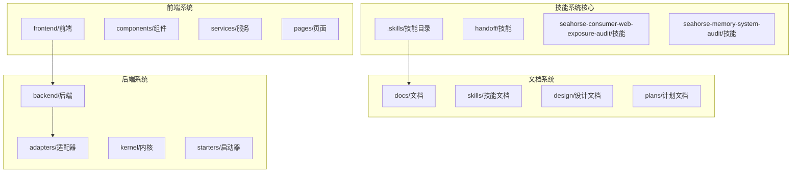
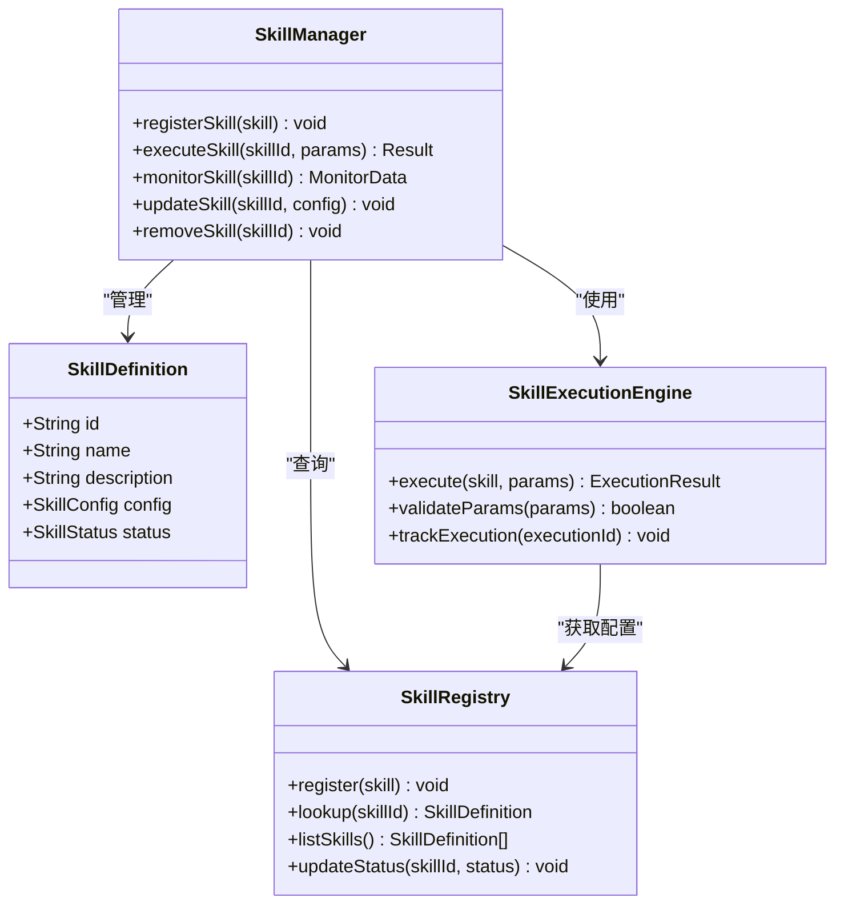
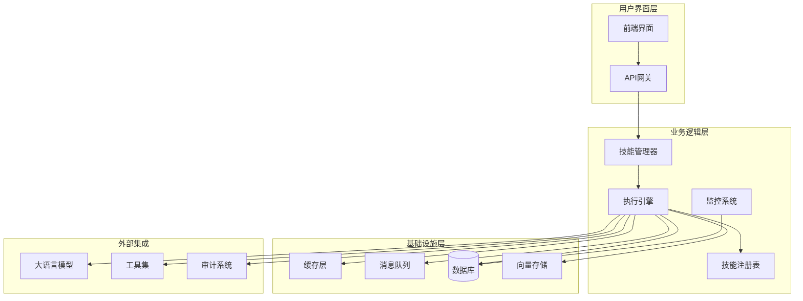
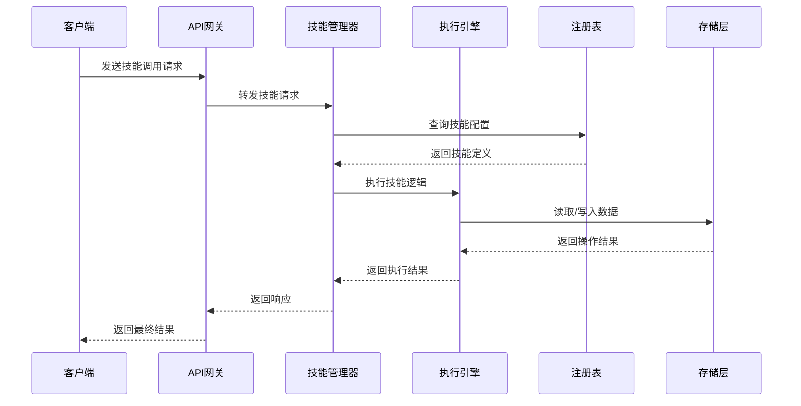
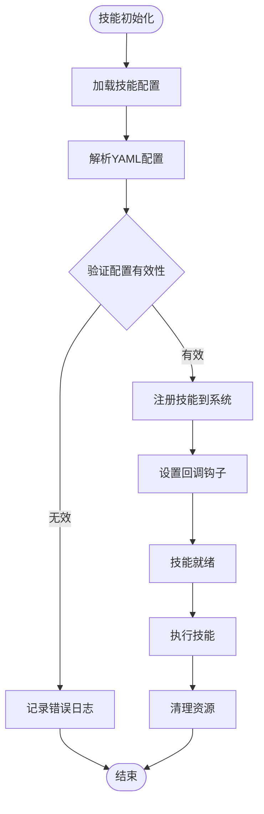
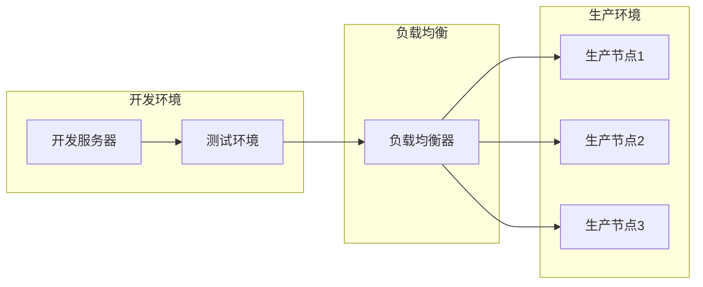
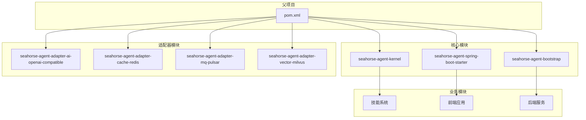
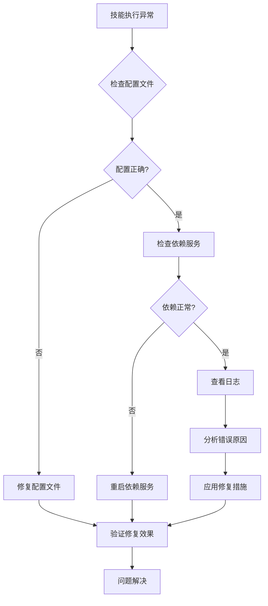
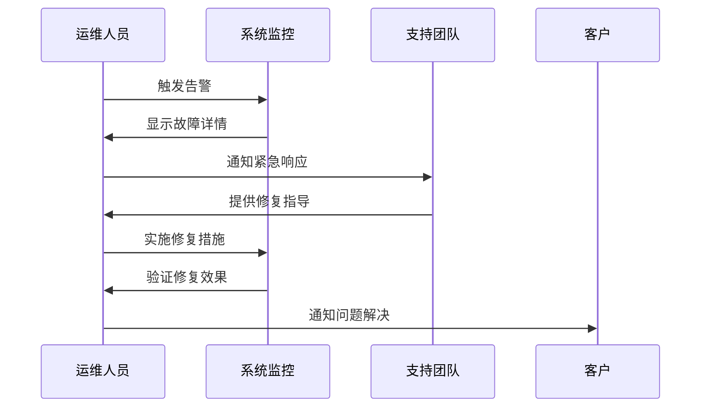
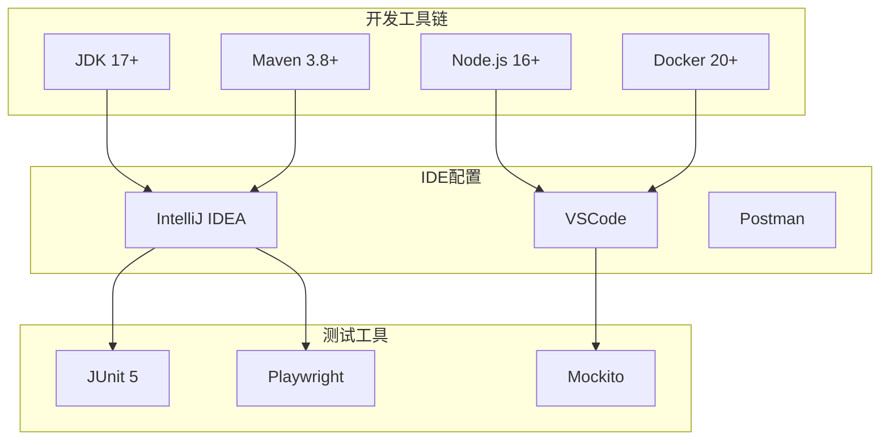

# 技能系统运维指南

<cite>
**本文档引用的文件**
- [SKILL.md](file://.skills/handoff/SKILL.md)
- [SKILL.md](file://.skills/seahorse-consumer-web-exposure-audit/SKILL.md)
- [SKILL.md](file://.skills/seahorse-memory-system-audit/SKILL.md)
- [openai.yaml](file://.skills/seahorse-consumer-web-exposure-audit/agents/openai.yaml)
- [openai.yaml](file://.skills/seahorse-memory-system-audit/agents/openai.yaml)
- [SKILL-OPERATIONS.md](file://docs/skills/SKILL-OPERATIONS.md)
- [DEVELOPMENT-GUIDE.md](file://docs/DEVELOPMENT-GUIDE.md)
- [README.md](file://docs/README.md)
- [PRODUCT-ROADMAP.md](file://docs/PRODUCT-ROADMAP.md)
- [MEMORY-SYSTEM-REVIEW.md](file://docs/MEMORY-SYSTEM-REVIEW.md)
- [MEMORY-FIX-TODO.md](file://docs/MEMORY-FIX-TODO.md)
- [MEMORY-FIX-FINAL-STATUS.md](file://docs/MEMORY-FIX-FINAL-STATUS.md)
- [WORKFLOW-BACKEND-DESIGN-SIMPLE.md](file://docs/WORKFLOW-BACKEND-DESIGN-SIMPLE.md)
- [WORKFLOW-VISUALIZATION-BACKEND-DESIGN.md](file://docs/WORKFLOW-VISUALIZATION-BACKEND-DESIGN.md)
- [WEB-IMPROVEMENTS-QUICK-GUIDE.md](file://docs/WEB-IMPROVEMENTS-QUICK-GUIDE.md)
- [WEB-IMPROVEMENTS-DETAILED-DESIGN.md](file://docs/WEB-IMPROVEMENTS-DETAILED-DESIGN.md)
- [WEB-IMPROVEMENTS-BACKEND-SUPPORT.md](file://docs/WEB-IMPROVEMENTS-BACKEND-SUPPORT.md)
- [DEERFLOW-SKILL-ANALYSIS.md](file://docs/DEERFLOW-SKILL-ANALYSIS.md)
- [DOCUMENTATION-SUMMARY.md](file://docs/DOCUMENTATION-SUMMARY.md)
- [CLAUDE.md](file://CLAUDE.md)
- [DEPLOY.md](file://DEPLOY.md)
- [docker-compose.yml](file://docker-compose.yml)
- [docker-compose.full.yml](file://docker-compose.full.yml)
- [Dockerfile.backend](file://Dockerfile.backend)
- [Dockerfile.backend.simplified](file://Dockerfile.backend.simplified)
- [deploy.sh](file://deploy.sh)
- [redeploy.sh](file://redeploy.sh)
- [deploy.ps1](file://deploy.ps1)
- [redeploy.ps1](file://redeploy.ps1)
- [pom.xml](file://pom.xml)
</cite>

## 目录
1. [简介](#简介)
2. [项目结构](#项目结构)
3. [核心组件](#核心组件)
4. [架构概览](#架构概览)
5. [详细组件分析](#详细组件分析)
6. [依赖关系分析](#依赖关系分析)
7. [性能考虑](#性能考虑)
8. [故障排除指南](#故障排除指南)
9. [结论](#结论)
10. [附录](#附录)

## 简介

Seahorse Agent 技能系统是一个基于 Spring Boot 的企业级 AI 基础设施平台，专注于智能代理技能的开发、部署和运维。该系统提供了完整的技能生命周期管理，包括技能定义、注册、执行监控和性能优化。

本指南重点关注技能系统的运维实践，涵盖技能部署、监控、故障排除和性能优化等方面。系统采用模块化架构设计，支持多种适配器和扩展机制，为不同场景提供灵活的解决方案。

## 项目结构

项目采用多模块 Maven 架构，主要包含以下核心目录结构：

**图表来源**
- [.skills/handoff/SKILL.md](file://.skills/handoff/SKILL.md)
- [docs/skills/SKILL-OPERATIONS.md](file://docs/skills/SKILL-OPERATIONS.md)
- [docs/DEVELOPMENT-GUIDE.md](file://docs/DEVELOPMENT-GUIDE.md)

**章节来源**
- [README.md](file://docs/README.md)
- [PRODUCT-ROADMAP.md](file://docs/PRODUCT-ROADMAP.md)

## 核心组件

### 技能管理系统

技能系统是整个平台的核心，负责管理各种 AI 代理技能的生命周期：

**图表来源**
- [.skills/handoff/SKILL.md](file://.skills/handoff/SKILL.md)
- [.skills/seahorse-consumer-web-exposure-audit/SKILL.md](file://.skills/seahorse-consumer-web-exposure-audit/SKILL.md)

### 技能类型分类

系统支持多种类型的技能，每种技能都有其特定的用途和配置要求：

| 技能类型 | 描述 | 主要功能 | 典型应用场景 |
|---------|------|----------|-------------|
| Handoff | 转接技能 | 处理用户请求转接和路由 | 客服系统、业务流程转接 |
| Consumer Web Exposure Audit | 消费者Web暴露审计 | 审计Web接口暴露情况 | 安全合规检查、风险评估 |
| Memory System Audit | 内存系统审计 | 审计内存使用和管理 | 性能监控、资源优化 |

**章节来源**
- [.skills/handoff/SKILL.md](file://.skills/handoff/SKILL.md)
- [.skills/seahorse-consumer-web-exposure-audit/SKILL.md](file://.skills/seahorse-consumer-web-exposure-audit/SKILL.md)
- [.skills/seahorse-memory-system-audit/SKILL.md](file://.skills/seahorse-memory-system-audit/SKILL.md)

## 架构概览

### 整体架构设计

**图表来源**
- [WORKFLOW-BACKEND-DESIGN-SIMPLE.md](file://docs/WORKFLOW-BACKEND-DESIGN-SIMPLE.md)
- [WORKFLOW-VISUALIZATION-BACKEND-DESIGN.md](file://docs/WORKFLOW-VISUALIZATION-BACKEND-DESIGN.md)

### 技能执行流程

**图表来源**
- [SKILL-OPERATIONS.md](file://docs/skills/SKILL-OPERATIONS.md)

## 详细组件分析

### 技能定义与配置

每个技能都通过 YAML 配置文件进行定义，包含技能的基本信息、参数规范和执行规则：

**图表来源**
- [.skills/seahorse-consumer-web-exposure-audit/agents/openai.yaml](file://.skills/seahorse-consumer-web-exposure-audit/agents/openai.yaml)
- [.skills/seahorse-memory-system-audit/agents/openai.yaml](file://.skills/seahorse-memory-system-audit/agents/openai.yaml)

### 技能执行监控

系统提供了全面的监控机制，用于跟踪技能的执行状态和性能指标：

| 监控维度 | 指标类型 | 目标值 | 阈值设置 | 处理策略 |
|---------|---------|--------|---------|---------|
| 执行时间 | 响应时间 | < 500ms | > 1000ms | 警告通知 |
| 错误率 | 异常比例 | < 1% | > 5% | 自动降级 |
| 资源使用 | CPU使用率 | < 80% | > 90% | 资源扩容 |
| 内存使用 | 内存占用 | < 70% | > 85% | 内存回收 |

**章节来源**
- [SKILL-OPERATIONS.md](file://docs/skills/SKILL-OPERATIONS.md)
- [MEMORY-SYSTEM-REVIEW.md](file://docs/MEMORY-SYSTEM-REVIEW.md)

### 技能部署架构

**图表来源**
- [DEPLOY.md](file://DEPLOY.md)
- [docker-compose.yml](file://docker-compose.yml)

## 依赖关系分析

### Maven 依赖结构

**图表来源**
- [pom.xml](file://pom.xml)

### 技能依赖关系

每个技能模块都有其特定的依赖关系和配置要求：

| 技能模块 | 核心依赖 | 配置文件 | 运行环境 | 监控指标 |
|---------|---------|---------|---------|---------|
| Handoff | spring-boot-starter-web | SKILL.md | 生产/测试 | 请求处理时间 |
| Consumer Audit | spring-boot-starter-data-jpa | openai.yaml | 生产 | 审计成功率 |
| Memory Audit | seahorse-agent-kernel | openai.yaml | 生产 | 内存使用率 |

**章节来源**
- [.skills/handoff/SKILL.md](file://.skills/handoff/SKILL.md)
- [.skills/seahorse-consumer-web-exposure-audit/SKILL.md](file://.skills/seahorse-consumer-web-exposure-audit/SKILL.md)
- [.skills/seahorse-memory-system-audit/SKILL.md](file://.skills/seahorse-memory-system-audit/SKILL.md)

## 性能考虑

### 性能优化策略

系统采用了多层次的性能优化策略：

1. **缓存优化**
   - 使用本地缓存减少重复计算
   - Redis分布式缓存支持高并发访问
   - 缓存失效策略确保数据一致性

2. **异步处理**
   - 消息队列异步处理非关键任务
   - 流式处理提升大数据量场景性能
   - 并发执行优化长耗时操作

3. **资源管理**
   - 连接池管理数据库连接
   - 线程池控制并发数量
   - 内存池优化内存分配

### 性能监控指标

| 指标类别 | 监控目标 | 告警阈值 | 优化建议 |
|---------|---------|---------|---------|
| 响应时间 | < 500ms | > 1000ms | 优化数据库查询 |
| 吞吐量 | > 100 req/s | < 50 req/s | 增加实例数量 |
| 错误率 | < 1% | > 5% | 检查依赖服务健康 |
| 资源利用率 | CPU < 80%, 内存 < 70% | > 90% | 调整资源配置 |

**章节来源**
- [MEMORY-FIX-TODO.md](file://docs/MEMORY-FIX-TODO.md)
- [MEMORY-FIX-FINAL-STATUS.md](file://docs/MEMORY-FIX-FINAL-STATUS.md)

## 故障排除指南

### 常见问题诊断

### 故障排除步骤

1. **初步诊断**
   - 检查技能状态和运行日志
   - 验证配置文件语法正确性
   - 确认依赖服务可用性

2. **深入分析**
   - 查看详细的错误堆栈信息
   - 分析性能监控数据
   - 检查资源使用情况

3. **问题解决**
   - 应用临时修复措施
   - 实施长期解决方案
   - 验证问题是否彻底解决

### 紧急响应流程

**章节来源**
- [DEVELOPMENT-GUIDE.md](file://docs/DEVELOPMENT-GUIDE.md)
- [CLAUDE.md](file://CLAUDE.md)

## 结论

Seahorse Agent 技能系统提供了一个完整的企业级 AI 基础设施平台，具有以下特点：

1. **模块化设计**：采用清晰的模块划分，便于维护和扩展
2. **高可用性**：支持多实例部署和负载均衡
3. **可观测性**：提供全面的监控和日志功能
4. **灵活性**：支持多种技能类型和配置选项
5. **可扩展性**：通过适配器模式支持第三方集成

通过遵循本指南中的运维最佳实践，可以确保技能系统的稳定运行和高效维护。

## 附录

### 部署脚本说明

系统提供了多种部署方式和脚本：

| 脚本文件 | 功能描述 | 使用场景 |
|---------|---------|---------|
| deploy.sh | Linux部署脚本 | 生产环境部署 |
| deploy.ps1 | Windows部署脚本 | 开发环境部署 |
| redeploy.sh | 重新部署脚本 | 热更新部署 |
| redeploy.ps1 | Windows重新部署脚本 | 开发环境热更新 |
| docker-compose.yml | Docker编排配置 | 容器化部署 |
| Dockerfile.backend | 后端镜像构建 | 自定义镜像构建 |

### 开发环境配置

**章节来源**
- [DEVELOPMENT-GUIDE.md](file://docs/DEVELOPMENT-GUIDE.md)
- [WEB-IMPROVEMENTS-QUICK-GUIDE.md](file://docs/WEB-IMPROVEMENTS-QUICK-GUIDE.md)
- [WEB-IMPROVEMENTS-DETAILED-DESIGN.md](file://docs/WEB-IMPROVEMENTS-DETAILED-DESIGN.md)