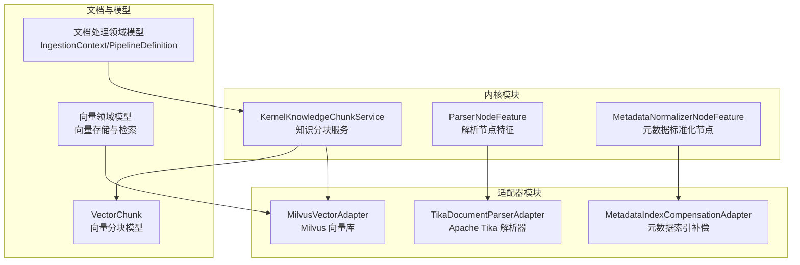
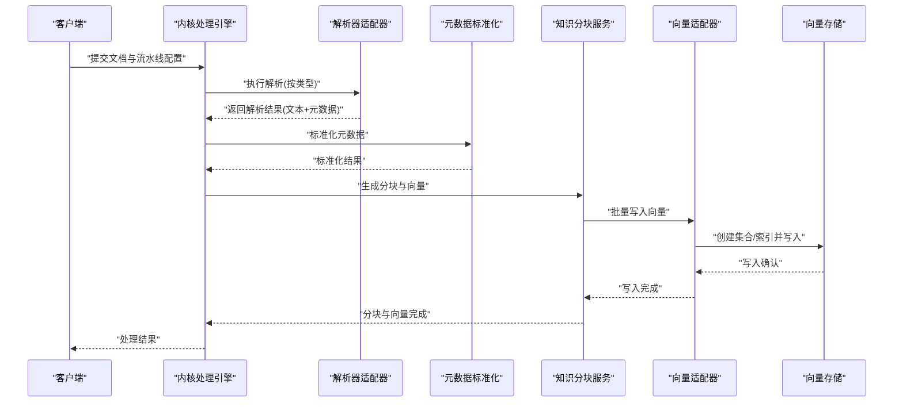
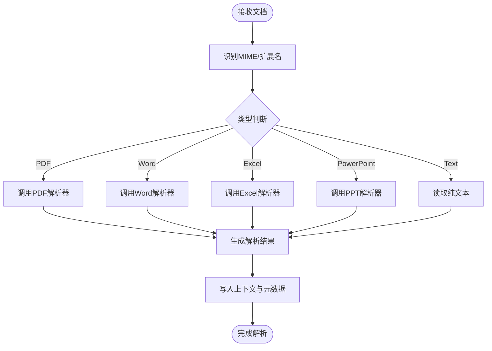
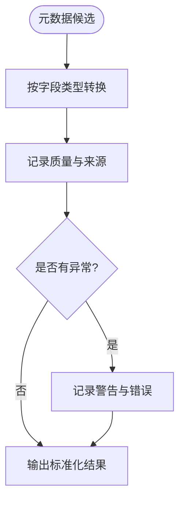
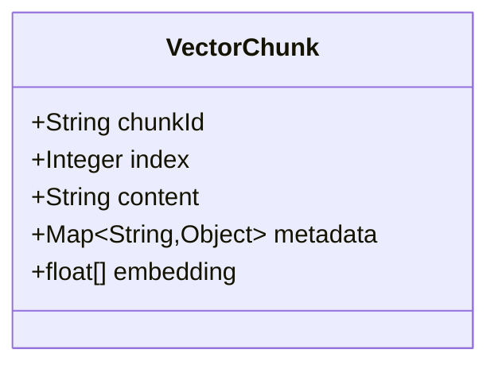
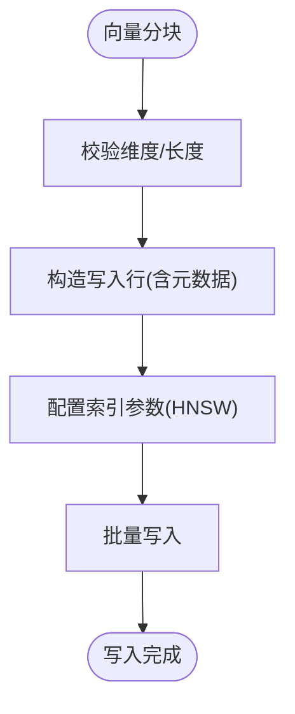
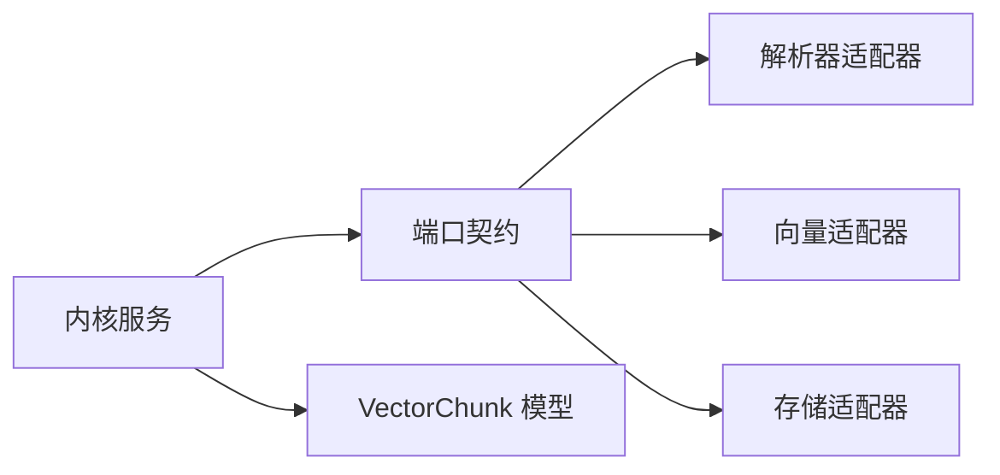

# 智能文档处理

<cite>
**本文引用的文件**
- [ParserNodeFeature.java](file://seahorse-agent-kernel/src/main/java/com/miracle/ai/seahorse/agent/kernel/feature/ingestion/ParserNodeFeature.java)
- [TikaDocumentParserAdapter.java](file://seahorse-agent-adapter-parser-tika/src/main/java/com/miracle/ai/seahorse/agent/adapters/parser/tika/TikaDocumentParserAdapter.java)
- [VectorChunk.java](file://seahorse-agent-kernel/src/main/java/com/miracle/ai/seahorse/agent/kernel/domain/vector/VectorChunk.java)
- [MilvusVectorAdapter.java](file://seahorse-agent-adapter-vector-milvus/src/main/java/com/miracle/ai/seahorse/agent/adapters/vector/milvus/MilvusVectorAdapter.java)
- [KernelKnowledgeChunkService.java](file://seahorse-agent-kernel/src/main/java/com/miracle/ai/seahorse/agent/kernel/application/knowledge/KernelKnowledgeChunkService.java)
- [MetadataIndexCompensationAdapter.java](file://seahorse-agent-spring-boot-starter/src/main/java/com/miracle/ai/seahorse/agent/adapters/spring/metadata/MetadataIndexCompensationAdapter.java)
- [MetadataNormalizationResult.java](file://seahorse-agent-kernel/src/main/java/com/miracle/ai/seahorse/agent/kernel/domain/metadata/MetadataNormalizationResult.java)
- [MetadataExtractionResult.java](file://seahorse-agent-kernel/src/main/java/com/miracle/ai/seahorse/agent/kernel/domain/metadata/MetadataExtractionResult.java)
- [MetadataNormalizerNodeFeature.java](file://seahorse-agent-kernel/src/main/java/com/miracle/ai/seahorse/agent/kernel/feature/ingestion/MetadataNormalizerNodeFeature.java)
- [KernelMetadataBackfillService.java](file://seahorse-agent-kernel/src/main/java/com/miracle/ai/seahorse/agent/kernel/application/metadata/KernelMetadataBackfillService.java)
- [pdf-ingestion-example.md](file://docs/examples/pdf-ingestion-example.md)
- [pdf-pipeline-request.json](file://docs/examples/pdf-pipeline-request.json)
- [文档处理领域模型.md](file://docs/zh/content/后端系统/核心内核/领域模型/文档处理领域模型.md)
- [向量领域模型.md](file://docs/zh/content/后端系统/核心内核/领域模型/向量领域模型.md)
</cite>

## 目录
1. [引言](#引言)
2. [项目结构](#项目结构)
3. [核心组件](#核心组件)
4. [架构总览](#架构总览)
5. [详细组件分析](#详细组件分析)
6. [依赖分析](#依赖分析)
7. [性能考虑](#性能考虑)
8. [故障排查指南](#故障排查指南)
9. [结论](#结论)
10. [附录](#附录)

## 引言
本文件面向“智能文档处理系统”的技术文档，聚焦于多格式文档解析、预处理、分块、向量化与入库的完整流水线。系统支持 PDF、Word、Excel、PowerPoint 等文档类型，通过解析器适配器抽取文本与元数据，经过标准化与清洗后进行分块策略处理，生成向量并写入向量数据库，最终完成索引与版本管理。文档提供架构图、序列图与流程图，帮助读者从概念到实现全面理解。

## 项目结构
系统采用分层与模块化设计，核心处理能力由内核模块提供，适配器模块对接外部组件（如解析器、向量库、存储等），Spring Boot Starter 提供运行时装配与补偿机制。文档处理领域模型与向量领域模型分别描述了处理流水线与向量存储的数据契约。

图表来源
- [KernelKnowledgeChunkService.java:189-226](file://seahorse-agent-kernel/src/main/java/com/miracle/ai/seahorse/agent/kernel/application/knowledge/KernelKnowledgeChunkService.java#L189-L226)
- [ParserNodeFeature.java:165-198](file://seahorse-agent-kernel/src/main/java/com/miracle/ai/seahorse/agent/kernel/feature/ingestion/ParserNodeFeature.java#L165-L198)
- [TikaDocumentParserAdapter.java](file://seahorse-agent-adapter-parser-tika/src/main/java/com/miracle/ai/seahorse/agent/adapters/parser/tika/TikaDocumentParserAdapter.java)
- [MilvusVectorAdapter.java:249-348](file://seahorse-agent-adapter-vector-milvus/src/main/java/com/miracle/ai/seahorse/agent/adapters/vector/milvus/MilvusVectorAdapter.java#L249-L348)
- [MetadataIndexCompensationAdapter.java:141-166](file://seahorse-agent-spring-boot-starter/src/main/java/com/miracle/ai/seahorse/agent/adapters/spring/metadata/MetadataIndexCompensationAdapter.java#L141-L166)
- [VectorChunk.java:1-62](file://seahorse-agent-kernel/src/main/java/com/miracle/ai/seahorse/agent/kernel/domain/vector/VectorChunk.java#L1-L62)
- [文档处理领域模型.md:352-361](file://docs/zh/content/后端系统/核心内核/领域模型/文档处理领域模型.md#L352-L361)
- [向量领域模型.md:31-32](file://docs/zh/content/后端系统/核心内核/领域模型/向量领域模型.md#L31-L32)

章节来源
- [文档处理领域模型.md:29-361](file://docs/zh/content/后端系统/核心内核/领域模型/文档处理领域模型.md#L29-L361)
- [向量领域模型.md:19-32](file://docs/zh/content/后端系统/核心内核/领域模型/向量领域模型.md#L19-L32)

## 核心组件
- 文档解析与类型识别：解析节点特征负责根据 MIME 类型或扩展名识别文档类型（PDF、Word、Excel、PowerPoint、Text），并将解析结果写入处理上下文。
- 元数据提取与标准化：元数据标准化节点从候选中提取字段值，按目标模式进行类型转换与质量评估，输出标准化结果与问题清单。
- 文本分块与向量化：知识分块服务将清洗后的文本按策略切分为块，调用嵌入模型生成向量，封装为向量分块模型。
- 向量存储与索引：Milvus 适配器负责集合管理、索引参数配置、批量写入与查询，确保向量检索性能。
- 补偿与回填：元数据索引补偿适配器与回填服务在失败场景下进行重试与隔离，保证数据一致性。

章节来源
- [ParserNodeFeature.java:165-198](file://seahorse-agent-kernel/src/main/java/com/miracle/ai/seahorse/agent/kernel/feature/ingestion/ParserNodeFeature.java#L165-L198)
- [MetadataNormalizerNodeFeature.java:141-169](file://seahorse-agent-kernel/src/main/java/com/miracle/ai/seahorse/agent/kernel/feature/ingestion/MetadataNormalizerNodeFeature.java#L141-L169)
- [KernelKnowledgeChunkService.java:189-226](file://seahorse-agent-kernel/src/main/java/com/miracle/ai/seahorse/agent/kernel/application/knowledge/KernelKnowledgeChunkService.java#L189-L226)
- [MilvusVectorAdapter.java:249-348](file://seahorse-agent-adapter-vector-milvus/src/main/java/com/miracle/ai/seahorse/agent/adapters/vector/milvus/MilvusVectorAdapter.java#L249-L348)
- [MetadataIndexCompensationAdapter.java:141-166](file://seahorse-agent-spring-boot-starter/src/main/java/com/miracle/ai/seahorse/agent/adapters/spring/metadata/MetadataIndexCompensationAdapter.java#L141-L166)

## 架构总览
系统通过“解析-元数据-分块-向量-索引”链路完成文档全生命周期处理。解析器适配器负责多格式解析，标准化节点提升元数据质量，分块服务与嵌入模型生成向量，Milvus 适配器完成索引与检索。

图表来源
- [ParserNodeFeature.java:165-198](file://seahorse-agent-kernel/src/main/java/com/miracle/ai/seahorse/agent/kernel/feature/ingestion/ParserNodeFeature.java#L165-L198)
- [TikaDocumentParserAdapter.java](file://seahorse-agent-adapter-parser-tika/src/main/java/com/miracle/ai/seahorse/agent/adapters/parser/tika/TikaDocumentParserAdapter.java)
- [MetadataNormalizerNodeFeature.java:141-169](file://seahorse-agent-kernel/src/main/java/com/miracle/ai/seahorse/agent/kernel/feature/ingestion/MetadataNormalizerNodeFeature.java#L141-L169)
- [KernelKnowledgeChunkService.java:189-226](file://seahorse-agent-kernel/src/main/java/com/miracle/ai/seahorse/agent/kernel/application/knowledge/KernelKnowledgeChunkService.java#L189-L226)
- [MilvusVectorAdapter.java:249-348](file://seahorse-agent-adapter-vector-milvus/src/main/java/com/miracle/ai/seahorse/agent/adapters/vector/milvus/MilvusVectorAdapter.java#L249-L348)

## 详细组件分析

### 组件A：文档解析与类型识别
- 功能要点
  - 依据 MIME 类型与扩展名识别文档类型（PDF、Word、Excel、PowerPoint、Text）。
  - 将解析结果写入处理上下文，包含原始文本与元数据字典。
- 关键路径
  - 类型识别与规范化：[ParserNodeFeature.java:165-198](file://seahorse-agent-kernel/src/main/java/com/miracle/ai/seahorse/agent/kernel/feature/ingestion/ParserNodeFeature.java#L165-L198)
  - 写入上下文与元数据合并：[ParserNodeFeature.java:193-198](file://seahorse-agent-kernel/src/main/java/com/miracle/ai/seahorse/agent/kernel/feature/ingestion/ParserNodeFeature.java#L193-L198)
- 适配器
  - Apache Tika 解析器适配器用于具体格式解析：[TikaDocumentParserAdapter.java](file://seahorse-agent-adapter-parser-tika/src/main/java/com/miracle/ai/seahorse/agent/adapters/parser/tika/TikaDocumentParserAdapter.java)

图表来源
- [ParserNodeFeature.java:165-198](file://seahorse-agent-kernel/src/main/java/com/miracle/ai/seahorse/agent/kernel/feature/ingestion/ParserNodeFeature.java#L165-L198)
- [TikaDocumentParserAdapter.java](file://seahorse-agent-adapter-parser-tika/src/main/java/com/miracle/ai/seahorse/agent/adapters/parser/tika/TikaDocumentParserAdapter.java)

章节来源
- [ParserNodeFeature.java:165-198](file://seahorse-agent-kernel/src/main/java/com/miracle/ai/seahorse/agent/kernel/feature/ingestion/ParserNodeFeature.java#L165-L198)
- [TikaDocumentParserAdapter.java](file://seahorse-agent-adapter-parser-tika/src/main/java/com/miracle/ai/seahorse/agent/adapters/parser/tika/TikaDocumentParserAdapter.java)

### 组件B：元数据提取与标准化
- 功能要点
  - 从候选中提取字段值，按目标模式进行类型转换（数字、日期、枚举等）。
  - 输出标准化结果与质量评估、问题清单。
- 关键路径
  - 字段标准化与异常处理：[MetadataNormalizerNodeFeature.java:141-169](file://seahorse-agent-kernel/src/main/java/com/miracle/ai/seahorse/agent/kernel/feature/ingestion/MetadataNormalizerNodeFeature.java#L141-L169)
  - 标准化结果数据结构：[MetadataNormalizationResult.java:1-18](file://seahorse-agent-kernel/src/main/java/com/miracle/ai/seahorse/agent/kernel/domain/metadata/MetadataNormalizationResult.java#L1-L18)
  - 提取结果数据结构：[MetadataExtractionResult.java:1-17](file://seahorse-agent-kernel/src/main/java/com/miracle/ai/seahorse/agent/kernel/domain/metadata/MetadataExtractionResult.java#L1-L17)

图表来源
- [MetadataNormalizerNodeFeature.java:141-169](file://seahorse-agent-kernel/src/main/java/com/miracle/ai/seahorse/agent/kernel/feature/ingestion/MetadataNormalizerNodeFeature.java#L141-L169)
- [MetadataNormalizationResult.java:1-18](file://seahorse-agent-kernel/src/main/java/com/miracle/ai/seahorse/agent/kernel/domain/metadata/MetadataNormalizationResult.java#L1-L18)
- [MetadataExtractionResult.java:1-17](file://seahorse-agent-kernel/src/main/java/com/miracle/ai/seahorse/agent/kernel/domain/metadata/MetadataExtractionResult.java#L1-L17)

章节来源
- [MetadataNormalizerNodeFeature.java:141-169](file://seahorse-agent-kernel/src/main/java/com/miracle/ai/seahorse/agent/kernel/feature/ingestion/MetadataNormalizerNodeFeature.java#L141-L169)
- [MetadataNormalizationResult.java:1-18](file://seahorse-agent-kernel/src/main/java/com/miracle/ai/seahorse/agent/kernel/domain/metadata/MetadataNormalizationResult.java#L1-L18)
- [MetadataExtractionResult.java:1-17](file://seahorse-agent-kernel/src/main/java/com/miracle/ai/seahorse/agent/kernel/domain/metadata/MetadataExtractionResult.java#L1-L17)

### 组件C：文本分块与向量化
- 功能要点
  - 将清洗后的文本切分为块，生成向量并封装为向量分块模型。
  - 支持不同嵌入模型，统一输出浮点数组向量。
- 关键路径
  - 分块与向量化：[KernelKnowledgeChunkService.java:189-226](file://seahorse-agent-kernel/src/main/java/com/miracle/ai/seahorse/agent/kernel/application/knowledge/KernelKnowledgeChunkService.java#L189-L226)
  - 向量分块模型：[VectorChunk.java:1-62](file://seahorse-agent-kernel/src/main/java/com/miracle/ai/seahorse/agent/kernel/domain/vector/VectorChunk.java#L1-L62)

图表来源
- [VectorChunk.java:1-62](file://seahorse-agent-kernel/src/main/java/com/miracle/ai/seahorse/agent/kernel/domain/vector/VectorChunk.java#L1-L62)

章节来源
- [KernelKnowledgeChunkService.java:189-226](file://seahorse-agent-kernel/src/main/java/com/miracle/ai/seahorse/agent/kernel/application/knowledge/KernelKnowledgeChunkService.java#L189-L226)
- [VectorChunk.java:1-62](file://seahorse-agent-kernel/src/main/java/com/miracle/ai/seahorse/agent/kernel/domain/vector/VectorChunk.java#L1-L62)

### 组件D：向量存储与索引（Milvus）
- 功能要点
  - 配置索引参数（HNSW、MetricType、M、efConstruction 等）。
  - 批量写入向量，限制内容长度，校验维度。
  - 提供 Top-K 查询与集合管理。
- 关键路径
  - 索引参数与写入行构造：[MilvusVectorAdapter.java:249-348](file://seahorse-agent-adapter-vector-milvus/src/main/java/com/miracle/ai/seahorse/agent/adapters/vector/milvus/MilvusVectorAdapter.java#L249-L348)
  - 向量维度校验与截断：[MilvusVectorAdapter.java:310-348](file://seahorse-agent-adapter-vector-milvus/src/main/java/com/miracle/ai/seahorse/agent/adapters/vector/milvus/MilvusVectorAdapter.java#L310-L348)

图表来源
- [MilvusVectorAdapter.java:249-348](file://seahorse-agent-adapter-vector-milvus/src/main/java/com/miracle/ai/seahorse/agent/adapters/vector/milvus/MilvusVectorAdapter.java#L249-L348)
- [MilvusVectorAdapter.java:310-348](file://seahorse-agent-adapter-vector-milvus/src/main/java/com/miracle/ai/seahorse/agent/adapters/vector/milvus/MilvusVectorAdapter.java#L310-L348)

章节来源
- [MilvusVectorAdapter.java:249-348](file://seahorse-agent-adapter-vector-milvus/src/main/java/com/miracle/ai/seahorse/agent/adapters/vector/milvus/MilvusVectorAdapter.java#L249-L348)

### 组件E：元数据索引补偿与回填
- 功能要点
  - 在失败场景下进行补偿与重试，隔离异常阶段，标记文档状态。
  - 回填服务在缺少元数据模式时抛出明确异常。
- 关键路径
  - 补偿适配器：[MetadataIndexCompensationAdapter.java:141-166](file://seahorse-agent-spring-boot-starter/src/main/java/com/miracle/ai/seahorse/agent/adapters/spring/metadata/MetadataIndexCompensationAdapter.java#L141-L166)
  - 回填服务异常分支：[KernelMetadataBackfillService.java:385-408](file://seahorse-agent-kernel/src/main/java/com/miracle/ai/seahorse/agent/kernel/application/metadata/KernelMetadataBackfillService.java#L385-L408)

章节来源
- [MetadataIndexCompensationAdapter.java:141-166](file://seahorse-agent-spring-boot-starter/src/main/java/com/miracle/ai/seahorse/agent/adapters/spring/metadata/MetadataIndexCompensationAdapter.java#L141-L166)
- [KernelMetadataBackfillService.java:385-408](file://seahorse-agent-kernel/src/main/java/com/miracle/ai/seahorse/agent/kernel/application/metadata/KernelMetadataBackfillService.java#L385-L408)

## 依赖分析
- 内核与适配器解耦：内核通过端口契约与适配器交互，解析器、向量库、存储均为可插拔组件。
- 数据契约稳定：VectorChunk 作为向量写入契约，统一了不同嵌入模型的输出格式。
- 可观测性与补偿：元数据标准化与回填服务提供失败隔离与重试机制，保障入库可靠性。

图表来源
- [KernelKnowledgeChunkService.java:189-226](file://seahorse-agent-kernel/src/main/java/com/miracle/ai/seahorse/agent/kernel/application/knowledge/KernelKnowledgeChunkService.java#L189-L226)
- [VectorChunk.java:1-62](file://seahorse-agent-kernel/src/main/java/com/miracle/ai/seahorse/agent/kernel/domain/vector/VectorChunk.java#L1-L62)

章节来源
- [KernelKnowledgeChunkService.java:189-226](file://seahorse-agent-kernel/src/main/java/com/miracle/ai/seahorse/agent/kernel/application/knowledge/KernelKnowledgeChunkService.java#L189-L226)
- [VectorChunk.java:1-62](file://seahorse-agent-kernel/src/main/java/com/miracle/ai/seahorse/agent/kernel/domain/vector/VectorChunk.java#L1-L62)

## 性能考虑
- 向量索引参数
  - HNSW 参数（M、efConstruction）影响索引质量与查询性能，需结合数据规模与延迟目标调优。
  - MetricType 选择（如 Inner-Product 或 Cosine）应与嵌入模型一致。
- 写入批大小与并发
  - 批量写入可显著降低网络开销，但需平衡内存占用与超时时间。
- 内容长度与维度
  - 写入前截断过长内容，严格校验向量维度，避免检索阶段异常。
- 元数据标准化
  - 类型转换与质量评估可减少后续检索噪声，提高召回质量。

## 故障排查指南
- 解析失败
  - 检查 MIME 类型与扩展名识别是否正确，确认对应解析器适配器已启用。
  - 参考：[ParserNodeFeature.java:165-198](file://seahorse-agent-kernel/src/main/java/com/miracle/ai/seahorse/agent/kernel/feature/ingestion/ParserNodeFeature.java#L165-L198)
- 向量维度不匹配
  - 确认嵌入模型输出维度与配置一致，避免写入阶段抛出异常。
  - 参考：[MilvusVectorAdapter.java:310-318](file://seahorse-agent-adapter-vector-milvus/src/main/java/com/miracle/ai/seahorse/agent/adapters/vector/milvus/MilvusVectorAdapter.java#L310-L318)
- 元数据缺失或模式不匹配
  - 回填服务在缺少模式时抛出明确异常，需先创建或修正元数据模式。
  - 参考：[KernelMetadataBackfillService.java:385-408](file://seahorse-agent-kernel/src/main/java/com/miracle/ai/seahorse/agent/kernel/application/metadata/KernelMetadataBackfillService.java#L385-L408)
- 补偿与重试
  - 使用补偿适配器隔离失败阶段，查看失败原因并重试。
  - 参考：[MetadataIndexCompensationAdapter.java:141-166](file://seahorse-agent-spring-boot-starter/src/main/java/com/miracle/ai/seahorse/agent/adapters/spring/metadata/MetadataIndexCompensationAdapter.java#L141-L166)

章节来源
- [ParserNodeFeature.java:165-198](file://seahorse-agent-kernel/src/main/java/com/miracle/ai/seahorse/agent/kernel/feature/ingestion/ParserNodeFeature.java#L165-L198)
- [MilvusVectorAdapter.java:310-318](file://seahorse-agent-adapter-vector-milvus/src/main/java/com/miracle/ai/seahorse/agent/adapters/vector/milvus/MilvusVectorAdapter.java#L310-L318)
- [KernelMetadataBackfillService.java:385-408](file://seahorse-agent-kernel/src/main/java/com/miracle/ai/seahorse/agent/kernel/application/metadata/KernelMetadataBackfillService.java#L385-L408)
- [MetadataIndexCompensationAdapter.java:141-166](file://seahorse-agent-spring-boot-starter/src/main/java/com/miracle/ai/seahorse/agent/adapters/spring/metadata/MetadataIndexCompensationAdapter.java#L141-L166)

## 结论
本系统通过内核与适配器的清晰分层，实现了多格式文档的高效解析、高质量元数据标准化、灵活的文本分块与向量化入库。借助 Milvus 的 HNSW 索引与补偿机制，系统在准确性与稳定性方面具备良好表现。建议在生产环境结合消息队列与限流策略实现高吞吐，并持续优化分块与向量参数以获得最佳检索效果。

## 附录
- 使用示例
  - 完整 PDF 摄取示例与一键创建命令参见：
    - [pdf-ingestion-example.md:1-288](file://docs/examples/pdf-ingestion-example.md#L1-L288)
    - [pdf-pipeline-request.json:1-60](file://docs/examples/pdf-pipeline-request.json#L1-L60)

章节来源
- [pdf-ingestion-example.md:1-288](file://docs/examples/pdf-ingestion-example.md#L1-L288)
- [pdf-pipeline-request.json:1-60](file://docs/examples/pdf-pipeline-request.json#L1-L60)