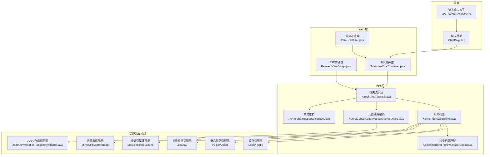
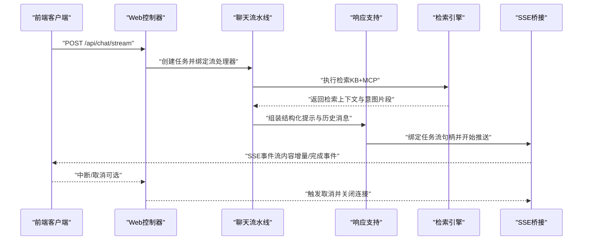
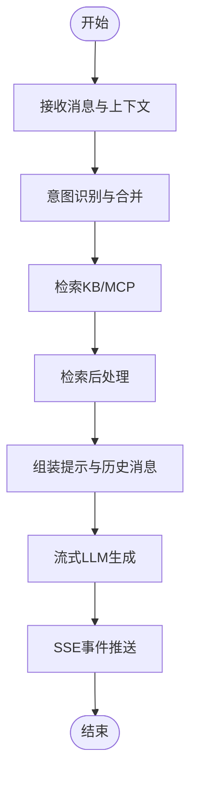
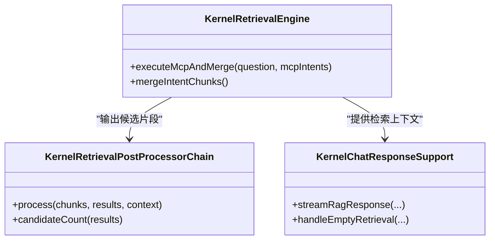
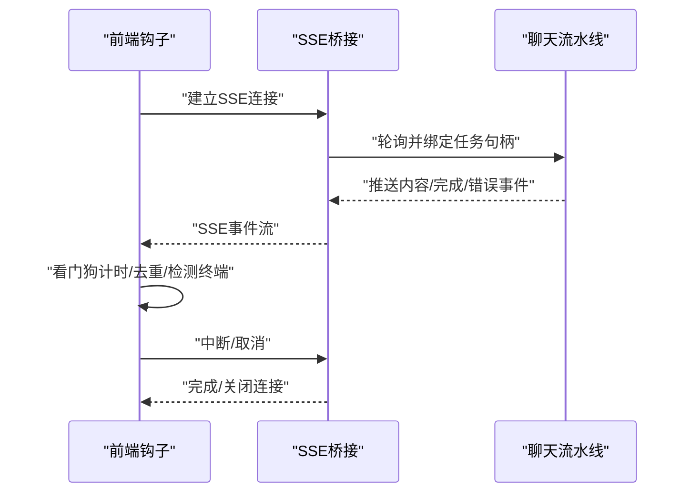
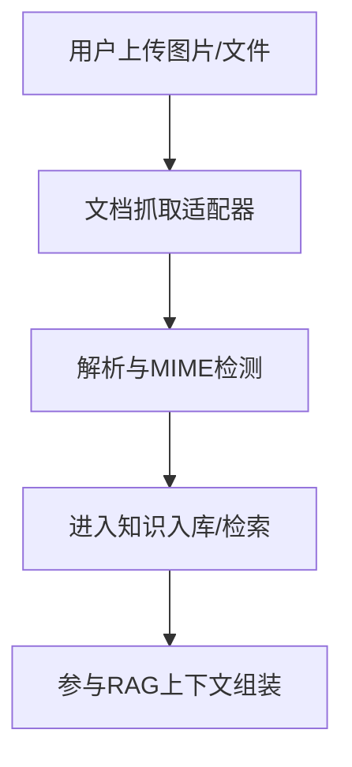
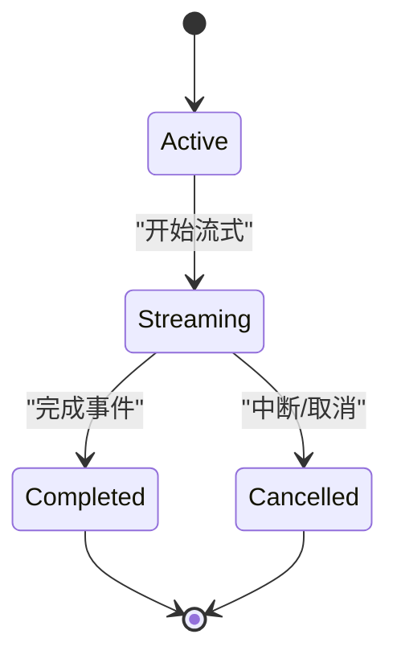
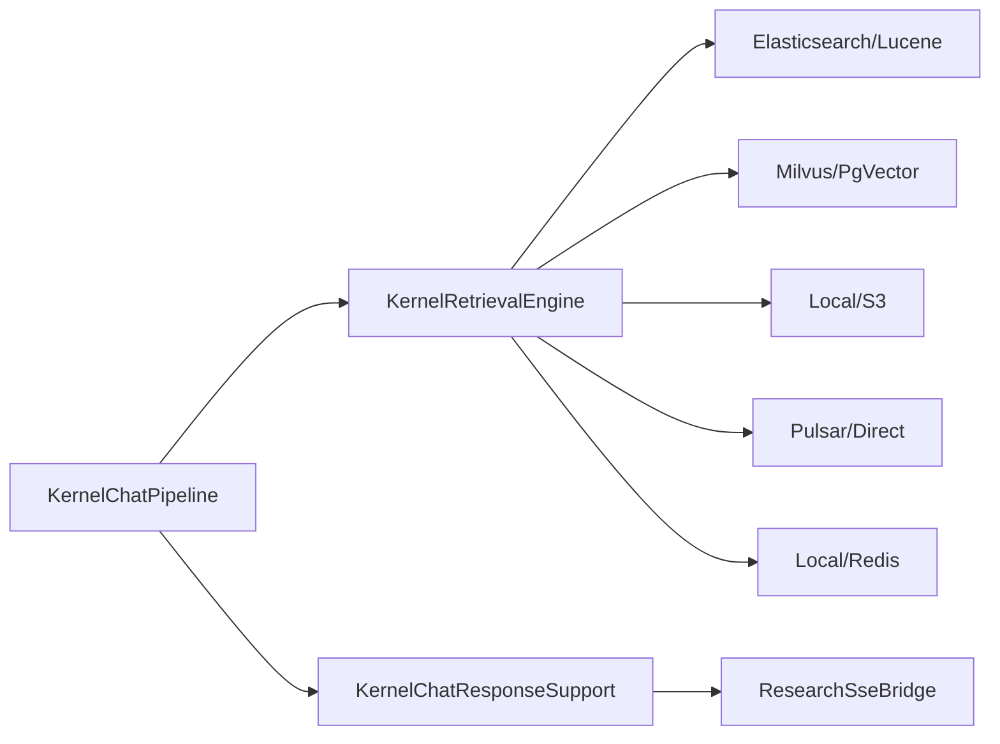

# 智能问答系统

<cite>
**本文引用的文件**
- [KernelChatPipeline.java](file://seahorse-agent-kernel/src/main/java/com/miracle/ai/seahorse/agent/kernel/application/chat/KernelChatPipeline.java)
- [KernelChatResponseSupport.java](file://seahorse-agent-kernel/src/main/java/com/miracle/ai/seahorse/agent/kernel/application/chat/KernelChatResponseSupport.java)
- [KernelRetrievalEngine.java](file://seahorse-agent-kernel/src/main/java/com/miracle/ai/seahorse/agent/kernel/application/retrieval/KernelRetrievalEngine.java)
- [KernelRetrievalPostProcessorChain.java](file://seahorse-agent-kernel/src/main/java/com/miracle/ai/seahorse/agent/kernel/application/retrieval/KernelRetrievalPostProcessorChain.java)
- [IntentGroup.java](file://seahorse-agent-kernel/src/main/java/com/miracle/ai/seahorse/agent/kernel/domain/intent/IntentGroup.java)
- [LocalIntentResolutionAdapter.java](file://seahorse-agent-adapter-web/src/main/java/com/miracle/ai/seahorse/agent/adapters/local/LocalIntentResolutionAdapter.java)
- [ResearchSseBridge.java](file://seahorse-agent-adapter-web/src/main/java/com/miracle/ai/seahorse/agent/adapters/web/ResearchSseBridge.java)
- [SpringSseEventSender.java](file://seahorse-agent-adapter-web/src/main/java/com/miracle/ai/seahorse/agent/adapters/local/SpringSseEventSender.java)
- [useStreamResponse.ts](file://frontend/src/hooks/useStreamResponse.ts)
- [KernelConversationManagementService.java](file://seahorse-agent-kernel/src/main/java/com/miracle/ai/seahorse/agent/kernel/application/conversation/KernelConversationManagementService.java)
- [SeahorseConversationController.java](file://seahorse-agent-adapter-web/src/main/java/com/miracle/ai/seahorse/agent/adapters/web/SeahorseConversationController.java)
- [JdbcConversationRepositoryAdapter.java](file://seahorse-agent-adapter-repository-jdbc/src/main/java/com/miracle/ai/seahorse/agent/adapters/repository/jdbc/JdbcConversationRepositoryAdapter.java)
- [FetcherNodeFeature.java](file://seahorse-agent-kernel/src/main/java/com/miracle/ai/seahorse/agent/kernel/feature/ingestion/FetcherNodeFeature.java)
- [LocalDocumentFetcherAdapter.java](file://seahorse-agent-adapter-web/src/main/java/com/miracle/ai/seahorse/agent/adapters/local/LocalDocumentFetcherAdapter.java)
- [RateLimitFilter.java](file://seahorse-agent-adapter-web/src/main/java/com/miracle/ai/seahorse/agent/adapters/web/RateLimitFilter.java)
- [RedisMemoryAggregationSchedulerPort.java](file://seahorse-agent-adapter-cache-redis/src/main/java/com/miracle/ai/seahorse/agent/adapters/cache/redis/RedisMemoryAggregationSchedulerPort.java)
- [KernelSandboxRuntimeService.java](file://seahorse-agent-kernel/src/main/java/com/miracle/ai/seahorse/agent/kernel/application/agent/sandbox/KernelSandboxRuntimeService.java)
- [SeahorseOpenApiConnectorController.java](file://seahorse-agent-adapter-web/src/main/java/com/miracle/ai/seahorse/agent/adapters/web/SeahorseOpenApiConnectorController.java)
- [application.properties](file://seahorse-agent-bootstrap/src/main/resources/application.properties)
- [KernelChatInboundServiceAgentModeTests.java](file://seahorse-agent-tests/src/test/java/com/miracle/ai/seahorse/agent/kernel/application/chat/KernelChatInboundServiceAgentModeTests.java)
- [KernelMcpOrchestratorTests.java](file://seahorse-agent-tests/src/test/java/com/miracle/ai/seahorse/agent/kernel/feature/mcp/KernelMcpOrchestratorTests.java)
- [KernelRetrievalEngineTests.java](file://seahorse-agent-tests/src/test/java/com/miracle/ai/seahorse/agent/kernel/feature/retrieval/KernelRetrievalEngineTests.java)
- [2026-05-31-frontend-backend-alignment.md](file://docs/superpowers/plans/2026-05-31-frontend-backend-alignment.md)
- [会话管理应用服务.md](file://docs/zh/content/后端系统/核心内核/应用服务层/会话管理应用服务.md)
- [性能测试.md](file://docs/zh/content/测试策略/性能测试.md)
</cite>

## 目录
1. [简介](#简介)
2. [项目结构](#项目结构)
3. [核心组件](#核心组件)
4. [架构概览](#架构概览)
5. [详细组件分析](#详细组件分析)
6. [依赖分析](#依赖分析)
7. [性能考虑](#性能考虑)
8. [故障排查指南](#故障排查指南)
9. [结论](#结论)
10. [附录](#附录)

## 简介
本文件面向智能问答系统的完整实现，围绕内核聊天流水线、检索增强生成（RAG）、流式响应（SSE）、多模态文档处理、会话状态管理与API接口展开，系统性阐述消息接收、意图识别、上下文理解、检索与合成、实时输出与中断处理、多模态输入支持、会话生命周期与异常恢复、性能优化与并发策略，并提供配置参数与集成示例。

## 项目结构
系统采用“前端 + Web适配层 + 内核应用服务 + 适配器端口 + 数据访问适配器 + 外部组件（向量/搜索/缓存/MQ/存储）”的分层架构，遵循端口适配器模式，确保内核逻辑与外部依赖解耦。

图表来源
- [KernelChatPipeline.java:145-173](file://seahorse-agent-kernel/src/main/java/com/miracle/ai/seahorse/agent/kernel/application/chat/KernelChatPipeline.java#L145-L173)
- [ResearchSseBridge.java:110-216](file://seahorse-agent-adapter-web/src/main/java/com/miracle/ai/seahorse/agent/adapters/web/ResearchSseBridge.java#L110-L216)
- [KernelConversationManagementService.java:50-62](file://seahorse-agent-kernel/src/main/java/com/miracle/ai/seahorse/agent/kernel/application/conversation/KernelConversationManagementService.java#L50-L62)
- [JdbcConversationRepositoryAdapter.java:98-107](file://seahorse-agent-adapter-repository-jdbc/src/main/java/com/miracle/ai/seahorse/agent/adapters/repository/jdbc/JdbcConversationRepositoryAdapter.java#L98-L107)

章节来源
- [KernelChatPipeline.java:145-173](file://seahorse-agent-kernel/src/main/java/com/miracle/ai/seahorse/agent/kernel/application/chat/KernelChatPipeline.java#L145-L173)
- [ResearchSseBridge.java:110-216](file://seahorse-agent-adapter-web/src/main/java/com/miracle/ai/seahorse/agent/adapters/web/ResearchSseBridge.java#L110-L216)
- [KernelConversationManagementService.java:50-62](file://seahorse-agent-kernel/src/main/java/com/miracle/ai/seahorse/agent/kernel/application/conversation/KernelConversationManagementService.java#L50-L62)
- [JdbcConversationRepositoryAdapter.java:98-107](file://seahorse-agent-adapter-repository-jdbc/src/main/java/com/miracle/ai/seahorse/agent/adapters/repository/jdbc/JdbcConversationRepositoryAdapter.java#L98-L107)

## 核心组件
- 聊天流水线：负责接收消息、意图识别、检索、上下文组装与流式响应调度。
- 检索引擎：聚合KB与MCP通道，执行工具调用与检索，构建意图片段与上下文包。
- 响应支持：构造结构化提示、合并意图、组装消息并发起流式LLM调用。
- SSE桥接：将内核事件桥接到前端SSE流，支持节流、超时看门狗与中断处理。
- 会话管理：创建、维护、查询与删除会话，持久化消息历史与元数据。
- 多模态文档处理：支持文本、图片、文件等多模态输入的抓取与解析。
- 并发与限流：基于Redis分布式信号量、限流过滤器与SSE桥接的调度线程池保障稳定性。

章节来源
- [KernelChatPipeline.java:145-173](file://seahorse-agent-kernel/src/main/java/com/miracle/ai/seahorse/agent/kernel/application/chat/KernelChatPipeline.java#L145-L173)
- [KernelRetrievalEngine.java:228-262](file://seahorse-agent-kernel/src/main/java/com/miracle/ai/seahorse/agent/kernel/application/retrieval/KernelRetrievalEngine.java#L228-L262)
- [KernelChatResponseSupport.java:106-126](file://seahorse-agent-kernel/src/main/java/com/miracle/ai/seahorse/agent/kernel/application/chat/KernelChatResponseSupport.java#L106-L126)
- [ResearchSseBridge.java:110-216](file://seahorse-agent-adapter-web/src/main/java/com/miracle/ai/seahorse/agent/adapters/web/ResearchSseBridge.java#L110-L216)
- [KernelConversationManagementService.java:50-62](file://seahorse-agent-kernel/src/main/java/com/miracle/ai/seahorse/agent/kernel/application/conversation/KernelConversationManagementService.java#L50-L62)
- [FetcherNodeFeature.java:52-89](file://seahorse-agent-kernel/src/main/java/com/miracle/ai/seahorse/agent/kernel/feature/ingestion/FetcherNodeFeature.java#L52-L89)

## 架构概览
下图展示从前端到内核、再到外部组件的端到端交互路径，重点体现RAG检索、意图合并、上下文组装与SSE流式输出。

图表来源
- [KernelChatPipeline.java:145-173](file://seahorse-agent-kernel/src/main/java/com/miracle/ai/seahorse/agent/kernel/application/chat/KernelChatPipeline.java#L145-L173)
- [KernelChatResponseSupport.java:106-126](file://seahorse-agent-kernel/src/main/java/com/miracle/ai/seahorse/agent/kernel/application/chat/KernelChatResponseSupport.java#L106-L126)
- [ResearchSseBridge.java:110-216](file://seahorse-agent-adapter-web/src/main/java/com/miracle/ai/seahorse/agent/adapters/web/ResearchSseBridge.java#L110-L216)

## 详细组件分析

### 对话处理流程（消息接收、意图识别、上下文理解、回复生成）
- 消息接收与意图识别
  - 前端通过SSE订阅流式输出，控制器接收请求并创建任务。
  - 意图识别与合并：将子问题意图合并为KB与MCP两类意图集合，用于后续检索与提示构造。
- 上下文理解与检索
  - 检索引擎聚合多通道结果，执行MCP工具调用并格式化上下文，同时收集意图片段。
  - 检索后处理链对候选片段进行后处理与统计。
- 回复生成
  - 响应支持根据重写后的问句、MCP/KB意图、检索上下文与记忆上下文构建结构化消息，启动流式LLM生成。

图表来源
- [KernelChatPipeline.java:145-173](file://seahorse-agent-kernel/src/main/java/com/miracle/ai/seahorse/agent/kernel/application/chat/KernelChatPipeline.java#L145-L173)
- [KernelRetrievalEngine.java:228-262](file://seahorse-agent-kernel/src/main/java/com/miracle/ai/seahorse/agent/kernel/application/retrieval/KernelRetrievalEngine.java#L228-L262)
- [KernelRetrievalPostProcessorChain.java:73-97](file://seahorse-agent-kernel/src/main/java/com/miracle/ai/seahorse/agent/kernel/application/retrieval/KernelRetrievalPostProcessorChain.java#L73-L97)
- [KernelChatResponseSupport.java:106-126](file://seahorse-agent-kernel/src/main/java/com/miracle/ai/seahorse/agent/kernel/application/chat/KernelChatResponseSupport.java#L106-L126)

章节来源
- [KernelChatPipeline.java:145-173](file://seahorse-agent-kernel/src/main/java/com/miracle/ai/seahorse/agent/kernel/application/chat/KernelChatPipeline.java#L145-L173)
- [LocalIntentResolutionAdapter.java:69-92](file://seahorse-agent-adapter-web/src/main/java/com/miracle/ai/seahorse/agent/adapters/local/LocalIntentResolutionAdapter.java#L69-L92)
- [IntentGroup.java:20-29](file://seahorse-agent-kernel/src/main/java/com/miracle/ai/seahorse/agent/kernel/domain/intent/IntentGroup.java#L20-L29)
- [KernelRetrievalEngine.java:228-262](file://seahorse-agent-kernel/src/main/java/com/miracle/ai/seahorse/agent/kernel/application/retrieval/KernelRetrievalEngine.java#L228-L262)
- [KernelRetrievalPostProcessorChain.java:73-97](file://seahorse-agent-kernel/src/main/java/com/miracle/ai/seahorse/agent/kernel/application/retrieval/KernelRetrievalPostProcessorChain.java#L73-L97)
- [KernelChatResponseSupport.java:106-126](file://seahorse-agent-kernel/src/main/java/com/miracle/ai/seahorse/agent/kernel/application/chat/KernelChatResponseSupport.java#L106-L126)

### 检索增强生成（RAG）机制
- 检索策略
  - 多通道检索：KB关键词索引与向量检索、MCP工具调用。
  - 工具编排：根据意图分数选择工具，聚合成功结果并格式化MCP上下文。
- 上下文组装
  - 将MCP上下文、KB上下文、意图片段与记忆上下文合并为统一PromptContext。
- 答案合成
  - 响应支持基于历史消息与结构化提示生成流式回答，支持空检索回退策略。

图表来源
- [KernelRetrievalEngine.java:228-262](file://seahorse-agent-kernel/src/main/java/com/miracle/ai/seahorse/agent/kernel/application/retrieval/KernelRetrievalEngine.java#L228-L262)
- [KernelRetrievalPostProcessorChain.java:73-97](file://seahorse-agent-kernel/src/main/java/com/miracle/ai/seahorse/agent/kernel/application/retrieval/KernelRetrievalPostProcessorChain.java#L73-L97)
- [KernelChatResponseSupport.java:106-126](file://seahorse-agent-kernel/src/main/java/com/miracle/ai/seahorse/agent/kernel/application/chat/KernelChatResponseSupport.java#L106-L126)

章节来源
- [KernelRetrievalEngine.java:228-262](file://seahorse-agent-kernel/src/main/java/com/miracle/ai/seahorse/agent/kernel/application/retrieval/KernelRetrievalEngine.java#L228-L262)
- [KernelRetrievalPostProcessorChain.java:73-97](file://seahorse-agent-kernel/src/main/java/com/miracle/ai/seahorse/agent/kernel/application/retrieval/KernelRetrievalPostProcessorChain.java#L73-L97)
- [KernelChatResponseSupport.java:80-99](file://seahorse-agent-kernel/src/main/java/com/miracle/ai/seahorse/agent/kernel/application/chat/KernelChatResponseSupport.java#L80-L99)

### 流式响应实现（SSE、实时输出、中断处理）
- SSE桥接
  - 定时轮询内核事件，节流合并内容事件，优先刷新非内容事件，支持最大时长与看门狗超时。
  - 发送完成事件与错误事件，保证前端可感知终止与异常。
- 前端钩子
  - 解析SSE事件，支持看门狗定时器、重复事件去重、终端事件检测与中断取消。
- 中断处理
  - 前端AbortSignal触发reader.cancel，后端桥接器在onCompletion/onTimeout/onError回调中清理资源。

图表来源
- [ResearchSseBridge.java:110-216](file://seahorse-agent-adapter-web/src/main/java/com/miracle/ai/seahorse/agent/adapters/web/ResearchSseBridge.java#L110-L216)
- [SpringSseEventSender.java:70-95](file://seahorse-agent-adapter-web/src/main/java/com/miracle/ai/seahorse/agent/adapters/local/SpringSseEventSender.java#L70-L95)
- [useStreamResponse.ts:77-237](file://frontend/src/hooks/useStreamResponse.ts#L77-L237)

章节来源
- [ResearchSseBridge.java:110-216](file://seahorse-agent-adapter-web/src/main/java/com/miracle/ai/seahorse/agent/adapters/web/ResearchSseBridge.java#L110-L216)
- [SpringSseEventSender.java:70-95](file://seahorse-agent-adapter-web/src/main/java/com/miracle/ai/seahorse/agent/adapters/local/SpringSseEventSender.java#L70-L95)
- [useStreamResponse.ts:77-237](file://frontend/src/hooks/useStreamResponse.ts#L77-L237)

### 多模态对话支持（文本、图片、文件）
- 文档抓取与解析
  - 支持HTTP、本地文件与对象存储来源，自动推断MIME类型，提取原始字节。
  - 提供Fetcher节点特性，覆盖常见文档扩展名与MIME映射。
- 多模态输入
  - 前端上传图片/文件后，后端通过文档抓取适配器读取并解析，作为检索或工具调用的输入。

图表来源
- [FetcherNodeFeature.java:52-89](file://seahorse-agent-kernel/src/main/java/com/miracle/ai/seahorse/agent/kernel/feature/ingestion/FetcherNodeFeature.java#L52-L89)
- [LocalDocumentFetcherAdapter.java:88-119](file://seahorse-agent-adapter-web/src/main/java/com/miracle/ai/seahorse/agent/adapters/local/LocalDocumentFetcherAdapter.java#L88-L119)

章节来源
- [FetcherNodeFeature.java:52-89](file://seahorse-agent-kernel/src/main/java/com/miracle/ai/seahorse/agent/kernel/feature/ingestion/FetcherNodeFeature.java#L52-L89)
- [LocalDocumentFetcherAdapter.java:88-119](file://seahorse-agent-adapter-web/src/main/java/com/miracle/ai/seahorse/agent/adapters/local/LocalDocumentFetcherAdapter.java#L88-L119)

### 对话状态管理（会话跟踪、超时控制、异常恢复）
- 会话生命周期
  - 创建、维护、查询、删除（软删除），支持消息历史与元数据持久化。
  - 会话与用户关联，结合权限控制与访问管理。
- 超时与异常
  - SSE看门狗超时触发中断；后端桥接器在超时/错误/完成回调中清理资源。
  - 前端对“未登录/过期”进行安全重定向与消息净化，避免敏感信息泄露。

图表来源
- [useStreamResponse.ts:77-237](file://frontend/src/hooks/useStreamResponse.ts#L77-L237)
- [ResearchSseBridge.java:110-216](file://seahorse-agent-adapter-web/src/main/java/com/miracle/ai/seahorse/agent/adapters/web/ResearchSseBridge.java#L110-L216)
- [2026-05-31-frontend-backend-alignment.md:94-140](file://docs/superpowers/plans/2026-05-31-frontend-backend-alignment.md#L94-L140)

章节来源
- [KernelConversationManagementService.java:50-62](file://seahorse-agent-kernel/src/main/java/com/miracle/ai/seahorse/agent/kernel/application/conversation/KernelConversationManagementService.java#L50-L62)
- [SeahorseConversationController.java:91-103](file://seahorse-agent-adapter-web/src/main/java/com/miracle/ai/seahorse/agent/adapters/web/SeahorseConversationController.java#L91-L103)
- [JdbcConversationRepositoryAdapter.java:98-107](file://seahorse-agent-adapter-repository-jdbc/src/main/java/com/miracle/ai/seahorse/agent/adapters/repository/jdbc/JdbcConversationRepositoryAdapter.java#L98-L107)
- [useStreamResponse.ts:77-237](file://frontend/src/hooks/useStreamResponse.ts#L77-L237)
- [2026-05-31-frontend-backend-alignment.md:94-140](file://docs/superpowers/plans/2026-05-31-frontend-backend-alignment.md#L94-L140)

### API接口文档
- 聊天相关
  - POST /api/chat/stream：开始流式聊天，返回SSE事件流。
  - GET /api/conversations：分页查询会话列表。
  - GET /api/conversations/{id}：获取会话详情。
  - DELETE /api/conversations/{id}：删除会话（软删除）。
- 连接器管理
  - POST /api/connectors/openapi：导入OpenAPI规范。
  - GET /api/connectors：分页查询连接器列表。
- 其他
  - 限流：429状态码返回限流消息。
  - 认证：未登录时返回安全消息并重定向。

章节来源
- [SeahorseOpenApiConnectorController.java:62-77](file://seahorse-agent-adapter-web/src/main/java/com/miracle/ai/seahorse/agent/adapters/web/SeahorseOpenApiConnectorController.java#L62-L77)
- [RateLimitFilter.java:92-107](file://seahorse-agent-adapter-web/src/main/java/com/miracle/ai/seahorse/agent/adapters/web/RateLimitFilter.java#L92-L107)

### 配置参数与集成示例
- 应用基础配置
  - application.properties：包含运行时基础参数与模块开关。
- 集成示例
  - 前端SSE钩子：参考useStreamResponse.ts中的SSE读取与中断逻辑。
  - Web控制器：参考SeahorseOpenApiConnectorController的端点与鉴权门控。

章节来源
- [application.properties:1-200](file://seahorse-agent-bootstrap/src/main/resources/application.properties#L1-L200)
- [useStreamResponse.ts:77-237](file://frontend/src/hooks/useStreamResponse.ts#L77-L237)
- [SeahorseOpenApiConnectorController.java:62-77](file://seahorse-agent-adapter-web/src/main/java/com/miracle/ai/seahorse/agent/adapters/web/SeahorseOpenApiConnectorController.java#L62-L77)

## 依赖分析
- 组件耦合
  - KernelChatPipeline依赖KernelRetrievalEngine与KernelChatResponseSupport，耦合度低、内聚性强。
  - SSE桥接器与前端钩子通过标准SSE协议解耦，便于替换实现。
- 外部依赖
  - 搜索与向量：Elasticsearch/Lucene、Milvus/PgVector。
  - 存储与对象：Local/S3。
  - MQ：Pulsar/Direct。
  - 缓存：Local/Redis（含分布式信号量与调度）。

图表来源
- [KernelChatPipeline.java:145-173](file://seahorse-agent-kernel/src/main/java/com/miracle/ai/seahorse/agent/kernel/application/chat/KernelChatPipeline.java#L145-L173)
- [KernelRetrievalEngine.java:228-262](file://seahorse-agent-kernel/src/main/java/com/miracle/ai/seahorse/agent/kernel/application/retrieval/KernelRetrievalEngine.java#L228-L262)
- [ResearchSseBridge.java:110-216](file://seahorse-agent-adapter-web/src/main/java/com/miracle/ai/seahorse/agent/adapters/web/ResearchSseBridge.java#L110-L216)

章节来源
- [KernelChatPipeline.java:145-173](file://seahorse-agent-kernel/src/main/java/com/miracle/ai/seahorse/agent/kernel/application/chat/KernelChatPipeline.java#L145-L173)
- [KernelRetrievalEngine.java:228-262](file://seahorse-agent-kernel/src/main/java/com/miracle/ai/seahorse/agent/kernel/application/retrieval/KernelRetrievalEngine.java#L228-L262)
- [ResearchSseBridge.java:110-216](file://seahorse-agent-adapter-web/src/main/java/com/miracle/ai/seahorse/agent/adapters/web/ResearchSseBridge.java#L110-L216)

## 性能考虑
- 检索性能
  - 多通道检索与后处理链的候选计数统计有助于评估召回规模。
  - 不同阶段的性能基线文件可用于回归对比与瓶颈定位。
- 流式传输
  - SSE桥接的节流窗口与最大时长限制，避免频繁小事件带来的开销。
  - 前端看门狗超时减少无效连接占用。
- 并发与限流
  - Redis分布式信号量与限流过滤器共同保障系统在高并发下的稳定性。

章节来源
- [KernelRetrievalPostProcessorChain.java:78-82](file://seahorse-agent-kernel/src/main/java/com/miracle/ai/seahorse/agent/kernel/application/retrieval/KernelRetrievalPostProcessorChain.java#L78-L82)
- [ResearchSseBridge.java:194-216](file://seahorse-agent-adapter-web/src/main/java/com/miracle/ai/seahorse/agent/adapters/web/ResearchSseBridge.java#L194-L216)
- [useStreamResponse.ts:77-237](file://frontend/src/hooks/useStreamResponse.ts#L77-L237)
- [RateLimitFilter.java:92-107](file://seahorse-agent-adapter-web/src/main/java/com/miracle/ai/seahorse/agent/adapters/web/RateLimitFilter.java#L92-L107)
- [性能测试.md:402-423](file://docs/zh/content/测试策略/性能测试.md#L402-L423)

## 故障排查指南
- 常见问题
  - 会话不存在/用户标识缺失/数据库约束冲突：检查前端请求头与后端解析逻辑。
  - SSE连接提前关闭：确认看门狗超时设置与后端桥接器的完成/取消回调。
  - 未登录/过期：前后端均需进行安全消息净化，避免敏感令牌泄露。
- 观测性
  - 在Web控制器与内核服务增加请求级日志，记录userId、conversationId、操作类型与耗时。
- 数据一致性
  - 删除操作为软删除，需定期巡检deleted标记并清理历史数据。

章节来源
- [会话管理应用服务.md:431-447](file://docs/zh/content/后端系统/核心内核/应用服务层/会话管理应用服务.md#L431-L447)
- [ResearchSseBridge.java:110-216](file://seahorse-agent-adapter-web/src/main/java/com/miracle/ai/seahorse/agent/adapters/web/ResearchSseBridge.java#L110-L216)
- [2026-05-31-frontend-backend-alignment.md:94-140](file://docs/superpowers/plans/2026-05-31-frontend-backend-alignment.md#L94-L140)

## 结论
本系统通过清晰的分层与端口适配器模式，实现了从消息接收、意图识别、检索增强到流式响应的完整闭环；结合SSE桥接、多模态文档处理与会话管理，提供了可扩展、可观测且具备良好用户体验的智能问答能力。建议在生产环境中持续完善性能基线与回归测试，强化鉴权与异常净化，确保稳定与安全。

## 附录
- 测试用例参考
  - 聊天入站服务代理模式测试：验证上下文包构建与意图合并。
  - MCP编排器测试：验证意图评分与工具执行。
  - 检索引擎测试：验证慢通道与后处理链行为。

章节来源
- [KernelChatInboundServiceAgentModeTests.java:183-214](file://seahorse-agent-tests/src/test/java/com/miracle/ai/seahorse/agent/kernel/application/chat/KernelChatInboundServiceAgentModeTests.java#L183-L214)
- [KernelMcpOrchestratorTests.java:119-134](file://seahorse-agent-tests/src/test/java/com/miracle/ai/seahorse/agent/kernel/feature/mcp/KernelMcpOrchestratorTests.java#L119-L134)
- [KernelRetrievalEngineTests.java:230-263](file://seahorse-agent-tests/src/test/java/com/miracle/ai/seahorse/agent/kernel/feature/retrieval/KernelRetrievalEngineTests.java#L230-L263)