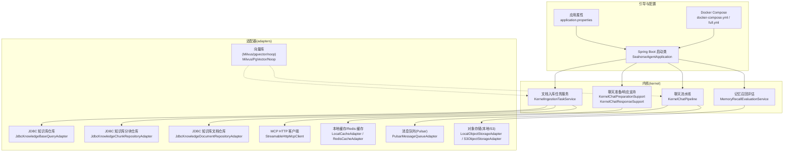
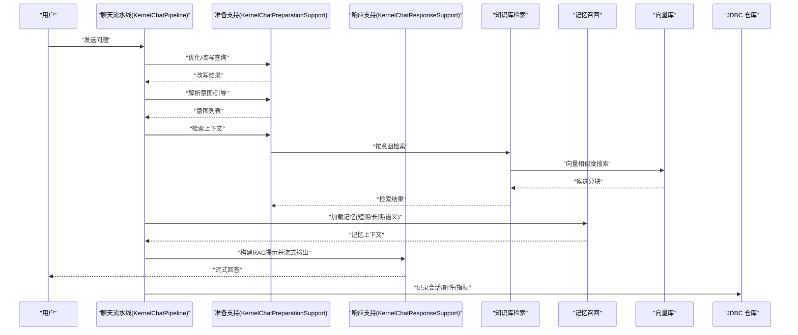
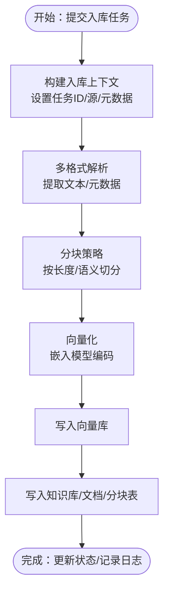
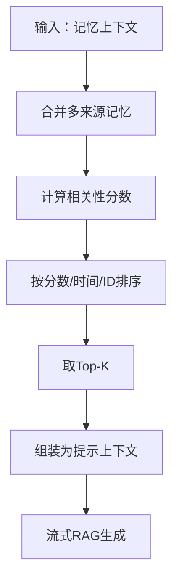
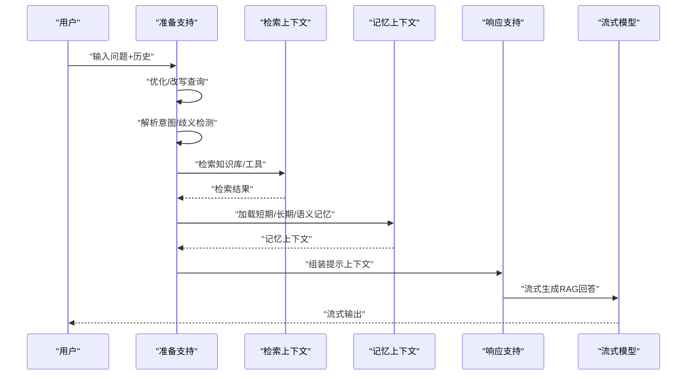
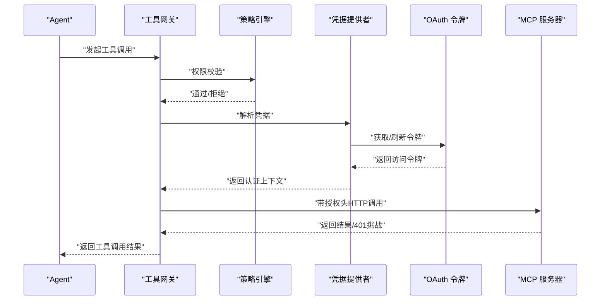
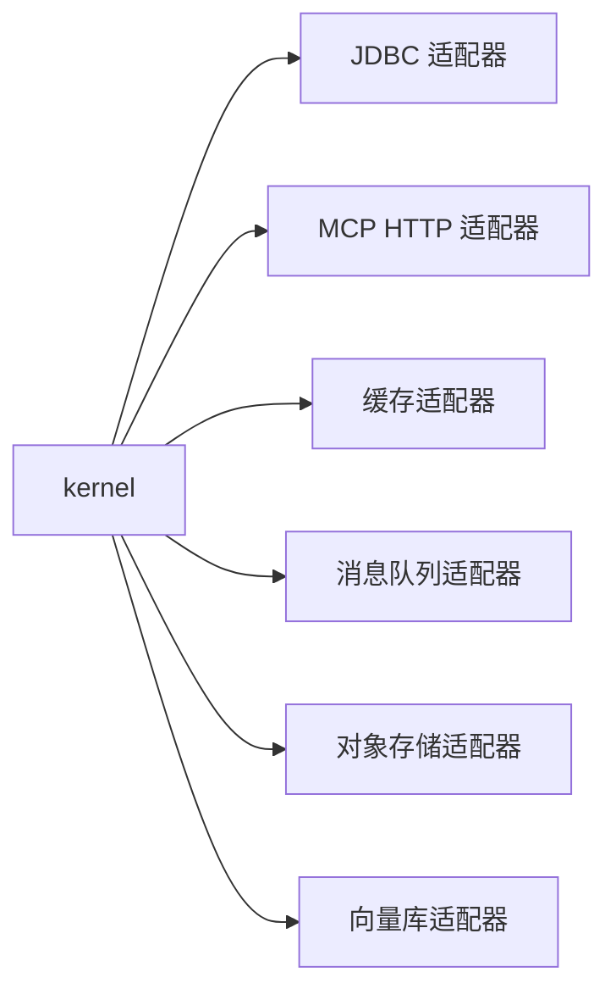

# 核心功能模块

<cite>
**本文引用的文件**
- [IngestionContext.java](file://seahorse-agent-kernel/src/main/java/com/miracle/ai/seahorse/agent/kernel/domain/ingestion/IngestionContext.java)
- [KernelIngestionTaskService.java](file://seahorse-agent-kernel/src/main/java/com/miracle/ai/seahorse/agent/kernel/application/ingestion/KernelIngestionTaskService.java)
- [SearchKnowledgeBaseToolPortAdapter.java](file://seahorse-agent-kernel/src/main/java/com/miracle/ai/seahorse/agent/kernel/application/agent/tool/SearchKnowledgeBaseToolPortAdapter.java)
- [JdbcKnowledgeBaseQueryAdapter.java](file://seahorse-agent-adapter-repository-jdbc/src/main/java/com/miracle/ai/seahorse/agent/adapters/repository/jdbc/JdbcKnowledgeBaseQueryAdapter.java)
- [JdbcKnowledgeChunkRepositoryAdapter.java](file://seahorse-agent-adapter-repository-jdbc/src/main/java/com/miracle/ai/seahorse/agent/adapters/repository/jdbc/JdbcKnowledgeChunkRepositoryAdapter.java)
- [JdbcKnowledgeDocumentRepositoryAdapter.java](file://seahorse-agent-adapter-repository-jdbc/src/main/java/com/miracle/ai/seahorse/agent/adapters/repository/jdbc/JdbcKnowledgeDocumentRepositoryAdapter.java)
- [MemoryRecallEvaluationService.java](file://seahorse-agent-kernel/src/main/java/com/miracle/ai/seahorse/agent/kernel/application/memory/retrieval/MemoryRecallEvaluationService.java)
- [KernelChatPreparationSupport.java](file://seahorse-agent-kernel/src/main/java/com/miracle/ai/seahorse/agent/kernel/application/chat/KernelChatPreparationSupport.java)
- [KernelChatResponseSupport.java](file://seahorse-agent-kernel/src/main/java/com/miracle/ai/seahorse/agent/kernel/application/chat/KernelChatResponseSupport.java)
- [KernelChatPipeline.java](file://seahorse-agent-kernel/src/main/java/com/miracle/ai/seahorse/agent/kernel/application/chat/KernelChatPipeline.java)
- [McpHttpOAuthCredentialTests.java](file://seahorse-agent-adapter-mcp-http/src/test/java/com/miracle/ai/seahorse/agent/adapters/mcp/http/McpHttpOAuthCredentialTests.java)
- [McpToolAllowlistRegistrar.java](file://seahorse-agent-spring-boot-starter/src/main/java/com/miracle/ai/seahorse/agent/adapters/spring/McpToolAllowlistRegistrar.java)
- [05-connectors-credentials-sandbox.md](file://docs/company-agent/ai-infra-phases/05-connectors-credentials-sandbox.md)
- [01-MCP-OAuth2-安全增强设计.md](file://docs/zh/content/架构设计/未实现功能详细设计/01-MCP-OAuth2-安全增强设计.md)
- [application.properties](file://seahorse-agent-bootstrap/src/main/resources/application.properties)
- [docker-compose.yml](file://docker-compose.yml)
- [docker-compose.full.yml](file://docker-compose.full.yml)
- [Milvus 配置示例](file://resources/docker/milvus-stack-2.6.6.compose.yaml)
- [Pulsar 配置示例](file://resources/docker/pulsar-stack-3.1.3.compose.yaml)
</cite>

## 目录
1. [引言](#引言)
2. [项目结构](#项目结构)
3. [核心组件](#核心组件)
4. [架构总览](#架构总览)
5. [详细组件分析](#详细组件分析)
6. [依赖关系分析](#依赖关系分析)
7. [性能考虑](#性能考虑)
8. [故障排查指南](#故障排查指南)
9. [结论](#结论)
10. [附录](#附录)

## 引言
本文件面向Seahorse Agent的核心功能模块，系统性梳理智能文档处理（多格式解析、元数据提取、向量化与持久化）、知识库管理（创建、文档管理、分块策略、检索优化）、会话记忆系统（长期/短期记忆、上下文与过滤）、智能问答（对话处理、意图识别、检索增强生成、流式响应）以及工具调用体系（MCP协议支持、外部工具集成与权限控制）。文档同时提供配置要点、使用示例与最佳实践，并给出性能优化建议与故障排查清单。

## 项目结构
Seahorse Agent采用分层与适配器模式组织代码，核心能力由kernel模块承载，通过众多adapter模块对接外部系统（如向量库、消息队列、缓存、存储等），并通过spring-boot-starter进行装配与自动配置。

图示来源
- [KernelIngestionTaskService.java:144-177](file://seahorse-agent-kernel/src/main/java/com/miracle/ai/seahorse/agent/kernel/application/ingestion/KernelIngestionTaskService.java#L144-L177)
- [KernelChatPipeline.java:117-173](file://seahorse-agent-kernel/src/main/java/com/miracle/ai/seahorse/agent/kernel/application/chat/KernelChatPipeline.java#L117-L173)
- [JdbcKnowledgeBaseQueryAdapter.java:92-126](file://seahorse-agent-adapter-repository-jdbc/src/main/java/com/miracle/ai/seahorse/agent/adapters/repository/jdbc/JdbcKnowledgeBaseQueryAdapter.java#L92-L126)
- [JdbcKnowledgeChunkRepositoryAdapter.java:78-349](file://seahorse-agent-adapter-repository-jdbc/src/main/java/com/miracle/ai/seahorse/agent/adapters/repository/jdbc/JdbcKnowledgeChunkRepositoryAdapter.java#L78-L349)
- [JdbcKnowledgeDocumentRepositoryAdapter.java:399-423](file://seahorse-agent-adapter-repository-jdbc/src/main/java/com/miracle/ai/seahorse/agent/adapters/repository/jdbc/JdbcKnowledgeDocumentRepositoryAdapter.java#L399-L423)
- [StreamableHttpMcpClient.java](file://seahorse-agent-adapter-mcp-http/src/main/java/com/miracle/ai/seahorse/agent/adapters/mcp/http/StreamableHttpMcpClient.java)

章节来源
- [application.properties](file://seahorse-agent-bootstrap/src/main/resources/application.properties)
- [docker-compose.yml](file://docker-compose.yml)
- [docker-compose.full.yml](file://docker-compose.full.yml)

## 核心组件
- 文档入库流水线：负责接收多格式文档、解析、抽取元数据、分块、向量化、写入索引与数据库，并记录状态与日志。
- 知识库管理：提供知识库、文档、分块的CRUD与查询接口，支持分页、启用状态、集合名等维度管理。
- 记忆系统：整合多种记忆类型（长期、短期、语义、业务文档等），基于相关性评分与时间排序进行召回与过滤。
- 智能问答：包含查询改写、意图识别、检索上下文组装、RAG提示构建与流式响应输出。
- 工具调用：支持MCP协议，提供OAuth2令牌注入、scope挑战处理、权限白名单与审计。

章节来源
- [IngestionContext.java:32-62](file://seahorse-agent-kernel/src/main/java/com/miracle/ai/seahorse/agent/kernel/domain/ingestion/IngestionContext.java#L32-L62)
- [KernelIngestionTaskService.java:144-177](file://seahorse-agent-kernel/src/main/java/com/miracle/ai/seahorse/agent/kernel/application/ingestion/KernelIngestionTaskService.java#L144-L177)
- [JdbcKnowledgeBaseQueryAdapter.java:92-126](file://seahorse-agent-adapter-repository-jdbc/src/main/java/com/miracle/ai/seahorse/agent/adapters/repository/jdbc/JdbcKnowledgeBaseQueryAdapter.java#L92-L126)
- [JdbcKnowledgeChunkRepositoryAdapter.java:78-349](file://seahorse-agent-adapter-repository-jdbc/src/main/java/com/miracle/ai/seahorse/agent/adapters/repository/jdbc/JdbcKnowledgeChunkRepositoryAdapter.java#L78-L349)
- [JdbcKnowledgeDocumentRepositoryAdapter.java:399-423](file://seahorse-agent-adapter-repository-jdbc/src/main/java/com/miracle/ai/seahorse/agent/adapters/repository/jdbc/JdbcKnowledgeDocumentRepositoryAdapter.java#L399-L423)
- [MemoryRecallEvaluationService.java:211-243](file://seahorse-agent-kernel/src/main/java/com/miracle/ai/seahorse/agent/kernel/application/memory/retrieval/MemoryRecallEvaluationService.java#L211-L243)
- [KernelChatPreparationSupport.java:109-143](file://seahorse-agent-kernel/src/main/java/com/miracle/ai/seahorse/agent/kernel/application/chat/KernelChatPreparationSupport.java#L109-L143)
- [KernelChatResponseSupport.java:98-126](file://seahorse-agent-kernel/src/main/java/com/miracle/ai/seahorse/agent/kernel/application/chat/KernelChatResponseSupport.java#L98-L126)
- [KernelChatPipeline.java:117-173](file://seahorse-agent-kernel/src/main/java/com/miracle/ai/seahorse/agent/kernel/application/chat/KernelChatPipeline.java#L117-L173)

## 架构总览
Seahorse Agent以kernel为核心，围绕“文档入库—知识库—记忆—问答—工具调用”形成闭环。数据与能力通过适配器解耦，便于替换与扩展。

图示来源
- [KernelChatPipeline.java:117-173](file://seahorse-agent-kernel/src/main/java/com/miracle/ai/seahorse/agent/kernel/application/chat/KernelChatPipeline.java#L117-L173)
- [KernelChatPreparationSupport.java:109-143](file://seahorse-agent-kernel/src/main/java/com/miracle/ai/seahorse/agent/kernel/application/chat/KernelChatPreparationSupport.java#L109-L143)
- [KernelChatResponseSupport.java:98-126](file://seahorse-agent-kernel/src/main/java/com/miracle/ai/seahorse/agent/kernel/application/chat/KernelChatResponseSupport.java#L98-L126)

## 详细组件分析

### 文档入库与知识库管理
- 入库上下文与状态：IngestionContext封装任务ID、源信息、原始字节、MIME类型、解析文本、分块、关键词、问题、元数据、向量空间ID、状态与错误等。
- 任务创建与上下文构建：KernelIngestionTaskService根据输入创建任务值对象，构建初始元数据（含来源、文件名等），并建立上下文。
- 知识库查询与分页：JdbcKnowledgeBaseQueryAdapter提供知识库、文档、分块的摘要查询与分页限制，支持最小/最大限制约束。
- 分块持久化：JdbcKnowledgeChunkRepositoryAdapter维护分块的插入、更新、计数、最大索引等SQL操作，支持启用状态与统计字段。
- 文档分块上下文：JdbcKnowledgeDocumentRepositoryAdapter提供文档与分块的记录映射，包含元数据JSON列兼容逻辑。

图示来源
- [IngestionContext.java:32-62](file://seahorse-agent-kernel/src/main/java/com/miracle/ai/seahorse/agent/kernel/domain/ingestion/IngestionContext.java#L32-L62)
- [KernelIngestionTaskService.java:144-177](file://seahorse-agent-kernel/src/main/java/com/miracle/ai/seahorse/agent/kernel/application/ingestion/KernelIngestionTaskService.java#L144-L177)
- [JdbcKnowledgeBaseQueryAdapter.java:92-126](file://seahorse-agent-adapter-repository-jdbc/src/main/java/com/miracle/ai/seahorse/agent/adapters/repository/jdbc/JdbcKnowledgeBaseQueryAdapter.java#L92-L126)
- [JdbcKnowledgeChunkRepositoryAdapter.java:78-349](file://seahorse-agent-adapter-repository-jdbc/src/main/java/com/miracle/ai/seahorse/agent/adapters/repository/jdbc/JdbcKnowledgeChunkRepositoryAdapter.java#L78-L349)
- [JdbcKnowledgeDocumentRepositoryAdapter.java:399-423](file://seahorse-agent-adapter-repository-jdbc/src/main/java/com/miracle/ai/seahorse/agent/adapters/repository/jdbc/JdbcKnowledgeDocumentRepositoryAdapter.java#L399-L423)

章节来源
- [IngestionContext.java:32-62](file://seahorse-agent-kernel/src/main/java/com/miracle/ai/seahorse/agent/kernel/domain/ingestion/IngestionContext.java#L32-L62)
- [KernelIngestionTaskService.java:144-177](file://seahorse-agent-kernel/src/main/java/com/miracle/ai/seahorse/agent/kernel/application/ingestion/KernelIngestionTaskService.java#L144-L177)
- [JdbcKnowledgeBaseQueryAdapter.java:92-126](file://seahorse-agent-adapter-repository-jdbc/src/main/java/com/miracle/ai/seahorse/agent/adapters/repository/jdbc/JdbcKnowledgeBaseQueryAdapter.java#L92-L126)
- [JdbcKnowledgeChunkRepositoryAdapter.java:78-349](file://seahorse-agent-adapter-repository-jdbc/src/main/java/com/miracle/ai/seahorse/agent/adapters/repository/jdbc/JdbcKnowledgeChunkRepositoryAdapter.java#L78-L349)
- [JdbcKnowledgeDocumentRepositoryAdapter.java:399-423](file://seahorse-agent-adapter-repository-jdbc/src/main/java/com/miracle/ai/seahorse/agent/adapters/repository/jdbc/JdbcKnowledgeDocumentRepositoryAdapter.java#L399-L423)

### 会话记忆系统
- 记忆召回评估：MemoryRecallEvaluationService对多种记忆来源（档案、修正、短期、长期、语义、业务文档）进行合并与排序，依据相关性分数、创建时间与ID进行稳定排序。
- 上下文组装：KernelChatResponseSupport在流式RAG响应前，将记忆上下文与检索上下文、MCP上下文、意图分组等组合为结构化提示上下文。

图示来源
- [MemoryRecallEvaluationService.java:211-243](file://seahorse-agent-kernel/src/main/java/com/miracle/ai/seahorse/agent/kernel/application/memory/retrieval/MemoryRecallEvaluationService.java#L211-L243)
- [KernelChatResponseSupport.java:98-126](file://seahorse-agent-kernel/src/main/java/com/miracle/ai/seahorse/agent/kernel/application/chat/KernelChatResponseSupport.java#L98-L126)

章节来源
- [MemoryRecallEvaluationService.java:211-243](file://seahorse-agent-kernel/src/main/java/com/miracle/ai/seahorse/agent/kernel/application/memory/retrieval/MemoryRecallEvaluationService.java#L211-L243)
- [KernelChatResponseSupport.java:98-126](file://seahorse-agent-kernel/src/main/java/com/miracle/ai/seahorse/agent/kernel/application/chat/KernelChatResponseSupport.java#L98-L126)

### 智能问答系统
- 查询优化与改写：KernelChatPreparationSupport对输入进行优化与拆分改写，结合历史消息生成改写结果。
- 意图识别与引导：解析子问题意图，检测歧义并可引导用户提供更明确的问题。
- 检索上下文：根据意图进行知识库检索，组装MCP上下文与意图分块。
- 流式响应：KernelChatResponseSupport构建结构化消息，调用流式模型进行RAG回答；若无检索结果，按策略回退。

图示来源
- [KernelChatPreparationSupport.java:109-143](file://seahorse-agent-kernel/src/main/java/com/miracle/ai/seahorse/agent/kernel/application/chat/KernelChatPreparationSupport.java#L109-L143)
- [KernelChatPipeline.java:117-173](file://seahorse-agent-kernel/src/main/java/com/miracle/ai/seahorse/agent/kernel/application/chat/KernelChatPipeline.java#L117-L173)
- [KernelChatResponseSupport.java:98-126](file://seahorse-agent-kernel/src/main/java/com/miracle/ai/seahorse/agent/kernel/application/chat/KernelChatResponseSupport.java#L98-L126)

章节来源
- [KernelChatPreparationSupport.java:109-143](file://seahorse-agent-kernel/src/main/java/com/miracle/ai/seahorse/agent/kernel/application/chat/KernelChatPreparationSupport.java#L109-L143)
- [KernelChatPipeline.java:117-173](file://seahorse-agent-kernel/src/main/java/com/miracle/ai/seahorse/agent/kernel/application/chat/KernelChatPipeline.java#L117-L173)
- [KernelChatResponseSupport.java:98-126](file://seahorse-agent-kernel/src/main/java/com/miracle/ai/seahorse/agent/kernel/application/chat/KernelChatResponseSupport.java#L98-L126)

### 工具调用系统（MCP）
- OAuth2与静态Bearer：McpHttpOAuthCredentialTests验证客户端凭证配置与OAuth2令牌获取流程，支持client_credentials与scope挑战处理。
- 白名单与暴露策略：McpToolAllowlistRegistrar负责将MCP工具注册到工具目录，结合高级特性门控与暴露策略进行权限控制。
- 安全增强设计：01-MCP-OAuth2-安全增强设计文档描述了认证头注入、token刷新、scope挑战、审计与不落明文等要求。

图示来源
- [McpHttpOAuthCredentialTests.java:98-117](file://seahorse-agent-adapter-mcp-http/src/test/java/com/miracle/ai/seahorse/agent/adapters/mcp/http/McpHttpOAuthCredentialTests.java#L98-L117)
- [McpToolAllowlistRegistrar.java:54-79](file://seahorse-agent-spring-boot-starter/src/main/java/com/miracle/ai/seahorse/agent/adapters/spring/McpToolAllowlistRegistrar.java#L54-L79)
- [01-MCP-OAuth2-安全增强设计.md:396-453](file://docs/zh/content/架构设计/未实现功能详细设计/01-MCP-OAuth2-安全增强设计.md#L396-L453)

章节来源
- [McpHttpOAuthCredentialTests.java:98-117](file://seahorse-agent-adapter-mcp-http/src/test/java/com/miracle/ai/seahorse/agent/adapters/mcp/http/McpHttpOAuthCredentialTests.java#L98-L117)
- [McpToolAllowlistRegistrar.java:54-79](file://seahorse-agent-spring-boot-starter/src/main/java/com/miracle/ai/seahorse/agent/adapters/spring/McpToolAllowlistRegistrar.java#L54-L79)
- [01-MCP-OAuth2-安全增强设计.md:396-453](file://docs/zh/content/架构设计/未实现功能详细设计/01-MCP-OAuth2-安全增强设计.md#L396-L453)
- [05-connectors-credentials-sandbox.md:1-64](file://docs/company-agent/ai-infra-phases/05-connectors-credentials-sandbox.md#L1-L64)

## 依赖关系分析
- 组件内聚与耦合：kernel模块通过端口接口与适配器解耦，避免直接依赖具体实现；知识库与向量库通过适配器抽象隔离。
- 外部依赖：向量库（Milvus/pgvector/noop）、消息队列（Pulsar）、缓存（本地/Redis）、对象存储（本地/S3）均通过META-INF SPI注册。
- 循环依赖：从代码结构看，kernel对适配器为单向依赖，未见循环依赖迹象。

图示来源
- [JdbcKnowledgeBaseQueryAdapter.java:92-126](file://seahorse-agent-adapter-repository-jdbc/src/main/java/com/miracle/ai/seahorse/agent/adapters/repository/jdbc/JdbcKnowledgeBaseQueryAdapter.java#L92-L126)
- [StreamableHttpMcpClient.java](file://seahorse-agent-adapter-mcp-http/src/main/java/com/miracle/ai/seahorse/agent/adapters/mcp/http/StreamableHttpMcpClient.java)

章节来源
- [JdbcKnowledgeBaseQueryAdapter.java:92-126](file://seahorse-agent-adapter-repository-jdbc/src/main/java/com/miracle/ai/seahorse/agent/adapters/repository/jdbc/JdbcKnowledgeBaseQueryAdapter.java#L92-L126)
- [JdbcKnowledgeChunkRepositoryAdapter.java:78-349](file://seahorse-agent-adapter-repository-jdbc/src/main/java/com/miracle/ai/seahorse/agent/adapters/repository/jdbc/JdbcKnowledgeChunkRepositoryAdapter.java#L78-L349)
- [JdbcKnowledgeDocumentRepositoryAdapter.java:399-423](file://seahorse-agent-adapter-repository-jdbc/src/main/java/com/miracle/ai/seahorse/agent/adapters/repository/jdbc/JdbcKnowledgeDocumentRepositoryAdapter.java#L399-L423)

## 性能考虑
- 向量检索Top-K与过滤：合理设置Top-K与质量信号阈值，避免过多无关分块进入提示上下文。
- 分块大小与重叠：根据下游模型上下文长度限制调整分块大小与重叠，减少截断与语义断裂。
- 并发与限流：利用分布式信号量与速率限制适配器控制并发与QPS，避免下游系统过载。
- 缓存策略：对热点查询与工具调用结果进行缓存，降低重复计算与网络开销。
- 存储与索引：为向量库与关键字索引配置合适的分区、副本与倒排索引参数，平衡查询延迟与写入吞吐。
- 流式输出：前端按流式片段增量渲染，减少首字节延迟与内存峰值。

## 故障排查指南
- 入库失败与状态追踪
  - 现象：入库任务状态为FAILED且携带异常。
  - 排查：检查IngestionContext中的错误字段与日志节点，定位解析/分块/向量化/写库任一环节异常。
  - 参考：[KernelIngestionTaskService.java:144-148](file://seahorse-agent-kernel/src/main/java/com/miracle/ai/seahorse/agent/kernel/application/ingestion/KernelIngestionTaskService.java#L144-L148)
- 知识库检索为空
  - 现象：检索结果为空或质量信号显示空集。
  - 排查：确认知识库启用状态、分块是否已写入向量库、集合名与模型匹配；检查Top-K与过滤条件。
  - 参考：[SearchKnowledgeBaseToolPortAdapter.java:78-111](file://seahorse-agent-kernel/src/main/java/com/miracle/ai/seahorse/agent/kernel/application/agent/tool/SearchKnowledgeBaseToolPortAdapter.java#L78-L111)
- 记忆召回偏差
  - 现象：召回结果与预期不符。
  - 排查：检查记忆来源类型与相关性评分计算，确认排序规则与时间窗口设置。
  - 参考：[MemoryRecallEvaluationService.java:211-243](file://seahorse-agent-kernel/src/main/java/com/miracle/ai/seahorse/agent/kernel/application/memory/retrieval/MemoryRecallEvaluationService.java#L211-L243)
- 工具调用401或权限不足
  - 现象：MCP调用返回401或scope不足。
  - 排查：确认OAuth配置、scope声明与挑战处理流程；检查工具白名单与暴露策略。
  - 参考：[McpHttpOAuthCredentialTests.java:98-117](file://seahorse-agent-adapter-mcp-http/src/test/java/com/miracle/ai/seahorse/agent/adapters/mcp/http/McpHttpOAuthCredentialTests.java#L98-L117)
- 向量库/消息队列不可用
  - 现象：启动或运行时连接异常。
  - 排查：检查Docker Compose配置与容器健康状态，确认网络连通与端口映射。
  - 参考：[docker-compose.yml](file://docker-compose.yml)、[docker-compose.full.yml](file://docker-compose.full.yml)、[Milvus 配置示例](file://resources/docker/milvus-stack-2.6.6.compose.yaml)、[Pulsar 配置示例](file://resources/docker/pulsar-stack-3.1.3.compose.yaml)

章节来源
- [KernelIngestionTaskService.java:144-148](file://seahorse-agent-kernel/src/main/java/com/miracle/ai/seahorse/agent/kernel/application/ingestion/KernelIngestionTaskService.java#L144-L148)
- [SearchKnowledgeBaseToolPortAdapter.java:78-111](file://seahorse-agent-kernel/src/main/java/com/miracle/ai/seahorse/agent/kernel/application/agent/tool/SearchKnowledgeBaseToolPortAdapter.java#L78-L111)
- [MemoryRecallEvaluationService.java:211-243](file://seahorse-agent-kernel/src/main/java/com/miracle/ai/seahorse/agent/kernel/application/memory/retrieval/MemoryRecallEvaluationService.java#L211-L243)
- [McpHttpOAuthCredentialTests.java:98-117](file://seahorse-agent-adapter-mcp-http/src/test/java/com/miracle/ai/seahorse/agent/adapters/mcp/http/McpHttpOAuthCredentialTests.java#L98-L117)
- [docker-compose.yml](file://docker-compose.yml)
- [docker-compose.full.yml](file://docker-compose.full.yml)
- [Milvus 配置示例](file://resources/docker/milvus-stack-2.6.6.compose.yaml)
- [Pulsar 配置示例](file://resources/docker/pulsar-stack-3.1.3.compose.yaml)

## 结论
Seahorse Agent通过清晰的内核-适配器架构实现了从文档入库到知识库管理、从记忆召回到智能问答、再到MCP工具调用的完整链路。其模块化设计便于在不同环境中灵活替换底层实现，并通过严格的权限与审计机制保障企业级安全。建议在生产部署中重点关注向量检索Top-K、分块策略、缓存与限流、以及MCP的OAuth与白名单治理。

## 附录
- 使用示例与最佳实践
  - 文档入库：确保MIME类型正确、元数据键值规范、分块大小适配模型上下文长度。
  - 知识库检索：优先使用意图驱动检索，结合质量信号与Top-K裁剪结果。
  - 记忆系统：按场景选择记忆来源，设定合理的相关性阈值与时间窗口。
  - 工具调用：严格配置OAuth scope与audience，启用白名单与审计，避免敏感信息泄露。
- 配置参考
  - 应用属性与适配器配置：参考 [application.properties](file://seahorse-agent-bootstrap/src/main/resources/application.properties)
  - 容器编排：参考 [docker-compose.yml](file://docker-compose.yml)、[docker-compose.full.yml](file://docker-compose.full.yml)
  - 向量库与消息队列样例：参考 [Milvus 配置示例](file://resources/docker/milvus-stack-2.6.6.compose.yaml)、[Pulsar 配置示例](file://resources/docker/pulsar-stack-3.1.3.compose.yaml)