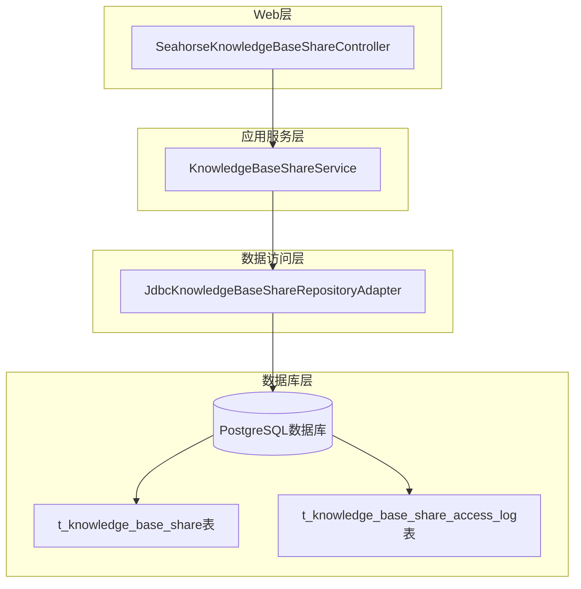
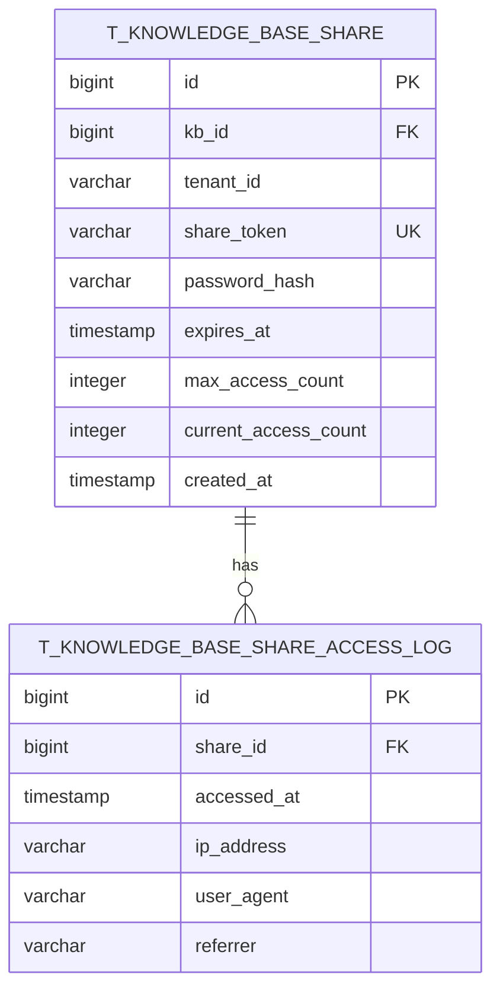
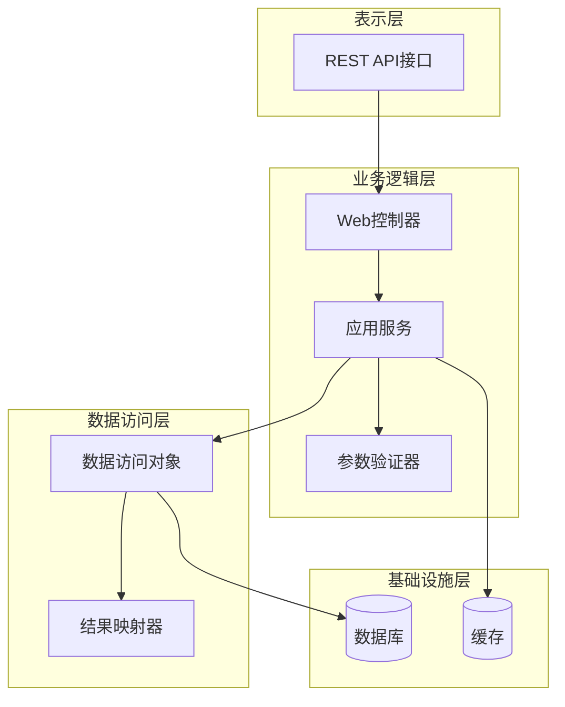
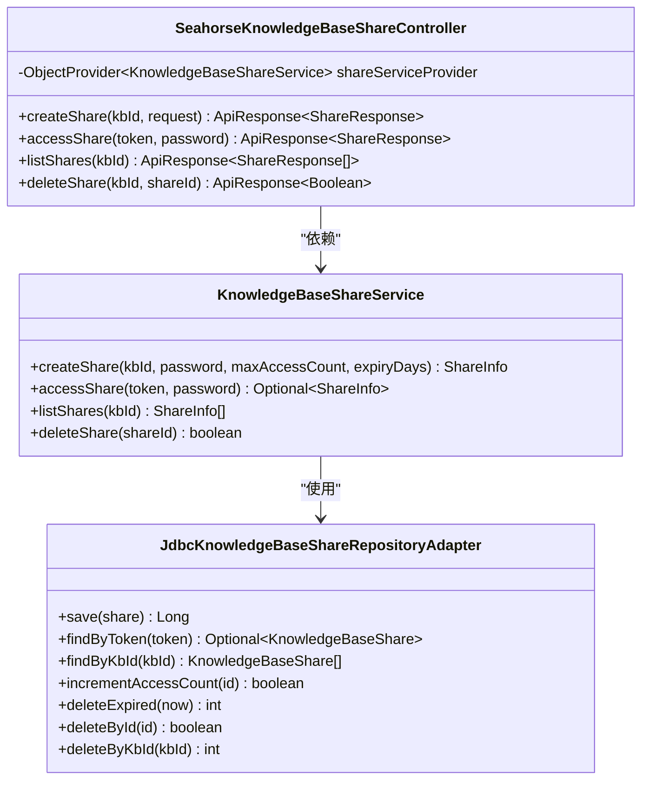
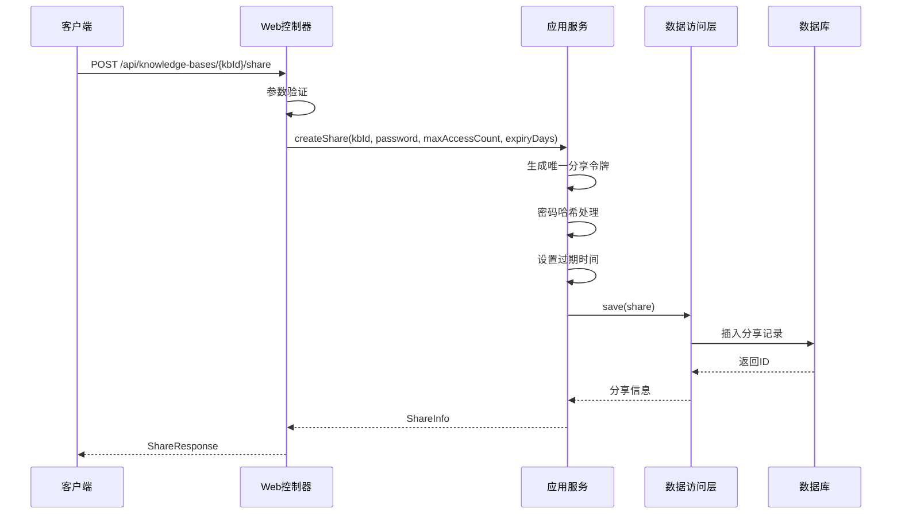
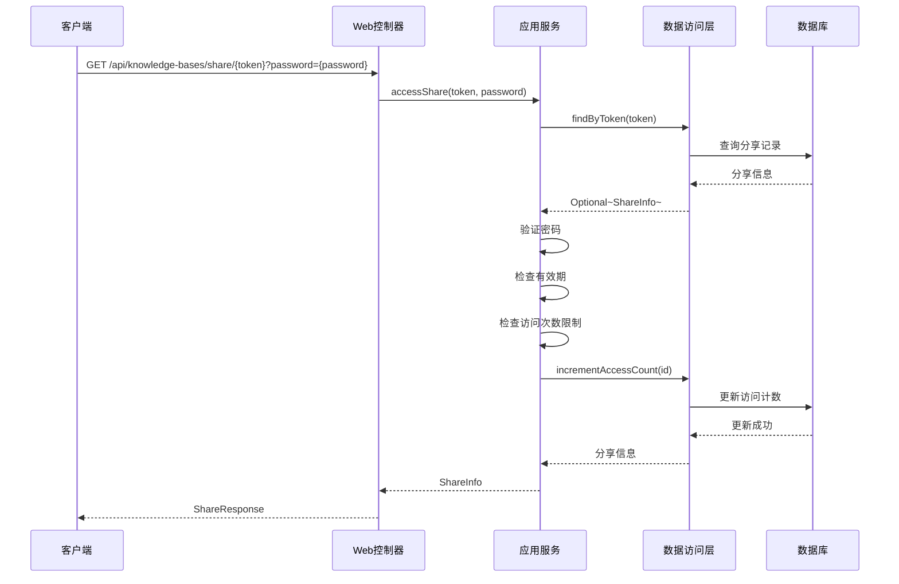
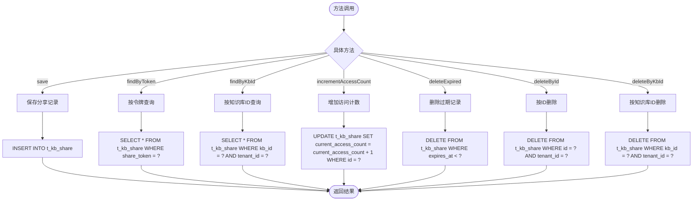
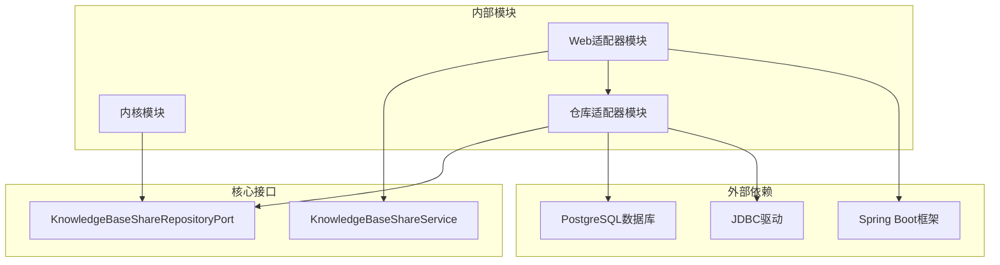

# 知识库分享

<cite>
**本文档引用的文件**
- [V8__knowledge_base_enhancement.sql](file://resources/database/migrations/V8__knowledge_base_enhancement.sql)
- [SeahorseKnowledgeBaseShareController.java](file://seahorse-agent-adapter-web/src/main/java/com/miracle/ai/seahorse/agent/adapters/web/SeahorseKnowledgeBaseShareController.java)
- [JdbcKnowledgeBaseShareRepositoryAdapter.java](file://seahorse-agent-adapter-repository-jdbc/src/main/java/com/miracle/ai/seahorse/agent/adapters/repository/jdbc/JdbcKnowledgeBaseShareRepositoryAdapter.java)
- [KnowledgeBaseShareService.java](file://seahorse-agent-kernel/src/main/java/com/miracle/ai/seahorse/agent/kernel/application/knowledge/KnowledgeBaseShareService.java)
- [KnowledgeBaseShareRepositoryPort.java](file://seahorse-agent-kernel/src/main/java/com/miracle/ai/seahorse/agent/ports/outbound/knowledge/KnowledgeBaseShareRepositoryPort.java)
</cite>

## 目录
1. [简介](#简介)
2. [项目结构](#项目结构)
3. [核心组件](#核心组件)
4. [架构概览](#架构概览)
5. [详细组件分析](#详细组件分析)
6. [依赖关系分析](#依赖关系分析)
7. [性能考虑](#性能考虑)
8. [故障排除指南](#故障排除指南)
9. [结论](#结论)

## 简介

知识库分享是Seahorse Agent项目中的一个核心功能模块，允许用户创建、管理和访问知识库的外部分享链接。该功能通过生成唯一的分享令牌（share_token）来实现安全的知识库内容分享，支持密码保护、访问次数限制和过期时间控制。

本系统采用分层架构设计，包含Web控制器层、应用服务层、数据访问层和数据库持久化层，确保了功能的可扩展性和安全性。

## 项目结构

知识库分享功能在项目中的组织结构如下：

**图表来源**
- [SeahorseKnowledgeBaseShareController.java:34-82](file://seahorse-agent-adapter-web/src/main/java/com/miracle/ai/seahorse/agent/adapters/web/SeahorseKnowledgeBaseShareController.java#L34-L82)
- [KnowledgeBaseShareService.java](file://seahorse-agent-kernel/src/main/java/com/miracle/ai/seahorse/agent/kernel/application/knowledge/KnowledgeBaseShareService.java)
- [JdbcKnowledgeBaseShareRepositoryAdapter.java:34-135](file://seahorse-agent-adapter-repository-jdbc/src/main/java/com/miracle/ai/seahorse/agent/adapters/repository/jdbc/JdbcKnowledgeBaseShareRepositoryAdapter.java#L34-L135)

**章节来源**
- [SeahorseKnowledgeBaseShareController.java:34-82](file://seahorse-agent-adapter-web/src/main/java/com/miracle/ai/seahorse/agent/adapters/web/SeahorseKnowledgeBaseShareController.java#L34-L82)
- [JdbcKnowledgeBaseShareRepositoryAdapter.java:34-135](file://seahorse-agent-adapter-repository-jdbc/src/main/java/com/miracle/ai/seahorse/agent/adapters/repository/jdbc/JdbcKnowledgeBaseShareRepositoryAdapter.java#L34-L135)

## 核心组件

### 数据库表结构

知识库分享功能涉及两个核心数据库表：

**图表来源**
- [V8__knowledge_base_enhancement.sql:40-68](file://resources/database/migrations/V8__knowledge_base_enhancement.sql#L40-L68)

### Web控制器

Web控制器提供RESTful API接口，处理知识库分享的各种操作：

- 创建分享：POST `/api/knowledge-bases/{kbId}/share`
- 访问分享：GET `/api/knowledge-bases/share/{token}`
- 列出分享：GET `/api/knowledge-bases/{kbId}/shares`
- 删除分享：DELETE `/api/knowledge-bases/{kbId}/shares/{shareId}`

**章节来源**
- [SeahorseKnowledgeBaseShareController.java:43-75](file://seahorse-agent-adapter-web/src/main/java/com/miracle/ai/seahorse/agent/adapters/web/SeahorseKnowledgeBaseShareController.java#L43-L75)

## 架构概览

知识库分享系统的整体架构采用经典的三层架构模式：

**图表来源**
- [SeahorseKnowledgeBaseShareController.java:34-82](file://seahorse-agent-adapter-web/src/main/java/com/miracle/ai/seahorse/agent/adapters/web/SeahorseKnowledgeBaseShareController.java#L34-L82)
- [KnowledgeBaseShareService.java](file://seahorse-agent-kernel/src/main/java/com/miracle/ai/seahorse/agent/kernel/application/knowledge/KnowledgeBaseShareService.java)
- [JdbcKnowledgeBaseShareRepositoryAdapter.java:34-135](file://seahorse-agent-adapter-repository-jdbc/src/main/java/com/miracle/ai/seahorse/agent/adapters/repository/jdbc/JdbcKnowledgeBaseShareRepositoryAdapter.java#L34-L135)

## 详细组件分析

### Web控制器组件分析

Web控制器负责处理HTTP请求和响应，实现以下核心功能：

**图表来源**
- [SeahorseKnowledgeBaseShareController.java:34-82](file://seahorse-agent-adapter-web/src/main/java/com/miracle/ai/seahorse/agent/adapters/web/SeahorseKnowledgeBaseShareController.java#L34-L82)
- [KnowledgeBaseShareService.java](file://seahorse-agent-kernel/src/main/java/com/miracle/ai/seahorse/agent/kernel/application/knowledge/KnowledgeBaseShareService.java)
- [JdbcKnowledgeBaseShareRepositoryAdapter.java:34-135](file://seahorse-agent-adapter-repository-jdbc/src/main/java/com/miracle/ai/seahorse/agent/adapters/repository/jdbc/JdbcKnowledgeBaseShareRepositoryAdapter.java#L34-L135)

### 分享创建流程

分享创建过程涉及多个步骤的安全验证和数据处理：

**图表来源**
- [SeahorseKnowledgeBaseShareController.java:43-51](file://seahorse-agent-adapter-web/src/main/java/com/miracle/ai/seahorse/agent/adapters/web/SeahorseKnowledgeBaseShareController.java#L43-L51)
- [KnowledgeBaseShareService.java](file://seahorse-agent-kernel/src/main/java/com/miracle/ai/seahorse/agent/kernel/application/knowledge/KnowledgeBaseShareService.java)
- [JdbcKnowledgeBaseShareRepositoryAdapter.java:90-97](file://seahorse-agent-adapter-repository-jdbc/src/main/java/com/miracle/ai/seahorse/agent/adapters/repository/jdbc/JdbcKnowledgeBaseShareRepositoryAdapter.java#L90-L97)

### 分享访问流程

分享访问过程包含安全验证和访问统计更新：

**图表来源**
- [SeahorseKnowledgeBaseShareController.java:53-60](file://seahorse-agent-adapter-web/src/main/java/com/miracle/ai/seahorse/agent/adapters/web/SeahorseKnowledgeBaseShareController.java#L53-L60)
- [KnowledgeBaseShareService.java](file://seahorse-agent-kernel/src/main/java/com/miracle/ai/seahorse/agent/kernel/application/knowledge/KnowledgeBaseShareService.java)
- [JdbcKnowledgeBaseShareRepositoryAdapter.java:100-117](file://seahorse-agent-adapter-repository-jdbc/src/main/java/com/miracle/ai/seahorse/agent/adapters/repository/jdbc/JdbcKnowledgeBaseShareRepositoryAdapter.java#L100-L117)

### 数据访问层分析

数据访问层实现了对知识库分享数据的CRUD操作：

**图表来源**
- [JdbcKnowledgeBaseShareRepositoryAdapter.java:40-135](file://seahorse-agent-adapter-repository-jdbc/src/main/java/com/miracle/ai/seahorse/agent/adapters/repository/jdbc/JdbcKnowledgeBaseShareRepositoryAdapter.java#L40-L135)

**章节来源**
- [JdbcKnowledgeBaseShareRepositoryAdapter.java:34-135](file://seahorse-agent-adapter-repository-jdbc/src/main/java/com/miracle/ai/seahorse/agent/adapters/repository/jdbc/JdbcKnowledgeBaseShareRepositoryAdapter.java#L34-L135)

## 依赖关系分析

知识库分享功能的依赖关系体现了清晰的分层架构：

**图表来源**
- [SeahorseKnowledgeBaseShareController.java:34-82](file://seahorse-agent-adapter-web/src/main/java/com/miracle/ai/seahorse/agent/adapters/web/SeahorseKnowledgeBaseShareController.java#L34-L82)
- [KnowledgeBaseShareRepositoryPort.java](file://seahorse-agent-kernel/src/main/java/com/miracle/ai/seahorse/agent/ports/outbound/knowledge/KnowledgeBaseShareRepositoryPort.java)
- [KnowledgeBaseShareService.java](file://seahorse-agent-kernel/src/main/java/com/miracle/ai/seahorse/agent/kernel/application/knowledge/KnowledgeBaseShareService.java)

**章节来源**
- [KnowledgeBaseShareRepositoryPort.java](file://seahorse-agent-kernel/src/main/java/com/miracle/ai/seahorse/agent/ports/outbound/knowledge/KnowledgeBaseShareRepositoryPort.java)
- [KnowledgeBaseShareService.java](file://seahorse-agent-kernel/src/main/java/com/miracle/ai/seahorse/agent/kernel/application/knowledge/KnowledgeBaseShareService.java)

## 性能考虑

### 数据库优化

1. **索引策略**：为分享令牌、知识库ID、租户ID和过期时间建立了适当的索引，确保查询性能
2. **访问计数优化**：使用原子更新操作减少并发访问冲突
3. **批量清理**：定期清理过期的分享记录，保持数据库整洁

### 缓存策略

虽然当前实现主要依赖数据库，但可以考虑以下缓存优化：
- 分享令牌到分享信息的缓存映射
- 最近访问的分享列表缓存
- 租户级别的分享统计缓存

### 并发控制

系统通过以下机制保证并发安全：
- 数据库层面的事务控制
- 原子性的访问计数更新
- 租户隔离的查询条件

## 故障排除指南

### 常见问题及解决方案

1. **分享链接无法访问**
   - 检查分享令牌是否正确
   - 验证分享是否已过期
   - 确认密码输入是否正确
   - 检查访问次数限制

2. **创建分享失败**
   - 验证知识库ID的有效性
   - 检查用户权限
   - 确认数据库连接正常
   - 查看具体的错误日志

3. **访问统计不准确**
   - 检查数据库事务配置
   - 验证并发访问处理
   - 确认访问计数更新语句执行

**章节来源**
- [JdbcKnowledgeBaseShareRepositoryAdapter.java:100-117](file://seahorse-agent-adapter-repository-jdbc/src/main/java/com/miracle/ai/seahorse/agent/adapters/repository/jdbc/JdbcKnowledgeBaseShareRepositoryAdapter.java#L100-L117)

## 结论

知识库分享功能通过精心设计的分层架构和安全机制，为用户提供了一个强大而易用的知识库分享解决方案。系统的主要优势包括：

1. **安全性**：支持密码保护、访问次数限制和过期时间控制
2. **可扩展性**：模块化的架构设计便于功能扩展
3. **可靠性**：完善的错误处理和并发控制机制
4. **可维护性**：清晰的代码结构和详细的文档

未来可以考虑的改进方向包括：
- 添加更多分享统计和分析功能
- 实现更灵活的权限控制机制
- 优化大流量场景下的性能表现
- 增强用户体验和界面友好性