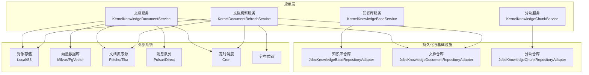
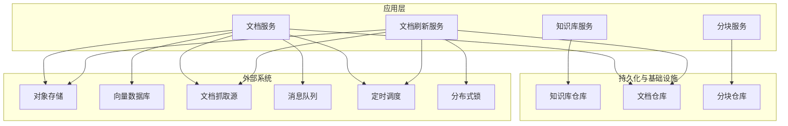
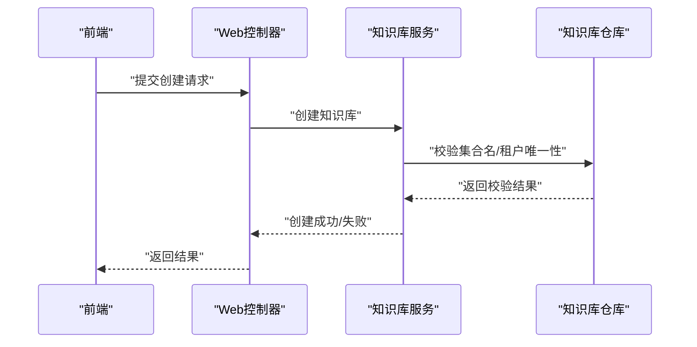
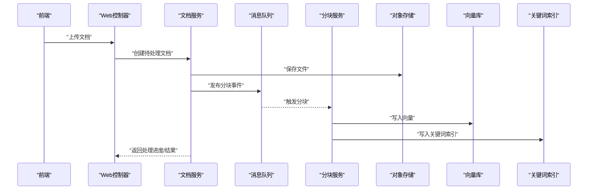
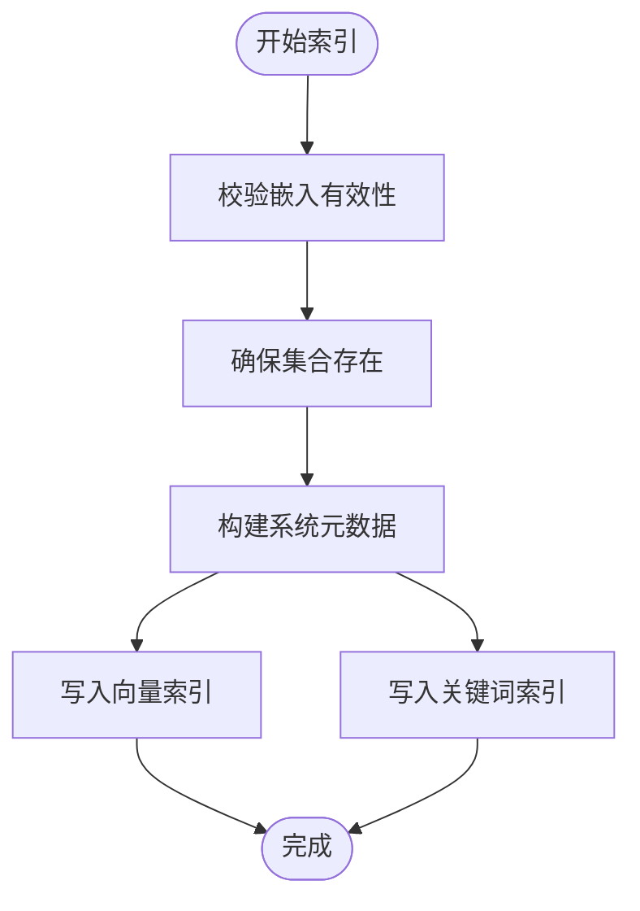
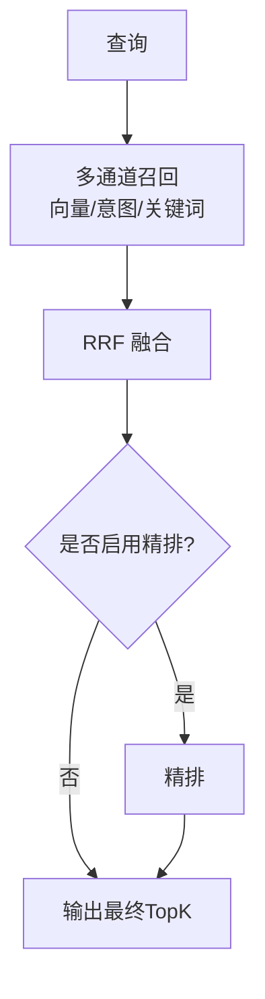
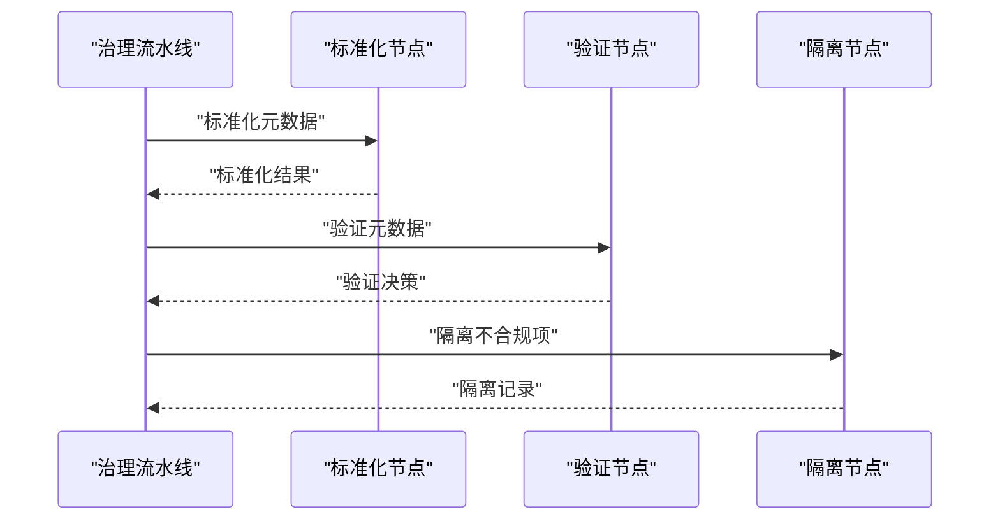
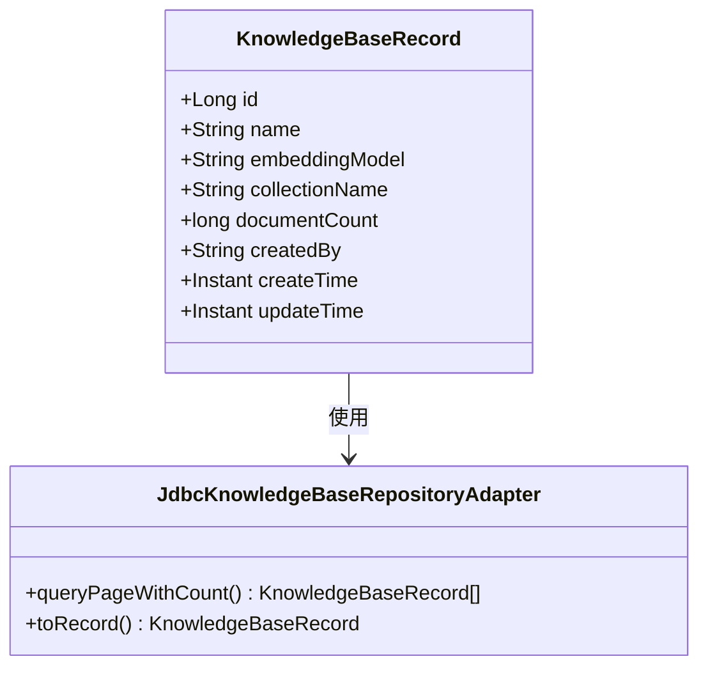
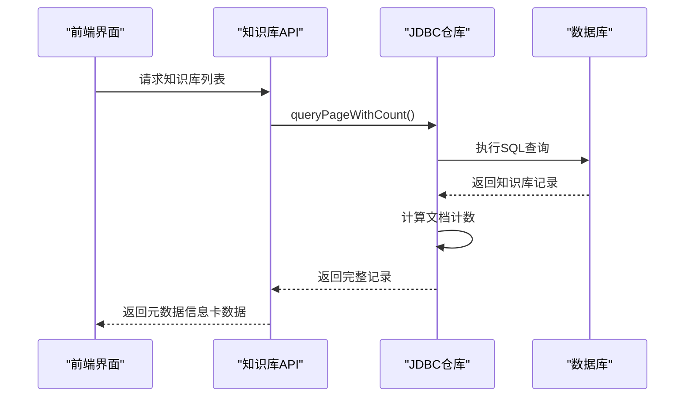
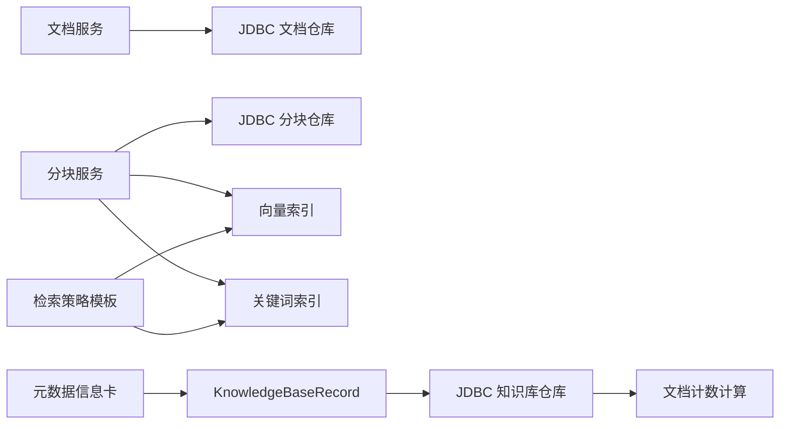

# 知识库管理

<cite>
**本文引用的文件**
- [知识管理应用服务.md](file://docs/zh/content/后端系统/核心内核/应用服务层/知识管理应用服务.md)
- [IndexerNodeFeature.java](file://seahorse-agent-kernel/src/main/java/com/miracle/ai/seahorse/agent/kernel/feature/ingestion/IndexerNodeFeature.java)
- [KernelKnowledgeDocumentService.java](file://seahorse-agent-kernel/src/main/java/com/miracle/ai/seahorse/agent/kernel/application/knowledge/KernelKnowledgeDocumentService.java)
- [KernelKeywordIndexMaintenanceService.java](file://seahorse-agent-kernel/src/main/java/com/miracle/ai/seahorse/agent/kernel/application/keyword/KernelKeywordIndexMaintenanceService.java)
- [KernelRetrievalStrategyTemplateService.java](file://seahorse-agent-kernel/src/main/java/com/miracle/ai/seahorse/agent/kernel/application/retrieval/KernelRetrievalStrategyTemplateService.java)
- [混合检索与重排完善设计方案.md](file://docs/zh/content/架构设计/混合检索与重排完善设计方案.md)
- [CreateKnowledgeBaseDialog.tsx](file://frontend/src/components/admin/CreateKnowledgeBaseDialog.tsx)
- [VectorCollectionAdminPort.java](file://seahorse-agent-kernel/src/main/java/com/miracle/ai/seahorse/agent/ports/outbound/vector/VectorCollectionAdminPort.java)
- [KernelRagTraceRecorder.java](file://seahorse-agent-kernel/src/main/java/com/miracle/ai/seahorse/agent/kernel/application/trace/KernelRagTraceRecorder.java)
- [性能测试.md](file://docs/zh/content/测试策略/性能测试.md)
- [database-optimization-performance-test-plan.md](file://docs/performance/database-optimization-performance-test-plan.md)
- [error.ts](file://frontend/src/utils/error.ts)
- [JdbcKnowledgeBaseQueryAdapterTests.java](file://seahorse-agent-adapter-repository-jdbc/src/test/java/com/miracle/ai/seahorse/agent/adapters/repository/jdbc/JdbcKnowledgeBaseQueryAdapterTests.java)
- [LlmQueryOptimizerAdapter.java](file://seahorse-agent-adapter-ai-openai-compatible/src/main/java/com/miracle/ai/seahorse/agent/adapters/ai/openai/LlmQueryOptimizerAdapter.java)
- [SeahorseWebApiContractTests.java](file://seahorse-agent-tests/src/test/java/com/miracle/ai/seahorse/agent/adapters/web/SeahorseWebApiContractTests.java)
- [KnowledgeBaseRecord.java](file://seahorse-agent-kernel/src/main/java/com/miracle/ai/seahorse/agent/ports/outbound/knowledge/KnowledgeBaseRecord.java)
- [JdbcKnowledgeBaseRepositoryAdapter.java](file://seahorse-agent-adapter-repository-jdbc/src/main/java/com/miracle/ai/seahorse/agent/adapters/repository/jdbc/JdbcKnowledgeBaseRepositoryAdapter.java)
</cite>

## 更新摘要
**所做更改**
- 新增知识库元数据信息卡功能章节，详细介绍集合名称、嵌入模型和文档计数的显示机制
- 更新知识库服务章节，增加元数据信息卡的数据来源和计算逻辑
- 新增数据库查询优化章节，说明文档计数的高效计算方法
- 更新依赖关系分析，反映元数据信息卡的完整数据流

## 目录
1. [简介](#简介)
2. [项目结构](#项目结构)
3. [核心组件](#核心组件)
4. [架构总览](#架构总览)
5. [详细组件分析](#详细组件分析)
6. [知识库元数据信息卡功能](#知识库元数据信息卡功能)
7. [数据库查询优化](#数据库查询优化)
8. [依赖关系分析](#依赖关系分析)
9. [性能考量](#性能考量)
10. [故障排查指南](#故障排查指南)
11. [结论](#结论)
12. [附录](#附录)

## 简介
本文件面向知识库管理系统的知识管理应用服务，围绕以下四个核心服务展开：知识库服务、文档服务、分块服务、文档刷新服务。文档将系统性阐述知识文档的全生命周期管理：从上传、解析、分块到向量化存储；解释文档刷新机制的实现原理，包括增量更新、版本控制、冲突处理；并提供检索优化策略（关键词索引、向量检索、RRF 融合与可选精排）、治理能力（质量评估、合规检查、审计追踪）与最佳实践。

**更新** 新增知识库元数据信息卡功能，为用户提供直观的知识库状态概览，包括集合名称、嵌入模型和文档计数等关键信息。

## 项目结构
本项目采用"内核(kernel)+适配器(adapter)+Web适配(web adapter)"的分层架构：
- 内核层：定义领域模型、应用服务与端口接口，屏蔽外部依赖细节。
- 适配器层：对接对象存储、向量数据库、消息队列、定时调度、文档抓取与解析等。
- Web适配层：暴露REST API控制器，作为前端调用入口。



**图表来源**
- [知识管理应用服务.md:132-166](file://docs/zh/content/后端系统/核心内核/应用服务层/知识管理应用服务.md#L132-L166)

**章节来源**
- [知识管理应用服务.md:47-166](file://docs/zh/content/后端系统/核心内核/应用服务层/知识管理应用服务.md#L47-L166)

## 核心组件
- 知识库服务：负责知识库的创建、配置与元数据维护，确保集合名唯一、租户隔离与访问控制。
- 文档服务：负责文档上传、状态流转、分块触发与删除清理，串联对象存储与向量/关键词索引。
- 分块服务：负责将解析后的文本切分为块，生成嵌入并写入向量库与关键词索引。
- 文档刷新服务：负责增量刷新、版本对比、冲突处理与分布式锁协调，保障一致性与并发安全。

**章节来源**
- [知识管理应用服务.md:44-46](file://docs/zh/content/后端系统/核心内核/应用服务层/知识管理应用服务.md#L44-L46)

## 架构总览
下图展示知识管理服务在内核与适配器之间的交互关系，以及与外部系统的集成点（对象存储、向量数据库、文档抓取源、消息队列、定时调度）。



**图表来源**
- [知识管理应用服务.md:132-166](file://docs/zh/content/后端系统/核心内核/应用服务层/知识管理应用服务.md#L132-L166)

## 详细组件分析

### 知识库定义与配置
- 知识库创建：前端引导用户填写名称、嵌入模型与集合名，后端校验唯一性与可用性，生成知识库记录并绑定集合名。
- 元数据设置：系统在入库索引阶段自动注入系统级元数据（租户、集合名、知识库ID、文档ID、分块ID、分块序号等），并与用户自定义元数据合并。
- 权限控制：通过租户维度隔离与ACL策略实现访问控制，结合分布式锁与版本控制避免并发冲突。



**图表来源**
- [CreateKnowledgeBaseDialog.tsx:114-132](file://frontend/src/components/admin/CreateKnowledgeBaseDialog.tsx#L114-L132)
- [KernelKnowledgeDocumentService.java:106-115](file://seahorse-agent-kernel/src/main/java/com/miracle/ai/seahorse/agent/kernel/application/knowledge/KernelKnowledgeDocumentService.java#L106-L115)

**章节来源**
- [CreateKnowledgeBaseDialog.tsx:105-132](file://frontend/src/components/admin/CreateKnowledgeBaseDialog.tsx#L105-L132)
- [KernelKnowledgeDocumentService.java:106-115](file://seahorse-agent-kernel/src/main/java/com/miracle/ai/seahorse/agent/kernel/application/knowledge/KernelKnowledgeDocumentService.java#L106-L115)

### 文档管理：上传、批量导入、版本与生命周期
- 上传与状态机：文档上传后进入待处理状态，支持启动分块流程与运行中冲突检测；删除时清理向量、关键词索引与对象存储文件。
- 批量导入：通过消息队列可靠投递分块事件，按文档粒度并行处理，支持重试与幂等。
- 版本与生命周期：文档刷新服务基于版本对比与冲突处理，结合分布式锁与定时调度实现增量更新与一致性保障。



**图表来源**
- [KernelKnowledgeDocumentService.java:118-127](file://seahorse-agent-kernel/src/main/java/com/miracle/ai/seahorse/agent/kernel/application/knowledge/KernelKnowledgeDocumentService.java#L118-L127)
- [KernelKnowledgeDocumentService.java:204-210](file://seahorse-agent-kernel/src/main/java/com/miracle/ai/seahorse/agent/kernel/application/knowledge/KernelKnowledgeDocumentService.java#L204-L210)

**章节来源**
- [KernelKnowledgeDocumentService.java:118-127](file://seahorse-agent-kernel/src/main/java/com/miracle/ai/seahorse/agent/kernel/application/knowledge/KernelKnowledgeDocumentService.java#L118-L127)
- [KernelKnowledgeDocumentService.java:204-210](file://seahorse-agent-kernel/src/main/java/com/miracle/ai/seahorse/agent/kernel/application/knowledge/KernelKnowledgeDocumentService.java#L204-L210)

### 分块与索引策略：系统元数据注入与双索引并行
- 分块与嵌入：分块服务将解析后的文本切分为块，生成嵌入并写入向量库；同时保留完整治理后的分块用于关键词索引。
- 系统元数据：在入库索引阶段统一注入系统字段（租户、集合名、知识库ID、文档ID、分块ID、分块序号等），并与用户元数据合并。
- 集合管理：通过向量集合管理端口确保集合存在，避免运行时缺失导致的写入失败。



**图表来源**
- [IndexerNodeFeature.java:100-142](file://seahorse-agent-kernel/src/main/java/com/miracle/ai/seahorse/agent/kernel/feature/ingestion/IndexerNodeFeature.java#L100-L142)
- [VectorCollectionAdminPort.java:25-41](file://seahorse-agent-kernel/src/main/java/com/miracle/ai/seahorse/agent/ports/outbound/vector/VectorCollectionAdminPort.java#L25-L41)

**章节来源**
- [IndexerNodeFeature.java:100-142](file://seahorse-agent-kernel/src/main/java/com/miracle/ai/seahorse/agent/kernel/feature/ingestion/IndexerNodeFeature.java#L100-L142)
- [VectorCollectionAdminPort.java:25-41](file://seahorse-agent-kernel/src/main/java/com/miracle/ai/seahorse/agent/ports/outbound/vector/VectorCollectionAdminPort.java#L25-L41)

### 检索优化：关键词索引、向量检索与混合排序
- 检索策略模板：系统提供多种策略模板，包括仅向量、向量+意图定向、向量+关键词、RRF 融合与可选精排。
- RRF 融合：对多通道召回结果进行加权融合，输出融合分数并限制融合TopK。
- 可选精排：在混合召回与 RRF 后启用精排，管理端应用时需补充具体 rerank 模型。



**图表来源**
- [KernelRetrievalStrategyTemplateService.java:111-157](file://seahorse-agent-kernel/src/main/java/com/miracle/ai/seahorse/agent/kernel/application/retrieval/KernelRetrievalStrategyTemplateService.java#L111-L157)
- [混合检索与重排完善设计方案.md:783-848](file://docs/zh/content/架构设计/混合检索与重排完善设计方案.md#L783-L848)

**章节来源**
- [KernelRetrievalStrategyTemplateService.java:111-157](file://seahorse-agent-kernel/src/main/java/com/miracle/ai/seahorse/agent/kernel/application/retrieval/KernelRetrievalStrategyTemplateService.java#L111-L157)
- [混合检索与重排完善设计方案.md:783-848](file://docs/zh/content/架构设计/混合检索与重排完善设计方案.md#L783-L848)

### 知识库治理：质量评估、合规检查与审计追踪
- 元数据治理：包含标准化、验证、审查与隔离（隔离区）流程，支持覆盖率统计、反馈汇总与隔离原因计数。
- 质量报告：支持生成质量报告与对比报告，便于跨版本评估与回归分析。
- 审计追踪：通过 RAG 追踪记录关键节点耗时、错误与组件统计，便于定位性能瓶颈与异常。



**图表来源**
- [SeahorseWebApiContractTests.java:1908-2035](file://seahorse-agent-tests/src/test/java/com/miracle/ai/seahorse/agent/adapters/web/SeahorseWebApiContractTests.java#L1908-L2035)
- [KernelRagTraceRecorder.java:181-220](file://seahorse-agent-kernel/src/main/java/com/miracle/ai/seahorse/agent/kernel/application/trace/KernelRagTraceRecorder.java#L181-L220)

**章节来源**
- [SeahorseWebApiContractTests.java:1908-2035](file://seahorse-agent-tests/src/test/java/com/miracle/ai/seahorse/agent/adapters/web/SeahorseWebApiContractTests.java#L1908-L2035)
- [KernelRagTraceRecorder.java:181-220](file://seahorse-agent-kernel/src/main/java/com/miracle/ai/seahorse/agent/kernel/application/trace/KernelRagTraceRecorder.java#L181-L220)

## 知识库元数据信息卡功能

### 功能概述
知识库元数据信息卡为用户提供直观的知识库状态概览界面，显示三个核心元数据信息：
- 集合名称：标识向量数据库中的知识库集合
- 嵌入模型：当前知识库使用的向量嵌入模型
- 文档计数：该知识库中已索引的文档总数

### 数据模型与存储
知识库元数据信息卡的核心数据来源于 `KnowledgeBaseRecord` 类，该类包含了完整的知识库元数据信息：



**图表来源**
- [KnowledgeBaseRecord.java:25-99](file://seahorse-agent-kernel/src/main/java/com/miracle/ai/seahorse/agent/ports/outbound/knowledge/KnowledgeBaseRecord.java#L25-L99)
- [JdbcKnowledgeBaseRepositoryAdapter.java:206-240](file://seahorse-agent-adapter-repository-jdbc/src/main/java/com/miracle/ai/seahorse/agent/adapters/repository/jdbc/JdbcKnowledgeBaseRepositoryAdapter.java#L206-L240)

### 数据来源与计算逻辑
知识库元数据信息卡的数据通过以下流程获取和计算：

1. **集合名称（Collection Name）**：直接从知识库记录中获取
2. **嵌入模型（Embedding Model）**：直接从知识库记录中获取  
3. **文档计数（Document Count）**：通过数据库查询实时计算



**图表来源**
- [JdbcKnowledgeBaseRepositoryAdapter.java:206-240](file://seahorse-agent-adapter-repository-jdbc/src/main/java/com/miracle/ai/seahorse/agent/adapters/repository/jdbc/JdbcKnowledgeBaseRepositoryAdapter.java#L206-L240)

### 前端展示与交互
前端通过 `CreateKnowledgeBaseDialog` 组件处理知识库创建和元数据信息卡的显示。该组件负责：
- 收集用户输入的集合名称、嵌入模型等信息
- 验证输入的有效性和唯一性
- 展示创建后的知识库元数据信息卡

**章节来源**
- [KnowledgeBaseRecord.java:25-99](file://seahorse-agent-kernel/src/main/java/com/miracle/ai/seahorse/agent/ports/outbound/knowledge/KnowledgeBaseRecord.java#L25-L99)
- [JdbcKnowledgeBaseRepositoryAdapter.java:206-240](file://seahorse-agent-adapter-repository-jdbc/src/main/java/com/miracle/ai/seahorse/agent/adapters/repository/jdbc/JdbcKnowledgeBaseRepositoryAdapter.java#L206-L240)
- [CreateKnowledgeBaseDialog.tsx:105-132](file://frontend/src/components/admin/CreateKnowledgeBaseDialog.tsx#L105-L132)

## 数据库查询优化

### 文档计数的高效计算
为了确保知识库元数据信息卡的性能，系统采用了专门的查询优化策略来计算文档计数：

```sql
-- 优化的文档计数查询
SELECT 
    kb.id,
    kb.name,
    kb.embedding_model,
    kb.collection_name,
    COUNT(DISTINCT d.id) as document_count,
    kb.created_by,
    kb.create_time,
    kb.update_time
FROM t_knowledge_base kb
LEFT JOIN t_knowledge_document d ON kb.id = d.kb_id AND d.enabled = TRUE
WHERE kb.deleted = FALSE
GROUP BY kb.id, kb.name, kb.embedding_model, kb.collection_name, kb.created_by, kb.create_time, kb.update_time
ORDER BY kb.create_time DESC
LIMIT ? OFFSET ?
```

### 索引优化策略
为支持高效的元数据信息卡查询，数据库层面采用了以下优化措施：
- 对 `t_knowledge_base` 表的 `id` 和 `name` 字段建立索引
- 对 `t_knowledge_document` 表的 `kb_id` 和 `enabled` 字段建立复合索引
- 使用 `COUNT(DISTINCT d.id)` 确保文档计数的准确性

**章节来源**
- [JdbcKnowledgeBaseRepositoryAdapter.java:206-240](file://seahorse-agent-adapter-repository-jdbc/src/main/java/com/miracle/ai/seahorse/agent/adapters/repository/jdbc/JdbcKnowledgeBaseRepositoryAdapter.java#L206-L240)

## 依赖关系分析
- 应用服务依赖 JDBC 仓库适配器进行持久化，依赖对象存储与向量/关键词索引适配器进行数据写入。
- 分块服务在索引阶段并行写入向量与关键词索引，共享系统元数据快照。
- 检索策略模板通过可配置开关控制通道与融合参数，支持不同业务场景的召回策略。
- **新增** 知识库元数据信息卡功能通过 `KnowledgeBaseRecord` 数据模型提供完整的元数据信息，包括文档计数的实时计算。



**图表来源**
- [KernelKnowledgeDocumentService.java:106-115](file://seahorse-agent-kernel/src/main/java/com/miracle/ai/seahorse/agent/kernel/application/knowledge/KernelKnowledgeDocumentService.java#L106-L115)
- [KernelRetrievalStrategyTemplateService.java:111-157](file://seahorse-agent-kernel/src/main/java/com/miracle/ai/seahorse/agent/kernel/application/retrieval/KernelRetrievalStrategyTemplateService.java#L111-L157)
- [KnowledgeBaseRecord.java:25-99](file://seahorse-agent-kernel/src/main/java/com/miracle/ai/seahorse/agent/ports/outbound/knowledge/KnowledgeBaseRecord.java#L25-L99)

**章节来源**
- [KernelKnowledgeDocumentService.java:106-115](file://seahorse-agent-kernel/src/main/java/com/miracle/ai/seahorse/agent/kernel/application/knowledge/KernelKnowledgeDocumentService.java#L106-L115)
- [KernelRetrievalStrategyTemplateService.java:111-157](file://seahorse-agent-kernel/src/main/java/com/miracle/ai/seahorse/agent/kernel/application/retrieval/KernelRetrievalStrategyTemplateService.java#L111-L157)
- [KnowledgeBaseRecord.java:25-99](file://seahorse-agent-kernel/src/main/java/com/miracle/ai/seahorse/agent/ports/outbound/knowledge/KnowledgeBaseRecord.java#L25-L99)

## 性能考量
- 压测工具与方法：提供 JMeter、Gatling、Locust 的使用建议，关注并发、响应时间分布与错误率。
- JVM 与数据库监控：关注 GC、堆内存、慢查询、锁等待与缓冲池命中率等指标。
- 观测与指标：建议在压测中开启关键端点指标导出，结合可视化平台进行趋势分析。
- 数据库优化：参考性能测试计划中的基准测试模块，评估 ID 生成、索引与查询路径的吞吐表现。
- **新增** 元数据信息卡查询优化：通过专用的 SQL 查询和索引策略，确保知识库列表页的快速响应。

**章节来源**
- [性能测试.md:285-309](file://docs/zh/content/测试策略/性能测试.md#L285-L309)
- [database-optimization-performance-test-plan.md:169-199](file://docs/performance/database-optimization-performance-test-plan.md#L169-L199)

## 故障排查指南
- 错误信息提取：前端统一从错误对象中提取 message 字段，若为空则回退到兜底提示，便于用户感知与日志定位。
- 追踪与诊断：通过 RAG 追踪记录节点耗时、错误类型与组件统计，快速定位失败节点与超时通道。
- 常见问题：
  - 上传后无法分块：检查消息队列投递与分块事件监听状态。
  - 向量/关键词索引失败：确认集合是否存在与系统元数据注入是否正确。
  - 检索结果异常：调整 RRF 融合参数与通道权重，必要时启用精排。
  - **新增** 元数据信息卡显示异常：检查数据库连接、索引状态和查询权限。

**章节来源**
- [error.ts:1-12](file://frontend/src/utils/error.ts#L1-L12)
- [KernelRagTraceRecorder.java:181-220](file://seahorse-agent-kernel/src/main/java/com/miracle/ai/seahorse/agent/kernel/application/trace/KernelRagTraceRecorder.java#L181-L220)

## 结论
本知识库管理系统以内核为核心，通过清晰的应用服务边界与丰富的适配器生态，实现了从知识库创建、文档全生命周期管理到检索优化与治理闭环的完整能力。系统在索引阶段并行写入向量与关键词索引，结合 RRF 融合与可选精排，满足多样化检索需求；通过元数据治理与审计追踪，保障数据质量与合规性；配合完善的性能测试与监控体系，支撑生产环境的稳定性与可运维性。

**更新** 新增的知识库元数据信息卡功能进一步增强了系统的用户体验，通过直观的界面展示集合名称、嵌入模型和文档计数等关键信息，为用户提供了更好的知识库状态概览能力。配合数据库查询优化策略，确保了元数据信息卡的高性能响应。

## 附录
- API 接口与配置：请参考前端路由与 API 合同测试，确保端到端兼容性与功能正确性。
- 数据模型：知识库、文档与分块的表结构与字段定义可参考 JDBC 适配器测试中的建表语句与字段映射。
- **新增** 元数据信息卡数据模型：`KnowledgeBaseRecord` 类提供了完整的知识库元数据信息，包括文档计数的实时计算能力。

**章节来源**
- [JdbcKnowledgeBaseQueryAdapterTests.java:142-164](file://seahorse-agent-adapter-repository-jdbc/src/test/java/com/miracle/ai/seahorse/agent/adapters/repository/jdbc/JdbcKnowledgeBaseQueryAdapterTests.java#L142-L164)
- [SeahorseWebApiContractTests.java:829-851](file://seahorse-agent-tests/src/test/java/com/miracle/ai/seahorse/agent/adapters/web/SeahorseWebApiContractTests.java#L829-L851)
- [KnowledgeBaseRecord.java:25-99](file://seahorse-agent-kernel/src/main/java/com/miracle/ai/seahorse/agent/ports/outbound/knowledge/KnowledgeBaseRecord.java#L25-L99)