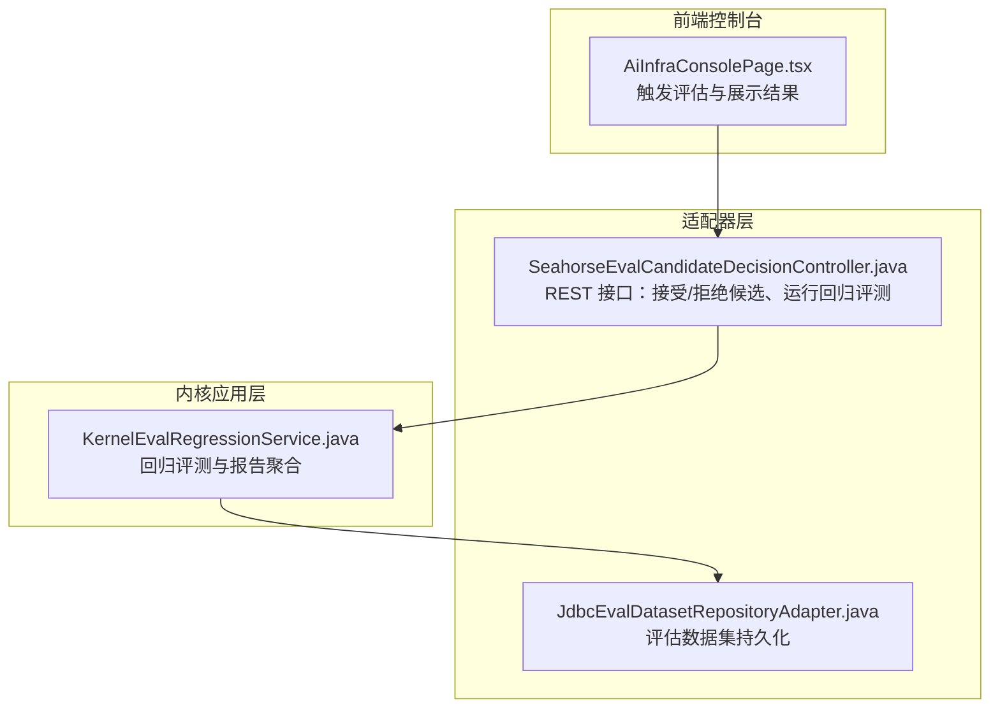
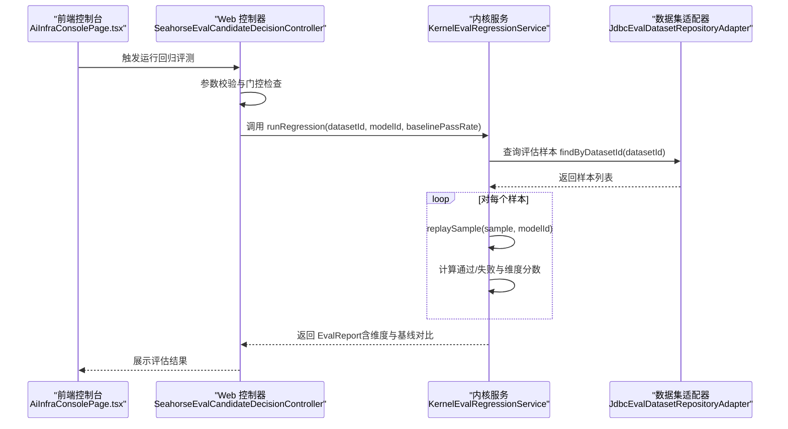
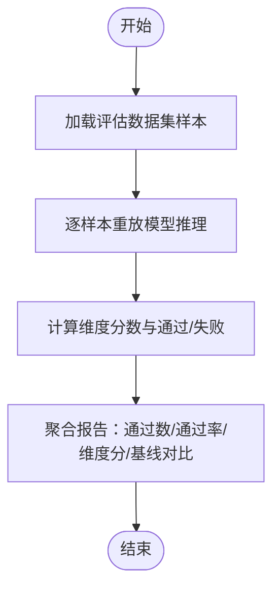
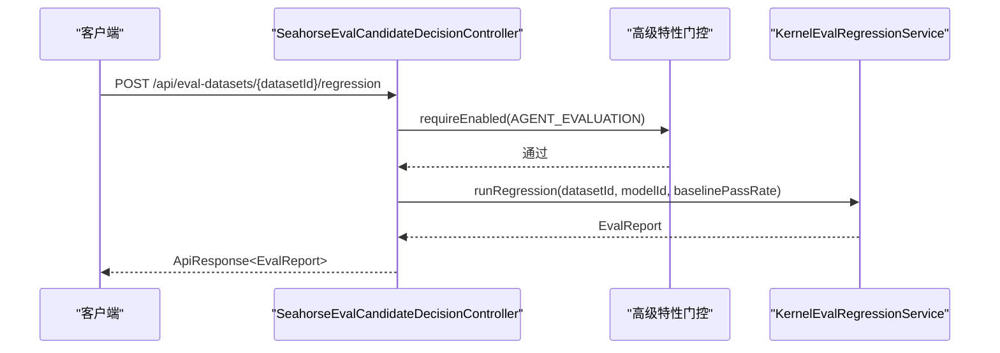
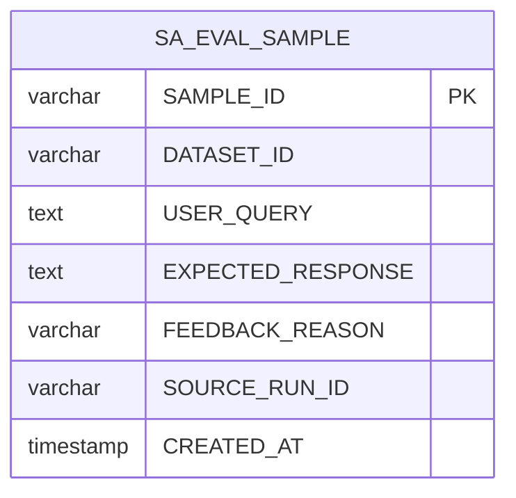
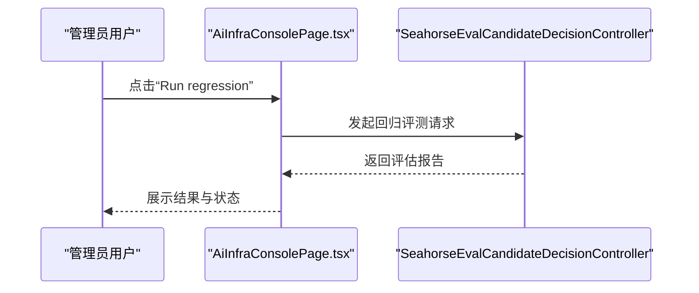
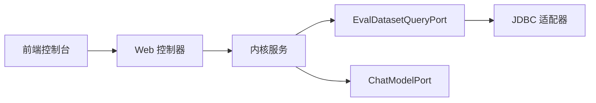

# 评估系统

<cite>
**本文引用的文件**
- [KernelEvalRegressionService.java](file://seahorse-agent-kernel/src/main/java/com/miracle/ai/seahorse/agent/kernel/application/agent/eval/KernelEvalRegressionService.java)
- [SeahorseEvalCandidateDecisionController.java](file://seahorse-agent-adapter-web/src/main/java/com/miracle/ai/seahorse/agent/adapters/web/SeahorseEvalCandidateDecisionController.java)
- [JdbcEvalDatasetRepositoryAdapter.java](file://seahorse-agent-adapter-repository-jdbc/src/main/java/com/miracle/ai/seahorse/agent/adapters/repository/jdbc/JdbcEvalDatasetRepositoryAdapter.java)
- [KernelEvalRegressionServiceTests.java](file://seahorse-agent-kernel/src/test/java/com/miracle/ai/seahorse/agent/kernel/application/agent/eval/KernelEvalRegressionServiceTests.java)
- [JdbcRetrievalEvaluationDatasetRepositoryAdapterTests.java](file://seahorse-agent-adapter-repository-jdbc/src/test/java/com/miracle/ai/seahorse/agent/adapters/repository/jdbc/JdbcRetrievalEvaluationDatasetRepositoryAdapterTests.java)
- [AiInfraConsolePage.tsx](file://frontend/src/pages/admin/ai-infra/AiInfraConsolePage.tsx)
- [性能测试.md](file://docs/zh/content/测试策略/性能测试.md)
</cite>

## 目录
1. [简介](#简介)
2. [项目结构](#项目结构)
3. [核心组件](#核心组件)
4. [架构总览](#架构总览)
5. [详细组件分析](#详细组件分析)
6. [依赖关系分析](#依赖关系分析)
7. [性能考量](#性能考量)
8. [故障排查指南](#故障排查指南)
9. [结论](#结论)
10. [附录](#附录)

## 简介
本文件系统性梳理海星代理（Seahorse Agent）的评估系统，覆盖检索评估机制、评估指标与数据集管理、自动化测试、问答质量评估（准确性、相关性、完整性）、模型性能对比（A/B测试、回归分析、趋势监控）、评估数据收集与处理（样本标注、质量控制、统计分析）、评估报告生成与可视化（指标图表、趋势分析、异常检测），以及评估策略制定、实施流程与持续改进方法，并提供评估系统配置、性能优化与结果解读指南。

## 项目结构
评估系统由内核应用层、适配器层与前端控制台三部分组成：
- 内核应用层：负责评估逻辑与报告聚合，如回归评测服务、维度评分与基线对比。
- 适配器层：提供 Web 控制器接口、数据库存储适配器等，支撑外部调用与持久化。
- 前端控制台：提供评估入口与结果展示，支持触发回归评测与查看结果。

**图示来源**
- [AiInfraConsolePage.tsx:1048-1056](file://frontend/src/pages/admin/ai-infra/AiInfraConsolePage.tsx#L1048-L1056)
- [SeahorseEvalCandidateDecisionController.java:30-82](file://seahorse-agent-adapter-web/src/main/java/com/miracle/ai/seahorse/agent/adapters/web/SeahorseEvalCandidateDecisionController.java#L30-L82)
- [JdbcEvalDatasetRepositoryAdapter.java:33-87](file://seahorse-agent-adapter-repository-jdbc/src/main/java/com/miracle/ai/seahorse/agent/adapters/repository/jdbc/JdbcEvalDatasetRepositoryAdapter.java#L33-L87)
- [KernelEvalRegressionService.java:33-98](file://seahorse-agent-kernel/src/main/java/com/miracle/ai/seahorse/agent/kernel/application/agent/eval/KernelEvalRegressionService.java#L33-L98)

**章节来源**
- [AiInfraConsolePage.tsx:1048-1056](file://frontend/src/pages/admin/ai-infra/AiInfraConsolePage.tsx#L1048-L1056)
- [SeahorseEvalCandidateDecisionController.java:30-82](file://seahorse-agent-adapter-web/src/main/java/com/miracle/ai/seahorse/agent/adapters/web/SeahorseEvalCandidateDecisionController.java#L30-L82)
- [JdbcEvalDatasetRepositoryAdapter.java:33-87](file://seahorse-agent-adapter-repository-jdbc/src/main/java/com/miracle/ai/seahorse/agent/adapters/repository/jdbc/JdbcEvalDatasetRepositoryAdapter.java#L33-L87)
- [KernelEvalRegressionService.java:33-98](file://seahorse-agent-kernel/src/main/java/com/miracle/ai/seahorse/agent/kernel/application/agent/eval/KernelEvalRegressionService.java#L33-L98)

## 核心组件
- 回归评测服务：对评估数据集中的样本进行重放，基于预设规则计算通过/失败，并聚合维度分数与基线对比。
- Web 控制器：提供 REST 接口，支持候选决策（接受/拒绝）与运行回归评测。
- 数据集存储适配器：基于 JDBC 实现评估样本的增删查与持久化。
- 前端控制台：提供按钮触发回归评测，并展示结果。

关键职责与交互：
- 回归评测服务接收数据集 ID 与模型 ID，拉取样本列表，逐条重放并产出评估结果，最终生成评估报告。
- Web 控制器负责鉴权门控与参数解析，调用服务层执行评估。
- 数据集适配器负责样本的插入与查询，确保评估数据可追溯。
- 前端控制台提供用户入口，便于在管理界面中一键运行与查看结果。

**章节来源**
- [KernelEvalRegressionService.java:50-98](file://seahorse-agent-kernel/src/main/java/com/miracle/ai/seahorse/agent/kernel/application/agent/eval/KernelEvalRegressionService.java#L50-L98)
- [SeahorseEvalCandidateDecisionController.java:46-76](file://seahorse-agent-adapter-web/src/main/java/com/miracle/ai/seahorse/agent/adapters/web/SeahorseEvalCandidateDecisionController.java#L46-L76)
- [JdbcEvalDatasetRepositoryAdapter.java:41-75](file://seahorse-agent-adapter-repository-jdbc/src/main/java/com/miracle/ai/seahorse/agent/adapters/repository/jdbc/JdbcEvalDatasetRepositoryAdapter.java#L41-L75)
- [AiInfraConsolePage.tsx:1048-1056](file://frontend/src/pages/admin/ai-infra/AiInfraConsolePage.tsx#L1048-L1056)

## 架构总览
评估系统采用分层架构：前端控制台通过 Web 控制器发起请求；控制器调用内核服务执行评估；服务层访问数据库适配器读取/写入评估样本；最终返回评估报告。

**图示来源**
- [AiInfraConsolePage.tsx:1048-1056](file://frontend/src/pages/admin/ai-infra/AiInfraConsolePage.tsx#L1048-L1056)
- [SeahorseEvalCandidateDecisionController.java:68-76](file://seahorse-agent-adapter-web/src/main/java/com/miracle/ai/seahorse/agent/adapters/web/SeahorseEvalCandidateDecisionController.java#L68-L76)
- [KernelEvalRegressionService.java:57-67](file://seahorse-agent-kernel/src/main/java/com/miracle/ai/seahorse/agent/kernel/application/agent/eval/KernelEvalRegressionService.java#L57-L67)
- [JdbcEvalDatasetRepositoryAdapter.java:64-75](file://seahorse-agent-adapter-repository-jdbc/src/main/java/com/miracle/ai/seahorse/agent/adapters/repository/jdbc/JdbcEvalDatasetRepositoryAdapter.java#L64-L75)

## 详细组件分析

### 回归评测服务（KernelEvalRegressionService）
- 功能要点
  - 从数据集查询样本，逐条重放模型推理，判断任务完成度、引用完整性与语义相似度。
  - 自动化维度包括：引用完整性、任务完成度；人工维度包括：答案质量、来源根基、延迟、单次成本。
  - 支持与基线通过率对比，生成回归状态（提升/退化/不变）。
- 关键算法
  - 引用完整性：基于引用标记匹配，若期望输出无标记则视为通过。
  - 语义相似度：关键词匹配比例阈值，过滤短词，避免噪声。
  - 报告聚合：按样本统计通过数、通过率，并计算各维度平均分与基线对比。

**图示来源**
- [KernelEvalRegressionService.java:57-98](file://seahorse-agent-kernel/src/main/java/com/miracle/ai/seahorse/agent/kernel/application/agent/eval/KernelEvalRegressionService.java#L57-L98)
- [KernelEvalRegressionService.java:144-161](file://seahorse-agent-kernel/src/main/java/com/miracle/ai/seahorse/agent/kernel/application/agent/eval/KernelEvalRegressionService.java#L144-L161)

**章节来源**
- [KernelEvalRegressionService.java:50-116](file://seahorse-agent-kernel/src/main/java/com/miracle/ai/seahorse/agent/kernel/application/agent/eval/KernelEvalRegressionService.java#L50-L116)
- [KernelEvalRegressionService.java:130-192](file://seahorse-agent-kernel/src/main/java/com/miracle/ai/seahorse/agent/kernel/application/agent/eval/KernelEvalRegressionService.java#L130-L192)
- [KernelEvalRegressionServiceTests.java:32-66](file://seahorse-agent-kernel/src/test/java/com/miracle/ai/seahorse/agent/kernel/application/agent/eval/KernelEvalRegressionServiceTests.java#L32-L66)

### Web 控制器（SeahorseEvalCandidateDecisionController）
- 功能要点
  - 提供候选接受/拒绝接口，支持附加备注。
  - 提供评估数据集回归评测接口，支持指定模型与基线通过率。
  - 通过高级特性门控保障功能开关与安全。
- 请求/响应
  - 接口路径与方法见类内定义。
  - 参数模型包含决策备注与回归请求体。

**图示来源**
- [SeahorseEvalCandidateDecisionController.java:68-76](file://seahorse-agent-adapter-web/src/main/java/com/miracle/ai/seahorse/agent/adapters/web/SeahorseEvalCandidateDecisionController.java#L68-L76)
- [KernelEvalRegressionService.java:53-67](file://seahorse-agent-kernel/src/main/java/com/miracle/ai/seahorse/agent/kernel/application/agent/eval/KernelEvalRegressionService.java#L53-L67)

**章节来源**
- [SeahorseEvalCandidateDecisionController.java:30-82](file://seahorse-agent-adapter-web/src/main/java/com/miracle/ai/seahorse/agent/adapters/web/SeahorseEvalCandidateDecisionController.java#L30-L82)

### 数据集存储适配器（JdbcEvalDatasetRepositoryAdapter）
- 功能要点
  - 插入样本：去重插入，避免重复样本。
  - 查询样本：按数据集 ID 查询并排序，保证重放顺序一致。
- 数据表结构要点（测试中定义）
  - 字段：样本 ID、数据集 ID、用户问题、期望回答、反馈原因、来源运行 ID、创建时间。
  - 索引与约束：通过唯一性与排序保障一致性与可审计性。

**图示来源**
- [JdbcEvalDatasetRepositoryAdapter.java:50-62](file://seahorse-agent-adapter-repository-jdbc/src/main/java/com/miracle/ai/seahorse/agent/adapters/repository/jdbc/JdbcEvalDatasetRepositoryAdapter.java#L50-L62)
- [JdbcRetrievalEvaluationDatasetRepositoryAdapterTests.java:168-178](file://seahorse-agent-adapter-repository-jdbc/src/test/java/com/miracle/ai/seahorse/agent/adapters/repository/jdbc/JdbcRetrievalEvaluationDatasetRepositoryAdapterTests.java#L168-L178)

**章节来源**
- [JdbcEvalDatasetRepositoryAdapter.java:41-85](file://seahorse-agent-adapter-repository-jdbc/src/main/java/com/miracle/ai/seahorse/agent/adapters/repository/jdbc/JdbcEvalDatasetRepositoryAdapter.java#L41-L85)
- [JdbcRetrievalEvaluationDatasetRepositoryAdapterTests.java:168-178](file://seahorse-agent-adapter-repository-jdbc/src/test/java/com/miracle/ai/seahorse/agent/adapters/repository/jdbc/JdbcRetrievalEvaluationDatasetRepositoryAdapterTests.java#L168-L178)

### 前端控制台集成（AiInfraConsolePage.tsx）
- 功能要点
  - 提供“运行回归”按钮，触发后调用后端接口并展示评估结果。
  - 结合状态与加载态，保障用户体验与错误提示。

**图示来源**
- [AiInfraConsolePage.tsx:1048-1056](file://frontend/src/pages/admin/ai-infra/AiInfraConsolePage.tsx#L1048-L1056)
- [SeahorseEvalCandidateDecisionController.java:68-76](file://seahorse-agent-adapter-web/src/main/java/com/miracle/ai/seahorse/agent/adapters/web/SeahorseEvalCandidateDecisionController.java#L68-L76)

**章节来源**
- [AiInfraConsolePage.tsx:1048-1056](file://frontend/src/pages/admin/ai-infra/AiInfraConsolePage.tsx#L1048-L1056)

## 依赖关系分析
- 组件耦合
  - Web 控制器依赖内核服务与高级特性门控，职责清晰、低耦合。
  - 内核服务依赖数据集查询端口与模型端口，便于替换实现。
  - 数据集适配器依赖 JDBC 模板，提供稳定的持久化能力。
- 外部依赖
  - 前端通过 REST 接口与后端交互，接口契约明确。
  - 数据库层面依赖关系简单，主要围绕评估样本表。

**图示来源**
- [SeahorseEvalCandidateDecisionController.java:30-44](file://seahorse-agent-adapter-web/src/main/java/com/miracle/ai/seahorse/agent/adapters/web/SeahorseEvalCandidateDecisionController.java#L30-L44)
- [KernelEvalRegressionService.java:42-48](file://seahorse-agent-kernel/src/main/java/com/miracle/ai/seahorse/agent/kernel/application/agent/eval/KernelEvalRegressionService.java#L42-L48)
- [JdbcEvalDatasetRepositoryAdapter.java:33-39](file://seahorse-agent-adapter-repository-jdbc/src/main/java/com/miracle/ai/seahorse/agent/adapters/repository/jdbc/JdbcEvalDatasetRepositoryAdapter.java#L33-L39)

**章节来源**
- [SeahorseEvalCandidateDecisionController.java:30-44](file://seahorse-agent-adapter-web/src/main/java/com/miracle/ai/seahorse/agent/adapters/web/SeahorseEvalCandidateDecisionController.java#L30-L44)
- [KernelEvalRegressionService.java:42-48](file://seahorse-agent-kernel/src/main/java/com/miracle/ai/seahorse/agent/kernel/application/agent/eval/KernelEvalRegressionService.java#L42-L48)
- [JdbcEvalDatasetRepositoryAdapter.java:33-39](file://seahorse-agent-adapter-repository-jdbc/src/main/java/com/miracle/ai/seahorse/agent/adapters/repository/jdbc/JdbcEvalDatasetRepositoryAdapter.java#L33-L39)

## 性能考量
- 指标体系
  - 响应时间：首次令牌到达时间、完整请求完成时间、检索总耗时、多通道检索耗时、MCP 协调耗时、记忆加载耗时、模型路由耗时。
  - 吞吐量：每秒请求数（QPS），在不同并发级别下的稳定 QPS。
  - 并发处理能力：最大并发连接数、线程池/协程池饱和点、队列积压情况。
  - 错误率：HTTP 5xx/4xx、超时、业务异常（如检索失败、推理失败）。
  - 资源占用：CPU、内存、GC、网络 I/O、磁盘 I/O、数据库连接数与锁等待、向量库查询耗时与索引命中率。
- 回归检测
  - 通过 p50/p95/p99 分位数对比基线，设定最大回归阈值，自动触发告警并定位瓶颈模块。
- 建议
  - 在稳定环境下采集真实 after 数据，替换初始占位值。
  - 将关键指标纳入 CI 回归检测，持续监控尾延迟与稳定性。

**章节来源**
- [性能测试.md:66-167](file://docs/zh/content/测试策略/性能测试.md#L66-L167)

## 故障排查指南
- 常见问题
  - 评估样本缺失：确认数据集 ID 是否正确，样本是否已插入。
  - 模型推理异常：检查模型端口可用性与参数配置。
  - 报告为空或通过率为 0：检查样本数量与期望输出标记。
- 定位步骤
  - 通过 Web 控制器接口确认请求参数与返回状态。
  - 查看内核服务重放日志与异常信息。
  - 核对数据库样本表记录与字段完整性。
- 建议
  - 在前端控制台中复现问题并截图，结合后端日志定位。
  - 对于回归评测，优先检查引用标记与语义相似度阈值设置。

**章节来源**
- [KernelEvalRegressionService.java:70-84](file://seahorse-agent-kernel/src/main/java/com/miracle/ai/seahorse/agent/kernel/application/agent/eval/KernelEvalRegressionService.java#L70-L84)
- [JdbcEvalDatasetRepositoryAdapter.java:41-62](file://seahorse-agent-adapter-repository-jdbc/src/main/java/com/miracle/ai/seahorse/agent/adapters/repository/jdbc/JdbcEvalDatasetRepositoryAdapter.java#L41-L62)

## 结论
评估系统以“回归评测+维度评分+基线对比”为核心，结合 Web 控制器与前端控制台形成闭环：从前端触发、后端执行到结果可视化。通过 JDBC 适配器保障数据一致性与可审计性，配合性能测试文档建立回归检测与趋势监控机制，能够有效支撑模型迭代与工程优化。

## 附录

### 评估指标与维度
- 自动化维度
  - 引用完整性：期望引用标记是否出现在当前输出中。
  - 任务完成度：输出非空即视为完成。
- 人工维度
  - 答案质量、来源根基、延迟、单次成本：需人工评审。

**章节来源**
- [KernelEvalRegressionService.java:167-179](file://seahorse-agent-kernel/src/main/java/com/miracle/ai/seahorse/agent/kernel/application/agent/eval/KernelEvalRegressionService.java#L167-L179)

### 数据集管理与样本标注
- 插入样本：去重插入，避免重复样本影响统计。
- 查询样本：按数据集 ID 查询并按创建时间排序，确保重放顺序一致。
- 样本字段：样本 ID、数据集 ID、用户问题、期望回答、反馈原因、来源运行 ID、创建时间。

**章节来源**
- [JdbcEvalDatasetRepositoryAdapter.java:41-85](file://seahorse-agent-adapter-repository-jdbc/src/main/java/com/miracle/ai/seahorse/agent/adapters/repository/jdbc/JdbcEvalDatasetRepositoryAdapter.java#L41-L85)

### 自动化测试与验证
- 单元测试覆盖
  - 回归评测返回维度与基线对比，断言维度顺序与自动化/人工标记。
- 建议
  - 增加更多边界用例（空输出、无引用标记、长文本等）以完善测试矩阵。

**章节来源**
- [KernelEvalRegressionServiceTests.java:32-66](file://seahorse-agent-kernel/src/test/java/com/miracle/ai/seahorse/agent/kernel/application/agent/eval/KernelEvalRegressionServiceTests.java#L32-L66)

### 评估报告生成与可视化
- 报告内容
  - 总样本数、通过数、失败数、通过率、运行时间、维度分数、基线对比（含状态与差值）。
- 可视化建议
  - 通过前端控制台展示维度分数与趋势图，结合性能测试文档的分位数图表进行对比分析。

**章节来源**
- [KernelEvalRegressionService.java:130-165](file://seahorse-agent-kernel/src/main/java/com/miracle/ai/seahorse/agent/kernel/application/agent/eval/KernelEvalRegressionService.java#L130-L165)
- [AiInfraConsolePage.tsx:1048-1056](file://frontend/src/pages/admin/ai-infra/AiInfraConsolePage.tsx#L1048-L1056)

### 评估策略与持续改进
- 策略制定
  - 明确评估目标（召回、准确、成本、稳定性），设定基线与阈值。
- 实施流程
  - 样本标注与入库 → 回归评测 → 报告生成与评审 → 结果归档与趋势分析。
- 持续改进
  - 将关键指标纳入 CI，定期回顾维度权重与阈值，动态调整评估策略。

**章节来源**
- [性能测试.md:66-167](file://docs/zh/content/测试策略/性能测试.md#L66-L167)