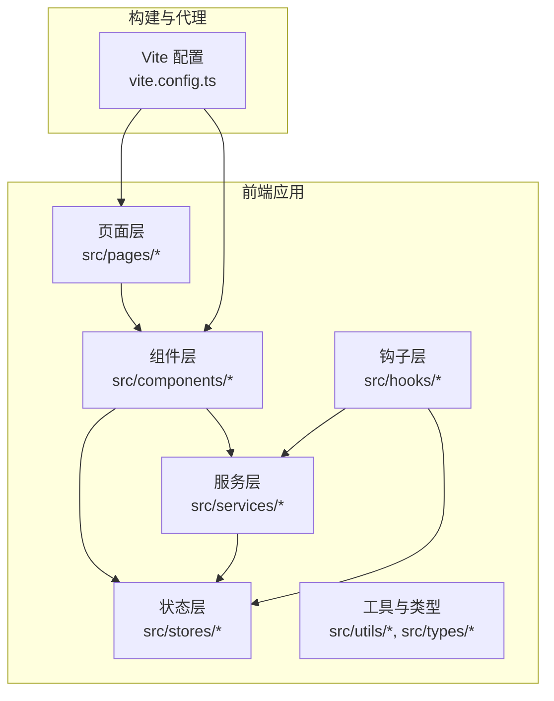
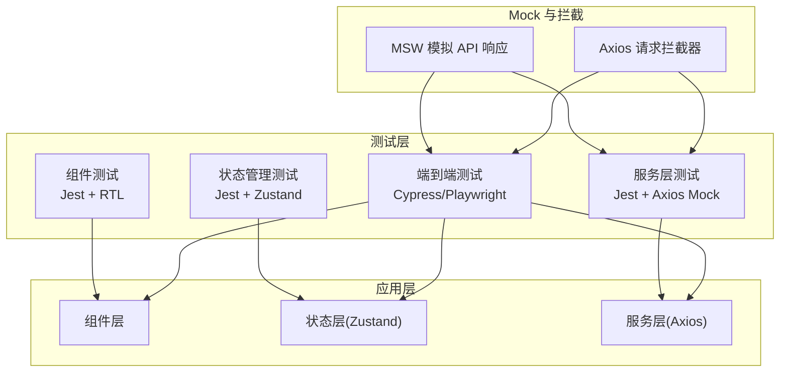
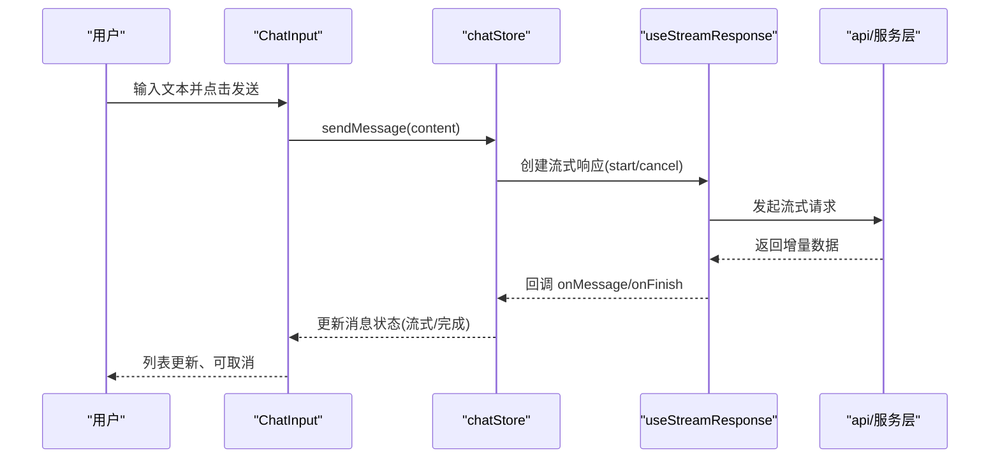
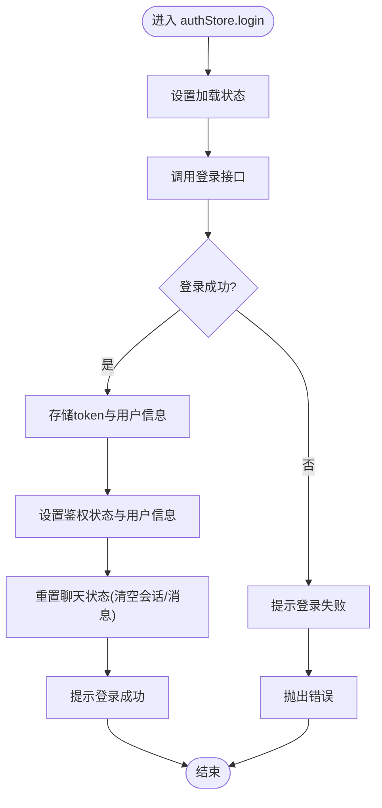
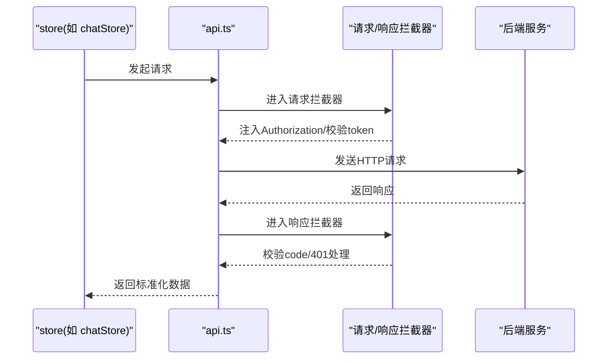
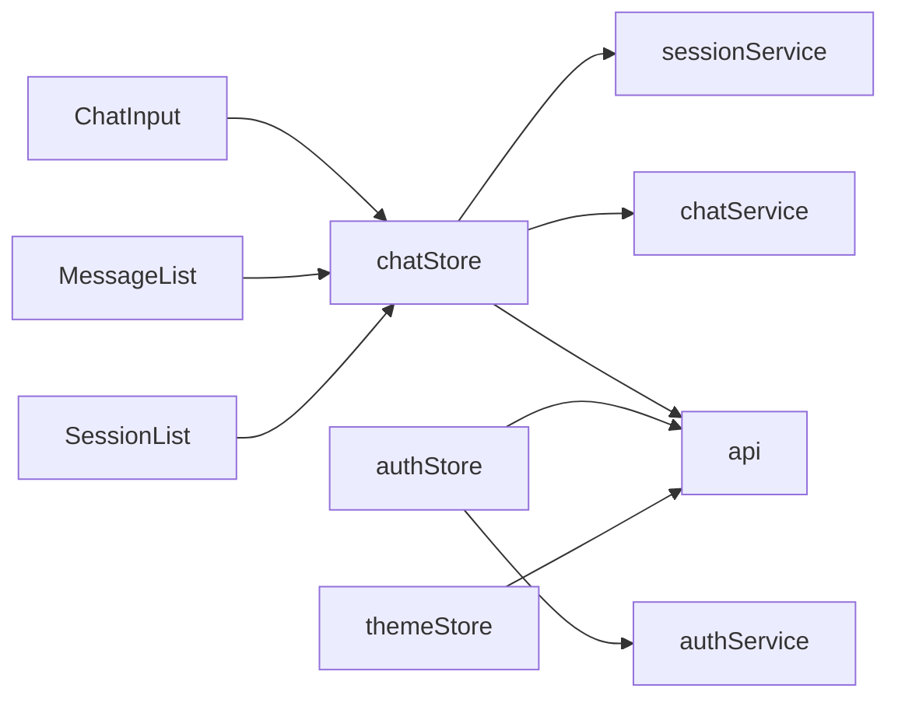

# 前端测试

<cite>
**本文引用的文件**
- [package.json](file://frontend/package.json)
- [vite.config.ts](file://frontend/vite.config.ts)
- [TESTING.md](file://frontend/TESTING.md)
- [authStore.ts](file://frontend/src/stores/authStore.ts)
- [chatStore.ts](file://frontend/src/stores/chatStore.ts)
- [themeStore.ts](file://frontend/src/stores/themeStore.ts)
- [api.ts](file://frontend/src/services/api.ts)
- [chatService.ts](file://frontend/src/services/chatService.ts)
- [authService.ts](file://frontend/src/services/authService.ts)
- [sessionService.ts](file://frontend/src/services/sessionService.ts)
- [useStreamResponse.ts](file://frontend/src/hooks/useStreamResponse.ts)
- [useAuth.ts](file://frontend/src/hooks/useAuth.ts)
- [useChat.ts](file://frontend/src/hooks/useChat.ts)
- [ChatInput.tsx](file://frontend/src/components/chat/ChatInput.tsx)
- [MessageList.tsx](file://frontend/src/components/chat/MessageList.tsx)
- [SessionList.tsx](file://frontend/src/components/session/SessionList.tsx)
- [MessageItem.tsx](file://frontend/src/components/chat/MessageItem.tsx)
- [SessionItem.tsx](file://frontend/src/components/session/SessionItem.tsx)
- [WelcomeScreen.tsx](file://frontend/src/components/chat/WelcomeScreen.tsx)
- [ThinkingIndicator.tsx](file://frontend/src/components/chat/ThinkingIndicator.tsx)
- [Header.tsx](file://frontend/src/components/layout/Header.tsx)
- [MainLayout.tsx](file://frontend/src/components/layout/MainLayout.tsx)
- [Sidebar.tsx](file://frontend/src/components/layout/Sidebar.tsx)
- [LoginPage.tsx](file://frontend/src/pages/LoginPage.tsx)
- [ChatPage.tsx](file://frontend/src/pages/ChatPage.tsx)
- [DashboardPage.tsx](file://frontend/src/pages/admin/dashboard/DashboardPage.tsx)
- [KnowledgeListPage.tsx](file://frontend/src/pages/admin/knowledge/KnowledgeListPage.tsx)
- [KnowledgeDocumentsPage.tsx](file://frontend/src/pages/admin/knowledge/KnowledgeDocumentsPage.tsx)
- [KnowledgeChunksPage.tsx](file://frontend/src/pages/admin/knowledge/KnowledgeChunksPage.tsx)
- [IngestionPage.tsx](file://frontend/src/pages/admin/ingestion/IngestionPage.tsx)
- [IntentListPage.tsx](file://frontend/src/pages/admin/intent-tree/IntentListPage.tsx)
- [IntentTreePage.tsx](file://frontend/src/pages/admin/intent-tree/IntentTreePage.tsx)
- [IntentEditPage.tsx](file://frontend/src/pages/admin/intent-tree/IntentEditPage.tsx)
- [RagTracePage.tsx](file://frontend/src/pages/admin/traces/RagTracePage.tsx)
- [RagTraceDetailPage.tsx](file://frontend/src/pages/admin/traces/RagTraceDetailPage.tsx)
- [UserListPage.tsx](file://frontend/src/pages/admin/users/UserListPage.tsx)
- [SystemSettingsPage.tsx](file://frontend/src/pages/admin/settings/SystemSettingsPage.tsx)
- [SampleQuestionPage.tsx](file://frontend/src/pages/admin/sample-questions/SampleQuestionPage.tsx)
- [QueryTermMappingPage.tsx](file://frontend/src/pages/admin/query-term-mapping/QueryTermMappingPage.tsx)
- [AdminLayout.tsx](file://frontend/src/pages/AdminLayout.tsx)
- [NotFoundPage.tsx](file://frontend/src/pages/NotFoundPage.tsx)
</cite>

## 目录
1. [简介](#简介)
2. [项目结构](#项目结构)
3. [核心组件](#核心组件)
4. [架构总览](#架构总览)
5. [详细组件分析](#详细组件分析)
6. [依赖分析](#依赖分析)
7. [性能考虑](#性能考虑)
8. [故障排查指南](#故障排查指南)
9. [结论](#结论)
10. [附录](#附录)

## 简介
本文件面向 Seahorse Agent 项目的前端测试，系统性介绍测试框架与工具的使用方式，覆盖组件测试、状态管理测试、服务层测试以及端到端测试的实施要点。重点围绕以下技术栈展开：
- 组件测试：Jest + React Testing Library（RTL）
- 状态管理测试：Zustand store（authStore、chatStore、themeStore）
- 服务层测试：axios 封装的 api.ts、chatService.ts、authService.ts、sessionService.ts 等
- Mock 与拦截：通过 MSW（Mock Service Worker）模拟 API 响应，覆盖错误场景与边界条件
- 端到端测试：建议结合 Cypress 或 Playwright 进行用户交互验证
- 覆盖率：提供配置与分析思路，确保关键路径得到充分测试

## 项目结构
前端位于 frontend 目录，采用 Vite + React + TypeScript 技术栈，核心模块划分如下：
- 组件层：src/components 下按功能域拆分（chat、session、layout、common、ui）
- 页面层：src/pages 下按路由组织（ChatPage、LoginPage、Admin 系列页面等）
- 钩子层：src/hooks 下封装业务逻辑（useAuth、useChat、useStreamResponse）
- 服务层：src/services 下封装网络请求（api.ts、chatService.ts、authService.ts、sessionService.ts 等）
- 状态层：src/stores 下使用 Zustand 管理全局状态（authStore、chatStore、themeStore）
- 工具与类型：src/utils、src/types
- 构建与代理：vite.config.ts 提供开发代理配置

图表来源
- [vite.config.ts:1-23](file://frontend/vite.config.ts#L1-L23)
- [package.json:1-70](file://frontend/package.json#L1-L70)

章节来源
- [vite.config.ts:1-23](file://frontend/vite.config.ts#L1-L23)
- [package.json:1-70](file://frontend/package.json#L1-L70)

## 核心组件
本节概述与测试密切相关的组件与状态管理模块，便于后续编写针对性测试用例。

- ChatInput：负责用户输入与发送消息，触发 chatStore.sendMessage 并与流式响应集成
- MessageList：渲染消息列表，支持思考态、流式增量、反馈按钮等
- SessionList：展示会话列表，支持重命名、删除、选中切换
- MessageItem/SessionItem：具体条目渲染组件
- WelcomeScreen/ThinkingIndicator：聊天页欢迎与思考指示器
- Header/MainLayout/Sidebar：布局组件，承载导航与主题切换
- LoginPage/ChatPage/AdminLayout：页面级组件，承载路由与权限校验
- authStore：登录、登出、当前用户拉取、鉴权状态同步
- chatStore：会话管理、消息流式渲染、任务取消、反馈提交
- themeStore：主题初始化、切换与持久化
- api.ts：axios 实例与拦截器（统一鉴权、错误提示、401 自动跳转）
- chatService.ts、authService.ts、sessionService.ts：服务封装，供 store 调用

章节来源
- [ChatInput.tsx](file://frontend/src/components/chat/ChatInput.tsx)
- [MessageList.tsx](file://frontend/src/components/chat/MessageList.tsx)
- [SessionList.tsx](file://frontend/src/components/session/SessionList.tsx)
- [MessageItem.tsx](file://frontend/src/components/chat/MessageItem.tsx)
- [SessionItem.tsx](file://frontend/src/components/session/SessionItem.tsx)
- [WelcomeScreen.tsx](file://frontend/src/components/chat/WelcomeScreen.tsx)
- [ThinkingIndicator.tsx](file://frontend/src/components/chat/ThinkingIndicator.tsx)
- [Header.tsx](file://frontend/src/components/layout/Header.tsx)
- [MainLayout.tsx](file://frontend/src/components/layout/MainLayout.tsx)
- [Sidebar.tsx](file://frontend/src/components/layout/Sidebar.tsx)
- [LoginPage.tsx](file://frontend/src/pages/LoginPage.tsx)
- [ChatPage.tsx](file://frontend/src/pages/ChatPage.tsx)
- [AdminLayout.tsx](file://frontend/src/pages/AdminLayout.tsx)
- [authStore.ts:1-116](file://frontend/src/stores/authStore.ts#L1-L116)
- [chatStore.ts:1-528](file://frontend/src/stores/chatStore.ts#L1-L528)
- [themeStore.ts:1-36](file://frontend/src/stores/themeStore.ts#L1-L36)
- [api.ts:1-66](file://frontend/src/services/api.ts#L1-L66)
- [chatService.ts:1-12](file://frontend/src/services/chatService.ts#L1-L12)

## 架构总览
前端测试架构围绕“组件测试 + 状态管理测试 + 服务层测试 + 端到端测试”四条主线展开，配合 MSW 进行 API Mock，确保在隔离环境中稳定复现行为。

图表来源
- [api.ts:1-66](file://frontend/src/services/api.ts#L1-L66)
- [authStore.ts:1-116](file://frontend/src/stores/authStore.ts#L1-L116)
- [chatStore.ts:1-528](file://frontend/src/stores/chatStore.ts#L1-L528)
- [chatService.ts:1-12](file://frontend/src/services/chatService.ts#L1-L12)

## 详细组件分析

### 组件测试：ChatInput、MessageList、SessionList
- ChatInput
  - 行为要点：接收输入、调用 sendMessage、禁用重复提交、支持深思模式开关
  - 渲染要点：输入框、发送按钮、深思开关、禁用态
  - 测试建议：模拟用户输入、点击发送；断言 store 调用次数与参数；验证禁用态与错误提示
- MessageList
  - 行为要点：渲染历史消息、流式增量、思考内容、反馈按钮、滚动定位
  - 渲染要点：消息项、思考指示器、反馈按钮、空态
  - 测试建议：传入不同消息集合（完成/流式/错误/取消），断言 DOM 结构与交互
- SessionList
  - 行为要点：渲染会话列表、重命名、删除、选中切换
  - 渲染要点：会话项、编辑图标、删除按钮、选中高亮
  - 测试建议：传入不同会话数组，触发重命名/删除，断言 store 更新与 UI 反馈

图表来源
- [ChatInput.tsx](file://frontend/src/components/chat/ChatInput.tsx)
- [chatStore.ts:224-456](file://frontend/src/stores/chatStore.ts#L224-L456)
- [useStreamResponse.ts](file://frontend/src/hooks/useStreamResponse.ts)
- [api.ts:1-66](file://frontend/src/services/api.ts#L1-L66)

章节来源
- [ChatInput.tsx](file://frontend/src/components/chat/ChatInput.tsx)
- [MessageList.tsx](file://frontend/src/components/chat/MessageList.tsx)
- [SessionList.tsx](file://frontend/src/components/session/SessionList.tsx)
- [chatStore.ts:1-528](file://frontend/src/stores/chatStore.ts#L1-L528)

### 状态管理测试：authStore、chatStore、themeStore
- authStore
  - 关键动作：login、logout、checkAuth、fetchCurrentUser
  - 断言点：token 设置与清除、用户信息同步、鉴权状态变化、聊天状态重置、toast 提示
  - 边界：登录失败、网络异常、token 过期自动跳转
- chatStore
  - 关键动作：fetchSessions、createSession、deleteSession、renameSession、selectSession、sendMessage、cancelGeneration、submitFeedback
  - 断言点：会话列表排序、消息状态机（done/streaming/error/cancelled）、流式增量、深思时序、任务取消、反馈投票
  - 边界：并发发送、取消时机、错误回调、标题回填
- themeStore
  - 关键动作：setTheme、toggleTheme、initialize
  - 断言点：DOM 主题类切换、本地存储、初始化默认主题

图表来源
- [authStore.ts:29-67](file://frontend/src/stores/authStore.ts#L29-L67)

章节来源
- [authStore.ts:1-116](file://frontend/src/stores/authStore.ts#L1-L116)
- [chatStore.ts:1-528](file://frontend/src/stores/chatStore.ts#L1-L528)
- [themeStore.ts:1-36](file://frontend/src/stores/themeStore.ts#L1-L36)

### 服务层测试：chatService、knowledgeService、api.ts
- api.ts
  - 关键点：基础 URL、请求拦截器注入 Authorization、响应拦截器统一错误处理与 401 自动跳转
  - 测试建议：构造带/不带 token 的请求；模拟 401、业务错误码；断言 toast 与跳转
- chatService.ts
  - 关键点：停止任务、提交反馈
  - 测试建议：断言请求路径、参数、错误处理
- 其他服务（knowledgeService、sessionService 等）
  - 建议：对每个服务函数进行单元测试，覆盖 GET/POST/DELETE 等方法，断言请求参数与错误分支

图表来源
- [api.ts:21-65](file://frontend/src/services/api.ts#L21-L65)
- [chatStore.ts:427-434](file://frontend/src/stores/chatStore.ts#L427-L434)

章节来源
- [api.ts:1-66](file://frontend/src/services/api.ts#L1-L66)
- [chatService.ts:1-12](file://frontend/src/services/chatService.ts#L1-L12)
- [chatStore.ts:1-528](file://frontend/src/stores/chatStore.ts#L1-L528)

### 端到端测试：Cypress/Playwright 用户交互
- 建议场景
  - 登录流程：输入凭据、跳转首页、显示用户信息
  - 聊天流程：新建会话、发送消息、观察流式输出、提交反馈、取消生成
  - 管理后台：知识库 CRUD、意图树管理、用户管理、系统设置
- 测试策略
  - 使用 MSW 拦截真实 API，注入稳定 Mock 数据
  - 对关键交互（点击、输入、滚动、确认弹窗）进行断言
  - 覆盖错误场景：网络异常、401、业务错误提示

[本节为概念性指导，不直接分析具体文件，故无章节来源]

### Mock 数据与 MSW 使用
- MSW 优势：在浏览器侧拦截 XHR/Fetch，无需额外后端服务，支持稳定可重复的测试数据
- 使用建议
  - 为每个服务定义 handler（GET/POST/PUT/DELETE），覆盖成功、失败、超时、401 等场景
  - 在测试入口注册 worker，确保在所有测试前启动
  - 通过 rest.context.status/rest.context.json 控制响应码与负载
- 错误与边界
  - 401 自动跳转：验证路由跳转与本地存储清理
  - 业务错误码：断言 toast 与错误提示
  - 网络异常：模拟 ERR_NETWORK，断言通用错误提示

[本节为概念性指导，不直接分析具体文件，故无章节来源]

### 测试覆盖率配置与分析
- 建议配置
  - Jest 覆盖率：开启 statements、branches、functions、lines，阈值按模块设定
  - 排除：第三方库、类型声明、构建产物、测试辅助文件
- 分析方法
  - 定期生成覆盖率报告，识别低覆盖区域（store/actions/service）
  - 优先补齐核心路径：登录/登出、消息发送/取消、会话管理、错误处理
  - 结合 MSW 的多场景用例，确保边界条件被覆盖

[本节为通用实践指导，不直接分析具体文件，故无章节来源]

## 依赖分析
前端测试依赖关系如下：
- 组件依赖：组件依赖 hooks 与 stores；hooks 依赖 services；services 依赖 api
- 测试耦合：组件测试与状态测试相互独立；服务测试与拦截器强相关
- 外部依赖：axios、zustand、react-router-dom、MSW（用于拦截）

图表来源
- [ChatInput.tsx](file://frontend/src/components/chat/ChatInput.tsx)
- [MessageList.tsx](file://frontend/src/components/chat/MessageList.tsx)
- [SessionList.tsx](file://frontend/src/components/session/SessionList.tsx)
- [chatStore.ts:1-528](file://frontend/src/stores/chatStore.ts#L1-L528)
- [authStore.ts:1-116](file://frontend/src/stores/authStore.ts#L1-L116)
- [themeStore.ts:1-36](file://frontend/src/stores/themeStore.ts#L1-L36)
- [api.ts:1-66](file://frontend/src/services/api.ts#L1-L66)
- [chatService.ts:1-12](file://frontend/src/services/chatService.ts#L1-L12)
- [sessionService.ts](file://frontend/src/services/sessionService.ts)

章节来源
- [chatStore.ts:1-528](file://frontend/src/stores/chatStore.ts#L1-L528)
- [authStore.ts:1-116](file://frontend/src/stores/authStore.ts#L1-L116)
- [themeStore.ts:1-36](file://frontend/src/stores/themeStore.ts#L1-L36)
- [api.ts:1-66](file://frontend/src/services/api.ts#L1-L66)

## 性能考虑
- 测试执行性能
  - 使用并行测试运行，减少等待时间
  - 缓存构建产物，避免重复编译
- 状态与服务测试
  - 对 store 的异步操作进行超时控制，避免测试挂起
  - 对流式响应使用有限数据集，缩短测试时长
- 端到端测试
  - 合理拆分用例，避免长链路串联
  - 使用 MSW 减少真实网络请求带来的不稳定因素

[本节为通用指导，不直接分析具体文件，故无章节来源]

## 故障排查指南
- 开发代理问题
  - 现象：请求 404 “No static resource”
  - 排查：确认 vite.config.ts 代理配置、后端服务是否启动、重启前端开发服务器
- 登录与鉴权
  - 现象：401 未登录或登录已过期
  - 排查：确认登录流程、token 存储、api 拦截器 401 处理逻辑
- 网络请求检查
  - 方法：浏览器 Network 标签，核对请求 URL、状态码、响应体
- 常见问题
  - 端口占用：Vite 自动尝试下一个端口
  - 管理员账号：数据库中将用户角色设为 admin

章节来源
- [TESTING.md:1-112](file://frontend/TESTING.md#L1-L112)
- [vite.config.ts:12-21](file://frontend/vite.config.ts#L12-L21)
- [api.ts:29-65](file://frontend/src/services/api.ts#L29-L65)

## 结论
通过 Jest + RTL 进行组件测试，结合 Zustand 的可测试性对 authStore、chatStore、themeStore 进行状态测试；以 MSW 拦截真实 API，实现稳定可控的服务层测试；最后以 Cypress/Playwright 覆盖端到端用户流程。配合合理的覆盖率配置与持续集成，可显著提升前端代码质量与稳定性。

[本节为总结性内容，不直接分析具体文件，故无章节来源]

## 附录
- 页面与组件清单（与测试相关）
  - 页面：LoginPage、ChatPage、AdminLayout、各管理页面（Dashboard、Knowledge、Ingestion、IntentTree、Traces、Users、Settings、SampleQuestions、QueryTermMapping）
  - 组件：ChatInput、MessageList、MessageItem、SessionList、SessionItem、WelcomeScreen、ThinkingIndicator、Header、MainLayout、Sidebar、NotFoundPage
- 钩子与工具：useAuth、useChat、useStreamResponse、storage 工具
- 服务：api.ts、chatService.ts、authService.ts、sessionService.ts 等

章节来源
- [LoginPage.tsx](file://frontend/src/pages/LoginPage.tsx)
- [ChatPage.tsx](file://frontend/src/pages/ChatPage.tsx)
- [AdminLayout.tsx](file://frontend/src/pages/AdminLayout.tsx)
- [DashboardPage.tsx](file://frontend/src/pages/admin/dashboard/DashboardPage.tsx)
- [KnowledgeListPage.tsx](file://frontend/src/pages/admin/knowledge/KnowledgeListPage.tsx)
- [KnowledgeDocumentsPage.tsx](file://frontend/src/pages/admin/knowledge/KnowledgeDocumentsPage.tsx)
- [KnowledgeChunksPage.tsx](file://frontend/src/pages/admin/knowledge/KnowledgeChunksPage.tsx)
- [IngestionPage.tsx](file://frontend/src/pages/admin/ingestion/IngestionPage.tsx)
- [IntentListPage.tsx](file://frontend/src/pages/admin/intent-tree/IntentListPage.tsx)
- [IntentTreePage.tsx](file://frontend/src/pages/admin/intent-tree/IntentTreePage.tsx)
- [IntentEditPage.tsx](file://frontend/src/pages/admin/intent-tree/IntentEditPage.tsx)
- [RagTracePage.tsx](file://frontend/src/pages/admin/traces/RagTracePage.tsx)
- [RagTraceDetailPage.tsx](file://frontend/src/pages/admin/traces/RagTraceDetailPage.tsx)
- [UserListPage.tsx](file://frontend/src/pages/admin/users/UserListPage.tsx)
- [SystemSettingsPage.tsx](file://frontend/src/pages/admin/settings/SystemSettingsPage.tsx)
- [SampleQuestionPage.tsx](file://frontend/src/pages/admin/sample-questions/SampleQuestionPage.tsx)
- [QueryTermMappingPage.tsx](file://frontend/src/pages/admin/query-term-mapping/QueryTermMappingPage.tsx)
- [NotFoundPage.tsx](file://frontend/src/pages/NotFoundPage.tsx)
- [useAuth.ts](file://frontend/src/hooks/useAuth.ts)
- [useChat.ts](file://frontend/src/hooks/useChat.ts)
- [useStreamResponse.ts](file://frontend/src/hooks/useStreamResponse.ts)
- [storage.ts](file://frontend/src/utils/storage.ts)