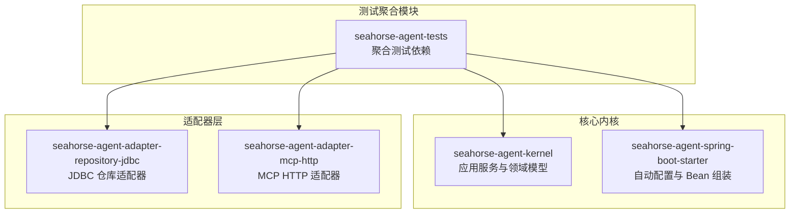
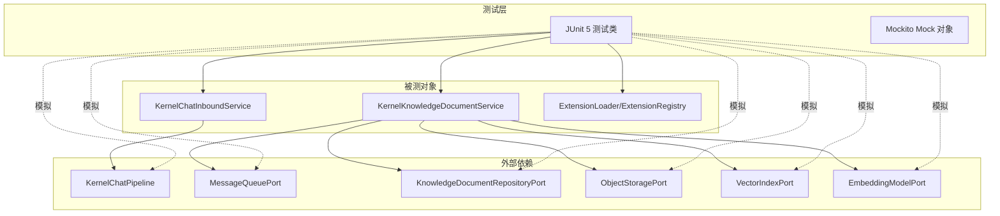
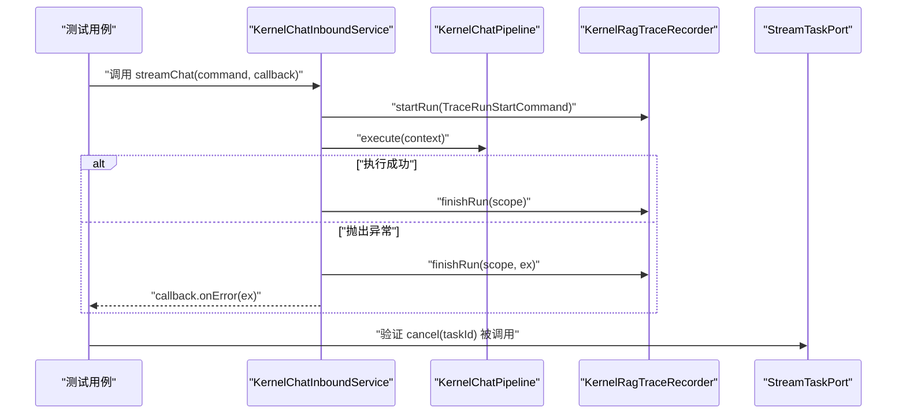
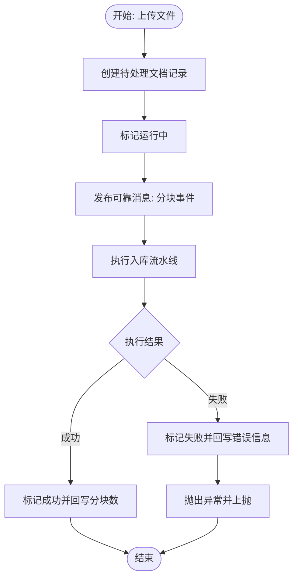
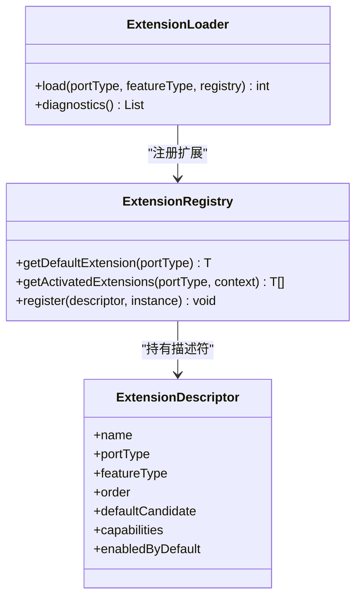
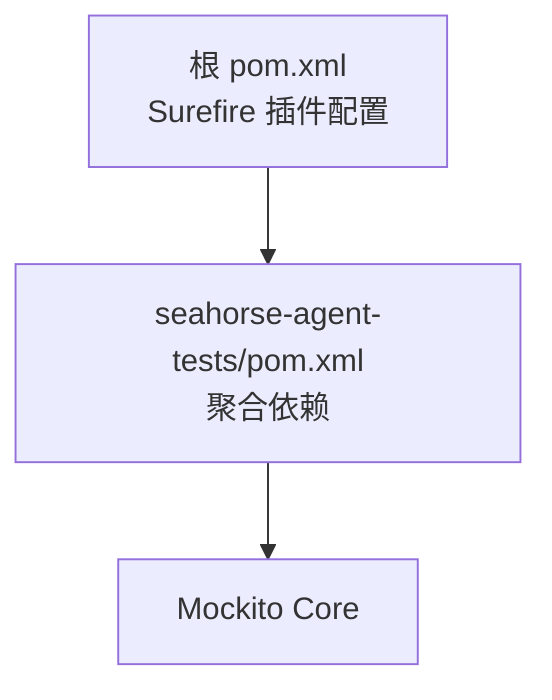

# 单元测试

<cite>
**本文引用的文件**
- [pom.xml](file://pom.xml)
- [seahorse-agent-tests/pom.xml](file://seahorse-agent-tests/pom.xml)
- [KernelChatInboundService.java](file://seahorse-agent-kernel/src/main/java/com/miracle/ai/seahorse/agent/kernel/application/chat/KernelChatInboundService.java)
- [KernelKnowledgeDocumentService.java](file://seahorse-agent-kernel/src/main/java/com/miracle/ai/seahorse/agent/kernel/application/knowledge/KernelKnowledgeDocumentService.java)
- [SeahorseAgentKernelAutoConfiguration.java](file://seahorse-agent-spring-boot-starter/src/main/java/com/miracle/ai/seahorse/agent/adapters/spring/SeahorseAgentKernelAutoConfiguration.java)
- [JdbcKnowledgeDocumentRepositoryAdapterTests.java](file://seahorse-agent-adapter-repository-jdbc/src/test/java/com/miracle/ai/seahorse/agent/adapters/repository/jdbc/JdbcKnowledgeDocumentRepositoryAdapterTests.java)
- [JdbcKnowledgeBaseRepositoryAdapterTests.java](file://seahorse-agent-adapter-repository-jdbc/src/test/java/com/miracle/ai/seahorse/agent/adapters/repository/jdbc/JdbcKnowledgeBaseRepositoryAdapterTests.java)
- [LlmMcpParameterExtractionAdapterTests.java](file://seahorse-agent-adapter-mcp-http/src/test/java/com/miracle/ai/seahorse/agent/adapters/mcp/http/LlmMcpParameterExtractionAdapterTests.java)
- [NativeMcpToolRegistryTests.java](file://seahorse-agent-adapter-mcp-http/src/test/java/com/miracle/ai/seahorse/agent/adapters/mcp/http/NativeMcpToolRegistryTests.java)
- [ExtensionLoader.java](file://seahorse-agent-kernel/src/main/java/com/miracle/ai/seahorse/agent/kernel/plugin/ExtensionLoader.java)
- [ExtensionRegistry.java](file://seahorse-agent-kernel/src/main/java/com/miracle/ai/seahorse/agent/kernel/plugin/ExtensionRegistry.java)
- [ExtensionLoaderTests$SamplePort](file://seahorse-agent-tests/src/test/resources/META-INF/seahorse-agent/com.miracle.ai.seahorse.agent.kernel.plugin.ExtensionLoaderTests$SamplePort)
</cite>

## 目录
1. [简介](#简介)
2. [项目结构](#项目结构)
3. [核心组件](#核心组件)
4. [架构总览](#架构总览)
5. [详细组件分析](#详细组件分析)
6. [依赖分析](#依赖分析)
7. [性能考虑](#性能考虑)
8. [故障排查指南](#故障排查指南)
9. [结论](#结论)
10. [附录](#附录)

## 简介
本文件面向 Seahorse Agent 后端单元测试体系，系统性梳理测试组织结构、测试框架与注解使用（JUnit 5、Mockito）、测试用例设计规范（命名、断言、异常测试），并结合 Kernel 应用服务、功能特性与插件系统的实际代码路径，给出可复用的测试示例与最佳实践。重点覆盖以下方面：
- KernelChatInboundService、KernelKnowledgeDocumentService 等核心服务的业务逻辑测试
- 插件系统（ExtensionLoader、ExtensionRegistry）的加载与激活测试
- 适配器层（如 JDBC 知识库/文档仓库、MCP HTTP 适配器）的契约验证测试
- 测试数据准备与清理（内存数据库、事务回滚策略建议）
- Mock 对象与 @Mock/@InjectMocks 的使用场景与注意事项

## 项目结构
后端测试主要分布在以下模块：
- 核心内核与自动配置：kernel、spring-boot-starter
- 适配器层：repository-jdbc、mcp-http、cache、vector 等
- 测试聚合模块：seahorse-agent-tests（集中引入 kernel、web、starter 与 Mockito）

**图表来源**
- [pom.xml:37-59](file://pom.xml#L37-L59)
- [seahorse-agent-tests/pom.xml:14-36](file://seahorse-agent-tests/pom.xml#L14-L36)

**章节来源**
- [pom.xml:37-59](file://pom.xml#L37-L59)
- [seahorse-agent-tests/pom.xml:14-36](file://seahorse-agent-tests/pom.xml#L14-L36)

## 核心组件
- KernelChatInboundService：负责流式问答的入站服务，封装调用链执行与追踪记录。
- KernelKnowledgeDocumentService：负责知识库文档的上传、分块、入库、更新、启用/禁用、删除、搜索与分页等主流程。
- SeahorseAgentKernelAutoConfiguration：装配内核应用服务与端口 Bean，为测试提供可注入的上下文。
- ExtensionLoader/ExtensionRegistry：微内核扩展加载与注册表，用于验证扩展发现、默认扩展选择与管理态扩展过滤。

**章节来源**
- [KernelChatInboundService.java:34-94](file://seahorse-agent-kernel/src/main/java/com/miracle/ai/seahorse/agent/kernel/application/chat/KernelChatInboundService.java#L34-L94)
- [KernelKnowledgeDocumentService.java:59-356](file://seahorse-agent-kernel/src/main/java/com/miracle/ai/seahorse/agent/kernel/application/knowledge/KernelKnowledgeDocumentService.java#L59-L356)
- [SeahorseAgentKernelAutoConfiguration.java:188-611](file://seahorse-agent-spring-boot-starter/src/main/java/com/miracle/ai/seahorse/agent/adapters/spring/SeahorseAgentKernelAutoConfiguration.java#L188-L611)
- [ExtensionLoader.java:39-262](file://seahorse-agent-kernel/src/main/java/com/miracle/ai/seahorse/agent/kernel/plugin/ExtensionLoader.java#L39-L262)
- [ExtensionRegistry.java:28-84](file://seahorse-agent-kernel/src/main/java/com/miracle/ai/seahorse/agent/kernel/plugin/ExtensionRegistry.java#L28-L84)

## 架构总览
下图展示了测试与被测对象之间的关系：测试通过 Spring 上下文或直接构造被测对象，利用 Mockito 模拟外部依赖，验证核心服务的业务行为。

**图表来源**
- [KernelChatInboundService.java:40-54](file://seahorse-agent-kernel/src/main/java/com/miracle/ai/seahorse/agent/kernel/application/chat/KernelChatInboundService.java#L40-L54)
- [KernelKnowledgeDocumentService.java:68-101](file://seahorse-agent-kernel/src/main/java/com/miracle/ai/seahorse/agent/kernel/application/knowledge/KernelKnowledgeDocumentService.java#L68-L101)
- [SeahorseAgentKernelAutoConfiguration.java:414-431](file://seahorse-agent-spring-boot-starter/src/main/java/com/miracle/ai/seahorse/agent/adapters/spring/SeahorseAgentKernelAutoConfiguration.java#L414-L431)
- [ExtensionLoader.java:79-84](file://seahorse-agent-kernel/src/main/java/com/miracle/ai/seahorse/agent/kernel/plugin/ExtensionLoader.java#L79-L84)

## 详细组件分析

### KernelChatInboundService 测试
- 测试目标
  - 验证流式问答命令进入后，是否正确构建上下文、触发聊天管道执行、记录追踪并处理异常。
  - 验证停止任务通过 StreamTaskPort 的取消行为。
- 关键断言点
  - 追踪开始/结束与异常分支的回调触发
  - 正常路径下上下文字段（问题、会话、任务、用户、深思选项）的传递
- Mock 场景
  - KernelChatPipeline：验证 execute 被调用且传入正确的上下文
  - StreamTaskPort：验证 cancel 被调用
  - KernelRagTraceRecorder：验证 startRun/finishRun 调用次数与异常分支的 finishRun(ex) 调用
- 示例参考
  - [KernelChatInboundService.java:56-92](file://seahorse-agent-kernel/src/main/java/com/miracle/ai/seahorse/agent/kernel/application/chat/KernelChatInboundService.java#L56-L92)
  - [SeahorseAgentKernelAutoConfiguration.java:414-431](file://seahorse-agent-spring-boot-starter/src/main/java/com/miracle/ai/seahorse/agent/adapters/spring/SeahorseAgentKernelAutoConfiguration.java#L414-L431)

**图表来源**
- [KernelChatInboundService.java:56-78](file://seahorse-agent-kernel/src/main/java/com/miracle/ai/seahorse/agent/kernel/application/chat/KernelChatInboundService.java#L56-L78)
- [SeahorseAgentKernelAutoConfiguration.java:414-431](file://seahorse-agent-spring-boot-starter/src/main/java/com/miracle/ai/seahorse/agent/adapters/spring/SeahorseAgentKernelAutoConfiguration.java#L414-L431)

**章节来源**
- [KernelChatInboundService.java:34-94](file://seahorse-agent-kernel/src/main/java/com/miracle/ai/seahorse/agent/kernel/application/chat/KernelChatInboundService.java#L34-L94)
- [SeahorseAgentKernelAutoConfiguration.java:414-431](file://seahorse-agent-spring-boot-starter/src/main/java/com/miracle/ai/seahorse/agent/adapters/spring/SeahorseAgentKernelAutoConfiguration.java#L414-L431)

### KernelKnowledgeDocumentService 测试
- 测试目标
  - 上传文件并创建待处理文档记录
  - 分块任务标记运行、发布可靠消息、执行分块并回写状态
  - 文档详情查询、分页、搜索、更新、启用/禁用、删除、分块日志查看
  - 更新时同步刷新计划（启用定时刷新）
  - 启用时重索引已启用分块；禁用时删除向量
- 关键断言点
  - 上传后返回的记录字段与文件存储引用
  - 标记运行后发布的消息主题与事件负载
  - 执行分块成功/失败后的状态变更与异常传播
  - 更新/启用/删除对数据库与对象存储/向量索引的影响
- Mock 场景
  - KnowledgeBaseQueryPort：返回可检索知识库列表
  - KnowledgeDocumentRepositoryPort：创建/查询/更新/删除/分页/日志
  - ObjectStoragePort：上传/打开流/删除
  - MessageQueuePort：发布可靠消息
  - KernelIngestionEngine：执行入库流水线
  - KnowledgeDocumentVectorPorts：嵌入模型与向量索引端口
  - DocumentRefreshSchedulePort/SchedulerPort：刷新计划的增删改查
- 示例参考
  - [KernelKnowledgeDocumentService.java:103-214](file://seahorse-agent-kernel/src/main/java/com/miracle/ai/seahorse/agent/kernel/application/knowledge/KernelKnowledgeDocumentService.java#L103-L214)
  - [SeahorseAgentKernelAutoConfiguration.java:595-611](file://seahorse-agent-spring-boot-starter/src/main/java/com/miracle/ai/seahorse/agent/adapters/spring/SeahorseAgentKernelAutoConfiguration.java#L595-L611)

**图表来源**
- [KernelKnowledgeDocumentService.java:117-143](file://seahorse-agent-kernel/src/main/java/com/miracle/ai/seahorse/agent/kernel/application/knowledge/KernelKnowledgeDocumentService.java#L117-L143)

**章节来源**
- [KernelKnowledgeDocumentService.java:59-356](file://seahorse-agent-kernel/src/main/java/com/miracle/ai/seahorse/agent/kernel/application/knowledge/KernelKnowledgeDocumentService.java#L59-L356)
- [SeahorseAgentKernelAutoConfiguration.java:595-611](file://seahorse-agent-spring-boot-starter/src/main/java/com/miracle/ai/seahorse/agent/adapters/spring/SeahorseAgentKernelAutoConfiguration.java#L595-L611)

### 插件系统（ExtensionLoader/ExtensionRegistry）测试
- 测试目标
  - 验证基于 classpath 资源的扩展加载、默认扩展选择、顺序与能力过滤、容器托管扩展过滤
  - 验证扩展描述符属性（order、capabilities、enabled-by-default、default）
- 关键断言点
  - 从资源文件解析扩展名集合
  - 实例化扩展并注册到注册表
  - 默认扩展与非默认扩展的选择
  - 容器托管扩展不参与实例化
- 示例参考
  - [ExtensionLoader.java:79-114](file://seahorse-agent-kernel/src/main/java/com/miracle/ai/seahorse/agent/kernel/plugin/ExtensionLoader.java#L79-L114)
  - [ExtensionRegistry.java:28-84](file://seahorse-agent-kernel/src/main/java/com/miracle/ai/seahorse/agent/kernel/plugin/ExtensionRegistry.java#L28-L84)
  - [ExtensionLoaderTests$SamplePort:1-11](file://seahorse-agent-tests/src/test/resources/META-INF/seahorse-agent/com.miracle.ai.seahorse.agent.kernel.plugin.ExtensionLoaderTests$SamplePort#L1-L11)

**图表来源**
- [ExtensionLoader.java:79-190](file://seahorse-agent-kernel/src/main/java/com/miracle/ai/seahorse/agent/kernel/plugin/ExtensionLoader.java#L79-L190)
- [ExtensionRegistry.java:28-84](file://seahorse-agent-kernel/src/main/java/com/miracle/ai/seahorse/agent/kernel/plugin/ExtensionRegistry.java#L28-L84)

**章节来源**
- [ExtensionLoader.java:39-262](file://seahorse-agent-kernel/src/main/java/com/miracle/ai/seahorse/agent/kernel/plugin/ExtensionLoader.java#L39-L262)
- [ExtensionRegistry.java:28-84](file://seahorse-agent-kernel/src/main/java/com/miracle/ai/seahorse/agent/kernel/plugin/ExtensionRegistry.java#L28-L84)
- [ExtensionLoaderTests$SamplePort:1-11](file://seahorse-agent-tests/src/test/resources/META-INF/seahorse-agent/com.miracle.ai.seahorse.agent.kernel.plugin.ExtensionLoaderTests$SamplePort#L1-L11)

### 适配器层测试（JDBC 仓库、MCP HTTP）
- JDBC 知识库/文档仓库测试
  - 使用内存数据库（H2）初始化表结构与种子数据，验证 CRUD、分页、计数与日志查询
  - 示例参考：[JdbcKnowledgeDocumentRepositoryAdapterTests.java:49-79](file://seahorse-agent-adapter-repository-jdbc/src/test/java/com/miracle/ai/seahorse/agent/adapters/repository/jdbc/JdbcKnowledgeDocumentRepositoryAdapterTests.java#L49-L79)
  - 示例参考：[JdbcKnowledgeBaseRepositoryAdapterTests.java:48-82](file://seahorse-agent-adapter-repository-jdbc/src/test/java/com/miracle/ai/seahorse/agent/adapters/repository/jdbc/JdbcKnowledgeBaseRepositoryAdapterTests.java#L48-L82)
- MCP HTTP 参数提取适配器测试
  - 验证参数声明解析、默认值填充与模型不可用时的降级行为
  - 示例参考：[LlmMcpParameterExtractionAdapterTests.java:34-59](file://seahorse-agent-adapter-mcp-http/src/test/java/com/miracle/ai/seahorse/agent/adapters/mcp/http/LlmMcpParameterExtractionAdapterTests.java#L34-L59)
- MCP 工具注册表测试
  - 验证工具描述符与执行器的暴露与空白工具 ID 的过滤
  - 示例参考：[NativeMcpToolRegistryTests.java:32-49](file://seahorse-agent-adapter-mcp-http/src/test/java/com/miracle/ai/seahorse/agent/adapters/mcp/http/NativeMcpToolRegistryTests.java#L32-L49)

**章节来源**
- [JdbcKnowledgeDocumentRepositoryAdapterTests.java:49-218](file://seahorse-agent-adapter-repository-jdbc/src/test/java/com/miracle/ai/seahorse/agent/adapters/repository/jdbc/JdbcKnowledgeDocumentRepositoryAdapterTests.java#L49-L218)
- [JdbcKnowledgeBaseRepositoryAdapterTests.java:48-139](file://seahorse-agent-adapter-repository-jdbc/src/test/java/com/miracle/ai/seahorse/agent/adapters/repository/jdbc/JdbcKnowledgeBaseRepositoryAdapterTests.java#L48-L139)
- [LlmMcpParameterExtractionAdapterTests.java:34-101](file://seahorse-agent-adapter-mcp-http/src/test/java/com/miracle/ai/seahorse/agent/adapters/mcp/http/LlmMcpParameterExtractionAdapterTests.java#L34-L101)
- [NativeMcpToolRegistryTests.java:32-64](file://seahorse-agent-adapter-mcp-http/src/test/java/com/miracle/ai/seahorse/agent/adapters/mcp/http/NativeMcpToolRegistryTests.java#L32-L64)

## 依赖分析
- 测试框架与工具
  - JUnit 5：所有测试类使用 @Test、@BeforeEach 等注解
  - Mockito：在测试中通过 @Mock/@InjectMocks 创建与注入 Mock 对象
  - AssertJ：用于断言（如 assertThat）
- Maven 配置要点
  - Surefire 插件启用，排除 integration 分组，JavaAgent 注入 Mockito
  - seahorse-agent-tests 聚合 kernel、web、starter 与 Mockito 依赖

**图表来源**
- [pom.xml:230-236](file://pom.xml#L230-L236)
- [seahorse-agent-tests/pom.xml:14-36](file://seahorse-agent-tests/pom.xml#L14-L36)

**章节来源**
- [pom.xml:230-236](file://pom.xml#L230-L236)
- [seahorse-agent-tests/pom.xml:14-36](file://seahorse-agent-tests/pom.xml#L14-L36)

## 性能考虑
- 单元测试应避免真实外部依赖（数据库、消息队列、网络模型服务），优先使用 Mock 或内存实现（如 H2、本地缓存）。
- 对于向量/嵌入等耗时操作，建议通过端口抽象与 Mock 返回固定值，以保证测试快速稳定。
- 对于扩展加载与 Feature 注册，建议在测试前构建最小化的注册表，避免扫描大量 classpath 资源。

## 故障排查指南
- 常见断言失败
  - 参数校验：检查空值/空白字符串校验是否触发（如知识库/文档 ID 校验）
  - 状态冲突：文档处于运行中时禁止更新/删除/分块，需验证异常抛出
  - 外部依赖未 Mock：确认所有端口（Repository、ObjectStorage、VectorIndex、MessageQueue）均被 Mock
- 追踪与日志
  - 若使用 KernelRagTraceRecorder，需验证 startRun/finishRun 的调用次数与异常分支
- 数据一致性
  - JDBC 适配器测试使用内存数据库，注意表结构与种子数据的一致性

**章节来源**
- [KernelKnowledgeDocumentService.java:234-264](file://seahorse-agent-kernel/src/main/java/com/miracle/ai/seahorse/agent/kernel/application/knowledge/KernelKnowledgeDocumentService.java#L234-L264)
- [KernelChatInboundService.java:60-72](file://seahorse-agent-kernel/src/main/java/com/miracle/ai/seahorse/agent/kernel/application/chat/KernelChatInboundService.java#L60-L72)

## 结论
本文基于 Seahorse Agent 的核心内核与适配器层，给出了单元测试的组织方式、测试框架与注解使用、测试用例设计规范以及 Mock 最佳实践。通过 KernelChatInboundService、KernelKnowledgeDocumentService、插件系统与适配器层的测试示例，读者可以快速建立一致、可维护且高覆盖率的单元测试体系。

## 附录

### 测试框架与注解使用
- JUnit 5
  - @Test：定义测试方法
  - @BeforeEach：测试前置设置（如数据源初始化）
  - @DisplayName：为测试方法提供更友好的显示名称
- Mockito
  - @Mock：创建 Mock 对象
  - @InjectMocks：将 Mock 注入到被测对象
  - when(...).thenReturn(...)：定义 Mock 行为
  - verify(...).method(...)：验证方法调用
  - ArgumentCaptor：捕获参数进行断言

**章节来源**
- [pom.xml:230-236](file://pom.xml#L230-L236)
- [seahorse-agent-tests/pom.xml:32-35](file://seahorse-agent-tests/pom.xml#L32-L35)

### 测试用例编写规范
- 命名规范
  - 动宾结构：shouldXxxWhenYyy（如 shouldCreateQueryUpdateAndDeleteKnowledgeBase）
  - 明确前置条件与期望结果
- 断言策略
  - 使用 AssertJ 的 assertThat 进行链式断言
  - 对异常场景使用 verify/onException 断言
- 异常测试
  - 使用 @Test(expected = ...) 或断言回调 onError/ex 的触发
  - 对非法输入（空 ID、空白名称）进行参数校验断言

**章节来源**
- [JdbcKnowledgeDocumentRepositoryAdapterTests.java:49-79](file://seahorse-agent-adapter-repository-jdbc/src/test/java/com/miracle/ai/seahorse/agent/adapters/repository/jdbc/JdbcKnowledgeDocumentRepositoryAdapterTests.java#L49-L79)
- [LlmMcpParameterExtractionAdapterTests.java:51-59](file://seahorse-agent-adapter-mcp-http/src/test/java/com/miracle/ai/seahorse/agent/adapters/mcp/http/LlmMcpParameterExtractionAdapterTests.java#L51-L59)

### Mock 使用场景与最佳实践
- 外部依赖
  - Repository 接口：Mock CRUD/分页/统计方法，返回预设数据或抛出预期异常
  - 对象存储/消息队列/向量索引：Mock 上传/删除/发布/索引方法，断言调用参数
  - 模型端口：Mock 返回固定嵌入向量或文本，避免真实推理
- 适配器接口
  - 通过 ObjectProvider/条件 Bean 提供默认实现，便于测试时替换
- 最佳实践
  - 保持测试隔离：每个测试仅关注单一行为
  - 使用固定时间戳/固定 ID，便于断言
  - 对事务回滚建议采用内存数据库与单事务测试模式

**章节来源**
- [SeahorseAgentKernelAutoConfiguration.java:575-611](file://seahorse-agent-spring-boot-starter/src/main/java/com/miracle/ai/seahorse/agent/adapters/spring/SeahorseAgentKernelAutoConfiguration.java#L575-L611)
- [JdbcKnowledgeDocumentRepositoryAdapterTests.java:40-47](file://seahorse-agent-adapter-repository-jdbc/src/test/java/com/miracle/ai/seahorse/agent/adapters/repository/jdbc/JdbcKnowledgeDocumentRepositoryAdapterTests.java#L40-L47)

### 测试数据准备与清理
- 内存数据库
  - 使用 H2 内存数据库初始化表结构与种子数据
  - 在 @BeforeEach 中创建 Schema，在测试结束后由内存数据库自动回收
- 事务回滚
  - 建议在测试方法内使用单事务，失败时回滚，避免污染其他测试
- 数据隔离
  - 使用唯一 ID 与时间戳，避免跨测试干扰

**章节来源**
- [JdbcKnowledgeDocumentRepositoryAdapterTests.java:81-169](file://seahorse-agent-adapter-repository-jdbc/src/test/java/com/miracle/ai/seahorse/agent/adapters/repository/jdbc/JdbcKnowledgeDocumentRepositoryAdapterTests.java#L81-L169)
- [JdbcKnowledgeBaseRepositoryAdapterTests.java:112-137](file://seahorse-agent-adapter-repository-jdbc/src/test/java/com/miracle/ai/seahorse/agent/adapters/repository/jdbc/JdbcKnowledgeBaseRepositoryAdapterTests.java#L112-L137)