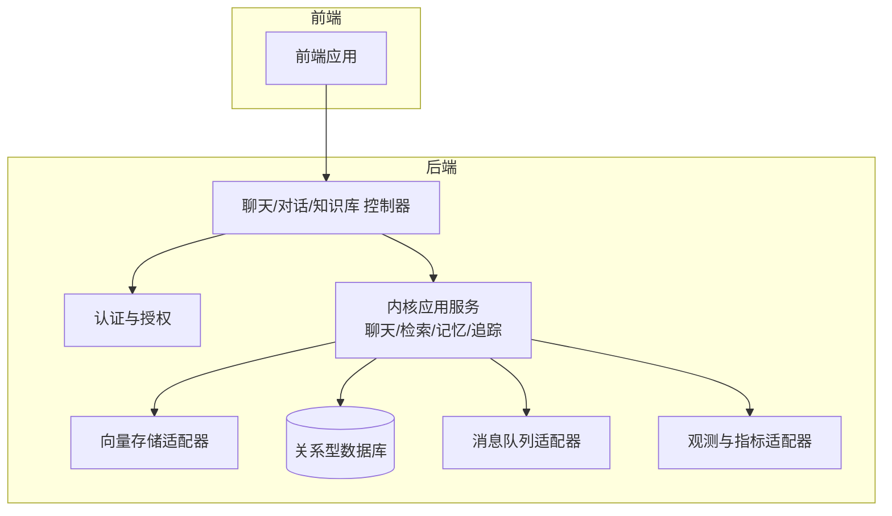
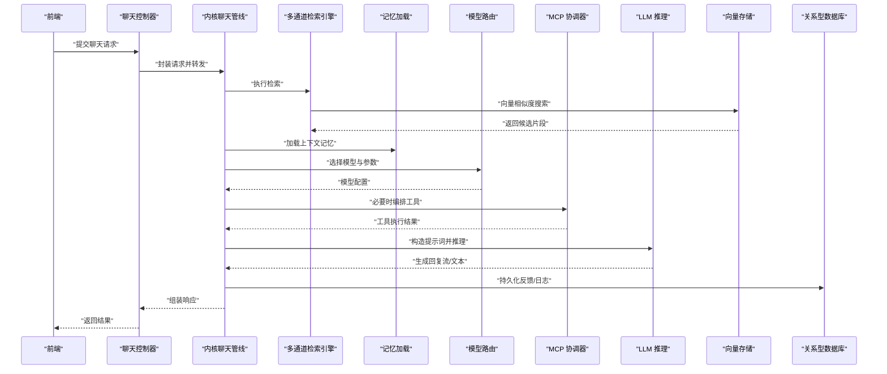
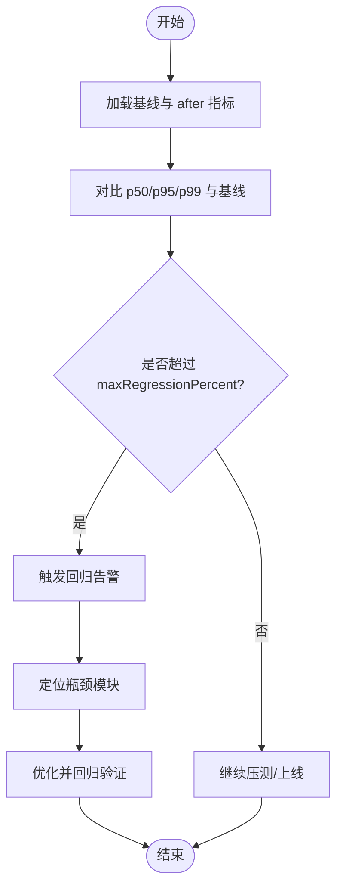
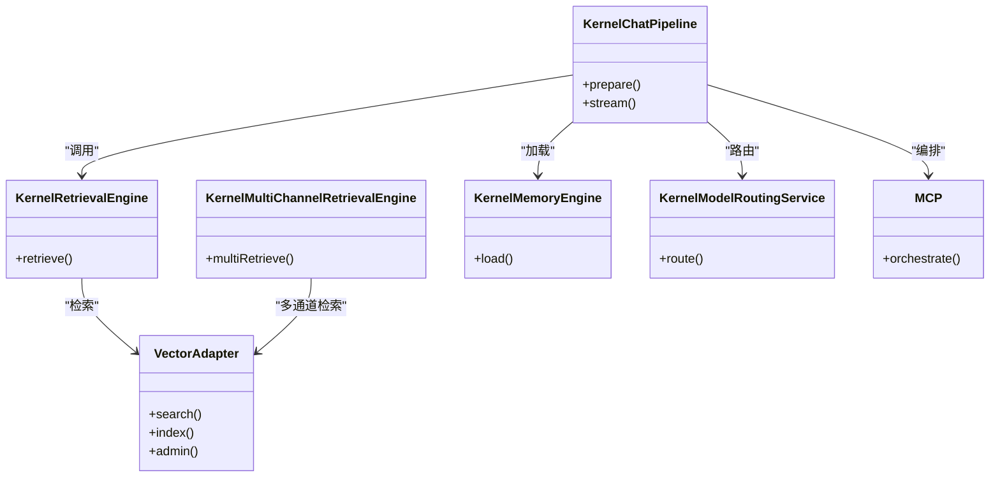
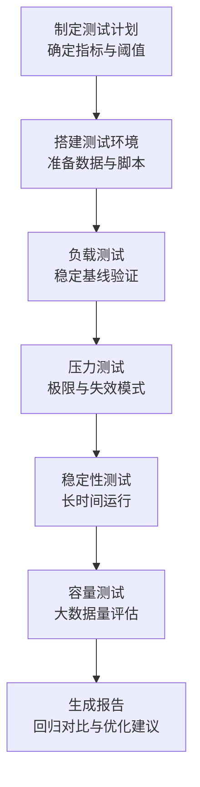
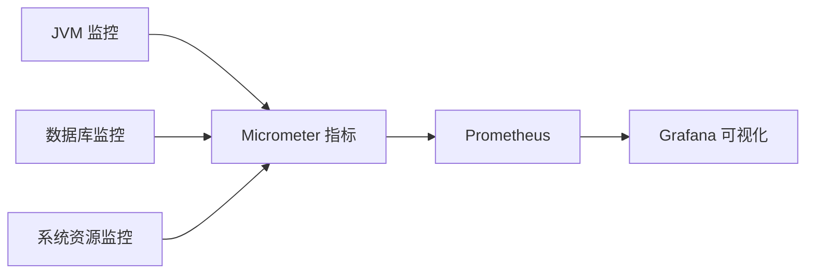
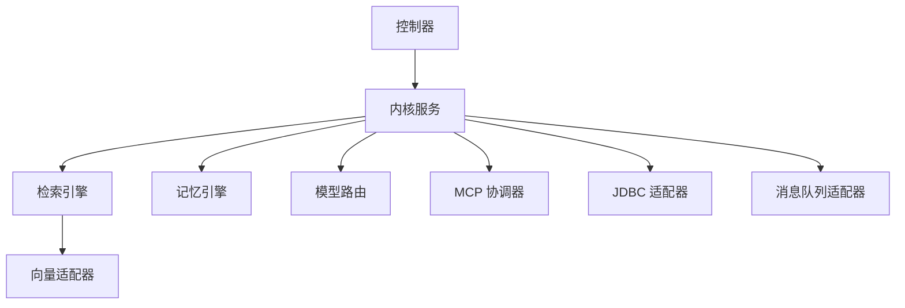

# 性能测试

<cite>
**本文引用的文件**
- [rag-baseline.json](file://docs/performance/rag-baseline.json)
- [rag-after-auth.json](file://docs/performance/rag-after-auth.json)
- [rag-after-bootstrap-native.json](file://docs/performance/rag-after-bootstrap-native.json)
- [rag-after-compat-extraction.json](file://docs/performance/rag-after-compat-extraction.json)
- [rag-after-crosscutting-ports.json](file://docs/performance/rag-after-crosscutting-ports.json)
- [rag-after-docs-api-release.json](file://docs/performance/rag-after-docs-api-release.json)
- [rag-after-document-source.json](file://docs/performance/rag-after-document-source.json)
- [rag-after-feishu-source.json](file://docs/performance/rag-after-feishu-source.json)
- [rag-after-legacy-runtime-boundary.json](file://docs/performance/rag-after-legacy-runtime-boundary.json)
- [rag-after-legacy-window-evaluation.json](file://docs/performance/rag-after-legacy-window-evaluation.json)
- [rag-after-mcp-server.json](file://docs/performance/rag-after-mcp-server.json)
- [rag-after-memory-governance.json](file://docs/performance/rag-after-memory-governance.json)
- [rag-after-module-split.json](file://docs/performance/rag-after-module-split.json)
- [rag-after-plugin-hardening.json](file://docs/performance/rag-after-plugin-hardening.json)
- [rag-after-plugin-state-management.json](file://docs/performance/rag-after-plugin-state-management.json)
- [rag-after-trace.json](file://docs/performance/rag-after-trace.json)
- [rag-after-wrapper-chain.json](file://docs/performance/rag-after-wrapper-chain.json)
</cite>

## 目录
1. [引言](#引言)
2. [项目结构](#项目结构)
3. [核心组件](#核心组件)
4. [架构总览](#架构总览)
5. [详细组件分析](#详细组件分析)
6. [依赖分析](#依赖分析)
7. [性能考虑](#性能考虑)
8. [故障排查指南](#故障排查指南)
9. [结论](#结论)
10. [附录](#附录)

## 引言
本文件面向 Seahorse Agent 项目的性能测试工作，系统性阐述性能测试的实施方法、测试指标定义、基准设计与演进、测试阶段划分（负载、压力、稳定性、容量）、工具使用建议（JMeter/Gatling/Locust），以及针对 RAG 关键瓶颈（向量检索、LLM 推理、数据库查询）的专项测试策略。文档以仓库内已提供的性能基线文件为依据，结合项目代码结构与模块职责，给出可操作的测试方案与优化建议。

## 项目结构
- 性能基线与阶段性指标集中于 docs/performance 目录，按“默认 RAG 场景”和“特定演进阶段”组织，覆盖从认证、引导、兼容抽取、横切端口、文档/API 收口、文档源、飞书源、遗留边界收敛、窗口评估、MCP 服务、内存治理、模块拆分、插件加固与状态管理、追踪、包装链等阶段的 after 指标占位数据。
- 项目后端采用多模块架构，包含适配器层（向量、缓存、消息队列、观察、存储、解析器、Feishu 文档源等）、内核层（应用服务、领域模型、特征与插件体系）与 Web 层（控制器）。这些模块共同构成 RAG 请求链路：认证 → 内核聊天管线 → 多通道检索 → MCP 协调 → 记忆加载 → 模型路由 → LLM 推理 → 向量检索/索引 → 数据库查询/写入 → 响应返回。

## 核心组件
- 性能基线与阶段性 after 指标
  - 默认场景与多阶段 after 文件均包含以下关键指标：
    - chatFirstTokenMs：首次令牌耗时
    - chatTotalMs：完整聊天耗时
    - retrievalTotalMs：单通道检索耗时
    - multiChannelRetrievalMs：多通道检索耗时
    - mcpOrchestrationMs：MCP 协调耗时
    - memoryLoadMs：记忆加载耗时
    - modelRoutingMs：模型路由耗时
    - ingestionDocumentMs：文档入库耗时
  - percentiles 提供 p50/p95/p99 分位数，用于评估尾延迟与稳定性。
  - maxRegressionPercent：允许的最大回归百分比，用于回归检测阈值。
  - initialSamples：初始样本集，记录典型场景（如仅知识库问答、带 MCP 的问答、文档入库）的占位指标，待稳定压测后替换为真实数据。

- 测试指标体系
  - 响应时间：首 Token 到达时间、完整请求完成时间、检索总耗时、多通道检索耗时、MCP 协调耗时、记忆加载耗时、模型路由耗时。
  - 吞吐量：每秒请求数（QPS），在不同并发级别下的稳定 QPS。
  - 并发处理能力：最大并发连接数、线程池/协程池饱和点、队列积压情况。
  - 错误率：HTTP 5xx/4xx、超时、业务异常（如检索失败、推理失败）。
  - 资源占用：CPU、内存、GC、网络 I/O、磁盘 I/O、数据库连接数与锁等待、向量库查询耗时与索引命中率。

**章节来源**
- [rag-baseline.json:1-53](file://docs/performance/rag-baseline.json#L1-L53)
- [rag-after-auth.json:1-53](file://docs/performance/rag-after-auth.json#L1-L53)
- [rag-after-bootstrap-native.json:1-53](file://docs/performance/rag-after-bootstrap-native.json#L1-L53)
- [rag-after-compat-extraction.json:1-53](file://docs/performance/rag-after-compat-extraction.json#L1-L53)
- [rag-after-crosscutting-ports.json:1-53](file://docs/performance/rag-after-crosscutting-ports.json#L1-L53)
- [rag-after-docs-api-release.json:1-53](file://docs/performance/rag-after-docs-api-release.json#L1-L53)
- [rag-after-document-source.json:1-53](file://docs/performance/rag-after-document-source.json#L1-L53)
- [rag-after-feishu-source.json:1-53](file://docs/performance/rag-after-feishu-source.json#L1-L53)
- [rag-after-legacy-runtime-boundary.json:1-53](file://docs/performance/rag-after-legacy-runtime-boundary.json#L1-L53)
- [rag-after-legacy-window-evaluation.json:1-53](file://docs/performance/rag-after-legacy-window-evaluation.json#L1-L53)
- [rag-after-mcp-server.json:1-53](file://docs/performance/rag-after-mcp-server.json#L1-L53)
- [rag-after-memory-governance.json:1-53](file://docs/performance/rag-after-memory-governance.json#L1-L53)
- [rag-after-module-split.json:1-53](file://docs/performance/rag-after-module-split.json#L1-L53)
- [rag-after-plugin-hardening.json:1-53](file://docs/performance/rag-after-plugin-hardening.json#L1-L53)
- [rag-after-plugin-state-management.json:1-53](file://docs/performance/rag-after-plugin-state-management.json#L1-L53)
- [rag-after-trace.json:1-53](file://docs/performance/rag-after-trace.json#L1-L53)
- [rag-after-wrapper-chain.json:1-53](file://docs/performance/rag-after-wrapper-chain.json#L1-L53)

## 架构总览
RAG 请求在后端的典型链路如下：
- 前端发起聊天请求，经控制器进入内核聊天管线。
- 内核根据会话与意图进行准备，触发多通道检索引擎。
- 检索结果经记忆加载与模型路由，选择合适的 LLM 推理路径。
- 若涉及 MCP 工具调用，由 MCP 协调器编排外部工具执行。
- 最终将生成内容通过 SSE 或 JSON 返回给前端。

## 详细组件分析

### 组件一：性能基线与阶段性 after 指标
- 设计要点
  - 以“默认 RAG 场景”为统一基线，各阶段 after 文件沿用相同指标命名与分位数结构，便于跨版本对比。
  - initialSamples 包含典型场景，便于快速定位瓶颈与回归。
  - maxRegressionPercent 作为回归阈值，避免性能退化被忽视。
- 使用建议
  - 在稳定环境下采集真实 after 数据，替换 initialSamples 占位值。
  - 对比不同阶段的 p50/p95/p99，关注尾延迟变化趋势。
  - 将指标纳入 CI 回归检测，自动报警异常波动。

**章节来源**
- [rag-baseline.json:1-53](file://docs/performance/rag-baseline.json#L1-L53)
- [rag-after-auth.json:1-53](file://docs/performance/rag-after-auth.json#L1-L53)
- [rag-after-bootstrap-native.json:1-53](file://docs/performance/rag-after-bootstrap-native.json#L1-L53)
- [rag-after-compat-extraction.json:1-53](file://docs/performance/rag-after-compat-extraction.json#L1-L53)
- [rag-after-crosscutting-ports.json:1-53](file://docs/performance/rag-after-crosscutting-ports.json#L1-L53)
- [rag-after-docs-api-release.json:1-53](file://docs/performance/rag-after-docs-api-release.json#L1-L53)
- [rag-after-document-source.json:1-53](file://docs/performance/rag-after-document-source.json#L1-L53)
- [rag-after-feishu-source.json:1-53](file://docs/performance/rag-after-feishu-source.json#L1-L53)
- [rag-after-legacy-runtime-boundary.json:1-53](file://docs/performance/rag-after-legacy-runtime-boundary.json#L1-L53)
- [rag-after-legacy-window-evaluation.json:1-53](file://docs/performance/rag-after-legacy-window-evaluation.json#L1-L53)
- [rag-after-mcp-server.json:1-53](file://docs/performance/rag-after-mcp-server.json#L1-L53)
- [rag-after-memory-governance.json:1-53](file://docs/performance/rag-after-memory-governance.json#L1-L53)
- [rag-after-module-split.json:1-53](file://docs/performance/rag-after-module-split.json#L1-L53)
- [rag-after-plugin-hardening.json:1-53](file://docs/performance/rag-after-plugin-hardening.json#L1-L53)
- [rag-after-plugin-state-management.json:1-53](file://docs/performance/rag-after-plugin-state-management.json#L1-L53)
- [rag-after-trace.json:1-53](file://docs/performance/rag-after-trace.json#L1-L53)
- [rag-after-wrapper-chain.json:1-53](file://docs/performance/rag-after-wrapper-chain.json#L1-L53)

### 组件二：RAG 关键性能瓶颈测试
- 向量检索性能
  - 指标：retrievalTotalMs、multiChannelRetrievalMs、向量库查询耗时、索引命中率、Top-K 取值对延迟的影响。
  - 测试方法：固定问题，逐步调整 Top-K、过滤条件、向量维度、索引类型（IVF/PQ/Flat），记录响应时间与吞吐。
  - 工具：JMeter（线程组并发）、Gatling（自定义体素/DSL）、Locust（脚本化用户行为）。
- LLM 推理性能
  - 指标：chatFirstTokenMs、chatTotalMs、模型路由耗时、流式输出首包延迟。
  - 测试方法：固定 prompt，切换模型参数（温度、最大生成长度、采样策略），观察首 Token 与总耗时。
  - 工具：JMeter（HTTP 请求+JSON 参数）、Locust（动态构造请求）、Gatling（高并发稳定压测）。
- 数据库查询性能
  - 指标：SQL 执行时间、连接池占用、锁等待、慢查询比例。
  - 测试方法：模拟高频写入（反馈、日志、消息出站事件）与读取（会话、知识库、意图树），观察延迟与错误率。
  - 工具：JMeter（JDBC 请求）、Gatling（自定义 JDBC 协议）、数据库自带性能分析工具。
- 记忆与缓存
  - 指标：memoryLoadMs、缓存命中率、分布式锁/信号量竞争。
  - 测试方法：高并发下触发记忆加载与更新，观察延迟与锁等待。
- MCP 协调
  - 指标：mcpOrchestrationMs、工具调用耗时、重试与超时。
  - 测试方法：构造复杂工具链路，评估协调器开销与失败恢复。

**章节来源**
- [rag-baseline.json:6-15](file://docs/performance/rag-baseline.json#L6-L15)
- [rag-after-auth.json:6-15](file://docs/performance/rag-after-auth.json#L6-L15)
- [rag-after-bootstrap-native.json:6-15](file://docs/performance/rag-after-bootstrap-native.json#L6-L15)
- [rag-after-compat-extraction.json:6-15](file://docs/performance/rag-after-compat-extraction.json#L6-L15)
- [rag-after-crosscutting-ports.json:6-15](file://docs/performance/rag-after-crosscutting-ports.json#L6-L15)
- [rag-after-docs-api-release.json:6-15](file://docs/performance/rag-after-docs-api-release.json#L6-L15)
- [rag-after-document-source.json:6-15](file://docs/performance/rag-after-document-source.json#L6-L15)
- [rag-after-feishu-source.json:6-15](file://docs/performance/rag-after-feishu-source.json#L6-L15)
- [rag-after-legacy-runtime-boundary.json:6-15](file://docs/performance/rag-after-legacy-runtime-boundary.json#L6-L15)
- [rag-after-legacy-window-evaluation.json:6-15](file://docs/performance/rag-after-legacy-window-evaluation.json#L6-L15)
- [rag-after-mcp-server.json:6-15](file://docs/performance/rag-after-mcp-server.json#L6-L15)
- [rag-after-memory-governance.json:6-15](file://docs/performance/rag-after-memory-governance.json#L6-L15)
- [rag-after-module-split.json:6-15](file://docs/performance/rag-after-module-split.json#L6-L15)
- [rag-after-plugin-hardening.json:6-15](file://docs/performance/rag-after-plugin-hardening.json#L6-L15)
- [rag-after-plugin-state-management.json:6-15](file://docs/performance/rag-after-plugin-state-management.json#L6-L15)
- [rag-after-trace.json:6-15](file://docs/performance/rag-after-trace.json#L6-L15)
- [rag-after-wrapper-chain.json:6-15](file://docs/performance/rag-after-wrapper-chain.json#L6-L15)

### 组件三：测试阶段与流程
- 负载测试（Load Testing）
  - 目标：在稳定基线上评估系统在预期峰值 QPS 下的响应时间、吞吐与错误率。
  - 方法：阶梯式提升并发或每秒请求数，记录 p50/p95/p99 与错误率。
- 压力测试（Stress Testing）
  - 目标：超出正常负载上限，观察系统极限与失效模式（超时、拒绝、级联失败）。
  - 方法：持续放大负载直至系统崩溃或 SLA 失败，记录崩溃点与恢复时间。
- 稳定性测试（Soak Testing）
  - 目标：长时间保持中高负载，发现内存泄漏、连接泄露、资源碎片等问题。
  - 方法：连续运行数小时至数天，监控 GC、堆内存、连接池、慢查询。
- 容量测试（Volume Testing）
  - 目标：大体量数据（文档、会话、知识库）对检索与写入的影响。
  - 方法：逐步增大知识库规模与并发，评估检索与入库耗时变化。

### 组件四：性能测试工具使用指南
- JMeter
  - 适用：通用 HTTP/数据库/JDBC 压测，易于上手。
  - 建议：使用 Thread Group 控制并发，CSV Data Set Config 提供输入，JSON Extractor 解析响应，聚合图查看 p50/p95。
- Gatling
  - 适用：高并发稳定压测，DSL 编写复杂场景，报告丰富。
  - 建议：使用 feeder 与自定义协议，记录自定义指标（如检索耗时、MCP 耗时），结合图表分析尾延迟。
- Locust
  - 适用：脚本化用户行为，灵活扩展，适合复杂交互。
  - 建议：编写用户任务（登录→检索→对话→反馈），统计响应时间分布与错误率。

注：本节为通用工具使用建议，具体脚本与配置需结合项目接口与数据准备进行定制。

### 组件五：性能监控与分析
- JVM 监控
  - 指标：堆内存使用、GC 次数与停顿、线程数、类加载数、JFR/Async Profiler 抽样。
  - 工具：JConsole/JVisualVM/JFR、Micrometer+Prometheus/Grafana。
- 数据库性能监控
  - 指标：慢查询、锁等待、连接池占用、缓冲池命中率、表扫描次数。
  - 工具：EXPLAIN/ANALYZE、慢查询日志、数据库性能视图。
- 系统资源监控
  - 指标：CPU 使用率、内存、磁盘 IO、网络带宽、上下文切换。
  - 工具：top/htop、iostat、netstat、SystemTap/BCC。
- 观测与指标
  - 项目提供 Micrometer 观测适配器，建议在压测中开启关键端点的指标导出，结合 Grafana 可视化。

**章节来源**
- [rag-baseline.json:16-32](file://docs/performance/rag-baseline.json#L16-L32)
- [rag-after-auth.json:16-32](file://docs/performance/rag-after-auth.json#L16-L32)
- [rag-after-bootstrap-native.json:16-32](file://docs/performance/rag-after-bootstrap-native.json#L16-L32)
- [rag-after-compat-extraction.json:16-32](file://docs/performance/rag-after-compat-extraction.json#L16-L32)
- [rag-after-crosscutting-ports.json:16-32](file://docs/performance/rag-after-crosscutting-ports.json#L16-L32)
- [rag-after-docs-api-release.json:16-32](file://docs/performance/rag-after-docs-api-release.json#L16-L32)
- [rag-after-document-source.json:16-32](file://docs/performance/rag-after-document-source.json#L16-L32)
- [rag-after-feishu-source.json:16-32](file://docs/performance/rag-after-feishu-source.json#L16-L32)
- [rag-after-legacy-runtime-boundary.json:16-32](file://docs/performance/rag-after-legacy-runtime-boundary.json#L16-L32)
- [rag-after-legacy-window-evaluation.json:16-32](file://docs/performance/rag-after-legacy-window-evaluation.json#L16-L32)
- [rag-after-mcp-server.json:16-32](file://docs/performance/rag-after-mcp-server.json#L16-L32)
- [rag-after-memory-governance.json:16-32](file://docs/performance/rag-after-memory-governance.json#L16-L32)
- [rag-after-module-split.json:16-32](file://docs/performance/rag-after-module-split.json#L16-L32)
- [rag-after-plugin-hardening.json:16-32](file://docs/performance/rag-after-plugin-hardening.json#L16-L32)
- [rag-after-plugin-state-management.json:16-32](file://docs/performance/rag-after-plugin-state-management.json#L16-L32)
- [rag-after-trace.json:16-32](file://docs/performance/rag-after-trace.json#L16-L32)
- [rag-after-wrapper-chain.json:16-32](file://docs/performance/rag-after-wrapper-chain.json#L16-L32)

## 依赖分析
- 指标耦合关系
  - chatTotalMs 通常受 retrievalTotalMs、mcpOrchestrationMs、memoryLoadMs、modelRoutingMs 影响。
  - multiChannelRetrievalMs 与向量库性能强相关，直接影响整体响应时间。
- 模块依赖
  - 控制器依赖内核服务；内核服务依赖检索、记忆、模型路由、MCP、数据库与消息队列适配器。
  - 向量适配器与数据库适配器是 RAG 的关键 IO 瓶颈。

## 性能考虑
- 优化方向
  - 向量检索：合理设置索引参数、Top-K、过滤条件；缓存热点检索结果；多通道并行与合并策略。
  - LLM 推理：模型量化/蒸馏、批处理、流式输出优化、预热与连接池管理。
  - 数据库：慢查询优化、连接池参数、只读分离、批量写入、索引与分区。
  - 记忆与缓存：LRU/LFU 策略、分布式锁粒度、信号量限制、缓存预热。
  - MCP：异步编排、超时与重试、工具调用去抖动。
- 最佳实践
  - 在 CI 中集成回归测试，基于基线文件自动对比 p50/p95/p99。
  - 压测前先做预热，排除冷启动影响。
  - 分层压测：先单模块，再端到端，最后多模块组合。
  - 严格区分“稳定环境”与“生产环境”，确保基线数据可复现。

## 故障排查指南
- 常见问题
  - 响应时间尾部严重倾斜：检查向量检索 Top-K、过滤条件与索引参数。
  - QPS 波动大：排查数据库连接池、缓存命中率、MCP 工具调用超时。
  - 偶发 5xx：检查限流/熔断、线程池饱和、队列积压。
- 排查步骤
  - 采集 JVM、数据库、系统资源与 Micrometer 指标。
  - 结合压测脚本日志与后端访问日志，定位慢请求。
  - 逐步降噪：关闭非关键功能（如追踪、观测），缩小范围。
  - 回归验证：修复后在稳定环境重复基线对比。

**章节来源**
- [rag-baseline.json:5](file://docs/performance/rag-baseline.json#L5)
- [rag-after-auth.json:5](file://docs/performance/rag-after-auth.json#L5)
- [rag-after-bootstrap-native.json:5](file://docs/performance/rag-after-bootstrap-native.json#L5)
- [rag-after-compat-extraction.json:5](file://docs/performance/rag-after-compat-extraction.json#L5)
- [rag-after-crosscutting-ports.json:5](file://docs/performance/rag-after-crosscutting-ports.json#L5)
- [rag-after-docs-api-release.json:5](file://docs/performance/rag-after-docs-api-release.json#L5)
- [rag-after-document-source.json:5](file://docs/performance/rag-after-document-source.json#L5)
- [rag-after-feishu-source.json:5](file://docs/performance/rag-after-feishu-source.json#L5)
- [rag-after-legacy-runtime-boundary.json:5](file://docs/performance/rag-after-legacy-runtime-boundary.json#L5)
- [rag-after-legacy-window-evaluation.json:5](file://docs/performance/rag-after-legacy-window-evaluation.json#L5)
- [rag-after-mcp-server.json:5](file://docs/performance/rag-after-mcp-server.json#L5)
- [rag-after-memory-governance.json:5](file://docs/performance/rag-after-memory-governance.json#L5)
- [rag-after-module-split.json:5](file://docs/performance/rag-after-module-split.json#L5)
- [rag-after-plugin-hardening.json:5](file://docs/performance/rag-after-plugin-hardening.json#L5)
- [rag-after-plugin-state-management.json:5](file://docs/performance/rag-after-plugin-state-management.json#L5)
- [rag-after-trace.json:5](file://docs/performance/rag-after-trace.json#L5)
- [rag-after-wrapper-chain.json:5](file://docs/performance/rag-after-wrapper-chain.json#L5)

## 结论
通过以性能基线文件为核心的指标体系与阶段性 after 数据，结合分阶段的负载/压力/稳定性/容量测试，配合 JVM、数据库与系统资源的综合监控，可以系统性地识别与优化 Seahorse Agent 的性能瓶颈。建议在 CI 中固化回归测试，持续跟踪 p50/p95/p99 与错误率，确保每次演进不引入性能回归。

## 附录
- 基线文件清单（按阶段）
  - 默认基线：[rag-baseline.json](file://docs/performance/rag-baseline.json)
  - 认证阶段 after：[rag-after-auth.json](file://docs/performance/rag-after-auth.json)
  - 原生引导阶段 after：[rag-after-bootstrap-native.json](file://docs/performance/rag-after-bootstrap-native.json)
  - 兼容抽取阶段 after：[rag-after-compat-extraction.json](file://docs/performance/rag-after-compat-extraction.json)
  - 横切端口阶段 after：[rag-after-crosscutting-ports.json](file://docs/performance/rag-after-crosscutting-ports.json)
  - 文档/API 收口阶段 after：[rag-after-docs-api-release.json](file://docs/performance/rag-after-docs-api-release.json)
  - 文档源阶段 after：[rag-after-document-source.json](file://docs/performance/rag-after-document-source.json)
  - 飞书源阶段 after：[rag-after-feishu-source.json](file://docs/performance/rag-after-feishu-source.json)
  - 遗留边界收敛阶段 after：[rag-after-legacy-runtime-boundary.json](file://docs/performance/rag-after-legacy-runtime-boundary.json)
  - 遗留窗口评估阶段 after：[rag-after-legacy-window-evaluation.json](file://docs/performance/rag-after-legacy-window-evaluation.json)
  - MCP 服务阶段 after：[rag-after-mcp-server.json](file://docs/performance/rag-after-mcp-server.json)
  - 内存治理阶段 after：[rag-after-memory-governance.json](file://docs/performance/rag-after-memory-governance.json)
  - 模块拆分阶段 after：[rag-after-module-split.json](file://docs/performance/rag-after-module-split.json)
  - 插件加固阶段 after：[rag-after-plugin-hardening.json](file://docs/performance/rag-after-plugin-hardening.json)
  - 插件状态管理阶段 after：[rag-after-plugin-state-management.json](file://docs/performance/rag-after-plugin-state-management.json)
  - 追踪阶段 after：[rag-after-trace.json](file://docs/performance/rag-after-trace.json)
  - 包装链阶段 after：[rag-after-wrapper-chain.json](file://docs/performance/rag-after-wrapper-chain.json)