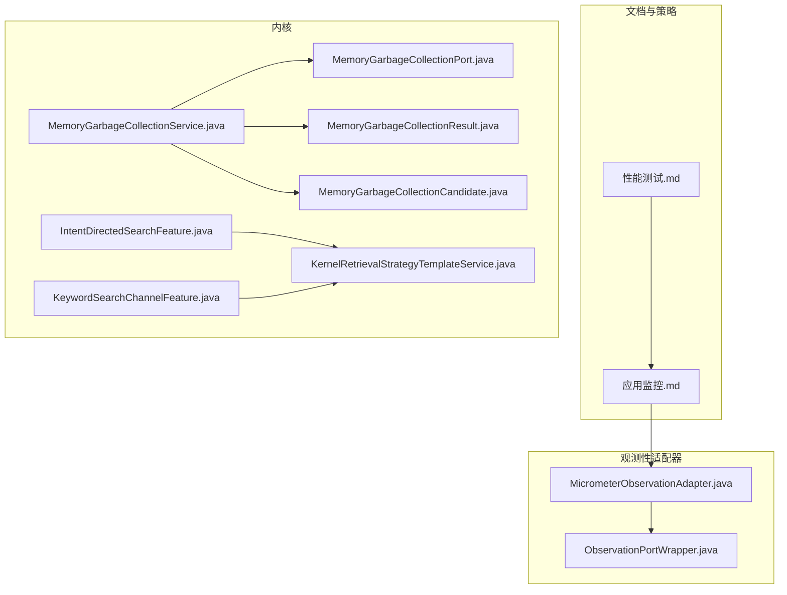
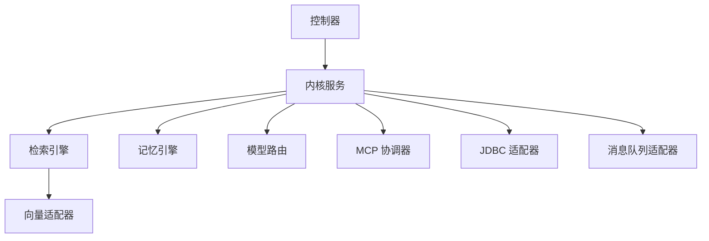
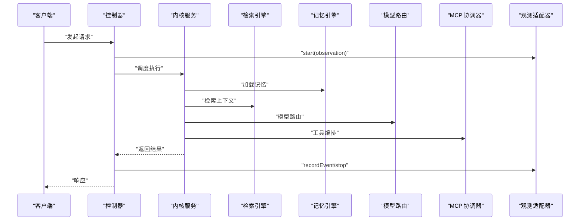
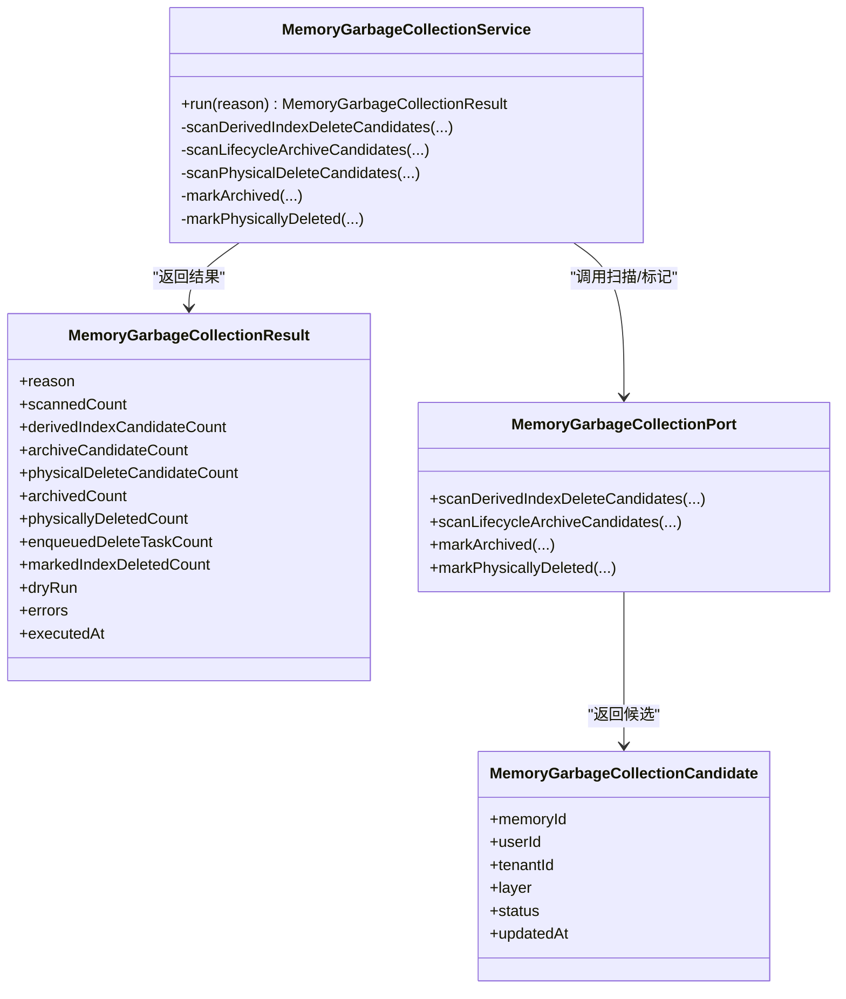
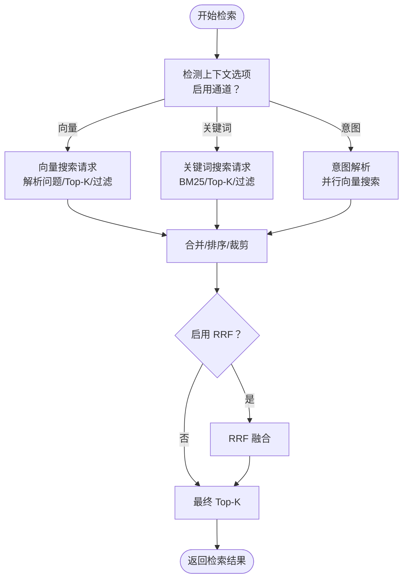
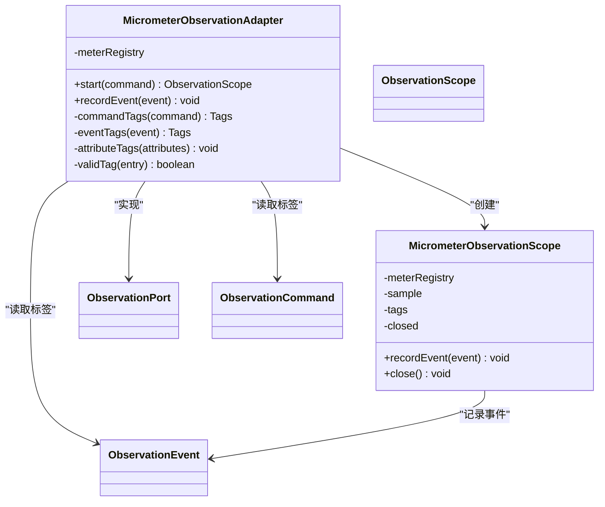

# 性能测试

<cite>
**本文引用的文件**
- [性能测试.md](file://docs/zh/content/测试策略/性能测试.md)
- [应用监控.md](file://docs/zh/content/监控运维/应用监控.md)
- [MicrometerObservationAdapter.java](file://seahorse-agent-adapter-observation-micrometer/src/main/java/com/miracle/ai/seahorse/agent/adapters/observation/micrometer/MicrometerObservationAdapter.java)
- [ObservationPortWrapper.java](file://seahorse-agent-kernel/src/main/java/com/miracle/ai/seahorse/agent/kernel/plugin/wrapper/ObservationPortWrapper.java)
- [MemoryGarbageCollectionService.java](file://seahorse-agent-kernel/src/main/java/com/miracle/ai/seahorse/agent/kernel/application/memory/maintenance/MemoryGarbageCollectionService.java)
- [MemoryGarbageCollectionResult.java](file://seahorse-agent-kernel/src/main/java/com/miracle/ai/seahorse/agent/ports/outbound/memory/MemoryGarbageCollectionResult.java)
- [MemoryGarbageCollectionPort.java](file://seahorse-agent-kernel/src/main/java/com/miracle/ai/seahorse/agent/ports/outbound/memory/MemoryGarbageCollectionPort.java)
- [MemoryGarbageCollectionCandidate.java](file://seahorse-agent-kernel/src/main/java/com/miracle/ai/seahorse/agent/ports/outbound/memory/MemoryGarbageCollectionCandidate.java)
- [IntentDirectedSearchFeature.java](file://seahorse-agent-kernel/src/main/java/com/miracle/ai/seahorse/agent/kernel/feature/retrieval/IntentDirectedSearchFeature.java)
- [KeywordSearchChannelFeature.java](file://seahorse-agent-kernel/src/main/java/com/miracle/ai/seahorse/agent/kernel/feature/retrieval/KeywordSearchChannelFeature.java)
- [KernelRetrievalStrategyTemplateService.java](file://seahorse-agent-kernel/src/main/java/com/miracle/ai/seahorse/agent/kernel/application/retrieval/KernelRetrievalStrategyTemplateService.java)
- [KernelRetrievalEvaluationServiceTests.java](file://seahorse-agent-tests/src/test/java/com/miracle/ai/seahorse/agent/kernel/application/retrieval/KernelRetrievalEvaluationServiceTests.java)
- [IntentDirectedSearchFeatureTests.java](file://seahorse-agent-tests/src/test/java/com/miracle/ai/seahorse/agent/kernel/feature/retrieval/IntentDirectedSearchFeatureTests.java)
- [SeahorseWebApiContractTests.java](file://seahorse-agent-tests/src/test/java/com/miracle/ai/seahorse/agent/adapters/web/SeahorseWebApiContractTests.java)
- [DefaultMemoryMaintenanceServiceTests.java](file://seahorse-agent-tests/src/test/java/com/miracle/ai/seahorse/agent/kernel/application/memory/maintenance/DefaultMemoryMaintenanceServiceTests.java)
- [micrometer 观测适配器实现](file://docs/zh/content/监控运维/应用监控.md)
</cite>

## 目录
1. [简介](#简介)
2. [项目结构](#项目结构)
3. [核心组件](#核心组件)
4. [架构总览](#架构总览)
5. [详细组件分析](#详细组件分析)
6. [依赖分析](#依赖分析)
7. [性能考虑](#性能考虑)
8. [故障排查指南](#故障排查指南)
9. [结论](#结论)
10. [附录](#附录)

## 简介
本文件面向 Seahorse Agent 的性能测试工作，围绕 RAG 系统性能基准、内存处理性能基准、检索性能基准展开，配套提出负载测试、压力测试、稳定性测试与容量测试的策略与流程，并给出内存性能测试（记忆聚合、垃圾回收、内存泄漏检测）与检索性能测试（向量搜索、关键词搜索、混合检索）的具体方法。同时，文档总结了性能监控与分析方法、指标收集与瓶颈识别路径，以及性能测试工具与自动化执行流程的建议。

## 项目结构
- 文档与测试策略集中在 docs/zh/content/测试策略/性能测试.md，定义了性能指标体系、测试阶段与流程、依赖关系与优化建议。
- 监控与观测性能力由 seahorse-agent-adapter-observation-micrometer 提供，配合内核包装器实现统一观测端口。
- 内存维护与垃圾回收能力位于 seahorse-agent-kernel，包含 GC 执行、候选扫描、结果聚合等。
- 检索能力由内核检索特性与策略模板组成，支持意图驱动、关键词 BM25、向量搜索与 RRF 融合等通道。

**图表来源**
- [性能测试.md](file://docs/zh/content/测试策略/性能测试.md)
- [应用监控.md](file://docs/zh/content/监控运维/应用监控.md)
- [MicrometerObservationAdapter.java](file://seahorse-agent-adapter-observation-micrometer/src/main/java/com/miracle/ai/seahorse/agent/adapters/observation/micrometer/MicrometerObservationAdapter.java)
- [ObservationPortWrapper.java](file://seahorse-agent-kernel/src/main/java/com/miracle/ai/seahorse/agent/kernel/plugin/wrapper/ObservationPortWrapper.java)
- [MemoryGarbageCollectionService.java](file://seahorse-agent-kernel/src/main/java/com/miracle/ai/seahorse/agent/kernel/application/memory/maintenance/MemoryGarbageCollectionService.java)
- [MemoryGarbageCollectionResult.java](file://seahorse-agent-kernel/src/main/java/com/miracle/ai/seahorse/agent/ports/outbound/memory/MemoryGarbageCollectionResult.java)
- [MemoryGarbageCollectionPort.java](file://seahorse-agent-kernel/src/main/java/com/miracle/ai/seahorse/agent/ports/outbound/memory/MemoryGarbageCollectionPort.java)
- [MemoryGarbageCollectionCandidate.java](file://seahorse-agent-kernel/src/main/java/com/miracle/ai/seahorse/agent/ports/outbound/memory/MemoryGarbageCollectionCandidate.java)
- [IntentDirectedSearchFeature.java](file://seahorse-agent-kernel/src/main/java/com/miracle/ai/seahorse/agent/kernel/feature/retrieval/IntentDirectedSearchFeature.java)
- [KeywordSearchChannelFeature.java](file://seahorse-agent-kernel/src/main/java/com/miracle/ai/seahorse/agent/kernel/feature/retrieval/KeywordSearchChannelFeature.java)
- [KernelRetrievalStrategyTemplateService.java](file://seahorse-agent-kernel/src/main/java/com/miracle/ai/seahorse/agent/kernel/application/retrieval/KernelRetrievalStrategyTemplateService.java)

**章节来源**
- [性能测试.md](file://docs/zh/content/测试策略/性能测试.md)
- [应用监控.md](file://docs/zh/content/监控运维/应用监控.md)

## 核心组件
- 性能基线与阶段性 after 指标
  - 包含 chatFirstTokenMs、chatTotalMs、retrievalTotalMs、multiChannelRetrievalMs、mcpOrchestrationMs、memoryLoadMs、modelRoutingMs、ingestionDocumentMs 等关键指标，提供 p50/p95/p99 分位数与最大回归阈值，支撑回归检测与稳定性评估。
- 测试指标体系
  - 响应时间：首 Token 到达时间、完整请求完成时间、检索总耗时、多通道检索耗时、MCP 协调耗时、记忆加载耗时、模型路由耗时。
  - 吞吐量：每秒请求数（QPS），在不同并发级别下的稳定 QPS。
  - 并发处理能力：最大并发连接数、线程池/协程池饱和点、队列积压情况。
  - 错误率：HTTP 5xx/4xx、超时、业务异常（如检索失败、推理失败）。
  - 资源占用：CPU、内存、GC、网络 I/O、磁盘 I/O、数据库连接数与锁等待、向量库查询耗时与索引命中率。
- 测试阶段与流程
  - 负载测试：阶梯式提升并发或 QPS，记录 p50/p95/p99 与错误率。
  - 压力测试：持续放大负载直至系统崩溃或 SLA 失败，记录崩溃点与恢复时间。
  - 稳定性测试：长时间保持中高负载，监控 GC、堆内存、连接池、慢查询。
  - 容量测试：逐步增大知识库规模与并发，评估检索与入库耗时变化。

**章节来源**
- [性能测试.md](file://docs/zh/content/测试策略/性能测试.md)

## 架构总览
性能测试覆盖端到端 RAG 流程，关键路径包括：控制器 → 内核服务 → 检索引擎（向量/关键词/意图）→ 记忆引擎 → 模型路由 → MCP 协调器 → 数据库/JDBC 适配器/消息队列适配器。向量适配器与数据库适配器是 RAG 的关键 IO 瓶颈。

**图表来源**
- [性能测试.md](file://docs/zh/content/测试策略/性能测试.md)

**章节来源**
- [性能测试.md](file://docs/zh/content/测试策略/性能测试.md)

## 详细组件分析

### RAG 系统性能基准
- 指标定义与基线
  - chatFirstTokenMs、chatTotalMs、retrievalTotalMs、multiChannelRetrievalMs、mcpOrchestrationMs、memoryLoadMs、modelRoutingMs、ingestionDocumentMs。
  - 分位数与回归阈值用于回归检测与稳定性评估。
- 基准数据来源
  - 多阶段 after 文件（如 rag-after-*.json）记录各演进阶段的性能表现，便于对比与回归检测。
- 端到端流程
  - 控制器接收请求，内核服务协调检索、记忆、模型路由与 MCP，最终返回响应；观测适配器记录关键耗时与事件。

**图表来源**
- [性能测试.md](file://docs/zh/content/测试策略/性能测试.md)
- [应用监控.md](file://docs/zh/content/监控运维/应用监控.md)

**章节来源**
- [性能测试.md](file://docs/zh/content/测试策略/性能测试.md)
- [应用监控.md](file://docs/zh/content/监控运维/应用监控.md)

### 内存处理性能基准与内存性能测试
- 记忆聚合与垃圾回收
  - MemoryGarbageCollectionService 扫描衍生索引删除候选、生命周期归档候选与物理删除候选，执行标记归档与物理删除，并返回执行结果与错误列表。
  - MemoryGarbageCollectionResult 记录扫描数、候选数、执行数、错误列表与执行时间等。
  - MemoryGarbageCollectionPort 定义扫描接口，支持按保留期、闲置保留期、分数阈值与限制数进行扫描。
  - MemoryGarbageCollectionCandidate 表示候选实体的基本属性。
- 内存泄漏检测
  - 通过稳定性测试（长时间高负载）与 GC 监控（堆内存、GC 次数与耗时、连接池状态）识别潜在泄漏与资源碎片。
- 测试要点
  - 回归基线：记录 memoryLoadMs、mcpOrchestrationMs、multiChannelRetrievalMs 等与内存相关的分位数。
  - GC 行为：关注 markArchived/markPhysicallyDeleted 的成功率与错误率，避免异常回退导致的重复扫描。

**图表来源**
- [MemoryGarbageCollectionService.java](file://seahorse-agent-kernel/src/main/java/com/miracle/ai/seahorse/agent/kernel/application/memory/maintenance/MemoryGarbageCollectionService.java)
- [MemoryGarbageCollectionResult.java](file://seahorse-agent-kernel/src/main/java/com/miracle/ai/seahorse/agent/ports/outbound/memory/MemoryGarbageCollectionResult.java)
- [MemoryGarbageCollectionPort.java](file://seahorse-agent-kernel/src/main/java/com/miracle/ai/seahorse/agent/ports/outbound/memory/MemoryGarbageCollectionPort.java)
- [MemoryGarbageCollectionCandidate.java](file://seahorse-agent-kernel/src/main/java/com/miracle/ai/seahorse/agent/ports/outbound/memory/MemoryGarbageCollectionCandidate.java)

**章节来源**
- [MemoryGarbageCollectionService.java](file://seahorse-agent-kernel/src/main/java/com/miracle/ai/seahorse/agent/kernel/application/memory/maintenance/MemoryGarbageCollectionService.java)
- [MemoryGarbageCollectionResult.java](file://seahorse-agent-kernel/src/main/java/com/miracle/ai/seahorse/agent/ports/outbound/memory/MemoryGarbageCollectionResult.java)
- [MemoryGarbageCollectionPort.java](file://seahorse-agent-kernel/src/main/java/com/miracle/ai/seahorse/agent/ports/outbound/memory/MemoryGarbageCollectionPort.java)
- [MemoryGarbageCollectionCandidate.java](file://seahorse-agent-kernel/src/main/java/com/miracle/ai/seahorse/agent/ports/outbound/memory/MemoryGarbageCollectionCandidate.java)

### 检索性能基准与检索性能测试
- 检索通道与策略
  - 意图驱动检索（IntentDirectedSearchFeature）：基于 KB 意图集合并行向量搜索，按意图分数排序与合并，支持 Top-K 动态调整。
  - 关键词检索（KeywordSearchChannelFeature）：BM25 关键词搜索，支持过滤条件与 Top-K。
  - 混合检索策略（KernelRetrievalStrategyTemplateService）：同时启用向量、意图与关键词通道，并通过 RRF 进行通道融合与权重配置。
- 性能测试方法
  - 向量搜索性能：记录单通道检索耗时与多通道检索耗时，评估 Top-K、过滤条件与索引参数对延迟与命中率的影响。
  - 关键词搜索性能：评估 BM25 参数与过滤条件对检索耗时与结果质量的影响。
  - 混合检索性能：比较不同通道权重与融合策略（RRF）对响应时间与召回精度的影响。
- 测试用例参考
  - KernelRetrievalEvaluationServiceTests：对比不同检索策略并选择优胜者，评估互惠倒数秩、平均精度等指标。
  - IntentDirectedSearchFeatureTests：验证意图失败时的降级行为与请求分发。
  - SeahorseWebApiContractTests：验证检索结果的命中率、噪声率与检索 ID 列表等契约。

**图表来源**
- [IntentDirectedSearchFeature.java](file://seahorse-agent-kernel/src/main/java/com/miracle/ai/seahorse/agent/kernel/feature/retrieval/IntentDirectedSearchFeature.java)
- [KeywordSearchChannelFeature.java](file://seahorse-agent-kernel/src/main/java/com/miracle/ai/seahorse/agent/kernel/feature/retrieval/KeywordSearchChannelFeature.java)
- [KernelRetrievalStrategyTemplateService.java](file://seahorse-agent-kernel/src/main/java/com/miracle/ai/seahorse/agent/kernel/application/retrieval/KernelRetrievalStrategyTemplateService.java)

**章节来源**
- [IntentDirectedSearchFeature.java](file://seahorse-agent-kernel/src/main/java/com/miracle/ai/seahorse/agent/kernel/feature/retrieval/IntentDirectedSearchFeature.java)
- [KeywordSearchChannelFeature.java](file://seahorse-agent-kernel/src/main/java/com/miracle/ai/seahorse/agent/kernel/feature/retrieval/KeywordSearchChannelFeature.java)
- [KernelRetrievalStrategyTemplateService.java](file://seahorse-agent-kernel/src/main/java/com/miracle/ai/seahorse/agent/kernel/application/retrieval/KernelRetrievalStrategyTemplateService.java)
- [KernelRetrievalEvaluationServiceTests.java](file://seahorse-agent-tests/src/test/java/com/miracle/ai/seahorse/agent/kernel/application/retrieval/KernelRetrievalEvaluationServiceTests.java)
- [IntentDirectedSearchFeatureTests.java](file://seahorse-agent-tests/src/test/java/com/miracle/ai/seahorse/agent/kernel/feature/retrieval/IntentDirectedSearchFeatureTests.java)
- [SeahorseWebApiContractTests.java](file://seahorse-agent-tests/src/test/java/com/miracle/ai/seahorse/agent/adapters/web/SeahorseWebApiContractTests.java)

### 性能监控与分析方法
- 观测适配器与生命周期
  - MicrometerObservationAdapter 提供 start/recordEvent/close 生命周期，统一从命令与事件 attributes 中提取标签，生成持续时间指标与事件计数指标。
  - ObservationPortWrapper 将观测端口注入到内核包装器链中，确保在关键入口与子步骤中记录指标。
- 指标命名与标签
  - 指标前缀：seahorse.agent.observation；持续时间 duration、事件计数 events。
  - 标签维度：observation（观测名称）、tenant（租户标识）、event（事件名称）、attributes（属性键值）。
- 分析与优化
  - 通过 p50/p95/p99 与错误率趋势识别瓶颈；结合资源占用（CPU/GC/IO/DB 连接）定位 IO 密集型模块（向量/数据库）。
  - 控制标签基数，避免高基数动态键；在高频事件场景下考虑应用侧聚合上报。

**图表来源**
- [MicrometerObservationAdapter.java](file://seahorse-agent-adapter-observation-micrometer/src/main/java/com/miracle/ai/seahorse/agent/adapters/observation/micrometer/MicrometerObservationAdapter.java)
- [ObservationPortWrapper.java](file://seahorse-agent-kernel/src/main/java/com/miracle/ai/seahorse/agent/kernel/plugin/wrapper/ObservationPortWrapper.java)

**章节来源**
- [应用监控.md](file://docs/zh/content/监控运维/应用监控.md)
- [micrometer 观测适配器实现](file://docs/zh/content/监控运维/应用监控.md)

## 依赖分析
- 指标耦合关系
  - chatTotalMs 通常受 retrievalTotalMs、mcpOrchestrationMs、memoryLoadMs、modelRoutingMs 影响。
  - multiChannelRetrievalMs 与向量库性能强相关，直接影响整体响应时间。
- 模块依赖
  - 控制器依赖内核服务；内核服务依赖检索、记忆、模型路由、MCP、数据库与消息队列适配器。
  - 向量适配器与数据库适配器是 RAG 的关键 IO 瓶颈。

**图表来源**
- [性能测试.md](file://docs/zh/content/测试策略/性能测试.md)

**章节来源**
- [性能测试.md](file://docs/zh/content/测试策略/性能测试.md)

## 性能考虑
- 优化方向
  - 向量检索：合理设置索引参数、Top-K、过滤条件；缓存热点检索结果；多通道并行与合并策略。
  - LLM 推理：模型量化/蒸馏、批处理、流式输出优化、预热与连接池管理。
  - 数据库：慢查询优化、连接池参数、只读分离、批量写入、索引与分区。
  - 记忆与缓存：LRU/LFU 策略、分布式锁粒度、信号量限制、缓存预热。
  - MCP：异步编排、超时与重试、工具调用去抖动。
- 最佳实践
  - 在 CI 中集成回归测试，基于基线文件自动对比 p50/p95/p99。
  - 压测前先做预热，排除冷启动影响。
  - 分层压测：先单模块，再端到端，最后多模块组合。
  - 严格区分“稳定环境”与“生产环境”，确保基线数据可复现。

**章节来源**
- [性能测试.md](file://docs/zh/content/测试策略/性能测试.md)

## 故障排查指南
- 观测指标缺失
  - 确认 ObservationPort 已被 Micrometer 实现替换，且 MeterRegistry 注入成功。
- 标签异常
  - 检查 attributes 是否包含空键或空值，适配器会对无效条目进行过滤。
- 事件未统计
  - 确认 recordEvent 调用发生在作用域内或独立调用均有效。
- 耗时指标为零
  - 检查是否正确调用 scope.close()，以及 Timer.start 是否在 start 中调用。
- 内存 GC 异常
  - 关注 MemoryGarbageCollectionResult 的错误列表与执行时间，定位 markArchived/markPhysicallyDeleted 的失败原因。

**章节来源**
- [应用监控.md](file://docs/zh/content/监控运维/应用监控.md)
- [MemoryGarbageCollectionService.java](file://seahorse-agent-kernel/src/main/java/com/miracle/ai/seahorse/agent/kernel/application/memory/maintenance/MemoryGarbageCollectionService.java)

## 结论
通过明确的性能指标体系、分阶段的测试流程与可观测性支撑，Seahorse Agent 的性能测试能够在不同层面（RAG、内存、检索）系统性地评估与优化系统表现。建议在持续集成中固化基线对比与回归检测，并结合资源监控与瓶颈分析，形成闭环的性能治理流程。

## 附录
- 指标命名规范与标签体系设计
  - 指标前缀：seahorse.agent.observation；持续时间 duration、事件计数 events。
  - 标签体系：observation（观测名称）、tenant（租户标识）、event（事件名称）、attributes（属性键值）。
  - 最佳实践：控制标签基数，避免高基数动态键；事件命名采用“动作-对象-结果”结构；在作用域内记录关键子步骤事件，统一在关闭时生成耗时指标。
- 外部监控系统集成方案
  - Prometheus：使用 Micrometer 提供的 Prometheus Registry，通过 HTTP 暴露指标端点，Prometheus 抓取。
  - InfluxDB：使用 Micrometer 的 InfluxMeterRegistry，配置 InfluxDB 端点与认证，自动上报指标。
  - CloudWatch：使用 Micrometer 的 CloudWatchMeterRegistry，配置区域与凭证，按维度上报指标。
  - 其他：可引入相应 Micrometer Registry 实现，统一通过 MeterRegistry 注入与适配器对接。

**章节来源**
- [应用监控.md](file://docs/zh/content/监控运维/应用监控.md)