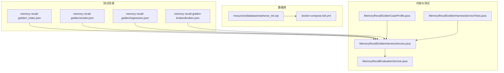
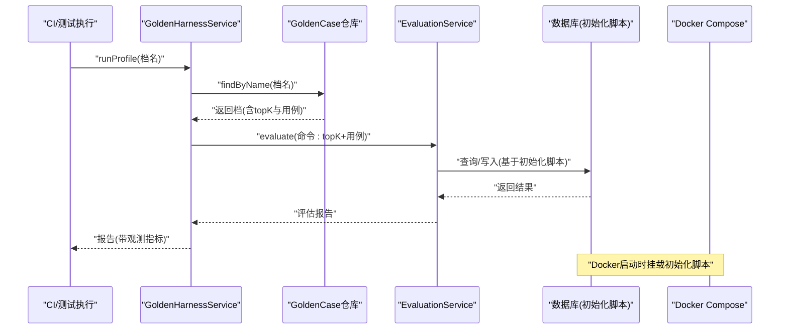
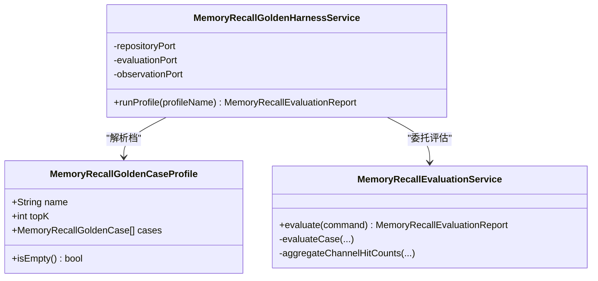
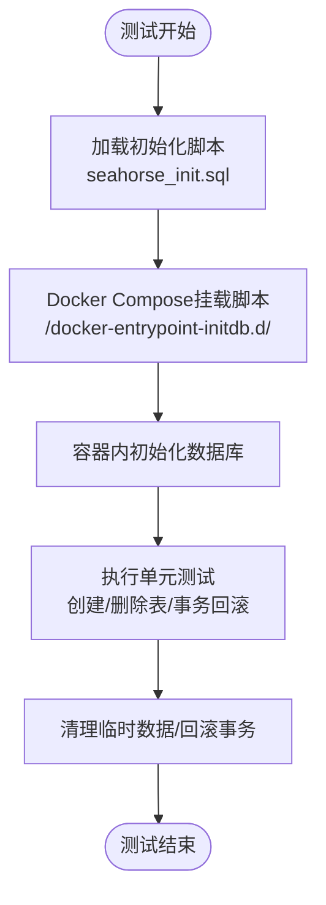
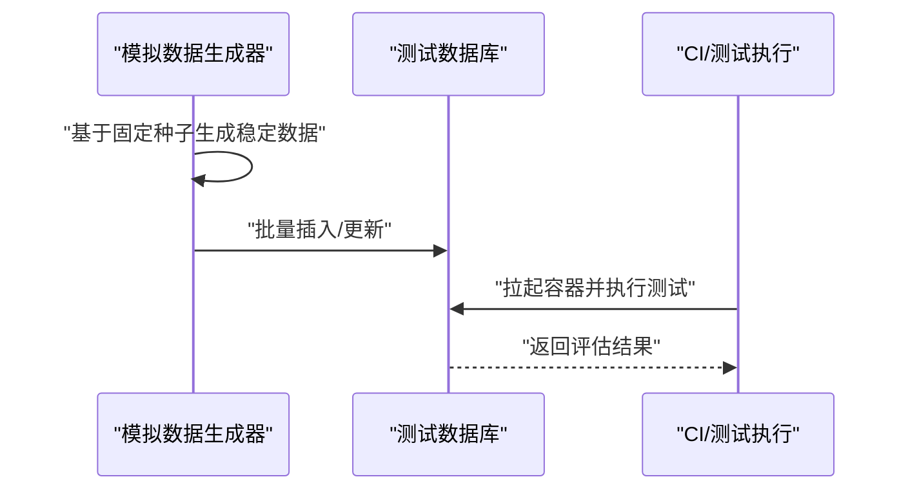
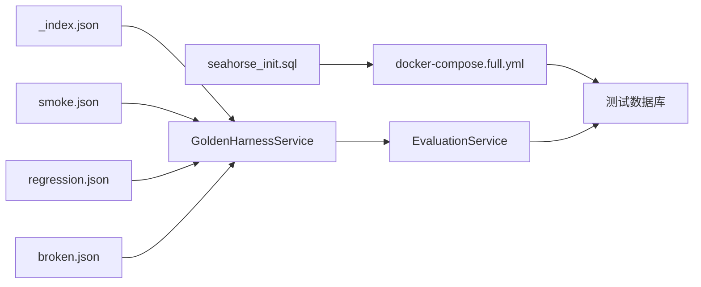

# 测试数据管理

<cite>
**本文引用的文件**
- [单元测试.md](file://docs/zh/content/测试策略/单元测试.md)
- [seahorse_init.sql](file://resources/database/seahorse_init.sql)
- [docker-compose.full.yml](file://docker-compose.full.yml)
- [JdbcQuotaSchemaAlignmentTests.java](file://seahorse-agent-adapter-repository-jdbc/src/test/java/com/miracle/ai/seahorse/agent/adapters/repository/jdbc/JdbcQuotaSchemaAlignmentTests.java)
- [JdbcDockerInitScriptMountTests.java](file://seahorse-agent-adapter-repository-jdbc/src/test/java/com/miracle/ai/seahorse/agent/adapters/repository/jdbc/JdbcDockerInitScriptMountTests.java)
- [JdbcMemoryRepositoryAdapterTests.java](file://seahorse-agent-adapter-repository-jdbc/src/test/java/com/miracle/ai/seahorse/agent/adapters/repository/jdbc/JdbcMemoryRepositoryAdapterTests.java)
- [MemoryRecallGoldenHarnessService.java](file://seahorse-agent-kernel/src/main/java/com/miracle/ai/seahorse/agent/kernel/application/memory/retrieval/MemoryRecallGoldenHarnessService.java)
- [MemoryRecallEvaluationService.java](file://seahorse-agent-kernel/src/main/java/com/miracle/ai/seahorse/agent/kernel/application/memory/retrieval/MemoryRecallEvaluationService.java)
- [MemoryRecallGoldenCaseProfile.java](file://seahorse-agent-kernel/src/main/java/com/miracle/ai/seahorse/agent/ports/outbound/memory/MemoryRecallGoldenCaseProfile.java)
- [MemoryRecallGoldenHarnessServiceTests.java](file://seahorse-agent-tests/src/test/java/com/miracle/ai/seahorse/agent/kernel/application/memory/retrieval/MemoryRecallGoldenHarnessServiceTests.java)
- [_index.json](file://seahorse-agent-tests/src/test/resources/seahorse-agent/memory-recall-golden/_index.json)
- [smoke.json](file://seahorse-agent-tests/src/test/resources/seahorse-agent/memory-recall-golden/smoke.json)
- [regression.json](file://seahorse-agent-tests/src/test/resources/seahorse-agent/memory-recall-golden/regression.json)
- [broken.json](file://seahorse-agent-tests/src/test/resources/seahorse-agent/memory-recall-golden-broken/broken.json)
- [OA系统数据安全规范文档.md](file://resources/docs/knowledge/biz/biz-oa/OA系统数据安全规范文档.md)
- [TicketMCPExecutor.java](file://seahorse-agent-mcp-server/src/main/java/com/miracle/ai/seahorse/agent/adapters/mcp/server/executor/TicketMCPExecutor.java)
- [SalesMCPExecutor.java](file://seahorse-agent-mcp-server/src/main/java/com/miracle/ai/seahorse/agent/adapters/mcp/server/executor/SalesMCPExecutor.java)
</cite>

## 目录
1. [引言](#引言)
2. [项目结构](#项目结构)
3. [核心组件](#核心组件)
4. [架构总览](#架构总览)
5. [详细组件分析](#详细组件分析)
6. [依赖关系分析](#依赖关系分析)
7. [性能考量](#性能考量)
8. [故障排查指南](#故障排查指南)
9. [结论](#结论)
10. [附录](#附录)

## 引言
本文件面向Seahorse Agent项目的测试数据管理，系统性梳理测试数据准备策略、数据库初始化与清理、Golden Master测试数据集的版本与维护、测试环境隔离、数据安全与隐私保护，以及测试数据自动化生成与同步机制。目标是帮助测试工程师与开发人员高效、一致地准备与维护测试数据，确保测试稳定性与可重复性。

## 项目结构
围绕测试数据管理的相关目录与文件主要分布在以下位置：
- 测试资源与Golden Master数据：seahorse-agent-tests/src/test/resources/seahorse-agent/memory-recall-golden
- 数据库初始化脚本：resources/database/seahorse_init.sql
- Docker Compose挂载配置：docker-compose.full.yml
- 单元测试策略与实践：docs/zh/content/测试策略/单元测试.md
- Golden Master测试服务与数据模型：kernel模块中的检索评估相关类
- 自动化生成示例：mcp-server中的模拟数据生成器

**图表来源**
- [MemoryRecallGoldenHarnessService.java:46-89](file://seahorse-agent-kernel/src/main/java/com/miracle/ai/seahorse/agent/kernel/application/memory/retrieval/MemoryRecallGoldenHarnessService.java#L46-L89)
- [MemoryRecallEvaluationService.java:76-99](file://seahorse-agent-kernel/src/main/java/com/miracle/ai/seahorse/agent/kernel/application/memory/retrieval/MemoryRecallEvaluationService.java#L76-L99)
- [MemoryRecallGoldenCaseProfile.java:33-59](file://seahorse-agent-kernel/src/main/java/com/miracle/ai/seahorse/agent/ports/outbound/memory/MemoryRecallGoldenCaseProfile.java#L33-L59)
- [MemoryRecallGoldenHarnessServiceTests.java:146-183](file://seahorse-agent-tests/src/test/java/com/miracle/ai/seahorse/agent/kernel/application/memory/retrieval/MemoryRecallGoldenHarnessServiceTests.java#L146-L183)
- [seahorse_init.sql](file://resources/database/seahorse_init.sql)
- [docker-compose.full.yml](file://docker-compose.full.yml)
- [_index.json:1-4](file://seahorse-agent-tests/src/test/resources/seahorse-agent/memory-recall-golden/_index.json#L1-L4)
- [smoke.json](file://seahorse-agent-tests/src/test/resources/seahorse-agent/memory-recall-golden/smoke.json)
- [regression.json](file://seahorse-agent-tests/src/test/resources/seahorse-agent/memory-recall-golden/regression.json)
- [broken.json](file://seahorse-agent-tests/src/test/resources/seahorse-agent/memory-recall-golden-broken/broken.json)

**章节来源**
- [单元测试.md:381-392](file://docs/zh/content/测试策略/单元测试.md#L381-L392)
- [docker-compose.full.yml](file://docker-compose.full.yml)
- [seahorse_init.sql](file://resources/database/seahorse_init.sql)

## 核心组件
- Golden Master测试数据集
  - 记忆召回测试数据集：通过命名档（profile）加载，支持冒烟测试(smoke)与回归测试(regression)等不同场景。
  - 版本与索引：通过_index.json声明可用档名，便于CI选择运行。
- 数据库测试数据管理
  - 初始化脚本：seahorse_init.sql用于本地与容器化环境初始化。
  - Docker挂载：docker-compose.full.yml将初始化脚本挂载到容器初始化路径，确保一致性。
  - 测试期清理：单元测试中通过删除表与事务回滚实现隔离与清理。
- 测试数据自动化生成
  - MCP执行器中的模拟数据生成器：基于固定随机种子生成稳定但多样化的测试数据，便于回归与演示。
- 测试环境隔离
  - 开发/预发布/生产测试环境：通过不同配置与资源隔离策略实现，结合Golden Master档与数据库脚本保证一致性。

**章节来源**
- [MemoryRecallGoldenHarnessService.java:46-89](file://seahorse-agent-kernel/src/main/java/com/miracle/ai/seahorse/agent/kernel/application/memory/retrieval/MemoryRecallGoldenHarnessService.java#L46-L89)
- [MemoryRecallGoldenCaseProfile.java:33-59](file://seahorse-agent-kernel/src/main/java/com/miracle/ai/seahorse/agent/ports/outbound/memory/MemoryRecallGoldenCaseProfile.java#L33-L59)
- [seahorse_init.sql](file://resources/database/seahorse_init.sql)
- [docker-compose.full.yml](file://docker-compose.full.yml)
- [JdbcMemoryRepositoryAdapterTests.java:981-1000](file://seahorse-agent-adapter-repository-jdbc/src/test/java/com/miracle/ai/seahorse/agent/adapters/repository/jdbc/JdbcMemoryRepositoryAdapterTests.java#L981-L1000)
- [TicketMCPExecutor.java:316-338](file://seahorse-agent-mcp-server/src/main/java/com/miracle/ai/seahorse/agent/adapters/mcp/server/executor/TicketMCPExecutor.java#L316-L338)
- [SalesMCPExecutor.java:275-304](file://seahorse-agent-mcp-server/src/main/java/com/miracle/ai/seahorse/agent/adapters/mcp/server/executor/SalesMCPExecutor.java#L275-L304)

## 架构总览
下图展示Golden Master测试数据从资源到内核评估服务的整体流程，以及数据库初始化与Docker挂载的关系。

**图表来源**
- [MemoryRecallGoldenHarnessService.java:72-89](file://seahorse-agent-kernel/src/main/java/com/miracle/ai/seahorse/agent/kernel/application/memory/retrieval/MemoryRecallGoldenHarnessService.java#L72-L89)
- [MemoryRecallEvaluationService.java:76-99](file://seahorse-agent-kernel/src/main/java/com/miracle/ai/seahorse/agent/kernel/application/memory/retrieval/MemoryRecallEvaluationService.java#L76-L99)
- [docker-compose.full.yml](file://docker-compose.full.yml)
- [seahorse_init.sql](file://resources/database/seahorse_init.sql)

## 详细组件分析

### Golden Master测试数据管理
- 档与用例
  - 档定义：MemoryRecallGoldenCaseProfile封装档名、默认topK与用例列表，支持空档与去空过滤。
  - 运行器：MemoryRecallGoldenHarnessService根据档名解析档，调用评估服务并记录观测指标（成功/缺失/空）。
  - 评估服务：MemoryRecallEvaluationService对每个用例计算命中、倒数排名、准确率、噪声率等指标，并聚合通道命中统计。
- 资源组织
  - _index.json列出可用档名（如smoke、regression），供CI选择运行。
  - smoke.json与regression.json分别承载冒烟与回归用例集合。
  - broken.json作为异常/破坏性用例的示例，便于验证错误处理。
- 测试验证
  - MemoryRecallGoldenHarnessServiceTests通过静态仓库与录制评估端口，验证档解析、空档处理与评估命令捕获。

**图表来源**
- [MemoryRecallGoldenCaseProfile.java:33-59](file://seahorse-agent-kernel/src/main/java/com/miracle/ai/seahorse/agent/ports/outbound/memory/MemoryRecallGoldenCaseProfile.java#L33-L59)
- [MemoryRecallGoldenHarnessService.java:46-89](file://seahorse-agent-kernel/src/main/java/com/miracle/ai/seahorse/agent/kernel/application/memory/retrieval/MemoryRecallGoldenHarnessService.java#L46-L89)
- [MemoryRecallEvaluationService.java:76-99](file://seahorse-agent-kernel/src/main/java/com/miracle/ai/seahorse/agent/kernel/application/memory/retrieval/MemoryRecallEvaluationService.java#L76-L99)

**章节来源**
- [MemoryRecallGoldenHarnessService.java:46-89](file://seahorse-agent-kernel/src/main/java/com/miracle/ai/seahorse/agent/kernel/application/memory/retrieval/MemoryRecallGoldenHarnessService.java#L46-L89)
- [MemoryRecallGoldenCaseProfile.java:33-59](file://seahorse-agent-kernel/src/main/java/com/miracle/ai/seahorse/agent/ports/outbound/memory/MemoryRecallGoldenCaseProfile.java#L33-L59)
- [MemoryRecallEvaluationService.java:76-99](file://seahorse-agent-kernel/src/main/java/com/miracle/ai/seahorse/agent/kernel/application/memory/retrieval/MemoryRecallEvaluationService.java#L76-L99)
- [MemoryRecallGoldenHarnessServiceTests.java:146-183](file://seahorse-agent-tests/src/test/java/com/miracle/ai/seahorse/agent/kernel/application/memory/retrieval/MemoryRecallGoldenHarnessServiceTests.java#L146-L183)
- [_index.json:1-4](file://seahorse-agent-tests/src/test/resources/seahorse-agent/memory-recall-golden/_index.json#L1-L4)
- [smoke.json](file://seahorse-agent-tests/src/test/resources/seahorse-agent/memory-recall-golden/smoke.json)
- [regression.json](file://seahorse-agent-tests/src/test/resources/seahorse-agent/memory-recall-golden/regression.json)
- [broken.json](file://seahorse-agent-tests/src/test/resources/seahorse-agent/memory-recall-golden-broken/broken.json)

### 数据库测试数据管理
- 初始化脚本
  - seahorse_init.sql提供统一的数据库表结构与种子数据，确保测试环境一致性。
- Docker挂载
  - docker-compose.full.yml将初始化脚本挂载到容器初始化目录，保障容器化环境与本地一致。
- 测试期清理
  - 单元测试中通过删除表与事务回滚实现隔离与清理，避免跨测试污染。
- 脚本一致性校验
  - JdbcQuotaSchemaAlignmentTests读取初始化SQL与注册SQL，断言二者对配额模式保持一致。
  - JdbcDockerInitScriptMountTests断言Compose文件正确挂载初始化脚本，防止误挂载其他脚本。

**图表来源**
- [seahorse_init.sql](file://resources/database/seahorse_init.sql)
- [docker-compose.full.yml](file://docker-compose.full.yml)
- [JdbcQuotaSchemaAlignmentTests.java:30-35](file://seahorse-agent-adapter-repository-jdbc/src/test/java/com/miracle/ai/seahorse/agent/adapters/repository/jdbc/JdbcQuotaSchemaAlignmentTests.java#L30-L35)
- [JdbcDockerInitScriptMountTests.java:34-41](file://seahorse-agent-adapter-repository-jdbc/src/test/java/com/miracle/ai/seahorse/agent/adapters/repository/jdbc/JdbcDockerInitScriptMountTests.java#L34-L41)
- [JdbcMemoryRepositoryAdapterTests.java:981-1000](file://seahorse-agent-adapter-repository-jdbc/src/test/java/com/miracle/ai/seahorse/agent/adapters/repository/jdbc/JdbcMemoryRepositoryAdapterTests.java#L981-L1000)

**章节来源**
- [seahorse_init.sql](file://resources/database/seahorse_init.sql)
- [docker-compose.full.yml](file://docker-compose.full.yml)
- [JdbcQuotaSchemaAlignmentTests.java:30-35](file://seahorse-agent-adapter-repository-jdbc/src/test/java/com/miracle/ai/seahorse/agent/adapters/repository/jdbc/JdbcQuotaSchemaAlignmentTests.java#L30-L35)
- [JdbcDockerInitScriptMountTests.java:34-41](file://seahorse-agent-adapter-repository-jdbc/src/test/java/com/miracle/ai/seahorse/agent/adapters/repository/jdbc/JdbcDockerInitScriptMountTests.java#L34-L41)
- [JdbcMemoryRepositoryAdapterTests.java:981-1000](file://seahorse-agent-adapter-repository-jdbc/src/test/java/com/miracle/ai/seahorse/agent/adapters/repository/jdbc/JdbcMemoryRepositoryAdapterTests.java#L981-L1000)
- [单元测试.md:381-392](file://docs/zh/content/测试策略/单元测试.md#L381-L392)

### 测试数据自动化生成与同步
- 自动化生成
  - TicketMCPExecutor与SalesMCPExecutor基于固定随机种子生成稳定的历史数据，便于回归与演示。
- 同步机制
  - Docker Compose挂载初始化脚本，确保测试数据库与生产/预发布环境一致。
  - Golden Master档通过_index.json与资源文件同步，CI可按档名选择运行。

**图表来源**
- [TicketMCPExecutor.java:316-338](file://seahorse-agent-mcp-server/src/main/java/com/miracle/ai/seahorse/agent/adapters/mcp/server/executor/TicketMCPExecutor.java#L316-L338)
- [SalesMCPExecutor.java:275-304](file://seahorse-agent-mcp-server/src/main/java/com/miracle/ai/seahorse/agent/adapters/mcp/server/executor/SalesMCPExecutor.java#L275-L304)
- [docker-compose.full.yml](file://docker-compose.full.yml)

**章节来源**
- [TicketMCPExecutor.java:316-338](file://seahorse-agent-mcp-server/src/main/java/com/miracle/ai/seahorse/agent/adapters/mcp/server/executor/TicketMCPExecutor.java#L316-L338)
- [SalesMCPExecutor.java:275-304](file://seahorse-agent-mcp-server/src/main/java/com/miracle/ai/seahorse/agent/adapters/mcp/server/executor/SalesMCPExecutor.java#L275-L304)
- [docker-compose.full.yml](file://docker-compose.full.yml)

### 测试环境隔离策略
- 开发测试环境
  - 使用内存数据库与快速初始化脚本，便于本地调试与高频迭代。
- 预发布测试环境
  - 通过Compose挂载初始化脚本，确保与生产相似的数据库状态。
- 生产测试环境
  - 严格的数据隔离与访问控制，配合Golden Master档与自动化生成器，保证测试不影响生产数据。

**章节来源**
- [docker-compose.full.yml](file://docker-compose.full.yml)
- [seahorse_init.sql](file://resources/database/seahorse_init.sql)

### 测试数据安全与隐私保护
- 访问控制与授权
  - RBAC与ABAC结合，实现岗位权限包与动态裁决，支持行级、字段级、附件级与会话关联的细粒度控制。
- 存储安全与密钥治理
  - 敏感字段采用高强度加密，附件加密存储与URL签名；密钥治理遵循工单驱动轮转与审计。
- 脱敏与最小暴露
  - 默认脱敏展示，明文访问需审批；脱敏规则版本化，覆盖高风险页面与导出接口。

**章节来源**
- [OA系统数据安全规范文档.md:88-128](file://resources/docs/knowledge/biz/biz-oa/OA系统数据安全规范文档.md#L88-L128)

## 依赖关系分析
- Golden Master档与评估服务
  - Harness依赖仓库端口解析档，再委托评估服务执行，最终产出报告并记录观测指标。
- 数据库与容器化
  - 初始化脚本被Compose挂载至容器初始化路径，确保测试数据库一致性。
- 单元测试与隔离
  - 测试中通过删除表与事务回滚实现隔离，避免跨测试污染。

**图表来源**
- [_index.json:1-4](file://seahorse-agent-tests/src/test/resources/seahorse-agent/memory-recall-golden/_index.json#L1-L4)
- [smoke.json](file://seahorse-agent-tests/src/test/resources/seahorse-agent/memory-recall-golden/smoke.json)
- [regression.json](file://seahorse-agent-tests/src/test/resources/seahorse-agent/memory-recall-golden/regression.json)
- [broken.json](file://seahorse-agent-tests/src/test/resources/seahorse-agent/memory-recall-golden-broken/broken.json)
- [MemoryRecallGoldenHarnessService.java:72-89](file://seahorse-agent-kernel/src/main/java/com/miracle/ai/seahorse/agent/kernel/application/memory/retrieval/MemoryRecallGoldenHarnessService.java#L72-L89)
- [MemoryRecallEvaluationService.java:76-99](file://seahorse-agent-kernel/src/main/java/com/miracle/ai/seahorse/agent/kernel/application/memory/retrieval/MemoryRecallEvaluationService.java#L76-L99)
- [seahorse_init.sql](file://resources/database/seahorse_init.sql)
- [docker-compose.full.yml](file://docker-compose.full.yml)

**章节来源**
- [MemoryRecallGoldenHarnessService.java:46-89](file://seahorse-agent-kernel/src/main/java/com/miracle/ai/seahorse/agent/kernel/application/memory/retrieval/MemoryRecallGoldenHarnessService.java#L46-L89)
- [MemoryRecallEvaluationService.java:76-99](file://seahorse-agent-kernel/src/main/java/com/miracle/ai/seahorse/agent/kernel/application/memory/retrieval/MemoryRecallEvaluationService.java#L76-L99)
- [docker-compose.full.yml](file://docker-compose.full.yml)
- [seahorse_init.sql](file://resources/database/seahorse_init.sql)

## 性能考量
- Golden Master评估
  - 通过合理设置topK与用例规模，平衡评估精度与执行时间。
  - 利用观测指标（命中率、倒数排名、噪声率）指导优化。
- 数据库初始化
  - 使用轻量级初始化脚本与容器化挂载，缩短测试准备时间。
- 自动化生成
  - 固定随机种子生成稳定数据，减少数据漂移导致的性能波动。

## 故障排查指南
- Golden Master档缺失或为空
  - 现象：Harness返回空报告并记录缺失/空观测指标。
  - 处理：检查_index.json与对应档文件是否存在，确认评估服务命令参数。
- Docker初始化脚本未正确挂载
  - 现象：容器内数据库未初始化或挂载了错误脚本。
  - 处理：核对docker-compose.full.yml挂载路径，确保仅挂载seahorse_init.sql。
- 测试数据污染
  - 现象：跨测试出现数据干扰。
  - 处理：在@BeforeEach中创建Schema并在测试结束后回滚事务；删除临时表。

**章节来源**
- [MemoryRecallGoldenHarnessService.java:72-89](file://seahorse-agent-kernel/src/main/java/com/miracle/ai/seahorse/agent/kernel/application/memory/retrieval/MemoryRecallGoldenHarnessService.java#L72-L89)
- [JdbcDockerInitScriptMountTests.java:34-41](file://seahorse-agent-adapter-repository-jdbc/src/test/java/com/miracle/ai/seahorse/agent/adapters/repository/jdbc/JdbcDockerInitScriptMountTests.java#L34-L41)
- [单元测试.md:381-392](file://docs/zh/content/测试策略/单元测试.md#L381-L392)

## 结论
通过Golden Master档与评估服务、统一的数据库初始化脚本与容器化挂载、以及自动化生成与清理策略，Seahorse Agent实现了可复现、可维护、可扩展的测试数据管理体系。结合严格的访问控制与脱敏策略，能够在保障安全的前提下高效开展测试工作。

## 附录
- 测试数据准备清单
  - Golden Master档：smoke.json、regression.json、_index.json
  - 数据库：seahorse_init.sql、docker-compose.full.yml
  - 单元测试：确保@BeforeEach创建Schema、测试后回滚事务
- 最佳实践
  - 将新增用例纳入smoke档以快速验证，回归档用于持续回归
  - 保持初始化脚本与Compose挂载的一致性
  - 对高敏数据采用脱敏与最小暴露原则