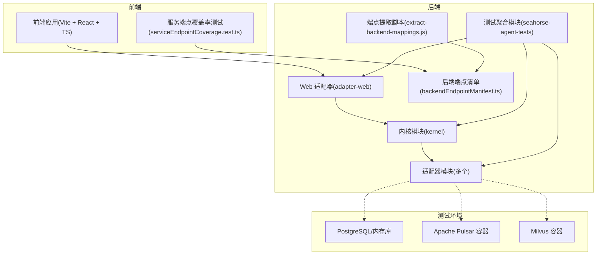
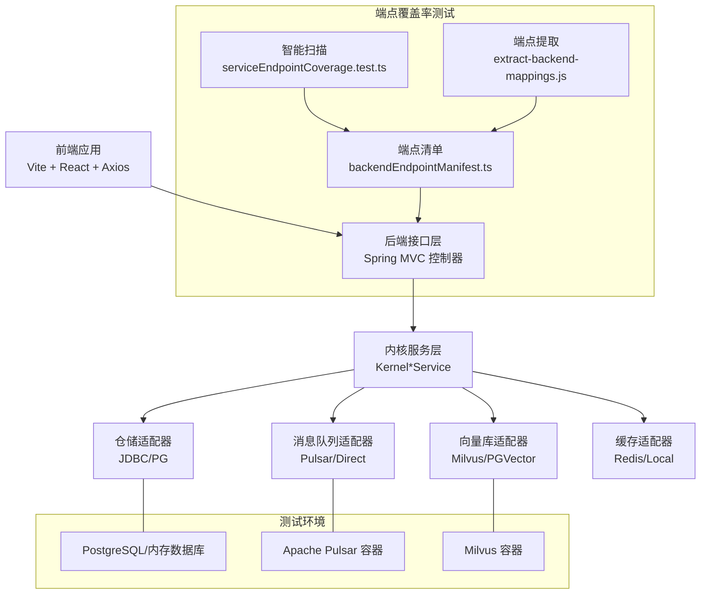
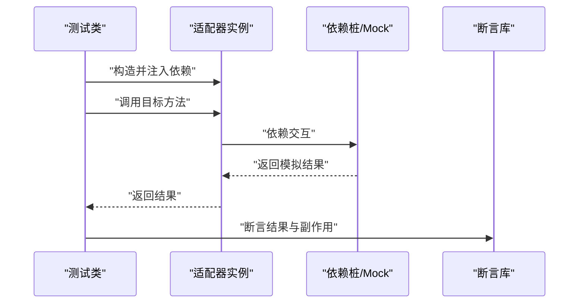
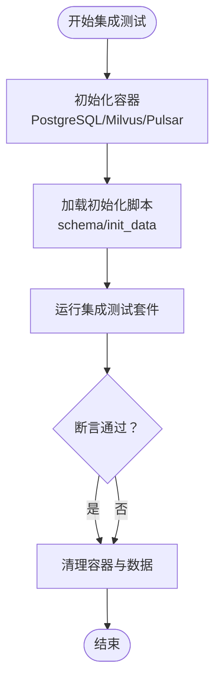
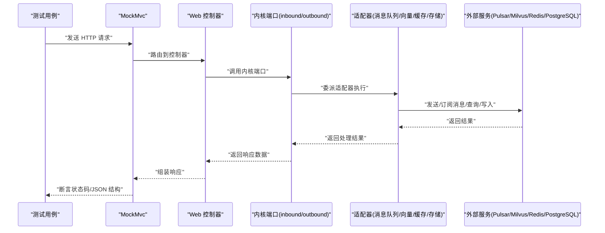
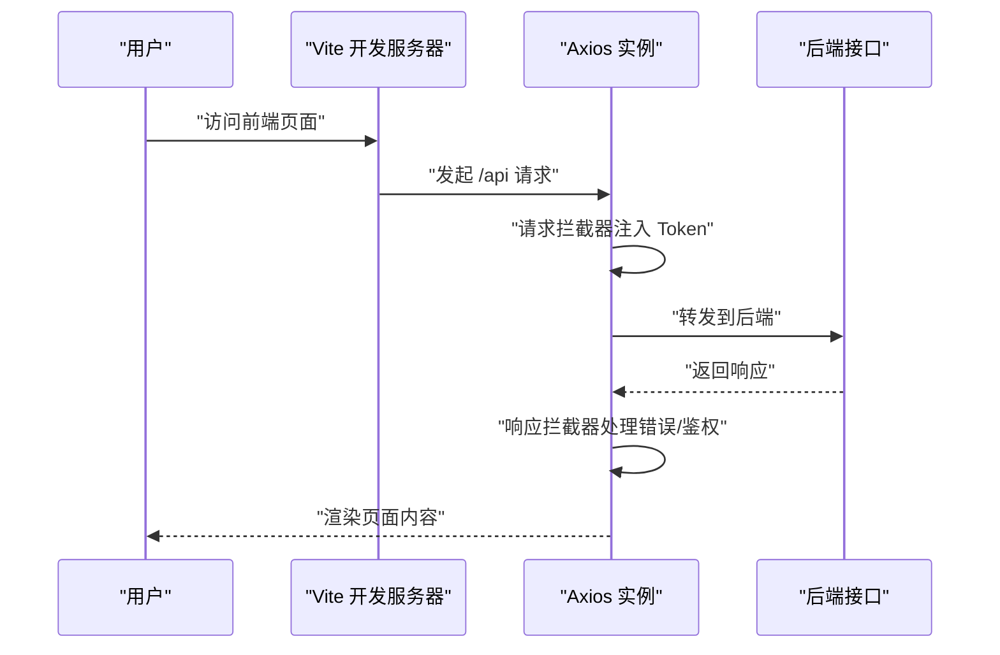
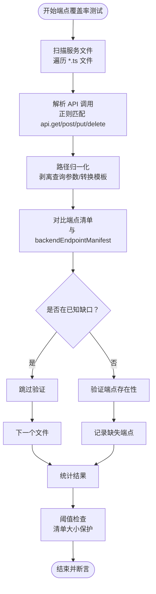
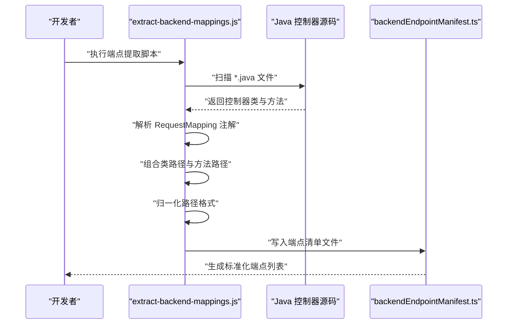
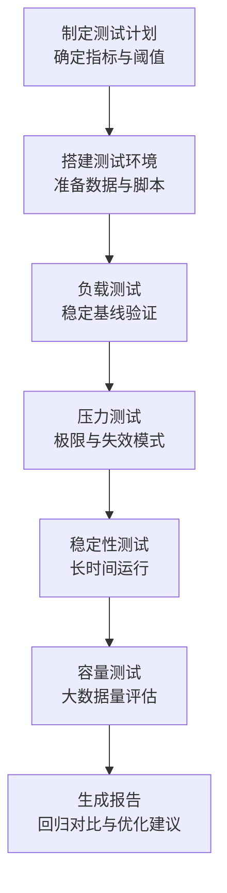

# 测试策略

<cite>
**本文引用的文件**   
- [pom.xml](file://pom.xml)
- [docs/zh/content/测试策略/测试策略.md](file://docs/zh/content/测试策略/测试策略.md)
- [docs/zh/content/测试策略/单元测试.md](file://docs/zh/content/测试策略/单元测试.md)
- [docs/zh/content/测试策略/集成测试.md](file://docs/zh/content/测试策略/集成测试.md)
- [docs/zh/content/测试策略/性能测试.md](file://docs/zh/content/测试策略/性能测试.md)
- [frontend/vite.config.ts](file://frontend/vite.config.ts)
- [frontend/src/services/api.ts](file://frontend/src/services/api.ts)
- [frontend/src/test/setup.ts](file://frontend/src/test/setup.ts)
- [frontend/package.json](file://frontend/package.json)
- [frontend/TESTING.md](file://frontend/TESTING.md)
- [frontend/src/services/serviceEndpointCoverage.test.ts](file://frontend/src/services/serviceEndpointCoverage.test.ts)
- [scripts/extract-backend-mappings.js](file://scripts/extract-backend-mappings.js)
- [resources/docker/milvus-stack-2.6.6.compose.yaml](file://resources/docker/milvus-stack-2.6.6.compose.yaml)
- [resources/docker/pulsar-stack-3.1.3.compose.yaml](file://resources/docker/pulsar-stack-3.1.3.compose.yaml)
- [resources/database/seahorse_init.sql](file://resources/database/seahorse_init.sql)
- [seahorse-agent-adapter-mcp-http/src/test/java/com/miracle/ai/seahorse/agent/adapters/mcp/http/LlmMcpParameterExtractionAdapterTests.java](file://seahorse-agent-adapter-mcp-http/src/test/java/com/miracle/ai/seahorse/agent/adapters/mcp/http/LlmMcpParameterExtractionAdapterTests.java)
- [seahorse-agent-adapter-repository-jdbc/src/test/java/com/miracle/ai/seahorse/agent/adapters/repository/jdbc/JdbcKnowledgeBaseRepositoryAdapterTests.java](file://seahorse-agent-adapter-repository-jdbc/src/test/java/com/miracle/ai/seahorse/agent/adapters/repository/jdbc/JdbcKnowledgeBaseRepositoryAdapterTests.java)
- [seahorse-agent-adapter-repository-jdbc/src/test/java/com/miracle/ai/seahorse/agent/adapters/repository/jdbc/JdbcKnowledgeDocumentRepositoryAdapterTests.java](file://seahorse-agent-adapter-repository-jdbc/src/test/java/com/miracle/ai/seahorse/agent/adapters/repository/jdbc/JdbcKnowledgeDocumentRepositoryAdapterTests.java)
- [seahorse-agent-tests/src/test/java/com/miracle/ai/seahorse/agent/adapters/web/SeahorseWebApiContractTests.java](file://seahorse-agent-tests/src/test/java/com/miracle/ai/seahorse/agent/adapters/web/SeahorseWebApiContractTests.java)
- [seahorse-agent-adapter-mq-pulsar/src/main/java/com/miracle/ai/seahorse/agent/adapters/mq/pulsar/PulsarMessageQueueAdapter.java](file://seahorse-agent-adapter-mq-pulsar/src/main/java/com/miracle/ai/seahorse/agent/adapters/mq/pulsar/PulsarMessageQueueAdapter.java)
- [seahorse-agent-adapter-vector-milvus/src/test/java/com/miracle/ai/seahorse/agent/adapter/vector/milvus/MilvusVectorAdapterTests.java](file://seahorse-agent-adapter-vector-milvus/src/test/java/com/miracle/ai/seahorse/agent/adapter/vector/milvus/MilvusVectorAdapterTests.java)
- [seahorse-agent-adapter-cache-redis/src/main/java/com/miracle/ai/seahorse/agent/adapters/cache/redis/RedisCacheAdapter.java](file://seahorse-agent-adapter-cache-redis/src/main/java/com/miracle/ai/seahorse/agent/adapters/cache/redis/RedisCacheAdapter.java)
- [seahorse-agent-adapter-storage-s3/src/main/java/com/miracle/ai/seahorse/agent/adapters/storage/s3/S3ObjectStorageAdapter.java](file://seahorse-agent-adapter-storage-s3/src/main/java/com/miracle/ai/seahorse/agent/adapters/storage/s3/S3ObjectStorageAdapter.java)
- [seahorse-agent-adapter-openapi/src/test/java/com/miracle/ai/seahorse/agent/adapters/openapi/OpenApiSpecParserAdapterTests.java](file://seahorse-agent-adapter-openapi/src/test/java/com/miracle/ai/seahorse/agent/adapters/openapi/OpenApiSpecParserAdapterTests.java)
- [seahorse-agent-adapter-parser-tika/src/test/java/com/miracle/ai/seahorse/agent/adapters/parser/tika/TikaDocumentParserAdapterTests.java](file://seahorse-agent-adapter-parser-tika/src/test/java/com/miracle/ai/seahorse/agent/adapters/parser/tika/TikaDocumentParserAdapterTests.java)
- [seahorse-agent-adapter-ai-openai-compatible/src/test/java/com/miracle/ai/seahorse/agent/adapters/ai/openai/OpenAiCompatibleModelAdapterTests.java](file://seahorse-agent-adapter-ai-openai-compatible/src/test/java/com/miracle/ai/seahorse/agent/adapters/ai/openai/OpenAiCompatibleModelAdapterTests.java)
- [seahorse-agent-adapter-observation-micrometer/src/test/java/com/miracle/ai/seahorse/agent/adapters/observation/micrometer/MicrometerObservationAdapterTests.java](file://seahorse-agent-adapter-observation-micrometer/src/test/java/com/miracle/ai/seahorse/agent/adapters/observation/micrometer/MicrometerObservationAdapterTests.java)
- [seahorse-agent-adapter-vector-pgvector/src/test/java/com/miracle/ai/seahorse/agent/adapters/vector/pgvector/PgVectorAdapterTests.java](file://seahorse-agent-adapter-vector-pgvector/src/test/java/com/miracle/ai/seahorse/agent/adapters/vector/pgvector/PgVectorAdapterTests.java)
- [seahorse-agent-adapter-vector-noop/src/main/java/com/miracle/ai/seahorse/agent/adapters/vector/noop/NoopVectorStoreAdapter.java](file://seahorse-agent-adapter-vector-noop/src/main/java/com/miracle/ai/seahorse/agent/adapters/vector/noop/NoopVectorStoreAdapter.java)
- [seahorse-agent-adapter-cache-local/src/main/java/com/miracle/ai/seahorse/agent/adapters/cache/local/LocalCacheAdapter.java](file://seahorse-agent-adapter-cache-local/src/main/java/com/miracle/ai/seahorse/agent/adapters/cache/local/LocalCacheAdapter.java)
- [seahorse-agent-adapter-storage-local/src/main/java/com/miracle/ai/seahorse/agent/adapters/storage/local/LocalObjectStorageAdapter.java](file://seahorse-agent-adapter-storage-local/src/main/java/com/miracle/ai/seahorse/agent/adapters/storage/local/LocalObjectStorageAdapter.java)
- [seahorse-agent-adapter-mq-direct/src/test/java/com/miracle/ai/seahorse/agent/adapters/mq/direct/DirectMessageQueueAdapterTests.java](file://seahorse-agent-adapter-mq-direct/src/test/java/com/miracle/ai/seahorse/agent/adapters/mq/direct/DirectMessageQueueAdapterTests.java)
- [seahorse-agent-adapter-mcp-http/src/test/java/com/miracle/ai/seahorse/agent/adapters/mcp/http/McpHttpOAuthCredentialTests.java](file://seahorse-agent-adapter-mcp-http/src/test/java/com/miracle/ai/seahorse/agent/adapters/mcp/http/McpHttpOAuthCredentialTests.java)
- [seahorse-agent-adapter-mcp-http/src/test/java/com/miracle/ai/seahorse/agent/adapters/mcp/http/NativeMcpEnabledConditionTests.java](file://seahorse-agent-adapter-mcp-http/src/test/java/com/miracle/ai/seahorse/agent/adapters/mcp/http/NativeMcpEnabledConditionTests.java)
- [seahorse-agent-adapter-mcp-http/src/test/java/com/miracle/ai/seahorse/agent/adapters/mcp/http/StreamableHttpMcpClientCredentialTests.java](file://seahorse-agent-adapter-mcp-http/src/test/java/com/miracle/ai/seahorse/agent/adapters/mcp/http/StreamableHttpMcpClientCredentialTests.java)
- [seahorse-agent-adapter-mcp-http/src/test/java/com/miracle/ai/seahorse/agent/adapters/mcp/http/McpHttpAutoConfigurationCredentialTests.java](file://seahorse-agent-adapter-mcp-http/src/test/java/com/miracle/ai/seahorse/agent/adapters/mcp/http/McpHttpAutoConfigurationCredentialTests.java)
- [seahorse-agent-adapter-mcp-http/src/test/java/com/miracle/ai/seahorse/agent/adapters/mcp/http/NativeMcpToolRegistryTests.java](file://seahorse-agent-adapter-mcp-http/src/test/java/com/miracle/ai/seahorse/agent/adapters/mcp/http/NativeMcpToolRegistryTests.java)
- [seahorse-agent-adapter-mcp-http/src/test/java/com/miracle/ai/seahorse/agent/adapters/mcp/http/LlmMcpParameterExtractionAdapterTests.java](file://seahorse-agent-adapter-mcp-http/src/test/java/com/miracle/ai/seahorse/agent/adapters/mcp/http/LlmMcpParameterExtractionAdapterTests.java)
- [seahorse-agent-adapter-ai-openai-compatible/src/test/java/com/miracle/ai/seahorse/agent/adapters/ai/openai/LlmMemoryCompactionSummarizerAdapterTests.java](file://seahorse-agent-adapter-ai-openai-compatible/src/test/java/com/miracle/ai/seahorse/agent/adapters/ai/openai/LlmMemoryCompactionSummarizerAdapterTests.java)
- [seahorse-agent-adapter-ai-openai-compatible/src/test/java/com/miracle/ai/seahorse/agent/adapters/ai/openai/LlmMemoryRefinerAdapterTests.java](file://seahorse-agent-adapter-ai-openai-compatible/src/test/java/com/miracle/ai/seahorse/agent/adapters/ai/openai/LlmMemoryRefinerAdapterTests.java)
- [seahorse-agent-adapter-ai-openai-compatible/src/test/java/com/miracle/ai/seahorse/agent/adapters/ai/openai/OpenAiCompatibleMemoryCompactionAutoConfigurationTests.java](file://seahorse-agent-adapter-ai-openai-compatible/src/test/java/com/miracle/ai/seahorse/agent/adapters/ai/openai/OpenAiCompatibleMemoryCompactionAutoConfigurationTests.java)
- [seahorse-agent-adapter-ai-openai-compatible/src/test/java/com/miracle/ai/seahorse/agent/adapters/ai/openai/OpenAiCompatibleMemoryRefinerAutoConfigurationTests.java](file://seahorse-agent-adapter-ai-openai-compatible/src/test/java/com/miracle/ai/seahorse/agent/adapters/ai/openai/OpenAiCompatibleMemoryRefinerAutoConfigurationTests.java)
- [seahorse-agent-adapter-ai-openai-compatible/src/test/java/com/miracle/ai/seahorse/agent/adapters/ai/openai/OpenAiCompatibleStreamingChatToolsTests.java](file://seahorse-agent-adapter-ai-openai-compatible/src/test/java/com/miracle/ai/seahorse/agent/adapters/ai/openai/OpenAiCompatibleStreamingChatToolsTests.java)
- [seahorse-agent-adapter-openapi/src/test/java/com/miracle/ai/seahorse/agent/adapters/openapi/OpenApiSpecParserAdapterTests.java](file://seahorse-agent-adapter-openapi/src/test/java/com/miracle/ai/seahorse/agent/adapters/openapi/OpenApiSpecParserAdapterTests.java)
- [seahorse-agent-adapter-parser-tika/src/test/java/com/miracle/ai/seahorse/agent/adapters/parser/tika/TikaDocumentParserAdapterTests.java](file://seahorse-agent-adapter-parser-tika/src/test/java/com/miracle/ai/seahorse/agent/adapters/parser/tika/TikaDocumentParserAdapterTests.java)
- [seahorse-agent-adapter-vector-milvus/src/test/java/com/miracle/ai/seahorse/agent/adapter/vector/milvus/MilvusVectorAdapterTests.java](file://seahorse-agent-adapter-vector-milvus/src/test/java/com/miracle/ai/seahorse/agent/adapter/vector/milvus/MilvusVectorAdapterTests.java)
- [seahorse-agent-adapter-vector-pgvector/src/test/java/com/miracle/ai/seahorse/agent/adapters/vector/pgvector/PgVectorAdapterTests.java](file://seahorse-agent-adapter-vector-pgvector/src/test/java/com/miracle/ai/seahorse/agent/adapters/vector/pgvector/PgVectorAdapterTests.java)
- [seahorse-agent-adapter-vector-noop/src/main/java/com/miracle/ai/seahorse/agent/adapters/vector/noop/NoopVectorStoreAdapter.java](file://seahorse-agent-adapter-vector-noop/src/main/java/com/miracle/ai/seahorse/agent/adapters/vector/noop/NoopVectorStoreAdapter.java)
- [seahorse-agent-adapter-cache-redis/src/main/java/com/miracle/ai/seahorse/agent/adapters/cache/redis/RedisCacheAdapter.java](file://seahorse-agent-adapter-cache-redis/src/main/java/com/miracle/ai/seahorse/agent/adapters/cache/redis/RedisCacheAdapter.java)
- [seahorse-agent-adapter-cache-local/src/main/java/com/miracle/ai/seahorse/agent/adapters/cache/local/LocalCacheAdapter.java](file://seahorse-agent-adapter-cache-local/src/main/java/com/miracle/ai/seahorse/agent/adapters/cache/local/LocalCacheAdapter.java)
- [seahorse-agent-adapter-storage-s3/src/main/java/com/miracle/ai/seahorse/agent/adapters/storage/s3/S3ObjectStorageAdapter.java](file://seahorse-agent-adapter-storage-s3/src/main/java/com/miracle/ai/seahorse/agent/adapters/storage/s3/S3ObjectStorageAdapter.java)
- [seahorse-agent-adapter-storage-local/src/main/java/com/miracle/ai/seahorse/agent/adapters/storage/local/LocalObjectStorageAdapter.java](file://seahorse-agent-adapter-storage-local/src/main/java/com/miracle/ai/seahorse/agent/adapters/storage/local/LocalObjectStorageAdapter.java)
- [seahorse-agent-adapter-mq-direct/src/test/java/com/miracle/ai/seahorse/agent/adapters/mq/direct/DirectMessageQueueAdapterTests.java](file://seahorse-agent-adapter-mq-direct/src/test/java/com/miracle/ai/seahorse/agent/adapters/mq/direct/DirectMessageQueueAdapterTests.java)
- [seahorse-agent-adapter-mq-pulsar/src/main/java/com/miracle/ai/seahorse/agent/adapters/mq/pulsar/PulsarMessageQueueAdapter.java](file://seahorse-agent-adapter-mq-pulsar/src/main/java/com/miracle/ai/seahorse/agent/adapters/mq/pulsar/PulsarMessageQueueAdapter.java)
- [seahorse-agent-tests/src/test/java/com/miracle/ai/seahorse/agent/adapters/web/SeahorseWebApiContractTests.java](file://seahorse-agent-tests/src/test/java/com/miracle/ai/seahorse/agent/adapters/web/SeahorseWebApiContractTests.java)
</cite>

## 目录
1. [简介](#简介)
2. [项目结构](#项目结构)
3. [核心组件](#核心组件)
4. [架构总览](#架构总览)
5. [详细组件分析](#详细组件分析)
6. [依赖分析](#依赖分析)
7. [性能考虑](#性能考虑)
8. [故障排查指南](#故障排查指南)
9. [结论](#结论)
10. [附录](#附录)

## 简介
本测试策略文档面向 Seahorse Agent 的后端与前端团队，系统化阐述测试金字塔的组织与执行策略，覆盖单元测试、集成测试与端到端测试；明确后端基于 JUnit 5、Mockito 与 Testcontainers 的测试架构，以及前端基于 Vite、React、TypeScript 与 Vitest 的测试体系；同时给出测试数据管理、持续集成测试流程、性能与压力测试指南，以及测试最佳实践与 TDD 方法建议，帮助测试工程师与开发者高效落地质量保障。

**更新** 新增服务端点覆盖率测试功能，包括智能扫描机制和端点验证能力，确保前后端接口契约一致性。

## 项目结构
- 后端多模块 Maven 项目，包含内核、适配器、Web 适配器、启动器与测试聚合模块，测试集中在各适配器模块与 seahorse-agent-tests 中。
- 前端基于 Vite + React + TypeScript，使用 Vitest 进行单元测试，配合 jsdom 环境与 @testing-library/jest-dom。
- 测试环境通过 Docker Compose 提供外部依赖（Milvus、Pulsar），数据库初始化脚本位于 resources/database。
- **新增** 服务端点覆盖率测试：通过智能扫描前端服务文件与后端控制器映射，自动验证接口契约完整性。

**章节来源**
- [pom.xml](file://pom.xml)
- [frontend/vite.config.ts](file://frontend/vite.config.ts)
- [frontend/src/services/serviceEndpointCoverage.test.ts](file://frontend/src/services/serviceEndpointCoverage.test.ts)
- [scripts/extract-backend-mappings.js](file://scripts/extract-backend-mappings.js)
- [resources/docker/milvus-stack-2.6.6.compose.yaml](file://resources/docker/milvus-stack-2.6.6.compose.yaml)
- [resources/docker/pulsar-stack-3.1.3.compose.yaml](file://resources/docker/pulsar-stack-3.1.3.compose.yaml)
- [resources/database/seahorse_init.sql](file://resources/database/seahorse_init.sql)

## 核心组件
- 后端测试框架
  - 单元测试：JUnit 5（Maven Surefire 插件执行）
  - Mock：Mockito（JVM agent 注入）
  - 集成测试：Testcontainers（容器化数据库、消息队列、向量库）
- 前端测试框架
  - 开发与构建：Vite
  - 语言与类型：TypeScript
  - 质量保障：ESLint、Prettier
  - 接口与拦截器：Axios 封装与认证拦截
- **新增** 服务端点覆盖率测试
  - 智能扫描：自动解析前端服务文件中的 API 调用
  - 端点验证：与后端控制器映射进行对比校验
  - 清单维护：通过 Node.js 脚本从 Java 源码提取端点信息
- 测试工具链
  - Maven 多模块与插件：Surefire、Spotless
  - Docker Compose：Milvus、Pulsar 等外部依赖
  - 性能基线与对比：docs/performance 下的 JSON

**章节来源**
- [docs/zh/content/测试策略/测试策略.md:66-88](file://docs/zh/content/测试策略/测试策略.md#L66-L88)
- [pom.xml](file://pom.xml)
- [frontend/package.json](file://frontend/package.json)
- [frontend/vite.config.ts](file://frontend/vite.config.ts)
- [frontend/src/services/api.ts](file://frontend/src/services/api.ts)
- [frontend/src/services/serviceEndpointCoverage.test.ts](file://frontend/src/services/serviceEndpointCoverage.test.ts)
- [scripts/extract-backend-mappings.js](file://scripts/extract-backend-mappings.js)
- [frontend/.eslintrc.cjs](file://frontend/.eslintrc.cjs)
- [frontend/.prettierrc](file://frontend/.prettierrc)

## 架构总览
后端与前端在测试阶段的交互关系如下：前端通过 Vite 开发服务器与 Axios 访问后端接口；后端控制器调用内核服务层，内核通过端口委派给具体适配器，适配器与外部依赖（数据库、消息队列、向量库）交互。集成测试通过 Testcontainers 启动外部依赖容器，确保契约与集成点的验证。**新增** 端点覆盖率测试通过智能扫描确保前后端接口契约一致性。

**图表来源**
- [docs/zh/content/测试策略/测试策略.md:89-108](file://docs/zh/content/测试策略/测试策略.md#L89-L108)

**章节来源**
- [docs/zh/content/测试策略/测试策略.md:89-108](file://docs/zh/content/测试策略/测试策略.md#L89-L108)
- [frontend/src/services/serviceEndpointCoverage.test.ts](file://frontend/src/services/serviceEndpointCoverage.test.ts)
- [scripts/extract-backend-mappings.js](file://scripts/extract-backend-mappings.js)
- [resources/docker/milvus-stack-2.6.6.compose.yaml](file://resources/docker/milvus-stack-2.6.6.compose.yaml)
- [resources/docker/pulsar-stack-3.1.3.compose.yaml](file://resources/docker/pulsar-stack-3.1.3.compose.yaml)
- [resources/database/seahorse_init.sql](file://resources/database/seahorse_init.sql)

## 详细组件分析

### 后端测试：单元测试与 Mock 使用
- 测试框架与运行
  - JUnit 5 由 Maven Surefire 插件驱动执行，默认排除 integration 分组
  - Mockito 通过 JVM agent 注入，支持 @Mock、@InjectMocks 等注解
- 典型测试模式
  - 使用 ObjectProvider 或自定义桩实现注入依赖
  - 使用 AssertJ 断言结果，覆盖成功路径与降级路径
- 示例参考
  - 参数提取适配器单元测试：验证声明参数解析与默认值填充、模型不可用时的回退行为
  - JDBC 知识库仓储适配器单元测试：内存数据库初始化、CRUD 与分页统计

**图表来源**
- [docs/zh/content/测试策略/测试策略.md:129-141](file://docs/zh/content/测试策略/测试策略.md#L129-L141)

**章节来源**
- [docs/zh/content/测试策略/测试策略.md:118-141](file://docs/zh/content/测试策略/测试策略.md#L118-L141)
- [seahorse-agent-adapter-mcp-http/src/test/java/com/miracle/ai/seahorse/agent/adapters/mcp/http/LlmMcpParameterExtractionAdapterTests.java](file://seahorse-agent-adapter-mcp-http/src/test/java/com/miracle/ai/seahorse/agent/adapters/mcp/http/LlmMcpParameterExtractionAdapterTests.java)
- [seahorse-agent-adapter-repository-jdbc/src/test/java/com/miracle/ai/seahorse/agent/adapters/repository/jdbc/JdbcKnowledgeBaseRepositoryAdapterTests.java](file://seahorse-agent-adapter-repository-jdbc/src/test/java/com/miracle/ai/seahorse/agent/adapters/repository/jdbc/JdbcKnowledgeBaseRepositoryAdapterTests.java)

### 后端测试：集成测试与容器化依赖
- Testcontainers 使用场景
  - 数据库：PostgreSQL/内存数据库（H2 内存库用于单元测试）
  - 消息队列：Apache Pulsar
  - 向量库：Milvus
- 建议实践
  - 为每个外部依赖准备独立的 Compose 文件或容器配置
  - 在 CI 中使用预构建镜像，缩短启动时间
  - 通过 @Container 注解管理生命周期，确保测试前后资源清理

**图表来源**
- [docs/zh/content/测试策略/测试策略.md:161-170](file://docs/zh/content/测试策略/测试策略.md#L161-L170)

**章节来源**
- [docs/zh/content/测试策略/测试策略.md:151-170](file://docs/zh/content/测试策略/测试策略.md#L151-L170)
- [resources/docker/milvus-stack-2.6.6.compose.yaml](file://resources/docker/milvus-stack-2.6.6.compose.yaml)
- [resources/docker/pulsar-stack-3.1.3.compose.yaml](file://resources/docker/pulsar-stack-3.1.3.compose.yaml)
- [resources/database/seahorse_init.sql](file://resources/database/seahorse_init.sql)

### 后端测试：Web API 合同测试与集成流程
- 测试套件通过 MockMvc 发起 HTTP 请求，控制器调用内核端口，内核端口再委托具体适配器完成业务处理。消息队列适配器负责可靠消息投递与订阅。
- 架构总览：测试用例 -> MockMvc -> 控制器 -> 内核端口 -> 适配器 -> 外部服务（Pulsar/Milvus/Redis/PostgreSQL）

**图表来源**
- [docs/zh/content/测试策略/集成测试.md:123-144](file://docs/zh/content/测试策略/集成测试.md#L123-L144)
- [seahorse-agent-tests/src/test/java/com/miracle/ai/seahorse/agent/adapters/web/SeahorseWebApiContractTests.java](file://seahorse-agent-tests/src/test/java/com/miracle/ai/seahorse/agent/adapters/web/SeahorseWebApiContractTests.java)
- [seahorse-agent-adapter-mq-pulsar/src/main/java/com/miracle/ai/seahorse/agent/adapters/mq/pulsar/PulsarMessageQueueAdapter.java](file://seahorse-agent-adapter-mq-pulsar/src/main/java/com/miracle/ai/seahorse/agent/adapters/mq/pulsar/PulsarMessageQueueAdapter.java)

**章节来源**
- [docs/zh/content/测试策略/集成测试.md:123-144](file://docs/zh/content/测试策略/集成测试.md#L123-L144)
- [seahorse-agent-tests/src/test/java/com/miracle/ai/seahorse/agent/adapters/web/SeahorseWebApiContractTests.java](file://seahorse-agent-tests/src/test/java/com/miracle/ai/seahorse/agent/adapters/web/SeahorseWebApiContractTests.java)
- [seahorse-agent-adapter-mq-pulsar/src/main/java/com/miracle/ai/seahorse/agent/adapters/mq/pulsar/PulsarMessageQueueAdapter.java](file://seahorse-agent-adapter-mq-pulsar/src/main/java/com/miracle/ai/seahorse/agent/adapters/mq/pulsar/PulsarMessageQueueAdapter.java)

### 前端测试：开发与质量保障
- 工具链
  - Vite：开发服务器与代理（将 /api 请求转发至后端）
  - TypeScript：类型安全
  - ESLint：规则集推荐配置
  - Prettier：代码风格统一
- 接口与拦截器
  - Axios 实例封装与超时设置
  - 统一请求拦截器：自动注入 Token
  - 统一响应拦截器：处理鉴权失效、错误提示与网络错误
- 测试指南
  - 前端开发需配置代理，确保 API 请求可到达后端
  - 登录后进入管理后台进行功能测试

**图表来源**
- [docs/zh/content/测试策略/测试策略.md:199-212](file://docs/zh/content/测试策略/测试策略.md#L199-L212)

**章节来源**
- [docs/zh/content/测试策略/测试策略.md:185-212](file://docs/zh/content/测试策略/测试策略.md#L185-L212)
- [frontend/vite.config.ts](file://frontend/vite.config.ts)
- [frontend/src/services/api.ts](file://frontend/src/services/api.ts)
- [frontend/TESTING.md](file://frontend/TESTING.md)

### 前端测试：端到端测试建议
- 建议使用 Playwright/Cypress 进行端到端测试，覆盖登录、知识库 CRUD、会话交互等关键流程
- 建议在 CI 中与后端联调，使用 Testcontainers 提供的数据库与外部服务

（本节为概念性指导，不直接分析具体文件）

### 服务端点覆盖率测试：智能扫描机制
- **新增功能概述**
  - 自动扫描前端服务文件中的 API 调用，提取 HTTP 方法与路径
  - 与后端控制器映射进行对比，确保接口契约一致性
  - 支持模板字符串与动态路径的归一化处理
- **智能扫描机制**
  - 正则表达式匹配：支持 `api.get<T, R>("/path"` 和 `api.get(`/path/${var}`)` 两种模式
  - 路径归一化：剥离查询参数、转换模板表达式为 `{}` 占位符
  - 重复去重：避免同一端点的重复匹配
- **端点验证能力**
  - 实时对比：扫描所有服务文件，统计端点总数与缺失项
  - 已知缺口：维护 KNOWN_GAPS 列表，排除非标准路径与特殊端点
  - 可视化日志：输出扫描统计与缺失端点详情
  - 阈值保护：确保端点清单不会意外收缩

**图表来源**
- [frontend/src/services/serviceEndpointCoverage.test.ts:100-181](file://frontend/src/services/serviceEndpointCoverage.test.ts#L100-L181)

**章节来源**
- [frontend/src/services/serviceEndpointCoverage.test.ts](file://frontend/src/services/serviceEndpointCoverage.test.ts)
- [frontend/src/services/serviceEndpointCoverage.test.ts:100-181](file://frontend/src/services/serviceEndpointCoverage.test.ts#L100-L181)

### 后端端点清单维护：自动化提取脚本
- **新增功能概述**
  - 从 Java 源码自动提取后端控制器映射
  - 生成标准化的前端端点清单文件
  - 支持类级别与方法级别的路径组合
- **提取机制**
  - Annotation 解析：识别 RequestMapping、GetMapping、PostMapping 等注解
  - 路径组合：合并类路径与方法路径，处理空路径与斜杠规范化
  - 去重排序：按方法+路径排序，确保清单稳定性
- **维护流程**
  - 批量扫描：遍历指定目录下的所有 Java 文件
  - 动态生成：输出 TypeScript 数组格式的端点清单
  - 版本控制：纳入 Git 以便追踪端点变更历史

**图表来源**
- [scripts/extract-backend-mappings.js:101-128](file://scripts/extract-backend-mappings.js#L101-L128)

**章节来源**
- [scripts/extract-backend-mappings.js](file://scripts/extract-backend-mappings.js)
- [scripts/extract-backend-mappings.js:101-128](file://scripts/extract-backend-mappings.js#L101-L128)

### 适配器与外部服务测试要点
- 消息队列适配器：验证消息发布、订阅与可靠性；可使用 Pulsar 或 Direct 适配器进行单元/集成测试
- 向量库适配器：验证索引、搜索与集合管理；可使用 Milvus、PGVector 或 Noop 适配器进行测试
- 缓存适配器：验证键值缓存、发布订阅与限流；可使用 Redis 或 Local 适配器进行测试
- 存储适配器：验证对象存储上传、删除与访问；可使用 S3 或 Local 适配器进行测试
- 解析与 OpenAPI 适配器：验证文档解析与规范解析，减少对外部服务的依赖

**章节来源**
- [seahorse-agent-adapter-mq-direct/src/test/java/com/miracle/ai/seahorse/agent/adapters/mq/direct/DirectMessageQueueAdapterTests.java](file://seahorse-agent-adapter-mq-direct/src/test/java/com/miracle/ai/seahorse/agent/adapters/mq/direct/DirectMessageQueueAdapterTests.java)
- [seahorse-agent-adapter-vector-milvus/src/test/java/com/miracle/ai/seahorse/agent/adapter/vector/milvus/MilvusVectorAdapterTests.java](file://seahorse-agent-adapter-vector-milvus/src/test/java/com/miracle/ai/seahorse/agent/adapter/vector/milvus/MilvusVectorAdapterTests.java)
- [seahorse-agent-adapter-vector-pgvector/src/test/java/com/miracle/ai/seahorse/agent/adapters/vector/pgvector/PgVectorAdapterTests.java](file://seahorse-agent-adapter-vector-pgvector/src/test/java/com/miracle/ai/seahorse/agent/adapters/vector/pgvector/PgVectorAdapterTests.java)
- [seahorse-agent-adapter-vector-noop/src/main/java/com/miracle/ai/seahorse/agent/adapters/vector/noop/NoopVectorStoreAdapter.java](file://seahorse-agent-adapter-vector-noop/src/main/java/com/miracle/ai/seahorse/agent/adapters/vector/noop/NoopVectorStoreAdapter.java)
- [seahorse-agent-adapter-cache-redis/src/main/java/com/miracle/ai/seahorse/agent/adapters/cache/redis/RedisCacheAdapter.java](file://seahorse-agent-adapter-cache-redis/src/main/java/com/miracle/ai/seahorse/agent/adapters/cache/redis/RedisCacheAdapter.java)
- [seahorse-agent-adapter-cache-local/src/main/java/com/miracle/ai/seahorse/agent/adapters/cache/local/LocalCacheAdapter.java](file://seahorse-agent-adapter-cache-local/src/main/java/com/miracle/ai/seahorse/agent/adapters/cache/local/LocalCacheAdapter.java)
- [seahorse-agent-adapter-storage-s3/src/main/java/com/miracle/ai/seahorse/agent/adapters/storage/s3/S3ObjectStorageAdapter.java](file://seahorse-agent-adapter-storage-s3/src/main/java/com/miracle/ai/seahorse/agent/adapters/storage/s3/S3ObjectStorageAdapter.java)
- [seahorse-agent-adapter-storage-local/src/main/java/com/miracle/ai/seahorse/agent/adapters/storage/local/LocalObjectStorageAdapter.java](file://seahorse-agent-adapter-storage-local/src/main/java/com/miracle/ai/seahorse/agent/adapters/storage/local/LocalObjectStorageAdapter.java)
- [seahorse-agent-adapter-parser-tika/src/test/java/com/miracle/ai/seahorse/agent/adapters/parser/tika/TikaDocumentParserAdapterTests.java](file://seahorse-agent-adapter-parser-tika/src/test/java/com/miracle/ai/seahorse/agent/adapters/parser/tika/TikaDocumentParserAdapterTests.java)
- [seahorse-agent-adapter-openapi/src/test/java/com/miracle/ai/seahorse/agent/adapters/openapi/OpenApiSpecParserAdapterTests.java](file://seahorse-agent-adapter-openapi/src/test/java/com/miracle/ai/seahorse/agent/adapters/openapi/OpenApiSpecParserAdapterTests.java)

## 依赖分析
- 后端模块间依赖
  - 测试聚合模块依赖内核、Web 适配器与启动器，确保对契约与集成点的验证
- 前端依赖
  - Axios 用于网络请求，Sonner 用于通知提示
  - Vite 插件链路与别名配置保证开发体验与路径解析
- **新增** 端点覆盖率测试依赖
  - Node.js 环境：执行提取脚本与覆盖率测试
  - TypeScript 类型：确保端点清单的类型安全
  - Vitest：提供测试运行时环境

**章节来源**
- [docs/zh/content/测试策略/测试策略.md:233-238](file://docs/zh/content/测试策略/测试策略.md#L233-L238)
- [frontend/package.json](file://frontend/package.json)
- [frontend/vite.config.ts](file://frontend/vite.config.ts)
- [frontend/src/services/serviceEndpointCoverage.test.ts](file://frontend/src/services/serviceEndpointCoverage.test.ts)
- [scripts/extract-backend-mappings.js](file://scripts/extract-backend-mappings.js)

## 性能考虑
- 负载测试（Load Testing）
  - 目标：在稳定基线上评估系统在预期峰值 QPS 下的响应时间、吞吐与错误率
  - 方法：阶梯式提升并发或每秒请求数，记录 p50/p95/p99 与错误率
- 压力测试（Stress Testing）
  - 目标：超出正常负载上限，观察系统极限与失效模式（超时、拒绝、级联失败）
  - 方法：持续放大负载直至系统崩溃或 SLA 失败，记录崩溃点与恢复时间
- 稳定性测试（Soak Testing）
  - 目标：长时间保持中高负载，发现内存泄漏、连接泄露、资源碎片等问题
  - 方法：连续运行数小时至数天，监控 GC、堆内存、连接池、慢查询
- 容量测试（Volume Testing）
  - 目标：大体量数据（文档、会话、知识库）对检索与写入的影响
  - 方法：逐步增大知识库规模与并发，评估检索与入库耗时变化

**图表来源**
- [docs/zh/content/测试策略/性能测试.md:275-283](file://docs/zh/content/测试策略/性能测试.md#L275-L283)

**章节来源**
- [docs/zh/content/测试策略/性能测试.md:261-283](file://docs/zh/content/测试策略/性能测试.md#L261-L283)

## 故障排查指南
- 前端代理问题
  - 若出现"静态资源未找到"或 404，检查 Vite 代理配置是否正确且已重启开发服务器
  - 确认后端服务已启动并可访问
- 鉴权失效
  - 响应拦截器检测到未登录或登录过期时会清除本地 Token 并跳转登录页
  - 建议在测试中提前登录或在请求拦截器中注入临时 Token
- 数据库与外部依赖
  - 集成测试前确保 PostgreSQL、Milvus、Pulsar 容器可用
  - 初始化脚本需正确加载 schema 与基础数据
- **新增** 端点覆盖率测试问题
  - 端点扫描失败：检查服务文件路径与正则表达式匹配模式
  - 清单生成异常：确认 Java 源码中 RequestMapping 注解格式正确
  - 已知缺口误判：根据 KNOWN_GAPS 列表调整排除规则
  - 阈值保护触发：检查端点清单是否意外收缩

**章节来源**
- [docs/zh/content/测试策略/测试策略.md:275-292](file://docs/zh/content/测试策略/测试策略.md#L275-L292)
- [frontend/vite.config.ts](file://frontend/vite.config.ts)
- [frontend/src/services/api.ts](file://frontend/src/services/api.ts)
- [frontend/src/services/serviceEndpointCoverage.test.ts](file://frontend/src/services/serviceEndpointCoverage.test.ts)
- [scripts/extract-backend-mappings.js](file://scripts/extract-backend-mappings.js)
- [resources/database/seahorse_init.sql](file://resources/database/seahorse_init.sql)

## 结论
本测试策略围绕后端 JUnit + Mockito + Testcontainers 与前端 Vite + React + TypeScript + ESLint + Prettier 的技术栈，给出了单元测试、集成测试、端到端测试、性能测试与测试环境管理的实施建议。**更新** 新增的服务端点覆盖率测试功能通过智能扫描机制和端点验证能力，确保前后端接口契约的一致性，进一步提升了关键业务逻辑的覆盖率与稳定性，并为持续集成与质量门禁提供更全面的支撑。

## 附录
- 测试覆盖率要求与测量
  - 建议后端关键包（kernel、ports、application）行覆盖率不低于 80%，分支覆盖率不低于 70%
  - 前端关键页面与服务模块（如 services、hooks、pages）行覆盖率不低于 75%，分支覆盖率不低于 65%
  - **新增** 端点覆盖率：服务端点覆盖率测试确保端点清单完整性，缺失端点数量应为 0
  - 使用 JaCoCo（后端）与 Istanbul（前端）生成覆盖率报告，并在 CI 中设置阈值门禁
- 持续集成与持续测试
  - Maven 任务：clean compile test（排除 integration 分组），集成测试单独执行
  - 前端任务：lint、build、测试（如后续引入 Jest）
  - **新增** 端点覆盖率：在 CI 中添加端点扫描与清单生成步骤
  - 容器化依赖：在 CI 中使用 Docker Compose 启动数据库、消息队列、向量库
  - 报告与门禁：生成测试报告与覆盖率报告，设置质量门禁（失败即阻断）
- 测试数据管理
  - 测试数据准备：在测试类中使用内存数据库动态建表与插入必要记录
  - 数据库快照：建议在 CI 中使用预置快照以加速初始化
  - 测试环境隔离：通过不同数据源与命名空间隔离不同测试套件；外部服务使用容器编排文件启动
  - **新增** 端点清单管理：通过自动化脚本维护后端端点清单，确保与控制器映射同步
- **新增** 端点覆盖率测试最佳实践
  - 定期运行：在每次提交后自动运行端点覆盖率测试
  - 及时修复：发现缺失端点时立即补充后端控制器或前端 API 调用
  - 清单维护：当新增控制器或修改路径时，及时更新端点清单
  - 已知缺口：合理维护 KNOWN_GAPS 列表，避免误报

**章节来源**
- [docs/zh/content/测试策略/测试策略.md:296-309](file://docs/zh/content/测试策略/测试策略.md#L296-L309)
- [frontend/src/services/serviceEndpointCoverage.test.ts](file://frontend/src/services/serviceEndpointCoverage.test.ts)
- [scripts/extract-backend-mappings.js](file://scripts/extract-backend-mappings.js)
- [pom.xml](file://pom.xml)
- [frontend/package.json](file://frontend/package.json)