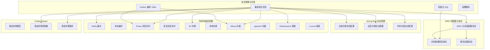
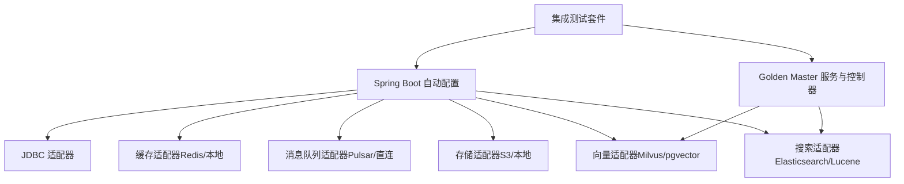
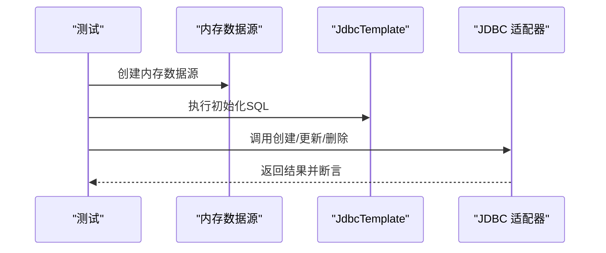
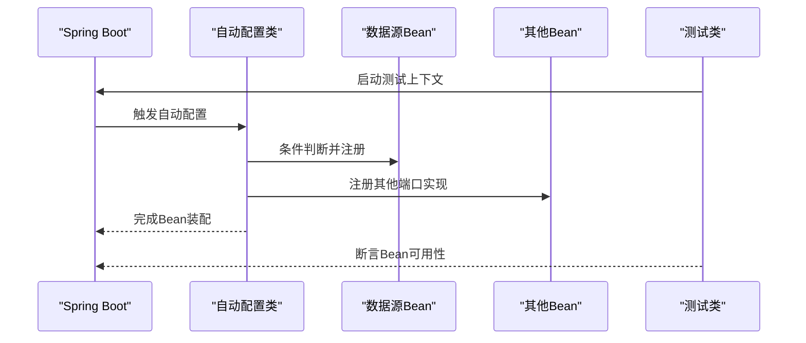
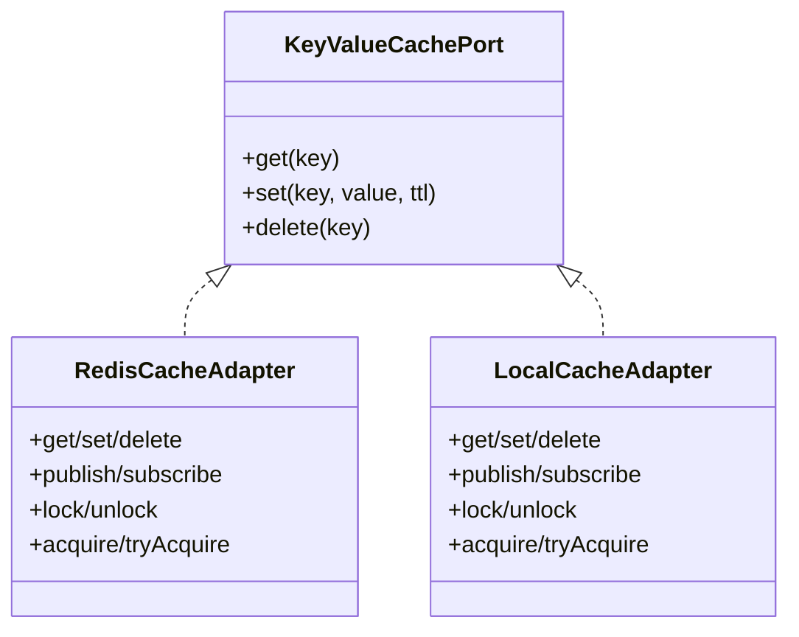
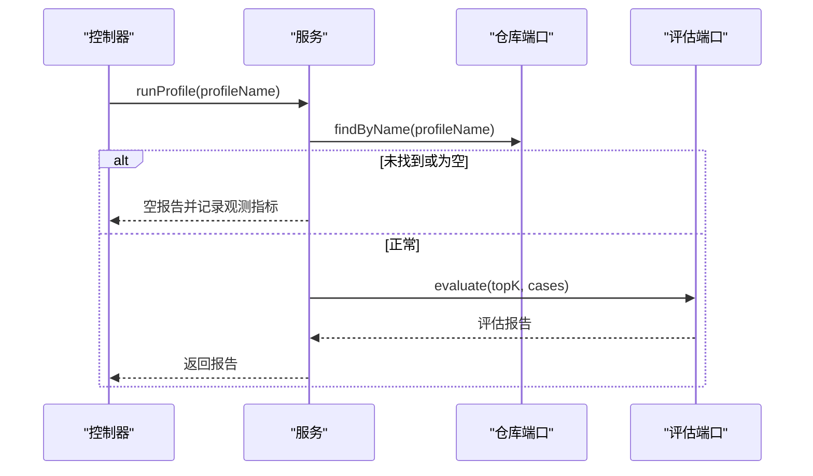
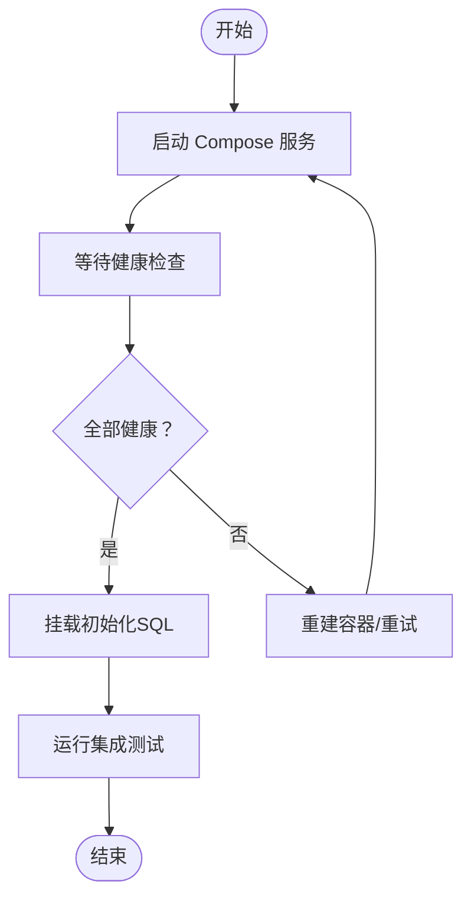
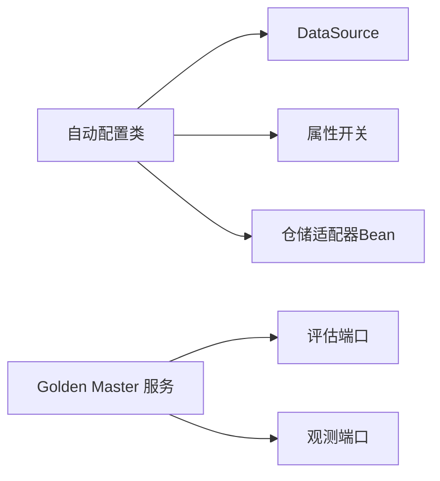

# 集成测试

<cite>
**本文引用的文件**
- [集成测试.md](file://docs/zh/content/测试策略/集成测试.md)
- [测试策略.md](file://docs/zh/content/测试策略/测试策略.md)
- [扩展加载机制.md](file://docs/zh/content/后端系统/插件系统/扩展加载机制.md)
- [application.properties](file://seahorse-agent-bootstrap/src/main/resources/application.properties)
- [pulsar-stack-3.1.3.compose.yaml](file://resources/docker/pulsar-stack-3.1.3.compose.yaml)
- [milvus-stack-2.6.6.compose.yaml](file://resources/docker/milvus-stack-2.6.6.compose.yaml)
- [milvus-stack-lightweight/README.md](file://resources/docker/lightweight/README.md)
- [seahorse_init.sql](file://resources/database/seahorse_init.sql)
- [JdbcDockerInitScriptMountTests.java](file://seahorse-agent-adapter-repository-jdbc/src/test/java/com/miracle/ai/seahorse/agent/adapters/repository/jdbc/JdbcDockerInitScriptMountTests.java)
- [JdbcSampleQuestionRepositoryAdapterTests.java](file://seahorse-agent-adapter-repository-jdbc/src/test/java/com/miracle/ai/seahorse/agent/adapters/repository/jdbc/JdbcSampleQuestionRepositoryAdapterTests.java)
- [JdbcIntentTreeRepositoryAdapterTests.java](file://seahorse-agent-adapter-repository-jdbc/src/test/java/com/miracle/ai/seahorse/agent/adapters/repository/jdbc/JdbcIntentTreeRepositoryAdapterTests.java)
- [SeahorseAgentRegistryRepositoryAutoConfiguration.java](file://seahorse-agent-spring-boot-starter/src/main/java/com/miracle/ai/seahorse/agent/adapters/spring/SeahorseAgentRegistryRepositoryAutoConfiguration.java)
- [SeahorseAgentOpsRepositoryAutoConfiguration.java](file://seahorse-agent-spring-boot-starter/src/main/java/com/miracle/ai/seahorse/agent/adapters/spring/SeahorseAgentOpsRepositoryAutoConfiguration.java)
- [SeahorseAgentMemoryRepositoryAutoConfiguration.java](file://seahorse-agent-spring-boot-starter/src/main/java/com/miracle/ai/seahorse/agent/adapters/spring/SeahorseAgentMemoryRepositoryAutoConfiguration.java)
- [SeahorseAgentCredentialAutoConfigurationTests.java](file://seahorse-agent-spring-boot-starter/src/test/java/com/miracle/ai/seahorse/agent/adapters/spring/SeahorseAgentCredentialAutoConfigurationTests.java)
- [RedisCacheAdapter.java](file://seahorse-agent-adapter-cache-redis/src/main/java/com/miracle/ai/seahorse/agent/adapters/cache/redis/RedisCacheAdapter.java)
- [LocalCacheAdapter.java](file://seahorse-agent-adapter-cache-local/src/main/java/com/miracle/ai/seahorse/agent/adapters/cache/local/LocalCacheAdapter.java)
- [KeyValueCachePort.java](file://seahorse-agent-kernel/src/main/java/com/miracle/ai/seahorse/agent/ports/outbound/cache/KeyValueCachePort.java)
- [PubSubMessage.java](file://seahorse-agent-kernel/src/main/java/com/miracle/ai/seahorse/agent/ports/outbound/cache/PubSubMessage.java)
- [PubSubMessageHandler.java](file://seahorse-agent-kernel/src/main/java/com/miracle/ai/seahorse/agent/ports/outbound/cache/PubSubMessageHandler.java)
- [SeahorseMemoryRecallGoldenHarnessController.java](file://seahorse-agent-adapter-web/src/main/java/com/miracle/ai/seahorse/agent/adapters/web/SeahorseMemoryRecallGoldenHarnessController.java)
- [MemoryRecallGoldenHarnessService.java](file://seahorse-agent-kernel/src/main/java/com/miracle/ai/seahorse/agent/kernel/application/memory/retrieval/MemoryRecallGoldenHarnessService.java)
- [MemoryRecallGoldenCase.java](file://seahorse-agent-kernel/src/main/java/com/miracle/ai/seahorse/agent/ports/inbound/memory/MemoryRecallGoldenCase.java)
- [MemoryRecallGoldenCaseProfile.java](file://seahorse-agent-kernel/src/main/java/com/miracle/ai/seahorse/agent/ports/outbound/memory/MemoryRecallGoldenCaseProfile.java)
- [MemoryRecallGoldenHarnessServiceTests.java](file://seahorse-agent-tests/src/test/java/com/miracle/ai/seahorse/agent/kernel/application/memory/retrieval/MemoryRecallGoldenHarnessServiceTests.java)
- [PulsarMessageQueueAdapter.java](file://seahorse-agent-adapter-mq-pulsar/src/main/java/com/miracle/ai/seahorse/agent/adapters/mq/pulsar/PulsarMessageQueueAdapter.java)
- [DirectMessageQueueAdapterTests.java](file://seahorse-agent-adapter-mq-direct/src/test/java/com/miracle/ai/seahorse/agent/adapters/mq/direct/DirectMessageQueueAdapterTests.java)
- [ElasticsearchKeywordIndexAdapterTests.java](file://seahorse-agent-adapter-search-elasticsearch/src/test/java/com/miracle/ai/seahorse/agent/adapters/search/elasticsearch/ElasticsearchKeywordIndexAdapterTests.java)
- [LuceneKeywordAdapterTests.java](file://seahorse-agent-adapter-search-lucene/src/test/java/com/miracle/ai/seahorse/agent/adapters/search/lucene/LuceneKeywordAdapterTests.java)
- [S3ObjectStorageAdapter.java](file://seahorse-agent-adapter-storage-s3/src/main/java/com/miracle/ai/seahorse/agent/adapters/storage/s3/S3ObjectStorageAdapter.java)
- [LocalObjectStorageAdapter.java](file://seahorse-agent-adapter-storage-local/src/main/java/com/miracle/ai/seahorse/agent/adapters/storage/local/LocalObjectStorageAdapter.java)
- [MilvusVectorAdapterTests.java](file://seahorse-agent-adapter-vector-milvus/src/test/java/com/miracle/ai/seahorse/agent/adapters/vector/milvus/MilvusVectorAdapterTests.java)
- [PgVectorAdapterTests.java](file://seahorse-agent-adapter-vector-pgvector/src/test/java/com/miracle/ai/seahorse/agent/adapters/vector/pgvector/PgVectorAdapterTests.java)
- [MicrometerObservationAdapterTests.java](file://seahorse-agent-adapter-observation-micrometer/src/test/java/com/miracle/ai/seahorse/agent/adapters/observation/micrometer/MicrometerObservationAdapterTests.java)
- [deploy.sh](file://deploy.sh)
- [redeploy.ps1](file://redeploy.ps1)
</cite>

## 目录
1. [引言](#引言)
2. [项目结构](#项目结构)
3. [核心组件](#核心组件)
4. [架构总览](#架构总览)
5. [详细组件分析](#详细组件分析)
6. [依赖关系分析](#依赖关系分析)
7. [性能考量](#性能考量)
8. [故障排查指南](#故障排查指南)
9. [结论](#结论)
10. [附录](#附录)

## 引言
本文件面向Seahorse Agent的集成测试，覆盖数据库集成测试（JDBC适配器、连接池与事务）、Spring Boot集成测试（自动配置、Bean加载、配置类）、外部系统集成测试（消息队列、缓存、存储、向量与搜索）、Golden Master测试策略（记忆召回测试、回归与冒烟测试的数据集管理）、测试环境配置与测试数据同步策略，并提供执行流程与调试方法。

## 项目结构
- 测试策略与容器编排：集成测试文档、容器编排YAML、初始化SQL、部署脚本等。
- JDBC适配器与测试：JDBC仓库适配器测试覆盖多个领域表，包含内存数据库初始化与脚本挂载校验。
- Spring Boot自动配置：基于注解条件装配的自动配置类，按属性开关启用不同适配器Bean。
- 外部系统适配器：缓存（Redis/本地）、消息队列（Pulsar/直连）、存储（S3/本地）、向量库（Milvus/pgvector）、搜索（Elasticsearch/Lucene）。
- Golden Master：记忆召回黄金用例模型、控制器与服务，支持按“配置文件”批量执行评估。
- 部署与环境：Shell/PowerShell脚本负责容器健康检查与服务重建。

**图表来源**
- [集成测试.md](file://docs/zh/content/测试策略/集成测试.md)
- [pulsar-stack-3.1.3.compose.yaml](file://resources/docker/pulsar-stack-3.1.3.compose.yaml)
- [milvus-stack-2.6.6.compose.yaml](file://resources/docker/milvus-stack-2.6.6.compose.yaml)
- [milvus-stack-lightweight/README.md](file://resources/docker/lightweight/README.md)
- [seahorse_init.sql](file://resources/database/seahorse_init.sql)
- [JdbcDockerInitScriptMountTests.java](file://seahorse-agent-adapter-repository-jdbc/src/test/java/com/miracle/ai/seahorse/agent/adapters/repository/jdbc/JdbcDockerInitScriptMountTests.java)
- [SeahorseAgentRegistryRepositoryAutoConfiguration.java](file://seahorse-agent-spring-boot-starter/src/main/java/com/miracle/ai/seahorse/agent/adapters/spring/SeahorseAgentRegistryRepositoryAutoConfiguration.java)
- [SeahorseAgentOpsRepositoryAutoConfiguration.java](file://seahorse-agent-spring-boot-starter/src/main/java/com/miracle/ai/seahorse/agent/adapters/spring/SeahorseAgentOpsRepositoryAutoConfiguration.java)
- [SeahorseAgentMemoryRepositoryAutoConfiguration.java](file://seahorse-agent-spring-boot-starter/src/main/java/com/miracle/ai/seahorse/agent/adapters/spring/SeahorseAgentMemoryRepositoryAutoConfiguration.java)
- [RedisCacheAdapter.java](file://seahorse-agent-adapter-cache-redis/src/main/java/com/miracle/ai/seahorse/agent/adapters/cache/redis/RedisCacheAdapter.java)
- [LocalCacheAdapter.java](file://seahorse-agent-adapter-cache-local/src/main/java/com/miracle/ai/seahorse/agent/adapters/cache/local/LocalCacheAdapter.java)
- [PulsarMessageQueueAdapter.java](file://seahorse-agent-adapter-mq-pulsar/src/main/java/com/miracle/ai/seahorse/agent/adapters/mq/pulsar/PulsarMessageQueueAdapter.java)
- [DirectMessageQueueAdapterTests.java](file://seahorse-agent-adapter-mq-direct/src/test/java/com/miracle/ai/seahorse/agent/adapters/mq/direct/DirectMessageQueueAdapterTests.java)
- [S3ObjectStorageAdapter.java](file://seahorse-agent-adapter-storage-s3/src/main/java/com/miracle/ai/seahorse/agent/adapters/storage/s3/S3ObjectStorageAdapter.java)
- [LocalObjectStorageAdapter.java](file://seahorse-agent-adapter-storage-local/src/main/java/com/miracle/ai/seahorse/agent/adapters/storage/local/LocalObjectStorageAdapter.java)
- [MilvusVectorAdapterTests.java](file://seahorse-agent-adapter-vector-milvus/src/test/java/com/miracle/ai/seahorse/agent/adapters/vector/milvus/MilvusVectorAdapterTests.java)
- [PgVectorAdapterTests.java](file://seahorse-agent-adapter-vector-pgvector/src/test/java/com/miracle/ai/seahorse/agent/adapters/vector/pgvector/PgVectorAdapterTests.java)
- [ElasticsearchKeywordIndexAdapterTests.java](file://seahorse-agent-adapter-search-elasticsearch/src/test/java/com/miracle/ai/seahorse/agent/adapters/search/elasticsearch/ElasticsearchKeywordIndexAdapterTests.java)
- [LuceneKeywordAdapterTests.java](file://seahorse-agent-adapter-search-lucene/src/test/java/com/miracle/ai/seahorse/agent/adapters/search/lucene/LuceneKeywordAdapterTests.java)
- [SeahorseMemoryRecallGoldenHarnessController.java](file://seahorse-agent-adapter-web/src/main/java/com/miracle/ai/seahorse/agent/adapters/web/SeahorseMemoryRecallGoldenHarnessController.java)
- [MemoryRecallGoldenHarnessService.java](file://seahorse-agent-kernel/src/main/java/com/miracle/ai/seahorse/agent/kernel/application/memory/retrieval/MemoryRecallGoldenHarnessService.java)
- [MemoryRecallGoldenCase.java](file://seahorse-agent-kernel/src/main/java/com/miracle/ai/seahorse/agent/ports/inbound/memory/MemoryRecallGoldenCase.java)
- [MemoryRecallGoldenCaseProfile.java](file://seahorse-agent-kernel/src/main/java/com/miracle/ai/seahorse/agent/ports/outbound/memory/MemoryRecallGoldenCaseProfile.java)

**章节来源**
- [集成测试.md](file://docs/zh/content/测试策略/集成测试.md)
- [pulsar-stack-3.1.3.compose.yaml](file://resources/docker/pulsar-stack-3.1.3.compose.yaml)
- [milvus-stack-2.6.6.compose.yaml](file://resources/docker/milvus-stack-2.6.6.compose.yaml)
- [milvus-stack-lightweight/README.md](file://resources/docker/lightweight/README.md)
- [seahorse_init.sql](file://resources/database/seahorse_init.sql)

## 核心组件
- 数据库集成测试（JDBC）
  - 使用内存数据库进行快速集成测试，覆盖样本问题、意图树等多类仓储操作。
  - 通过脚本挂载测试确保容器化初始化SQL正确合并与挂载。
- Spring Boot集成测试
  - 基于条件注解的自动配置类，按属性开关启用不同仓储适配器Bean。
  - 测试中通过内存数据源与用户上下文Bean验证自动装配行为。
- 外部系统集成测试
  - 缓存：Redis与本地缓存适配器均实现键值缓存、发布订阅、分布式锁与限流接口。
  - 消息队列：Pulsar适配器与直连适配器分别用于生产/消费消息。
  - 存储：S3与本地对象存储适配器满足不同部署场景。
  - 向量与搜索：Milvus与pgvector适配器，Elasticsearch与Lucene适配器。
- Golden Master测试
  - 黄金用例模型定义用例标识、用户、会话、查询与期望命中记忆ID集合。
  - 控制器与服务提供按“配置文件”批量执行评估的能力，并输出观测指标。

**章节来源**
- [JdbcSampleQuestionRepositoryAdapterTests.java](file://seahorse-agent-adapter-repository-jdbc/src/test/java/com/miracle/ai/seahorse/agent/adapters/repository/jdbc/JdbcSampleQuestionRepositoryAdapterTests.java)
- [JdbcIntentTreeRepositoryAdapterTests.java](file://seahorse-agent-adapter-repository-jdbc/src/test/java/com/miracle/ai/seahorse/agent/adapters/repository/jdbc/JdbcIntentTreeRepositoryAdapterTests.java)
- [JdbcDockerInitScriptMountTests.java](file://seahorse-agent-adapter-repository-jdbc/src/test/java/com/miracle/ai/seahorse/agent/adapters/repository/jdbc/JdbcDockerInitScriptMountTests.java)
- [SeahorseAgentRegistryRepositoryAutoConfiguration.java](file://seahorse-agent-spring-boot-starter/src/main/java/com/miracle/ai/seahorse/agent/adapters/spring/SeahorseAgentRegistryRepositoryAutoConfiguration.java)
- [SeahorseAgentOpsRepositoryAutoConfiguration.java](file://seahorse-agent-spring-boot-starter/src/main/java/com/miracle/ai/seahorse/agent/adapters/spring/SeahorseAgentOpsRepositoryAutoConfiguration.java)
- [SeahorseAgentMemoryRepositoryAutoConfiguration.java](file://seahorse-agent-spring-boot-starter/src/main/java/com/miracle/ai/seahorse/agent/adapters/spring/SeahorseAgentMemoryRepositoryAutoConfiguration.java)
- [SeahorseAgentCredentialAutoConfigurationTests.java](file://seahorse-agent-spring-boot-starter/src/test/java/com/miracle/ai/seahorse/agent/adapters/spring/SeahorseAgentCredentialAutoConfigurationTests.java)
- [RedisCacheAdapter.java](file://seahorse-agent-adapter-cache-redis/src/main/java/com/miracle/ai/seahorse/agent/adapters/cache/redis/RedisCacheAdapter.java)
- [LocalCacheAdapter.java](file://seahorse-agent-adapter-cache-local/src/main/java/com/miracle/ai/seahorse/agent/adapters/cache/local/LocalCacheAdapter.java)
- [KeyValueCachePort.java](file://seahorse-agent-kernel/src/main/java/com/miracle/ai/seahorse/agent/ports/outbound/cache/KeyValueCachePort.java)
- [PubSubMessage.java](file://seahorse-agent-kernel/src/main/java/com/miracle/ai/seahorse/agent/ports/outbound/cache/PubSubMessage.java)
- [PubSubMessageHandler.java](file://seahorse-agent-kernel/src/main/java/com/miracle/ai/seahorse/agent/ports/outbound/cache/PubSubMessageHandler.java)
- [SeahorseMemoryRecallGoldenHarnessController.java](file://seahorse-agent-adapter-web/src/main/java/com/miracle/ai/seahorse/agent/adapters/web/SeahorseMemoryRecallGoldenHarnessController.java)
- [MemoryRecallGoldenHarnessService.java](file://seahorse-agent-kernel/src/main/java/com/miracle/ai/seahorse/agent/kernel/application/memory/retrieval/MemoryRecallGoldenHarnessService.java)
- [MemoryRecallGoldenCase.java](file://seahorse-agent-kernel/src/main/java/com/miracle/ai/seahorse/agent/ports/inbound/memory/MemoryRecallGoldenCase.java)
- [MemoryRecallGoldenCaseProfile.java](file://seahorse-agent-kernel/src/main/java/com/miracle/ai/seahorse/agent/ports/outbound/memory/MemoryRecallGoldenCaseProfile.java)

## 架构总览
下图展示集成测试涉及的关键组件交互：测试驱动外部系统（数据库、消息队列、缓存、存储、向量/搜索），并通过Spring Boot自动配置注入Bean；Golden Master通过控制器与服务执行评估并输出观测结果。

**图表来源**
- [SeahorseAgentRegistryRepositoryAutoConfiguration.java](file://seahorse-agent-spring-boot-starter/src/main/java/com/miracle/ai/seahorse/agent/adapters/spring/SeahorseAgentRegistryRepositoryAutoConfiguration.java)
- [SeahorseAgentOpsRepositoryAutoConfiguration.java](file://seahorse-agent-spring-boot-starter/src/main/java/com/miracle/ai/seahorse/agent/adapters/spring/SeahorseAgentOpsRepositoryAutoConfiguration.java)
- [SeahorseAgentMemoryRepositoryAutoConfiguration.java](file://seahorse-agent-spring-boot-starter/src/main/java/com/miracle/ai/seahorse/agent/adapters/spring/SeahorseAgentMemoryRepositoryAutoConfiguration.java)
- [RedisCacheAdapter.java](file://seahorse-agent-adapter-cache-redis/src/main/java/com/miracle/ai/seahorse/agent/adapters/cache/redis/RedisCacheAdapter.java)
- [LocalCacheAdapter.java](file://seahorse-agent-adapter-cache-local/src/main/java/com/miracle/ai/seahorse/agent/adapters/cache/local/LocalCacheAdapter.java)
- [PulsarMessageQueueAdapter.java](file://seahorse-agent-adapter-mq-pulsar/src/main/java/com/miracle/ai/seahorse/agent/adapters/mq/pulsar/PulsarMessageQueueAdapter.java)
- [DirectMessageQueueAdapterTests.java](file://seahorse-agent-adapter-mq-direct/src/test/java/com/miracle/ai/seahorse/agent/adapters/mq/direct/DirectMessageQueueAdapterTests.java)
- [S3ObjectStorageAdapter.java](file://seahorse-agent-adapter-storage-s3/src/main/java/com/miracle/ai/seahorse/agent/adapters/storage/s3/S3ObjectStorageAdapter.java)
- [LocalObjectStorageAdapter.java](file://seahorse-agent-adapter-storage-local/src/main/java/com/miracle/ai/seahorse/agent/adapters/storage/local/LocalObjectStorageAdapter.java)
- [MilvusVectorAdapterTests.java](file://seahorse-agent-adapter-vector-milvus/src/test/java/com/miracle/ai/seahorse/agent/adapters/vector/milvus/MilvusVectorAdapterTests.java)
- [PgVectorAdapterTests.java](file://seahorse-agent-adapter-vector-pgvector/src/test/java/com/miracle/ai/seahorse/agent/adapters/vector/pgvector/PgVectorAdapterTests.java)
- [ElasticsearchKeywordIndexAdapterTests.java](file://seahorse-agent-adapter-search-elasticsearch/src/test/java/com/miracle/ai/seahorse/agent/adapters/search/elasticsearch/ElasticsearchKeywordIndexAdapterTests.java)
- [LuceneKeywordAdapterTests.java](file://seahorse-agent-adapter-search-lucene/src/test/java/com/miracle/ai/seahorse/agent/adapters/search/lucene/LuceneKeywordAdapterTests.java)
- [SeahorseMemoryRecallGoldenHarnessController.java](file://seahorse-agent-adapter-web/src/main/java/com/miracle/ai/seahorse/agent/adapters/web/SeahorseMemoryRecallGoldenHarnessController.java)
- [MemoryRecallGoldenHarnessService.java](file://seahorse-agent-kernel/src/main/java/com/miracle/ai/seahorse/agent/kernel/application/memory/retrieval/MemoryRecallGoldenHarnessService.java)

## 详细组件分析

### 数据库集成测试（JDBC）
- 测试模式
  - 使用内存数据库（如H2）初始化Schema，执行创建、更新、删除等典型CRUD操作，验证适配器行为。
  - 通过脚本挂载测试确保Docker Compose中仅挂载整合后的初始化SQL，避免重复或遗漏。
- 关键点
  - 内存数据库速度快，适合集成测试；注意与生产SQL方言差异，必要时调整兼容模式。
  - 初始化脚本集中管理，便于一致性校验与CI复现。

**图表来源**
- [JdbcSampleQuestionRepositoryAdapterTests.java](file://seahorse-agent-adapter-repository-jdbc/src/test/java/com/miracle/ai/seahorse/agent/adapters/repository/jdbc/JdbcSampleQuestionRepositoryAdapterTests.java)
- [JdbcIntentTreeRepositoryAdapterTests.java](file://seahorse-agent-adapter-repository-jdbc/src/test/java/com/miracle/ai/seahorse/agent/adapters/repository/jdbc/JdbcIntentTreeRepositoryAdapterTests.java)
- [JdbcDockerInitScriptMountTests.java](file://seahorse-agent-adapter-repository-jdbc/src/test/java/com/miracle/ai/seahorse/agent/adapters/repository/jdbc/JdbcDockerInitScriptMountTests.java)
- [seahorse_init.sql](file://resources/database/seahorse_init.sql)

**章节来源**
- [JdbcSampleQuestionRepositoryAdapterTests.java](file://seahorse-agent-adapter-repository-jdbc/src/test/java/com/miracle/ai/seahorse/agent/adapters/repository/jdbc/JdbcSampleQuestionRepositoryAdapterTests.java)
- [JdbcIntentTreeRepositoryAdapterTests.java](file://seahorse-agent-adapter-repository-jdbc/src/test/java/com/miracle/ai/seahorse/agent/adapters/repository/jdbc/JdbcIntentTreeRepositoryAdapterTests.java)
- [JdbcDockerInitScriptMountTests.java](file://seahorse-agent-adapter-repository-jdbc/src/test/java/com/miracle/ai/seahorse/agent/adapters/repository/jdbc/JdbcDockerInitScriptMountTests.java)

### Spring Boot集成测试（自动配置、Bean加载、配置类）
- 自动配置机制
  - 基于条件注解（如存在DataSource、属性开关、缺失Bean）按需注册仓储适配器Bean。
  - 通过测试类提供内存数据源与当前用户上下文Bean，验证自动装配逻辑。
- 测试建议
  - 使用@SpringBootTest加载完整上下文，结合@AutoConfigureTestDatabase切换内存库。
  - 使用@Import引入特定配置类，控制Bean注入范围。

**图表来源**
- [SeahorseAgentRegistryRepositoryAutoConfiguration.java](file://seahorse-agent-spring-boot-starter/src/main/java/com/miracle/ai/seahorse/agent/adapters/spring/SeahorseAgentRegistryRepositoryAutoConfiguration.java)
- [SeahorseAgentOpsRepositoryAutoConfiguration.java](file://seahorse-agent-spring-boot-starter/src/main/java/com/miracle/ai/seahorse/agent/adapters/spring/SeahorseAgentOpsRepositoryAutoConfiguration.java)
- [SeahorseAgentMemoryRepositoryAutoConfiguration.java](file://seahorse-agent-spring-boot-starter/src/main/java/com/miracle/ai/seahorse/agent/adapters/spring/SeahorseAgentMemoryRepositoryAutoConfiguration.java)
- [SeahorseAgentCredentialAutoConfigurationTests.java](file://seahorse-agent-spring-boot-starter/src/test/java/com/miracle/ai/seahorse/agent/adapters/spring/SeahorseAgentCredentialAutoConfigurationTests.java)

**章节来源**
- [SeahorseAgentRegistryRepositoryAutoConfiguration.java](file://seahorse-agent-spring-boot-starter/src/main/java/com/miracle/ai/seahorse/agent/adapters/spring/SeahorseAgentRegistryRepositoryAutoConfiguration.java)
- [SeahorseAgentOpsRepositoryAutoConfiguration.java](file://seahorse-agent-spring-boot-starter/src/main/java/com/miracle/ai/seahorse/agent/adapters/spring/SeahorseAgentOpsRepositoryAutoConfiguration.java)
- [SeahorseAgentMemoryRepositoryAutoConfiguration.java](file://seahorse-agent-spring-boot-starter/src/main/java/com/miracle/ai/seahorse/agent/adapters/spring/SeahorseAgentMemoryRepositoryAutoConfiguration.java)
- [SeahorseAgentCredentialAutoConfigurationTests.java](file://seahorse-agent-spring-boot-starter/src/test/java/com/miracle/ai/seahorse/agent/adapters/spring/SeahorseAgentCredentialAutoConfigurationTests.java)

### 外部系统集成测试（消息队列、缓存、存储）
- 缓存系统
  - Redis适配器：基于Redisson实现键值缓存、发布订阅、分布式锁与限流。
  - 本地适配器：单JVM内存实现，适合本地开发与单节点部署。
- 消息队列
  - Pulsar适配器：封装消息封装、属性与消费者端口。
  - 直连适配器：简单消息队列实现，便于快速验证。
- 存储系统
  - S3适配器：对象存储客户端封装。
  - 本地适配器：文件系统存储。

**图表来源**
- [KeyValueCachePort.java](file://seahorse-agent-kernel/src/main/java/com/miracle/ai/seahorse/agent/ports/outbound/cache/KeyValueCachePort.java)
- [RedisCacheAdapter.java](file://seahorse-agent-adapter-cache-redis/src/main/java/com/miracle/ai/seahorse/agent/adapters/cache/redis/RedisCacheAdapter.java)
- [LocalCacheAdapter.java](file://seahorse-agent-adapter-cache-local/src/main/java/com/miracle/ai/seahorse/agent/adapters/cache/local/LocalCacheAdapter.java)

**章节来源**
- [RedisCacheAdapter.java](file://seahorse-agent-adapter-cache-redis/src/main/java/com/miracle/ai/seahorse/agent/adapters/cache/redis/RedisCacheAdapter.java)
- [LocalCacheAdapter.java](file://seahorse-agent-adapter-cache-local/src/main/java/com/miracle/ai/seahorse/agent/adapters/cache/local/LocalCacheAdapter.java)
- [KeyValueCachePort.java](file://seahorse-agent-kernel/src/main/java/com/miracle/ai/seahorse/agent/ports/outbound/cache/KeyValueCachePort.java)
- [PubSubMessage.java](file://seahorse-agent-kernel/src/main/java/com/miracle/ai/seahorse/agent/ports/outbound/cache/PubSubMessage.java)
- [PubSubMessageHandler.java](file://seahorse-agent-kernel/src/main/java/com/miracle/ai/seahorse/agent/ports/outbound/cache/PubSubMessageHandler.java)
- [PulsarMessageQueueAdapter.java](file://seahorse-agent-adapter-mq-pulsar/src/main/java/com/miracle/ai/seahorse/agent/adapters/mq/pulsar/PulsarMessageQueueAdapter.java)
- [DirectMessageQueueAdapterTests.java](file://seahorse-agent-adapter-mq-direct/src/test/java/com/miracle/ai/seahorse/agent/adapters/mq/direct/DirectMessageQueueAdapterTests.java)
- [S3ObjectStorageAdapter.java](file://seahorse-agent-adapter-storage-s3/src/main/java/com/miracle/ai/seahorse/agent/adapters/storage/s3/S3ObjectStorageAdapter.java)
- [LocalObjectStorageAdapter.java](file://seahorse-agent-adapter-storage-local/src/main/java/com/miracle/ai/seahorse/agent/adapters/storage/local/LocalObjectStorageAdapter.java)

### Golden Master测试策略（记忆召回、回归与冒烟）
- 数据集管理
  - 黄金用例模型包含用例ID、用户ID、会话ID、查询与期望命中记忆ID列表。
  - 配置文件（Profile）包含名称、默认topK与用例集合，支持多套配置并行维护。
- 执行流程
  - 控制器接收HTTP请求，解析profileName并委托服务执行评估。
  - 服务根据仓库端口查找配置文件，若不存在或为空则记录观测指标并返回空报告。
  - 正常情况下将用例集合与topK传给评估端口，产出评估报告。

**图表来源**
- [SeahorseMemoryRecallGoldenHarnessController.java](file://seahorse-agent-adapter-web/src/main/java/com/miracle/ai/seahorse/agent/adapters/web/SeahorseMemoryRecallGoldenHarnessController.java)
- [MemoryRecallGoldenHarnessService.java](file://seahorse-agent-kernel/src/main/java/com/miracle/ai/seahorse/agent/kernel/application/memory/retrieval/MemoryRecallGoldenHarnessService.java)
- [MemoryRecallGoldenCase.java](file://seahorse-agent-kernel/src/main/java/com/miracle/ai/seahorse/agent/ports/inbound/memory/MemoryRecallGoldenCase.java)
- [MemoryRecallGoldenCaseProfile.java](file://seahorse-agent-kernel/src/main/java/com/miracle/ai/seahorse/agent/ports/outbound/memory/MemoryRecallGoldenCaseProfile.java)

**章节来源**
- [SeahorseMemoryRecallGoldenHarnessController.java](file://seahorse-agent-adapter-web/src/main/java/com/miracle/ai/seahorse/agent/adapters/web/SeahorseMemoryRecallGoldenHarnessController.java)
- [MemoryRecallGoldenHarnessService.java](file://seahorse-agent-kernel/src/main/java/com/miracle/ai/seahorse/agent/kernel/application/memory/retrieval/MemoryRecallGoldenHarnessService.java)
- [MemoryRecallGoldenCase.java](file://seahorse-agent-kernel/src/main/java/com/miracle/ai/seahorse/agent/ports/inbound/memory/MemoryRecallGoldenCase.java)
- [MemoryRecallGoldenCaseProfile.java](file://seahorse-agent-kernel/src/main/java/com/miracle/ai/seahorse/agent/ports/outbound/memory/MemoryRecallGoldenCaseProfile.java)
- [MemoryRecallGoldenHarnessServiceTests.java](file://seahorse-agent-tests/src/test/java/com/miracle/ai/seahorse/agent/kernel/application/memory/retrieval/MemoryRecallGoldenHarnessServiceTests.java)

### 测试环境配置与测试数据同步策略
- 容器编排与初始化
  - 使用Compose文件启动Pulsar、Milvus等外部依赖，确保测试前环境就绪。
  - 初始化SQL统一挂载至数据库容器，避免分散脚本导致的不一致。
- 健康检查与重建
  - 部署脚本等待各服务健康状态，超时则提示问题。
  - 通过脚本重建容器并查看日志，辅助问题定位。

**图表来源**
- [pulsar-stack-3.1.3.compose.yaml](file://resources/docker/pulsar-stack-3.1.3.compose.yaml)
- [milvus-stack-2.6.6.compose.yaml](file://resources/docker/milvus-stack-2.6.6.compose.yaml)
- [milvus-stack-lightweight/README.md](file://resources/docker/lightweight/README.md)
- [seahorse_init.sql](file://resources/database/seahorse_init.sql)
- [deploy.sh](file://deploy.sh)
- [redeploy.ps1](file://redeploy.ps1)

**章节来源**
- [pulsar-stack-3.1.3.compose.yaml](file://resources/docker/pulsar-stack-3.1.3.compose.yaml)
- [milvus-stack-2.6.6.compose.yaml](file://resources/docker/milvus-stack-2.6.6.compose.yaml)
- [milvus-stack-lightweight/README.md](file://resources/docker/lightweight/README.md)
- [seahorse_init.sql](file://resources/database/seahorse_init.sql)
- [deploy.sh](file://deploy.sh)
- [redeploy.ps1](file://redeploy.ps1)

## 依赖关系分析
- Spring Boot自动配置类对DataSource与属性开关敏感，确保在存在数据源且类型为jdbc时才注册JDBC仓储适配器Bean。
- Golden Master服务依赖评估端口与可选观测端口，通过观测指标区分成功/缺失/空三种结果，便于CI告警。

**图表来源**
- [SeahorseAgentRegistryRepositoryAutoConfiguration.java](file://seahorse-agent-spring-boot-starter/src/main/java/com/miracle/ai/seahorse/agent/adapters/spring/SeahorseAgentRegistryRepositoryAutoConfiguration.java)
- [SeahorseAgentOpsRepositoryAutoConfiguration.java](file://seahorse-agent-spring-boot-starter/src/main/java/com/miracle/ai/seahorse/agent/adapters/spring/SeahorseAgentOpsRepositoryAutoConfiguration.java)
- [SeahorseAgentMemoryRepositoryAutoConfiguration.java](file://seahorse-agent-spring-boot-starter/src/main/java/com/miracle/ai/seahorse/agent/adapters/spring/SeahorseAgentMemoryRepositoryAutoConfiguration.java)
- [MemoryRecallGoldenHarnessService.java](file://seahorse-agent-kernel/src/main/java/com/miracle/ai/seahorse/agent/kernel/application/memory/retrieval/MemoryRecallGoldenHarnessService.java)

**章节来源**
- [SeahorseAgentRegistryRepositoryAutoConfiguration.java](file://seahorse-agent-spring-boot-starter/src/main/java/com/miracle/ai/seahorse/agent/adapters/spring/SeahorseAgentRegistryRepositoryAutoConfiguration.java)
- [SeahorseAgentOpsRepositoryAutoConfiguration.java](file://seahorse-agent-spring-boot-starter/src/main/java/com/miracle/ai/seahorse/agent/adapters/spring/SeahorseAgentOpsRepositoryAutoConfiguration.java)
- [SeahorseAgentMemoryRepositoryAutoConfiguration.java](file://seahorse-agent-spring-boot-starter/src/main/java/com/miracle/ai/seahorse/agent/adapters/spring/SeahorseAgentMemoryRepositoryAutoConfiguration.java)
- [MemoryRecallGoldenHarnessService.java](file://seahorse-agent-kernel/src/main/java/com/miracle/ai/seahorse/agent/kernel/application/memory/retrieval/MemoryRecallGoldenHarnessService.java)

## 性能考量
- 内存数据库优先：在集成测试中优先使用内存数据库（如H2），显著降低I/O与启动时间。
- 外部依赖容器化：通过Compose统一编排，减少手工配置成本，提高可重复性。
- 观测指标：Golden Master服务输出观测事件，便于CI中识别配置文件缺失或空配置导致的异常。

## 故障排查指南
- 容器健康检查失败
  - 使用部署脚本等待服务健康状态，若超时检查容器日志与端口映射。
- 初始化SQL未生效
  - 校验Compose文件中SQL挂载路径与只读权限，确保仅挂载整合后的初始化脚本。
- 自动配置未生效
  - 检查属性开关与DataSource Bean是否存在，确认条件注解匹配。
- Golden Master报告为空
  - 检查配置文件是否存在于仓库端口，或是否为空；服务会记录缺失/空观测指标。

**章节来源**
- [deploy.sh](file://deploy.sh)
- [redeploy.ps1](file://redeploy.ps1)
- [JdbcDockerInitScriptMountTests.java](file://seahorse-agent-adapter-repository-jdbc/src/test/java/com/miracle/ai/seahorse/agent/adapters/repository/jdbc/JdbcDockerInitScriptMountTests.java)
- [SeahorseAgentCredentialAutoConfigurationTests.java](file://seahorse-agent-spring-boot-starter/src/test/java/com/miracle/ai/seahorse/agent/adapters/spring/SeahorseAgentCredentialAutoConfigurationTests.java)
- [MemoryRecallGoldenHarnessService.java](file://seahorse-agent-kernel/src/main/java/com/miracle/ai/seahorse/agent/kernel/application/memory/retrieval/MemoryRecallGoldenHarnessService.java)

## 结论
本文从测试策略、组件实现与环境配置三个维度梳理了Seahorse Agent的集成测试实践，重点覆盖数据库、Spring Boot自动装配、外部系统适配器以及Golden Master测试。通过容器化编排、内存数据库与观测指标，能够高效稳定地执行端到端集成测试，并在CI中及时发现配置与数据一致性问题。

## 附录
- 测试注解与配置建议
  - @SpringBootTest：加载完整应用上下文，适用于需要真实Bean与自动装配的集成测试。
  - @AutoConfigureTestDatabase：在测试中切换到内存数据库（如H2），提升执行速度。
  - @Import：引入特定配置类或测试专用自动装配，控制测试上下文的Bean注入。
- 工具选型
  - REST Assured：适合端到端API测试与外部服务联调。
  - MockMvc：适合控制器层契约测试与请求处理链路验证。
- 外部服务编排
  - Pulsar：使用Compose文件启动ZooKeeper、Bookie、Broker与初始化脚本。
  - Milvus：使用Compose文件启动etcd、RustFS与Milvus Standalone。
  - PostgreSQL：可在测试中使用内存数据库或容器化PostgreSQL进行集成测试。

**章节来源**
- [集成测试.md](file://docs/zh/content/测试策略/集成测试.md)
- [application.properties](file://seahorse-agent-bootstrap/src/main/resources/application.properties)