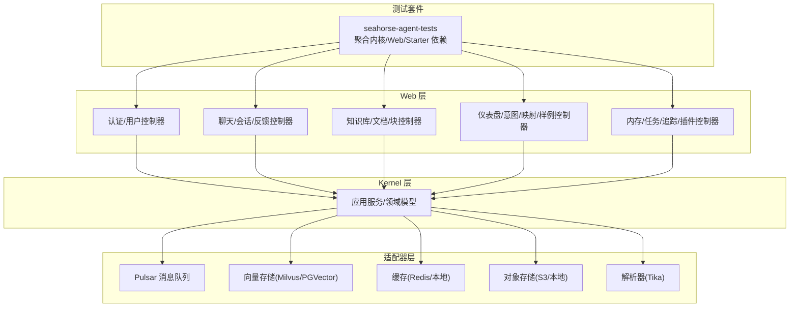
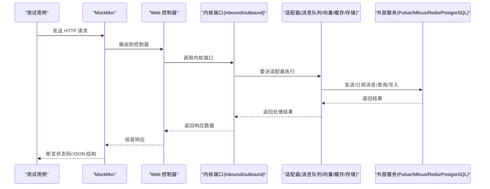
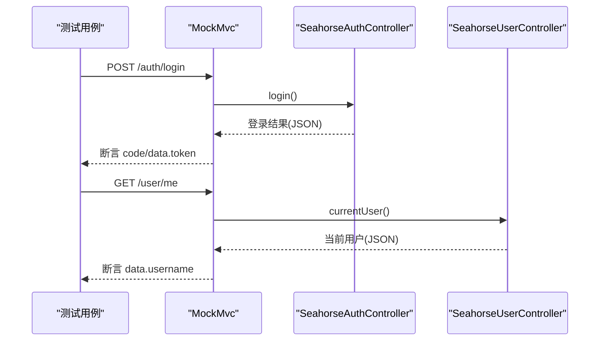
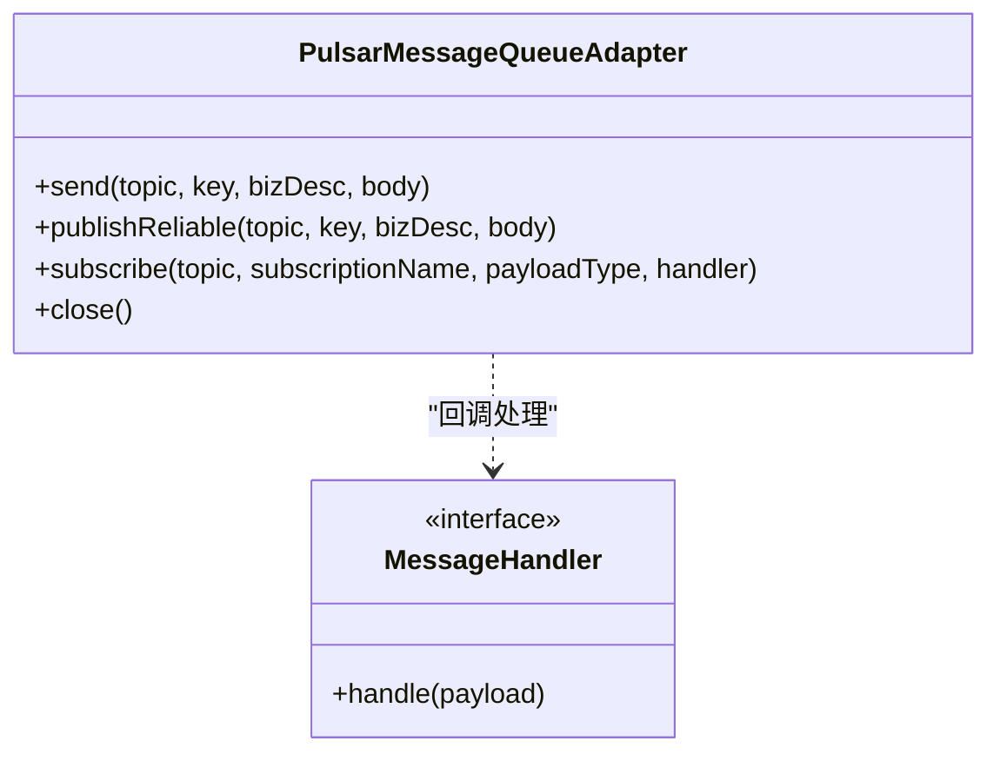
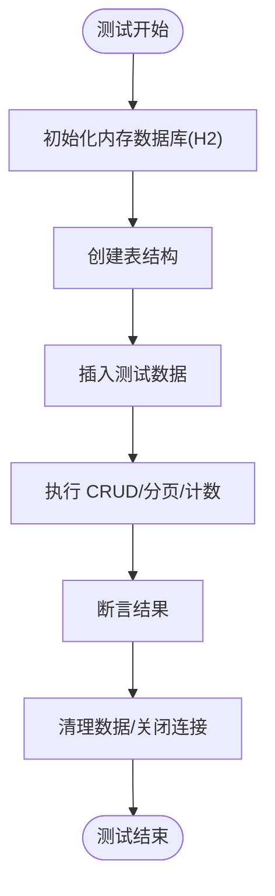
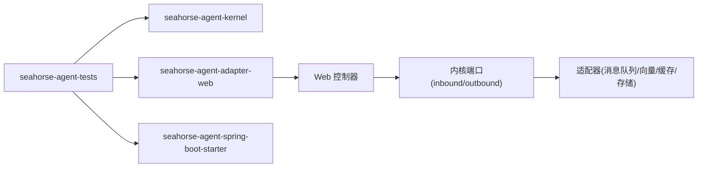

# 集成测试

<cite>
**本文引用的文件**   
- [seahorse-agent-tests/pom.xml](file://seahorse-agent-tests/pom.xml)
- [seahorse-agent-tests/src/test/java/com/miracle/ai/seahorse/agent/adapters/web/SeahorseWebApiContractTests.java](file://seahorse-agent-tests/src/test/java/com/miracle/ai/seahorse/agent/adapters/web/SeahorseWebApiContractTests.java)
- [seahorse-agent-adapter-web/src/main/java/com/miracle/ai/seahorse/agent/adapters/web/SeahorseChatController.java](file://seahorse-agent-adapter-web/src/main/java/com/miracle/ai/seahorse/agent/adapters/web/SeahorseChatController.java)
- [seahorse-agent-adapter-web/src/main/java/com/miracle/ai/seahorse/agent/adapters/web/SeahorseKnowledgeBaseController.java](file://seahorse-agent-adapter-web/src/main/java/com/miracle/ai/seahorse/agent/adapters/web/SeahorseKnowledgeBaseController.java)
- [seahorse-agent-adapter-web/src/main/java/com/miracle/ai/seahorse/agent/adapters/web/SeahorseAuthController.java](file://seahorse-agent-adapter-web/src/main/java/com/miracle/ai/seahorse/agent/adapters/web/SeahorseAuthController.java)
- [seahorse-agent-adapter-web/src/main/java/com/miracle/ai/seahorse/agent/adapters/web/SeahorseUserController.java](file://seahorse-agent-adapter-web/src/main/java/com/miracle/ai/seahorse/agent/adapters/web/SeahorseUserController.java)
- [seahorse-agent-adapter-web/src/main/java/com/miracle/ai/seahorse/agent/adapters/web/SeahorseKnowledgeDocumentController.java](file://seahorse-agent-adapter-web/src/main/java/com/miracle/ai/seahorse/agent/adapters/web/SeahorseKnowledgeDocumentController.java)
- [seahorse-agent-adapter-web/src/main/java/com/miracle/ai/seahorse/agent/adapters/web/SeahorseKnowledgeChunkController.java](file://seahorse-agent-adapter-web/src/main/java/com/miracle/ai/seahorse/agent/adapters/web/SeahorseKnowledgeChunkController.java)
- [seahorse-agent-adapter-web/src/main/java/com/miracle/ai/seahorse/agent/adapters/web/SeahorseConversationController.java](file://seahorse-agent-adapter-web/src/main/java/com/miracle/ai/seahorse/agent/adapters/web/SeahorseConversationController.java)
- [seahorse-agent-adapter-web/src/main/java/com/miracle/ai/seahorse/agent/adapters/web/SeahorseMessageFeedbackController.java](file://seahorse-agent-adapter-web/src/main/java/com/miracle/ai/seahorse/agent/adapters/web/SeahorseMessageFeedbackController.java)
- [seahorse-agent-adapter-web/src/main/java/com/miracle/ai/seahorse/agent/adapters/web/SeahorseDashboardController.java](file://seahorse-agent-adapter-web/src/main/java/com/miracle/ai/seahorse/agent/adapters/web/SeahorseDashboardController.java)
- [seahorse-agent-adapter-web/src/main/java/com/miracle/ai/seahorse/agent/adapters/web/SeahorseIntentTreeController.java](file://seahorse-agent-adapter-web/src/main/java/com/miracle/ai/seahorse/agent/adapters/web/SeahorseIntentTreeController.java)
- [seahorse-agent-adapter-web/src/main/java/com/miracle/ai/seahorse/agent/adapters/web/SeahorseQueryTermMappingController.java](file://seahorse-agent-adapter-web/src/main/java/com/miracle/ai/seahorse/agent/adapters/web/SeahorseQueryTermMappingController.java)
- [seahorse-agent-adapter-web/src/main/java/com/miracle/ai/seahorse/agent/adapters/web/SeahorseSampleQuestionController.java](file://seahorse-agent-adapter-web/src/main/java/com/miracle/ai/seahorse/agent/adapters/web/SeahorseSampleQuestionController.java)
- [seahorse-agent-adapter-web/src/main/java/com/miracle/ai/seahorse/agent/adapters/web/SeahorseRagSettingsController.java](file://seahorse-agent-adapter-web/src/main/java/com/miracle/ai/seahorse/agent/adapters/web/SeahorseRagSettingsController.java)
- [seahorse-agent-adapter-web/src/main/java/com/miracle/ai/seahorse/agent/adapters/web/SeahorseMemoryController.java](file://seahorse-agent-adapter-web/src/main/java/com/miracle/ai/seahorse/agent/adapters/web/SeahorseMemoryController.java)
- [seahorse-agent-adapter-web/src/main/java/com/miracle/ai/seahorse/agent/adapters/web/SeahorseIngestionTaskController.java](file://seahorse-agent-adapter-web/src/main/java/com/miracle/ai/seahorse/agent/adapters/web/SeahorseIngestionTaskController.java)
- [seahorse-agent-adapter-web/src/main/java/com/miracle/ai/seahorse/agent/adapters/web/SeahorseRagTraceController.java](file://seahorse-agent-adapter-web/src/main/java/com/miracle/ai/seahorse/agent/adapters/web/SeahorseRagTraceController.java)
- [seahorse-agent-adapter-web/src/main/java/com/miracle/ai/seahorse/agent/adapters/web/SeahorsePluginController.java](file://seahorse-agent-adapter-web/src/main/java/com/miracle/ai/seahorse/agent/adapters/web/SeahorsePluginController.java)
- [seahorse-agent-adapter-mq-pulsar/src/main/java/com/miracle/ai/seahorse/agent/adapters/mq/pulsar/PulsarMessageQueueAdapter.java](file://seahorse-agent-adapter-mq-pulsar/src/main/java/com/miracle/ai/seahorse/agent/adapters/mq/pulsar/PulsarMessageQueueAdapter.java)
- [resources/docker/pulsar-stack-3.1.3.compose.yaml](file://resources/docker/pulsar-stack-3.1.3.compose.yaml)
- [resources/docker/lightweight/milvus-stack-2.6.6.compose.yaml](file://resources/docker/lightweight/milvus-stack-2.6.6.compose.yaml)
- [seahorse-agent-adapter-repository-jdbc/src/test/java/com/miracle/ai/seahorse/agent/adapters/repository/jdbc/JdbcKnowledgeBaseRepositoryAdapterTests.java](file://seahorse-agent-adapter-repository-jdbc/src/test/java/com/miracle/ai/seahorse/agent/adapters/repository/jdbc/JdbcKnowledgeBaseRepositoryAdapterTests.java)
- [seahorse-agent-spring-boot-starter/src/main/java/com/miracle/ai/seahorse/agent/adapters/spring/SeahorseAgentNativeAdapterAutoConfiguration.java](file://seahorse-agent-spring-boot-starter/src/main/java/com/miracle/ai/seahorse/agent/adapters/spring/SeahorseAgentNativeAdapterAutoConfiguration.java)
- [seahorse-agent-bootstrap/src/main/resources/application.properties](file://seahorse-agent-bootstrap/src/main/resources/application.properties)
</cite>

## 目录
1. [引言](#引言)
2. [项目结构](#项目结构)
3. [核心组件](#核心组件)
4. [架构总览](#架构总览)
5. [详细组件分析](#详细组件分析)
6. [依赖关系分析](#依赖关系分析)
7. [性能考量](#性能考量)
8. [故障排查指南](#故障排查指南)
9. [结论](#结论)
10. [附录](#附录)

## 引言
本文件面向 Seahorse Agent 项目的集成测试实践，系统化阐述 Web 层 API 测试、Kernel 服务集成测试、适配器集成测试的实施方案。重点覆盖以下方面：
- 使用 Spring Boot Test 进行集成测试：@SpringBootTest、@AutoConfigureTestDatabase、@Import 等注解的使用方式与适用场景
- API 集成测试方法：REST Assured、MockMvc 的选型与组合策略；针对聊天接口、知识库接口、认证接口等核心 API 的测试设计
- 数据库集成测试：基于内存数据库（如 H2）与真实 PostgreSQL 的测试策略；结合 Testcontainers 启动 PostgreSQL 的思路
- 消息队列集成测试：基于 Pulsar 的消息发送、订阅、可靠投递与重试机制验证
- 测试环境配置与管理：测试数据库初始化、测试数据准备、测试环境隔离与容器编排

## 项目结构
Seahorse Agent 将“内核”、“适配器”、“Web 控制器”、“测试套件”分层组织。集成测试主要围绕以下模块展开：
- 测试套件模块：seahorse-agent-tests，聚合内核、Web 适配器与 Spring Starter 的测试依赖
- Web 控制器层：各控制器负责对外 API 的路由与参数校验
- 适配器层：包含消息队列（Pulsar）、向量存储（Milvus/PGVector）、缓存（Redis/本地）、解析器（Tika）等
- Kernel 层：应用服务与领域模型，承载业务流程编排
- 测试资源：Compose 编排文件用于启动 Pulsar、Milvus 等外部依赖

图示来源
- [seahorse-agent-tests/pom.xml:14-36](file://seahorse-agent-tests/pom.xml#L14-L36)
- [seahorse-agent-adapter-web/src/main/java/com/miracle/ai/seahorse/agent/adapters/web/SeahorseAuthController.java](file://seahorse-agent-adapter-web/src/main/java/com/miracle/ai/seahorse/agent/adapters/web/SeahorseAuthController.java)
- [seahorse-agent-adapter-web/src/main/java/com/miracle/ai/seahorse/agent/adapters/web/SeahorseChatController.java](file://seahorse-agent-adapter-web/src/main/java/com/miracle/ai/seahorse/agent/adapters/web/SeahorseChatController.java)
- [seahorse-agent-adapter-web/src/main/java/com/miracle/ai/seahorse/agent/adapters/web/SeahorseKnowledgeBaseController.java](file://seahorse-agent-adapter-web/src/main/java/com/miracle/ai/seahorse/agent/adapters/web/SeahorseKnowledgeBaseController.java)
- [seahorse-agent-adapter-mq-pulsar/src/main/java/com/miracle/ai/seahorse/agent/adapters/mq/pulsar/PulsarMessageQueueAdapter.java](file://seahorse-agent-adapter-mq-pulsar/src/main/java/com/miracle/ai/seahorse/agent/adapters/mq/pulsar/PulsarMessageQueueAdapter.java)

章节来源
- [seahorse-agent-tests/pom.xml:14-36](file://seahorse-agent-tests/pom.xml#L14-L36)

## 核心组件
- Web API 合同测试：通过 MockMvc 对控制器进行端到端请求断言，覆盖认证、聊天、知识库、文档/块、会话/反馈、仪表盘、意图/映射/样例、内存/治理/任务/追踪/插件等接口
- Kernel 服务集成：以控制器为入口，注入内核端口（inbound/outbound），通过桩对象模拟业务逻辑，验证请求处理链路
- 适配器集成：对消息队列、向量存储、缓存、存储等适配器进行行为验证，结合容器或内存实现进行集成测试
- 测试基础设施：基于 Maven 依赖聚合与 Spring Boot 自动装配，确保测试上下文加载与 Bean 注入

章节来源
- [seahorse-agent-tests/src/test/java/com/miracle/ai/seahorse/agent/adapters/web/SeahorseWebApiContractTests.java:108-162](file://seahorse-agent-tests/src/test/java/com/miracle/ai/seahorse/agent/adapters/web/SeahorseWebApiContractTests.java#L108-L162)
- [seahorse-agent-tests/src/test/java/com/miracle/ai/seahorse/agent/adapters/web/SeahorseWebApiContractTests.java:164-183](file://seahorse-agent-tests/src/test/java/com/miracle/ai/seahorse/agent/adapters/web/SeahorseWebApiContractTests.java#L164-L183)
- [seahorse-agent-tests/src/test/java/com/miracle/ai/seahorse/agent/adapters/web/SeahorseWebApiContractTests.java:185-288](file://seahorse-agent-tests/src/test/java/com/miracle/ai/seahorse/agent/adapters/web/SeahorseWebApiContractTests.java#L185-L288)
- [seahorse-agent-tests/src/test/java/com/miracle/ai/seahorse/agent/adapters/web/SeahorseWebApiContractTests.java:289-339](file://seahorse-agent-tests/src/test/java/com/miracle/ai/seahorse/agent/adapters/web/SeahorseWebApiContractTests.java#L289-L339)
- [seahorse-agent-tests/src/test/java/com/miracle/ai/seahorse/agent/adapters/web/SeahorseWebApiContractTests.java:341-425](file://seahorse-agent-tests/src/test/java/com/miracle/ai/seahorse/agent/adapters/web/SeahorseWebApiContractTests.java#L341-L425)
- [seahorse-agent-tests/src/test/java/com/miracle/ai/seahorse/agent/adapters/web/SeahorseWebApiContractTests.java:427-503](file://seahorse-agent-tests/src/test/java/com/miracle/ai/seahorse/agent/adapters/web/SeahorseWebApiContractTests.java#L427-L503)

## 架构总览
下图展示了集成测试的总体架构：测试套件通过 MockMvc 发起 HTTP 请求，控制器调用内核端口，内核端口再委托具体适配器完成业务处理。消息队列适配器负责可靠消息投递与订阅。

图示来源
- [seahorse-agent-tests/src/test/java/com/miracle/ai/seahorse/agent/adapters/web/SeahorseWebApiContractTests.java:118-120](file://seahorse-agent-tests/src/test/java/com/miracle/ai/seahorse/agent/adapters/web/SeahorseWebApiContractTests.java#L118-L120)
- [seahorse-agent-adapter-mq-pulsar/src/main/java/com/miracle/ai/seahorse/agent/adapters/mq/pulsar/PulsarMessageQueueAdapter.java:65-85](file://seahorse-agent-adapter-mq-pulsar/src/main/java/com/miracle/ai/seahorse/agent/adapters/mq/pulsar/PulsarMessageQueueAdapter.java#L65-L85)

## 详细组件分析

### Web 层 API 集成测试（MockMvc）
- 测试目标：验证控制器对认证、聊天、知识库、文档/块、会话/反馈、仪表盘、意图/映射/样例、内存/治理/任务/追踪/插件等接口的请求处理与响应格式
- 实现方式：使用 MockMvc 对控制器进行独立测试，通过桩对象模拟内核端口返回值，断言 HTTP 状态码与 JSON 字段
- 关键控制器与测试覆盖点：
  - 认证与用户：登录、登出、当前用户、分页查询、创建/更新/删除用户
  - 聊天：流式聊天、停止任务
  - 知识库/文档/块：创建、分页、查询、上传、搜索、启用/禁用、分页日志、增删改查
  - 会话/反馈：列表、消息查询、反馈提交、删除会话
  - 仪表盘/意图/映射/样例：概览/性能/趋势、树形结构、映射分页、样例分页与随机查询、设置读取
  - 内存/治理/任务/追踪/插件：治理运行、冲突解决、任务执行、追踪分页/详情/节点、插件健康与状态

图示来源
- [seahorse-agent-tests/src/test/java/com/miracle/ai/seahorse/agent/adapters/web/SeahorseWebApiContractTests.java:108-162](file://seahorse-agent-tests/src/test/java/com/miracle/ai/seahorse/agent/adapters/web/SeahorseWebApiContractTests.java#L108-L162)

章节来源
- [seahorse-agent-tests/src/test/java/com/miracle/ai/seahorse/agent/adapters/web/SeahorseWebApiContractTests.java:108-162](file://seahorse-agent-tests/src/test/java/com/miracle/ai/seahorse/agent/adapters/web/SeahorseWebApiContractTests.java#L108-L162)
- [seahorse-agent-tests/src/test/java/com/miracle/ai/seahorse/agent/adapters/web/SeahorseWebApiContractTests.java:164-183](file://seahorse-agent-tests/src/test/java/com/miracle/ai/seahorse/agent/adapters/web/SeahorseWebApiContractTests.java#L164-L183)
- [seahorse-agent-tests/src/test/java/com/miracle/ai/seahorse/agent/adapters/web/SeahorseWebApiContractTests.java:185-288](file://seahorse-agent-tests/src/test/java/com/miracle/ai/seahorse/agent/adapters/web/SeahorseWebApiContractTests.java#L185-L288)
- [seahorse-agent-tests/src/test/java/com/miracle/ai/seahorse/agent/adapters/web/SeahorseWebApiContractTests.java:289-339](file://seahorse-agent-tests/src/test/java/com/miracle/ai/seahorse/agent/adapters/web/SeahorseWebApiContractTests.java#L289-L339)
- [seahorse-agent-tests/src/test/java/com/miracle/ai/seahorse/agent/adapters/web/SeahorseWebApiContractTests.java:341-425](file://seahorse-agent-tests/src/test/java/com/miracle/ai/seahorse/agent/adapters/web/SeahorseWebApiContractTests.java#L341-L425)
- [seahorse-agent-tests/src/test/java/com/miracle/ai/seahorse/agent/adapters/web/SeahorseWebApiContractTests.java:427-503](file://seahorse-agent-tests/src/test/java/com/miracle/ai/seahorse/agent/adapters/web/SeahorseWebApiContractTests.java#L427-L503)

### Kernel 服务集成测试
- 测试目标：验证控制器到内核端口的调用链路，确保请求参数正确传递、业务逻辑按预期执行、响应结构符合契约
- 实现方式：通过 MockMvc 构建控制器实例，注入桩化的内核端口（inbound/outbound），断言控制器返回的 JSON 结构与状态码
- 关键要点：
  - 使用静态桩对象返回固定数据，避免真实数据库/外部服务依赖
  - 对分页、条件过滤、异步流式响应等场景进行针对性断言
  - 对环境属性（如向量集合名、历史保留轮次）进行读取断言

章节来源
- [seahorse-agent-tests/src/test/java/com/miracle/ai/seahorse/agent/adapters/web/SeahorseWebApiContractTests.java:359-367](file://seahorse-agent-tests/src/test/java/com/miracle/ai/seahorse/agent/adapters/web/SeahorseWebApiContractTests.java#L359-L367)
- [seahorse-agent-tests/src/test/java/com/miracle/ai/seahorse/agent/adapters/web/SeahorseWebApiContractTests.java:525-606](file://seahorse-agent-tests/src/test/java/com/miracle/ai/seahorse/agent/adapters/web/SeahorseWebApiContractTests.java#L525-L606)

### 适配器集成测试
- 消息队列（Pulsar）：
  - 行为验证：发送消息、可靠投递、订阅消费、确认/负确认、压缩与批处理配置
  - 测试策略：在测试中使用内存或容器化 Pulsar，验证消息收发一致性与错误处理
- 向量存储（Milvus/PGVector）：
  - 行为验证：集合管理、索引构建、向量检索、集合清理
  - 测试策略：使用 Docker Compose 启动 Milvus，或在内存数据库中模拟向量操作
- 缓存（Redis/本地）：
  - 行为验证：键值缓存、发布订阅、限流、分布式锁/信号量
  - 测试策略：使用内存实现或容器化 Redis 进行集成验证
- 存储（S3/本地）：
  - 行为验证：对象上传/下载/删除、文件引用与处理状态
  - 测试策略：使用本地存储适配器或 S3 兼容服务进行集成测试

图示来源
- [seahorse-agent-adapter-mq-pulsar/src/main/java/com/miracle/ai/seahorse/agent/adapters/mq/pulsar/PulsarMessageQueueAdapter.java:45-108](file://seahorse-agent-adapter-mq-pulsar/src/main/java/com/miracle/ai/seahorse/agent/adapters/mq/pulsar/PulsarMessageQueueAdapter.java#L45-L108)

章节来源
- [seahorse-agent-adapter-mq-pulsar/src/main/java/com/miracle/ai/seahorse/agent/adapters/mq/pulsar/PulsarMessageQueueAdapter.java:65-85](file://seahorse-agent-adapter-mq-pulsar/src/main/java/com/miracle/ai/seahorse/agent/adapters/mq/pulsar/PulsarMessageQueueAdapter.java#L65-L85)
- [seahorse-agent-adapter-mq-pulsar/src/main/java/com/miracle/ai/seahorse/agent/adapters/mq/pulsar/PulsarMessageQueueAdapter.java:126-154](file://seahorse-agent-adapter-mq-pulsar/src/main/java/com/miracle/ai/seahorse/agent/adapters/mq/pulsar/PulsarMessageQueueAdapter.java#L126-L154)

### 数据库集成测试（JDBC 适配器）
- 测试目标：验证知识库、文档、块等实体的 CRUD、分页、计数与软删除逻辑
- 实现方式：使用内存数据库（如 H2）初始化表结构，插入测试数据，断言查询与更新结果
- 关键要点：
  - 在测试前清理/重建表结构，确保测试隔离
  - 对分页、名称唯一性、向量化状态等进行断言

图示来源
- [seahorse-agent-adapter-repository-jdbc/src/test/java/com/miracle/ai/seahorse/agent/adapters/repository/jdbc/JdbcKnowledgeBaseRepositoryAdapterTests.java:39-46](file://seahorse-agent-adapter-repository-jdbc/src/test/java/com/miracle/ai/seahorse/agent/adapters/repository/jdbc/JdbcKnowledgeBaseRepositoryAdapterTests.java#L39-L46)
- [seahorse-agent-adapter-repository-jdbc/src/test/java/com/miracle/ai/seahorse/agent/adapters/repository/jdbc/JdbcKnowledgeBaseRepositoryAdapterTests.java:84-110](file://seahorse-agent-adapter-repository-jdbc/src/test/java/com/miracle/ai/seahorse/agent/adapters/repository/jdbc/JdbcKnowledgeBaseRepositoryAdapterTests.java#L84-L110)

章节来源
- [seahorse-agent-adapter-repository-jdbc/src/test/java/com/miracle/ai/seahorse/agent/adapters/repository/jdbc/JdbcKnowledgeBaseRepositoryAdapterTests.java:48-82](file://seahorse-agent-adapter-repository-jdbc/src/test/java/com/miracle/ai/seahorse/agent/adapters/repository/jdbc/JdbcKnowledgeBaseRepositoryAdapterTests.java#L48-L82)

### 测试环境配置与管理
- 测试数据库初始化：使用内存数据库（如 H2）在测试类中动态创建表结构，保证测试隔离与快速执行
- 测试数据准备：在测试方法前插入必要的记录，断言后可选择清理或保留以便调试
- 测试环境隔离：通过不同的数据源与命名空间隔离不同测试套件；对于外部服务（Pulsar、Milvus、Redis），建议使用容器编排文件启动
- 容器编排：提供 Pulsar 与 Milvus 的 Compose 文件，便于在 CI 或本地一键拉起外部依赖

章节来源
- [resources/docker/pulsar-stack-3.1.3.compose.yaml:1-65](file://resources/docker/pulsar-stack-3.1.3.compose.yaml#L1-L65)
- [resources/docker/lightweight/milvus-stack-2.6.6.compose.yaml:1-61](file://resources/docker/lightweight/milvus-stack-2.6.6.compose.yaml#L1-L61)

## 依赖关系分析
- 测试套件依赖：聚合内核、Web 适配器与 Spring Starter，确保测试上下文中包含完整的自动装配与 Bean 定义
- 控制器依赖：控制器依赖内核端口（inbound/outbound），在测试中通过桩对象替换真实实现
- 适配器依赖：消息队列、向量存储、缓存、存储等适配器通过端口契约与内核交互

图示来源
- [seahorse-agent-tests/pom.xml:14-36](file://seahorse-agent-tests/pom.xml#L14-L36)

章节来源
- [seahorse-agent-tests/pom.xml:14-36](file://seahorse-agent-tests/pom.xml#L14-L36)

## 性能考量
- MockMvc 测试：适合快速验证接口契约与请求处理链路，不涉及真实网络与外部服务开销
- 外部服务测试：消息队列与向量检索等场景建议在容器化环境中进行端到端压测，关注延迟、吞吐与资源占用
- 数据库测试：优先使用内存数据库进行高频单元测试，真实 PostgreSQL 的集成测试仅在必要时进行

## 故障排查指南
- 控制器断言失败：检查请求路径、参数与期望 JSON 字段是否匹配；确认控制器是否正确注入了内核端口
- 消息队列异常：检查 Pulsar 客户端配置、主题分区、订阅类型与压缩/批处理参数；验证消费者回调中的确认/负确认逻辑
- 向量检索异常：确认集合存在、索引已构建、维度与度量类型配置正确；在容器化环境中验证 Milvus 可用性
- 数据库异常：检查内存数据库初始化脚本、表结构与约束；确保测试前后清理数据，避免跨用例污染

章节来源
- [seahorse-agent-adapter-mq-pulsar/src/main/java/com/miracle/ai/seahorse/agent/adapters/mq/pulsar/PulsarMessageQueueAdapter.java:142-154](file://seahorse-agent-adapter-mq-pulsar/src/main/java/com/miracle/ai/seahorse/agent/adapters/mq/pulsar/PulsarMessageQueueAdapter.java#L142-L154)

## 结论
本文档总结了 Seahorse Agent 的集成测试实施路径：以 MockMvc 为核心的 Web API 合同测试、以桩对象驱动的 Kernel 服务集成测试、以及适配器层的可靠消息投递与外部服务验证。通过合理的测试依赖聚合、容器化外部服务与内存数据库，能够在保证测试效率的同时覆盖关键业务流程与集成点。

## 附录
- 测试注解与配置建议
  - @SpringBootTest：用于加载完整应用上下文，适用于需要真实 Bean 与自动装配的集成测试
  - @AutoConfigureTestDatabase：在测试中切换到内存数据库（如 H2），提升执行速度
  - @Import：引入特定配置类或测试专用自动装配，控制测试上下文的 Bean 注入
- 工具选型
  - REST Assured：适合端到端 API 测试与外部服务联调
  - MockMvc：适合控制器层契约测试与请求处理链路验证
- 外部服务编排
  - Pulsar：使用 Compose 文件启动 ZooKeeper、Bookie、Broker 与初始化脚本
  - Milvus：使用 Compose 文件启动 etcd、RustFS 与 Milvus Standalone
  - PostgreSQL：可在测试中使用内存数据库或容器化 PostgreSQL 进行集成测试

章节来源
- [resources/docker/pulsar-stack-3.1.3.compose.yaml:1-65](file://resources/docker/pulsar-stack-3.1.3.compose.yaml#L1-L65)
- [resources/docker/lightweight/milvus-stack-2.6.6.compose.yaml:1-61](file://resources/docker/lightweight/milvus-stack-2.6.6.compose.yaml#L1-L61)
- [seahorse-agent-bootstrap/src/main/resources/application.properties:1-4](file://seahorse-agent-bootstrap/src/main/resources/application.properties#L1-L4)