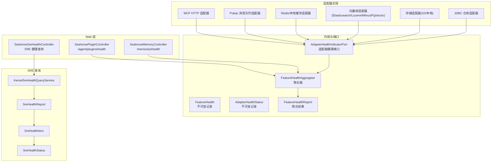
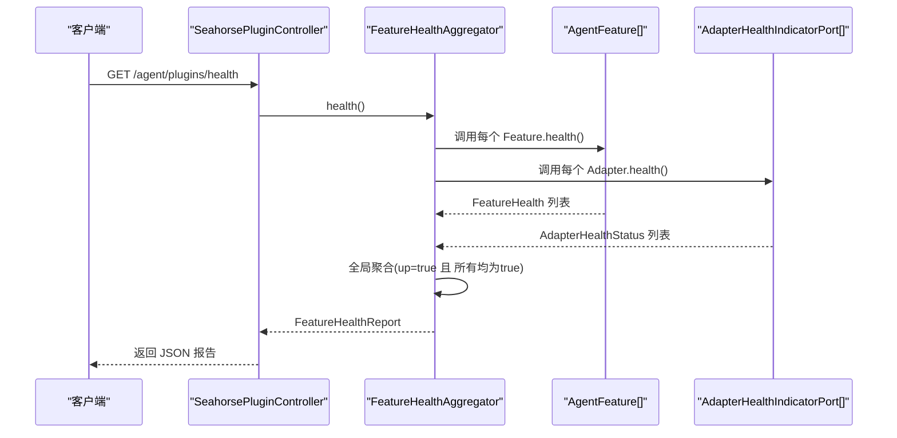
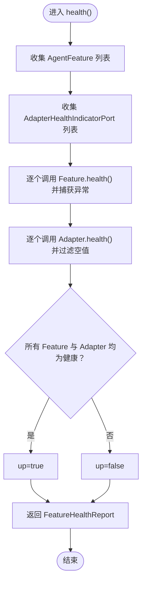
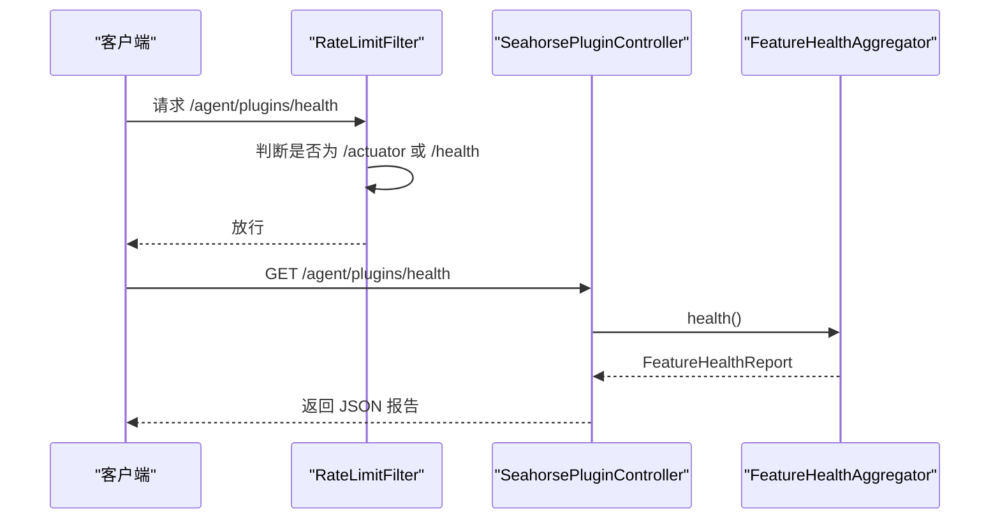
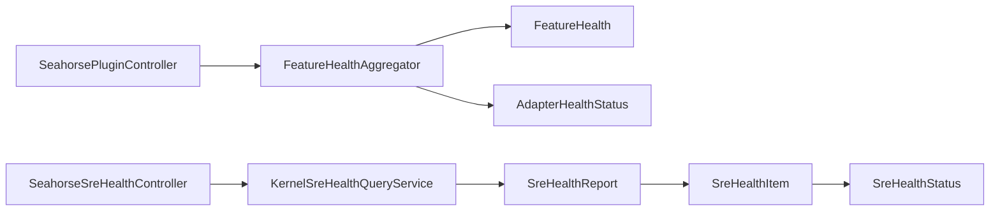

# 健康检查

<cite>
**本文引用的文件**
- [健康监控.md](file://docs/zh/content/后端系统/核心内核/插件系统/健康监控.md)
- [健康检查.md](file://docs/zh/content/监控运维/健康检查.md)
- [FeatureHealthAggregator.java](file://seahorse-agent-kernel/src/main/java/com/miracle/ai/seahorse/agent/kernel/plugin/FeatureHealthAggregator.java)
- [FeatureHealth.java](file://seahorse-agent-kernel/src/main/java/com/miracle/ai/seahorse/agent/kernel/plugin/FeatureHealth.java)
- [AdapterHealthStatus.java](file://seahorse-agent-kernel/src/main/java/com/miracle/ai/seahorse/agent/kernel/plugin/AdapterHealthStatus.java)
- [FeatureHealthReport.java](file://seahorse-agent-kernel/src/main/java/com/miracle/ai/seahorse/agent/kernel/plugin/FeatureHealthReport.java)
- [AdapterHealthIndicatorPort.java](file://seahorse-agent-kernel/src/main/java/com/miracle/ai/seahorse/agent/ports/outbound/plugin/AdapterHealthIndicatorPort.java)
- [SreHealthInboundPort.java](file://seahorse-agent-kernel/src/main/java/com/miracle/ai/seahorse/agent/ports/inbound/agent/SreHealthInboundPort.java)
- [SreHealthReportProviderPort.java](file://seahorse-agent-kernel/src/main/java/com/miracle/ai/seahorse/agent/ports/outbound/agent/SreHealthReportProviderPort.java)
- [SreHealthReport.java](file://seahorse-agent-kernel/src/main/java/com/miracle/ai/seahorse/agent/kernel/domain/agent/sre/SreHealthReport.java)
- [SreHealthItem.java](file://seahorse-agent-kernel/src/main/java/com/miracle/ai/seahorse/agent/kernel/domain/agent/sre/SreHealthItem.java)
- [SreHealthStatus.java](file://seahorse-agent-kernel/src/main/java/com/miracle/ai/seahorse/agent/kernel/domain/agent/sre/SreHealthStatus.java)
- [KernelSreHealthQueryService.java](file://seahorse-agent-kernel/src/main/java/com/miracle/ai/seahorse/agent/kernel/application/agent/sre/KernelSreHealthQueryService.java)
- [SeahorsePluginController.java](file://seahorse-agent-adapter-web/src/main/java/com/miracle/ai/seahorse/agent/adapters/web/SeahorsePluginController.java)
- [SeahorseSreHealthController.java](file://seahorse-agent-adapter-web/src/main/java/com/miracle/ai/seahorse/agent/adapters/web/SeahorseSreHealthController.java)
- [SeahorseMemoryController.java](file://seahorse-agent-adapter-web/src/main/java/com/miracle/ai/seahorse/agent/adapters/web/SeahorseMemoryController.java)
- [RateLimitFilter.java](file://seahorse-agent-adapter-web/src/main/java/com/miracle/ai/seahorse/agent/adapters/web/RateLimitFilter.java)
- [McpHttpAdapterProperties.java](file://seahorse-agent-adapter-mcp-http/src/main/java/com/miracle/ai/seahorse/agent/adapters/mcp/http/McpHttpAdapterProperties.java)
- [AgentPluginProperties.java](file://seahorse-agent-spring-boot-starter/src/main/java/com/miracle/ai/seahorse/agent/adapters/spring/config/AgentPluginProperties.java)
- [SeahorseAgentSreAdapterHealthAutoConfiguration.java](file://seahorse-agent-spring-boot-starter/src/main/java/com/miracle/ai/seahorse/agent/adapters/spring/SeahorseAgentSreAdapterHealthAutoConfiguration.java)
- [OpenAiCompatibleModelAdapter.java](file://seahorse-agent-adapter-ai-openai-compatible/src/main/java/com/miracle/ai/seahorse/agent/adapters/ai/openai/OpenAiCompatibleModelAdapter.java)
- [PulsarMessageQueueAdapter.java](file://seahorse-agent-adapter-mq-pulsar/src/main/java/com/miracle/ai/seahorse/agent/adapters/mq/pulsar/PulsarMessageQueueAdapter.java)
- [PulsarMessageQueueProperties.java](file://seahorse-agent-adapter-mq-pulsar/src/main/java/com/miracle/ai/seahorse/agent/adapters/mq/pulsar/PulsarMessageQueueProperties.java)
- [RedisCacheAdapter.java](file://seahorse-agent-adapter-cache-redis/src/main/java/com/miracle/ai/seahorse/agent/adapters/cache/redis/RedisCacheAdapter.java)
- [LocalCacheAdapter.java](file://seahorse-agent-adapter-cache-local/src/main/java/com/miracle/ai/seahorse/agent/adapters/cache/local/LocalCacheAdapter.java)
- [ElasticsearchKeywordIndexAdapter.java](file://seahorse-agent-adapter-search-elasticsearch/src/main/java/com/miracle/ai/seahorse/agent/adapters/search/elasticsearch/ElasticsearchKeywordIndexAdapter.java)
- [LuceneKeywordIndexAdapter.java](file://seahorse-agent-adapter-search-lucene/src/main/java/com/miracle/ai/seahorse/agent/adapters/search/lucene/LuceneKeywordIndexAdapter.java)
- [MilvusVectorAdapter.java](file://seahorse-agent-adapter-vector-milvus/src/main/java/com/miracle/ai/seahorse/agent/adapters/vector/milvus/MilvusVectorAdapter.java)
- [PgVectorAdapter.java](file://seahorse-agent-adapter-vector-pgvector/src/main/java/com/miracle/ai/seahorse/agent/adapters/vector/pgvector/PgVectorAdapter.java)
- [S3ObjectStorageAdapter.java](file://seahorse-agent-adapter-storage-s3/src/main/java/com/miracle/ai/seahorse/agent/adapters/storage/s3/S3ObjectStorageAdapter.java)
- [LocalObjectStorageAdapter.java](file://seahorse-agent-adapter-storage-local/src/main/java/com/miracle/ai/seahorse/agent/adapters/storage/local/LocalObjectStorageAdapter.java)
- [JdbcAgentExtensionStatusAdapter.java](file://seahorse-agent-adapter-repository-jdbc/src/main/java/com/miracle/ai/seahorse/agent/adapters/repository/jdbc/JdbcAgentExtensionStatusAdapter.java)
- [MicrometerObservationAdapter.java](file://seahorse-agent-adapter-observation-micrometer/src/main/java/com/miracle/ai/seahorse/agent/adapters/observation/micrometer/MicrometerObservationAdapter.java)
- [NoopObservationAdapter.java](file://seahorse-agent-adapter-observation-noop/src/main/java/com/miracle/ai/seahorse/agent/adapters/observation/noop/NoopObservationAdapter.java)
</cite>

## 目录
1. [引言](#引言)
2. [项目结构](#项目结构)
3. [核心组件](#核心组件)
4. [架构总览](#架构总览)
5. [详细组件分析](#详细组件分析)
6. [依赖关系分析](#依赖关系分析)
7. [性能考虑](#性能考虑)
8. [故障排查指南](#故障排查指南)
9. [结论](#结论)
10. [附录](#附录)

## 引言
本文件系统性梳理 Seahorse Agent 的健康检查体系，覆盖插件与适配器层面的健康状态聚合、Web 对外暴露、SRE 健康查询、以及与 Spring Boot Actuator 的协同方式。文档重点说明以下方面：
- 健康状态检测机制：服务可用性检查、数据库连接检测、消息队列状态监控、外部依赖服务验证
- 实现方式：Spring Boot 自动装配、自定义健康指示器、健康状态报告格式
- 配置选项：检查间隔、超时设置、失败阈值与恢复策略
- 监控与告警：健康状态可视化、异常通知机制、自动故障转移
- 最佳实践：检查粒度控制、性能影响最小化、检查结果解读
- 常见问题诊断：快速定位与解决系统异常

## 项目结构
健康检查相关代码主要分布在以下模块：
- 内核与端口：定义不可变健康数据模型、聚合器与控制器端口
- 适配器：各子系统适配器实现 AdapterHealthIndicatorPort.health()，返回 AdapterHealthStatus
- Web 层：对外暴露 /agent/plugins/health 与 /memories/health 等接口
- SRE 查询：KernelSreHealthQueryService 提供 SRE 健康查询能力
- 配置与自动装配：Spring Boot Starter 自动装配健康相关 Bean

图表来源
- [FeatureHealthAggregator.java:42-62](file://seahorse-agent-kernel/src/main/java/com/miracle/ai/seahorse/agent/kernel/plugin/FeatureHealthAggregator.java#L42-L62)
- [SeahorsePluginController.java:53-59](file://seahorse-agent-adapter-web/src/main/java/com/miracle/ai/seahorse/agent/adapters/web/SeahorsePluginController.java#L53-L59)
- [SeahorseMemoryController.java:115-119](file://seahorse-agent-adapter-web/src/main/java/com/miracle/ai/seahorse/agent/adapters/web/SeahorseMemoryController.java#L115-L119)
- [KernelSreHealthQueryService.java](file://seahorse-agent-kernel/src/main/java/com/miracle/ai/seahorse/agent/kernel/application/agent/sre/KernelSreHealthQueryService.java)

章节来源
- [健康监控.md:87-306](file://docs/zh/content/后端系统/核心内核/插件系统/健康监控.md#L87-L306)

## 核心组件
- FeatureHealth：不可变记录类型，封装单个 Feature 的健康状态，包含名称、是否健康、消息与细节字段；提供 up/down 工厂方法
- AdapterHealthStatus：不可变记录类型，封装 Adapter 的健康状态，包含名称、是否健康、消息与细节字段；提供 up/down 工厂方法
- FeatureHealthAggregator：聚合器，负责收集所有 AgentFeature 与 AdapterHealthIndicatorPort 的健康状态，并按“全部为真”规则生成全局健康视图
- FeatureHealthReport：聚合结果载体，包含整体 up 标志以及 Feature 与 Adapter 的健康列表
- AdapterHealthIndicatorPort：适配器健康检查端口，由各适配器实现 health() 返回 AdapterHealthStatus
- AgentFeature：Feature 接口，默认 health() 返回 UP，可被具体 Feature 覆盖实现自检逻辑
- SeahorsePluginController：对外提供 /agent/plugins/health 接口，返回 FeatureHealthReport
- SeahorseSreHealthController：对外提供 SRE 健康查询接口
- KernelSreHealthQueryService：SRE 健康查询应用服务，提供健康报告构建能力
- SreHealthReport/SreHealthItem/SreHealthStatus：SRE 健康数据模型

章节来源
- [健康监控.md:87-306](file://docs/zh/content/后端系统/核心内核/插件系统/健康监控.md#L87-L306)
- [FeatureHealth.java](file://seahorse-agent-kernel/src/main/java/com/miracle/ai/seahorse/agent/kernel/plugin/FeatureHealth.java)
- [AdapterHealthStatus.java](file://seahorse-agent-kernel/src/main/java/com/miracle/ai/seahorse/agent/kernel/plugin/AdapterHealthStatus.java)
- [FeatureHealthReport.java](file://seahorse-agent-kernel/src/main/java/com/miracle/ai/seahorse/agent/kernel/plugin/FeatureHealthReport.java)
- [AdapterHealthIndicatorPort.java](file://seahorse-agent-kernel/src/main/java/com/miracle/ai/seahorse/agent/ports/outbound/plugin/AdapterHealthIndicatorPort.java)
- [SeahorsePluginController.java:53-59](file://seahorse-agent-adapter-web/src/main/java/com/miracle/ai/seahorse/agent/adapters/web/SeahorsePluginController.java#L53-L59)
- [SeahorseSreHealthController.java](file://seahorse-agent-adapter-web/src/main/java/com/miracle/ai/seahorse/agent/adapters/web/SeahorseSreHealthController.java)
- [KernelSreHealthQueryService.java](file://seahorse-agent-kernel/src/main/java/com/miracle/ai/seahorse/agent/kernel/application/agent/sre/KernelSreHealthQueryService.java)
- [SreHealthReport.java](file://seahorse-agent-kernel/src/main/java/com/miracle/ai/seahorse/agent/kernel/domain/agent/sre/SreHealthReport.java)
- [SreHealthItem.java](file://seahorse-agent-kernel/src/main/java/com/miracle/ai/seahorse/agent/kernel/domain/agent/sre/SreHealthItem.java)
- [SreHealthStatus.java](file://seahorse-agent-kernel/src/main/java/com/miracle/ai/seahorse/agent/kernel/domain/agent/sre/SreHealthStatus.java)

## 架构总览
健康检查体系采用“不可变状态 + 聚合器 + Web 控制器”的分层设计：
- 不可变状态模型：FeatureHealth 与 AdapterHealthStatus 保证健康状态的只读一致性
- 聚合器：FeatureHealthAggregator 收集 Feature 与 Adapter 的健康状态，按“全部为真”规则生成全局视图
- Web 控制器：SeahorsePluginController 暴露 /agent/plugins/health；SeahorseMemoryController 暴露 /memories/health；SeahorseSreHealthController 暴露 SRE 健康查询
- 适配器：各子系统适配器实现 AdapterHealthIndicatorPort.health()，返回 AdapterHealthStatus
- SRE 查询：KernelSreHealthQueryService 将健康状态转换为 SreHealthReport，便于上层系统消费

图表来源
- [SeahorsePluginController.java:53-59](file://seahorse-agent-adapter-web/src/main/java/com/miracle/ai/seahorse/agent/adapters/web/SeahorsePluginController.java#L53-L59)
- [FeatureHealthAggregator.java:42-62](file://seahorse-agent-kernel/src/main/java/com/miracle/ai/seahorse/agent/kernel/plugin/FeatureHealthAggregator.java#L42-L62)

章节来源
- [健康监控.md:87-306](file://docs/zh/content/后端系统/核心内核/插件系统/健康监控.md#L87-L306)

## 详细组件分析

### 组件一：FeatureHealthAggregator（健康聚合器）
- 职责：收集 AgentFeature 与 AdapterHealthIndicatorPort 的健康状态，按“全部为真”规则生成 FeatureHealthReport
- 关键点：
  - 对 Feature.health() 调用进行异常捕获，出现异常时以 down 状态记录
  - 对 AdapterHealthIndicatorPort.health() 进行空值过滤
  - 聚合规则：所有 Feature 与 Adapter 健康才视为整体健康

图表来源
- [FeatureHealthAggregator.java:42-62](file://seahorse-agent-kernel/src/main/java/com/miracle/ai/seahorse/agent/kernel/plugin/FeatureHealthAggregator.java#L42-L62)

章节来源
- [FeatureHealthAggregator.java:32-62](file://seahorse-agent-kernel/src/main/java/com/miracle/ai/seahorse/agent/kernel/plugin/FeatureHealthAggregator.java#L32-L62)

### 组件二：Web 健康接口（SeahorsePluginController）
- 路径：GET /agent/plugins/health
- 行为：调用 FeatureHealthAggregator.health()，返回 FeatureHealthReport
- 访问控制：/actuator 与 /health 路径放行（参见 RateLimitFilter）

图表来源
- [SeahorsePluginController.java:53-59](file://seahorse-agent-adapter-web/src/main/java/com/miracle/ai/seahorse/agent/adapters/web/SeahorsePluginController.java#L53-L59)
- [RateLimitFilter.java:85](file://seahorse-agent-adapter-web/src/main/java/com/miracle/ai/seahorse/agent/adapters/web/RateLimitFilter.java#L85)

章节来源
- [SeahorsePluginController.java:41-59](file://seahorse-agent-adapter-web/src/main/java/com/miracle/ai/seahorse/agent/adapters/web/SeahorsePluginController.java#L41-L59)
- [RateLimitFilter.java:85](file://seahorse-agent-adapter-web/src/main/java/com/miracle/ai/seahorse/agent/adapters/web/RateLimitFilter.java#L85)

### 组件三：内存健康接口（SeahorseMemoryController）
- 路径：GET /memories/health
- 行为：根据用户 ID 与租户 ID 查询内存健康状态，委托下游端口执行

章节来源
- [SeahorseMemoryController.java:115-119](file://seahorse-agent-adapter-web/src/main/java/com/miracle/ai/seahorse/agent/adapters/web/SeahorseMemoryController.java#L115-L119)

### 组件四：SRE 健康查询（KernelSreHealthQueryService）
- 职责：将健康状态转换为 SreHealthReport，便于上层系统消费
- 输出：SreHealthReport 包含 SreHealthItem 列表，每个 Item 包含 SreHealthStatus

章节来源
- [KernelSreHealthQueryService.java](file://seahorse-agent-kernel/src/main/java/com/miracle/ai/seahorse/agent/kernel/application/agent/sre/KernelSreHealthQueryService.java)
- [SreHealthReport.java](file://seahorse-agent-kernel/src/main/java/com/miracle/ai/seahorse/agent/kernel/domain/agent/sre/SreHealthReport.java)
- [SreHealthItem.java](file://seahorse-agent-kernel/src/main/java/com/miracle/ai/seahorse/agent/kernel/domain/agent/sre/SreHealthItem.java)
- [SreHealthStatus.java](file://seahorse-agent-kernel/src/main/java/com/miracle/ai/seahorse/agent/kernel/domain/agent/sre/SreHealthStatus.java)

### 组件五：适配器健康指示器（AdapterHealthIndicatorPort）
- 规范：各适配器实现 AdapterHealthIndicatorPort.health()，返回 AdapterHealthStatus
- 典型实现：
  - MCP HTTP 适配器：通过远程调用探测外部 API 可用性
  - Pulsar 消息队列适配器：探测连接与主题可用性
  - 缓存适配器：探测 Redis/本地缓存连接
  - 向量库适配器：探测索引与查询可用性（Elasticsearch/Lucene/Milvus/PgVector）
  - 存储适配器：探测 S3/本地存储连接
  - JDBC 仓库适配器：探测数据库连接与基本查询

```mermaid
classDiagram
class AdapterHealthIndicatorPort {
+health() AdapterHealthStatus
}
class OpenAiCompatibleModelAdapter {
+isHealthy(modelId) boolean
}
class PulsarMessageQueueAdapter {
+health() AdapterHealthStatus
}
class RedisCacheAdapter {
+health() AdapterHealthStatus
}
class LocalCacheAdapter {
+health() AdapterHealthStatus
}
class ElasticsearchKeywordIndexAdapter {
+health() AdapterHealthStatus
}
class LuceneKeywordIndexAdapter {
+health() AdapterHealthStatus
}
class MilvusVectorAdapter {
+health() AdapterHealthStatus
}
class PgVectorAdapter {
+health() AdapterHealthStatus
}
class S3ObjectStorageAdapter {
+health() AdapterHealthStatus
}
class LocalObjectStorageAdapter {
+health() AdapterHealthStatus
}
class JdbcAgentExtensionStatusAdapter {
+health() AdapterHealthStatus
}
AdapterHealthIndicatorPort <|.. OpenAiCompatibleModelAdapter
AdapterHealthIndicatorPort <|.. PulsarMessageQueueAdapter
AdapterHealthIndicatorPort <|.. RedisCacheAdapter
AdapterHealthIndicatorPort <|.. LocalCacheAdapter
AdapterHealthIndicatorPort <|.. ElasticsearchKeywordIndexAdapter
AdapterHealthIndicatorPort <|.. LuceneKeywordIndexAdapter
AdapterHealthIndicatorPort <|.. MilvusVectorAdapter
AdapterHealthIndicatorPort <|.. PgVectorAdapter
AdapterHealthIndicatorPort <|.. S3ObjectStorageAdapter
AdapterHealthIndicatorPort <|.. LocalObjectStorageAdapter
AdapterHealthIndicatorPort <|.. JdbcAgentExtensionStatusAdapter
```

图表来源
- [AdapterHealthIndicatorPort.java](file://seahorse-agent-kernel/src/main/java/com/miracle/ai/seahorse/agent/ports/outbound/plugin/AdapterHealthIndicatorPort.java)
- [OpenAiCompatibleModelAdapter.java:192](file://seahorse-agent-adapter-ai-openai-compatible/src/main/java/com/miracle/ai/seahorse/agent/adapters/ai/openai/OpenAiCompatibleModelAdapter.java#L192)
- [PulsarMessageQueueAdapter.java](file://seahorse-agent-adapter-mq-pulsar/src/main/java/com/miracle/ai/seahorse/agent/adapters/mq/pulsar/PulsarMessageQueueAdapter.java)
- [RedisCacheAdapter.java](file://seahorse-agent-adapter-cache-redis/src/main/java/com/miracle/ai/seahorse/agent/adapters/cache/redis/RedisCacheAdapter.java)
- [LocalCacheAdapter.java](file://seahorse-agent-adapter-cache-local/src/main/java/com/miracle/ai/seahorse/agent/adapters/cache/local/LocalCacheAdapter.java)
- [ElasticsearchKeywordIndexAdapter.java](file://seahorse-agent-adapter-search-elasticsearch/src/main/java/com/miracle/ai/seahorse/agent/adapters/search/elasticsearch/ElasticsearchKeywordIndexAdapter.java)
- [LuceneKeywordIndexAdapter.java](file://seahorse-agent-adapter-search-lucene/src/main/java/com/miracle/ai/seahorse/agent/adapters/search/lucene/LuceneKeywordIndexAdapter.java)
- [MilvusVectorAdapter.java](file://seahorse-agent-adapter-vector-milvus/src/main/java/com/miracle/ai/seahorse/agent/adapters/vector/milvus/MilvusVectorAdapter.java)
- [PgVectorAdapter.java](file://seahorse-agent-adapter-vector-pgvector/src/main/java/com/miracle/ai/seahorse/agent/adapters/vector/pgvector/PgVectorAdapter.java)
- [S3ObjectStorageAdapter.java](file://seahorse-agent-adapter-storage-s3/src/main/java/com/miracle/ai/seahorse/agent/adapters/storage/s3/S3ObjectStorageAdapter.java)
- [LocalObjectStorageAdapter.java](file://seahorse-agent-adapter-storage-local/src/main/java/com/miracle/ai/seahorse/agent/adapters/storage/local/LocalObjectStorageAdapter.java)
- [JdbcAgentExtensionStatusAdapter.java](file://seahorse-agent-adapter-repository-jdbc/src/main/java/com/miracle/ai/seahorse/agent/adapters/repository/jdbc/JdbcAgentExtensionStatusAdapter.java)

章节来源
- [AdapterHealthIndicatorPort.java](file://seahorse-agent-kernel/src/main/java/com/miracle/ai/seahorse/agent/ports/outbound/plugin/AdapterHealthIndicatorPort.java)
- [OpenAiCompatibleModelAdapter.java:192](file://seahorse-agent-adapter-ai-openai-compatible/src/main/java/com/miracle/ai/seahorse/agent/adapters/ai/openai/OpenAiCompatibleModelAdapter.java#L192)
- [PulsarMessageQueueAdapter.java](file://seahorse-agent-adapter-mq-pulsar/src/main/java/com/miracle/ai/seahorse/agent/adapters/mq/pulsar/PulsarMessageQueueAdapter.java)
- [RedisCacheAdapter.java](file://seahorse-agent-adapter-cache-redis/src/main/java/com/miracle/ai/seahorse/agent/adapters/cache/redis/RedisCacheAdapter.java)
- [LocalCacheAdapter.java](file://seahorse-agent-adapter-cache-local/src/main/java/com/miracle/ai/seahorse/agent/adapters/cache/local/LocalCacheAdapter.java)
- [ElasticsearchKeywordIndexAdapter.java](file://seahorse-agent-adapter-search-elasticsearch/src/main/java/com/miracle/ai/seahorse/agent/adapters/search/elasticsearch/ElasticsearchKeywordIndexAdapter.java)
- [LuceneKeywordIndexAdapter.java](file://seahorse-agent-adapter-search-lucene/src/main/java/com/miracle/ai/seahorse/agent/adapters/search/lucene/LuceneKeywordIndexAdapter.java)
- [MilvusVectorAdapter.java](file://seahorse-agent-adapter-vector-milvus/src/main/java/com/miracle/ai/seahorse/agent/adapters/vector/milvus/MilvusVectorAdapter.java)
- [PgVectorAdapter.java](file://seahorse-agent-adapter-vector-pgvector/src/main/java/com/miracle/ai/seahorse/agent/adapters/vector/pgvector/PgVectorAdapter.java)
- [S3ObjectStorageAdapter.java](file://seahorse-agent-adapter-storage-s3/src/main/java/com/miracle/ai/seahorse/agent/adapters/storage/s3/S3ObjectStorageAdapter.java)
- [LocalObjectStorageAdapter.java](file://seahorse-agent-adapter-storage-local/src/main/java/com/miracle/ai/seahorse/agent/adapters/storage/local/LocalObjectStorageAdapter.java)
- [JdbcAgentExtensionStatusAdapter.java](file://seahorse-agent-adapter-repository-jdbc/src/main/java/com/miracle/ai/seahorse/agent/adapters/repository/jdbc/JdbcAgentExtensionStatusAdapter.java)

### 组件六：Spring Boot 自动装配与 Actuator 集成
- 自动装配：SeahorseAgentSreAdapterHealthAutoConfiguration 负责注册健康相关 Bean
- Actuator 集成：/actuator 与 /health 路径放行，避免健康检查被限流拦截
- 配置示例：McpHttpAdapterProperties 提供调用超时配置项，用于控制远程调用等待时间

章节来源
- [SeahorseAgentSreAdapterHealthAutoConfiguration.java](file://seahorse-agent-spring-boot-starter/src/main/java/com/miracle/ai/seahorse/agent/adapters/spring/SeahorseAgentSreAdapterHealthAutoConfiguration.java)
- [RateLimitFilter.java:85](file://seahorse-agent-adapter-web/src/main/java/com/miracle/ai/seahorse/agent/adapters/web/RateLimitFilter.java#L85)
- [McpHttpAdapterProperties.java:32-56](file://seahorse-agent-adapter-mcp-http/src/main/java/com/miracle/ai/seahorse/agent/adapters/mcp/http/McpHttpAdapterProperties.java#L32-L56)

## 依赖关系分析
- 聚合器依赖：FeatureHealthAggregator 依赖 AgentFeature 与 AdapterHealthIndicatorPort 列表
- 控制器依赖：SeahorsePluginController 依赖 FeatureHealthAggregator
- SRE 查询依赖：KernelSreHealthQueryService 依赖健康状态模型
- 适配器依赖：各适配器实现 AdapterHealthIndicatorPort，返回 AdapterHealthStatus

图表来源
- [SeahorsePluginController.java:41-59](file://seahorse-agent-adapter-web/src/main/java/com/miracle/ai/seahorse/agent/adapters/web/SeahorsePluginController.java#L41-L59)
- [FeatureHealthAggregator.java:32-62](file://seahorse-agent-kernel/src/main/java/com/miracle/ai/seahorse/agent/kernel/plugin/FeatureHealthAggregator.java#L32-L62)
- [KernelSreHealthQueryService.java](file://seahorse-agent-kernel/src/main/java/com/miracle/ai/seahorse/agent/kernel/application/agent/sre/KernelSreHealthQueryService.java)

章节来源
- [SeahorsePluginController.java:41-59](file://seahorse-agent-adapter-web/src/main/java/com/miracle/ai/seahorse/agent/adapters/web/SeahorsePluginController.java#L41-L59)
- [FeatureHealthAggregator.java:32-62](file://seahorse-agent-kernel/src/main/java/com/miracle/ai/seahorse/agent/kernel/plugin/FeatureHealthAggregator.java#L32-L62)
- [KernelSreHealthQueryService.java](file://seahorse-agent-kernel/src/main/java/com/miracle/ai/seahorse/agent/kernel/application/agent/sre/KernelSreHealthQueryService.java)

## 性能考虑
- 检查间隔：建议每 30-60 秒一次，避免过于频繁造成资源浪费
- 失败阈值：可结合业务 SLA 设置连续失败次数阈值，超过阈值触发降级或隔离
- 自动恢复：对瞬时故障（网络抖动、上游限流）应具备自动恢复能力；对持久性故障（配置错误、权限缺失）需人工干预
- 监控集成：将 /agent/plugins/health 的聚合报告接入 Prometheus/Grafana，配置告警规则（如整体 down、特定 Adapter down）

章节来源
- [健康检查.md:360-366](file://docs/zh/content/监控运维/健康检查.md#L360-L366)

## 故障排查指南
- 健康接口访问：确认 /actuator 与 /health 路径未被限流拦截（参见 RateLimitFilter）
- 聚合结果解读：FeatureHealthReport 中 up=true 仅当所有 Feature 与 Adapter 均健康
- 适配器健康：检查各适配器是否正确实现 AdapterHealthIndicatorPort.health()，并返回 up/down 状态
- SRE 报告：通过 KernelSreHealthQueryService 获取 SreHealthReport，定位具体健康项与状态
- 常见问题：
  - 外部依赖不可用：检查 MCP HTTP 适配器超时配置与网络连通性
  - 消息队列异常：检查 Pulsar 连接与主题可用性
  - 缓存/存储异常：检查 Redis/本地缓存与 S3/本地存储连接
  - 数据库异常：检查 JDBC 仓库适配器连接与基本查询

章节来源
- [RateLimitFilter.java:85](file://seahorse-agent-adapter-web/src/main/java/com/miracle/ai/seahorse/agent/adapters/web/RateLimitFilter.java#L85)
- [FeatureHealthAggregator.java:42-62](file://seahorse-agent-kernel/src/main/java/com/miracle/ai/seahorse/agent/kernel/plugin/FeatureHealthAggregator.java#L42-L62)
- [KernelSreHealthQueryService.java](file://seahorse-agent-kernel/src/main/java/com/miracle/ai/seahorse/agent/kernel/application/agent/sre/KernelSreHealthQueryService.java)

## 结论
本健康检查体系通过清晰的接口与不可变状态模型，实现了功能与适配器双层健康聚合，并通过 Web 控制器对外暴露。针对数据库、向量库、消息队列与外部 API 的适配器均可按需实现 AdapterHealthIndicatorPort.health()，形成统一的可观测性与自动化故障转移基础。

## 附录

### 配置选项与阈值
- 插件通用配置
  - 默认启用开关：可通过插件配置的默认值与特性级开关进行控制
  - 特性级启用映射：支持针对特定 Feature 设置启用/禁用
- 适配器超时配置示例
  - MCP HTTP 适配器提供调用超时配置项，可用于控制远程调用等待时间
- 阈值与告警
  - 健康聚合规则为“全部为真”，即任一 Feature 或 Adapter 不健康则整体不健康
  - 建议在上层系统根据 features/adapters 列表实现二次阈值与告警策略（如错误率、延迟等）

章节来源
- [AgentPluginProperties.java:30-34](file://seahorse-agent-spring-boot-starter/src/main/java/com/miracle/ai/seahorse/agent/adapters/spring/config/AgentPluginProperties.java#L30-L34)
- [McpHttpAdapterProperties.java:32-56](file://seahorse-agent-adapter-mcp-http/src/main/java/com/miracle/ai/seahorse/agent/adapters/mcp/http/McpHttpAdapterProperties.java#L32-L56)

### 自定义健康检查器开发步骤
- 定义适配器健康接口实现：在目标适配器类中实现 AdapterHealthIndicatorPort，并在 health() 中执行最小代价探测
- 返回状态模型：根据探测结果返回 AdapterHealthStatus.up(...) 或 AdapterHealthStatus.down(...)，并在 details 中附加诊断信息
- 注册到聚合器：确保 Spring 容器中该适配器 Bean 可被 FeatureHealthAggregator 发现并参与聚合
- 验证与告警：通过 /agent/plugins/health 验证状态，配置监控告警规则

章节来源
- [健康检查.md:367-371](file://docs/zh/content/监控运维/健康检查.md#L367-L371)