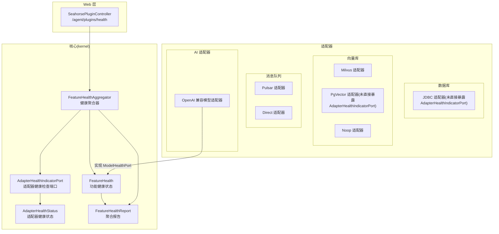
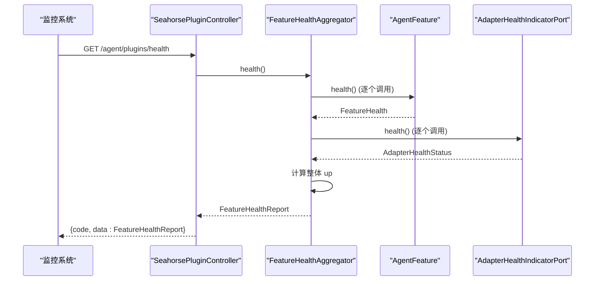
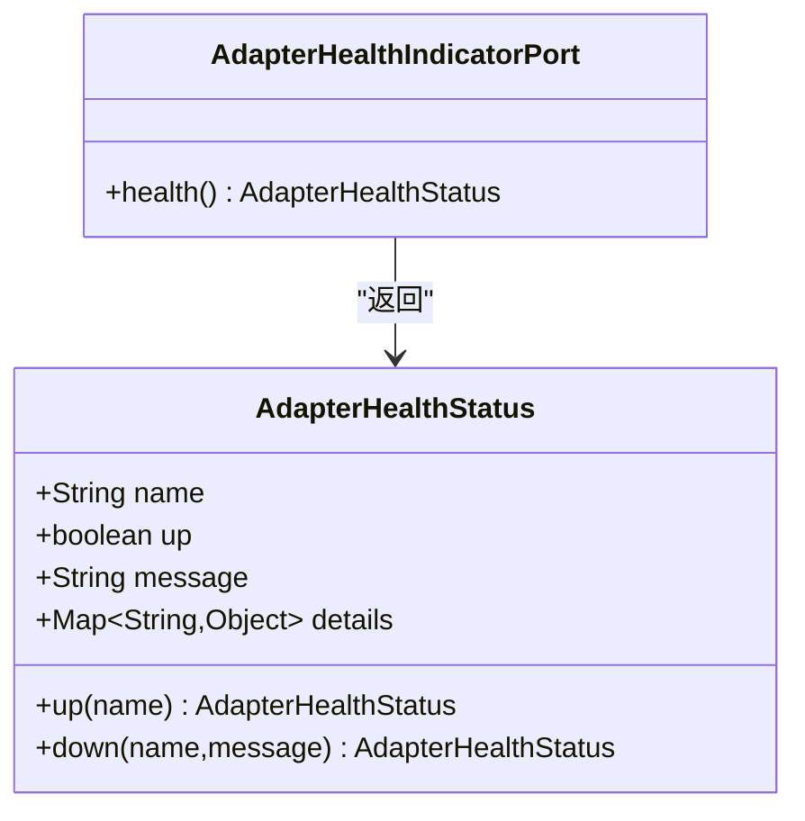
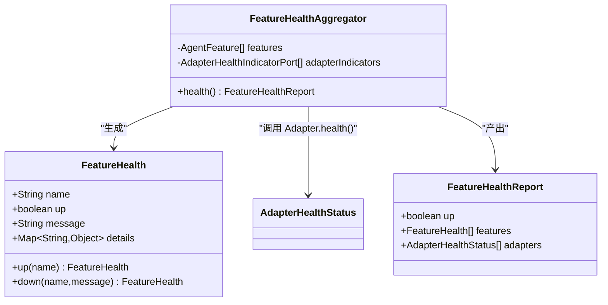
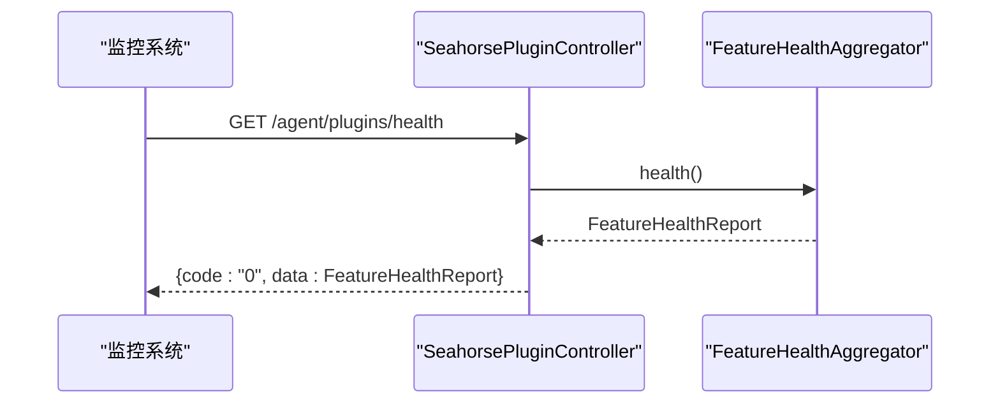
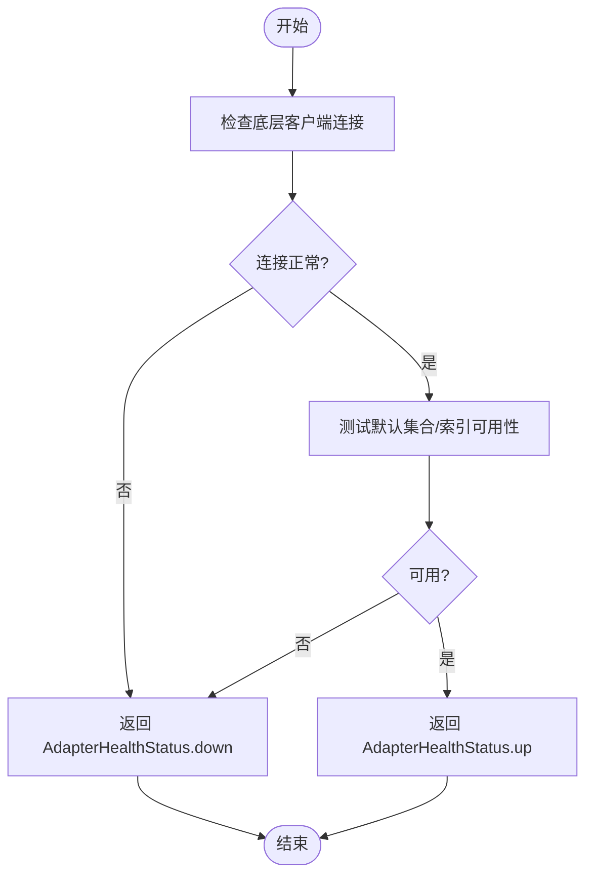
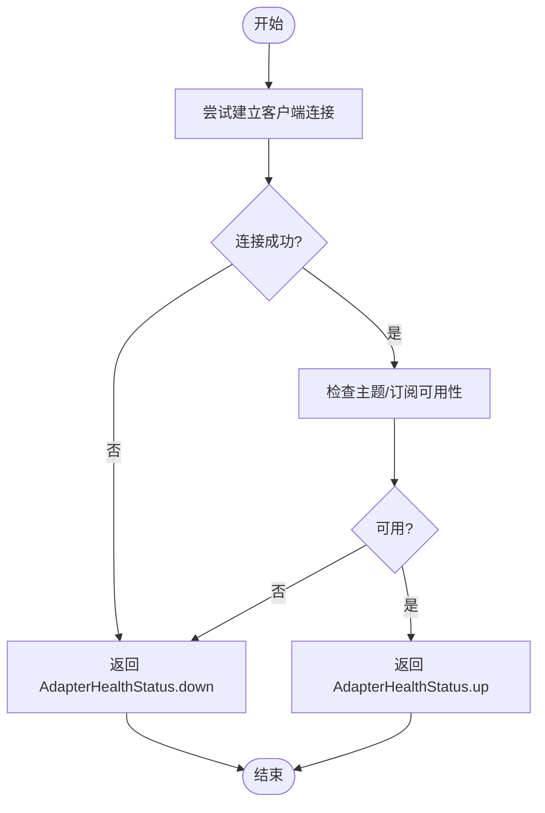
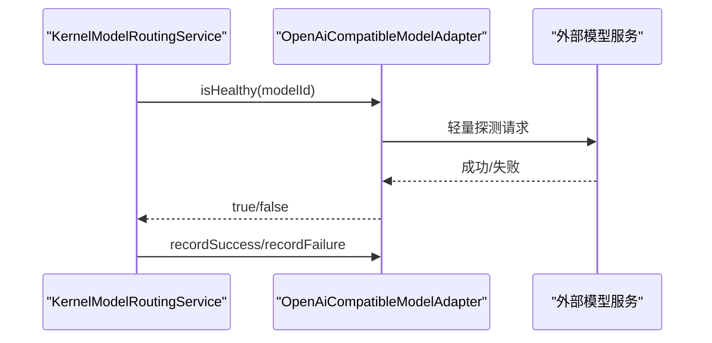
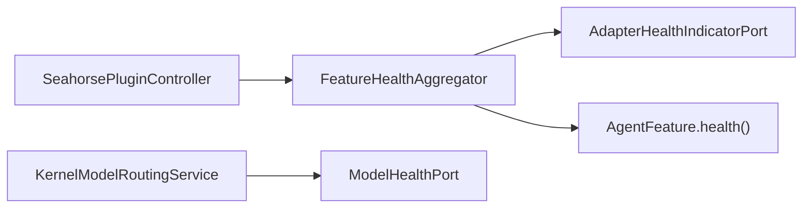

# 健康检查

<cite>
**本文引用的文件**
- [AdapterHealthIndicatorPort.java](file://seahorse-agent-kernel/src/main/java/com/miracle/ai/seahorse/agent/ports/outbound/plugin/AdapterHealthIndicatorPort.java)
- [AdapterHealthStatus.java](file://seahorse-agent-kernel/src/main/java/com/miracle/ai/seahorse/agent/ports/outbound/plugin/AdapterHealthStatus.java)
- [FeatureHealth.java](file://seahorse-agent-kernel/src/main/java/com/miracle/ai/seahorse/agent/kernel/plugin/FeatureHealth.java)
- [FeatureHealthAggregator.java](file://seahorse-agent-kernel/src/main/java/com/miracle/ai/seahorse/agent/kernel/plugin/FeatureHealthAggregator.java)
- [FeatureHealthReport.java](file://seahorse-agent-kernel/src/main/java/com/miracle/ai/seahorse/agent/kernel/plugin/FeatureHealthReport.java)
- [ModelHealthPort.java](file://seahorse-agent-kernel/src/main/java/com/miracle/ai/seahorse/agent/ports/outbound/model/ModelHealthPort.java)
- [KernelModelRoutingService.java](file://seahorse-agent-kernel/src/main/java/com/miracle/ai/seahorse/agent/kernel/application/model/KernelModelRoutingService.java)
- [OpenAiCompatibleModelAdapter.java](file://seahorse-agent-adapter-ai-openai-compatible/src/main/java/com/miracle/ai/seahorse/agent/adapters/ai/openai/OpenAiCompatibleModelAdapter.java)
- [PulsarMessageQueueAdapter.java](file://seahorse-agent-adapter-mq-pulsar/src/main/java/com/miracle/ai/seahorse/agent/adapters/mq/pulsar/PulsarMessageQueueAdapter.java)
- [PulsarMessageQueueProperties.java](file://seahorse-agent-adapter-mq-pulsar/src/main/java/com/miracle/ai/seahorse/agent/adapters/mq/pulsar/PulsarMessageQueueProperties.java)
- [DirectMessageQueueAdapter.java](file://seahorse-agent-adapter-mq-direct/src/main/java/com/miracle/ai/seahorse/agent/adapters/mq/direct/DirectMessageQueueAdapter.java)
- [MilvusVectorAdapter.java](file://seahorse-agent-adapter-vector-milvus/src/main/java/com/miracle/ai/seahorse/agent/adapters/vector/milvus/MilvusVectorAdapter.java)
- [MilvusVectorProperties.java](file://seahorse-agent-adapter-vector-milvus/src/main/java/com/miracle/ai/seahorse/agent/adapters/vector/milvus/MilvusVectorProperties.java)
- [NoopVectorStoreAdapter.java](file://seahorse-agent-adapter-vector-noop/src/main/java/com/miracle/ai/seahorse/agent/adapters/vector/noop/NoopVectorStoreAdapter.java)
- [SeahorsePluginController.java](file://seahorse-agent-adapter-web/src/main/java/com/miracle/ai/seahorse/agent/adapters/web/SeahorsePluginController.java)
</cite>

## 目录
1. [简介](#简介)
2. [项目结构](#项目结构)
3. [核心组件](#核心组件)
4. [架构总览](#架构总览)
5. [详细组件分析](#详细组件分析)
6. [依赖分析](#依赖分析)
7. [性能考虑](#性能考虑)
8. [故障排查指南](#故障排查指南)
9. [结论](#结论)
10. [附录](#附录)

## 简介
本文件系统化阐述本项目的健康检查机制，覆盖从接口设计、状态模型、聚合器到具体适配器实现与监控集成的全链路方案。健康检查采用“功能特性 + 适配器”的双层聚合策略，确保启动诊断与管理端可观测性不受在线请求主链路影响；同时通过可插拔的适配器实现对数据库、向量库、消息队列与外部 API 的统一健康探测。

## 项目结构
健康检查相关代码主要分布在 kernel 核心模块（状态模型与聚合器）与各适配器模块（数据库、向量库、消息队列、AI 适配器等）。Web 层提供健康检查的 HTTP 暴露端点，便于外部监控系统拉取。

图表来源
- [AdapterHealthIndicatorPort.java:23-25](file://seahorse-agent-kernel/src/main/java/com/miracle/ai/seahorse/agent/ports/outbound/plugin/AdapterHealthIndicatorPort.java#L23-L25)
- [AdapterHealthStatus.java:31-45](file://seahorse-agent-kernel/src/main/java/com/miracle/ai/seahorse/agent/ports/outbound/plugin/AdapterHealthStatus.java#L31-L45)
- [FeatureHealth.java:33-66](file://seahorse-agent-kernel/src/main/java/com/miracle/ai/seahorse/agent/kernel/plugin/FeatureHealth.java#L33-L66)
- [FeatureHealthAggregator.java:31-52](file://seahorse-agent-kernel/src/main/java/com/miracle/ai/seahorse/agent/kernel/plugin/FeatureHealthAggregator.java#L31-L52)
- [FeatureHealthReport.java:32-41](file://seahorse-agent-kernel/src/main/java/com/miracle/ai/seahorse/agent/kernel/plugin/FeatureHealthReport.java#L32-L41)
- [SeahorsePluginController.java:58-61](file://seahorse-agent-adapter-web/src/main/java/com/miracle/ai/seahorse/agent/adapters/web/SeahorsePluginController.java#L58-L61)

章节来源
- [AdapterHealthIndicatorPort.java:23-25](file://seahorse-agent-kernel/src/main/java/com/miracle/ai/seahorse/agent/ports/outbound/plugin/AdapterHealthIndicatorPort.java#L23-L25)
- [AdapterHealthStatus.java:31-45](file://seahorse-agent-kernel/src/main/java/com/miracle/ai/seahorse/agent/ports/outbound/plugin/AdapterHealthStatus.java#L31-L45)
- [FeatureHealth.java:33-66](file://seahorse-agent-kernel/src/main/java/com/miracle/ai/seahorse/agent/kernel/plugin/FeatureHealth.java#L33-L66)
- [FeatureHealthAggregator.java:31-52](file://seahorse-agent-kernel/src/main/java/com/miracle/ai/seahorse/agent/kernel/plugin/FeatureHealthAggregator.java#L31-L52)
- [FeatureHealthReport.java:32-41](file://seahorse-agent-kernel/src/main/java/com/miracle/ai/seahorse/agent/kernel/plugin/FeatureHealthReport.java#L32-L41)
- [SeahorsePluginController.java:58-61](file://seahorse-agent-adapter-web/src/main/java/com/miracle/ai/seahorse/agent/adapters/web/SeahorsePluginController.java#L58-L61)

## 核心组件
- AdapterHealthIndicatorPort：适配器健康检查端口，定义统一的 health() 方法，返回 AdapterHealthStatus。
- AdapterHealthStatus：适配器健康状态模型，包含名称、是否健康、消息与诊断详情。
- FeatureHealth：功能特性健康状态模型，包含名称、是否健康、消息与详情。
- FeatureHealthAggregator：健康聚合器，聚合所有 AgentFeature 与 AdapterHealthIndicatorPort 的健康状态，并输出 FeatureHealthReport。
- FeatureHealthReport：聚合报告，包含整体 up 状态、各 Feature 健康列表与各 Adapter 健康列表。
- ModelHealthPort：模型健康端口，用于模型可用性判断与成功/失败记录，被 KernelModelRoutingService 使用以实现故障转移。
- OpenAiCompatibleModelAdapter：实现 ModelHealthPort，提供 isHealthy(...) 判断外部 API 可用性。

章节来源
- [AdapterHealthIndicatorPort.java:23-25](file://seahorse-agent-kernel/src/main/java/com/miracle/ai/seahorse/agent/ports/outbound/plugin/AdapterHealthIndicatorPort.java#L23-L25)
- [AdapterHealthStatus.java:31-45](file://seahorse-agent-kernel/src/main/java/com/miracle/ai/seahorse/agent/ports/outbound/plugin/AdapterHealthStatus.java#L31-L45)
- [FeatureHealth.java:33-66](file://seahorse-agent-kernel/src/main/java/com/miracle/ai/seahorse/agent/kernel/plugin/FeatureHealth.java#L33-L66)
- [FeatureHealthAggregator.java:31-52](file://seahorse-agent-kernel/src/main/java/com/miracle/ai/seahorse/agent/kernel/plugin/FeatureHealthAggregator.java#L31-L52)
- [FeatureHealthReport.java:32-41](file://seahorse-agent-kernel/src/main/java/com/miracle/ai/seahorse/agent/kernel/plugin/FeatureHealthReport.java#L32-L41)
- [ModelHealthPort.java:23-46](file://seahorse-agent-kernel/src/main/java/com/miracle/ai/seahorse/agent/ports/outbound/model/ModelHealthPort.java#L23-L46)
- [OpenAiCompatibleModelAdapter.java:163-174](file://seahorse-agent-adapter-ai-openai-compatible/src/main/java/com/miracle/ai/seahorse/agent/adapters/ai/openai/OpenAiCompatibleModelAdapter.java#L163-L174)

## 架构总览
健康检查采用“双聚合”架构：功能特性聚合与适配器聚合并行进行，最终合并为统一报告。Web 控制器对外暴露 /agent/plugins/health 端点，供外部监控系统拉取。

图表来源
- [SeahorsePluginController.java:58-61](file://seahorse-agent-adapter-web/src/main/java/com/miracle/ai/seahorse/agent/adapters/web/SeahorsePluginController.java#L58-L61)
- [FeatureHealthAggregator.java:42-52](file://seahorse-agent-kernel/src/main/java/com/miracle/ai/seahorse/agent/kernel/plugin/FeatureHealthAggregator.java#L42-L52)
- [FeatureHealthReport.java:32-41](file://seahorse-agent-kernel/src/main/java/com/miracle/ai/seahorse/agent/kernel/plugin/FeatureHealthReport.java#L32-L41)

## 详细组件分析

### 组件一：适配器健康检查接口与状态模型
- AdapterHealthIndicatorPort：定义 health() 方法，返回 AdapterHealthStatus。
- AdapterHealthStatus：不可变模型，提供 up()/down() 工厂方法，字段包含名称、健康标志、消息与详情。

图表来源
- [AdapterHealthIndicatorPort.java:23-25](file://seahorse-agent-kernel/src/main/java/com/miracle/ai/seahorse/agent/ports/outbound/plugin/AdapterHealthIndicatorPort.java#L23-L25)
- [AdapterHealthStatus.java:31-45](file://seahorse-agent-kernel/src/main/java/com/miracle/ai/seahorse/agent/ports/outbound/plugin/AdapterHealthStatus.java#L31-L45)

章节来源
- [AdapterHealthIndicatorPort.java:23-25](file://seahorse-agent-kernel/src/main/java/com/miracle/ai/seahorse/agent/ports/outbound/plugin/AdapterHealthIndicatorPort.java#L23-L25)
- [AdapterHealthStatus.java:31-45](file://seahorse-agent-kernel/src/main/java/com/miracle/ai/seahorse/agent/ports/outbound/plugin/AdapterHealthStatus.java#L31-L45)

### 组件二：功能特性健康状态与聚合器
- FeatureHealth：不可变模型，提供 up()/down() 工厂方法，字段包含名称、健康标志、消息与详情。
- FeatureHealthAggregator：聚合所有 AgentFeature 与 AdapterHealthIndicatorPort 的健康状态，异常转为 DOWN。
- FeatureHealthReport：不可变聚合报告，包含整体 up、Feature 列表与 Adapter 列表。

图表来源
- [FeatureHealth.java:33-66](file://seahorse-agent-kernel/src/main/java/com/miracle/ai/seahorse/agent/kernel/plugin/FeatureHealth.java#L33-L66)
- [FeatureHealthAggregator.java:31-52](file://seahorse-agent-kernel/src/main/java/com/miracle/ai/seahorse/agent/kernel/plugin/FeatureHealthAggregator.java#L31-L52)
- [FeatureHealthReport.java:32-41](file://seahorse-agent-kernel/src/main/java/com/miracle/ai/seahorse/agent/kernel/plugin/FeatureHealthReport.java#L32-L41)

章节来源
- [FeatureHealth.java:33-66](file://seahorse-agent-kernel/src/main/java/com/miracle/ai/seahorse/agent/kernel/plugin/FeatureHealth.java#L33-L66)
- [FeatureHealthAggregator.java:31-52](file://seahorse-agent-kernel/src/main/java/com/miracle/ai/seahorse/agent/kernel/plugin/FeatureHealthAggregator.java#L31-L52)
- [FeatureHealthReport.java:32-41](file://seahorse-agent-kernel/src/main/java/com/miracle/ai/seahorse/agent/kernel/plugin/FeatureHealthReport.java#L32-L41)

### 组件三：Web 暴露与控制器
- SeahorsePluginController：提供 /agent/plugins/health 获取聚合健康报告；/agent/plugins/status 与 /agent/plugins/registry 提供扩展状态与注册信息查询。

图表来源
- [SeahorsePluginController.java:58-61](file://seahorse-agent-adapter-web/src/main/java/com/miracle/ai/seahorse/agent/adapters/web/SeahorsePluginController.java#L58-L61)

章节来源
- [SeahorsePluginController.java:58-61](file://seahorse-agent-adapter-web/src/main/java/com/miracle/ai/seahorse/agent/adapters/web/SeahorsePluginController.java#L58-L61)

### 组件四：数据库连接健康检查
- JDBC 适配器（如 JdbcAgentExtensionStatusAdapter）通过数据库访问执行简单查询验证连接可用性，但未直接实现 AdapterHealthIndicatorPort。若需纳入健康聚合，可在对应适配器中实现 AdapterHealthIndicatorPort 并返回 AdapterHealthStatus。
- 建议：在数据库适配器中增加 health() 实现，使用最小代价查询（如 ping 或版本查询）并捕获异常转换为 DOWN 状态。

章节来源
- [JdbcAgentExtensionStatusAdapter.java:74-77](file://seahorse-agent-adapter-repository-jdbc/src/main/java/com/miracle/ai/seahorse/agent/adapters/repository/jdbc/JdbcAgentExtensionStatusAdapter.java#L74-L77)

### 组件五：向量数据库可用性检查
- MilvusVectorAdapter：通过底层客户端执行搜索或元数据查询进行可用性检查；建议在适配器中实现 AdapterHealthIndicatorPort.health()，返回连接与默认集合可用性状态。
- PgVector 适配器：基于 JDBC 访问 pgvector 扩展，可通过最小查询验证可用性。
- NoopVectorStoreAdapter：用于禁用向量检索场景，health() 可返回 UP 或 DOWN 视业务需求而定。

图表来源
- [MilvusVectorAdapter.java:76-83](file://seahorse-agent-adapter-vector-milvus/src/main/java/com/miracle/ai/seahorse/agent/adapters/vector/milvus/MilvusVectorAdapter.java#L76-L83)
- [MilvusVectorProperties.java:29-37](file://seahorse-agent-adapter-vector-milvus/src/main/java/com/miracle/ai/seahorse/agent/adapters/vector/milvus/MilvusVectorProperties.java#L29-L37)

章节来源
- [MilvusVectorAdapter.java:76-83](file://seahorse-agent-adapter-vector-milvus/src/main/java/com/miracle/ai/seahorse/agent/adapters/vector/milvus/MilvusVectorAdapter.java#L76-L83)
- [MilvusVectorProperties.java:29-37](file://seahorse-agent-adapter-vector-milvus/src/main/java/com/miracle/ai/seahorse/agent/adapters/vector/milvus/MilvusVectorProperties.java#L29-L37)
- [NoopVectorStoreAdapter.java:36-67](file://seahorse-agent-adapter-vector-noop/src/main/java/com/miracle/ai/seahorse/agent/adapters/vector/noop/NoopVectorStoreAdapter.java#L36-L67)

### 组件六：消息队列连通性检查
- PulsarMessageQueueAdapter：通过客户端连接与主题订阅进行可用性检查；建议实现 AdapterHealthIndicatorPort.health()，返回连接、主题可用性与消费者组状态。
- DirectMessageQueueAdapter：进程内直连，适合本地/测试环境；health() 可返回 UP 并记录内存队列状态。

图表来源
- [PulsarMessageQueueAdapter.java:45-59](file://seahorse-agent-adapter-mq-pulsar/src/main/java/com/miracle/ai/seahorse/agent/adapters/mq/pulsar/PulsarMessageQueueAdapter.java#L45-L59)
- [PulsarMessageQueueProperties.java:25-41](file://seahorse-agent-adapter-mq-pulsar/src/main/java/com/miracle/ai/seahorse/agent/adapters/mq/pulsar/PulsarMessageQueueProperties.java#L25-L41)
- [DirectMessageQueueAdapter.java:39-57](file://seahorse-agent-adapter-mq-direct/src/main/java/com/miracle/ai/seahorse/agent/adapters/mq/direct/DirectMessageQueueAdapter.java#L39-L57)

章节来源
- [PulsarMessageQueueAdapter.java:45-59](file://seahorse-agent-adapter-mq-pulsar/src/main/java/com/miracle/ai/seahorse/agent/adapters/mq/pulsar/PulsarMessageQueueAdapter.java#L45-L59)
- [PulsarMessageQueueProperties.java:25-41](file://seahorse-agent-adapter-mq-pulsar/src/main/java/com/miracle/ai/seahorse/agent/adapters/mq/pulsar/PulsarMessageQueueProperties.java#L25-L41)
- [DirectMessageQueueAdapter.java:39-57](file://seahorse-agent-adapter-mq-direct/src/main/java/com/miracle/ai/seahorse/agent/adapters/mq/direct/DirectMessageQueueAdapter.java#L39-L57)

### 组件七：外部 API 服务可用性检查
- OpenAiCompatibleModelAdapter：实现 ModelHealthPort，提供 isHealthy(...) 判断指定模型 ID 是否可用；KernelModelRoutingService 在路由与重试中使用该能力。
- 建议：在 health() 中发起一次轻量级探测（如列举模型或最小文本生成），捕获异常并返回 DOWN，同时记录 details 以便诊断。

图表来源
- [KernelModelRoutingService.java:155-166](file://seahorse-agent-kernel/src/main/java/com/miracle/ai/seahorse/agent/kernel/application/model/KernelModelRoutingService.java#L155-L166)
- [ModelHealthPort.java:23-46](file://seahorse-agent-kernel/src/main/java/com/miracle/ai/seahorse/agent/ports/outbound/model/ModelHealthPort.java#L23-L46)
- [OpenAiCompatibleModelAdapter.java:163-174](file://seahorse-agent-adapter-ai-openai-compatible/src/main/java/com/miracle/ai/seahorse/agent/adapters/ai/openai/OpenAiCompatibleModelAdapter.java#L163-L174)

章节来源
- [KernelModelRoutingService.java:155-166](file://seahorse-agent-kernel/src/main/java/com/miracle/ai/seahorse/agent/kernel/application/model/KernelModelRoutingService.java#L155-L166)
- [ModelHealthPort.java:23-46](file://seahorse-agent-kernel/src/main/java/com/miracle/ai/seahorse/agent/ports/outbound/model/ModelHealthPort.java#L23-L46)
- [OpenAiCompatibleModelAdapter.java:163-174](file://seahorse-agent-adapter-ai-openai-compatible/src/main/java/com/miracle/ai/seahorse/agent/adapters/ai/openai/OpenAiCompatibleModelAdapter.java#L163-L174)

## 依赖分析
- 聚合器依赖：FeatureHealthAggregator 依赖 AdapterHealthIndicatorPort 与 AgentFeature 的 health()。
- Web 层依赖：SeahorsePluginController 依赖 FeatureHealthAggregator，按需获取对象。
- 模型路由依赖：KernelModelRoutingService 依赖 ModelHealthPort 进行健康判定与故障转移。

图表来源
- [SeahorsePluginController.java:50-56](file://seahorse-agent-adapter-web/src/main/java/com/miracle/ai/seahorse/agent/adapters/web/SeahorsePluginController.java#L50-L56)
- [FeatureHealthAggregator.java:33-40](file://seahorse-agent-kernel/src/main/java/com/miracle/ai/seahorse/agent/kernel/plugin/FeatureHealthAggregator.java#L33-L40)
- [KernelModelRoutingService.java:76-84](file://seahorse-agent-kernel/src/main/java/com/miracle/ai/seahorse/agent/kernel/application/model/KernelModelRoutingService.java#L76-L84)

章节来源
- [SeahorsePluginController.java:50-56](file://seahorse-agent-adapter-web/src/main/java/com/miracle/ai/seahorse/agent/adapters/web/SeahorsePluginController.java#L50-L56)
- [FeatureHealthAggregator.java:33-40](file://seahorse-agent-kernel/src/main/java/com/miracle/ai/seahorse/agent/kernel/plugin/FeatureHealthAggregator.java#L33-L40)
- [KernelModelRoutingService.java:76-84](file://seahorse-agent-kernel/src/main/java/com/miracle/ai/seahorse/agent/kernel/application/model/KernelModelRoutingService.java#L76-L84)

## 性能考虑
- 健康检查仅在诊断入口与启动阶段调用，不在请求主链路，避免对在线延迟产生影响。
- AdapterHealthIndicatorPort.health() 应采用最小代价探测（如 ping、列举模型、简单查询），避免阻塞或引入额外负载。
- 对外部 API 的探测建议短超时、幂等且可缓存状态，防止抖动放大。
- 聚合器内部为串行收集后一次性计算整体 up，复杂度 O(F+A)，其中 F 为 Feature 数量，A 为 Adapter 数量。

## 故障排查指南
- 健康端点：访问 /agent/plugins/health 查看聚合报告，定位具体 Feature 或 Adapter 的 down 状态与消息。
- 数据库：若 JDBC 适配器未实现 AdapterHealthIndicatorPort，则不会出现在 Adapter 健康列表中；建议补充 health() 实现。
- 向量库：Milvus/PgVector 若返回 DOWN，检查连接参数、默认集合/索引是否存在以及网络连通性。
- 消息队列：Pulsar 若 DOWN，检查 Broker 地址、主题权限与订阅状态；Direct 适配器仅限本地/测试。
- 外部 API：OpenAI 兼容模型若 DOWN，检查鉴权、基础地址与模型 ID 是否正确，查看 details 详情。

章节来源
- [SeahorsePluginController.java:58-61](file://seahorse-agent-adapter-web/src/main/java/com/miracle/ai/seahorse/agent/adapters/web/SeahorsePluginController.java#L58-L61)
- [FeatureHealthReport.java:32-41](file://seahorse-agent-kernel/src/main/java/com/miracle/ai/seahorse/agent/kernel/plugin/FeatureHealthReport.java#L32-L41)

## 结论
本健康检查体系通过清晰的接口与不可变状态模型，实现了功能与适配器双层健康聚合，并通过 Web 控制器对外暴露。针对数据库、向量库、消息队列与外部 API 的适配器均可按需实现 AdapterHealthIndicatorPort.health()，形成统一的可观测性与自动化故障转移基础。

## 附录

### 健康检查最佳实践
- 检查间隔：建议每 30-60 秒一次，避免过于频繁造成资源浪费。
- 失败阈值：可结合业务 SLA 设置连续失败次数阈值，超过阈值触发降级或隔离。
- 故障转移：利用 ModelHealthPort 与 KernelModelRoutingService 的健康判定与重试逻辑，实现自动故障转移。
- 监控集成：将 /agent/plugins/health 的聚合报告接入 Prometheus/Grafana，配置告警规则（如整体 down、特定 Adapter down）。
- 自动恢复：对瞬时故障（网络抖动、上游限流）应具备自动恢复能力；对持久性故障（配置错误、权限缺失）需人工干预。

### 自定义健康检查器开发步骤
- 定义适配器健康接口实现：在目标适配器类中实现 AdapterHealthIndicatorPort，并在 health() 中执行最小代价探测。
- 返回状态模型：根据探测结果返回 AdapterHealthStatus.up(...) 或 AdapterHealthStatus.down(...)，并在 details 中附加诊断信息。
- 注册到聚合器：确保 Spring 容器中该适配器 Bean 可被 FeatureHealthAggregator 发现并参与聚合。
- 验证与告警：通过 /agent/plugins/health 验证状态，配置监控告警规则。