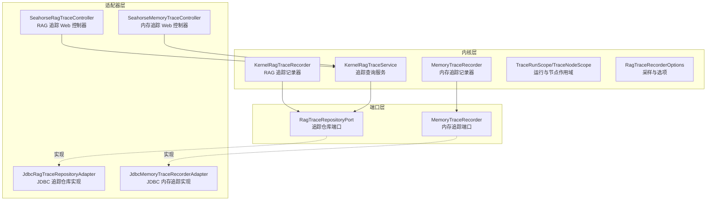
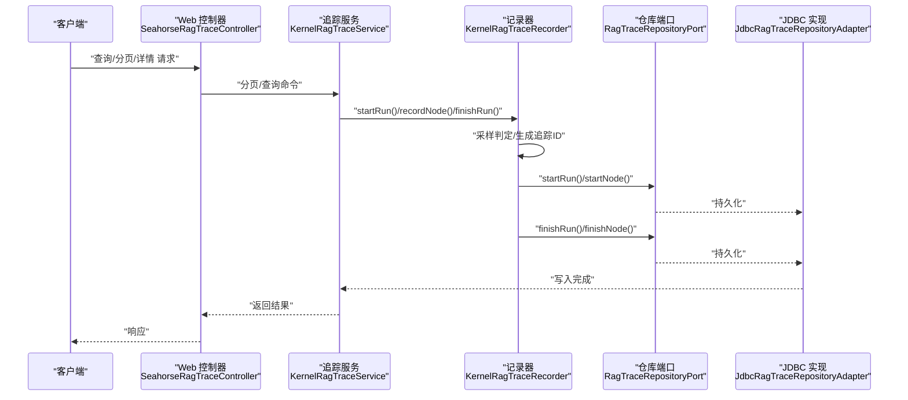
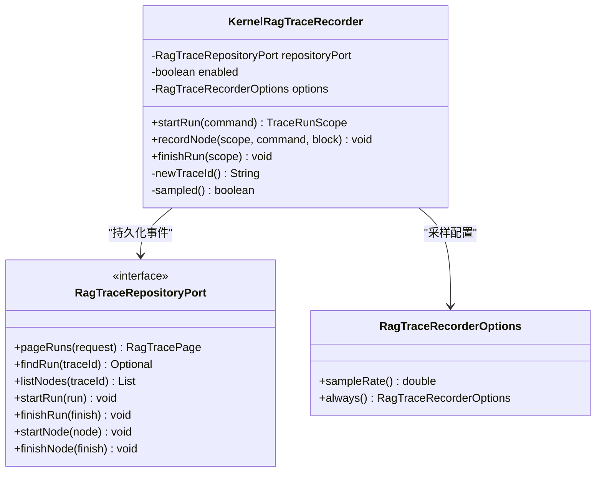
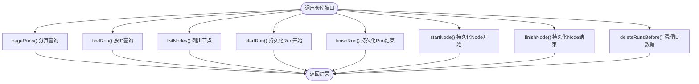
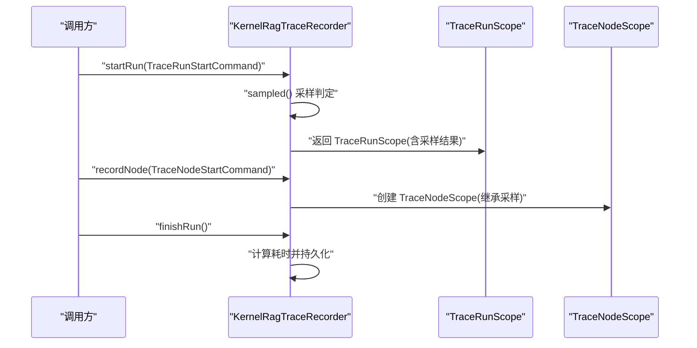
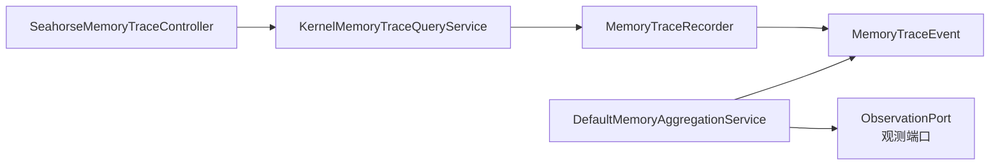
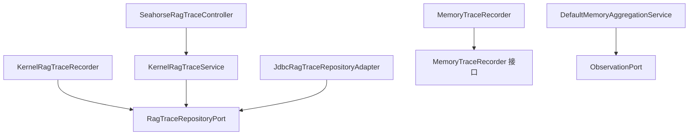

# 分布式追踪

<cite>
**本文引用的文件**
- [KernelRagTraceRecorder.java](file://seahorse-agent-kernel/src/main/java/com/miracle/ai/seahorse/agent/kernel/application/trace/KernelRagTraceRecorder.java)
- [RagTraceRecorderOptions.java](file://seahorse-agent-kernel/src/main/java/com/miracle/ai/seahorse/agent/kernel/application/trace/RagTraceRecorderOptions.java)
- [TraceRunScope.java](file://seahorse-agent-kernel/src/main/java/com/miracle/ai/seahorse/agent/kernel/domain/trace/TraceRunScope.java)
- [TraceNodeScope.java](file://seahorse-agent-kernel/src/main/java/com/miracle/ai/seahorse/agent/kernel/domain/trace/TraceNodeScope.java)
- [TraceRunStartCommand.java](file://seahorse-agent-kernel/src/main/java/com/miracle/ai/seahorse/agent/kernel/domain/trace/TraceRunStartCommand.java)
- [TraceNodeStartCommand.java](file://seahorse-agent-kernel/src/main/java/com/miracle/ai/seahorse/agent/kernel/domain/trace/TraceNodeStartCommand.java)
- [RagTraceRepositoryPort.java](file://seahorse-agent-kernel/src/main/java/com/miracle/ai/seahorse/agent/ports/outbound/trace/RagTraceRepositoryPort.java)
- [SnowflakeIds.java](file://seahorse-agent-kernel/src/main/java/com/miracle/ai/seahorse/agent/kernel/support/SnowflakeIds.java)
- [JdbcRagTraceRepositoryAdapter.java](file://seahorse-agent-adapter-repository-jdbc/src/main/java/com/miracle/ai/seahorse/agent/adapters/repository/jdbc/JdbcRagTraceRepositoryAdapter.java)
- [SeahorseRagTraceController.java](file://seahorse-agent-adapter-web/src/main/java/com/miracle/ai/seahorse/agent/adapters/web/SeahorseRagTraceController.java)
- [KernelRagTraceService.java](file://seahorse-agent-kernel/src/main/java/com/miracle/ai/seahorse/agent/kernel/application/trace/KernelRagTraceService.java)
- [KernelRagTraceRecorderTests.java](file://seahorse-agent-tests/src/test/java/com/miracle/ai/seahorse/agent/kernel/application/trace/KernelRagTraceRecorderTests.java)
- [KernelChatInboundTraceTests.java](file://seahorse-agent-tests/src/test/java/com/miracle/ai/seahorse/agent/kernel/application/chat/KernelChatInboundTraceTests.java)
- [KernelMultiChannelRetrievalEngineTraceTests.java](file://seahorse-agent-tests/src/test/java/com/miracle/ai/seahorse/agent/kernel/application/retrieval/KernelMultiChannelRetrievalEngineTraceTests.java)
- [KernelMemoryTraceQueryService.java](file://seahorse-agent-kernel/src/main/java/com/miracle/ai/seahorse/agent/kernel/application/memory/KernelMemoryTraceQueryService.java)
- [MemoryTraceRecorder.java](file://seahorse-agent-kernel/src/main/java/com/miracle/ai/seahorse/agent/ports/outbound/memory/MemoryTraceRecorder.java)
- [MemoryTraceEvent.java](file://seahorse-agent-kernel/src/main/java/com/miracle/ai/seahorse/agent/ports/outbound/memory/MemoryTraceEvent.java)
- [DefaultMemoryAggregationService.java](file://seahorse-agent-kernel/src/main/java/com/miracle/ai/seahorse/agent/kernel/application/memory/aggregation/DefaultMemoryAggregationService.java)
- [JdbcMemoryTraceRecorderAdapter.java](file://seahorse-agent-adapter-repository-jdbc/src/main/java/com/miracle/ai/seahorse/agent/adapters/repository/jdbc/JdbcMemoryTraceRecorderAdapter.java)
- [InMemoryMemoryTraceRecorder.java](file://seahorse-agent-kernel/src/main/java/com/miracle/ai/seahorse/agent/kernel/application/memory/trace/InMemoryMemoryTraceRecorder.java)
- [SeahorseMemoryTraceController.java](file://seahorse-agent-adapter-web/src/main/java/com/miracle/ai/seahorse/agent/adapters/web/SeahorseMemoryTraceController.java)
- [application.properties](file://seahorse-agent-bootstrap/src/main/resources/application.properties)
</cite>

## 目录
1. [简介](#简介)
2. [项目结构](#项目结构)
3. [核心组件](#核心组件)
4. [架构总览](#架构总览)
5. [详细组件分析](#详细组件分析)
6. [依赖关系分析](#依赖关系分析)
7. [性能考量](#性能考量)
8. [故障排查指南](#故障排查指南)
9. [结论](#结论)
10. [附录](#附录)

## 简介
本文件面向开发者与运维人员，系统性阐述 Seahorse Agent 的分布式追踪体系，重点聚焦 RAG 追踪记录器的实现机制与实践应用。内容涵盖请求链路追踪、跨服务调用关系、性能瓶颈定位、追踪数据采集与存储（Span 创建、上下文传递、追踪 ID 生成、数据持久化）、可视化展示（调用链图表、性能分析仪表板、异常检测）、数据分析方法（慢调用识别、错误率统计、依赖关系分析）、配置优化（采样策略、追踪数据清理与存储成本控制），并提供真实追踪示例与故障排查案例。

## 项目结构
Seahorse Agent 将“追踪”能力拆分为内核层记录器、端口接口、适配器实现与 Web 控制器四层，形成清晰的分层与解耦：

- 内核层：提供 RAG 追踪记录器、内存追踪记录器、追踪域对象与采样选项等核心逻辑
- 端口层：定义对外暴露的追踪仓库端口与内存追踪端口
- 适配器层：提供 JDBC 持久化实现与 Web 控制器
- 测试层：覆盖记录器行为、采样策略、控制器交互等关键场景

**图示来源**
- [KernelRagTraceRecorder.java:79-235](file://seahorse-agent-kernel/src/main/java/com/miracle/ai/seahorse/agent/kernel/application/trace/KernelRagTraceRecorder.java#L79-L235)
- [RagTraceRepositoryPort.java:29-48](file://seahorse-agent-kernel/src/main/java/com/miracle/ai/seahorse/agent/ports/outbound/trace/RagTraceRepositoryPort.java#L29-L48)
- [JdbcRagTraceRepositoryAdapter.java](file://seahorse-agent-adapter-repository-jdbc/src/main/java/com/miracle/ai/seahorse/agent/adapters/repository/jdbc/JdbcRagTraceRepositoryAdapter.java)
- [SeahorseRagTraceController.java](file://seahorse-agent-adapter-web/src/main/java/com/miracle/ai/seahorse/agent/adapters/web/SeahorseRagTraceController.java)
- [MemoryTraceRecorder.java:22-44](file://seahorse-agent-kernel/src/main/java/com/miracle/ai/seahorse/agent/ports/outbound/memory/MemoryTraceRecorder.java#L22-L44)
- [JdbcMemoryTraceRecorderAdapter.java](file://seahorse-agent-adapter-repository-jdbc/src/main/java/com/miracle/ai/seahorse/agent/adapters/repository/jdbc/JdbcMemoryTraceRecorderAdapter.java)

**章节来源**
- [KernelRagTraceRecorder.java:79-235](file://seahorse-agent-kernel/src/main/java/com/miracle/ai/seahorse/agent/kernel/application/trace/KernelRagTraceRecorder.java#L79-L235)
- [RagTraceRepositoryPort.java:29-48](file://seahorse-agent-kernel/src/main/java/com/miracle/ai/seahorse/agent/ports/outbound/trace/RagTraceRepositoryPort.java#L29-L48)

## 核心组件
- RAG 追踪记录器：负责在内核业务入口启动追踪 Run，记录节点开始/结束，生成追踪 ID，支持采样策略与禁用模式
- 追踪仓库端口：抽象追踪数据的分页查询、运行与节点的持久化接口
- 追踪域对象：Run/Node/NodeFinish/RunFinish 等模型，承载追踪元数据与时间戳
- 上下文作用域：TraceRunScope/TraceNodeScope 提供轻量的运行时上下文，用于跨组件传递与继承采样决策
- 采样选项：RagTraceRecorderOptions 支持固定采样率、全量或禁用
- 追踪 ID 生成：基于 Snowflake 算法生成全局唯一字符串 ID
- 内存追踪：MemoryTraceRecorder 记录与查询内存相关事件，便于聚合与观测

**章节来源**
- [KernelRagTraceRecorder.java:79-235](file://seahorse-agent-kernel/src/main/java/com/miracle/ai/seahorse/agent/kernel/application/trace/KernelRagTraceRecorder.java#L79-L235)
- [RagTraceRecorderOptions.java](file://seahorse-agent-kernel/src/main/java/com/miracle/ai/seahorse/agent/kernel/application/trace/RagTraceRecorderOptions.java)
- [TraceRunScope.java](file://seahorse-agent-kernel/src/main/java/com/miracle/ai/seahorse/agent/kernel/domain/trace/TraceRunScope.java)
- [TraceNodeScope.java](file://seahorse-agent-kernel/src/main/java/com/miracle/ai/seahorse/agent/kernel/domain/trace/TraceNodeScope.java)
- [TraceRunStartCommand.java](file://seahorse-agent-kernel/src/main/java/com/miracle/ai/seahorse/agent/kernel/domain/trace/TraceRunStartCommand.java)
- [TraceNodeStartCommand.java](file://seahorse-agent-kernel/src/main/java/com/miracle/ai/seahorse/agent/kernel/domain/trace/TraceNodeStartCommand.java)
- [RagTraceRepositoryPort.java:29-48](file://seahorse-agent-kernel/src/main/java/com/miracle/ai/seahorse/agent/ports/outbound/trace/RagTraceRepositoryPort.java#L29-L48)
- [SnowflakeIds.java:65-104](file://seahorse-agent-kernel/src/main/java/com/miracle/ai/seahorse/agent/kernel/support/SnowflakeIds.java#L65-L104)
- [MemoryTraceRecorder.java:22-44](file://seahorse-agent-kernel/src/main/java/com/miracle/ai/seahorse/agent/ports/outbound/memory/MemoryTraceRecorder.java#L22-L44)

## 架构总览
下图展示了从 Web 控制器到内核记录器、再到 JDBC 仓库的完整调用链与数据流：

**图示来源**
- [SeahorseRagTraceController.java](file://seahorse-agent-adapter-web/src/main/java/com/miracle/ai/seahorse/agent/adapters/web/SeahorseRagTraceController.java)
- [KernelRagTraceService.java](file://seahorse-agent-kernel/src/main/java/com/miracle/ai/seahorse/agent/kernel/application/trace/KernelRagTraceService.java)
- [KernelRagTraceRecorder.java:79-235](file://seahorse-agent-kernel/src/main/java/com/miracle/ai/seahorse/agent/kernel/application/trace/KernelRagTraceRecorder.java#L79-L235)
- [RagTraceRepositoryPort.java:29-48](file://seahorse-agent-kernel/src/main/java/com/miracle/ai/seahorse/agent/ports/outbound/trace/RagTraceRepositoryPort.java#L29-L48)
- [JdbcRagTraceRepositoryAdapter.java](file://seahorse-agent-adapter-repository-jdbc/src/main/java/com/miracle/ai/seahorse/agent/adapters/repository/jdbc/JdbcRagTraceRepositoryAdapter.java)

## 详细组件分析

### RAG 追踪记录器（KernelRagTraceRecorder）
- 职责：在业务入口创建追踪 Run，记录节点生命周期事件，生成追踪 ID，执行采样决策，并将事件写入仓库端口
- 关键流程：
  - startRun：校验启用状态与采样；生成 traceId；构造 RagTraceRun 并持久化
  - recordNode：根据父级 TraceRunScope 继承采样结果；记录节点开始与结束
  - finishRun：计算耗时并持久化 Run 结束事件
- 采样策略：仅在 Run 入口进行一次采样判定，后续节点继承该结果，避免重复随机性
- 追踪 ID：使用 SnowflakeIds 生成全局唯一字符串 ID，确保跨实例可区分

**图示来源**
- [KernelRagTraceRecorder.java:79-235](file://seahorse-agent-kernel/src/main/java/com/miracle/ai/seahorse/agent/kernel/application/trace/KernelRagTraceRecorder.java#L79-L235)
- [RagTraceRepositoryPort.java:29-48](file://seahorse-agent-kernel/src/main/java/com/miracle/ai/seahorse/agent/ports/outbound/trace/RagTraceRepositoryPort.java#L29-L48)
- [RagTraceRecorderOptions.java](file://seahorse-agent-kernel/src/main/java/com/miracle/ai/seahorse/agent/kernel/application/trace/RagTraceRecorderOptions.java)

**章节来源**
- [KernelRagTraceRecorder.java:79-235](file://seahorse-agent-kernel/src/main/java/com/miracle/ai/seahorse/agent/kernel/application/trace/KernelRagTraceRecorder.java#L79-L235)
- [RagTraceRecorderOptions.java](file://seahorse-agent-kernel/src/main/java/com/miracle/ai/seahorse/agent/kernel/application/trace/RagTraceRecorderOptions.java)
- [SnowflakeIds.java:65-104](file://seahorse-agent-kernel/src/main/java/com/miracle/ai/seahorse/agent/kernel/support/SnowflakeIds.java#L65-L104)

### 追踪仓库端口与 JDBC 实现
- 端口职责：定义分页查询、按 ID 查询、列表节点、以及 Run/Node 的开始与结束持久化接口
- JDBC 实现：将 Run/Node 对象映射到数据库表，提供分页、删除过期 Run 等能力
- 清理策略：可通过 deleteRunsBefore(limit) 定期清理历史数据，降低存储压力

**图示来源**
- [RagTraceRepositoryPort.java:29-48](file://seahorse-agent-kernel/src/main/java/com/miracle/ai/seahorse/agent/ports/outbound/trace/RagTraceRepositoryPort.java#L29-L48)
- [JdbcRagTraceRepositoryAdapter.java](file://seahorse-agent-adapter-repository-jdbc/src/main/java/com/miracle/ai/seahorse/agent/adapters/repository/jdbc/JdbcRagTraceRepositoryAdapter.java)

**章节来源**
- [RagTraceRepositoryPort.java:29-48](file://seahorse-agent-kernel/src/main/java/com/miracle/ai/seahorse/agent/ports/outbound/trace/RagTraceRepositoryPort.java#L29-L48)
- [JdbcRagTraceRepositoryAdapter.java](file://seahorse-agent-adapter-repository-jdbc/src/main/java/com/miracle/ai/seahorse/agent/adapters/repository/jdbc/JdbcRagTraceRepositoryAdapter.java)

### 上下文作用域与采样继承
- TraceRunScope：表示一次追踪运行的上下文，决定是否启用采样
- TraceNodeScope：在节点级继承 Run 的采样结果，保证同一 Run 下所有节点一致的采样行为
- 采样策略：Run 入口一次性判定，后续节点直接复用该结果，避免重复随机数带来的不一致性

**图示来源**
- [KernelRagTraceRecorder.java:79-235](file://seahorse-agent-kernel/src/main/java/com/miracle/ai/seahorse/agent/kernel/application/trace/KernelRagTraceRecorder.java#L79-L235)
- [TraceRunScope.java](file://seahorse-agent-kernel/src/main/java/com/miracle/ai/seahorse/agent/kernel/domain/trace/TraceRunScope.java)
- [TraceNodeScope.java](file://seahorse-agent-kernel/src/main/java/com/miracle/ai/seahorse/agent/kernel/domain/trace/TraceNodeScope.java)

**章节来源**
- [TraceRunScope.java](file://seahorse-agent-kernel/src/main/java/com/miracle/ai/seahorse/agent/kernel/domain/trace/TraceRunScope.java)
- [TraceNodeScope.java](file://seahorse-agent-kernel/src/main/java/com/miracle/ai/seahorse/agent/kernel/domain/trace/TraceNodeScope.java)
- [KernelRagTraceRecorder.java:79-235](file://seahorse-agent-kernel/src/main/java/com/miracle/ai/seahorse/agent/kernel/application/trace/KernelRagTraceRecorder.java#L79-L235)

### 内存追踪与观测联动
- MemoryTraceRecorder：记录与查询内存相关事件，支持最近事件列表
- DefaultMemoryAggregationService：在关键事件（如 flush ready）触发时，同时向观测端口上报观测事件，便于统一监控
- Web 控制器：提供内存追踪查询接口，便于前端展示

**图示来源**
- [DefaultMemoryAggregationService.java:359-390](file://seahorse-agent-kernel/src/main/java/com/miracle/ai/seahorse/agent/kernel/application/memory/aggregation/DefaultMemoryAggregationService.java#L359-L390)
- [MemoryTraceRecorder.java:22-44](file://seahorse-agent-kernel/src/main/java/com/miracle/ai/seahorse/agent/ports/outbound/memory/MemoryTraceRecorder.java#L22-L44)
- [MemoryTraceEvent.java:35-68](file://seahorse-agent-kernel/src/main/java/com/miracle/ai/seahorse/agent/ports/outbound/memory/MemoryTraceEvent.java#L35-L68)
- [KernelMemoryTraceQueryService.java](file://seahorse-agent-kernel/src/main/java/com/miracle/ai/seahorse/agent/kernel/application/memory/KernelMemoryTraceQueryService.java)
- [SeahorseMemoryTraceController.java](file://seahorse-agent-adapter-web/src/main/java/com/miracle/ai/seahorse/agent/adapters/web/SeahorseMemoryTraceController.java)

**章节来源**
- [MemoryTraceRecorder.java:22-44](file://seahorse-agent-kernel/src/main/java/com/miracle/ai/seahorse/agent/ports/outbound/memory/MemoryTraceRecorder.java#L22-L44)
- [MemoryTraceEvent.java:35-68](file://seahorse-agent-kernel/src/main/java/com/miracle/ai/seahorse/agent/ports/outbound/memory/MemoryTraceEvent.java#L35-L68)
- [DefaultMemoryAggregationService.java:359-390](file://seahorse-agent-kernel/src/main/java/com/miracle/ai/seahorse/agent/kernel/application/memory/aggregation/DefaultMemoryAggregationService.java#L359-L390)
- [KernelMemoryTraceQueryService.java](file://seahorse-agent-kernel/src/main/java/com/miracle/ai/seahorse/agent/kernel/application/memory/KernelMemoryTraceQueryService.java)
- [SeahorseMemoryTraceController.java](file://seahorse-agent-adapter-web/src/main/java/com/miracle/ai/seahorse/agent/adapters/web/SeahorseMemoryTraceController.java)

## 依赖关系分析
- 内核记录器依赖仓库端口进行持久化，通过端口实现解耦
- Web 控制器依赖追踪服务进行查询与分页，服务层再委托记录器与仓库端口
- 内存追踪与观测端口存在联动，便于统一监控与告警
- JDBC 适配器实现仓库端口，提供数据库级别的数据持久化与清理

**图示来源**
- [KernelRagTraceRecorder.java:79-235](file://seahorse-agent-kernel/src/main/java/com/miracle/ai/seahorse/agent/kernel/application/trace/KernelRagTraceRecorder.java#L79-L235)
- [KernelRagTraceService.java](file://seahorse-agent-kernel/src/main/java/com/miracle/ai/seahorse/agent/kernel/application/trace/KernelRagTraceService.java)
- [SeahorseRagTraceController.java](file://seahorse-agent-adapter-web/src/main/java/com/miracle/ai/seahorse/agent/adapters/web/SeahorseRagTraceController.java)
- [JdbcRagTraceRepositoryAdapter.java](file://seahorse-agent-adapter-repository-jdbc/src/main/java/com/miracle/ai/seahorse/agent/adapters/repository/jdbc/JdbcRagTraceRepositoryAdapter.java)
- [MemoryTraceRecorder.java:22-44](file://seahorse-agent-kernel/src/main/java/com/miracle/ai/seahorse/agent/ports/outbound/memory/MemoryTraceRecorder.java#L22-L44)

**章节来源**
- [KernelRagTraceRecorder.java:79-235](file://seahorse-agent-kernel/src/main/java/com/miracle/ai/seahorse/agent/kernel/application/trace/KernelRagTraceRecorder.java#L79-L235)
- [KernelRagTraceService.java](file://seahorse-agent-kernel/src/main/java/com/miracle/ai/seahorse/agent/kernel/application/trace/KernelRagTraceService.java)
- [SeahorseRagTraceController.java](file://seahorse-agent-adapter-web/src/main/java/com/miracle/ai/seahorse/agent/adapters/web/SeahorseRagTraceController.java)
- [JdbcRagTraceRepositoryAdapter.java](file://seahorse-agent-adapter-repository-jdbc/src/main/java/com/miracle/ai/seahorse/agent/adapters/repository/jdbc/JdbcRagTraceRepositoryAdapter.java)
- [MemoryTraceRecorder.java:22-44](file://seahorse-agent-kernel/src/main/java/com/miracle/ai/seahorse/agent/ports/outbound/memory/MemoryTraceRecorder.java#L22-L44)

## 性能考量
- 采样策略：通过 RagTraceRecorderOptions 控制采样率，建议在高并发场景下调低采样率以降低成本
- 追踪 ID 生成：SnowflakeIds 生成单调递增且全局唯一的字符串 ID，避免热点与冲突
- 数据清理：利用仓库端口的 deleteRunsBefore 接口定期清理历史数据，控制存储增长
- 观测联动：内存聚合事件与观测端口联动，有助于统一监控与告警，减少重复上报

**章节来源**
- [RagTraceRecorderOptions.java](file://seahorse-agent-kernel/src/main/java/com/miracle/ai/seahorse/agent/kernel/application/trace/RagTraceRecorderOptions.java)
- [SnowflakeIds.java:65-104](file://seahorse-agent-kernel/src/main/java/com/miracle/ai/seahorse/agent/kernel/support/SnowflakeIds.java#L65-L104)
- [RagTraceRepositoryPort.java:45-47](file://seahorse-agent-kernel/src/main/java/com/miracle/ai/seahorse/agent/ports/outbound/trace/RagTraceRepositoryPort.java#L45-L47)
- [DefaultMemoryAggregationService.java:359-390](file://seahorse-agent-kernel/src/main/java/com/miracle/ai/seahorse/agent/kernel/application/memory/aggregation/DefaultMemoryAggregationService.java#L359-L390)

## 故障排查指南
- 采样为 0 导致无数据：检查 RagTraceRecorderOptions 的采样率配置，确保非零
- 追踪未生效：确认 KernelRagTraceRecorder 是否处于启用状态，以及 TraceRunScope 是否被正确传递
- 数据未入库：检查 RagTraceRepositoryPort 的实现是否为 JDBC，以及数据库连接与表结构
- 内存事件缺失：确认 MemoryTraceRecorder 的实现与 KernelMemoryTraceQueryService 的查询路径
- Web 控制器无法访问：检查 SeahorseRagTraceController 的路由与权限配置

参考测试用例中的断言与行为验证，可快速定位问题：
- 采样率为 0 时跳过记录
- 采样率为 1 时完整记录
- Run/Node 的开始与结束事件均需持久化

**章节来源**
- [KernelRagTraceRecorderTests.java:72-97](file://seahorse-agent-tests/src/test/java/com/miracle/ai/seahorse/agent/kernel/application/trace/KernelRagTraceRecorderTests.java#L72-L97)
- [KernelChatInboundTraceTests.java:144-188](file://seahorse-agent-tests/src/test/java/com/miracle/ai/seahorse/agent/kernel/application/chat/KernelChatInboundTraceTests.java#L144-L188)
- [KernelMultiChannelRetrievalEngineTraceTests.java:167-209](file://seahorse-agent-tests/src/test/java/com/miracle/ai/seahorse/agent/kernel/application/retrieval/KernelMultiChannelRetrievalEngineTraceTests.java#L167-L209)

## 结论
Seahorse Agent 的分布式追踪体系通过内核记录器、端口抽象、适配器实现与 Web 控制器的分层设计，实现了对 RAG 与内存相关事件的可观测性。结合采样策略、ID 生成与数据清理机制，可在保证性能的前提下提供完整的调用链与性能分析能力。建议在生产环境中合理设置采样率与清理策略，并通过 Web 控制器与观测端口实现可视化与异常检测。

## 附录
- 配置项参考：可在应用配置中调整采样率与相关行为（具体键位请参考应用配置文件）
- 可视化建议：结合 Web 控制器提供的接口，构建调用链图表与性能仪表板，实现慢调用识别与异常检测

**章节来源**
- [application.properties](file://seahorse-agent-bootstrap/src/main/resources/application.properties)