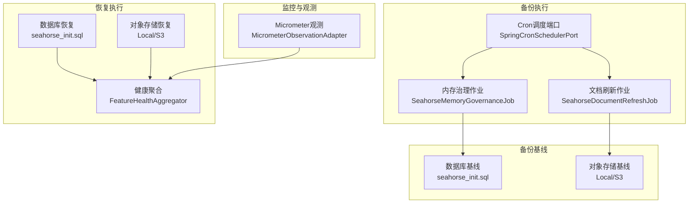
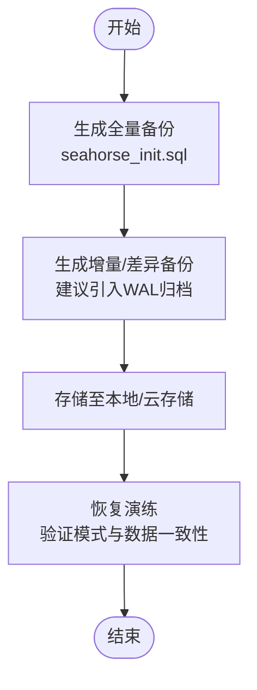
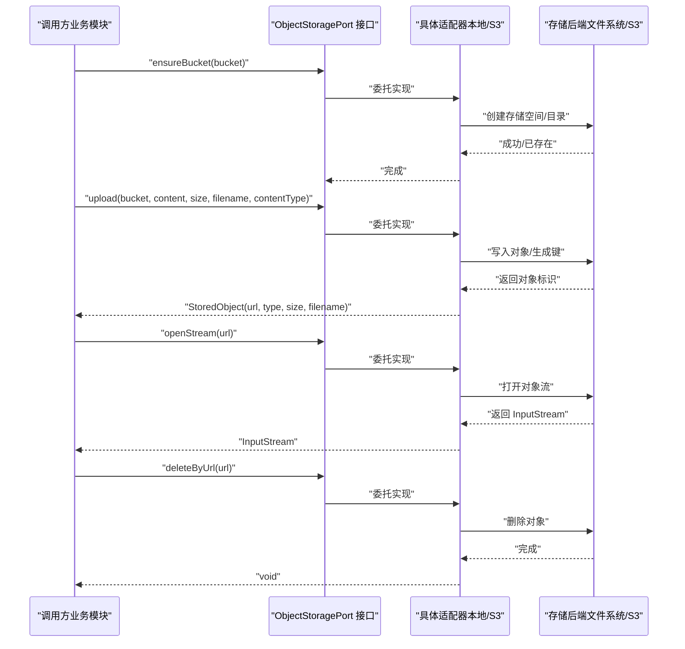
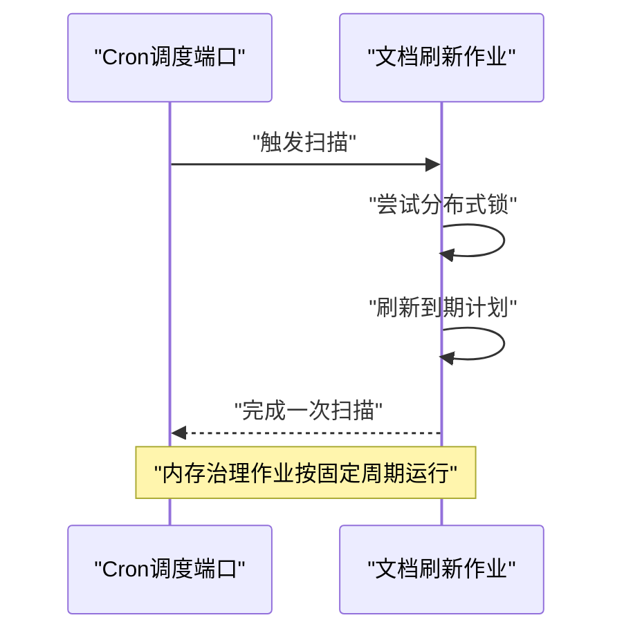
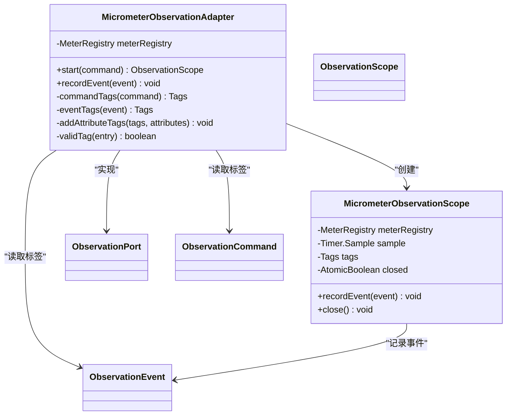
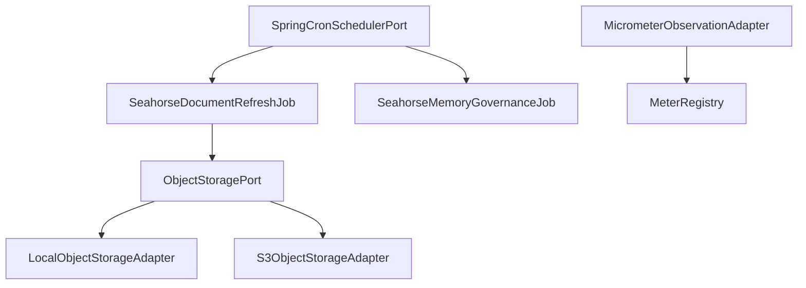

# 备份恢复

<cite>
**本文引用的文件**
- [备份恢复.md](file://docs/zh/content/监控运维/备份恢复.md)
- [seahorse_init.sql](file://resources/database/seahorse_init.sql)
- [application.properties](file://seahorse-agent-bootstrap/src/main/resources/application.properties)
- [application.properties](file://seahorse-agent-spring-boot-starter/src/main/resources/application.properties)
- [存储出站端口.md](file://docs/zh/content/后端系统/核心内核/端口接口/出站端口/存储出站端口.md)
- [LocalObjectStorageAdapter.java](file://seahorse-agent-adapter-storage-local/src/main/java/com/miracle/ai/seahorse/agent/adapters/storage/local/LocalObjectStorageAdapter.java)
- [S3ObjectStorageAdapter.java](file://seahorse-agent-adapter-storage-s3/src/main/java/com/miracle/ai/seahorse/agent/adapters/storage/s3/S3ObjectStorageAdapter.java)
- [SpringCronSchedulerPort.java](file://seahorse-agent-spring-boot-starter/src/main/java/com/miracle/ai/seahorse/agent/adapters/spring/SpringCronSchedulerPort.java)
- [SeahorseDocumentRefreshJob.java](file://seahorse-agent-spring-boot-starter/src/main/java/com/miracle/ai/seahorse/agent/adapters/spring/SeahorseDocumentRefreshJob.java)
- [SeahorseMemoryGovernanceJob.java](file://seahorse-agent-spring-boot-starter/src/main/java/com/miracle/ai/seahorse/agent/adapters/spring/SeahorseMemoryGovernanceJob.java)
- [MicrometerObservationAdapter.java](file://seahorse-agent-adapter-observation-micrometer/src/main/java/com/miracle/ai/seahorse/agent/adapters/observation/micrometer/MicrometerObservationAdapter.java)
- [MicrometerObservationAdapterTests.java](file://seahorse-agent-adapter-observation-micrometer/src/test/java/com/miracle/ai/seahorse/agent/adapters/observation/micrometer/MicrometerObservationAdapterTests.java)
- [应用监控.md](file://docs/zh/content/监控运维/应用监控.md)
- [数据迁移策略.md](file://docs/zh/content/数据库设计/数据迁移策略.md)
- [JdbcChatSchemaUpgrade.java](file://seahorse-agent-adapter-repository-jdbc/src/main/java/com/miracle/ai/seahorse/agent/adapters/repository/jdbc/JdbcChatSchemaUpgrade.java)
- [KernelDocumentRefreshServiceTests.java](file://seahorse-agent-tests/src/test/java/com/miracle/ai/seahorse/agent/kernel/application/knowledge/KernelDocumentRefreshServiceTests.java)
- [OA系统数据安全规范文档.md](file://resources/docs/knowledge/biz/biz-oa/OA系统数据安全规范文档.md)
</cite>

## 目录
1. [简介](#简介)
2. [项目结构](#项目结构)
3. [核心组件](#核心组件)
4. [架构总览](#架构总览)
5. [详细组件分析](#详细组件分析)
6. [依赖分析](#依赖分析)
7. [性能考量](#性能考量)
8. [故障排查指南](#故障排查指南)
9. [结论](#结论)
10. [附录](#附录)

## 简介
本文件面向企业级数据保护与业务连续性，围绕备份与恢复策略提供系统化方案。结合代码库中现有的数据库模式、对象存储适配器、定时调度与可观测性能力，构建覆盖“数据库备份策略、文件系统与对象存储备份、配置与元数据备份、灾难恢复流程、自动化与监控、合规审计”的完整文档。文中所有技术细节均以仓库实际文件为依据，避免臆测。

## 项目结构
本项目采用多模块分层架构，与备份恢复相关的关键位置如下：
- 数据库模式与初始化脚本位于 resources/database，涵盖 PostgreSQL 表结构与初始数据，是数据库备份与恢复的基础。
- 对象存储适配器位于 seahorse-agent-adapter-storage-*，提供本地与 S3 的对象存储能力，用于知识库文档等对象的备份与恢复。
- 定时调度与作业位于 seahorse-agent-spring-boot-starter，提供基于 Cron 的文档刷新与内存治理等周期性任务，体现备份恢复体系中的“巡检与维护”环节。
- 观测与健康聚合位于 seahorse-agent-adapter-observation-micrometer 与 kernel 插件层，为备份恢复的自动化与监控提供指标与健康度评估能力。
- 应用启动配置位于 seahorse-agent-bootstrap，定义内核启用与迁移模式，是备份恢复演练与切换的运行时前提。

图表来源
- [备份恢复.md:106-131](file://docs/zh/content/监控运维/备份恢复.md#L106-L131)
- [SeahorseDocumentRefreshJob.java:1-70](file://seahorse-agent-spring-boot-starter/src/main/java/com/miracle/ai/seahorse/agent/adapters/spring/SeahorseDocumentRefreshJob.java#L1-L70)
- [SeahorseMemoryGovernanceJob.java:1-57](file://seahorse-agent-spring-boot-starter/src/main/java/com/miracle/ai/seahorse/agent/adapters/spring/SeahorseMemoryGovernanceJob.java#L1-L57)
- [SpringCronSchedulerPort.java:1-36](file://seahorse-agent-spring-boot-starter/src/main/java/com/miracle/ai/seahorse/agent/adapters/spring/SpringCronSchedulerPort.java#L1-L36)

章节来源
- [备份恢复.md:36-41](file://docs/zh/content/监控运维/备份恢复.md#L36-L41)

## 核心组件
- 数据库模式与初始化：提供完整的表结构定义与初始数据，作为全量备份的模板与恢复验证的基准。
- 对象存储适配器：通过统一的 ObjectStoragePort 接口屏蔽本地与 S3 的差异，支持对象的上传、读取与删除。
- 定时调度与作业：基于 Cron 的文档刷新与内存治理作业，负责周期性巡检与维护。
- 观测与指标：Micrometer 适配器提供耗时与事件计数指标，支撑备份恢复的监控与告警。

章节来源
- [备份恢复.md:147-167](file://docs/zh/content/监控运维/备份恢复.md#L147-L167)
- [存储出站端口.md:95-124](file://docs/zh/content/后端系统/核心内核/端口接口/出站端口/存储出站端口.md#L95-L124)
- [应用监控.md:134-176](file://docs/zh/content/监控运维/应用监控.md#L134-L176)

## 架构总览
备份恢复体系由“数据基线、对象存储、定时巡检、可观测性与健康度、演练与切换”构成，形成闭环。

图表来源
- [备份恢复.md:106-131](file://docs/zh/content/监控运维/备份恢复.md#L106-L131)

## 详细组件分析

### 数据库备份策略
- 全量备份：以 seahorse_init.sql 为模式基线，作为每日全量备份的模板。
- 增量/差异备份：当前代码库未提供专用的增量/差异备份实现。建议在生产环境引入数据库层面的增量备份机制（例如 PostgreSQL 的 WAL 归档与时间点恢复），并配合 schema 版本升级脚本进行恢复验证。
- 恢复验证：恢复后执行 schema 校验与关键表数据一致性检查，确保模式与数据一致。

图表来源
- [备份恢复.md:152-159](file://docs/zh/content/监控运维/备份恢复.md#L152-L159)
- [seahorse_init.sql:1-850](file://resources/database/seahorse_init.sql#L1-L850)

章节来源
- [备份恢复.md:147-159](file://docs/zh/content/监控运维/备份恢复.md#L147-L159)
- [seahorse_init.sql:1-850](file://resources/database/seahorse_init.sql#L1-L850)

### 文件系统与对象存储备份
- 本地对象存储：LocalObjectStorageAdapter 提供本地文件系统上的对象存储能力，适合小规模或开发测试环境的本地备份与恢复。
- S3 对象存储：S3ObjectStorageAdapter 提供云端对象存储能力，适合生产环境的异地备份与跨区域恢复。
- 备份流程：通过文档刷新作业将知识库文档等对象上传至对象存储，作为对象层备份；恢复时从对象存储拉取并重建索引或引用。

图表来源
- [存储出站端口.md:99-124](file://docs/zh/content/后端系统/核心内核/端口接口/出站端口/存储出站端口.md#L99-L124)

章节来源
- [存储出站端口.md:159-202](file://docs/zh/content/后端系统/核心内核/端口接口/出站端口/存储出站端口.md#L159-L202)
- [LocalObjectStorageAdapter.java:82-97](file://seahorse-agent-adapter-storage-local/src/main/java/com/miracle/ai/seahorse/agent/adapters/storage/local/LocalObjectStorageAdapter.java#L82-L97)
- [S3ObjectStorageAdapter.java:104-113](file://seahorse-agent-adapter-storage-s3/src/main/java/com/miracle/ai/seahorse/agent/adapters/storage/s3/S3ObjectStorageAdapter.java#L104-L113)

### 定时调度与巡检
- 文档刷新作业：基于 Cron 的定时任务，负责扫描到期的文档刷新计划并执行刷新，体现备份恢复体系中的“巡检与维护”。
- 内存治理作业：周期性清理与衰减短期记忆，减少无效数据占用，提升恢复效率。
- Cron 调度端口：提供 Cron 表达式解析与下一次执行时间计算，保障定时任务的稳定性。

图表来源
- [备份恢复.md:202-211](file://docs/zh/content/监控运维/备份恢复.md#L202-L211)
- [SpringCronSchedulerPort.java:1-36](file://seahorse-agent-spring-boot-starter/src/main/java/com/miracle/ai/seahorse/agent/adapters/spring/SpringCronSchedulerPort.java#L1-L36)
- [SeahorseDocumentRefreshJob.java:1-70](file://seahorse-agent-spring-boot-starter/src/main/java/com/miracle/ai/seahorse/agent/adapters/spring/SeahorseDocumentRefreshJob.java#L1-L70)
- [SeahorseMemoryGovernanceJob.java:1-57](file://seahorse-agent-spring-boot-starter/src/main/java/com/miracle/ai/seahorse/agent/adapters/spring/SeahorseMemoryGovernanceJob.java#L1-L57)

章节来源
- [备份恢复.md:197-211](file://docs/zh/content/监控运维/备份恢复.md#L197-L211)

### 观测与监控
- 指标类型与命名：持续时间指标用于记录观测生命周期内的耗时，事件计数指标用于记录独立事件的发生次数。
- 标签体系：观测维度（observation、tenant）、事件维度（event），以及从命令与事件的 attributes 映射中提取的有效键值对。
- 生命周期管理：start 启动计时采样并返回作用域实例；recordEvent 在作用域内或独立记录事件计数器；close 在作用域关闭时完成耗时统计。

图表来源
- [应用监控.md:149-176](file://docs/zh/content/监控运维/应用监控.md#L149-L176)
- [MicrometerObservationAdapter.java:54-89](file://seahorse-agent-adapter-observation-micrometer/src/main/java/com/miracle/ai/seahorse/agent/adapters/observation/micrometer/MicrometerObservationAdapter.java#L54-L89)

章节来源
- [应用监控.md:134-176](file://docs/zh/content/监控运维/应用监控.md#L134-L176)
- [MicrometerObservationAdapter.java:54-89](file://seahorse-agent-adapter-observation-micrometer/src/main/java/com/miracle/ai/seahorse/agent/adapters/observation/micrometer/MicrometerObservationAdapter.java#L54-L89)

### 配置与元数据备份
- 运行时配置：application.properties 中定义内核启用与迁移模式，是备份恢复演练与切换的运行时前提。
- 元数据治理：JdbcChatSchemaUpgrade 负责表结构升级与兼容性处理，确保不同版本间的元数据一致性。

章节来源
- [application.properties:1-4](file://seahorse-agent-bootstrap/src/main/resources/application.properties#L1-L4)
- [application.properties:1-4](file://seahorse-agent-spring-boot-starter/src/main/resources/application.properties#L1-L4)
- [JdbcChatSchemaUpgrade.java:33-685](file://seahorse-agent-adapter-repository-jdbc/src/main/java/com/miracle/ai/seahorse/agent/adapters/repository/jdbc/JdbcChatSchemaUpgrade.java#L33-L685)

### 自动化备份工具配置
- 定时任务设置：通过 Cron 表达式配置文档刷新与内存治理作业的执行周期。
- 备份监控告警：利用 Micrometer 指标体系记录备份过程中的耗时与事件，结合外部监控平台实现告警。
- 备份数据清理：对象存储适配器支持按 URL 删除对象，便于实现基于生命周期的清理策略。

章节来源
- [备份恢复.md:197-211](file://docs/zh/content/监控运维/备份恢复.md#L197-L211)
- [应用监控.md:316-335](file://docs/zh/content/监控运维/应用监控.md#L316-L335)
- [LocalObjectStorageAdapter.java:74-80](file://seahorse-agent-adapter-storage-local/src/main/java/com/miracle/ai/seahorse/agent/adapters/storage/local/LocalObjectStorageAdapter.java#L74-L80)
- [S3ObjectStorageAdapter.java:104-113](file://seahorse-agent-adapter-storage-s3/src/main/java/com/miracle/ai/seahorse/agent/adapters/storage/s3/S3ObjectStorageAdapter.java#L104-L113)

### 备份验证与测试流程
- 备份完整性检查：通过对象存储适配器的 openStream 方法验证对象可读性与完整性。
- 恢复演练：结合数据库初始化脚本与对象存储基线，模拟恢复流程并验证业务功能。
- 备份效果评估：利用 Micrometer 指标评估备份与恢复的性能表现。

章节来源
- [备份恢复.md:147-167](file://docs/zh/content/监控运维/备份恢复.md#L147-L167)
- [存储出站端口.md:159-202](file://docs/zh/content/后端系统/核心内核/端口接口/出站端口/存储出站端口.md#L159-L202)
- [应用监控.md:134-176](file://docs/zh/content/监控运维/应用监控.md#L134-L176)

### 灾难恢复计划
- RTO/RPO 目标：参考企业级规范，建议日全量、2 小时增量、周冷备、月跨地域；明确 RPO ≤ 10 分钟、RTO ≤ 2 小时。
- 恢复优先级排序：优先恢复核心数据库与对象存储，其次恢复配置与元数据。
- 业务连续性保障：通过分布式锁与健康聚合确保恢复过程的稳定性与一致性。

章节来源
- [备份恢复.md:298-300](file://docs/zh/content/监控运维/备份恢复.md#L298-L300)
- [OA系统数据安全规范文档.md:166-179](file://resources/docs/knowledge/biz/biz-oa/OA系统数据安全规范文档.md#L166-L179)

## 依赖分析
- 组件耦合与内聚：对象存储适配器通过统一接口与业务模块解耦，提高内聚性与可替换性。
- 直接与间接依赖：定时作业依赖 Cron 调度端口，对象存储作业依赖对象存储适配器，观测适配器依赖 Micrometer 注册表。
- 外部依赖与集成点：S3 适配器依赖 AWS SDK，本地适配器依赖文件系统 API。

图表来源
- [备份恢复.md:106-131](file://docs/zh/content/监控运维/备份恢复.md#L106-L131)
- [SpringCronSchedulerPort.java:1-36](file://seahorse-agent-spring-boot-starter/src/main/java/com/miracle/ai/seahorse/agent/adapters/spring/SpringCronSchedulerPort.java#L1-L36)
- [SeahorseDocumentRefreshJob.java:1-70](file://seahorse-agent-spring-boot-starter/src/main/java/com/miracle/ai/seahorse/agent/adapters/spring/SeahorseDocumentRefreshJob.java#L1-L70)
- [SeahorseMemoryGovernanceJob.java:1-57](file://seahorse-agent-spring-boot-starter/src/main/java/com/miracle/ai/seahorse/agent/adapters/spring/SeahorseMemoryGovernanceJob.java#L1-L57)
- [LocalObjectStorageAdapter.java:82-97](file://seahorse-agent-adapter-storage-local/src/main/java/com/miracle/ai/seahorse/agent/adapters/storage/local/LocalObjectStorageAdapter.java#L82-L97)
- [S3ObjectStorageAdapter.java:104-113](file://seahorse-agent-adapter-storage-s3/src/main/java/com/miracle/ai/seahorse/agent/adapters/storage/s3/S3ObjectStorageAdapter.java#L104-L113)
- [MicrometerObservationAdapter.java:54-89](file://seahorse-agent-adapter-observation-micrometer/src/main/java/com/miracle/ai/seahorse/agent/adapters/observation/micrometer/MicrometerObservationAdapter.java#L54-L89)

## 性能考量
- 指标开销：计数器与定时器均为轻量级操作，但在高频事件场景下仍需控制标签基数与事件频率。
- 标签基数：避免动态高基数标签（如用户输入内容、具体 ID 列表），优先使用稳定枚举或归一化键值。
- 采样与批处理：对于高频事件，可考虑在应用侧聚合后再上报，降低指标数量与网络开销。
- 关闭时机：确保 ObservationScope 在 finally 中关闭，避免未停止的采样导致内存泄漏与指标失真。

章节来源
- [应用监控.md:316-324](file://docs/zh/content/监控运维/应用监控.md#L316-L324)

## 故障排查指南
- 常见问题
  - 观测指标缺失：确认 ObservationPort 已被 Micrometer 实现替换，且 MeterRegistry 注入成功。
  - 标签异常：检查 attributes 是否包含空键或空值，适配器会对无效条目进行过滤。
  - 事件未统计：确认 recordEvent 调用发生在作用域内或独立调用均有效。
  - 耗时指标为零：检查是否正确调用 scope.close()，以及 Timer.start 是否在 start 中调用。
- 排查步骤
  - 在关键入口打印观测命令与事件信息，验证标签与名称。
  - 临时切换为 noop 适配器，确认业务逻辑不受观测代码影响。
  - 检查包装器链顺序与诊断信息，避免同名或冲突顺序导致的异常。

章节来源
- [应用监控.md:326-335](file://docs/zh/content/监控运维/应用监控.md#L326-L335)

## 结论
本项目提供了数据库模式与对象存储适配器、定时调度与可观测性的基础能力，可作为备份恢复体系的基石。结合企业级规范中的 RPO/RTO 目标与演练要求，建议在现有基础上补充数据库增量备份与跨区域冷备策略，并完善自动化巡检、监控告警与恢复演练流程，确保满足企业级数据保护需求。

## 附录
- 备份恢复策略建议（来自企业级规范）：日全量、2 小时增量、周冷备、月跨地域；备份加密、独立账号访问、定期恢复演练；明确 RPO ≤ 10 分钟、RTO ≤ 2 小时；备份/恢复脚本化、参数化，纳入巡检；恢复演练出报告，覆盖“库+对象存储+配置中心”。

章节来源
- [备份恢复.md:298-300](file://docs/zh/content/监控运维/备份恢复.md#L298-L300)
- [OA系统数据安全规范文档.md:166-179](file://resources/docs/knowledge/biz/biz-oa/OA系统数据安全规范文档.md#L166-L179)