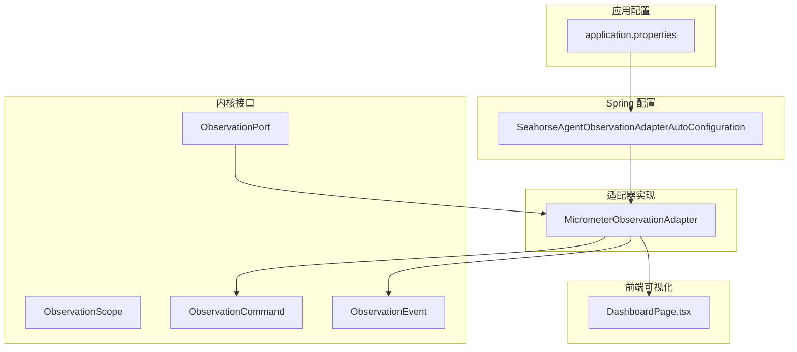
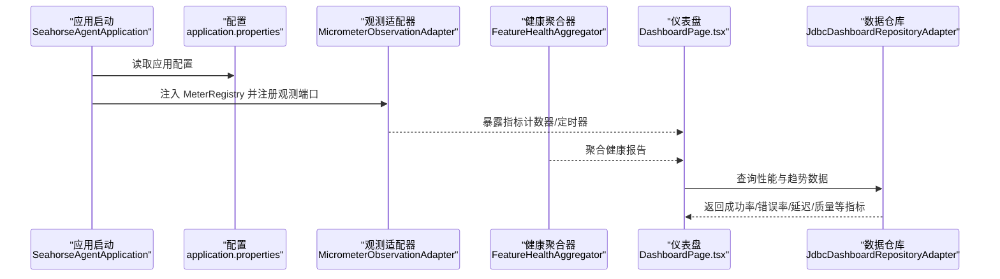
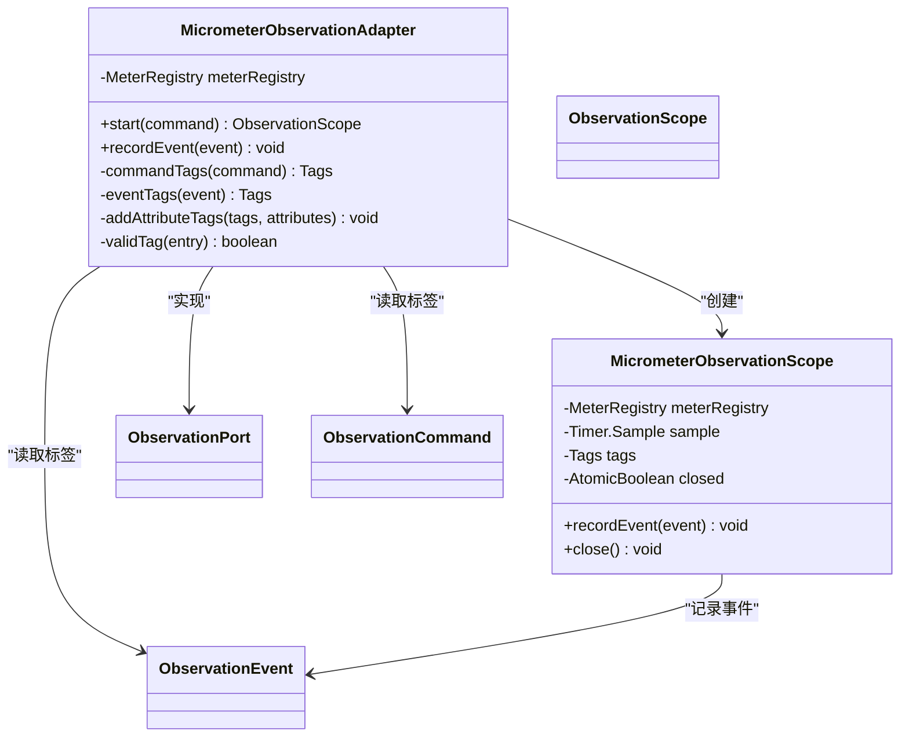
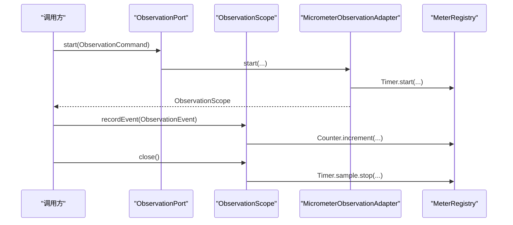
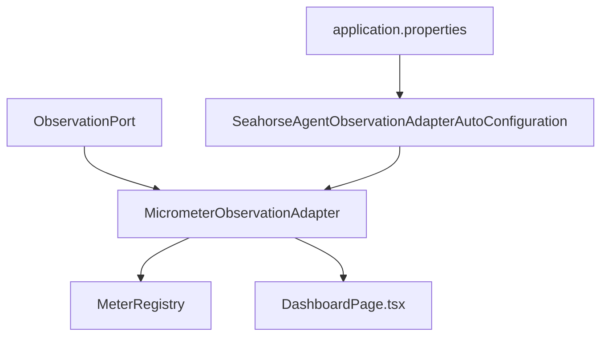

# 应用监控

<cite>
**本文引用的文件**
- [MicrometerObservationAdapter.java](file://seahorse-agent-adapter-observation-micrometer/src/main/java/com/miracle/ai/seahorse/agent/adapters/observation/micrometer/MicrometerObservationAdapter.java)
- [MicrometerObservationAdapterTests.java](file://seahorse-agent-adapter-observation-micrometer/src/test/java/com/miracle/ai/seahorse/agent/adapters/observation/micrometer/MicrometerObservationAdapterTests.java)
- [ObservationPort.java](file://seahorse-agent-kernel/src/main/java/com/miracle/ai/seahorse/agent/ports/outbound/observation/ObservationPort.java)
- [ObservationScope.java](file://seahorse-agent-kernel/src/main/java/com/miracle/ai/seahorse/agent/ports/outbound/observation/ObservationScope.java)
- [ObservationCommand.java](file://seahorse-agent-kernel/src/main/java/com/miracle/ai/seahorse/agent/ports/outbound/observation/ObservationCommand.java)
- [ObservationEvent.java](file://seahorse-agent-kernel/src/main/java/com/miracle/ai/seahorse/agent/ports/outbound/observation/ObservationEvent.java)
- [SeahorseAgentObservationAdapterAutoConfiguration.java](file://seahorse-agent-spring-boot-starter\src\main\java\com\miracle\ai\seahorse\agent\adapters\spring\SeahorseAgentObservationAdapterAutoConfiguration.java)
- [application.properties](file://seahorse-agent-bootstrap\src\main\resources\application.properties)
- [DashboardPage.tsx](file://frontend\src\pages\admin\dashboard\DashboardPage.tsx)
- [应用监控.md](file://docs\zh\content\监控运维\应用监控.md)
- [监控运维.md](file://docs\zh\content\监控运维\监控运维.md)
- [观测性适配器.md](file://docs\zh\content\后端系统\适配器模块\观测性适配器.md)
</cite>

## 目录
1. [简介](#简介)
2. [项目结构](#项目结构)
3. [核心组件](#核心组件)
4. [架构总览](#架构总览)
5. [详细组件分析](#详细组件分析)
6. [依赖关系分析](#依赖关系分析)
7. [性能考虑](#性能考虑)
8. [故障排除指南](#故障排除指南)
9. [结论](#结论)
10. [附录](#附录)

## 简介
本文件面向运维与开发团队，系统化梳理 Seahorse Agent 应用监控体系，重点围绕 Micrometer 观测适配器的实现原理、配置方法与最佳实践展开。内容涵盖：
- 指标类型与命名规范：持续时间指标（Timer）与事件计数指标（Counter）
- 指标标签管理：观测维度、事件维度与属性维度的标签体系
- 指标导出机制：与 Micrometer 注册表对接，支持 Prometheus 等外部系统
- 关键性能指标配置：内存使用率、CPU 负载、数据库连接数、消息队列延迟等
- 可视化与告警：Grafana 仪表板与 Prometheus 告警规则配置思路
- 运维最佳实践：指标命名、采样频率、存储策略与故障排查

## 项目结构
监控相关代码主要分布在以下模块：
- 适配器实现：Micrometer 观测适配器
- 内核接口：ObservationPort、ObservationScope、ObservationCommand、ObservationEvent
- Spring 自动配置：观测适配器自动装配
- 文档与示例：应用监控文档、监控运维文档、前端仪表盘

**图表来源**
- [ObservationPort.java](file://seahorse-agent-kernel/src/main/java/com/miracle/ai/seahorse/agent/ports/outbound/observation/ObservationPort.java)
- [MicrometerObservationAdapter.java](file://seahorse-agent-adapter-observation-micrometer/src/main/java/com/miracle/ai/seahorse/agent/adapters/observation/micrometer/MicrometerObservationAdapter.java)
- [SeahorseAgentObservationAdapterAutoConfiguration.java](file://seahorse-agent-spring-boot-starter\src\main\java\com\miracle\ai\seahorse\agent\adapters\spring\SeahorseAgentObservationAdapterAutoConfiguration.java)
- [application.properties](file://seahorse-agent-bootstrap\src\main\resources\application.properties)
- [DashboardPage.tsx](file://frontend\src\pages\admin\dashboard\DashboardPage.tsx)

**章节来源**
- [应用监控.md](file://docs\zh\content\监控运维\应用监控.md)
- [监控运维.md](file://docs\zh\content\监控运维\监控运维.md)

## 核心组件
- 观测端口接口：定义 start、recordEvent、close 等观测生命周期方法，隔离业务与观测实现。
- 观测命令与事件：封装观测上下文（名称、租户）与事件元数据（名称、时间戳、数量、属性）。
- Micrometer 适配器：对接 Micrometer 注册表，生成 Timer 与 Counter 指标，按标签聚合。
- 自动配置：通过 Spring 自动装配注入 MeterRegistry，注册观测端口实现。

**章节来源**
- [ObservationPort.java](file://seahorse-agent-kernel/src/main/java/com/miracle/ai/seahorse/agent/ports/outbound/observation/ObservationPort.java)
- [ObservationScope.java](file://seahorse-agent-kernel/src/main/java/com/miracle/ai/seahorse/agent/ports/outbound/observation/ObservationScope.java)
- [ObservationCommand.java](file://seahorse-agent-kernel/src/main/java/com/miracle/ai/seahorse/agent/ports/outbound/observation/ObservationCommand.java)
- [ObservationEvent.java](file://seahorse-agent-kernel/src/main/java/com/miracle/ai/seahorse/agent/ports/outbound/observation/ObservationEvent.java)
- [MicrometerObservationAdapter.java](file://seahorse-agent-adapter-observation-micrometer/src/main/java/com/miracle/ai/seahorse/agent/adapters/observation/micrometer/MicrometerObservationAdapter.java)
- [SeahorseAgentObservationAdapterAutoConfiguration.java](file://seahorse-agent-spring-boot-starter\src\main\java\com\miracle\ai\seahorse\agent\adapters\spring\SeahorseAgentObservationAdapterAutoConfiguration.java)

## 架构总览
下图展示从应用启动到指标采集、健康检查与前端可视化的整体流程。

**图表来源**
- [监控运维.md](file://docs\zh\content\监控运维\监控运维.md)
- [application.properties](file://seahorse-agent-bootstrap\src\main\resources\application.properties)
- [DashboardPage.tsx](file://frontend\src\pages\admin\dashboard\DashboardPage.tsx)

## 详细组件分析

### Micrometer 观测适配器实现
- 指标类型与命名
  - 持续时间指标：用于记录观测生命周期内的耗时，名称为固定常量。
  - 事件计数指标：用于记录独立事件的发生次数，名称为固定常量。
- 标签体系
  - 观测维度：observation（来自命令名称）、tenant（来自命令租户标识）。
  - 事件维度：event（来自事件名称）。
  - 属性维度：从命令与事件的 attributes 映射中提取有效键值对作为标签。
- 生命周期管理
  - start：启动计时采样，合并标签后返回作用域实例。
  - recordEvent：在作用域内或独立记录事件计数器。
  - close：在作用域关闭时，基于标签构建定时器并停止采样，完成耗时统计。

**图表来源**
- [应用监控.md](file://docs\zh\content\监控运维\应用监控.md)
- [MicrometerObservationAdapter.java](file://seahorse-agent-adapter-observation-micrometer/src/main/java/com/miracle/ai/seahorse/agent/adapters/observation/micrometer/MicrometerObservationAdapter.java)

**章节来源**
- [应用监控.md](file://docs\zh\content\监控运维\应用监控.md)
- [观测性适配器.md](file://docs\zh\content\后端系统\适配器模块\观测性适配器.md)

### 观测生命周期与指标生成序列

**图表来源**
- [观测性适配器.md](file://docs\zh\content\后端系统\适配器模块\观测性适配器.md)
- [ObservationPort.java](file://seahorse-agent-kernel/src/main/java/com/miracle/ai/seahorse/agent/ports/outbound/observation/ObservationPort.java)
- [ObservationScope.java](file://seahorse-agent-kernel/src/main/java/com/miracle/ai/seahorse/agent/ports/outbound/observation/ObservationScope.java)
- [MicrometerObservationAdapter.java](file://seahorse-agent-adapter-observation-micrometer/src/main/java/com/miracle/ai/seahorse/agent/adapters/observation/micrometer/MicrometerObservationAdapter.java)

### 指标类型定义与测试验证
- 持续时间指标（Timer）：记录观测生命周期耗时，标签包含 observation 与 tenant。
- 事件计数指标（Counter）：记录事件发生次数，标签包含 event 与 observation。
- 测试验证：通过 SimpleMeterRegistry 验证事件计数累加与标签匹配。

**章节来源**
- [MicrometerObservationAdapterTests.java](file://seahorse-agent-adapter-observation-micrometer/src/test/java/com/miracle/ai/seahorse/agent/adapters/observation/micrometer/MicrometerObservationAdapterTests.java)

### 指标导出与可视化
- 导出机制：通过 Micrometer 注册表暴露指标，支持 Prometheus、InfluxDB、CloudWatch 等后端。
- 前端可视化：DashboardPage.tsx 定义阈值与趋势展示，结合后端数据仓库查询指标数据。

**章节来源**
- [应用监控.md](file://docs\zh\content\监控运维\应用监控.md)
- [DashboardPage.tsx](file://frontend\src\pages\admin\dashboard\DashboardPage.tsx)

## 依赖关系分析
- 组件耦合
  - 内核仅依赖 ObservationPort 抽象，通过自动配置注入 Micrometer 适配器，实现运行时解耦。
  - 适配器依赖 Micrometer 注册表，负责指标生成与标签处理。
- 外部依赖
  - Spring Boot 自动装配负责加载配置与注册 Bean。
  - 前端通过 HTTP 接口访问后端数据仓库，展示指标与健康状态。

**图表来源**
- [ObservationPort.java](file://seahorse-agent-kernel/src/main/java/com/miracle/ai/seahorse/agent/ports/outbound/observation/ObservationPort.java)
- [MicrometerObservationAdapter.java](file://seahorse-agent-adapter-observation-micrometer/src/main/java/com/miracle/ai/seahorse/agent/adapters/observation/micrometer/MicrometerObservationAdapter.java)
- [SeahorseAgentObservationAdapterAutoConfiguration.java](file://seahorse-agent-spring-boot-starter\src\main\java\com\miracle\ai\seahorse\agent\adapters\spring\SeahorseAgentObservationAdapterAutoConfiguration.java)
- [application.properties](file://seahorse-agent-bootstrap\src\main\resources\application.properties)
- [DashboardPage.tsx](file://frontend\src\pages\admin\dashboard\DashboardPage.tsx)

**章节来源**
- [应用监控.md](file://docs\zh\content\监控运维\应用监控.md)

## 性能考虑
- 指标基数控制：避免在标签中引入高基数动态键，优先使用有限枚举值或标准化键。
- 事件命名规范：采用“动作-对象-结果”结构，提升可读性与聚合效率。
- 采样频率优化：在高频路径上谨慎记录事件，建议在作用域内统一记录关键子步骤，在关闭时生成耗时指标。
- 存储策略：结合业务 SLA 选择合适的保留周期与聚合粒度，避免过度占用存储空间。

## 故障排除指南
- 指标缺失
  - 检查是否正确注入 MeterRegistry 与注册观测端口。
  - 确认应用配置已启用观测适配器自动装配。
- 标签异常
  - 核对命令与事件 attributes 是否包含有效键值对。
  - 验证标签过滤逻辑，确保空键与空值被正确剔除。
- 可视化问题
  - 确认前端仪表盘阈值与后端数据仓库查询逻辑一致。
  - 检查时间窗口与聚合方式是否符合预期。

**章节来源**
- [应用监控.md](file://docs\zh\content\监控运维\应用监控.md)

## 结论
Micrometer 观测适配器提供了与运行时解耦的指标采集能力，通过统一的 ObservationCommand/Event/Scope 抽象，将业务执行过程转化为可聚合、可对比的指标数据。结合显式追踪与合理的标签设计，可在不侵入业务逻辑的前提下，获得高质量的运行时洞察。建议在核心业务模块中统一接入观测端口，并遵循命名与标签规范，持续优化指标基数与上报策略。

## 附录

### 指标命名规范与标签体系设计
- 命名规范
  - 指标前缀：seahorse.agent.observation
  - 持续时间：duration
  - 事件计数：events
- 标签体系
  - 观测标签：observation（观测名称）、tenant（租户标识）
  - 事件标签：event（事件名称）
  - 属性标签：从 attributes 中提取，过滤空键与空值
- 最佳实践
  - 控制标签基数，避免高基数动态键
  - 事件命名采用“动作-对象-结果”结构
  - 在作用域内记录关键子步骤事件，统一在关闭时生成耗时指标

### 外部监控系统集成方案
- Prometheus
  - 使用 Micrometer 提供的 Prometheus Registry，通过 HTTP 暴露指标端点，Prometheus 抓取。
- InfluxDB
  - 使用 Micrometer 的 InfluxMeterRegistry，配置 InfluxDB 端点与认证，自动上报指标。
- CloudWatch
  - 使用 Micrometer 的 CloudWatchMeterRegistry，配置区域与凭证，按维度上报指标。
- 其他
  - 可根据需要引入相应 Micrometer Registry 实现，统一通过 MeterRegistry 注入与适配器对接。

### 关键性能指标配置示例（概念性说明）
- 内存使用率
  - 指标类型：Gauge（通过 JVM 指标或自定义 Gauge）
  - 标签：observation=runtime, tenant={租户}
- CPU 负载
  - 指标类型：Gauge（JVM Load Average 或自定义）
  - 标签：observation=runtime, tenant={租户}
- 数据库连接数
  - 指标类型：Gauge（连接池指标）
  - 标签：observation=db, tenant={租户}, pool={连接池名称}
- 消息队列延迟
  - 指标类型：Timer（消息发送到消费完成的耗时）
  - 标签：observation=mq, tenant={租户}, queue={队列名}, operation={produce/consume}