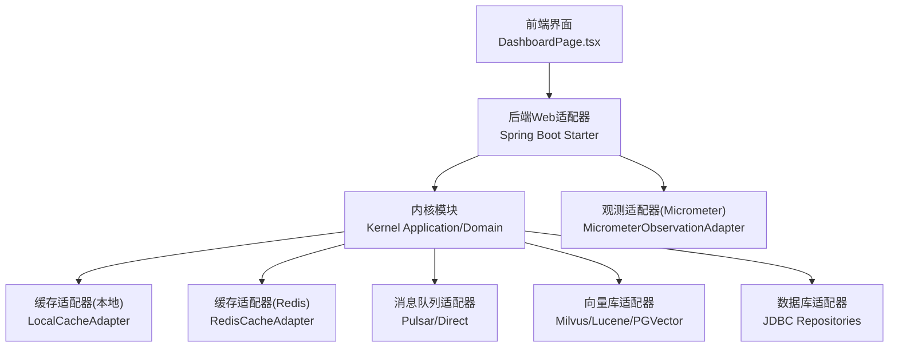
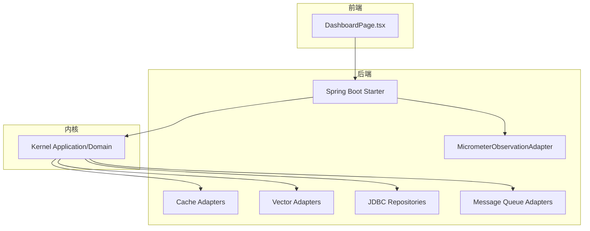
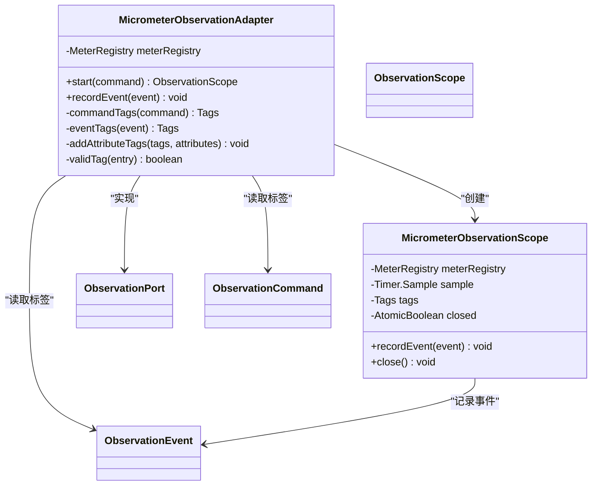
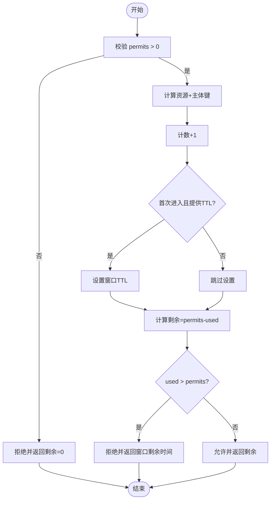
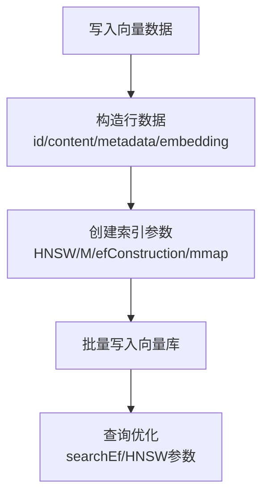
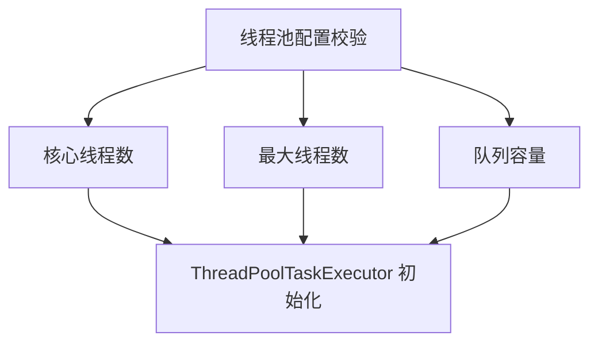

# 性能优化

<cite>
**本文引用的文件**
- [性能测试.md](file://docs/zh/content/测试策略/性能测试.md)
- [生产环境部署.md](file://docs/zh/content/部署配置/生产环境部署.md)
- [性能调优配置.md](file://docs/zh/content/部署配置/性能调优配置.md)
- [数据库适配器.md](file://docs/zh/content/后端系统/适配器模块/数据库适配器.md)
- [缓存适配器.md](file://docs/zh/content/后端系统/适配器模块/缓存适配器.md)
- [应用监控.md](file://docs/zh/content/监控运维/应用监控.md)
- [MicrometerObservationAdapter.java](file://seahorse-agent-adapter-observation-micrometer/src/main/java/com/miracle/ai/seahorse/agent/adapters/observation/micrometer/MicrometerObservationAdapter.java)
- [MicrometerObservationAdapterTests.java](file://seahorse-agent-adapter-observation-micrometer/src/test/java/com/miracle/ai/seahorse/agent/adapters/observation/micrometer/MicrometerObservationAdapterTests.java)
- [LocalCacheAdapter.java](file://seahorse-agent-adapter-cache-local/src/main/java/com/miracle/ai/seahorse/agent/adapters/cache/local/LocalCacheAdapter.java)
- [RedisCacheAdapter.java](file://seahorse-agent-adapter-cache-redis/src/main/java/com/miracle/ai/seahorse/agent/adapters/cache/redis/RedisCacheAdapter.java)
- [RedisSemaphoreAdapter.java](file://seahorse-agent-adapter-cache-redis/src/main/java/com/miracle/ai/seahorse/agent/adapters/cache/redis/RedisSemaphoreAdapter.java)
- [LocalSemaphoreAdapter.java](file://seahorse-agent-adapter-cache-local/src/main/java/com/miracle/ai/seahorse/agent/adapters/cache/local/LocalSemaphoreAdapter.java)
- [SeahorseAgentCacheAdapterAutoConfiguration.java](file://seahorse-agent-spring-boot-starter/src/main/java/com/miracle/ai/seahorse/agent/adapters/spring/SeahorseAgentCacheAdapterAutoConfiguration.java)
- [SeahorseAgentKernelRetrievalAutoConfiguration.java](file://seahorse-agent-spring-boot-starter/src/main/java/com/miracle/ai/seahorse/agent/adapters/spring/SeahorseAgentKernelRetrievalAutoConfiguration.java)
- [RoutingProperties.java](file://seahorse-agent-spring-boot-starter/src/main/java/com/miracle/ai/seahorse/agent/adapters/spring/properties/RoutingProperties.java)
- [KernelAgentLoopOptions.java](file://seahorse-agent-kernel/src/main/java/com/miracle/ai/seahorse/agent/kernel/application/agent/KernelAgentLoopOptions.java)
- [AgentRunWorkerLimits.java](file://seahorse-agent-kernel/src/main/java/com/miracle/ai/seahorse/agent/kernel/domain/agent/runtime/AgentRunWorkerLimits.java)
- [MilvusVectorAdapter.java](file://seahorse-agent-adapter-vector-milvus/src/main/java/com/miracle/ai/seahorse/agent/adapters/vector/milvus/MilvusVectorAdapter.java)
- [MilvusVectorProperties.java](file://seahorse-agent-adapter-vector-milvus/src/main/java/com/miracle/ai/seahorse/agent/adapters/vector/milvus/MilvusVectorProperties.java)
- [RuleBasedQueryOptimizerPortTests.java](file://seahorse-agent-tests/src/test/java/com/miracle/ai/seahorse/agent/kernel/application/chat/RuleBasedQueryOptimizerPortTests.java)
- [DashboardPage.tsx](file://frontend/src/pages/admin/dashboard/DashboardPage.tsx)
</cite>

## 目录
1. [简介](#简介)
2. [项目结构](#项目结构)
3. [核心组件](#核心组件)
4. [架构总览](#架构总览)
5. [详细组件分析](#详细组件分析)
6. [依赖分析](#依赖分析)
7. [性能考量](#性能考量)
8. [故障排查指南](#故障排查指南)
9. [结论](#结论)
10. [附录](#附录)

## 简介
本指南面向Seahorse Agent的性能优化工作，聚焦于RAG性能评估、吞吐量与延迟分析、监控指标体系、瓶颈识别与调优策略、容量规划与测试案例。内容基于仓库中的测试策略文档、部署与调优文档、观测适配器实现以及关键内核与适配器模块，帮助读者从开发到生产建立系统化的性能优化流程。

## 项目结构
Seahorse Agent采用多模块分层组织，核心与适配器解耦，便于替换与扩展。前端负责用户交互与部分指标展示，后端通过适配器对接缓存、消息队列、向量库、数据库等外部依赖，内核提供领域能力与运行时控制。

图表来源
- [DashboardPage.tsx:103-144](file://frontend/src/pages/admin/dashboard/DashboardPage.tsx#L103-L144)
- [SeahorseAgentCacheAdapterAutoConfiguration.java:55-101](file://seahorse-agent-spring-boot-starter/src/main/java/com/miracle/ai/seahorse/agent/adapters/spring/SeahorseAgentCacheAdapterAutoConfiguration.java#L55-L101)
- [MicrometerObservationAdapter.java:1-89](file://seahorse-agent-adapter-observation-micrometer/src/main/java/com/miracle/ai/seahorse/agent/adapters/observation/micrometer/MicrometerObservationAdapter.java#L1-L89)

章节来源
- [DashboardPage.tsx:103-144](file://frontend/src/pages/admin/dashboard/DashboardPage.tsx#L103-L144)
- [SeahorseAgentCacheAdapterAutoConfiguration.java:55-101](file://seahorse-agent-spring-boot-starter/src/main/java/com/miracle/ai/seahorse/agent/adapters/spring/SeahorseAgentCacheAdapterAutoConfiguration.java#L55-L101)
- [MicrometerObservationAdapter.java:1-89](file://seahorse-agent-adapter-observation-micrometer/src/main/java/com/miracle/ai/seahorse/agent/adapters/observation/micrometer/MicrometerObservationAdapter.java#L1-L89)

## 核心组件
- 性能基线与阶段性after指标：包含首次令牌耗时、完整聊天耗时、单/多通道检索耗时、MCP协调耗时、记忆加载耗时、模型路由耗时、文档入库耗时等；提供p50/p95/p99分位数、最大回归百分比与初始样本集。
- 测试指标体系：响应时间、吞吐量(QPS)、并发处理能力、错误率、资源占用(CPU/内存/GC/网络/磁盘/数据库连接/锁等待/向量库查询与索引命中率)。
- 监控与观测：Micrometer观测适配器暴露指标，结合Prometheus/Grafana可视化；前端仪表盘阈值与趋势展示辅助SLA治理。

章节来源
- [性能测试.md:66-381](file://docs/zh/content/测试策略/性能测试.md#L66-L381)
- [应用监控.md:134-177](file://docs/zh/content/监控运维/应用监控.md#L134-L177)
- [DashboardPage.tsx:103-144](file://frontend/src/pages/admin/dashboard/DashboardPage.tsx#L103-L144)

## 架构总览
下图展示性能相关的关键组件与交互：前端仪表盘、后端Web层、内核应用与领域、观测适配器、缓存与向量库适配器、数据库适配器及消息队列。

图表来源
- [DashboardPage.tsx:103-144](file://frontend/src/pages/admin/dashboard/DashboardPage.tsx#L103-L144)
- [MicrometerObservationAdapter.java:1-89](file://seahorse-agent-adapter-observation-micrometer/src/main/java/com/miracle/ai/seahorse/agent/adapters/observation/micrometer/MicrometerObservationAdapter.java#L1-L89)
- [SeahorseAgentCacheAdapterAutoConfiguration.java:55-101](file://seahorse-agent-spring-boot-starter/src/main/java/com/miracle/ai/seahorse/agent/adapters/spring/SeahorseAgentCacheAdapterAutoConfiguration.java#L55-L101)

## 详细组件分析

### 观测与指标体系（Micrometer）
- 指标类型与命名：持续时间指标用于观测生命周期耗时，事件计数指标用于独立事件发生次数。
- 标签体系：观测维度(observation、tenant)、事件维度(event)、属性维度(attributes映射)。
- 生命周期管理：start启动计时采样并返回作用域；recordEvent在作用域内或独立记录事件计数器；close在作用域关闭时基于标签构建定时器并完成耗时统计。
- 测试验证：通过单元测试验证事件计数累加与标签正确性。

图表来源
- [MicrometerObservationAdapter.java:1-89](file://seahorse-agent-adapter-observation-micrometer/src/main/java/com/miracle/ai/seahorse/agent/adapters/observation/micrometer/MicrometerObservationAdapter.java#L1-L89)

章节来源
- [应用监控.md:134-177](file://docs/zh/content/监控运维/应用监控.md#L134-L177)
- [MicrometerObservationAdapter.java:1-89](file://seahorse-agent-adapter-observation-micrometer/src/main/java/com/miracle/ai/seahorse/agent/adapters/observation/micrometer/MicrometerObservationAdapter.java#L1-L89)
- [MicrometerObservationAdapterTests.java:1-113](file://seahorse-agent-adapter-observation-micrometer/src/test/java/com/miracle/ai/seahorse/agent/adapters/observation/micrometer/MicrometerObservationAdapterTests.java#L1-L113)

### 缓存适配器（本地与Redis）
- 本地适配器：基于单JVM集合的互斥与计数，适合本地开发与单实例部署；提供本地分布式锁与信号量能力。
- Redis适配器：基于Redisson提供跨节点缓存、锁、发布订阅与信号量；支持窗口限流与TTL过期策略。
- 自动配置：通过属性开关选择适配器类型，保持Bean名称一致，便于替换。

图表来源
- [LocalCacheAdapter.java:77-98](file://seahorse-agent-adapter-cache-local/src/main/java/com/miracle/ai/seahorse/agent/adapters/cache/local/LocalCacheAdapter.java#L77-L98)
- [RedisCacheAdapter.java:88-103](file://seahorse-agent-adapter-cache-redis/src/main/java/com/miracle/ai/seahorse/agent/adapters/cache/redis/RedisCacheAdapter.java#L88-L103)

章节来源
- [缓存适配器.md:333-446](file://docs/zh/content/后端系统/适配器模块/缓存适配器.md#L333-L446)
- [LocalCacheAdapter.java:100-137](file://seahorse-agent-adapter-cache-local/src/main/java/com/miracle/ai/seahorse/agent/adapters/cache/local/LocalCacheAdapter.java#L100-L137)
- [RedisCacheAdapter.java:105-139](file://seahorse-agent-adapter-cache-redis/src/main/java/com/miracle/ai/seahorse/agent/adapters/cache/redis/RedisCacheAdapter.java#L105-L139)
- [SeahorseAgentCacheAdapterAutoConfiguration.java:55-101](file://seahorse-agent-spring-boot-starter/src/main/java/com/miracle/ai/seahorse/agent/adapters/spring/SeahorseAgentCacheAdapterAutoConfiguration.java#L55-L101)

### 向量检索与索引（Milvus）
- 索引参数：HNSW索引类型、M与efConstruction参数、是否启用mmap；metricType由属性配置决定。
- 批处理写入：构造包含id/content/metadata/embedding的行数据，批量写入向量库。
- 性能要点：合理设置HNSW参数与搜索ef，平衡召回与速度；结合缓存与预过滤降低无效查询。

图表来源
- [MilvusVectorAdapter.java:249-279](file://seahorse-agent-adapter-vector-milvus/src/main/java/com/miracle/ai/seahorse/agent/adapters/vector/milvus/MilvusVectorAdapter.java#L249-L279)
- [MilvusVectorProperties.java:56-68](file://seahorse-agent-adapter-vector-milvus/src/main/java/com/miracle/ai/seahorse/agent/adapters/vector/milvus/MilvusVectorProperties.java#L56-L68)

章节来源
- [MilvusVectorAdapter.java:249-279](file://seahorse-agent-adapter-vector-milvus/src/main/java/com/miracle/ai/seahorse/agent/adapters/vector/milvus/MilvusVectorAdapter.java#L249-L279)
- [MilvusVectorProperties.java:56-68](file://seahorse-agent-adapter-vector-milvus/src/main/java/com/miracle/ai/seahorse/agent/adapters/vector/milvus/MilvusVectorProperties.java#L56-L68)

### RAG执行与线程池（检索线程池）
- 线程池配置：核心线程、最大线程、队列容量安全校验，线程名前缀统一；用于RAG检索与内存项转换。
- 并发控制：内核Agent循环选项包含最大步数、单工具超时、最大并行工具数；运行worker限制保障每tick安全上限。

图表来源
- [SeahorseAgentKernelRetrievalAutoConfiguration.java:218-229](file://seahorse-agent-spring-boot-starter/src/main/java/com/miracle/ai/seahorse/agent/adapters/spring/SeahorseAgentKernelRetrievalAutoConfiguration.java#L218-L229)
- [KernelAgentLoopOptions.java:31-96](file://seahorse-agent-kernel/src/main/java/com/miracle/ai/seahorse/agent/kernel/application/agent/KernelAgentLoopOptions.java#L31-L96)
- [AgentRunWorkerLimits.java:20-34](file://seahorse-agent-kernel/src/main/java/com/miracle/ai/seahorse/agent/kernel/domain/agent/runtime/AgentRunWorkerLimits.java#L20-L34)

章节来源
- [SeahorseAgentKernelRetrievalAutoConfiguration.java:218-229](file://seahorse-agent-spring-boot-starter/src/main/java/com/miracle/ai/seahorse/agent/adapters/spring/SeahorseAgentKernelRetrievalAutoConfiguration.java#L218-L229)
- [KernelAgentLoopOptions.java:31-96](file://seahorse-agent-kernel/src/main/java/com/miracle/ai/seahorse/agent/kernel/application/agent/KernelAgentLoopOptions.java#L31-L96)
- [AgentRunWorkerLimits.java:20-34](file://seahorse-agent-kernel/src/main/java/com/miracle/ai/seahorse/agent/kernel/domain/agent/runtime/AgentRunWorkerLimits.java#L20-L34)

### 查询优化与索引策略
- 规则化查询优化：对关键词进行保护词与扩展词处理，结合规则应用数量评估优化效果。
- 数据库索引与查询优化：建议为常用查询条件建立合适索引、使用复合索引优化多条件查询、对JSON字段使用GIN索引；分页使用LIMIT/OFFSET、避免SELECT *、使用覆盖索引减少回表；批量操作使用batchUpdate并控制批次大小。

章节来源
- [RuleBasedQueryOptimizerPortTests.java:120-129](file://seahorse-agent-tests/src/test/java/com/miracle/ai/seahorse/agent/kernel/application/chat/RuleBasedQueryOptimizerPortTests.java#L120-L129)
- [数据库适配器.md:366-384](file://docs/zh/content/后端系统/适配器模块/数据库适配器.md#L366-L384)

## 依赖分析
- 内核与适配器解耦：内核仅依赖端口接口，通过适配器实现具体功能，便于替换与扩展。
- 外部依赖通过服务发现与配置注入：Milvus、Pulsar、Redis、S3 通过环境变量或配置文件接入。
- 构建与运行分离：Maven多模块构建产物，运行时以可执行jar与外部依赖组合。

章节来源
- [生产环境部署.md:254-257](file://docs/zh/content/部署配置/生产环境部署.md#L254-L257)

## 性能考量
- JVM与启动参数：推荐G1GC/ZGC，设置堆大小、新生代比例、晋升阈值与停顿目标；线程池与并发按SLA设定；连接池与超时策略明确。
- 数据库：HikariCP连接池合理配置；查询超时与慢查询日志；索引策略与分区表；仓储实现避免N+1与全表扫描。
- 缓存：短期缓存与查询结果缓存；Redis分布式缓存；TTL与键前缀管理；发布订阅消息序列化。
- 观测：Micrometer指标导出、Prometheus抓取、Grafana可视化；前端仪表盘阈值与趋势展示。

章节来源
- [性能调优配置.md:146-166](file://docs/zh/content/部署配置/性能调优配置.md#L146-L166)
- [数据库适配器.md:358-384](file://docs/zh/content/后端系统/适配器模块/数据库适配器.md#L358-L384)
- [缓存适配器.md:333-446](file://docs/zh/content/后端系统/适配器模块/缓存适配器.md#L333-L446)
- [应用监控.md:134-177](file://docs/zh/content/监控运维/应用监控.md#L134-L177)
- [DashboardPage.tsx:103-144](file://frontend/src/pages/admin/dashboard/DashboardPage.tsx#L103-L144)

## 故障排查指南
- 常见问题
  - 响应时间尾部严重倾斜：检查向量检索Top-K、过滤条件与索引参数。
  - QPS波动大：排查数据库连接池、缓存命中率、MCP工具调用超时。
  - 偶发5xx：检查限流/熔断、线程池饱和、队列积压。
- 排查步骤
  - 采集JVM、数据库、系统资源与Micrometer指标。
  - 结合压测脚本日志与后端访问日志，定位慢请求。
  - 逐步降噪：关闭非关键功能（如追踪、观测），缩小范围。
  - 回归验证：修复后在稳定环境重复基线对比。

章节来源
- [性能测试.md:372-381](file://docs/zh/content/测试策略/性能测试.md#L372-L381)

## 结论
通过规范的性能测试流程、完善的指标体系、可观测的观测适配器、可替换的缓存与向量库适配器，以及面向生产的JVM与数据库调优，Seahorse Agent能够在开发到生产的全生命周期中持续优化性能，保障SLA与用户体验。

## 附录
- 性能测试流程（负载/压力/稳定性/容量）
  - 负载测试：阶梯式提升并发或QPS，记录p50/p95与错误率。
  - 压力测试：持续放大负载直至系统崩溃或SLA失败，记录崩溃点与恢复时间。
  - 稳定性测试：长时间保持中高负载，监控GC、堆内存、连接池、慢查询。
  - 容量测试：逐步增大知识库规模与并发，评估检索与入库耗时变化。
- 工具使用建议：JMeter、Gatling、Locust；结合Micrometer指标与Grafana可视化。

章节来源
- [性能测试.md:261-296](file://docs/zh/content/测试策略/性能测试.md#L261-L296)