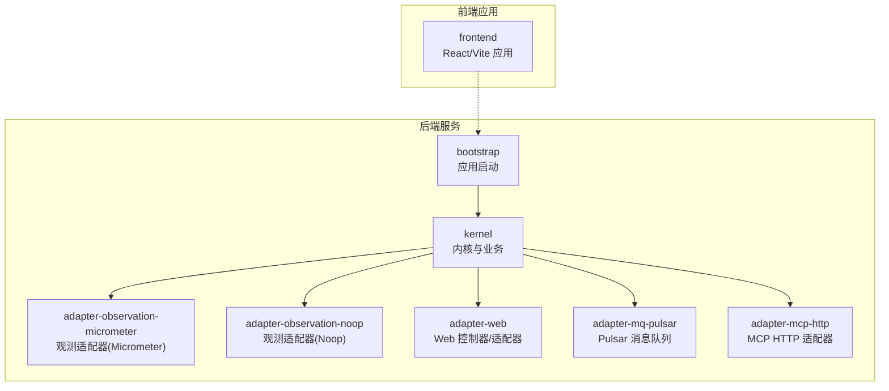
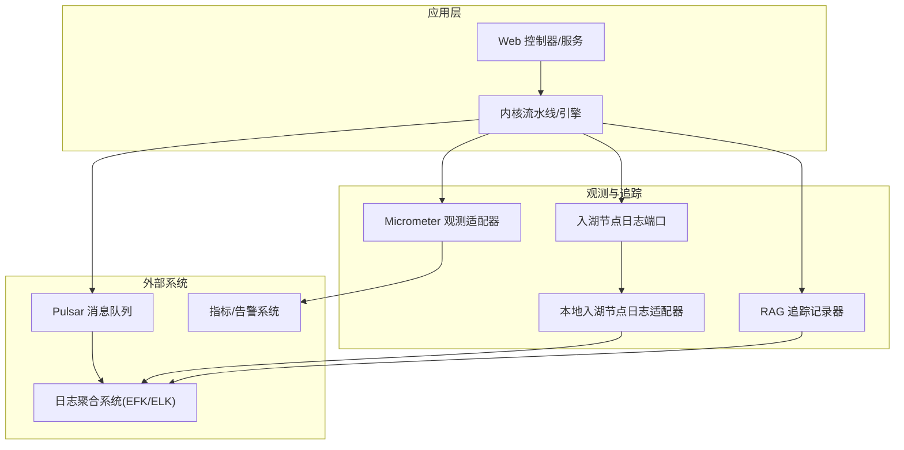
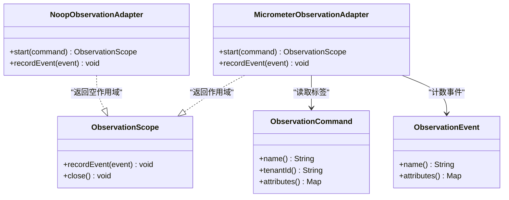
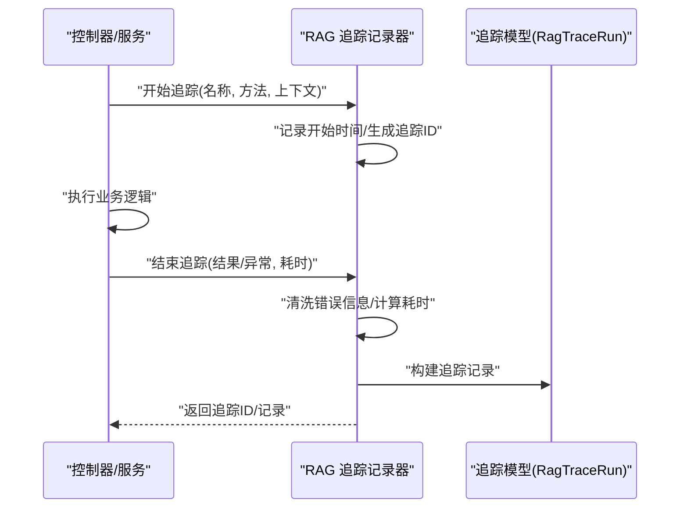
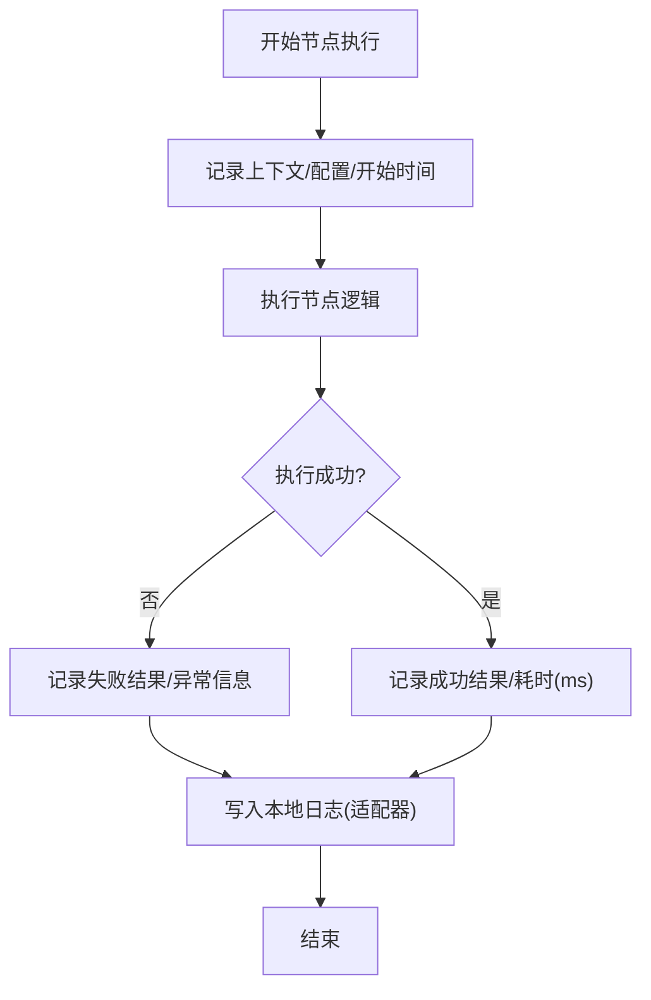
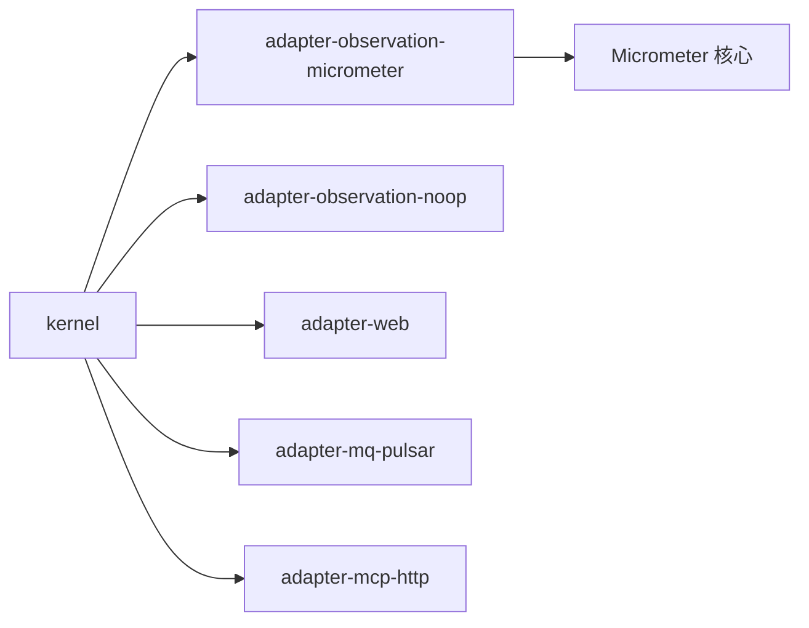

# 日志管理

<cite>
**本文引用的文件**
- [pom.xml](file://pom.xml)
- [application.properties](file://seahorse-agent-bootstrap/src/main/resources/application.properties)
- [application.yml](file://seahorse-agent-mcp-server/src/main/resources/application.yml)
- [Micrometer 观测适配器](file://seahorse-agent-adapter-observation-micrometer/src/main/java/com/miracle/ai/seahorse/agent/adapters/observation/micrometer/MicrometerObservationAdapter.java)
- [Micrometer 观测 SPI 定义](file://seahorse-agent-adapter-observation-micrometer/src/main/resources/META-INF/seahorse-agent/com.miracle.ai.seahorse.agent.ports.outbound.observation.ObservationPort)
- [空观测适配器](file://seahorse-agent-adapter-observation-noop/src/main/java/com/miracle/ai/seahorse/agent/adapters/observation/noop/NoopObservationAdapter.java)
- [内核 RAG 追踪记录器](file://seahorse-agent-kernel/src/main/java/com/miracle/ai/seahorse/agent/kernel/application/trace/KernelRagTraceRecorder.java)
- [内核 RAG 追踪模型](file://seahorse-agent-kernel/src/main/java/com/miracle/ai/seahorse/agent/ports/outbound/trace/RagTraceRun.java)
- [内核入湖节点日志端口](file://seahorse-agent-kernel/src/main/java/com/miracle/ai/seahorse/agent/ports/outbound/ingestion/IngestionNodeLogPort.java)
- [本地入湖节点日志适配器](file://seahorse-agent-adapter-web/src/main/java/com/miracle/ai/seahorse/agent/adapters/local/LocalIngestionNodeLogAdapter.java)
- [Pulsar 消息队列属性](file://seahorse-agent-adapter-mq-pulsar/src/main/java/com/miracle/ai/seahorse/agent/adapters/mq/pulsar/PulsarMessageQueueProperties.java)
- [MCP HTTP 适配器属性](file://seahorse-agent-adapter-mcp-http/src/main/java/com/miracle/ai/seahorse/agent/adapters/mcp/http/McpHttpAdapterProperties.java)
</cite>

## 目录
1. [简介](#简介)
2. [项目结构](#项目结构)
3. [核心组件](#核心组件)
4. [架构总览](#架构总览)
5. [详细组件分析](#详细组件分析)
6. [依赖关系分析](#依赖关系分析)
7. [性能考量](#性能考量)
8. [故障排查指南](#故障排查指南)
9. [结论](#结论)
10. [附录](#附录)

## 简介
本文件为“日志管理”综合文档，面向该多模块 Spring Boot 工程提供从配置到采集、从聚合到分析、从轮转归档到安全合规、再到监控告警的全链路实践指南。当前仓库以 Micrometer 观测与自定义追踪为主，未直接包含 logback 或 log4j2 的显式配置文件；因此本文在“日志配置”部分给出通用最佳实践与对接建议，在“日志聚合与分析”部分提供与 ELK/EFK、Fluentd/Filebeat 的对接思路与注意事项。

## 项目结构
该项目采用 Maven 多模块结构，核心模块包括：
- bootstrap：应用启动与基础配置
- kernel：领域内核与业务能力
- adapter-*：适配器与外部集成（消息队列、存储、观测、MCP 等）
- starter：自动装配与可选组件打包
- frontend：前端工程（与后端日志管理相对独立）

图表来源
- [pom.xml](file://pom.xml)
- [application.properties](file://seahorse-agent-bootstrap/src/main/resources/application.properties)
- [application.yml](file://seahorse-agent-mcp-server/src/main/resources/application.yml)

章节来源
- [pom.xml](file://pom.xml)
- [application.properties](file://seahorse-agent-bootstrap/src/main/resources/application.properties)
- [application.yml](file://seahorse-agent-mcp-server/src/main/resources/application.yml)

## 核心组件
- 观测与指标：通过 Micrometer 观测适配器输出计数器、定时器等指标，便于统一采集与告警。
- 分布式追踪：内核提供 RAG 追踪记录器与追踪模型，支持时长、错误清洗、追踪 ID 生成等。
- 入湖节点日志：内核定义入湖节点日志端口，适配器实现本地记录，便于审计与问题定位。
- 消息队列与超时：Pulsar 属性包含压缩类型、发送超时等参数，影响日志传输可靠性与性能。
- MCP 适配器：MCP HTTP 适配器提供调用超时与服务器列表配置，便于外部工具链日志对齐。

章节来源
- [Micrometer 观测适配器](file://seahorse-agent-adapter-observation-micrometer/src/main/java/com/miracle/ai/seahorse/agent/adapters/observation/micrometer/MicrometerObservationAdapter.java)
- [内核 RAG 追踪记录器](file://seahorse-agent-kernel/src/main/java/com/miracle/ai/seahorse/agent/kernel/application/trace/KernelRagTraceRecorder.java)
- [内核入湖节点日志端口](file://seahorse-agent-kernel/src/main/java/com/miracle/ai/seahorse/agent/ports/outbound/ingestion/IngestionNodeLogPort.java)
- [本地入湖节点日志适配器](file://seahorse-agent-adapter-web/src/main/java/com/miracle/ai/seahorse/agent/adapters/local/LocalIngestionNodeLogAdapter.java)
- [Pulsar 消息队列属性](file://seahorse-agent-adapter-mq-pulsar/src/main/java/com/miracle/ai/seahorse/agent/adapters/mq/pulsar/PulsarMessageQueueProperties.java)
- [MCP HTTP 适配器属性](file://seahorse-agent-adapter-mcp-http/src/main/java/com/miracle/ai/seahorse/agent/adapters/mcp/http/McpHttpAdapterProperties.java)

## 架构总览
下图展示日志与观测在系统中的位置与交互：

图表来源
- [Micrometer 观测适配器](file://seahorse-agent-adapter-observation-micrometer/src/main/java/com/miracle/ai/seahorse/agent/adapters/observation/micrometer/MicrometerObservationAdapter.java)
- [内核 RAG 追踪记录器](file://seahorse-agent-kernel/src/main/java/com/miracle/ai/seahorse/agent/kernel/application/trace/KernelRagTraceRecorder.java)
- [内核入湖节点日志端口](file://seahorse-agent-kernel/src/main/java/com/miracle/ai/seahorse/agent/ports/outbound/ingestion/IngestionNodeLogPort.java)
- [本地入湖节点日志适配器](file://seahorse-agent-adapter-web/src/main/java/com/miracle/ai/seahorse/agent/adapters/local/LocalIngestionNodeLogAdapter.java)
- [Pulsar 消息队列属性](file://seahorse-agent-adapter-mq-pulsar/src/main/java/com/miracle/ai/seahorse/agent/adapters/mq/pulsar/PulsarMessageQueueProperties.java)

## 详细组件分析

### 观测与指标（Micrometer）
- 功能要点
  - 将命令与事件转化为指标标签，支持按租户、属性等维度打点。
  - 使用计数器记录事件，使用定时器采样耗时，便于统一采集与告警。
- 配置与扩展
  - 可通过引入 Micrometer 监控后端（如 Prometheus、InfluxDB）进行集中采集。
  - 适配器以 SPI 方式注册，可通过启用/禁用切换实现无侵入或降级。

图表来源
- [Micrometer 观测适配器](file://seahorse-agent-adapter-observation-micrometer/src/main/java/com/miracle/ai/seahorse/agent/adapters/observation/micrometer/MicrometerObservationAdapter.java)
- [空观测适配器](file://seahorse-agent-adapter-observation-noop/src/main/java/com/miracle/ai/seahorse/agent/adapters/observation/noop/NoopObservationAdapter.java)

章节来源
- [Micrometer 观测适配器](file://seahorse-agent-adapter-observation-micrometer/src/main/java/com/miracle/ai/seahorse/agent/adapters/observation/micrometer/MicrometerObservationAdapter.java)
- [Micrometer 观测 SPI 定义](file://seahorse-agent-adapter-observation-micrometer/src/main/resources/META-INF/seahorse-agent/com.miracle.ai.seahorse.agent.ports.outbound.observation.ObservationPort)
- [空观测适配器](file://seahorse-agent-adapter-observation-noop/src/main/java/com/miracle/ai/seahorse/agent/adapters/observation/noop/NoopObservationAdapter.java)

### 分布式日志追踪（RAG 追踪）
- 功能要点
  - 记录开始/结束时间、耗时、错误信息（含清洗）、追踪 ID 等。
  - 支持对话 ID、任务 ID、用户 ID 等上下文字段，便于跨模块关联。
- 实现路径
  - 内核提供记录器与模型类，控制器或服务在关键路径调用。

图表来源
- [内核 RAG 追踪记录器](file://seahorse-agent-kernel/src/main/java/com/miracle/ai/seahorse/agent/kernel/application/trace/KernelRagTraceRecorder.java)
- [内核 RAG 追踪模型](file://seahorse-agent-kernel/src/main/java/com/miracle/ai/seahorse/agent/ports/outbound/trace/RagTraceRun.java)

章节来源
- [内核 RAG 追踪记录器](file://seahorse-agent-kernel/src/main/java/com/miracle/ai/seahorse/agent/kernel/application/trace/KernelRagTraceRecorder.java)
- [内核 RAG 追踪模型](file://seahorse-agent-kernel/src/main/java/com/miracle/ai/seahorse/agent/ports/outbound/trace/RagTraceRun.java)

### 入湖节点日志（审计与定位）
- 功能要点
  - 定义入湖节点日志端口，记录上下文、配置、结果与耗时。
  - 提供空实现与本地实现，便于在不同环境选择。
- 实施建议
  - 在 Web 适配器中接入本地实现，确保关键节点可审计。

图表来源
- [内核入湖节点日志端口](file://seahorse-agent-kernel/src/main/java/com/miracle/ai/seahorse/agent/ports/outbound/ingestion/IngestionNodeLogPort.java)
- [本地入湖节点日志适配器](file://seahorse-agent-adapter-web/src/main/java/com/miracle/ai/seahorse/agent/adapters/local/LocalIngestionNodeLogAdapter.java)

章节来源
- [内核入湖节点日志端口](file://seahorse-agent-kernel/src/main/java/com/miracle/ai/seahorse/agent/ports/outbound/ingestion/IngestionNodeLogPort.java)
- [本地入湖节点日志适配器](file://seahorse-agent-adapter-web/src/main/java/com/miracle/ai/seahorse/agent/adapters/local/LocalIngestionNodeLogAdapter.java)

### 消息队列与日志传输（Pulsar）
- 关键参数
  - 发送超时、阻塞策略、批处理、批延迟、压缩类型等。
- 对日志的影响
  - 影响日志投递的可靠性与时延，需结合观测指标与告警策略进行调优。

章节来源
- [Pulsar 消息队列属性](file://seahorse-agent-adapter-mq-pulsar/src/main/java/com/miracle/ai/seahorse/agent/adapters/mq/pulsar/PulsarMessageQueueProperties.java)

### 外部工具链日志（MCP HTTP）
- 关键参数
  - 启用开关、调用超时、服务器列表。
- 对日志的影响
  - 影响外部工具链的可用性与响应时间，应纳入观测与告警范围。

章节来源
- [MCP HTTP 适配器属性](file://seahorse-agent-adapter-mcp-http/src/main/java/com/miracle/ai/seahorse/agent/adapters/mcp/http/McpHttpAdapterProperties.java)

## 依赖关系分析
- 模块耦合
  - kernel 依赖多个 adapter，形成清晰的端口-适配器模式。
  - 观测适配器通过 SPI 注册，支持启用/禁用与替换。
- 外部依赖
  - Micrometer 为核心观测框架，建议配合指标系统统一采集。
  - POM 中声明了 Spring Boot 与各生态组件版本，保证兼容性。

图表来源
- [pom.xml](file://pom.xml)
- [Micrometer 观测适配器](file://seahorse-agent-adapter-observation-micrometer/src/main/java/com/miracle/ai/seahorse/agent/adapters/observation/micrometer/MicrometerObservationAdapter.java)

章节来源
- [pom.xml](file://pom.xml)

## 性能考量
- 指标采样
  - 使用定时器采样关键路径耗时，避免高频日志带来的性能开销。
- 批处理与压缩
  - Pulsar 的批处理与压缩类型可降低网络与存储压力，但需权衡延迟。
- 超时与重试
  - MCP 与消息队列的超时配置直接影响吞吐与稳定性，应结合观测指标动态调整。

## 故障排查指南
- 观测指标缺失
  - 检查 Micrometer 适配器是否启用、SPI 是否正确注册、指标系统是否连通。
- 追踪信息不完整
  - 确认追踪记录器是否在关键路径被调用，上下文字段是否正确传入。
- 入湖节点日志未落盘
  - 检查日志端口实现是否为本地适配器，文件权限与磁盘空间是否充足。
- 消息队列积压
  - 结合发送超时、批处理参数与消费者速率，查看观测指标与告警。

章节来源
- [Micrometer 观测适配器](file://seahorse-agent-adapter-observation-micrometer/src/main/java/com/miracle/ai/seahorse/agent/adapters/observation/micrometer/MicrometerObservationAdapter.java)
- [内核 RAG 追踪记录器](file://seahorse-agent-kernel/src/main/java/com/miracle/ai/seahorse/agent/kernel/application/trace/KernelRagTraceRecorder.java)
- [内核入湖节点日志端口](file://seahorse-agent-kernel/src/main/java/com/miracle/ai/seahorse/agent/ports/outbound/ingestion/IngestionNodeLogPort.java)
- [本地入湖节点日志适配器](file://seahorse-agent-adapter-web/src/main/java/com/miracle/ai/seahorse/agent/adapters/local/LocalIngestionNodeLogAdapter.java)
- [Pulsar 消息队列属性](file://seahorse-agent-adapter-mq-pulsar/src/main/java/com/miracle/ai/seahorse/agent/adapters/mq/pulsar/PulsarMessageQueueProperties.java)

## 结论
本项目以 Micrometer 与内核追踪为核心，提供了可观测、可审计、可扩展的日志与追踪能力。对于日志配置、聚合与轮转归档，建议结合实际部署环境补充 logback/log4j2 配置与 ELK/EFK/Fluentd/Filebeat 集成；同时将观测指标与告警策略落地，实现异常检测、性能分析与关键业务告警。

## 附录

### 日志配置（logback/log4j2）与标准化建议
- 配置文件设置
  - 推荐在 bootstrap 模块中提供默认日志配置，覆盖根级别、输出格式、目标目录与文件名模板。
  - 使用占位符注入应用名、实例 ID、环境等上下文，便于多实例与多环境区分。
- 日志级别管理
  - 生产环境建议将业务包设为 INFO，调试阶段临时提升至 DEBUG。
  - 对第三方依赖包单独分级，避免噪声干扰。
- 日志格式标准化
  - 统一 JSON 格式输出，包含时间戳、级别、应用名、模块、线程、请求追踪 ID、消息体等字段。
  - 为追踪 ID 与会话 ID 提供上下文字段，便于跨服务串联。

### 多模块日志组织策略
- 后端服务日志
  - 由各模块控制器与服务在关键路径记录结构化日志，结合 Micrometer 输出指标。
- 前端应用日志
  - 前端工程独立部署，建议通过浏览器控制台与网络面板定位问题，必要时将关键错误上报至后端或专门的前端日志系统。
- 容器化应用日志
  - 容器标准输出采集，结合 Kubernetes/容器平台的日志轮转与保留策略。

### 日志聚合与分析（ELK/EFK、Fluentd/Filebeat）
- 集成思路
  - 在后端应用中输出 JSON 日志，由 Filebeat/Fluentd 收集并转发至 Logstash/Fluentd，再写入 Elasticsearch。
  - Kibana 用于可视化与查询，结合观测指标建立仪表板。
- 注意事项
  - 字段映射与索引模板需与日志格式一致。
  - 对敏感字段进行脱敏处理，避免泄露。

### 日志轮转与归档策略
- 按大小轮转
  - 设置单文件最大大小与备份数，防止磁盘占用过高。
- 按时间轮转
  - 按日/周/月滚动，结合压缩减少存储占用。
- 压缩与保留周期
  - 建议启用压缩（如 gzip），并设定保留天数或容量阈值，定期清理过期日志。

### 日志安全与合规
- 敏感信息脱敏
  - 对密码、令牌、身份证号、手机号等字段进行脱敏或过滤。
- 访问控制
  - 限制日志文件与日志系统的访问权限，仅授权人员可查看。
- 审计日志
  - 对关键操作（登录、权限变更、数据删除）记录审计日志，确保不可抵赖。

### 日志监控与告警
- 异常日志检测
  - 基于日志关键词与正则表达式识别异常，结合阈值触发告警。
- 性能日志分析
  - 结合 Micrometer 指标与日志中的耗时信息，定位慢调用与热点路径。
- 关键业务日志告警
  - 对订单、支付、风控等关键业务事件设置实时告警，联动值班流程。