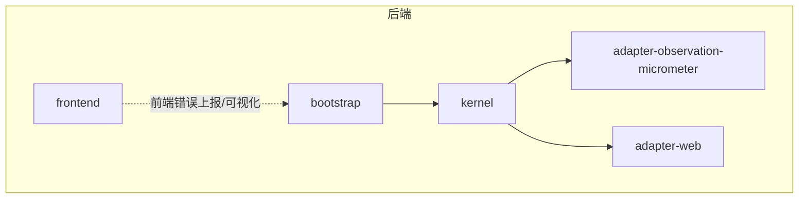
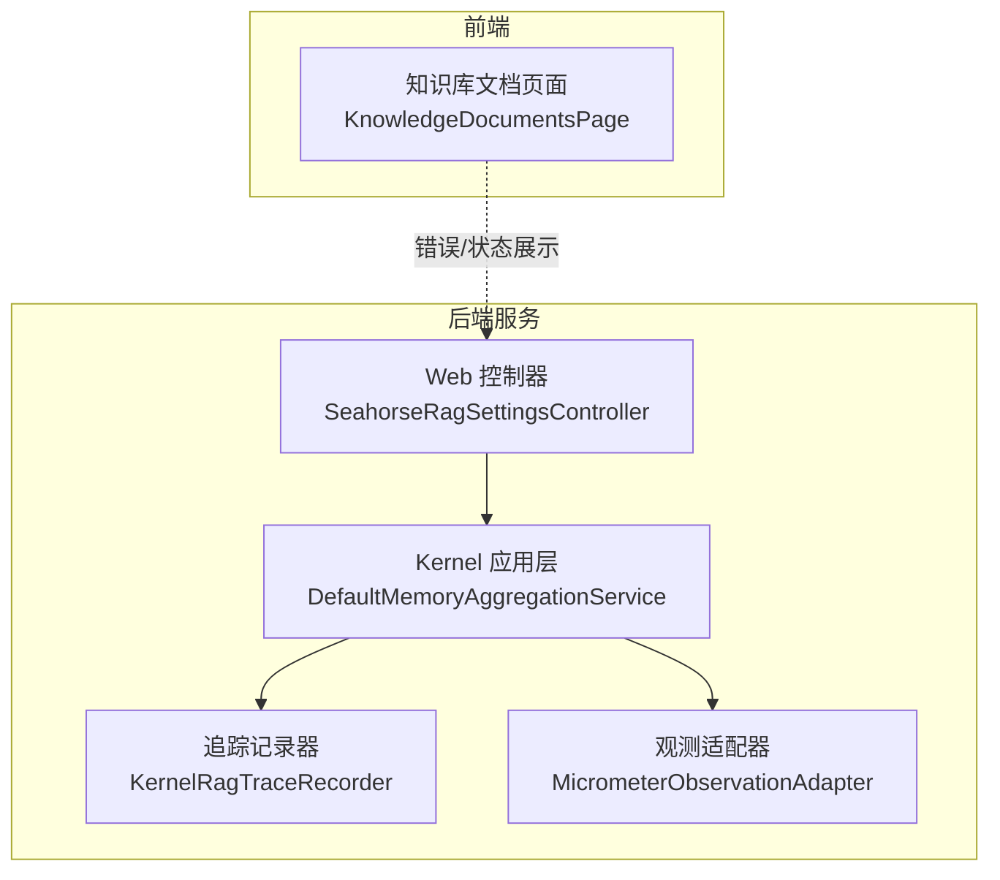
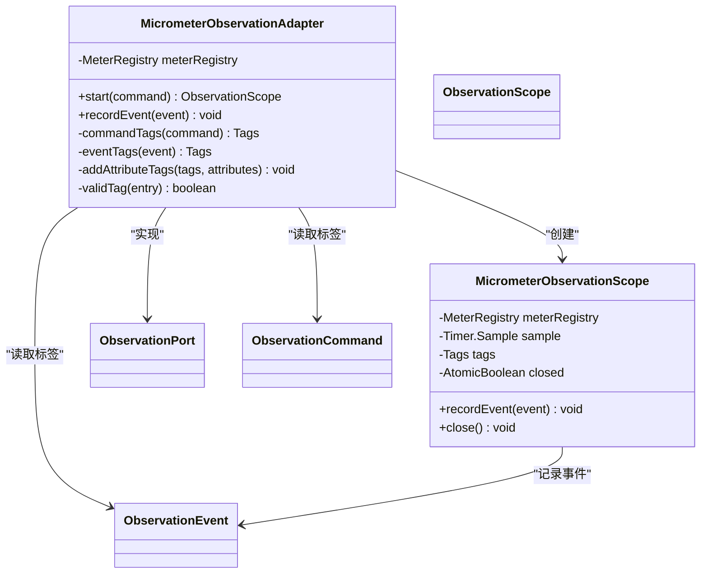
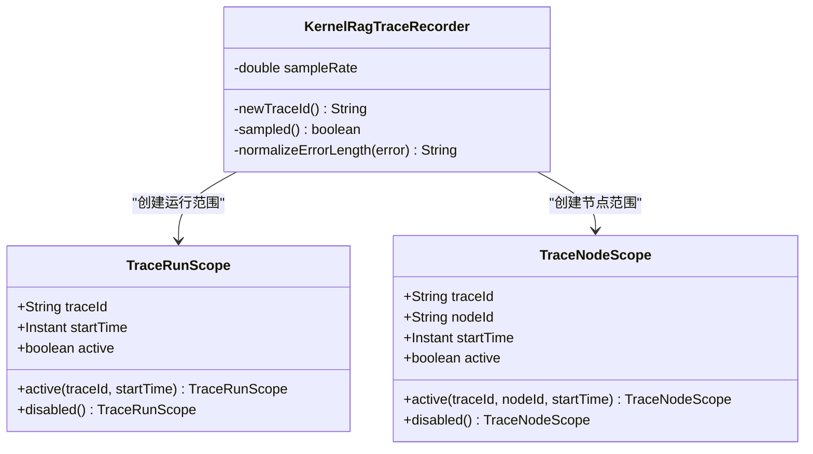
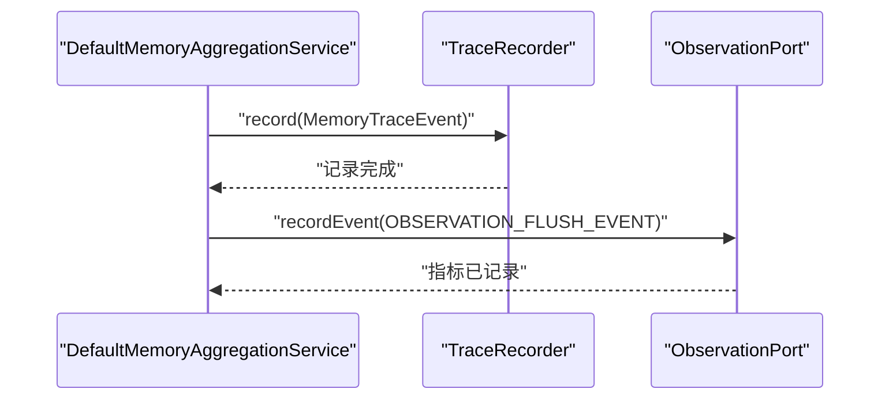
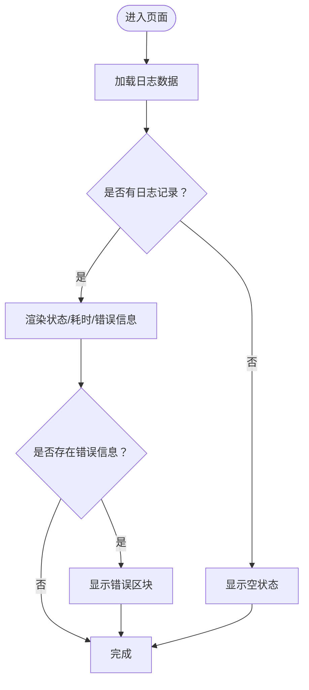
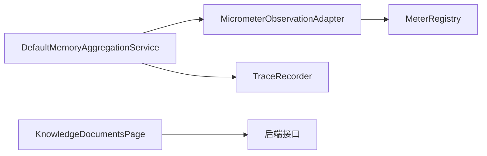

# 日志管理

<cite>
**本文引用的文件**
- [日志管理.md](file://docs/zh/content/监控运维/日志管理.md)
- [应用监控.md](file://docs/zh/content/监控运维/应用监控.md)
- [Micrometer 观测适配器实现](file://seahorse-agent-adapter-observation-micrometer/src/main/java/com/miracle/ai/seahorse/agent/adapters/observation/micrometer/MicrometerObservationAdapter.java)
- [Micrometer 观测适配器测试](file://seahorse-agent-adapter-observation-micrometer/src/test/java/com/miracle/ai/seahorse/agent/adapters/observation/micrometer/MicrometerObservationAdapterTests.java)
- [内存聚合服务](file://seahorse-agent-kernel/src/main/java/com/miracle/ai/seahorse/agent/kernel/application/memory/aggregation/DefaultMemoryAggregationService.java)
- [追踪运行范围](file://seahorse-agent-kernel/src/main/java/com/miracle/ai/seahorse/agent/kernel/domain/trace/TraceRunScope.java)
- [追踪节点范围](file://seahorse-agent-kernel/src/main/java/com/miracle/ai/seahorse/agent/kernel/domain/trace/TraceNodeScope.java)
- [内核 RAG 追踪记录器](file://seahorse-agent-kernel/src/main/java/com/miracle/ai/seahorse/agent/kernel/application/trace/KernelRagTraceRecorder.java)
- [Web 控制器设置](file://seahorse-agent-adapter-web/src/main/java/com/miracle/ai/seahorse/agent/adapters/web/SeahorseRagSettingsController.java)
- [内存策略配置](file://seahorse-agent-spring-boot-starter/src/main/java/com/miracle/ai/seahorse/agent/adapters/spring/properties/MemoryProperties.java)
- [前端知识库文档页面](file://frontend/src/pages/admin/knowledge/KnowledgeDocumentsPage.tsx)
</cite>

## 目录
1. [简介](#简介)
2. [项目结构](#项目结构)
3. [核心组件](#核心组件)
4. [架构总览](#架构总览)
5. [详细组件分析](#详细组件分析)
6. [依赖关系分析](#依赖关系分析)
7. [性能考量](#性能考量)
8. [故障排查指南](#故障排查指南)
9. [结论](#结论)
10. [附录](#附录)

## 简介
本文件为“日志管理”综合文档，面向该多模块 Spring Boot 工程提供从配置到采集、从聚合到分析、从轮转归档到安全合规、再到监控告警的全链路实践指南。当前仓库以 Micrometer 观测与自定义追踪为主，未直接包含 logback 或 log4j2 的显式配置文件；因此本文在“日志配置”部分给出通用最佳实践与对接建议，在“日志聚合与分析”部分提供与 ELK/EFK、Fluentd/Filebeat 的对接思路与注意事项。

## 项目结构
该项目采用 Maven 多模块结构，核心模块包括：
- bootstrap：应用启动与基础配置
- kernel：领域内核与业务能力
- adapter-*：适配器与外部集成（消息队列、存储、观测、MCP 等）
- starter：自动装配与可选组件打包
- frontend：前端工程（与后端日志管理相对独立）

## 核心组件
- 观测与指标：通过 Micrometer 适配器将业务执行过程转化为可聚合、可对比的指标数据，支持持续时间与事件计数两类指标。
- 自定义追踪：内核提供运行与节点级追踪范围，支持采样与错误长度截断，便于端到端链路分析。
- 内存聚合追踪：在内存聚合关键路径记录追踪事件与指标，便于定位慢调用与热点路径。
- 前端日志展示：前端页面对知识库处理日志进行状态、耗时、错误信息的可视化展示。

章节来源
- [应用监控.md:134-368](file://docs/zh/content/监控运维/应用监控.md#L134-L368)
- [Micrometer 观测适配器实现:1-89](file://seahorse-agent-adapter-observation-micrometer/src/main/java/com/miracle/ai/seahorse/agent/adapters/observation/micrometer/MicrometerObservationAdapter.java#L1-L89)
- [内核 RAG 追踪记录器:216-235](file://seahorse-agent-kernel/src/main/java/com/miracle/ai/seahorse/agent/kernel/application/trace/KernelRagTraceRecorder.java#L216-L235)
- [内存聚合服务:359-449](file://seahorse-agent-kernel/src/main/java/com/miracle/ai/seahorse/agent/kernel/application/memory/aggregation/DefaultMemoryAggregationService.java#L359-L449)
- [前端知识库文档页面:1001-1089](file://frontend/src/pages/admin/knowledge/KnowledgeDocumentsPage.tsx#L1001-L1089)

## 架构总览
下图展示了日志与观测在系统中的位置与交互关系。后端通过 Micrometer 输出指标，结合自定义追踪记录关键路径事件；前端负责错误信息与处理日志的可视化展示。

图表来源
- [Web 控制器设置:337-373](file://seahorse-agent-adapter-web/src/main/java/com/miracle/ai/seahorse/agent/adapters/web/SeahorseRagSettingsController.java#L337-L373)
- [内存聚合服务:359-449](file://seahorse-agent-kernel/src/main/java/com/miracle/ai/seahorse/agent/kernel/application/memory/aggregation/DefaultMemoryAggregationService.java#L359-L449)
- [内核 RAG 追踪记录器:216-235](file://seahorse-agent-kernel/src/main/java/com/miracle/ai/seahorse/agent/kernel/application/trace/KernelRagTraceRecorder.java#L216-L235)
- [Micrometer 观测适配器实现:1-89](file://seahorse-agent-adapter-observation-micrometer/src/main/java/com/miracle/ai/seahorse/agent/adapters/observation/micrometer/MicrometerObservationAdapter.java#L1-L89)
- [前端知识库文档页面:1001-1089](file://frontend/src/pages/admin/knowledge/KnowledgeDocumentsPage.tsx#L1001-L1089)

## 详细组件分析

### 观测与指标（Micrometer）
- 指标类型与命名
  - 持续时间指标：用于记录观测生命周期内的耗时，名称为固定常量。
  - 事件计数指标：用于记录独立事件的发生次数，名称为固定常量。
- 标签体系
  - 观测维度：observation（来自命令名称）、tenant（来自命令租户标识）。
  - 事件维度：event（来自事件名称）。
  - 属性维度：从命令与事件的 attributes 映射中提取有效键值对作为标签。
- 生命周期管理
  - start：启动计时采样，合并标签后返回作用域实例。
  - recordEvent：在作用域内或独立记录事件计数器。
  - close：在作用域关闭时，基于标签构建定时器并停止采样，完成耗时统计。

图表来源
- [Micrometer 观测适配器实现:1-89](file://seahorse-agent-adapter-observation-micrometer/src/main/java/com/miracle/ai/seahorse/agent/adapters/observation/micrometer/MicrometerObservationAdapter.java#L1-L89)

章节来源
- [应用监控.md:134-368](file://docs/zh/content/监控运维/应用监控.md#L134-L368)
- [Micrometer 观测适配器实现:1-89](file://seahorse-agent-adapter-observation-micrometer/src/main/java/com/miracle/ai/seahorse/agent/adapters/observation/micrometer/MicrometerObservationAdapter.java#L1-L89)
- [Micrometer 观测适配器测试:1-113](file://seahorse-agent-adapter-observation-micrometer/src/test/java/com/miracle/ai/seahorse/agent/adapters/observation/micrometer/MicrometerObservationAdapterTests.java#L1-L113)

### 自定义追踪（Trace）
- 运行范围与节点范围
  - 运行范围：包含 traceId、起始时间与激活状态，支持禁用态。
  - 节点范围：包含 traceId、nodeId、起始时间与激活状态，支持禁用态。
- 追踪记录器
  - 生成新的 traceId，支持采样率控制。
  - 对错误信息进行长度截断，避免超长日志影响性能。

图表来源
- [追踪运行范围:1-36](file://seahorse-agent-kernel/src/main/java/com/miracle/ai/seahorse/agent/kernel/domain/trace/TraceRunScope.java#L1-L36)
- [追踪节点范围:1-37](file://seahorse-agent-kernel/src/main/java/com/miracle/ai/seahorse/agent/kernel/domain/trace/TraceNodeScope.java#L1-L37)
- [内核 RAG 追踪记录器:216-235](file://seahorse-agent-kernel/src/main/java/com/miracle/ai/seahorse/agent/kernel/application/trace/KernelRagTraceRecorder.java#L216-L235)

章节来源
- [追踪运行范围:1-36](file://seahorse-agent-kernel/src/main/java/com/miracle/ai/seahorse/agent/kernel/domain/trace/TraceRunScope.java#L1-L36)
- [追踪节点范围:1-37](file://seahorse-agent-kernel/src/main/java/com/miracle/ai/seahorse/agent/kernel/domain/trace/TraceNodeScope.java#L1-L37)
- [内核 RAG 追踪记录器:216-235](file://seahorse-agent-kernel/src/main/java/com/miracle/ai/seahorse/agent/kernel/application/trace/KernelRagTraceRecorder.java#L216-L235)

### 内存聚合追踪与指标
- 关键路径追踪
  - 在内存聚合缓冲区刷新事件中记录追踪事件与相关指标，便于定位慢调用与热点路径。
- 上下文与详情
  - 追踪上下文包含租户、用户、会话、对话等标识，详情包含触发原因、结果状态与原因等。

图表来源
- [内存聚合服务:359-449](file://seahorse-agent-kernel/src/main/java/com/miracle/ai/seahorse/agent/kernel/application/memory/aggregation/DefaultMemoryAggregationService.java#L359-L449)

章节来源
- [内存聚合服务:359-449](file://seahorse-agent-kernel/src/main/java/com/miracle/ai/seahorse/agent/kernel/application/memory/aggregation/DefaultMemoryAggregationService.java#L359-L449)

### 前端日志展示与错误可视化
- 页面展示
  - 对知识库文档处理日志进行状态、执行时间、耗时与错误信息的可视化展示。
- 错误信息
  - 当存在错误信息时，以红色背景突出显示，便于快速定位问题。

图表来源
- [前端知识库文档页面:1001-1089](file://frontend/src/pages/admin/knowledge/KnowledgeDocumentsPage.tsx#L1001-L1089)

章节来源
- [前端知识库文档页面:1001-1089](file://frontend/src/pages/admin/knowledge/KnowledgeDocumentsPage.tsx#L1001-L1089)

## 依赖关系分析
- 观测适配器依赖 Micrometer 的 MeterRegistry，通过统一接口向上层暴露 start/record/close 能力。
- 内核应用层在关键路径调用观测端口与追踪记录器，形成可观测闭环。
- 前端页面通过后端接口获取日志与状态，进行可视化展示。

图表来源
- [Micrometer 观测适配器实现:1-89](file://seahorse-agent-adapter-observation-micrometer/src/main/java/com/miracle/ai/seahorse/agent/adapters/observation/micrometer/MicrometerObservationAdapter.java#L1-L89)
- [内存聚合服务:359-449](file://seahorse-agent-kernel/src/main/java/com/miracle/ai/seahorse/agent/kernel/application/memory/aggregation/DefaultMemoryAggregationService.java#L359-L449)
- [前端知识库文档页面:1001-1089](file://frontend/src/pages/admin/knowledge/KnowledgeDocumentsPage.tsx#L1001-L1089)

章节来源
- [Micrometer 观测适配器实现:1-89](file://seahorse-agent-adapter-observation-micrometer/src/main/java/com/miracle/ai/seahorse/agent/adapters/observation/micrometer/MicrometerObservationAdapter.java#L1-L89)
- [内存聚合服务:359-449](file://seahorse-agent-kernel/src/main/java/com/miracle/ai/seahorse/agent/kernel/application/memory/aggregation/DefaultMemoryAggregationService.java#L359-L449)
- [前端知识库文档页面:1001-1089](file://frontend/src/pages/admin/knowledge/KnowledgeDocumentsPage.tsx#L1001-L1089)

## 性能考量
- 指标基数控制：通过标签体系与属性维度过滤，避免高基数动态键导致指标基数膨胀。
- 采样策略：追踪记录器支持采样率控制，降低高频场景下的追踪开销。
- 错误长度截断：对错误信息进行长度截断，避免超长文本影响日志性能与存储成本。

章节来源
- [应用监控.md:346-358](file://docs/zh/content/监控运维/应用监控.md#L346-L358)
- [内核 RAG 追踪记录器:216-235](file://seahorse-agent-kernel/src/main/java/com/miracle/ai/seahorse/agent/kernel/application/trace/KernelRagTraceRecorder.java#L216-L235)

## 故障排查指南
- 异常日志检测
  - 基于日志关键词与正则表达式识别异常，结合阈值触发告警。
- 性能日志分析
  - 结合 Micrometer 指标与日志中的耗时信息，定位慢调用与热点路径。
- 关键业务日志告警
  - 对订单、支付、风控等关键业务事件设置实时告警，联动值班流程。
- 前端错误定位
  - 通过前端页面的错误信息区块快速定位问题；若问题复杂，结合后端追踪与指标进行深入分析。

章节来源
- [日志管理.md:349-355](file://docs/zh/content/监控运维/日志管理.md#L349-L355)
- [前端知识库文档页面:1001-1089](file://frontend/src/pages/admin/knowledge/KnowledgeDocumentsPage.tsx#L1001-L1089)

## 结论
本项目通过 Micrometer 观测与自定义追踪实现了可观测性闭环，结合前端日志展示与告警策略，能够有效支撑生产环境的问题定位与性能优化。建议在核心业务模块统一接入观测端口，并遵循命名与标签规范，持续优化指标基数与上报策略。

## 附录

### 日志配置（logback/log4j2）与标准化建议
- 配置文件设置
  - 推荐在 bootstrap 模块中提供默认日志配置，覆盖根级别、输出格式、目标目录与文件名模板。
  - 使用占位符注入应用名、实例 ID、环境等上下文，便于多实例与多环境区分。
- 日志级别管理
  - 生产环境建议将业务包设为 INFO，调试阶段临时提升至 DEBUG。
  - 对第三方依赖包单独分级，避免噪声干扰。
- 日志格式标准化
  - 统一 JSON 格式输出，包含时间戳、级别、应用名、模块、线程、请求追踪 ID、消息体等字段。
  - 为追踪 ID 与会话 ID 提供上下文字段，便于跨服务串联。

章节来源
- [日志管理.md:306-315](file://docs/zh/content/监控运维/日志管理.md#L306-L315)

### 多模块日志组织策略
- 后端服务日志
  - 由各模块控制器与服务在关键路径记录结构化日志，结合 Micrometer 输出指标。
- 前端应用日志
  - 前端工程独立部署，建议通过浏览器控制台与网络面板定位问题，必要时将关键错误上报至后端或专门的前端日志系统。
- 容器化应用日志
  - 容器标准输出采集，结合 Kubernetes/容器平台的日志轮转与保留策略。

章节来源
- [日志管理.md:317-323](file://docs/zh/content/监控运维/日志管理.md#L317-L323)

### 日志聚合与分析（ELK/EFK、Fluentd/Filebeat）
- 集成思路
  - 在后端应用中输出 JSON 日志，由 Filebeat/Fluentd 收集并转发至 Logstash/Fluentd，再写入 Elasticsearch。
  - Kibana 用于可视化与查询，结合观测指标建立仪表板。
- 注意事项
  - 字段映射与索引模板需与日志格式一致。
  - 对敏感字段进行脱敏处理，避免泄露。

章节来源
- [日志管理.md:325-331](file://docs/zh/content/监控运维/日志管理.md#L325-L331)

### 日志轮转与归档策略
- 按大小轮转
  - 设置单文件最大大小与备份数，防止磁盘占用过高。
- 按时间轮转
  - 按日/周/月滚动，结合压缩减少存储占用。
- 压缩与保留周期
  - 建议启用压缩（如 gzip），并设定保留天数或容量阈值，定期清理过期日志。

章节来源
- [日志管理.md:333-339](file://docs/zh/content/监控运维/日志管理.md#L333-L339)

### 日志安全与合规
- 敏感信息脱敏
  - 对密码、令牌、身份证号、手机号等字段进行脱敏或过滤。
- 访问控制
  - 限制日志文件与日志系统的访问权限，仅授权人员可查看。
- 审计日志
  - 对关键操作（登录、权限变更、数据删除）记录审计日志，确保不可抵赖。

章节来源
- [日志管理.md:341-347](file://docs/zh/content/监控运维/日志管理.md#L341-L347)

### 日志监控与告警
- 异常日志检测
  - 基于日志关键词与正则表达式识别异常，结合阈值触发告警。
- 性能日志分析
  - 结合 Micrometer 指标与日志中的耗时信息，定位慢调用与热点路径。
- 关键业务日志告警
  - 对订单、支付、风控等关键业务事件设置实时告警，联动值班流程。

章节来源
- [日志管理.md:349-355](file://docs/zh/content/监控运维/日志管理.md#L349-L355)