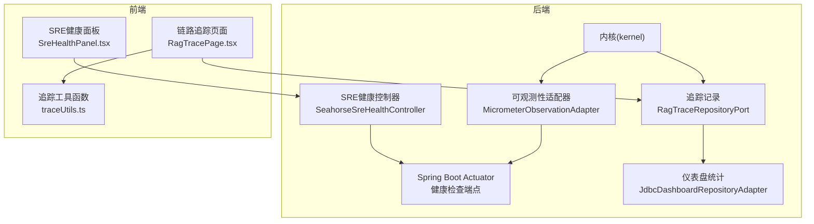
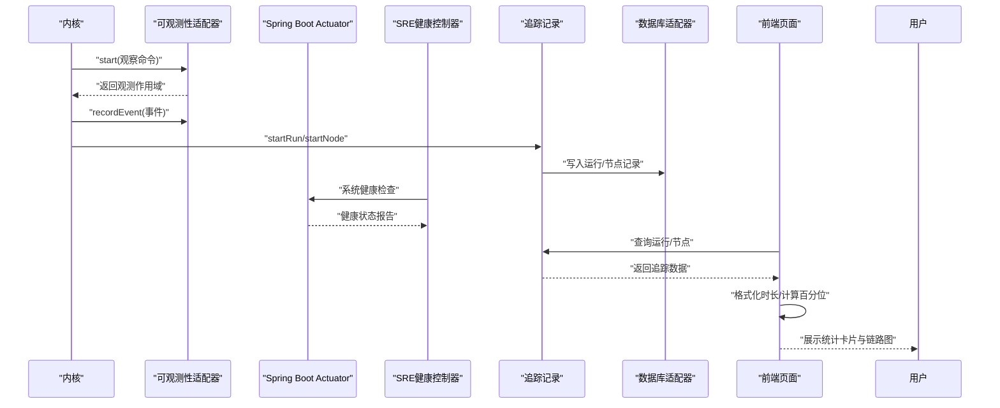
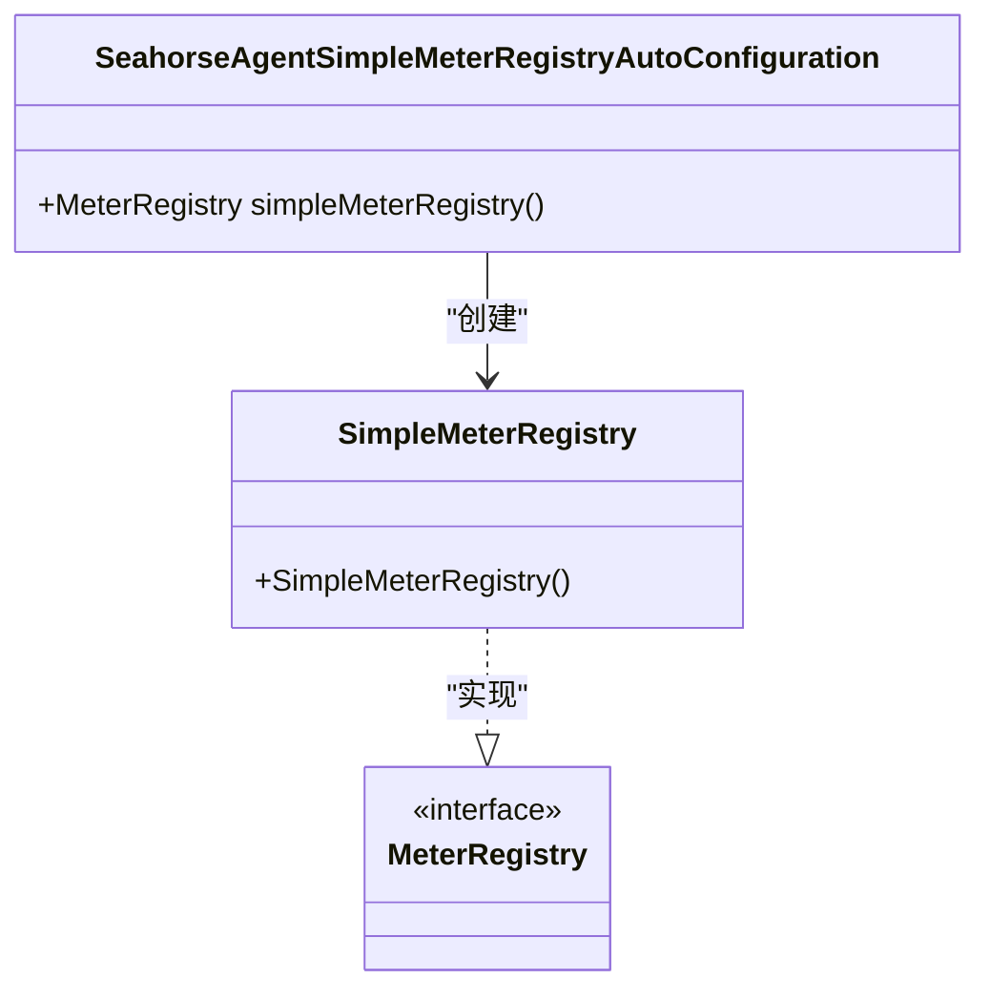
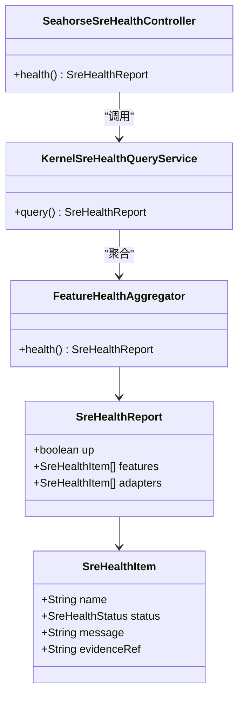
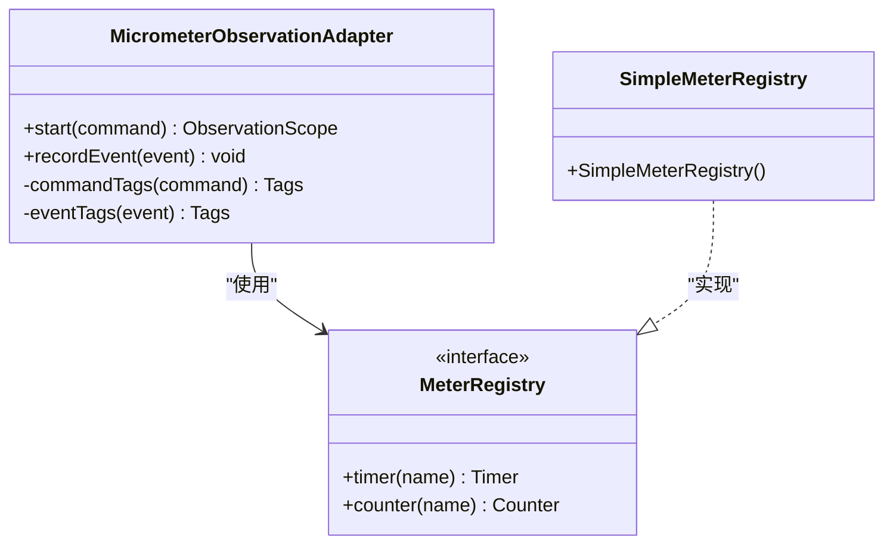
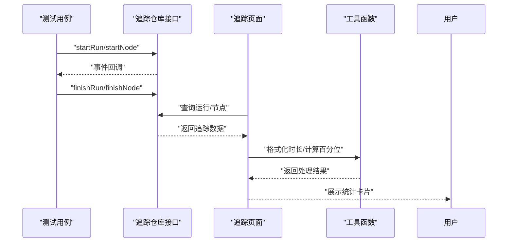
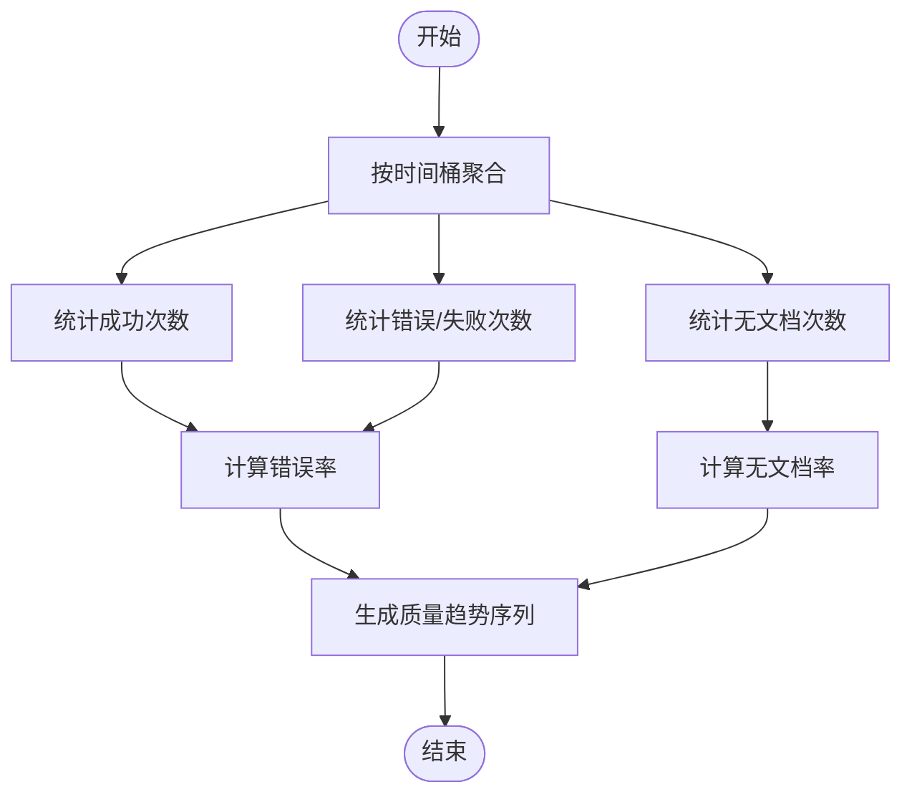
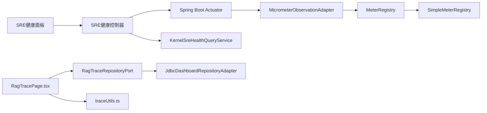

# 监控运维

<cite>
**本文引用的文件**
- [MicrometerObservationAdapter.java](file://seahorse-agent-adapter-observation-micrometer/src/main/java/com/miracle/ai/seahorse/agent/adapters/observation/micrometer/MicrometerObservationAdapter.java)
- [SeahorseAgentObservationAdapterAutoConfiguration.java](file://seahorse-agent-spring-boot-starter/src/main/java/com/miracle/ai/seahorse/agent/adapters/spring/SeahorseAgentObservationAdapterAutoConfiguration.java)
- [SeahorseAgentSimpleMeterRegistryAutoConfiguration.java](file://seahorse-agent-spring-boot-starter/src/main/java/com/miracle/ai/seahorse/agent/adapters/spring/SeahorseAgentSimpleMeterRegistryAutoConfiguration.java)
- [com.miracle.ai.seahorse.agent.ports.outbound.observation.ObservationPort](file://seahorse-agent-adapter-observation-micrometer/src/main/resources/META-INF/seahorse-agent/com.miracle.ai.seahorse.agent.ports.outbound.observation.ObservationPort)
- [KernelChatInboundTraceTests.java](file://seahorse-agent-kernel/src/test/java/com/miracle/ai/seahorse/agent/kernel/application/chat/KernelChatInboundTraceTests.java)
- [KernelMultiChannelRetrievalEngineTraceTests.java](file://seahorse-agent-tests/src/test/java/com/miracle/ai/seahorse/agent/kernel/application/retrieval/KernelMultiChannelRetrievalEngineTraceTests.java)
- [traceUtils.ts](file://frontend/src/pages/admin/traces/traceUtils.ts)
- [RagTracePage.tsx](file://frontend/src/pages/admin/traces/RagTracePage.tsx)
- [JdbcDashboardRepositoryAdapter.java](file://seahorse-agent-adapter-repository-jdbc/src/main/java/com/miracle/ai/seahorse/agent/adapters/repository/jdbc/JdbcDashboardRepositoryAdapter.java)
- [KernelRagTraceRecorderTests.java](file://seahorse-agent-tests/src/test/java/com/miracle/ai/seahorse/agent/kernel/application/trace/KernelRagTraceRecorderTests.java)
- [MemoryPolicyConfig.java](file://seahorse-agent-kernel/src/main/java/com/miracle/ai/seahorse/agent/ports/outbound/memory/MemoryPolicyConfig.java)
- [application.properties](file://seahorse-agent-bootstrap/src/main/resources/application.properties)
- [Backup and Recovery.md](file://docs/zh/content/监控运维/备份恢复.md)
- [SeahorseSreHealthController.java](file://seahorse-agent-adapter-web/src/main/java/com/miracle/ai/seahorse/agent/adapters/web/SeahorseSreHealthController.java)
- [KernelSreHealthQueryService.java](file://seahorse-agent-kernel/src/main/java/com/miracle/ai/seahorse/agent/kernel/application/agent/sre/KernelSreHealthQueryService.java)
- [FeatureHealthAggregator.java](file://seahorse-agent-kernel/src/main/java/com/miracle/ai/seahorse/agent/kernel/plugin/FeatureHealthAggregator.java)
- [SreHealthReport.java](file://seahorse-agent-kernel/src/main/java/com/miracle/ai/seahorse/agent/kernel/domain/agent/sre/SreHealthReport.java)
- [SreHealthPanel.tsx](file://frontend/src/pages/admin/dashboard/SreHealthPanel.tsx)
- [05-observability-v3-CHANGES.md](file://docs/aegis/plans/saas-mvp-impl/05-observability-v3-CHANGES.md)
- [05-observability.md](file://docs/aegis/plans/saas-mvp-impl/05-observability.md)
</cite>

## 更新摘要
**所做更改**
- 新增Spring Boot Actuator集成章节，详细说明健康检查端点配置
- 更新观测性基础设施章节，增加SimpleMeterRegistry自动配置
- 新增健康检查机制章节，涵盖SRE健康面板与中间件直连探活
- 更新依赖分析，反映新的自动配置类和健康检查控制器
- 新增性能考量，说明SimpleMeterRegistry的内存存储特性

## 目录
1. [简介](#简介)
2. [项目结构](#项目结构)
3. [核心组件](#核心组件)
4. [架构总览](#架构总览)
5. [详细组件分析](#详细组件分析)
6. [依赖分析](#依赖分析)
7. [性能考量](#性能考量)
8. [故障排查指南](#故障排查指南)
9. [结论](#结论)
10. [附录](#附录)

## 简介
本文件面向Seahorse Agent的监控运维实践，系统化梳理应用监控体系、健康检查、告警机制、故障诊断、日志管理策略、分布式追踪、运维自动化工具、容量规划与性能优化、故障排查以及运维最佳实践。内容基于代码库中已实现的可观测性适配器、Spring Boot Actuator集成、健康检查控制器、追踪记录与前端展示、仪表盘统计、备份恢复策略文档等能力进行总结，并提供可操作的运维指导。

## 项目结构
- 后端采用多模块分层架构，包含内核(kernel)、适配器(adapter)、启动器(starter)、前端(frontend)等模块。
- 监控与追踪相关的关键位置：
  - 可观测性适配器：基于Micrometer实现指标采集与事件记录。
  - Spring Boot Actuator：提供健康检查、指标暴露和管理端点。
  - 健康检查控制器：SRE健康面板与中间件直连探活。
  - 追踪记录：内核应用层提供RAG链路追踪能力，支持运行与节点级别的开始/结束事件。
  - 前端展示：提供链路追踪页面与统计卡片，支持时长格式化与百分位计算。
  - 仪表盘统计：基于数据库适配器提供成功率、错误率、平均耗时等质量指标。
  - 备份恢复：提供数据库模式、对象存储适配器、定时调度与可观测性能力，支撑备份恢复体系。

**图表来源**
- [MicrometerObservationAdapter.java:1-137](file://seahorse-agent-adapter-observation-micrometer/src/main/java/com/miracle/ai/seahorse/agent/adapters/observation/micrometer/MicrometerObservationAdapter.java#L1-L137)
- [SeahorseAgentSimpleMeterRegistryAutoConfiguration.java:1-28](file://seahorse-agent-spring-boot-starter/src/main/java/com/miracle/ai/seahorse/agent/adapters/spring/SeahorseAgentSimpleMeterRegistryAutoConfiguration.java#L1-L28)
- [SeahorseSreHealthController.java:1-200](file://seahorse-agent-adapter-web/src/main/java/com/miracle/ai/seahorse/agent/adapters/web/SeahorseSreHealthController.java#L1-L200)
- [RagTracePage.tsx:106-153](file://frontend/src/pages/admin/traces/RagTracePage.tsx#L106-L153)
- [traceUtils.ts:76-101](file://frontend/src/pages/admin/traces/traceUtils.ts#L76-L101)
- [SreHealthPanel.tsx:1-150](file://frontend/src/pages/admin/dashboard/SreHealthPanel.tsx#L1-L150)

**章节来源**
- [application.properties:1-4](file://seahorse-agent-bootstrap/src/main/resources/application.properties#L1-L4)

## 核心组件
- 可观测性适配器：基于Micrometer实现计时器采样、标签化事件记录、指标注册与上报，支持按观察名称、租户ID与自定义属性打点。
- Spring Boot Actuator：提供健康检查、指标暴露和管理端点，支持零外部依赖的SimpleMeterRegistry配置。
- SRE健康控制器：集成中间件直连探活，提供系统健康状态的统一视图。
- 追踪记录：内核应用层提供运行与节点级别的追踪事件接口，测试用例展示了事件的开始/结束回调。
- 前端追踪展示：提供链路追踪页面与统计卡片，支持平均耗时、P95耗时、成功率等指标展示，并提供时长格式化与百分位计算工具。
- 仪表盘统计：基于数据库适配器统计质量指标（如错误率、无文档率），并生成趋势序列。
- 备份恢复：提供数据库模式与初始化脚本、对象存储适配器（本地/S3）、定时调度与可观测性能力，支撑备份恢复体系。

**章节来源**
- [MicrometerObservationAdapter.java:54-89](file://seahorse-agent-adapter-observation-micrometer/src/main/java/com/miracle/ai/seahorse/agent/adapters/observation/micrometer/MicrometerObservationAdapter.java#L54-L89)
- [SeahorseAgentSimpleMeterRegistryAutoConfiguration.java:105-114](file://seahorse-agent-spring-boot-starter/src/main/java/com/miracle/ai/seahorse/agent/adapters/spring/SeahorseAgentSimpleMeterRegistryAutoConfiguration.java#L105-L114)
- [SeahorseSreHealthController.java:1-200](file://seahorse-agent-adapter-web/src/main/java/com/miracle/ai/seahorse/agent/adapters/web/SeahorseSreHealthController.java#L1-L200)
- [KernelChatInboundTraceTests.java:144-188](file://seahorse-agent-kernel/src/test/java/com/miracle/ai/seahorse/agent/kernel/application/chat/KernelChatInboundTraceTests.java#L144-L188)
- [KernelMultiChannelRetrievalEngineTraceTests.java:167-209](file://seahorse-agent-tests/src/test/java/com/miracle/ai/seahorse/agent/kernel/application/retrieval/KernelMultiChannelRetrievalEngineTraceTests.java#L167-L209)
- [traceUtils.ts:76-101](file://frontend/src/pages/admin/traces/traceUtils.ts#L76-L101)
- [JdbcDashboardRepositoryAdapter.java:140-162](file://seahorse-agent-adapter-repository-jdbc/src/main/java/com/miracle/ai/seahorse/agent/adapters/repository/jdbc/JdbcDashboardRepositoryAdapter.java#L140-L162)
- [Backup and Recovery.md:33-302](file://docs/zh/content/监控运维/备份恢复.md#L33-L302)

## 架构总览
下图展示了从内核到前端的监控与追踪链路：内核通过可观测性适配器采集指标与事件，Spring Boot Actuator提供健康检查端点，SRE健康控制器集成中间件探活，追踪记录持久化至数据库，前端通过页面与工具函数展示统计与可视化。

**图表来源**
- [MicrometerObservationAdapter.java:54-89](file://seahorse-agent-adapter-observation-micrometer/src/main/java/com/miracle/ai/seahorse/agent/adapters/observation/micrometer/MicrometerObservationAdapter.java#L54-L89)
- [SeahorseAgentSimpleMeterRegistryAutoConfiguration.java:105-114](file://seahorse-agent-spring-boot-starter/src/main/java/com/miracle/ai/seahorse/agent/adapters/spring/SeahorseAgentSimpleMeterRegistryAutoConfiguration.java#L105-L114)
- [SeahorseSreHealthController.java:1-200](file://seahorse-agent-adapter-web/src/main/java/com/miracle/ai/seahorse/agent/adapters/web/SeahorseSreHealthController.java#L1-L200)
- [KernelRagTraceRecorderTests.java:126-152](file://seahorse-agent-tests/src/test/java/com/miracle/ai/seahorse/agent/kernel/application/trace/KernelRagTraceRecorderTests.java#L126-L152)
- [RagTracePage.tsx:106-153](file://frontend/src/pages/admin/traces/RagTracePage.tsx#L106-L153)
- [traceUtils.ts:76-101](file://frontend/src/pages/admin/traces/traceUtils.ts#L76-L101)

## 详细组件分析

### Spring Boot Actuator集成
- **健康检查端点**
  - 提供`/actuator/health`端点，返回JSON格式的系统健康状态
  - 支持零外部依赖的SimpleMeterRegistry配置，无需Prometheus
  - 通过`management.endpoints.web.exposure.include`配置暴露必要端点
- **指标暴露**
  - 支持`/actuator/metrics`端点，提供系统指标查询
  - 与Micrometer集成，支持Counter、Gauge、Timer等指标类型
  - 支持百分位数（P50/P90/P99）计算
- **自动配置**
  - `SeahorseAgentSimpleMeterRegistryAutoConfiguration`提供SimpleMeterRegistry Bean
  - 条件注解确保在无其他MeterRegistry实现时生效
  - 10行代码即可完成配置，零外部依赖

**图表来源**
- [SeahorseAgentSimpleMeterRegistryAutoConfiguration.java:105-114](file://seahorse-agent-spring-boot-starter/src/main/java/com/miracle/ai/seahorse/agent/adapters/spring/SeahorseAgentSimpleMeterRegistryAutoConfiguration.java#L105-L114)

**章节来源**
- [SeahorseAgentSimpleMeterRegistryAutoConfiguration.java:105-114](file://seahorse-agent-spring-boot-starter/src/main/java/com/miracle/ai/seahorse/agent/adapters/spring/SeahorseAgentSimpleMeterRegistryAutoConfiguration.java#L105-L114)
- [05-observability-v3-CHANGES.md:95-115](file://docs/aegis/plans/saas-mvp-impl/05-observability-v3-CHANGES.md#L95-L115)
- [05-observability.md:187-214](file://docs/aegis/plans/saas-mvp-impl/05-observability.md#L187-L214)

### SRE健康检查机制
- **健康状态模型**
  - `SreHealthItem`：包含名称、状态、消息与证据引用
  - `SreHealthReport`：整体健康报告，包含特征健康状态与适配器健康状态
  - `SreHealthStatus`：健康状态枚举（UP/DOWN/WARN）
- **聚合逻辑**
  - `FeatureHealthAggregator`对Feature与Adapter健康状态进行汇总
  - 任一不健康则整体不健康，支持异常转换为DOWN状态
  - 通过`KernelSreHealthQueryService`统一查询接口
- **中间件直连探活**
  - PostgreSQL、Redis、Milvus、Elasticsearch直连探活
  - 探测超时默认2秒，失败时返回RED状态
  - 客户端Bean不存在时返回WARN状态（与现有贡献者语义一致）

**图表来源**
- [SreHealthReport.java:1-100](file://seahorse-agent-kernel/src/main/java/com/miracle/ai/seahorse/agent/kernel/domain/agent/sre/SreHealthReport.java#L1-L100)
- [FeatureHealthAggregator.java:1-150](file://seahorse-agent-kernel/src/main/java/com/miracle/ai/seahorse/agent/kernel/plugin/FeatureHealthAggregator.java#L1-L150)
- [SeahorseSreHealthController.java:1-200](file://seahorse-agent-adapter-web/src/main/java/com/miracle/ai/seahorse/agent/adapters/web/SeahorseSreHealthController.java#L1-L200)

**章节来源**
- [SreHealthReport.java:1-100](file://seahorse-agent-kernel/src/main/java/com/miracle/ai/seahorse/agent/kernel/domain/agent/sre/SreHealthReport.java#L1-L100)
- [FeatureHealthAggregator.java:1-150](file://seahorse-agent-kernel/src/main/java/com/miracle/ai/seahorse/agent/kernel/plugin/FeatureHealthAggregator.java#L1-L150)
- [SeahorseSreHealthController.java:1-200](file://seahorse-agent-adapter-web/src/main/java/com/miracle/ai/seahorse/agent/adapters/web/SeahorseSreHealthController.java#L1-L200)
- [KernelSreHealthQueryService.java:1-200](file://seahorse-agent-kernel/src/main/java/com/miracle/ai/seahorse/agent/kernel/application/agent/sre/KernelSreHealthQueryService.java#L1-L200)

### 可观测性适配器（Micrometer）
- **功能要点**
  - 计时器采样：为每个观察命令启动计时器采样，用于测量执行耗时
  - 标签化事件：根据命令与事件属性生成标签，支持按观察名称、租户ID等维度聚合
  - 指标注册：基于MeterRegistry注册计数器，记录事件数量
- **关键行为**
  - start方法返回观测作用域，便于后续记录事件
  - recordEvent方法仅在事件数量大于0时进行计数，避免无效事件开销
  - 标签构造包含观察名称、租户ID与自定义属性，便于多维分析
- **内存存储特性**
  - 使用SimpleMeterRegistry时，指标数据存储在内存中
  - 重启后数据丢失，适合MVP阶段和单实例部署
  - 支持所有指标类型（Counter、Gauge、Timer、Summary）

**图表来源**
- [MicrometerObservationAdapter.java:54-89](file://seahorse-agent-adapter-observation-micrometer/src/main/java/com/miracle/ai/seahorse/agent/adapters/observation/micrometer/MicrometerObservationAdapter.java#L54-L89)
- [SeahorseAgentSimpleMeterRegistryAutoConfiguration.java:105-114](file://seahorse-agent-spring-boot-starter/src/main/java/com/miracle/ai/seahorse/agent/adapters/spring/SeahorseAgentSimpleMeterRegistryAutoConfiguration.java#L105-L114)

**章节来源**
- [MicrometerObservationAdapter.java:54-89](file://seahorse-agent-adapter-observation-micrometer/src/main/java/com/miracle/ai/seahorse/agent/adapters/observation/micrometer/MicrometerObservationAdapter.java#L54-L89)
- [SeahorseAgentObservationAdapterAutoConfiguration.java:53-65](file://seahorse-agent-spring-boot-starter/src/main/java/com/miracle/ai/seahorse/agent/adapters/spring/SeahorseAgentObservationAdapterAutoConfiguration.java#L53-L65)
- [com.miracle.ai.seahorse.agent.ports.outbound.observation.ObservationPort:1-4](file://seahorse-agent-adapter-observation-micrometer/src/main/resources/META-INF/seahorse-agent/com.miracle.ai.seahorse.agent.ports.outbound.observation.ObservationPort#L1-L4)
- [05-observability-v3-CHANGES.md:56-70](file://docs/aegis/plans/saas-mvp-impl/05-observability-v3-CHANGES.md#L56-L70)

### 追踪记录与前端展示
- **追踪记录**
  - 内核应用层提供运行与节点级别的追踪事件接口，测试用例展示了事件的开始/结束回调，验证追踪生命周期
- **前端展示**
  - 提供链路追踪页面与统计卡片，展示成功/失败/运行中状态、成功率、平均耗时、P95耗时等
  - 工具函数支持时长格式化（毫秒/秒/分钟）、百分位计算与数值夹取，便于性能分析

**图表来源**
- [KernelChatInboundTraceTests.java:144-188](file://seahorse-agent-kernel/src/test/java/com/miracle/ai/seahorse/agent/kernel/application/chat/KernelChatInboundTraceTests.java#L144-L188)
- [KernelMultiChannelRetrievalEngineTraceTests.java:167-209](file://seahorse-agent-tests/src/test/java/com/miracle/ai/seahorse/agent/kernel/application/retrieval/KernelMultiChannelRetrievalEngineTraceTests.java#L167-L209)
- [RagTracePage.tsx:106-153](file://frontend/src/pages/admin/traces/RagTracePage.tsx#L106-L153)
- [traceUtils.ts:76-101](file://frontend/src/pages/admin/traces/traceUtils.ts#L76-L101)

**章节来源**
- [KernelChatInboundTraceTests.java:144-188](file://seahorse-agent-kernel/src/test/java/com/miracle/ai/seahorse/agent/kernel/application/chat/KernelChatInboundTraceTests.java#L144-L188)
- [KernelMultiChannelRetrievalEngineTraceTests.java:167-209](file://seahorse-agent-tests/src/test/java/com/miracle/ai/seahorse/agent/kernel/application/retrieval/KernelMultiChannelRetrievalEngineTraceTests.java#L167-L209)
- [RagTracePage.tsx:106-153](file://frontend/src/pages/admin/traces/RagTracePage.tsx#L106-L153)
- [traceUtils.ts:76-101](file://frontend/src/pages/admin/traces/traceUtils.ts#L76-L101)

### 仪表盘统计与质量指标
- **统计逻辑**
  - 基于时间桶聚合，计算成功率、错误率、无文档率等质量指标
  - 支持按粒度（如小时/天）生成趋势序列，辅助容量规划与性能分析
- **指标类型**
  - 成功率：成功次数占比
  - 错误率：错误与失败次数占比
  - 无文档率：无文档匹配次数占比

**图表来源**
- [JdbcDashboardRepositoryAdapter.java:140-162](file://seahorse-agent-adapter-repository-jdbc/src/main/java/com/miracle/ai/seahorse/agent/adapters/repository/jdbc/JdbcDashboardRepositoryAdapter.java#L140-L162)

**章节来源**
- [JdbcDashboardRepositoryAdapter.java:140-162](file://seahorse-agent-adapter-repository-jdbc/src/main/java/com/miracle/ai/seahorse/agent/adapters/repository/jdbc/JdbcDashboardRepositoryAdapter.java#L140-L162)

### 健康检查与告警机制
- **健康聚合**
  - `FeatureHealthAggregator`提供特征健康聚合器，用于汇总各功能模块健康状态
  - 支持异常转换为DOWN状态，避免异常传播至主链路
- **SRE健康面板**
  - `SreHealthPanel.tsx`提供前端健康状态展示
  - 集成`SeahorseSreHealthController`的健康检查接口
  - 支持实时显示系统健康状态与中间件连接状态
- **告警联动**
  - 可观测性适配器与健康聚合器共同构成健康度评估与告警触发的基础能力
  - Actuator端点提供系统级健康状态，便于外部监控系统集成
- **建议**
  - 结合仪表盘质量指标与健康聚合状态，设置阈值告警（如错误率超阈、P95耗时异常）
  - 生产环境建议使用Prometheus导出器进行持久化监控

**章节来源**
- [SreHealthPanel.tsx:1-150](file://frontend/src/pages/admin/dashboard/SreHealthPanel.tsx#L1-L150)
- [SeahorseSreHealthController.java:1-200](file://seahorse-agent-adapter-web/src/main/java/com/miracle/ai/seahorse/agent/adapters/web/SeahorseSreHealthController.java#L1-L200)
- [FeatureHealthAggregator.java:1-150](file://seahorse-agent-kernel/src/main/java/com/miracle/ai/seahorse/agent/kernel/plugin/FeatureHealthAggregator.java#L1-L150)
- [Backup and Recovery.md:243-246](file://docs/zh/content/监控运维/备份恢复.md#L243-L246)

### 日志管理策略
- **日志级别配置**
  - 通过应用配置文件控制日志级别与输出，确保生产环境以合适级别记录信息
  - Actuator端点支持info和health状态查询，便于运维监控
- **日志聚合与分析**
  - 结合可观测性指标与追踪事件，形成多维日志分析视角，定位异常路径
  - SimpleMeterRegistry内存存储特性，适合短期监控和调试
- **日志保留策略**
  - 建议结合对象存储与数据库备份策略，制定日志归档与保留周期
  - 满足合规与审计要求，特别是系统健康状态的历史记录

**章节来源**
- [application.properties:1-4](file://seahorse-agent-bootstrap/src/main/resources/application.properties#L1-L4)
- [SeahorseAgentSimpleMeterRegistryAutoConfiguration.java:105-114](file://seahorse-agent-spring-boot-starter/src/main/java/com/miracle/ai/seahorse/agent/adapters/spring/SeahorseAgentSimpleMeterRegistryAutoConfiguration.java#L105-L114)
- [Backup and Recovery.md:247-252](file://docs/zh/content/监控运维/备份恢复.md#L247-L252)

### 分布式追踪实现
- **请求链路追踪**
  - 内核应用层提供运行与节点级别的追踪事件，前端页面展示链路与统计
  - 支持复杂RAG链路的完整追踪，包括检索、记忆、对话等多个阶段
- **性能瓶颈定位**
  - 前端工具函数支持时长格式化与百分位计算，辅助识别P95等关键性能指标
  - 结合可观测性指标，定位系统级性能瓶颈
- **调用关系分析**
  - 通过追踪节点的开始/结束时间与持续时间，分析调用链路与热点模块
  - 支持跨服务调用的完整链路追踪

**章节来源**
- [RagTracePage.tsx:106-153](file://frontend/src/pages/admin/traces/RagTracePage.tsx#L106-L153)
- [traceUtils.ts:76-101](file://frontend/src/pages/admin/traces/traceUtils.ts#L76-L101)

### 运维自动化工具
- **部署自动化**
  - 提供部署脚本与Compose编排文件，支持一键部署后端与依赖组件
  - Actuator端点支持健康检查，便于容器编排和Kubernetes部署
- **配置管理**
  - 应用配置集中于配置文件，便于版本化管理与环境差异化
  - SimpleMeterRegistry自动配置简化了部署流程
- **备份恢复与灾难恢复**
  - 基于数据库模式、对象存储适配器与定时调度，构建备份恢复体系
  - 结合可观测性能力进行自动化巡检与健康评估
  - Actuator端点便于外部监控系统的集成

**章节来源**
- [Backup and Recovery.md:33-302](file://docs/zh/content/监控运维/备份恢复.md#L33-L302)

### 容量规划与性能优化
- **资源使用监控**
  - 通过可观测性指标与仪表盘质量指标，监控CPU、内存、I/O与网络使用情况
  - Actuator端点提供系统级资源使用情况，便于容量规划
  - SimpleMeterRegistry内存存储特性，适合短期性能测试
- **性能基准测试**
  - 基于追踪事件与统计卡片，建立性能基线，识别异常波动
  - 支持P50/P90/P99等关键性能指标的基准测试
- **扩容策略**
  - 结合错误率、P95耗时与资源使用率，制定弹性扩容与限流策略
  - 生产环境建议使用Prometheus导出器进行长期趋势分析

**章节来源**
- [JdbcDashboardRepositoryAdapter.java:140-162](file://seahorse-agent-adapter-repository-jdbc/src/main/java/com/miracle/ai/seahorse/agent/adapters/repository/jdbc/JdbcDashboardRepositoryAdapter.java#L140-L162)
- [MemoryPolicyConfig.java:161-177](file://seahorse-agent-kernel/src/main/java/com/miracle/ai/seahorse/agent/ports/outbound/memory/MemoryPolicyConfig.java#L161-L177)

## 依赖分析
- **组件耦合**
  - 可观测性适配器依赖MeterRegistry接口，SimpleMeterRegistry提供零依赖实现
  - Actuator端点依赖Spring Boot Starter Actuator，提供健康检查与指标暴露
  - SRE健康控制器依赖KernelSreHealthQueryService，集成中间件直连探活
  - 追踪记录依赖数据库适配器进行持久化，前端通过页面与工具函数消费数据
- **外部依赖**
  - Micrometer Core：提供MeterRegistry接口与SimpleMeterRegistry实现
  - Spring Boot Starter Actuator：提供健康检查端点与指标暴露
  - 对象存储适配器依赖本地文件系统或S3 SDK；数据库依赖PostgreSQL模式与数据脚本

**图表来源**
- [MicrometerObservationAdapter.java:54-89](file://seahorse-agent-adapter-observation-micrometer/src/main/java/com/miracle/ai/seahorse/agent/adapters/observation/micrometer/MicrometerObservationAdapter.java#L54-L89)
- [SeahorseAgentSimpleMeterRegistryAutoConfiguration.java:105-114](file://seahorse-agent-spring-boot-starter/src/main/java/com/miracle/ai/seahorse/agent/adapters/spring/SeahorseAgentSimpleMeterRegistryAutoConfiguration.java#L105-L114)
- [SeahorseSreHealthController.java:1-200](file://seahorse-agent-adapter-web/src/main/java/com/miracle/ai/seahorse/agent/adapters/web/SeahorseSreHealthController.java#L1-L200)
- [JdbcDashboardRepositoryAdapter.java:140-162](file://seahorse-agent-adapter-repository-jdbc/src/main/java/com/miracle/ai/seahorse/agent/adapters/repository/jdbc/JdbcDashboardRepositoryAdapter.java#L140-L162)
- [RagTracePage.tsx:106-153](file://frontend/src/pages/admin/traces/RagTracePage.tsx#L106-L153)
- [traceUtils.ts:76-101](file://frontend/src/pages/admin/traces/traceUtils.ts#L76-L101)

**章节来源**
- [Backup and Recovery.md:254-256](file://docs/zh/content/监控运维/备份恢复.md#L254-L256)

## 性能考量
- **指标采样与事件记录**
  - 计时器采样与标签化事件减少无效开销，提升性能监控效率
  - SimpleMeterRegistry内存存储，避免磁盘I/O开销，适合短期监控
- **前端性能**
  - 百分位计算与时间格式化在前端完成，降低后端压力
  - 健康面板实时刷新，支持系统级性能监控
- **仪表盘质量指标**
  - 基于时间桶聚合的质量指标，有助于识别性能瓶颈与异常波动
  - Actuator端点提供系统级资源使用情况，便于容量规划
- **内存存储特性**
  - SimpleMeterRegistry重启丢失历史数据，适合MVP阶段和短期监控
  - 支持所有指标类型，包括百分位数计算，满足性能分析需求

**章节来源**
- [MicrometerObservationAdapter.java:54-89](file://seahorse-agent-adapter-observation-micrometer/src/main/java/com/miracle/ai/seahorse/agent/adapters/observation/micrometer/MicrometerObservationAdapter.java#L54-L89)
- [SeahorseAgentSimpleMeterRegistryAutoConfiguration.java:105-114](file://seahorse-agent-spring-boot-starter/src/main/java/com/miracle/ai/seahorse/agent/adapters/spring/SeahorseAgentSimpleMeterRegistryAutoConfiguration.java#L105-L114)
- [traceUtils.ts:76-101](file://frontend/src/pages/admin/traces/traceUtils.ts#L76-L101)
- [JdbcDashboardRepositoryAdapter.java:140-162](file://seahorse-agent-adapter-repository-jdbc/src/main/java/com/miracle/ai/seahorse/agent/adapters/repository/jdbc/JdbcDashboardRepositoryAdapter.java#L140-L162)

## 故障排查指南
- **常见问题诊断**
  - 追踪事件缺失：检查内核应用层追踪接口是否正确调用start/finish
  - 前端显示异常：确认追踪数据查询与工具函数格式化逻辑
  - 指标异常：核查可观测性适配器事件记录与标签构造
  - 健康检查失败：检查Actuator端点配置与中间件连接状态
- **根因分析**
  - 使用追踪节点的开始/结束时间与持续时间，定位耗时异常的节点
  - 结合仪表盘质量指标，判断是否存在错误率或无文档率异常
  - 通过SRE健康面板查看系统级健康状态与中间件连接状态
- **解决方案**
  - 修复追踪接口调用与事件记录逻辑
  - 优化热点模块与外部依赖调用，降低P95耗时
  - 调整内存策略与限流配置，缓解资源压力
  - 配置Actuator端点，确保健康检查正常工作
  - 使用Prometheus导出器进行长期趋势分析

**章节来源**
- [KernelRagTraceRecorderTests.java:126-152](file://seahorse-agent-tests/src/test/java/com/miracle/ai/seahorse/agent/kernel/application/trace/KernelRagTraceRecorderTests.java#L126-L152)
- [RagTracePage.tsx:106-153](file://frontend/src/pages/admin/traces/RagTracePage.tsx#L106-L153)
- [traceUtils.ts:76-101](file://frontend/src/pages/admin/traces/traceUtils.ts#L76-L101)
- [MemoryPolicyConfig.java:161-177](file://seahorse-agent-kernel/src/main/java/com/miracle/ai/seahorse/agent/ports/outbound/memory/MemoryPolicyConfig.java#L161-L177)

## 结论
本项目在可观测性、Spring Boot Actuator集成、SRE健康检查与前端展示方面具备完整的基础架构。通过SimpleMeterRegistry的零依赖配置、Actuator的健康检查端点、SRE健康控制器的中间件直连探活，以及完善的追踪与仪表盘统计，可构建全面的监控运维体系。建议进一步完善告警阈值与自动化巡检流程，基于仪表盘质量指标与追踪分析持续优化性能与稳定性，并考虑在生产环境使用Prometheus导出器进行长期趋势分析。

## 附录
- **备份恢复策略建议（来自企业级规范）**：日全量、2小时增量、周冷备、月跨地域；备份加密、独立账号访问、定期恢复演练；明确RPO≤10分钟、RTO≤2小时；备份/恢复脚本化、参数化，纳入巡检；恢复演练出报告，覆盖"库+对象存储+配置中心"。
- **Actuator端点配置建议**：
  - 暴露必要端点：health、info、prometheus、metrics
  - 安全放行：/actuator/**端点的安全策略配置
  - 监控集成：Prometheus抓取配置与Kubernetes就绪探针

**章节来源**
- [Backup and Recovery.md:298-302](file://docs/zh/content/监控运维/备份恢复.md#L298-L302)
- [05-observability-v3-CHANGES.md:231-238](file://docs/aegis/plans/saas-mvp-impl/05-observability-v3-CHANGES.md#L231-L238)
- [05-observability.md:302-328](file://docs/aegis/plans/saas-mvp-impl/05-observability.md#L302-L328)