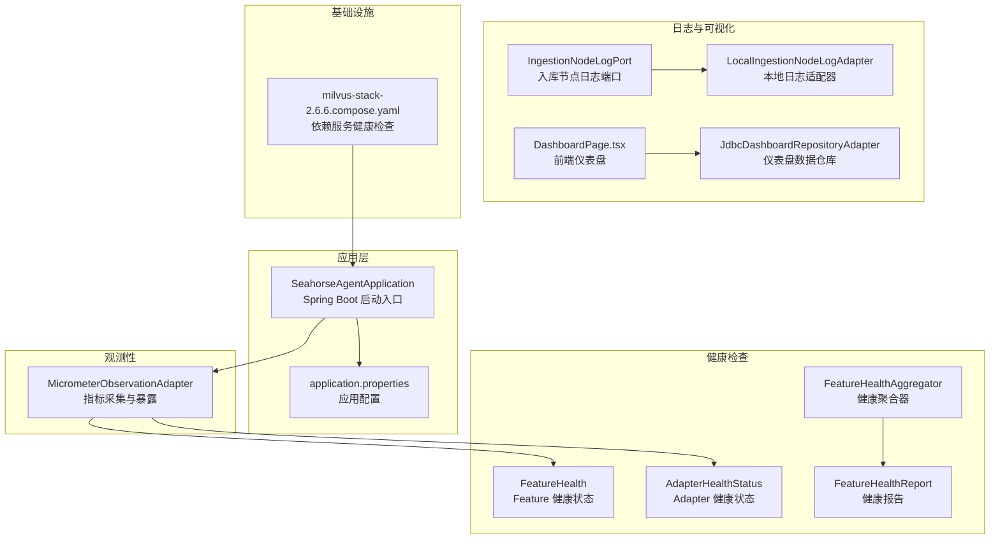
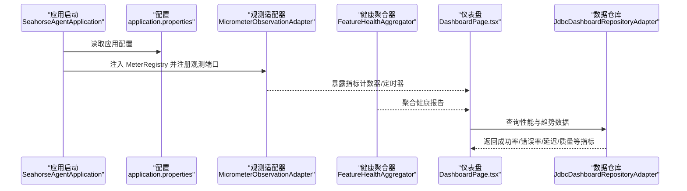
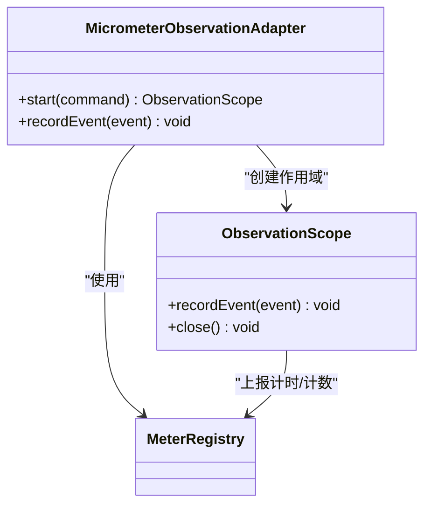
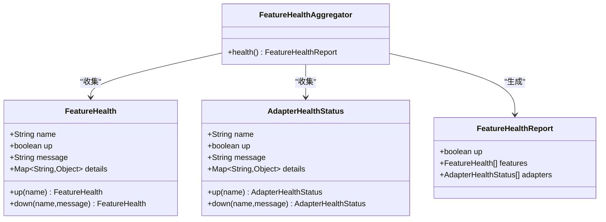
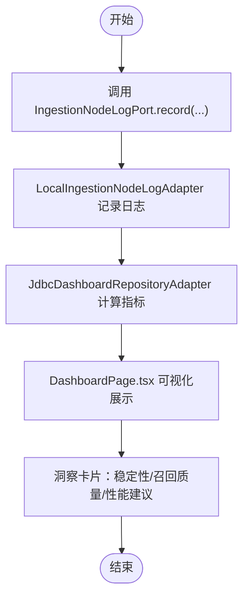
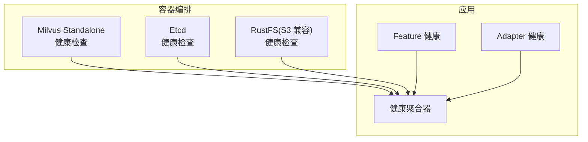
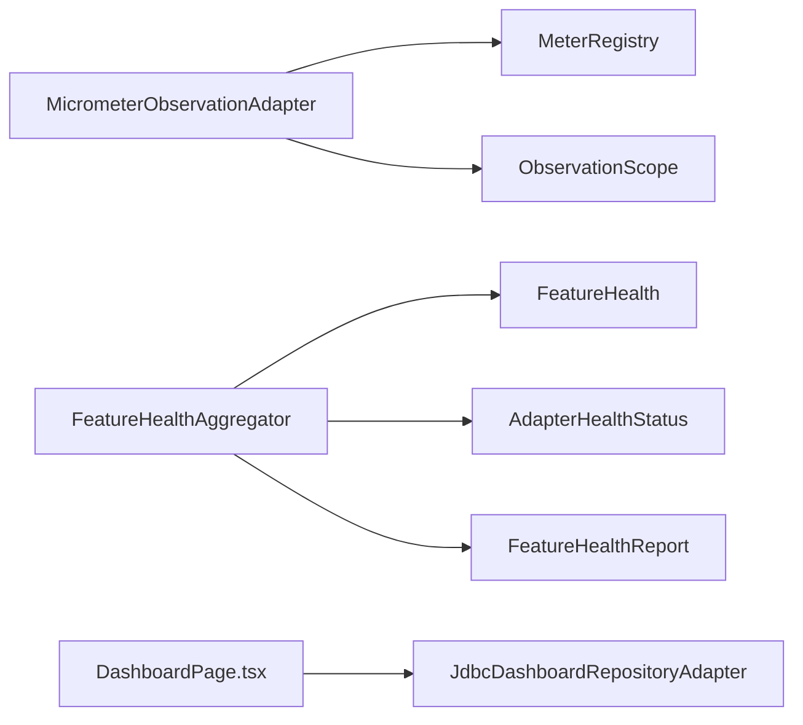

# 监控运维

<cite>
**本文引用的文件**
- [MicrometerObservationAdapter.java](file://seahorse-agent-adapter-observation-micrometer/src/main/java/com/miracle/ai/seahorse/agent/adapters/observation/micrometer/MicrometerObservationAdapter.java)
- [application.properties](file://seahorse-agent-bootstrap/src/main/resources/application.properties)
- [SeahorseAgentApplication.java](file://seahorse-agent-bootstrap/src/main/java/com/miracle/ai/seahorse/agent/SeahorseAgentApplication.java)
- [application.yml](file://seahorse-agent-mcp-server/src/main/resources/application.yml)
- [milvus-stack-2.6.6.compose.yaml](file://resources/docker/milvus-stack-2.6.6.compose.yaml)
- [FeatureHealth.java](file://seahorse-agent-kernel/src/main/java/com/miracle/ai/seahorse/agent/kernel/plugin/FeatureHealth.java)
- [AdapterHealthStatus.java](file://seahorse-agent-kernel/src/main/java/com/miracle/ai/seahorse/agent/ports/outbound/plugin/AdapterHealthStatus.java)
- [FeatureHealthAggregator.java](file://seahorse-agent-kernel/src/main/java/com/miracle/ai/seahorse/agent/kernel/plugin/FeatureHealthAggregator.java)
- [FeatureHealthReport.java](file://seahorse-agent-kernel/src/main/java/com/miracle/ai/seahorse/agent/kernel/plugin/FeatureHealthReport.java)
- [IngestionNodeLogPort.java](file://seahorse-agent-kernel/src/main/java/com/miracle/ai/seahorse/agent/ports/outbound/ingestion/IngestionNodeLogPort.java)
- [LocalIngestionNodeLogAdapter.java](file://seahorse-agent-adapter-web/src/main/java/com/miracle/ai/seahorse/agent/adapters/local/LocalIngestionNodeLogAdapter.java)
- [JdbcDashboardRepositoryAdapter.java](file://seahorse-agent-adapter-repository-jdbc/src/main/java/com/miracle/ai/seahorse/agent/adapters/repository/jdbc/JdbcDashboardRepositoryAdapter.java)
- [DashboardPage.tsx](file://frontend/src/pages/admin/dashboard/DashboardPage.tsx)
- [OA系统数据安全规范文档.md](file://resources/docs/knowledge/biz/biz-oa/OA系统数据安全规范文档.md)
</cite>

## 目录
1. [简介](#简介)
2. [项目结构](#项目结构)
3. [核心组件](#核心组件)
4. [架构总览](#架构总览)
5. [详细组件分析](#详细组件分析)
6. [依赖关系分析](#依赖关系分析)
7. [性能考量](#性能考量)
8. [故障排查指南](#故障排查指南)
9. [结论](#结论)
10. [附录](#附录)

## 简介
本文件面向 Seahorse Agent 项目的监控运维，围绕以下主题展开：
- 观测性与指标体系：基于 Micrometer 的观测性适配器配置与使用，指标采集、暴露与可视化路径。
- 健康检查：服务健康状态聚合、依赖服务健康检查与自动故障检测机制。
- 日志管理：日志级别与格式、入库节点日志记录与前端可视化。
- 故障排查：常见问题诊断、性能瓶颈定位与错误日志分析方法。
- 运维自动化：监控告警、自动扩容与故障恢复的可操作建议。
- 备份与恢复：数据、配置与灾难恢复策略。
- 团队工作流程与职责：确保系统稳定运行的协作机制。

## 项目结构
Seahorse Agent 采用多模块分层设计，观测性、健康检查与前端仪表盘分别由不同模块承载：
- 观测性适配器：Micrometer 适配器负责将内核观测命令与事件转化为指标。
- 健康检查：内核插件模块提供 Feature 与 Adapter 健康状态聚合。
- 日志与可视化：入库节点日志端口与适配器，以及前端仪表盘页面。
- 基础设施：Docker Compose 提供 Milvus/ETCD/RustFS 等依赖服务的健康检查模板。
- 应用入口：Spring Boot 启动类与配置文件定义应用名称与内核启用开关。

**图表来源**
- [SeahorseAgentApplication.java:30-36](file://seahorse-agent-bootstrap/src/main/java/com/miracle/ai/seahorse/agent/SeahorseAgentApplication.java#L30-L36)
- [application.properties:1-4](file://seahorse-agent-bootstrap/src/main/resources/application.properties#L1-L4)
- [MicrometerObservationAdapter.java:42-137](file://seahorse-agent-adapter-observation-micrometer/src/main/java/com/miracle/ai/seahorse/agent/adapters/observation/micrometer/MicrometerObservationAdapter.java#L42-L137)
- [FeatureHealth.java:33-66](file://seahorse-agent-kernel/src/main/java/com/miracle/ai/seahorse/agent/kernel/plugin/FeatureHealth.java#L33-L66)
- [AdapterHealthStatus.java:39-45](file://seahorse-agent-kernel/src/main/java/com/miracle/ai/seahorse/agent/ports/outbound/plugin/AdapterHealthStatus.java#L39-L45)
- [FeatureHealthAggregator.java:42-61](file://seahorse-agent-kernel/src/main/java/com/miracle/ai/seahorse/agent/kernel/plugin/FeatureHealthAggregator.java#L42-L61)
- [FeatureHealthReport.java:32-41](file://seahorse-agent-kernel/src/main/java/com/miracle/ai/seahorse/agent/kernel/plugin/FeatureHealthReport.java#L32-L41)
- [IngestionNodeLogPort.java:27-34](file://seahorse-agent-kernel/src/main/java/com/miracle/ai/seahorse/agent/ports/outbound/ingestion/IngestionNodeLogPort.java#L27-L34)
- [LocalIngestionNodeLogAdapter.java:30-32](file://seahorse-agent-adapter-web/src/main/java/com/miracle/ai/seahorse/agent/adapters/local/LocalIngestionNodeLogAdapter.java#L30-L32)
- [DashboardPage.tsx:103-1351](file://frontend/src/pages/admin/dashboard/DashboardPage.tsx#L103-L1351)
- [JdbcDashboardRepositoryAdapter.java:98-162](file://seahorse-agent-adapter-repository-jdbc/src/main/java/com/miracle/ai/seahorse/agent/adapters/repository/jdbc/JdbcDashboardRepositoryAdapter.java#L98-L162)
- [milvus-stack-2.6.6.compose.yaml:25-79](file://resources/docker/milvus-stack-2.6.6.compose.yaml#L25-L79)

**章节来源**
- [SeahorseAgentApplication.java:30-36](file://seahorse-agent-bootstrap/src/main/java/com/miracle/ai/seahorse/agent/SeahorseAgentApplication.java#L30-L36)
- [application.properties:1-4](file://seahorse-agent-bootstrap/src/main/resources/application.properties#L1-L4)
- [milvus-stack-2.6.6.compose.yaml:1-99](file://resources/docker/milvus-stack-2.6.6.compose.yaml#L1-L99)

## 核心组件
- Micrometer 观测性适配器：将观测命令与事件转换为计数器与定时器指标，支持标签化维度与作用域关闭时的耗时统计。
- 健康检查聚合器：对 Feature 与 Adapter 的健康状态进行聚合，生成整体健康报告。
- 入库节点日志端口与适配器：记录节点执行上下文、配置与结果，并提供本地适配器实现。
- 前端仪表盘与数据仓库：计算成功率、错误率、无知识率、平均/分位延迟等指标，并提供可视化洞察卡片。

**章节来源**
- [MicrometerObservationAdapter.java:42-137](file://seahorse-agent-adapter-observation-micrometer/src/main/java/com/miracle/ai/seahorse/agent/adapters/observation/micrometer/MicrometerObservationAdapter.java#L42-L137)
- [FeatureHealthAggregator.java:42-61](file://seahorse-agent-kernel/src/main/java/com/miracle/ai/seahorse/agent/kernel/plugin/FeatureHealthAggregator.java#L42-L61)
- [IngestionNodeLogPort.java:27-34](file://seahorse-agent-kernel/src/main/java/com/miracle/ai/seahorse/agent/ports/outbound/ingestion/IngestionNodeLogPort.java#L27-L34)
- [LocalIngestionNodeLogAdapter.java:30-32](file://seahorse-agent-adapter-web/src/main/java/com/miracle/ai/seahorse/agent/adapters/local/LocalIngestionNodeLogAdapter.java#L30-L32)
- [JdbcDashboardRepositoryAdapter.java:98-162](file://seahorse-agent-adapter-repository-jdbc/src/main/java/com/miracle/ai/seahorse/agent/adapters/repository/jdbc/JdbcDashboardRepositoryAdapter.java#L98-L162)
- [DashboardPage.tsx:103-1351](file://frontend/src/pages/admin/dashboard/DashboardPage.tsx#L103-L1351)

## 架构总览
下图展示了从应用启动到指标采集、健康检查与前端可视化的整体流程。

**图表来源**
- [SeahorseAgentApplication.java:30-36](file://seahorse-agent-bootstrap/src/main/java/com/miracle/ai/seahorse/agent/SeahorseAgentApplication.java#L30-L36)
- [application.properties:1-4](file://seahorse-agent-bootstrap/src/main/resources/application.properties#L1-L4)
- [MicrometerObservationAdapter.java:42-137](file://seahorse-agent-adapter-observation-micrometer/src/main/java/com/miracle/ai/seahorse/agent/adapters/observation/micrometer/MicrometerObservationAdapter.java#L42-L137)
- [FeatureHealthAggregator.java:42-61](file://seahorse-agent-kernel/src/main/java/com/miracle/ai/seahorse/agent/kernel/plugin/FeatureHealthAggregator.java#L42-L61)
- [DashboardPage.tsx:103-1351](file://frontend/src/pages/admin/dashboard/DashboardPage.tsx#L103-L1351)
- [JdbcDashboardRepositoryAdapter.java:98-162](file://seahorse-agent-adapter-repository-jdbc/src/main/java/com/miracle/ai/seahorse/agent/adapters/repository/jdbc/JdbcDashboardRepositoryAdapter.java#L98-L162)

## 详细组件分析

### 观测性与指标体系（Micrometer 适配器）
- 指标类型
  - 持续时长指标：基于 Timer，记录观测作用域结束时的耗时。
  - 事件计数指标：基于 Counter，记录观测事件数量。
- 标签维度
  - 观测命令与事件均支持标签化，包含观察名称、租户 ID、属性键值对等。
- 作用域管理
  - 通过内部作用域在 close 时停止采样并上报时长指标，保证指标粒度与生命周期一致。
- 配置与集成
  - 适配器通过构造函数注入 MeterRegistry，无需 Spring Boot 自动装配即可工作。
  - 适配器声明为默认观测端口实现，便于内核观测端口对接。

**图表来源**
- [MicrometerObservationAdapter.java:42-137](file://seahorse-agent-adapter-observation-micrometer/src/main/java/com/miracle/ai/seahorse/agent/adapters/observation/micrometer/MicrometerObservationAdapter.java#L42-L137)

**章节来源**
- [MicrometerObservationAdapter.java:42-137](file://seahorse-agent-adapter-observation-micrometer/src/main/java/com/miracle/ai/seahorse/agent/adapters/observation/micrometer/MicrometerObservationAdapter.java#L42-L137)

### 健康检查机制
- 健康状态模型
  - Feature 健康状态：包含名称、是否健康、消息与详情。
  - Adapter 健康状态：包含名称、是否健康、状态字符串与详情。
- 聚合逻辑
  - 聚合器对 Feature 与 Adapter 的健康状态进行汇总，任一不健康则整体不健康。
  - Feature 健康方法抛出异常会被转换为 DOWN 状态，避免异常传播至主链路。
- 报告输出
  - 输出整体健康布尔值与明细列表，便于前端与运维系统消费。

**图表来源**
- [FeatureHealth.java:33-66](file://seahorse-agent-kernel/src/main/java/com/miracle/ai/seahorse/agent/kernel/plugin/FeatureHealth.java#L33-L66)
- [AdapterHealthStatus.java:39-45](file://seahorse-agent-kernel/src/main/java/com/miracle/ai/seahorse/agent/ports/outbound/plugin/AdapterHealthStatus.java#L39-L45)
- [FeatureHealthAggregator.java:42-61](file://seahorse-agent-kernel/src/main/java/com/miracle/ai/seahorse/agent/kernel/plugin/FeatureHealthAggregator.java#L42-L61)
- [FeatureHealthReport.java:32-41](file://seahorse-agent-kernel/src/main/java/com/miracle/ai/seahorse/agent/kernel/plugin/FeatureHealthReport.java#L32-L41)

**章节来源**
- [FeatureHealth.java:33-66](file://seahorse-agent-kernel/src/main/java/com/miracle/ai/seahorse/agent/kernel/plugin/FeatureHealth.java#L33-L66)
- [AdapterHealthStatus.java:39-45](file://seahorse-agent-kernel/src/main/java/com/miracle/ai/seahorse/agent/ports/outbound/plugin/AdapterHealthStatus.java#L39-L45)
- [FeatureHealthAggregator.java:42-61](file://seahorse-agent-kernel/src/main/java/com/miracle/ai/seahorse/agent/kernel/plugin/FeatureHealthAggregator.java#L42-L61)
- [FeatureHealthReport.java:32-41](file://seahorse-agent-kernel/src/main/java/com/miracle/ai/seahorse/agent/kernel/plugin/FeatureHealthReport.java#L32-L41)

### 日志管理与可视化
- 入库节点日志端口
  - 定义记录节点执行上下文、配置与结果的方法，并提供空实现以兼容无日志场景。
- 本地日志适配器
  - 提供本地实现，便于在开发或特定运行时记录节点日志。
- 前端仪表盘
  - 基于后端返回的性能与趋势数据，计算成功率/错误率/无知识率/平均/分位延迟等指标，并生成洞察卡片。
- 数据仓库
  - 计算窗口内的平均/分位延迟、成功率、错误率、无知识率与慢请求比例，支撑前端展示。

**图表来源**
- [IngestionNodeLogPort.java:27-34](file://seahorse-agent-kernel/src/main/java/com/miracle/ai/seahorse/agent/ports/outbound/ingestion/IngestionNodeLogPort.java#L27-L34)
- [LocalIngestionNodeLogAdapter.java:30-32](file://seahorse-agent-adapter-web/src/main/java/com/miracle/ai/seahorse/agent/adapters/local/LocalIngestionNodeLogAdapter.java#L30-L32)
- [JdbcDashboardRepositoryAdapter.java:98-162](file://seahorse-agent-adapter-repository-jdbc/src/main/java/com/miracle/ai/seahorse/agent/adapters/repository/jdbc/JdbcDashboardRepositoryAdapter.java#L98-L162)
- [DashboardPage.tsx:103-1351](file://frontend/src/pages/admin/dashboard/DashboardPage.tsx#L103-L1351)

**章节来源**
- [IngestionNodeLogPort.java:27-34](file://seahorse-agent-kernel/src/main/java/com/miracle/ai/seahorse/agent/ports/outbound/ingestion/IngestionNodeLogPort.java#L27-L34)
- [LocalIngestionNodeLogAdapter.java:30-32](file://seahorse-agent-adapter-web/src/main/java/com/miracle/ai/seahorse/agent/adapters/local/LocalIngestionNodeLogAdapter.java#L30-L32)
- [JdbcDashboardRepositoryAdapter.java:98-162](file://seahorse-agent-adapter-repository-jdbc/src/main/java/com/miracle/ai/seahorse/agent/adapters/repository/jdbc/JdbcDashboardRepositoryAdapter.java#L98-L162)
- [DashboardPage.tsx:103-1351](file://frontend/src/pages/admin/dashboard/DashboardPage.tsx#L103-L1351)

### 健康检查与依赖服务
- 依赖服务健康检查
  - Docker Compose 中为 Milvus、Etcd、RustFS 等服务配置了健康检查探针，便于容器编排环境下的自动故障检测。
- 应用内健康检查
  - 内核插件通过聚合器将 Feature 与 Adapter 健康状态汇总，形成整体健康报告，供前端与运维系统使用。

**图表来源**
- [milvus-stack-2.6.6.compose.yaml:25-79](file://resources/docker/milvus-stack-2.6.6.compose.yaml#L25-L79)
- [FeatureHealthAggregator.java:42-61](file://seahorse-agent-kernel/src/main/java/com/miracle/ai/seahorse/agent/kernel/plugin/FeatureHealthAggregator.java#L42-L61)

**章节来源**
- [milvus-stack-2.6.6.compose.yaml:25-79](file://resources/docker/milvus-stack-2.6.6.compose.yaml#L25-L79)
- [FeatureHealthAggregator.java:42-61](file://seahorse-agent-kernel/src/main/java/com/miracle/ai/seahorse/agent/kernel/plugin/FeatureHealthAggregator.java#L42-L61)

## 依赖关系分析
- 组件耦合
  - 观测适配器与 MeterRegistry 强耦合，但通过构造注入降低对框架的依赖。
  - 健康聚合器对 Feature 与 Adapter 接口解耦，仅依赖健康状态模型。
- 外部依赖
  - Docker Compose 提供 Milvus/ETCD/RustFS 的健康检查，作为外部依赖健康保障。
- 指标暴露
  - 适配器通过 Micrometer 暴露指标，可与 Prometheus/Grafana 等生态集成（需在运行环境中配置）。

**图表来源**
- [MicrometerObservationAdapter.java:42-137](file://seahorse-agent-adapter-observation-micrometer/src/main/java/com/miracle/ai/seahorse/agent/adapters/observation/micrometer/MicrometerObservationAdapter.java#L42-L137)
- [FeatureHealthAggregator.java:42-61](file://seahorse-agent-kernel/src/main/java/com/miracle/ai/seahorse/agent/kernel/plugin/FeatureHealthAggregator.java#L42-L61)
- [DashboardPage.tsx:103-1351](file://frontend/src/pages/admin/dashboard/DashboardPage.tsx#L103-L1351)
- [JdbcDashboardRepositoryAdapter.java:98-162](file://seahorse-agent-adapter-repository-jdbc/src/main/java/com/miracle/ai/seahorse/agent/adapters/repository/jdbc/JdbcDashboardRepositoryAdapter.java#L98-L162)

**章节来源**
- [MicrometerObservationAdapter.java:42-137](file://seahorse-agent-adapter-observation-micrometer/src/main/java/com/miracle/ai/seahorse/agent/adapters/observation/micrometer/MicrometerObservationAdapter.java#L42-L137)
- [FeatureHealthAggregator.java:42-61](file://seahorse-agent-kernel/src/main/java/com/miracle/ai/seahorse/agent/kernel/plugin/FeatureHealthAggregator.java#L42-L61)
- [DashboardPage.tsx:103-1351](file://frontend/src/pages/admin/dashboard/DashboardPage.tsx#L103-L1351)
- [JdbcDashboardRepositoryAdapter.java:98-162](file://seahorse-agent-adapter-repository-jdbc/src/main/java/com/miracle/ai/seahorse/agent/adapters/repository/jdbc/JdbcDashboardRepositoryAdapter.java#L98-L162)

## 性能考量
- 指标开销
  - Timer/Counter 的创建与上报为轻量操作，但在高频观测场景下仍需控制标签基数与事件频率。
- 健康检查隔离
  - 健康检查异常被捕获并转为 DOWN 状态，避免影响在线请求。
- 前端阈值
  - 前端仪表盘内置阈值用于快速识别异常，如成功率低于阈值、平均延迟高于阈值、无知识率偏高等。

**章节来源**
- [FeatureHealthAggregator.java:55-61](file://seahorse-agent-kernel/src/main/java/com/miracle/ai/seahorse/agent/kernel/plugin/FeatureHealthAggregator.java#L55-L61)
- [DashboardPage.tsx:103-1351](file://frontend/src/pages/admin/dashboard/DashboardPage.tsx#L103-L1351)

## 故障排查指南
- 观测指标缺失
  - 检查 MeterRegistry 注入与适配器注册；确认命令与事件标签有效且非空。
- 健康状态异常
  - 查看聚合器输出的 Feature/Adapter 健康明细，定位具体组件；关注异常转换为 DOWN 的消息。
- 依赖服务不可用
  - 检查 Docker Compose 健康检查探针输出，确认 Milvus/ETCD/RustFS 状态。
- 日志记录问题
  - 确认 IngestionNodeLogPort 实现已正确注入，且本地适配器生效；检查数据库侧仪表盘仓库指标计算逻辑。
- 前端指标异常
  - 核对仪表盘阈值与数据窗口设置，确认查询范围与聚合粒度。

**章节来源**
- [MicrometerObservationAdapter.java:73-102](file://seahorse-agent-adapter-observation-micrometer/src/main/java/com/miracle/ai/seahorse/agent/adapters/observation/micrometer/MicrometerObservationAdapter.java#L73-L102)
- [FeatureHealthAggregator.java:55-61](file://seahorse-agent-kernel/src/main/java/com/miracle/ai/seahorse/agent/kernel/plugin/FeatureHealthAggregator.java#L55-L61)
- [milvus-stack-2.6.6.compose.yaml:25-79](file://resources/docker/milvus-stack-2.6.6.compose.yaml#L25-L79)
- [IngestionNodeLogPort.java:27-34](file://seahorse-agent-kernel/src/main/java/com/miracle/ai/seahorse/agent/ports/outbound/ingestion/IngestionNodeLogPort.java#L27-L34)
- [JdbcDashboardRepositoryAdapter.java:98-162](file://seahorse-agent-adapter-repository-jdbc/src/main/java/com/miracle/ai/seahorse/agent/adapters/repository/jdbc/JdbcDashboardRepositoryAdapter.java#L98-L162)
- [DashboardPage.tsx:103-1351](file://frontend/src/pages/admin/dashboard/DashboardPage.tsx#L103-L1351)

## 结论
本文件梳理了 Seahorse Agent 在观测性、健康检查、日志与可视化方面的实现与最佳实践。通过 Micrometer 适配器与健康聚合器，系统具备可观测与可诊断的基础能力；结合前端仪表盘与 Docker Compose 健康检查，可快速定位问题并指导修复。建议在生产环境中完善指标暴露与告警策略，并持续优化日志与备份恢复流程。

## 附录
- 运维自动化建议
  - 监控告警：基于暴露的指标建立阈值告警，联动值班流程。
  - 自动扩容：根据延迟与错误率趋势触发弹性伸缩（需结合平台能力）。
  - 故障恢复：利用健康检查与日志回溯快速定位并回滚/重启。
- 备份与恢复策略
  - 数据备份：数据库全量/增量备份，对象存储与向量库一致性校验。
  - 配置备份：配置中心与 Compose 文件版本化管理。
  - 灾难恢复：定期演练恢复流程，明确 RPO/RTO 目标。
- 团队工作流程
  - 运维团队：负责监控告警、容量与备份、故障处理与演练。
  - 开发团队：负责健康检查与观测指标的持续改进。
  - 安全合规：遵循数据安全与审计要求，确保日志留存与合规。

**章节来源**
- [OA系统数据安全规范文档.md:145-258](file://resources/docs/knowledge/biz/biz-oa/OA系统数据安全规范文档.md#L145-L258)