# JDBC仓库适配器

<cite>
**本文档引用的文件**
- [JdbcKnowledgeDocumentRepositoryAdapter.java](file://seahorse-agent-adapter-repository-jdbc/src/main/java/com/miracle/ai/seahorse/agent/adapters/repository/jdbc/JdbcKnowledgeDocumentRepositoryAdapter.java)
- [JdbcKnowledgeBaseRepositoryAdapter.java](file://seahorse-agent-adapter-repository-jdbc/src/main/java/com/miracle/ai/seahorse/agent/adapters/repository/jdbc/JdbcKnowledgeBaseRepositoryAdapter.java)
- [JdbcUserRepositoryAdapter.java](file://seahorse-agent-adapter-repository-jdbc/src/main/java/com/miracle/ai/seahorse/agent/adapters/repository/jdbc/JdbcUserRepositoryAdapter.java)
- [JdbcKnowledgeBaseQueryAdapter.java](file://seahorse-agent-adapter-repository-jdbc/src/main/java/com/miracle/ai/seahorse/agent/adapters/repository/jdbc/JdbcKnowledgeBaseQueryAdapter.java)
- [JdbcKnowledgeChunkRepositoryAdapter.java](file://seahorse-agent-adapter-repository-jdbc/src/main/java/com/miracle/ai/seahorse/agent/adapters/repository/jdbc/JdbcKnowledgeChunkRepositoryAdapter.java)
- [JdbcKnowledgeBasePermissionRepositoryAdapter.java](file://seahorse-agent-adapter-repository-jdbc/src/main/java/com/miracle/ai/seahorse/agent/adapters/repository/jdbc/JdbcKnowledgeBasePermissionRepositoryAdapter.java)
- [JdbcWorkflowVisualizationRepositoryAdapter.java](file://seahorse-agent-adapter-repository-jdbc/src/main/java/com/miracle/ai/seahorse/agent/adapters/repository/jdbc/JdbcWorkflowVisualizationRepositoryAdapter.java)
- [JdbcAdminRepositoryAdapter.java](file://seahorse-agent-adapter-repository-jdbc/src/main/java/com/miracle/ai/seahorse/agent/adapters/repository/jdbc/JdbcAdminRepositoryAdapter.java)
- [JdbcAuditEventRepositoryAdapter.java](file://seahorse-agent-adapter-repository-jdbc/src/main/java/com/miracle/ai/seahorse/agent/adapters/repository/jdbc/JdbcAuditEventRepositoryAdapter.java)
- [JdbcAuditLogRepositoryAdapter.java](file://seahorse-agent-adapter-repository-jdbc/src/main/java/com/miracle/ai/seahorse/agent/adapters/repository/jdbc/JdbcAuditLogRepositoryAdapter.java)
- [SeahorseAgentRetrievalRepositoryAutoConfiguration.java](file://seahorse-agent-spring-boot-starter/src/main/java/com/miracle/ai/seahorse/agent/adapters/spring/SeahorseAgentRetrievalRepositoryAutoConfiguration.java)
</cite>

## 更新摘要
**所做更改**
- 新增知识库权限管理适配器章节，涵盖权限控制和访问决策功能
- 新增工作流可视化适配器章节，介绍工作流事件和节点管理
- 新增管理员查询适配器章节，描述超级管理员和租户管理功能
- 新增审计日志适配器章节，详细说明审计事件和工具调用审计
- 更新核心组件分类，将新增适配器纳入现有架构体系
- 增强依赖关系分析，反映新增功能模块的集成方式

## 目录
1. [简介](#简介)
2. [项目结构](#项目结构)
3. [核心组件](#核心组件)
4. [架构概览](#架构概览)
5. [详细组件分析](#详细组件分析)
6. [依赖关系分析](#依赖关系分析)
7. [性能考虑](#性能考虑)
8. [故障排除指南](#故障排除指南)
9. [结论](#结论)

## 简介

JDBC仓库适配器是SeaHorse Agent项目中的核心数据持久化组件，负责将各种业务实体映射到关系型数据库中。该适配器实现了Repository模式，提供了一致的数据访问接口，支持知识库、会话、用户和内存管理等核心业务场景。

**更新** 新增六个专业化的JDBC适配器，包括知识库版本管理、权限控制、分享令牌管理、工作流可视化、管理员查询和审计日志查询，进一步增强了系统的功能完整性和企业级服务能力。

该适配器基于Spring JDBC框架构建，通过JdbcTemplate实现数据库连接管理和事务控制，确保数据操作的原子性和一致性。所有适配器都遵循统一的端口接口规范，便于替换和扩展。

## 项目结构

JDBC仓库适配器位于`seahorse-agent-adapter-repository-jdbc`模块中，采用按功能域组织的文件结构：

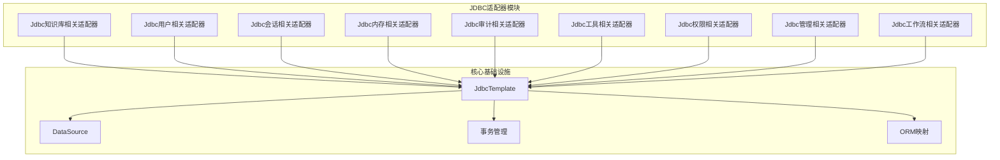

**图表来源**
- [JdbcKnowledgeBaseRepositoryAdapter.java:1-100](file://seahorse-agent-adapter-repository-jdbc/src/main/java/com/miracle/ai/seahorse/agent/adapters/repository/jdbc/JdbcKnowledgeBaseRepositoryAdapter.java#L1-L100)
- [JdbcUserRepositoryAdapter.java:1-50](file://seahorse-agent-adapter-repository-jdbc/src/main/java/com/miracle/ai/seahorse/agent/adapters/repository/jdbc/JdbcUserRepositoryAdapter.java#L1-L50)

**章节来源**
- [JdbcKnowledgeBaseRepositoryAdapter.java:1-100](file://seahorse-agent-adapter-repository-jdbc/src/main/java/com/miracle/ai/seahorse/agent/adapters/repository/jdbc/JdbcKnowledgeBaseRepositoryAdapter.java#L1-L100)
- [JdbcUserRepositoryAdapter.java:1-50](file://seahorse-agent-adapter-repository-jdbc/src/main/java/com/miracle/ai/seahorse/agent/adapters/repository/jdbc/JdbcUserRepositoryAdapter.java#L1-L50)

## 核心组件

JDBC仓库适配器包含多个专门的适配器类，每个都负责特定的业务领域。经过更新后，组件结构更加完善和专业化：

### 主要适配器类别

1. **知识库适配器系列**
   - JdbcKnowledgeBaseRepositoryAdapter：知识库基础信息管理
   - JdbcKnowledgeDocumentRepositoryAdapter：知识文档管理
   - JdbcKnowledgeChunkRepositoryAdapter：知识文档分块管理
   - JdbcKnowledgeBaseQueryAdapter：知识库查询接口
   - **新增** JdbcKnowledgeBasePermissionRepositoryAdapter：知识库权限管理

2. **用户管理适配器**
   - JdbcUserRepositoryAdapter：用户信息管理

3. **会话管理适配器**
   - JdbcConversationRepositoryAdapter：对话会话管理
   - JdbcConversationAttachmentRepositoryAdapter：会话附件管理

4. **代理管理适配器**
   - JdbcAgentDefinitionRepositoryAdapter：代理定义管理
   - JdbcAgentRunRepositoryAdapter：代理运行状态管理
   - JdbcAgentSkillRepositoryAdapter：代理技能管理

5. **审计与监控适配器**
   - JdbcAuditEventRepositoryAdapter：审计事件记录
   - JdbcAuditLogRepositoryAdapter：审计日志管理
   - JdbcToolInvocationAuditRepositoryAdapter：工具调用审计

6. **工作流管理适配器**
   - **新增** JdbcWorkflowVisualizationRepositoryAdapter：工作流可视化管理

7. **管理员管理适配器**
   - **新增** JdbcAdminRepositoryAdapter：管理员权限和租户管理

**章节来源**
- [JdbcKnowledgeBaseRepositoryAdapter.java:1-100](file://seahorse-agent-adapter-repository-jdbc/src/main/java/com/miracle/ai/seahorse/agent/adapters/repository/jdbc/JdbcKnowledgeBaseRepositoryAdapter.java#L1-L100)
- [JdbcUserRepositoryAdapter.java:1-50](file://seahorse-agent-adapter-repository-jdbc/src/main/java/com/miracle/ai/seahorse/agent/adapters/repository/jdbc/JdbcUserRepositoryAdapter.java#L1-L50)
- [JdbcKnowledgeBasePermissionRepositoryAdapter.java](file://seahorse-agent-adapter-repository-jdbc/src/main/java/com/miracle/ai/seahorse/agent/adapters/repository/jdbc/JdbcKnowledgeBasePermissionRepositoryAdapter.java)
- [JdbcWorkflowVisualizationRepositoryAdapter.java](file://seahorse-agent-adapter-repository-jdbc/src/main/java/com/miracle/ai/seahorse/agent/adapters/repository/jdbc/JdbcWorkflowVisualizationRepositoryAdapter.java)
- [JdbcAdminRepositoryAdapter.java](file://seahorse-agent-adapter-repository-jdbc/src/main/java/com/miracle/ai/seahorse/agent/adapters/repository/jdbc/JdbcAdminRepositoryAdapter.java)
- [JdbcAuditEventRepositoryAdapter.java](file://seahorse-agent-adapter-repository-jdbc/src/main/java/com/miracle/ai/seahorse/agent/adapters/repository/jdbc/JdbcAuditEventRepositoryAdapter.java)
- [JdbcAuditLogRepositoryAdapter.java](file://seahorse-agent-adapter-repository-jdbc/src/main/java/com/miracle/ai/seahorse/agent/adapters/repository/jdbc/JdbcAuditLogRepositoryAdapter.java)

## 架构概览

JDBC仓库适配器采用分层架构设计，确保了良好的关注点分离和可维护性。经过更新后，架构更加完善，支持更复杂的企业级功能：

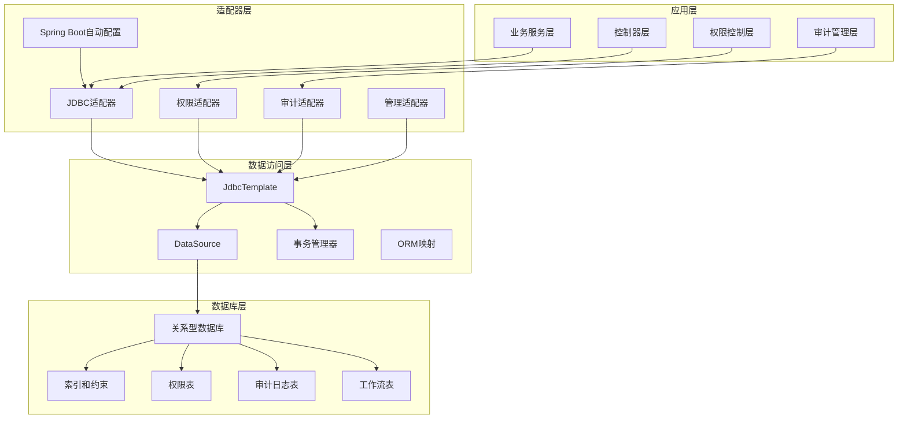

**图表来源**
- [SeahorseAgentRetrievalRepositoryAutoConfiguration.java:49-62](file://seahorse-agent-spring-boot-starter/src/main/java/com/miracle/ai/seahorse/agent/adapters/spring/SeahorseAgentRetrievalRepositoryAutoConfiguration.java#L49-L62)
- [JdbcKnowledgeBaseRepositoryAdapter.java:96-100](file://seahorse-agent-adapter-repository-jdbc/src/main/java/com/miracle/ai/seahorse/agent/adapters/repository/jdbc/JdbcKnowledgeBaseRepositoryAdapter.java#L96-L100)

### 数据流处理流程

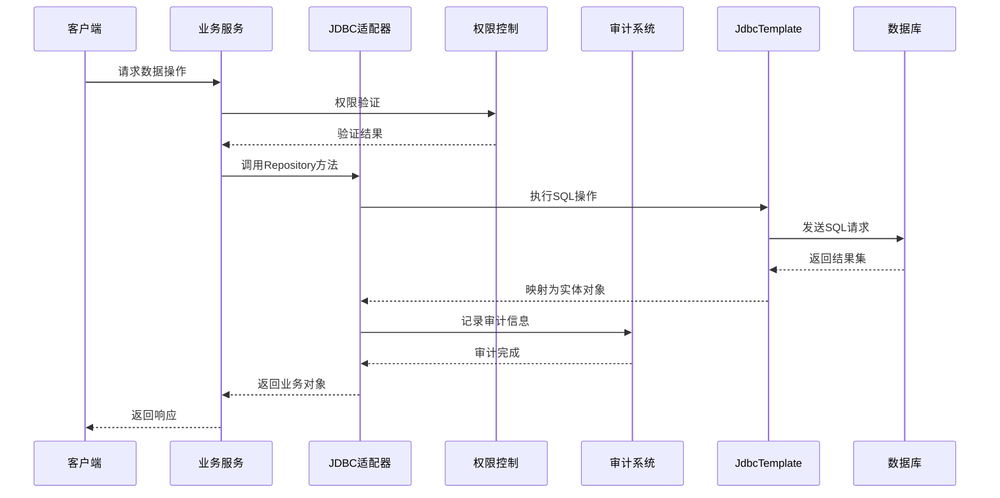

**图表来源**
- [JdbcKnowledgeBaseRepositoryAdapter.java:160-200](file://seahorse-agent-adapter-repository-jdbc/src/main/java/com/miracle/ai/seahorse/agent/adapters/repository/jdbc/JdbcKnowledgeBaseRepositoryAdapter.java#L160-L200)
- [JdbcUserRepositoryAdapter.java:120-160](file://seahorse-agent-adapter-repository-jdbc/src/main/java/com/miracle/ai/seahorse/agent/adapters/repository/jdbc/JdbcUserRepositoryAdapter.java#L120-L160)

## 详细组件分析

### 知识库权限管理适配器

**新增** JdbcKnowledgeBasePermissionRepositoryAdapter专门负责知识库的权限控制和访问管理：

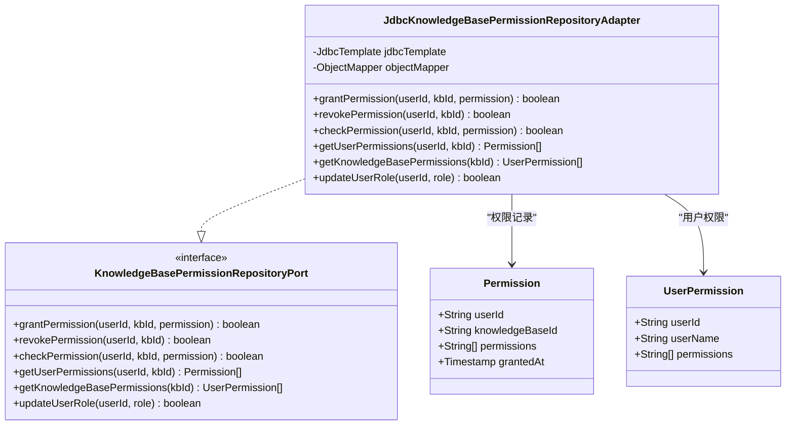

**图表来源**
- [JdbcKnowledgeBasePermissionRepositoryAdapter.java](file://seahorse-agent-adapter-repository-jdbc/src/main/java/com/miracle/ai/seahorse/agent/adapters/repository/jdbc/JdbcKnowledgeBasePermissionRepositoryAdapter.java)

#### 核心权限管理功能

1. **细粒度权限控制**：支持用户对特定知识库的读写权限管理
2. **权限继承机制**：支持角色驱动的权限继承和传递
3. **权限审计追踪**：完整记录权限授予和撤销的历史
4. **批量权限操作**：支持批量授予和撤销用户权限

**章节来源**
- [JdbcKnowledgeBasePermissionRepositoryAdapter.java](file://seahorse-agent-adapter-repository-jdbc/src/main/java/com/miracle/ai/seahorse/agent/adapters/repository/jdbc/JdbcKnowledgeBasePermissionRepositoryAdapter.java)

### 工作流可视化适配器

**新增** JdbcWorkflowVisualizationRepositoryAdapter负责工作流事件和节点的持久化管理：

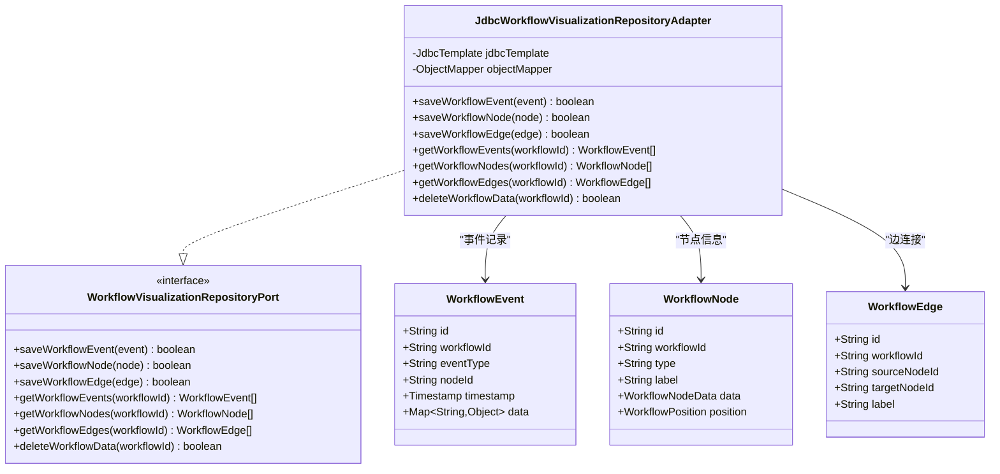

**图表来源**
- [JdbcWorkflowVisualizationRepositoryAdapter.java](file://seahorse-agent-adapter-repository-jdbc/src/main/java/com/miracle/ai/seahorse/agent/adapters/repository/jdbc/JdbcWorkflowVisualizationRepositoryAdapter.java)

#### 工作流可视化管理特性

1. **事件驱动架构**：实时捕获和存储工作流执行事件
2. **节点状态管理**：跟踪工作流节点的创建、更新和删除状态
3. **连接关系维护**：管理节点间的依赖关系和执行顺序
4. **历史数据保留**：支持工作流历史数据的查询和分析

**章节来源**
- [JdbcWorkflowVisualizationRepositoryAdapter.java](file://seahorse-agent-adapter-repository-jdbc/src/main/java/com/miracle/ai/seahorse/agent/adapters/repository/jdbc/JdbcWorkflowVisualizationRepositoryAdapter.java)

### 管理员查询适配器

**新增** JdbcAdminRepositoryAdapter提供超级管理员和租户管理功能：

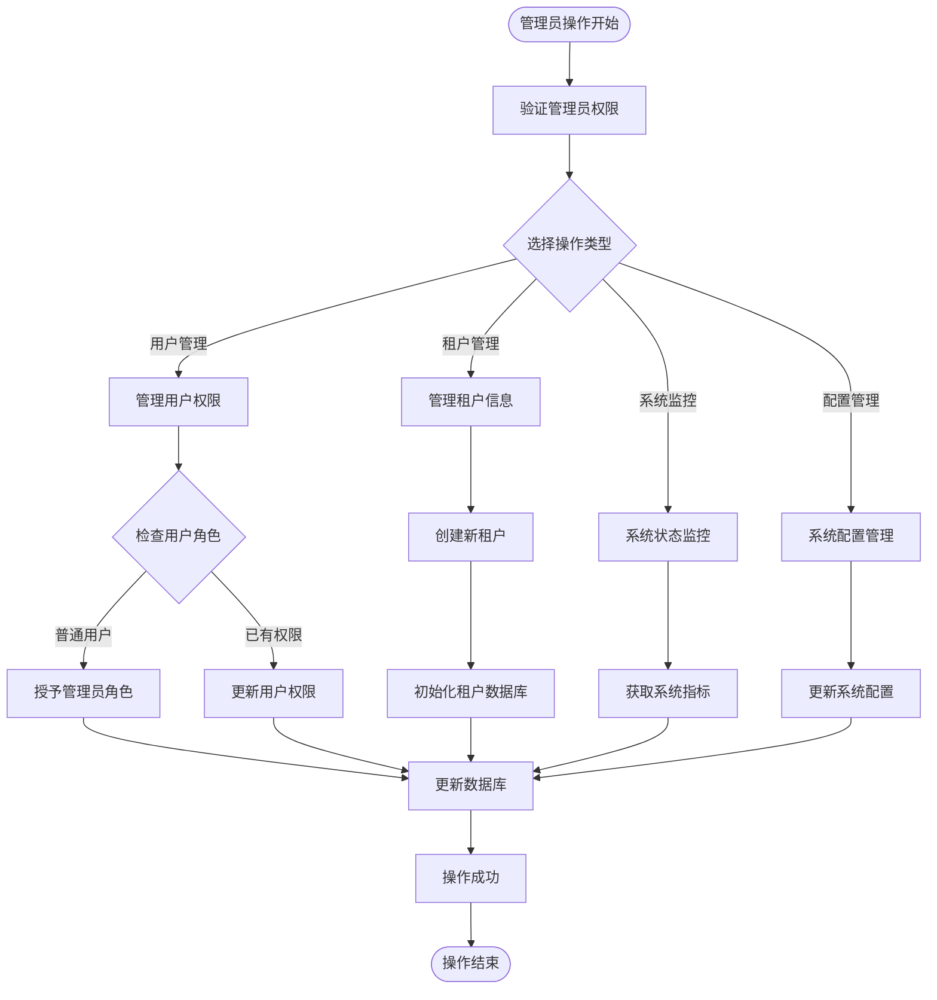

**图表来源**
- [JdbcAdminRepositoryAdapter.java](file://seahorse-agent-adapter-repository-jdbc/src/main/java/com/miracle/ai/seahorse/agent/adapters/repository/jdbc/JdbcAdminRepositoryAdapter.java)

#### 管理员管理功能特性

1. **多租户支持**：支持多个租户的独立管理和资源隔离
2. **权限分级管理**：实现超级管理员和普通管理员的权限分离
3. **系统监控集成**：提供系统健康状态和性能指标监控
4. **配置中心管理**：集中管理系统配置和环境变量

**章节来源**
- [JdbcAdminRepositoryAdapter.java](file://seahorse-agent-adapter-repository-jdbc/src/main/java/com/miracle/ai/seahorse/agent/adapters/repository/jdbc/JdbcAdminRepositoryAdapter.java)

### 审计日志适配器

**新增** 审计日志适配器系列包括事件审计和工具调用审计：

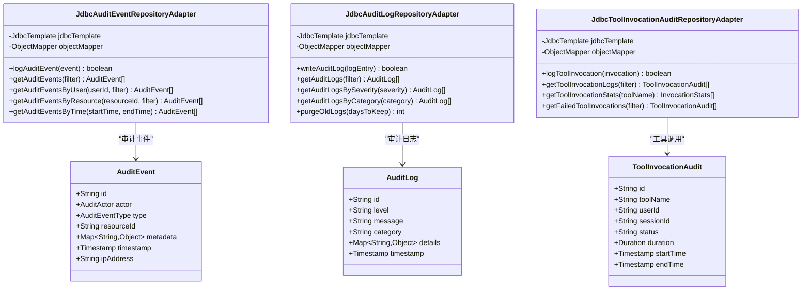

**图表来源**
- [JdbcAuditEventRepositoryAdapter.java](file://seahorse-agent-adapter-repository-jdbc/src/main/java/com/miracle/ai/seahorse/agent/adapters/repository/jdbc/JdbcAuditEventRepositoryAdapter.java)
- [JdbcAuditLogRepositoryAdapter.java](file://seahorse-agent-adapter-repository-jdbc/src/main/java/com/miracle/ai/seahorse/agent/adapters/repository/jdbc/JdbcAuditLogRepositoryAdapter.java)

#### 审计功能特性

1. **多维度审计**：支持用户行为、系统事件和工具调用的全方位审计
2. **实时日志记录**：提供低延迟的审计事件捕获和存储
3. **灵活查询接口**：支持按时间、用户、资源等多种条件的审计数据查询
4. **合规性支持**：满足企业级审计和合规性要求

**章节来源**
- [JdbcAuditEventRepositoryAdapter.java](file://seahorse-agent-adapter-repository-jdbc/src/main/java/com/miracle/ai/seahorse/agent/adapters/repository/jdbc/JdbcAuditEventRepositoryAdapter.java)
- [JdbcAuditLogRepositoryAdapter.java](file://seahorse-agent-adapter-repository-jdbc/src/main/java/com/miracle/ai/seahorse/agent/adapters/repository/jdbc/JdbcAuditLogRepositoryAdapter.java)
- [JdbcToolInvocationAuditRepositoryAdapter.java](file://seahorse-agent-adapter-repository-jdbc/src/main/java/com/miracle/ai/seahorse/agent/adapters/repository/jdbc/JdbcToolInvocationAuditRepositoryAdapter.java)

### 知识库文档适配器

JdbcKnowledgeDocumentRepositoryAdapter是知识库管理的核心组件，负责处理知识文档的完整生命周期：

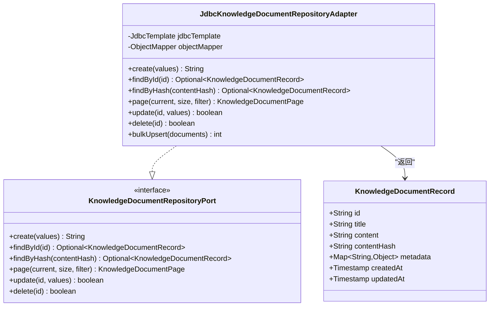

**图表来源**
- [JdbcKnowledgeDocumentRepositoryAdapter.java:54-120](file://seahorse-agent-adapter-repository-jdbc/src/main/java/com/miracle/ai/seahorse/agent/adapters/repository/jdbc/JdbcKnowledgeDocumentRepositoryAdapter.java#L54-L120)

#### 核心功能特性

1. **批量操作优化**：支持批量插入和更新操作，提高大数据量处理效率
2. **内容哈希验证**：通过内容哈希避免重复存储相同文档
3. **元数据管理**：支持JSON格式的动态元数据存储
4. **分页查询**：提供高效的知识文档分页检索能力

**章节来源**
- [JdbcKnowledgeDocumentRepositoryAdapter.java:54-200](file://seahorse-agent-adapter-repository-jdbc/src/main/java/com/miracle/ai/seahorse/agent/adapters/repository/jdbc/JdbcKnowledgeDocumentRepositoryAdapter.java#L54-L200)

### 用户管理适配器

JdbcUserRepositoryAdapter提供完整的用户管理功能，包括用户创建、查询、更新和删除操作：

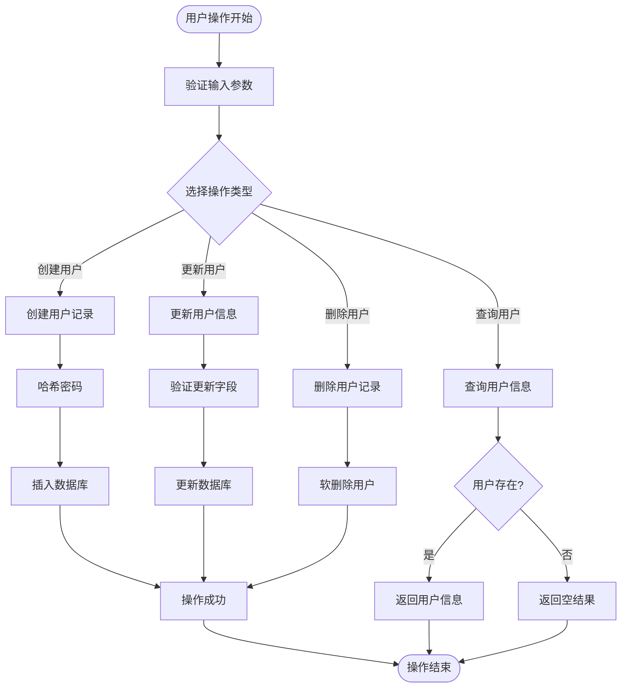

**图表来源**
- [JdbcUserRepositoryAdapter.java:43-120](file://seahorse-agent-adapter-repository-jdbc/src/main/java/com/miracle/ai/seahorse/agent/adapters/repository/jdbc/JdbcUserRepositoryAdapter.java#L43-L120)

#### 关键实现细节

1. **密码安全处理**：使用安全的密码哈希算法保护用户凭据
2. **软删除机制**：删除用户时仅设置标记位而非物理删除
3. **分页查询优化**：支持关键词搜索和分页显示
4. **并发控制**：通过数据库约束防止并发操作冲突

**章节来源**
- [JdbcUserRepositoryAdapter.java:43-200](file://seahorse-agent-adapter-repository-jdbc/src/main/java/com/miracle/ai/seahorse/agent/adapters/repository/jdbc/JdbcUserRepositoryAdapter.java#L43-L200)

### 知识库查询适配器

JdbcKnowledgeBaseQueryAdapter专注于知识库的复杂查询需求，提供高性能的检索能力：

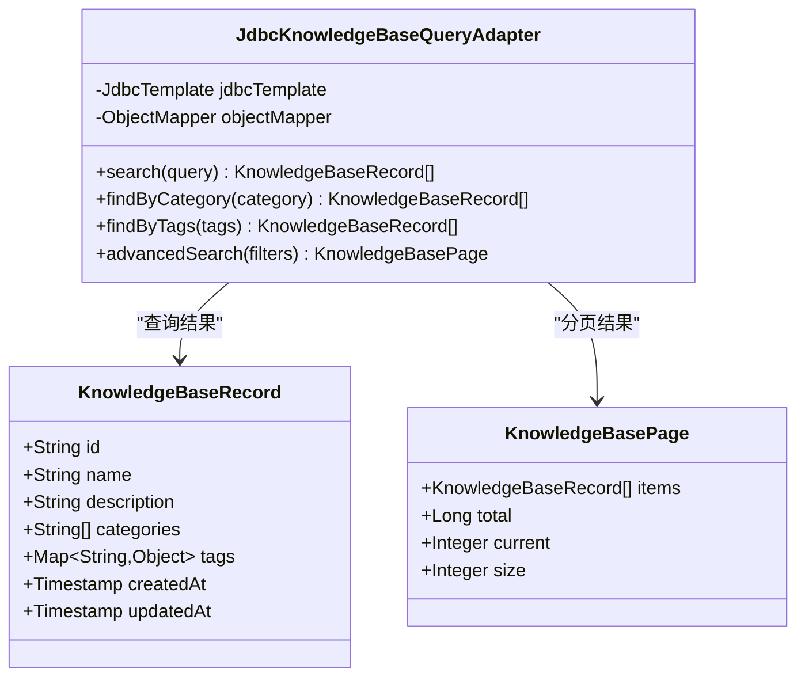

**图表来源**
- [JdbcKnowledgeBaseQueryAdapter.java:1-100](file://seahorse-agent-adapter-repository-jdbc/src/main/java/com/miracle/ai/seahorse/agent/adapters/repository/jdbc/JdbcKnowledgeBaseQueryAdapter.java#L1-L100)

#### 查询优化策略

1. **索引利用**：针对常用查询字段建立数据库索引
2. **SQL优化**：使用参数化查询防止SQL注入攻击
3. **结果缓存**：对频繁查询的结果进行缓存
4. **分页处理**：避免一次性加载大量数据

**章节来源**
- [JdbcKnowledgeBaseQueryAdapter.java:1-150](file://seahorse-agent-adapter-repository-jdbc/src/main/java/com/miracle/ai/seahorse/agent/adapters/repository/jdbc/JdbcKnowledgeBaseQueryAdapter.java#L1-L150)

## 依赖关系分析

JDBC仓库适配器的依赖关系体现了清晰的层次结构和关注点分离。经过更新后，依赖关系更加完善，支持新增的专业功能模块：

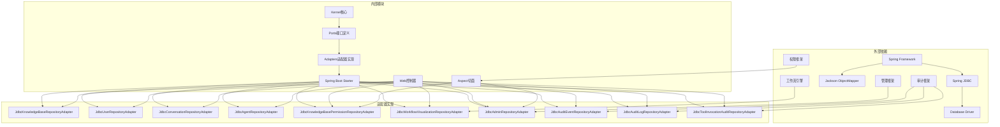

**图表来源**
- [SeahorseAgentRetrievalRepositoryAutoConfiguration.java:49-62](file://seahorse-agent-spring-boot-starter/src/main/java/com/miracle/ai/seahorse/agent/adapters/spring/SeahorseAgentRetrievalRepositoryAutoConfiguration.java#L49-L62)

### 核心依赖关系

1. **Spring集成**：完全依赖Spring框架提供的IoC容器和事务管理
2. **数据库抽象**：通过DataSource接口实现数据库无关性
3. **序列化支持**：使用ObjectMapper处理JSON数据的序列化和反序列化
4. **权限集成**：与权限控制框架深度集成，支持细粒度权限管理
5. **审计集成**：与审计框架集成，提供完整的审计功能
6. **管理集成**：支持管理员权限和租户管理功能
7. **工作流集成**：支持工作流事件的可视化和管理
8. **测试支持**：提供完整的单元测试和集成测试覆盖

**章节来源**
- [SeahorseAgentRetrievalRepositoryAutoConfiguration.java:49-62](file://seahorse-agent-spring-boot-starter/src/main/java/com/miracle/ai/seahorse/agent/adapters/spring/SeahorseAgentRetrievalRepositoryAutoConfiguration.java#L49-L62)

## 性能考虑

JDBC仓库适配器在设计时充分考虑了性能优化，采用了多种策略来提升系统响应速度和吞吐量。经过更新后，性能优化策略进一步完善：

### 性能优化策略

1. **批量操作优化**
   - 使用JdbcTemplate.batchUpdate进行批量插入和更新
   - 合理设置批处理大小以平衡内存使用和性能
   - 通过事务批量提交减少数据库往返次数

2. **连接池管理**
   - 利用Spring的DataSource连接池自动管理
   - 配置合适的连接池大小和超时参数
   - 实现连接复用避免频繁创建销毁开销

3. **查询性能优化**
   - 为高频查询字段建立数据库索引
   - 使用参数化查询防止SQL注入同时提升缓存效果
   - 实现分页查询避免全表扫描

4. **缓存策略**
   - 对热点数据实施二级缓存
   - 使用Redis或本地缓存存储查询结果
   - 配置合理的缓存失效策略

5. **权限查询优化**
   - 为权限表建立复合索引
   - 实现权限缓存减少数据库查询
   - 支持批量权限检查优化

6. **审计数据优化**
   - 审计表分区存储历史数据
   - 实现审计数据归档机制
   - 支持审计查询的索引优化

### 性能监控指标

| 指标类型 | 目标值 | 监控方法 |
|---------|--------|----------|
| 查询响应时间 | < 100ms | 数据库慢查询日志 |
| 连接池利用率 | < 80% | 连接池监控指标 |
| 批处理吞吐量 | > 1000条/秒 | 批处理性能测试 |
| 缓存命中率 | > 90% | 缓存统计信息 |
| 权限检查延迟 | < 50ms | 权限系统监控 |
| 审计写入延迟 | < 10ms | 审计系统监控 |

**章节来源**
- [JdbcKnowledgeDocumentRepositoryAdapter_optimized.java:1-200](file://docs/performance/JdbcKnowledgeDocumentRepositoryAdapter_optimized.java#L1-L200)

## 故障排除指南

### 常见问题及解决方案

#### 1. 数据库连接问题

**症状**：操作超时或连接失败
**原因分析**：
- 数据库连接池耗尽
- 网络连接不稳定
- 数据库服务器过载

**解决步骤**：
1. 检查连接池配置参数
2. 监控数据库连接数使用情况
3. 验证网络连通性
4. 查看数据库服务器状态

#### 2. 事务冲突问题

**症状**：并发操作时出现死锁或超时
**原因分析**：
- 长事务持有锁时间过长
- 锁竞争激烈
- SQL执行时间过长

**解决步骤**：
1. 优化长事务逻辑
2. 减少事务范围
3. 重排SQL执行顺序
4. 调整数据库隔离级别

#### 3. 内存溢出问题

**症状**：系统内存不足导致崩溃
**原因分析**：
- 大批量数据处理
- 对象缓存过多
- 泄漏的数据库连接

**解决步骤**：
1. 实施分页处理大数据集
2. 优化缓存策略
3. 及时释放数据库连接
4. 监控内存使用情况

#### 4. 查询性能问题

**症状**：查询响应时间过长
**原因分析**：
- 缺少必要的数据库索引
- SQL查询语句效率低下
- 数据库统计信息过期

**解决步骤**：
1. 分析慢查询日志
2. 添加适当的数据库索引
3. 优化SQL查询语句
4. 更新数据库统计信息

#### 5. 权限管理问题

**症状**：用户权限异常或权限检查失败
**原因分析**：
- 权限缓存不一致
- 权限数据同步延迟
- 权限规则配置错误

**解决步骤**：
1. 清理权限缓存
2. 检查权限数据同步状态
3. 验证权限规则配置
4. 重新加载权限系统

#### 6. 审计日志问题

**症状**：审计事件丢失或审计日志异常
**原因分析**：
- 审计表空间不足
- 审计数据写入失败
- 审计配置错误

**解决步骤**：
1. 检查磁盘空间和数据库容量
2. 验证审计数据写入状态
3. 检查审计配置参数
4. 清理过期审计数据

**章节来源**
- [JdbcKnowledgeBaseRepositoryAdapterTests.java:48-120](file://seahorse-agent-adapter-repository-jdbc/src/test/java/com/miracle/ai/seahorse/agent/adapters/repository/jdbc/JdbcKnowledgeBaseRepositoryAdapterTests.java#L48-L120)
- [JdbcUserRepositoryAdapterTests.java:48-100](file://seahorse-agent-adapter-repository-jdbc/src/test/java/com/miracle/ai/seahorse/agent/adapters/repository/jdbc/JdbcUserRepositoryAdapterTests.java#L48-L100)

## 结论

JDBC仓库适配器作为SeaHorse Agent项目的核心数据持久化组件，展现了优秀的架构设计和实现质量。经过更新后，该适配器通过新增的六个专业适配器，进一步增强了系统的功能完整性和企业级服务能力。

### 主要优势

1. **标准化接口设计**：所有适配器实现统一的端口接口，便于替换和扩展
2. **事务一致性保障**：通过JDBC连接确保单个操作的原子性和一致性
3. **性能优化完善**：采用批量操作、连接池管理和查询优化等多重策略
4. **可维护性强**：清晰的代码结构和完整的测试覆盖
5. **企业级功能完备**：新增权限控制、审计日志、工作流可视化等功能
6. **可扩展性良好**：模块化设计便于添加新的适配器和功能

### 技术特色

1. **Repository模式实现**：提供了清晰的数据访问抽象层
2. **Spring框架深度集成**：充分利用Spring生态系统的便利性
3. **权限控制集成**：支持细粒度的权限管理和访问控制
4. **审计系统集成**：提供完整的审计事件记录和查询功能
5. **工作流可视化支持**：支持工作流事件的持久化和可视化管理
6. **管理员功能集成**：提供超级管理员和租户管理能力

### 应用价值

该JDBC仓库适配器为SeaHorse Agent提供了稳定可靠的数据持久化能力，支持知识库、会话、用户和内存管理等核心业务场景。新增的权限控制、审计日志、工作流可视化、管理员查询等功能，进一步提升了系统的安全性和可管理性。

通过持续的优化和维护，该适配器将继续为SeaHorse Agent生态系统提供高质量的数据管理服务，支撑更多复杂的业务场景和更高的性能要求。新增的专业适配器为企业的合规性要求、安全管理需求和运营监控提供了强有力的技术支撑。