# Web控制器

<cite>
**本文档引用的文件**
- [SeahorseAuthController.java](file://seahorse-agent-adapter-web/src/main/java/com/miracle/ai/seahorse/agent/adapters/web/SeahorseAuthController.java)
- [SeahorseChatController.java](file://seahorse-agent-adapter-web/src/main/java/com/miracle/ai/seahorse/agent/adapters/web/SeahorseChatController.java)
- [ApiResponse.java](file://seahorse-agent-adapter-web/src/main/java/com/miracle/ai/seahorse/agent/adapters/web/ApiResponse.java)
- [ApiResponses.java](file://seahorse-agent-adapter-web/src/main/java/com/miracle/ai/seahorse/agent/adapters/web/ApiResponses.java)
- [RateLimitFilter.java](file://seahorse-agent-adapter-web/src/main/java/com/miracle/ai/seahorse/agent/adapters/web/RateLimitFilter.java)
- [AdvancedFeatureGate.java](file://seahorse-agent-adapter-web/src/main/java/com/miracle/ai/seahorse/agent/adapters/web/AdvancedFeatureGate.java)
- [AdvancedFeatureDisabledException.java](file://seahorse-agent-adapter-web/src/main/java/com/miracle/ai/seahorse/agent/adapters/web/AdvancedFeatureDisabledException.java)
- [SaTokenCurrentUserAdapter.java](file://seahorse-agent-adapter-web/src/main/java/com/miracle/ai/seahorse/agent/adapters/web/SaTokenCurrentUserAdapter.java)
- [SaTokenServiceAdapter.java](file://seahorse-agent-adapter-web/src/main/java/com/miracle/ai/seahorse/agent/adapters/web/SaTokenServiceAdapter.java)
- [ResearchSseBridge.java](file://seahorse-agent-adapter-web/src/main/java/com/miracle/ai/seahorse/agent/adapters/web/ResearchSseBridge.java)
- [SeahorseAgentDefinitionController.java](file://seahorse-agent-adapter-web/src/main/java/com/miracle/ai/seahorse/agent/adapters/web/SeahorseAgentDefinitionController.java)
- [SeahorseAgentRunController.java](file://seahorse-agent-adapter-web/src/main/java/com/miracle/ai/seahorse/agent/adapters/web/SeahorseAgentRunController.java)
- [SeahorseAgentArtifactController.java](file://seahorse-agent-adapter-web/src/main/java/com/miracle/ai/seahorse/agent/adapters/web/SeahorseAgentArtifactController.java)
- [SeahorseKnowledgeBaseController.java](file://seahorse-agent-adapter-web/src/main/java/com/miracle/ai/seahorse/agent/adapters/web/SeahorseKnowledgeBaseController.java)
- [SeahorseKnowledgeBaseShareController.java](file://seahorse-agent-adapter-web/src/main/java/com/miracle/ai/seahorse/agent/adapters/web/SeahorseKnowledgeBaseShareController.java)
- [SeahorseContextPackController.java](file://seahorse-agent-adapter-web/src/main/java/com/miracle/ai/seahorse/agent/adapters/web/SeahorseContextPackController.java)
- [SeahorseAdminUserController.java](file://seahorse-agent-adapter-web/src/main/java/com/miracle/ai/seahorse/agent/adapters/web/SeahorseAdminUserController.java)
- [SeahorseAdminTenantController.java](file://seahorse-agent-adapter-web/src/main/java/com/miracle/ai/seahorse/agent/adapters/web/SeahorseAdminTenantController.java)
- [SeahorseAuditEventController.java](file://seahorse-agent-adapter-web/src/main/java/com/miracle/ai/seahorse/agent/adapters/web/SeahorseAuditEventController.java)
- [SeahorseAuditLogController.java](file://seahorse-agent-adapter-web/src/main/java/com/miracle/ai/seahorse/agent/adapters/web/SeahorseAuditLogController.java)
- [SeahorseApprovalController.java](file://seahorse-agent-adapter-web/src/main/java/com/miracle/ai/seahorse/agent/adapters/web/SeahorseApprovalController.java)
- [SeahorseBillingController.java](file://seahorse-agent-adapter-web/src/main/java/com/miracle/ai/seahorse/agent/adapters/web/SeahorseBillingController.java)
- [SeahorseConversationAttachmentController.java](file://seahorse-agent-adapter-web/src/main/java/com/miracle/ai/seahorse/agent/adapters/web/SeahorseConversationAttachmentController.java)
- [SeahorseAccessDecisionController.java](file://seahorse-agent-adapter-web/src/main/java/com/miracle/ai/seahorse/agent/adapters/web/SeahorseAccessDecisionController.java)
- [SeahorseAgentToolBindingController.java](file://seahorse-agent-adapter-web/src/main/java/com/miracle/ai/seahorse/agent/adapters/web/SeahorseAgentToolBindingController.java)
- [SeahorseAgentFactoryController.java](file://seahorse-agent-adapter-web/src/main/java/com/miracle/ai/seahorse/agent/adapters/web/SeahorseAgentFactoryController.java)
- [SeahorseAgentHandoffController.java](file://seahorse-agent-adapter-web/src/main/java/com/miracle/ai/seahorse/agent/adapters/web/SeahorseAgentHandoffController.java)
- [SeahorseAgentRolloutController.java](file://seahorse-agent-adapter-web/src/main/java/com/miracle/ai/seahorse/agent/adapters/web/SeahorseAgentRolloutController.java)
- [SeahorseAgentEvalController.java](file://seahorse-agent-adapter-web/src/main/java/com/miracle/ai/seahorse/agent/adapters/web/SeahorseAgentEvalController.java)
- [SeahorseAiModelConfigController.java](file://seahorse-agent-adapter-web/src/main/java/com/miracle/ai/seahorse/agent/adapters/web/SeahorseAiModelConfigController.java)
</cite>

## 更新摘要
**所做更改**
- 新增知识库分享控制器章节，详细介绍知识库分享功能的实现
- 更新项目结构图，包含新增的知识库分享控制器
- 扩展知识库管理功能分析，涵盖分享功能的详细说明
- 更新依赖关系分析，反映新增控制器的依赖关系

## 目录
1. [简介](#简介)
2. [项目结构](#项目结构)
3. [核心组件](#核心组件)
4. [架构概览](#架构概览)
5. [详细组件分析](#详细组件分析)
6. [依赖关系分析](#依赖关系分析)
7. [性能考虑](#性能考虑)
8. [故障排除指南](#故障排除指南)
9. [结论](#结论)

## 简介

Web控制器是Seahorse Agent系统的核心接口层，负责处理来自前端应用的各种HTTP请求。该系统采用Spring Boot框架构建，实现了完整的AI Agent管理、对话处理、知识库管理和用户权限控制等功能。

系统通过RESTful API提供统一的接口标准，支持实时流式响应、高级功能门控、速率限制等现代化Web特性。所有控制器都遵循统一的响应格式和错误处理机制，确保了系统的稳定性和一致性。

**更新** 新增了知识库分享控制器，增强了知识库的共享和访问功能，支持密码保护、访问次数限制和过期时间控制等高级特性。

## 项目结构

Web控制器模块位于`seahorse-agent-adapter-web`目录下，采用按功能域分组的组织方式：

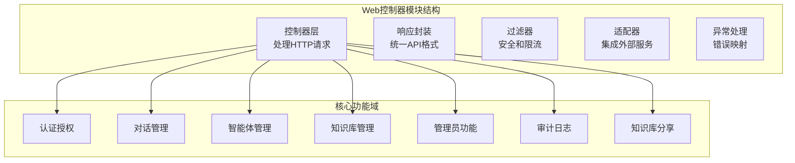

**图表来源**
- [SeahorseAuthController.java:1-200](file://seahorse-agent-adapter-web/src/main/java/com/miracle/ai/seahorse/agent/adapters/web/SeahorseAuthController.java#L1-L200)
- [SeahorseChatController.java:1-200](file://seahorse-agent-adapter-web/src/main/java/com/miracle/ai/seahorse/agent/adapters/web/SeahorseChatController.java#L1-L200)
- [SeahorseKnowledgeBaseShareController.java:1-104](file://seahorse-agent-adapter-web/src/main/java/com/miracle/ai/seahorse/agent/adapters/web/SeahorseKnowledgeBaseShareController.java#L1-L104)

**章节来源**
- [ApiResponse.java:1-150](file://seahorse-agent-adapter-web/src/main/java/com/miracle/ai/seahorse/agent/adapters/web/ApiResponse.java#L1-L150)
- [ApiResponses.java:1-200](file://seahorse-agent-adapter-web/src/main/java/com/miracle/ai/seahorse/agent/adapters/web/ApiResponses.java#L1-L200)

## 核心组件

### 统一响应格式

系统实现了标准化的API响应格式，确保所有接口返回一致的数据结构：

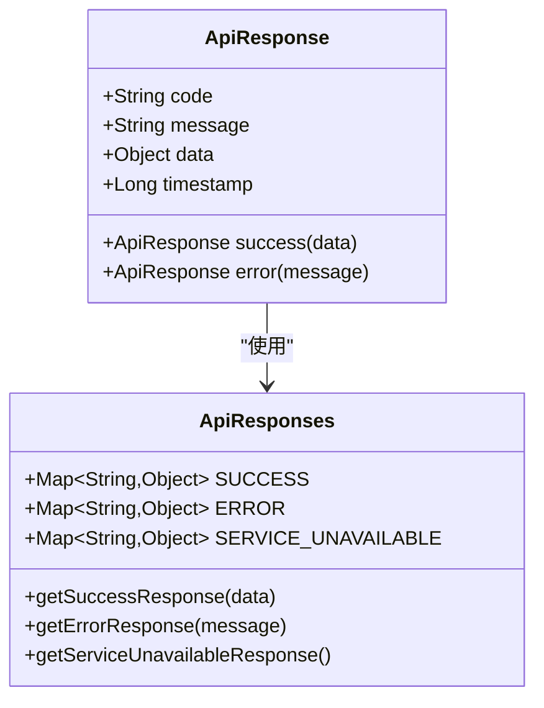

**图表来源**
- [ApiResponse.java:1-150](file://seahorse-agent-adapter-web/src/main/java/com/miracle/ai/seahorse/agent/adapters/web/ApiResponse.java#L1-L150)
- [ApiResponses.java:1-200](file://seahorse-agent-adapter-web/src/main/java/com/miracle/ai/seahorse/agent/adapters/web/ApiResponses.java#L1-L200)

### 安全认证体系

系统采用多层安全防护机制，包括基于SaToken的会话管理和自定义权限控制：

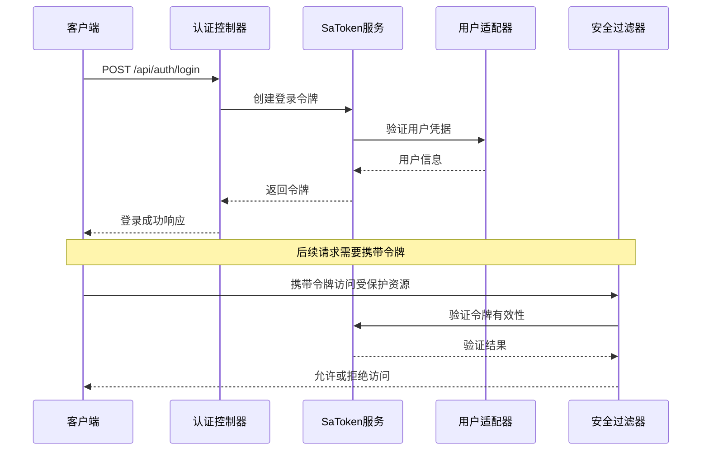

**图表来源**
- [SeahorseAuthController.java:1-200](file://seahorse-agent-adapter-web/src/main/java/com/miracle/ai/seahorse/agent/adapters/web/SeahorseAuthController.java#L1-L200)
- [SaTokenServiceAdapter.java:1-150](file://seahorse-agent-adapter-web/src/main/java/com/miracle/ai/seahorse/agent/adapters/web/SaTokenServiceAdapter.java#L1-L150)
- [SaTokenCurrentUserAdapter.java:1-150](file://seahorse-agent-adapter-web/src/main/java/com/miracle/ai/seahorse/agent/adapters/web/SaTokenCurrentUserAdapter.java#L1-L150)

**章节来源**
- [SeahorseAuthController.java:1-200](file://seahorse-agent-adapter-web/src/main/java/com/miracle/ai/seahorse/agent/adapters/web/SeahorseAuthController.java#L1-L200)
- [SaTokenServiceAdapter.java:1-150](file://seahorse-agent-adapter-web/src/main/java/com/miracle/ai/seahorse/agent/adapters/web/SaTokenServiceAdapter.java#L1-L150)
- [SaTokenCurrentUserAdapter.java:1-150](file://seahorse-agent-adapter-web/src/main/java/com/miracle/ai/seahorse/agent/adapters/web/SaTokenCurrentUserAdapter.java#L1-L150)

## 架构概览

系统采用分层架构设计，Web控制器作为入口层，向上提供RESTful API，向下调用业务服务层：

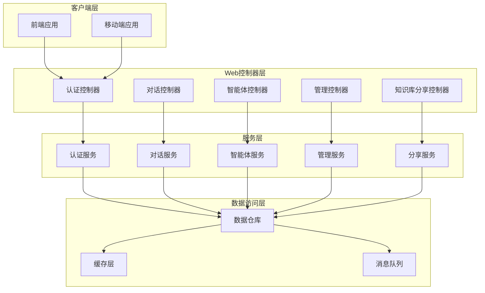

**图表来源**
- [SeahorseAuthController.java:1-200](file://seahorse-agent-adapter-web/src/main/java/com/miracle/ai/seahorse/agent/adapters/web/SeahorseAuthController.java#L1-L200)
- [SeahorseChatController.java:1-200](file://seahorse-agent-adapter-web/src/main/java/com/miracle/ai/seahorse/agent/adapters/web/SeahorseChatController.java#L1-L200)
- [SeahorseAgentDefinitionController.java:1-200](file://seahorse-agent-adapter-web/src/main/java/com/miracle/ai/seahorse/agent/adapters/web/SeahorseAgentDefinitionController.java#L1-L200)
- [SeahorseKnowledgeBaseShareController.java:1-104](file://seahorse-agent-adapter-web/src/main/java/com/miracle/ai/seahorse/agent/adapters/web/SeahorseKnowledgeBaseShareController.java#L1-L104)

## 详细组件分析

### 认证控制器分析

认证控制器负责用户身份验证和会话管理，实现了完整的登录、登出和令牌刷新功能：

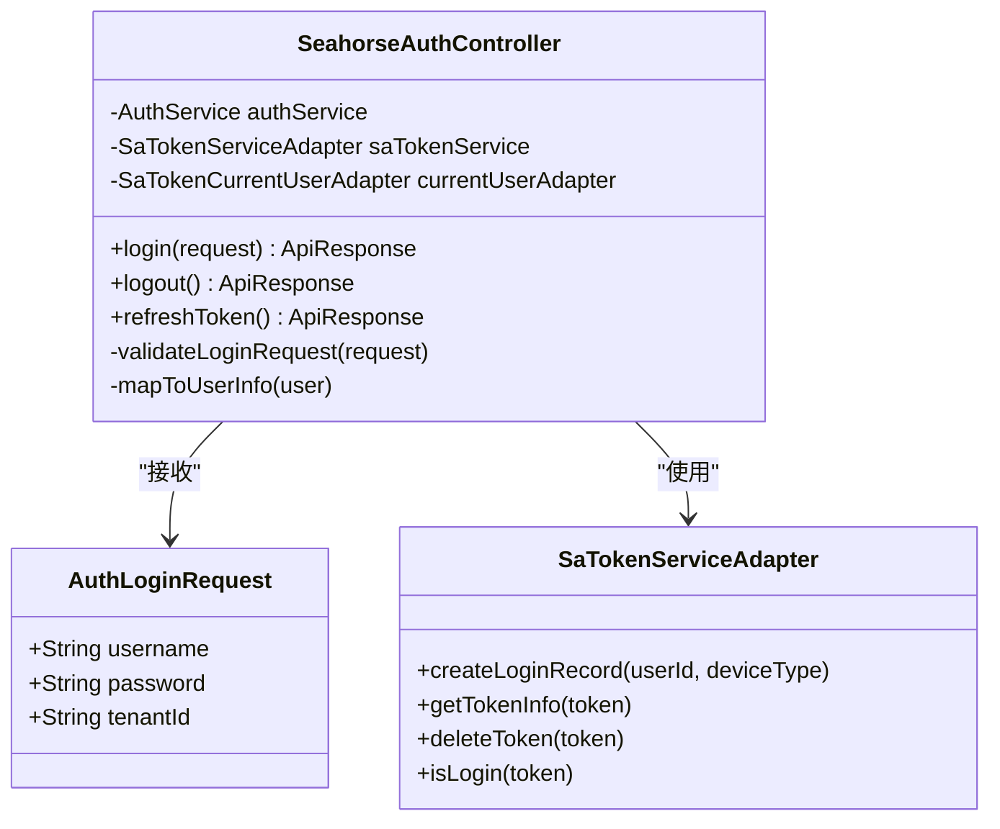

**图表来源**
- [SeahorseAuthController.java:1-200](file://seahorse-agent-adapter-web/src/main/java/com/miracle/ai/seahorse/agent/adapters/web/SeahorseAuthController.java#L1-L200)

### 对话控制器分析

对话控制器处理AI对话相关的所有操作，支持实时流式响应和历史记录管理：

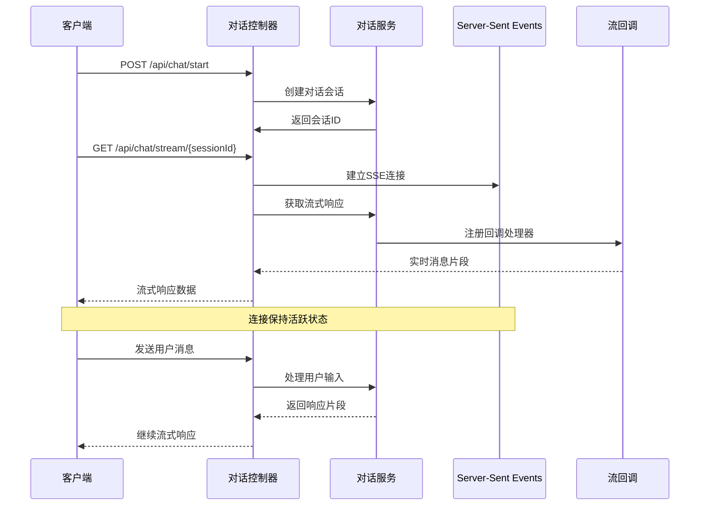

**图表来源**
- [SeahorseChatController.java:1-200](file://seahorse-agent-adapter-web/src/main/java/com/miracle/ai/seahorse/agent/adapters/web/SeahorseChatController.java#L1-L200)
- [ResearchSseBridge.java:1-150](file://seahorse-agent-adapter-web/src/main/java/com/miracle/ai/seahorse/agent/adapters/web/ResearchSseBridge.java#L1-L150)

### 智能体管理控制器分析

智能体管理控制器提供了完整的智能体生命周期管理功能：

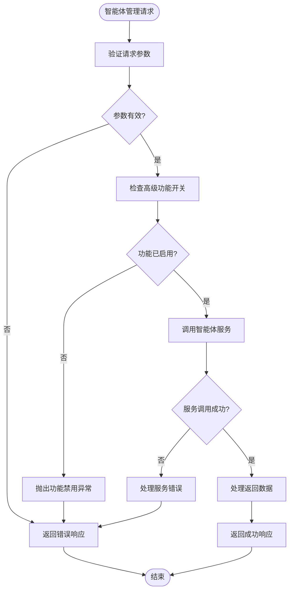

**图表来源**
- [AdvancedFeatureGate.java:1-150](file://seahorse-agent-adapter-web/src/main/java/com/miracle/ai/seahorse/agent/adapters/web/AdvancedFeatureGate.java#L1-L150)
- [AdvancedFeatureDisabledException.java:1-100](file://seahorse-agent-adapter-web/src/main/java/com/miracle/ai/seahorse/agent/adapters/web/AdvancedFeatureDisabledException.java#L1-L100)

**章节来源**
- [SeahorseAgentDefinitionController.java:1-200](file://seahorse-agent-adapter-web/src/main/java/com/miracle/ai/seahorse/agent/adapters/web/SeahorseAgentDefinitionController.java#L1-L200)
- [SeahorseAgentRunController.java:1-200](file://seahorse-agent-adapter-web/src/main/java/com/miracle/ai/seahorse/agent/adapters/web/SeahorseAgentRunController.java#L1-L200)
- [SeahorseAgentArtifactController.java:1-200](file://seahorse-agent-adapter-web/src/main/java/com/miracle/ai/seahorse/agent/adapters/web/SeahorseAgentArtifactController.java#L1-L200)

### 知识库管理控制器分析

知识库管理控制器提供了完整的知识库操作功能，包括创建、更新、删除和查询：

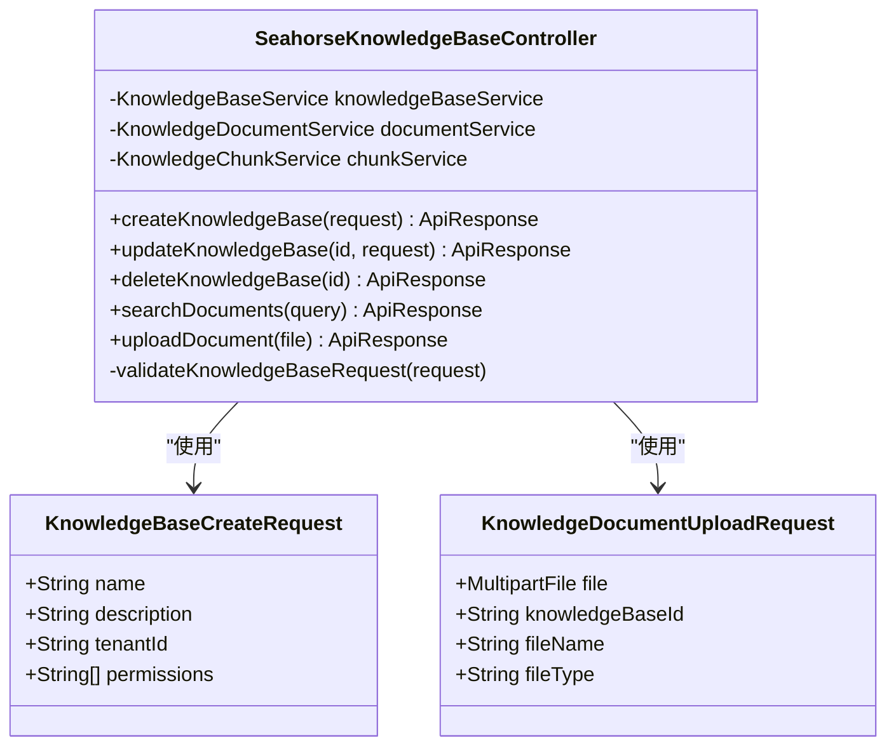

**图表来源**
- [SeahorseKnowledgeBaseController.java:1-200](file://seahorse-agent-adapter-web/src/main/java/com/miracle/ai/seahorse/agent/adapters/web/SeahorseKnowledgeBaseController.java#L1-L200)

### 知识库分享控制器分析

**新增** 知识库分享控制器提供了知识库的分享和访问管理功能，支持安全的外部访问控制：

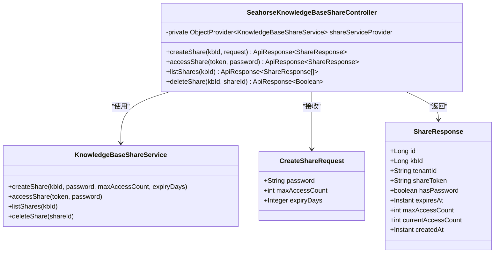

**图表来源**
- [SeahorseKnowledgeBaseShareController.java:1-104](file://seahorse-agent-adapter-web/src/main/java/com/miracle/ai/seahorse/agent/adapters/web/SeahorseKnowledgeBaseShareController.java#L1-L104)

知识库分享控制器的主要功能包括：

1. **分享创建**：支持为知识库创建分享链接，设置访问密码、最大访问次数和过期时间
2. **分享访问**：提供安全的分享访问接口，支持密码验证和访问计数控制
3. **分享列表**：查询特定知识库的所有分享记录
4. **分享管理**：支持删除分享和管理分享状态

**章节来源**
- [SeahorseKnowledgeBaseShareController.java:1-104](file://seahorse-agent-adapter-web/src/main/java/com/miracle/ai/seahorse/agent/adapters/web/SeahorseKnowledgeBaseShareController.java#L1-L104)

### 管理员功能控制器分析

管理员功能控制器提供了系统管理相关的操作，包括用户管理、租户管理和系统监控：

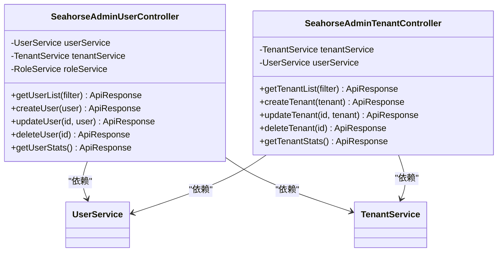

**图表来源**
- [SeahorseAdminUserController.java:1-200](file://seahorse-agent-adapter-web/src/main/java/com/miracle/ai/seahorse/agent/adapters/web/SeahorseAdminUserController.java#L1-L200)
- [SeahorseAdminTenantController.java:1-200](file://seahorse-agent-adapter-web/src/main/java/com/miracle/ai/seahorse/agent/adapters/web/SeahorseAdminTenantController.java#L1-L200)

## 依赖关系分析

Web控制器模块与其他模块之间的依赖关系如下：

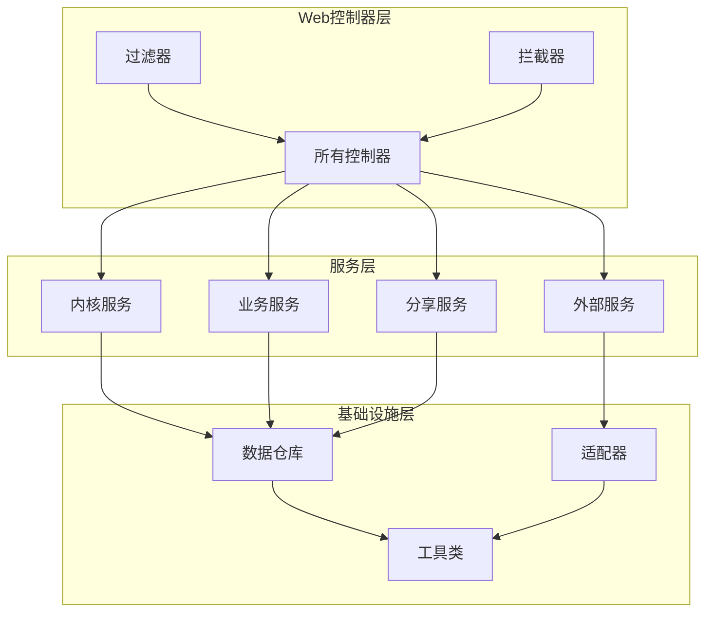

**图表来源**
- [ApiResponse.java:1-150](file://seahorse-agent-adapter-web/src/main/java/com/miracle/ai/seahorse/agent/adapters/web/ApiResponse.java#L1-L150)
- [ApiResponses.java:1-200](file://seahorse-agent-adapter-web/src/main/java/com/miracle/ai/seahorse/agent/adapters/web/ApiResponses.java#L1-L200)

**章节来源**
- [RateLimitFilter.java:1-150](file://seahorse-agent-adapter-web/src/main/java/com/miracle/ai/seahorse/agent/adapters/web/RateLimitFilter.java#L1-L150)
- [AdvancedFeatureGate.java:1-150](file://seahorse-agent-adapter-web/src/main/java/com/miracle/ai/seahorse/agent/adapters/web/AdvancedFeatureGate.java#L1-L150)

## 性能考虑

### 速率限制机制

系统实现了多层次的速率限制机制，防止API滥用和系统过载：

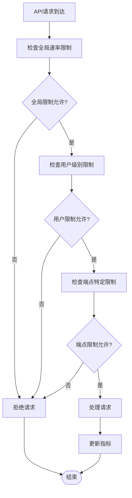

**图表来源**
- [RateLimitFilter.java:1-150](file://seahorse-agent-adapter-web/src/main/java/com/miracle/ai/seahorse/agent/adapters/web/RateLimitFilter.java#L1-L150)

### 流式响应优化

对于需要长时间运行的请求，系统采用了Server-Sent Events(SSE)实现实时流式响应：

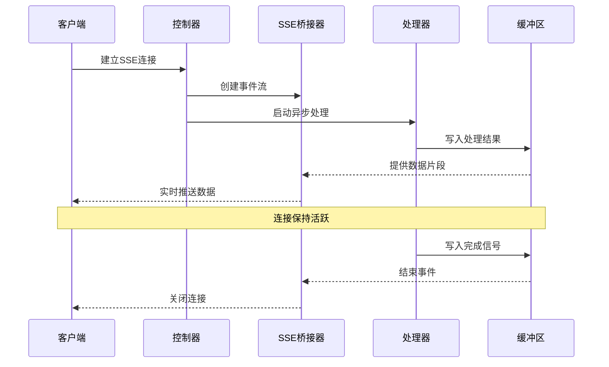

**图表来源**
- [ResearchSseBridge.java:1-150](file://seahorse-agent-adapter-web/src/main/java/com/miracle/ai/seahorse/agent/adapters/web/ResearchSseBridge.java#L1-L150)

## 故障排除指南

### 常见问题诊断

系统提供了完善的异常处理和错误映射机制：

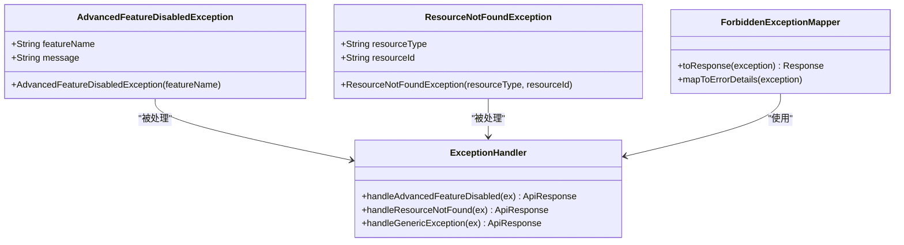

**图表来源**
- [AdvancedFeatureDisabledException.java:1-100](file://seahorse-agent-adapter-web/src/main/java/com/miracle/ai/seahorse/agent/adapters/web/AdvancedFeatureDisabledException.java#L1-L100)
- [ResourceNotFoundException.java:1-100](file://seahorse-agent-adapter-web/src/main/java/com/miracle/ai/seahorse/agent/adapters/web/ResourceNotFoundException.java#L1-L100)
- [ForbiddenExceptionMapper.java:1-100](file://seahorse-agent-adapter-web/src/main/java/com/miracle/ai/seahorse/agent/adapters/web/ForbiddenExceptionMapper.java#L1-L100)

### 调试和监控

系统集成了全面的监控和调试功能：

| 功能 | 实现方式 | 监控指标 |
|------|----------|----------|
| 请求追踪 | MDC上下文跟踪 | 请求ID、用户ID、处理时间 |
| 性能监控 | Micrometer指标收集 | 响应时间、吞吐量、错误率 |
| 日志记录 | 结构化日志 | 请求详情、响应状态、异常信息 |
| 健康检查 | Actuator端点 | 服务状态、依赖健康度 |

**章节来源**
- [SeahorseAuditEventController.java:1-200](file://seahorse-agent-adapter-web/src/main/java/com/miracle/ai/seahorse/agent/adapters/web/SeahorseAuditEventController.java#L1-L200)
- [SeahorseAuditLogController.java:1-200](file://seahorse-agent-adapter-web/src/main/java/com/miracle/ai/seahorse/agent/adapters/web/SeahorseAuditLogController.java#L1-L200)

## 结论

Web控制器模块作为Seahorse Agent系统的核心接口层，展现了高度的模块化设计和工程实践。系统通过统一的响应格式、完善的安全机制、灵活的扩展架构和全面的监控能力，为上层应用提供了稳定可靠的API服务。

**更新** 新增的知识库分享控制器进一步增强了系统的功能完整性，提供了安全的知识库分享能力，支持密码保护、访问控制和生命周期管理等高级特性。

主要特点包括：

1. **标准化接口**：统一的API设计和响应格式，确保了系统的易用性和一致性
2. **安全可靠**：多层安全防护和权限控制，保障了系统的安全性
3. **高性能**：流式响应和速率限制机制，提升了系统的性能表现
4. **可扩展**：模块化的架构设计，便于功能扩展和维护
5. **可观测**：完整的监控和日志系统，便于问题诊断和性能优化
6. **功能丰富**：新增的知识库分享功能，增强了系统的实用性和用户体验

该模块为整个AI Agent平台提供了坚实的技术基础，支撑着从认证授权到智能体管理的完整业务流程，现在还包括了知识库分享这一重要的协作功能。