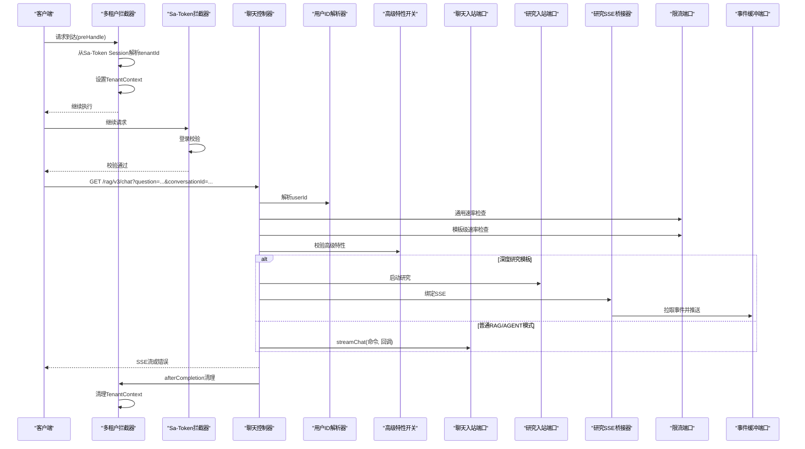
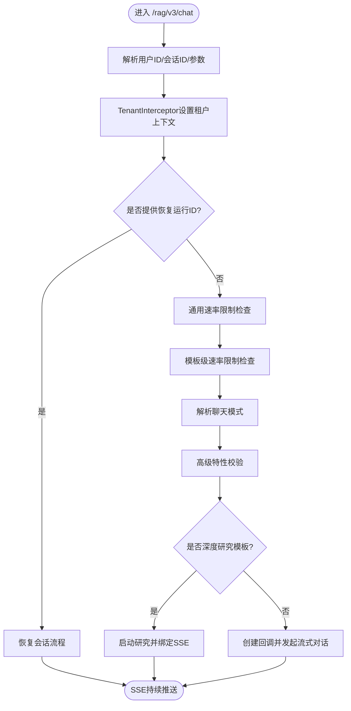

# Web适配器

<cite>
**本文引用的文件**   
- [SeahorseAuthController.java](file://seahorse-agent-adapter-web/src/main/java/com/miracle/ai/seahorse/agent/adapters/web/SeahorseAuthController.java)
- [SeahorseChatController.java](file://seahorse-agent-adapter-web/src/main/java/com/miracle/ai/seahorse/agent/adapters/web/SeahorseChatController.java)
- [SeahorseConversationController.java](file://seahorse-agent-adapter-web/src/main/java/com/miracle/ai/seahorse/agent/adapters/web/SeahorseConversationController.java)
- [SeahorseKnowledgeBaseController.java](file://seahorse-agent-adapter-web/src/main/java/com/miracle/ai/seahorse/agent/adapters/web/SeahorseKnowledgeBaseController.java)
- [AiModelConfigController.java](file://seahorse-agent-adapter-web/src/main/java/com/miracle/ai/seahorse/agent/adapters/web/AiModelConfigController.java)
- [WebUserIdResolver.java](file://seahorse-agent-adapter-web/src/main/java/com/miracle/ai/seahorse/agent/adapters/web/WebUserIdResolver.java)
- [AdvancedFeatureGate.java](file://seahorse-agent-adapter-web/src/main/java/com/miracle/ai/seahorse/agent/adapters/web/AdvancedFeatureGate.java)
- [ResearchSseBridge.java](file://seahorse-agent-adapter-web/src/main/java/com/miracle/ai/seahorse/agent/adapters/web/ResearchSseBridge.java)
- [ChatStreamCallbackFactoryPort.java](file://seahorse-agent-adapter-web/src/main/java/com/miracle/ai/seahorse/agent/adapters/web/ChatStreamCallbackFactoryPort.java)
- [AuthLoginRequest.java](file://seahorse-agent-adapter-web/src/main/java/com/miracle/ai/seahorse/agent/adapters/web/AuthLoginRequest.java)
- [ConversationUpdateRequest.java](file://seahorse-agent-adapter-web/src/main/java/com/miracle/ai/seahorse/agent/adapters/web/ConversationUpdateRequest.java)
- [KnowledgeBaseCreateRequest.java](file://seahorse-agent-adapter-web/src/main/java/com/miracle/ai/seahorse/agent/adapters/web/KnowledgeBaseCreateRequest.java)
- [KnowledgeBaseUpdateRequest.java](file://seahorse-agent-adapter-web/src/main/java/com/miracle/ai/seahorse/agent/adapters/web/KnowledgeBaseUpdateRequest.java)
- [AdvancedFeatureDisabledException.java](file://seahorse-agent-adapter-web/src/main/java/com/miracle/ai/seahorse/agent/adapters/web/AdvancedFeatureDisabledException.java)
- [ProductMode.java](file://seahorse-agent-adapter-web/src/main/java/com/miracle/ai/seahorse/agent/adapters/web/ProductMode.java)
- [AdvancedFeature.java](file://seahorse-agent-adapter-web/src/main/java/com/miracle/ai/seahorse/agent/adapters/web/AdvancedFeature.java)
- [RateLimiterPort.java](file://seahorse-agent-adapter-web/src/main/java/com/miracle/ai/seahorse/agent/ports/outbound/cache/RateLimiterPort.java)
- [AgentRunEventBufferPort.java](file://seahorse-agent-adapter-web/src/main/java/com/miracle/ai/seahorse/agent/ports/outbound/agent/AgentRunEventBufferPort.java)
- [StreamTaskPort.java](file://seahorse-agent-adapter-web/src/main/java/com/miracle/ai/seahorse/agent/ports/outbound/stream/StreamTaskPort.java)
- [AuthInboundPort.java](file://seahorse-agent-adapter-web/src/main/java/com/miracle/ai/seahorse/agent/ports/inbound/auth/AuthInboundPort.java)
- [ChatInboundPort.java](file://seahorse-agent-adapter-web/src/main/java/com/miracle/ai/seahorse/agent/ports/inbound/chat/ChatInboundPort.java)
- [ResearchInboundPort.java](file://seahorse-agent-adapter-web/src/main/java/com/miracle/ai/seahorse/agent/ports/inbound/agent/ResearchInboundPort.java)
- [ConversationManagementInboundPort.java](file://seahorse-agent-adapter-web/src/main/java/com/miracle/ai/seahorse/agent/ports/inbound/conversation/ConversationManagementInboundPort.java)
- [KnowledgeBaseInboundPort.java](file://seahorse-agent-adapter-web/src/main/java/com/miracle/ai/seahorse/agent/ports/inbound/knowledge/KnowledgeBaseInboundPort.java)
- [AiModelConfigRepositoryPort.java](file://seahorse-agent-adapter-web/src/main/java/com/miracle/ai/seahorse/agent/ports/outbound/config/AiModelConfigRepositoryPort.java)
- [SseEmitter.java](file://seahorse-agent-adapter-web/src/main/java/org/springframework/web/servlet/mvc/method/annotation/SseEmitter.java)
- [RateLimitDecision.java](file://seahorse-agent-adapter-web/src/main/java/com/miracle/ai/seahorse/agent/ports/outbound/cache/RateLimitDecision.java)
- [TaskTemplateId.java](file://seahorse-agent-adapter-web/src/main/java/com/miracle/ai/seahorse/agent/kernel/domain/agent/task/TaskTemplateId.java)
- [ChatMode.java](file://seahorse-agent-adapter-web/src/main/java/com/miracle/ai/seahorse/agent/kernel/domain/chat/ChatMode.java)
- [StreamCallback.java](file://seahorse-agent-adapter-web/src/main/java/com/miracle/ai/seahorse/agent/kernel/domain/chat/StreamCallback.java)
- [StreamEventEnvelope.java](file://seahorse-agent-adapter-web/src/main/java/com/miracle/ai/seahorse/agent/kernel/domain/stream/StreamEventEnvelope.java)
- [StreamEventType.java](file://seahorse-agent-adapter-web/src/main/java/com/miracle/ai/seahorse/agent/kernel/domain/stream/StreamEventType.java)
- [ResearchStartCommand.java](file://seahorse-agent-adapter-web/src/main/java/com/miracle/ai/seahorse/agent/ports/inbound/agent/ResearchStartCommand.java)
- [AgentRunSnapshotInboundPort.java](file://seahorse-agent-adapter-web/src/main/java/com/miracle/ai/seahorse/agent/ports/inbound/agent/AgentRunSnapshotInboundPort.java)
- [LoginCommand.java](file://seahorse-agent-adapter-web/src/main/java/com/miracle/ai/seahorse/agent/ports/inbound/auth/LoginCommand.java)
- [StpUtil.java](file://seahorse-agent-adapter-web/src/main/java/cn/dev33/satoken/stp/StpUtil.java)
- [TenantInterceptor.java](file://seahorse-agent-adapter-web/src/main/java/com/miracle/ai/seahorse/agent/adapters/web/TenantInterceptor.java)
- [SaTokenServiceAdapter.java](file://seahorse-agent-adapter-web/src/main/java/com/miracle/ai/seahorse/agent/adapters/web/SaTokenServiceAdapter.java)
- [SeahorseSecurityWebMvcConfiguration.java](file://seahorse-agent-adapter-web/src/main/java/com/miracle/ai/seahorse/agent/adapters/web/SeahorseSecurityWebMvcConfiguration.java)
- [SeahorseWebGovernanceConfiguration.java](file://seahorse-agent-adapter-web/src/main/java/com/miracle/ai/seahorse/agent/adapters/web/SeahorseWebGovernanceConfiguration.java)
</cite>

## 更新摘要
**所做更改**
- 新增多租户拦截器TenantInterceptor的详细说明
- 增强Sa-Token集成的安全配置文档
- 更新安全拦截器注册顺序和执行流程
- 添加租户上下文管理和会话治理的实现细节

## 目录
1. [引言](#引言)
2. [项目结构](#项目结构)
3. [核心组件](#核心组件)
4. [架构总览](#架构总览)
5. [详细组件分析](#详细组件分析)
6. [依赖关系分析](#依赖关系分析)
7. [性能考量](#性能考量)
8. [故障排查指南](#故障排查指南)
9. [结论](#结论)
10. [附录](#附录)

## 引言
本文件面向Web适配器的开发者与维护者，系统性梳理RESTful API控制器的设计与实现，覆盖认证、聊天、会话、知识库、AI模型配置等核心接口。文档同时阐述请求响应模型、参数校验、错误处理机制，以及本地适配器中的流式回调工厂、文档获取器、意图解析器等组件的职责与协作方式。最后给出安全配置、速率限制与异常处理的实现细节，并提供API使用示例与最佳实践。

**更新** 本次更新重点增强了多租户支持和Sa-Token集成的安全架构，包括TenantInterceptor的引入和租户上下文管理机制。

## 项目结构
Web适配器位于 seahorse-agent-adapter-web 模块中，采用"按功能域分层"的组织方式：控制器（REST API）位于 web 包下，配套有用户ID解析器、高级特性开关、研究任务SSE桥接器、流式回调工厂接口等支撑组件。控制器通过Spring MVC暴露HTTP端点，内部仅依赖"入站端口"和"出站端口"，不直接访问领域内核或持久化实现，保证了清晰的边界与可替换性。

**更新** 新增多租户拦截器TenantInterceptor和Sa-Token服务适配器，完善了安全认证和租户隔离机制。

```mermaid
graph TB
subgraph "Web适配器"
C1["认证控制器<br/>SeahorseAuthController"]
C2["聊天控制器<br/>SeahorseChatController"]
C3["会话控制器<br/>SeahorseConversationController"]
C4["知识库控制器<br/>SeahorseKnowledgeBaseController"]
C5["AI模型配置控制器<br/>AiModelConfigController"]
U["用户ID解析器<br/>WebUserIdResolver"]
F["高级特性开关<br/>AdvancedFeatureGate"]
R["研究SSE桥接器<br/>ResearchSseBridge"]
CB["流式回调工厂接口<br/>ChatStreamCallbackFactoryPort"]
TI["多租户拦截器<br/>TenantInterceptor"]
SA["Sa-Token服务适配器<br/>SaTokenServiceAdapter"]
end
subgraph "安全配置"
SEC["安全WebMvc配置<br/>SeahorseSecurityWebMvcConfiguration"]
WG["Web治理配置<br/>SeahorseWebGovernanceConfiguration"]
end
subgraph "端口接口"
P1["认证入站端口<br/>AuthInboundPort"]
P2["聊天入站端口<br/>ChatInboundPort"]
P3["研究入站端口<br/>ResearchInboundPort"]
P4["会话管理入站端口<br/>ConversationManagementInboundPort"]
P5["知识库入站端口<br/>KnowledgeBaseInboundPort"]
P6["AI模型配置仓储端口<br/>AiModelConfigRepositoryPort"]
P7["限流端口<br/>RateLimiterPort"]
P8["事件缓冲端口<br/>AgentRunEventBufferPort"]
P9["流任务端口<br/>StreamTaskPort"]
end
C1 --> P1
C2 --> P2
C2 --> P3
C2 --> CB
C2 --> P7
C2 --> P8
C2 --> P9
C3 --> P4
C4 --> P5
C5 --> P6
C1 --> SA
C2 --> TI
TI --> SEC
SEC --> WG
C2 --- U
C2 --- F
C2 --- R
```

**图表来源**
- [SeahorseAuthController.java:30-56](file://seahorse-agent-adapter-web/src/main/java/com/miracle/ai/seahorse/agent/adapters/web/SeahorseAuthController.java#L30-L56)
- [SeahorseChatController.java:57-176](file://seahorse-agent-adapter-web/src/main/java/com/miracle/ai/seahorse/agent/adapters/web/SeahorseChatController.java#L57-L176)
- [SeahorseConversationController.java:35-102](file://seahorse-agent-adapter-web/src/main/java/com/miracle/ai/seahorse/agent/adapters/web/SeahorseConversationController.java#L35-L102)
- [SeahorseKnowledgeBaseController.java:38-107](file://seahorse-agent-adapter-web/src/main/java/com/miracle/ai/seahorse/agent/adapters/web/SeahorseKnowledgeBaseController.java#L38-L107)
- [AiModelConfigController.java:32-159](file://seahorse-agent-adapter-web/src/main/java/com/miracle/ai/seahorse/agent/adapters/web/AiModelConfigController.java#L32-L159)
- [WebUserIdResolver.java:22-68](file://seahorse-agent-adapter-web/src/main/java/com/miracle/ai/seahorse/agent/adapters/web/WebUserIdResolver.java#L22-L68)
- [AdvancedFeatureGate.java:24-152](file://seahorse-agent-adapter-web/src/main/java/com/miracle/ai/seahorse/agent/adapters/web/AdvancedFeatureGate.java#L24-L152)
- [ResearchSseBridge.java:40-131](file://seahorse-agent-adapter-web/src/main/java/com/miracle/ai/seahorse/agent/adapters/web/ResearchSseBridge.java#L40-L131)
- [ChatStreamCallbackFactoryPort.java:23-33](file://seahorse-agent-adapter-web/src/main/java/com/miracle/ai/seahorse/agent/adapters/web/ChatStreamCallbackFactoryPort.java#L23-L33)
- [TenantInterceptor.java:34-70](file://seahorse-agent-adapter-web/src/main/java/com/miracle/ai/seahorse/agent/adapters/web/TenantInterceptor.java#L34-L70)
- [SaTokenServiceAdapter.java:24-41](file://seahorse-agent-adapter-web/src/main/java/com/miracle/ai/seahorse/agent/adapters/web/SaTokenServiceAdapter.java#L24-L41)
- [SeahorseSecurityWebMvcConfiguration.java:37-120](file://seahorse-agent-adapter-web/src/main/java/com/miracle/ai/seahorse/agent/adapters/web/SeahorseSecurityWebMvcConfiguration.java#L37-L120)
- [SeahorseWebGovernanceConfiguration.java:125-180](file://seahorse-agent-adapter-web/src/main/java/com/miracle/ai/seahorse/agent/adapters/web/SeahorseWebGovernanceConfiguration.java#L125-L180)

**章节来源**
- [SeahorseAuthController.java:30-56](file://seahorse-agent-adapter-web/src/main/java/com/miracle/ai/seahorse/agent/adapters/web/SeahorseAuthController.java#L30-L56)
- [SeahorseChatController.java:57-176](file://seahorse-agent-adapter-web/src/main/java/com/miracle/ai/seahorse/agent/adapters/web/SeahorseChatController.java#L57-L176)
- [SeahorseConversationController.java:35-102](file://seahorse-agent-adapter-web/src/main/java/com/miracle/ai/seahorse/agent/adapters/web/SeahorseConversationController.java#L35-L102)
- [SeahorseKnowledgeBaseController.java:38-107](file://seahorse-agent-adapter-web/src/main/java/com/miracle/ai/seahorse/agent/adapters/web/SeahorseKnowledgeBaseController.java#L38-L107)
- [AiModelConfigController.java:32-159](file://seahorse-agent-adapter-web/src/main/java/com/miracle/ai/seahorse/agent/adapters/web/AiModelConfigController.java#L32-L159)

## 核心组件
- 认证控制器：提供登录/登出接口，封装入站认证端口，返回统一响应结构。
- 聊天控制器：提供SSE流式对话接口，支持恢复会话、速率限制、模板级限流、模式选择与高级特性控制。
- 会话控制器：提供会话创建、列表、重命名、删除、消息查询等管理接口。
- 知识库控制器：提供知识库的增删改查与分页、切片策略查询等接口。
- AI模型配置控制器：提供管理员维度的模型配置查询、新增、修改、删除接口，内置登录鉴权与敏感字段脱敏。
- 用户ID解析器：统一解析userId来源（参数/请求头/登录态），并做长度截断与默认值处理。
- 高级特性开关：基于产品模式与特性枚举进行能力启用控制，未启用时抛出异常。
- 研究SSE桥接器：将研究运行事件缓冲区的数据以SSE形式稳定推送，含轮询、节流与完成/取消逻辑。
- 流式回调工厂接口：定义SSE流式回调的创建契约，便于注入不同实现。
- **多租户拦截器**：在请求进入时从Sa-Token Session解析tenantId并写入TenantContext，在请求结束时清理ThreadLocal，防止线程池复用导致跨租户数据泄漏。
- **Sa-Token服务适配器**：实现TokenServicePort接口，负责用户登录认证和会话管理，将tenantId存储在Sa-Token Session中供TenantInterceptor读取。

**更新** 新增多租户拦截器和Sa-Token服务适配器，完善了SaaS多租户架构支持。

**章节来源**
- [SeahorseAuthController.java:30-56](file://seahorse-agent-adapter-web/src/main/java/com/miracle/ai/seahorse/agent/adapters/web/SeahorseAuthController.java#L30-L56)
- [SeahorseChatController.java:57-176](file://seahorse-agent-adapter-web/src/main/java/com/miracle/ai/seahorse/agent/adapters/web/SeahorseChatController.java#L57-L176)
- [SeahorseConversationController.java:35-102](file://seahorse-agent-adapter-web/src/main/java/com/miracle/ai/seahorse/agent/adapters/web/SeahorseConversationController.java#L35-L102)
- [SeahorseKnowledgeBaseController.java:38-107](file://seahorse-agent-adapter-web/src/main/java/com/miracle/ai/seahorse/agent/adapters/web/SeahorseKnowledgeBaseController.java#L38-L107)
- [AiModelConfigController.java:32-159](file://seahorse-agent-adapter-web/src/main/java/com/miracle/ai/seahorse/agent/adapters/web/AiModelConfigController.java#L32-L159)
- [WebUserIdResolver.java:22-68](file://seahorse-agent-adapter-web/src/main/java/com/miracle/ai/seahorse/agent/adapters/web/WebUserIdResolver.java#L22-L68)
- [AdvancedFeatureGate.java:24-152](file://seahorse-agent-adapter-web/src/main/java/com/miracle/ai/seahorse/agent/adapters/web/AdvancedFeatureGate.java#L24-L152)
- [ResearchSseBridge.java:40-131](file://seahorse-agent-adapter-web/src/main/java/com/miracle/ai/seahorse/agent/adapters/web/ResearchSseBridge.java#L40-L131)
- [ChatStreamCallbackFactoryPort.java:23-33](file://seahorse-agent-adapter-web/src/main/java/com/miracle/ai/seahorse/agent/adapters/web/ChatStreamCallbackFactoryPort.java#L23-L33)
- [TenantInterceptor.java:34-70](file://seahorse-agent-adapter-web/src/main/java/com/miracle/ai/seahorse/agent/adapters/web/TenantInterceptor.java#L34-L70)
- [SaTokenServiceAdapter.java:24-41](file://seahorse-agent-adapter-web/src/main/java/com/miracle/ai/seahorse/agent/adapters/web/SaTokenServiceAdapter.java#L24-L41)

## 架构总览
Web适配器通过控制器作为入口，将HTTP请求转换为命令对象，调用对应的入站端口执行业务流程；在需要时与限流、事件缓冲、流任务等出站端口协作，最终以SSE或JSON响应返回。用户ID解析器与高级特性开关贯穿多个控制器，确保一致的鉴权与能力控制。

**更新** 新增多租户拦截器在Sa-Token拦截器之前执行，确保只有已认证的请求才能设置租户上下文，实现安全的多租户隔离。

**图表来源**
- [SeahorseChatController.java:178-228](file://seahorse-agent-adapter-web/src/main/java/com/miracle/ai/seahorse/agent/adapters/web/SeahorseChatController.java#L178-L228)
- [ResearchSseBridge.java:73-131](file://seahorse-agent-adapter-web/src/main/java/com/miracle/ai/seahorse/agent/adapters/web/ResearchSseBridge.java#L73-L131)
- [WebUserIdResolver.java:30-44](file://seahorse-agent-adapter-web/src/main/java/com/miracle/ai/seahorse/agent/adapters/web/WebUserIdResolver.java#L30-L44)
- [AdvancedFeatureGate.java:146-150](file://seahorse-agent-adapter-web/src/main/java/com/miracle/ai/seahorse/agent/adapters/web/AdvancedFeatureGate.java#L146-L150)
- [TenantInterceptor.java:38-53](file://seahorse-agent-adapter-web/src/main/java/com/miracle/ai/seahorse/agent/adapters/web/TenantInterceptor.java#L38-L53)
- [SaTokenServiceAdapter.java:28-40](file://seahorse-agent-adapter-web/src/main/java/com/miracle/ai/seahorse/agent/adapters/web/SaTokenServiceAdapter.java#L28-L40)
- [SeahorseSecurityWebMvcConfiguration.java:72-120](file://seahorse-agent-adapter-web/src/main/java/com/miracle/ai/seahorse/agent/adapters/web/SeahorseSecurityWebMvcConfiguration.java#L72-L120)

## 详细组件分析

### 认证控制器
- 功能要点
  - 登录：接收用户名/密码，调用认证入站端口，返回统一响应结构（code/data）。
  - 登出：调用认证入站端口执行登出，返回统一响应结构。
- 请求响应模型
  - 登录请求体：包含用户名与密码。
  - 统一响应：包含code与data字段；成功时code为"0"，失败时为其他值。
- 参数校验
  - 登录请求体不可为空。
- 错误处理
  - 入站端口抛出异常时，控制器捕获并返回标准错误响应。
- 安全配置
  - 依赖外部认证框架进行会话管理（如登录态校验）。

**更新** 登录流程通过SaTokenServiceAdapter实现，将tenantId存储在Sa-Token Session中，供TenantInterceptor读取。

**章节来源**
- [SeahorseAuthController.java:30-56](file://seahorse-agent-adapter-web/src/main/java/com/miracle/ai/seahorse/agent/adapters/web/SeahorseAuthController.java#L30-L56)
- [AuthLoginRequest.java](file://seahorse-agent-adapter-web/src/main/java/com/miracle/ai/seahorse/agent/adapters/web/AuthLoginRequest.java)
- [AuthInboundPort.java](file://seahorse-agent-adapter-web/src/main/java/com/miracle/ai/seahorse/agent/ports/inbound/auth/AuthInboundPort.java)
- [LoginCommand.java](file://seahorse-agent-adapter-web/src/main/java/com/miracle/ai/seahorse/agent/ports/inbound/auth/LoginCommand.java)
- [SaTokenServiceAdapter.java:28-35](file://seahorse-agent-adapter-web/src/main/java/com/miracle/ai/seahorse/agent/adapters/web/SaTokenServiceAdapter.java#L28-L35)

### 聊天控制器
- 功能要点
  - SSE流式对话：支持问题、会话ID、用户ID、是否深思、聊天模式、代理ID/版本ID、任务模板ID、附件ID列表、恢复运行ID与事件游标。
  - 恢复会话：根据运行ID与事件游标从事件缓冲中补发事件并继续订阅。
  - 速率限制：通用速率限制与高成本模板的每日限额。
  - 模式与特性控制：根据任务模板决定默认模式；AGENT模式受高级特性开关约束。
  - 研究任务：深度研究模板走独立启动与SSE桥接路径。
- 请求响应模型
  - GET /rag/v3/chat 返回SSE流，事件类型包括元数据、内容、结束等。
  - 停止任务：POST /rag/v3/stop，返回统一响应。
- 参数校验
  - 用户ID优先级：参数 > 请求头 > 登录态 > 默认值。
  - 任务模板ID需合法，否则按普通模式处理。
- 错误处理
  - 限流超限、端口未配置、研究管道未配置、运行快照缺失等场景均以SSE错误事件与DONE结束。
- 性能与可靠性
  - SSE超时时间可配置；事件缓冲用于断线重连；研究任务采用轮询+节流推送。

**更新** 租户上下文在TenantInterceptor中设置，确保聊天请求在正确的租户环境下执行。

**图表来源**
- [SeahorseChatController.java:178-331](file://seahorse-agent-adapter-web/src/main/java/com/miracle/ai/seahorse/agent/adapters/web/SeahorseChatController.java#L178-L331)
- [ResearchSseBridge.java:73-131](file://seahorse-agent-adapter-web/src/main/java/com/miracle/ai/seahorse/agent/adapters/web/ResearchSseBridge.java#L73-L131)
- [WebUserIdResolver.java:30-44](file://seahorse-agent-adapter-web/src/main/java/com/miracle/ai/seahorse/agent/adapters/web/WebUserIdResolver.java#L30-L44)
- [AdvancedFeatureGate.java:146-150](file://seahorse-agent-adapter-web/src/main/java/com/miracle/ai/seahorse/agent/adapters/web/AdvancedFeatureGate.java#L146-L150)
- [TenantInterceptor.java:38-53](file://seahorse-agent-adapter-web/src/main/java/com/miracle/ai/seahorse/agent/adapters/web/TenantInterceptor.java#L38-L53)

**章节来源**
- [SeahorseChatController.java:57-449](file://seahorse-agent-adapter-web/src/main/java/com/miracle/ai/seahorse/agent/adapters/web/SeahorseChatController.java#L57-L449)
- [ResearchSseBridge.java:40-308](file://seahorse-agent-adapter-web/src/main/java/com/miracle/ai/seahorse/agent/adapters/web/ResearchSseBridge.java#L40-L308)
- [WebUserIdResolver.java:22-68](file://seahorse-agent-adapter-web/src/main/java/com/miracle/ai/seahorse/agent/adapters/web/WebUserIdResolver.java#L22-L68)
- [AdvancedFeatureGate.java:24-152](file://seahorse-agent-adapter-web/src/main/java/com/miracle/ai/seahorse/agent/adapters/web/AdvancedFeatureGate.java#L24-L152)
- [ChatStreamCallbackFactoryPort.java:23-33](file://seahorse-agent-adapter-web/src/main/java/com/miracle/ai/seahorse/agent/adapters/web/ChatStreamCallbackFactoryPort.java#L23-L33)
- [TenantInterceptor.java:34-70](file://seahorse-agent-adapter-web/src/main/java/com/miracle/ai/seahorse/agent/adapters/web/TenantInterceptor.java#L34-L70)

### 会话控制器
- 功能要点
  - 创建会话：根据用户ID创建新会话。
  - 列表会话：列出指定用户的会话列表。
  - 重命名会话：更新会话标题。
  - 删除会话：删除指定会话。
  - 查询消息：列出会话下的消息。
- 请求响应模型
  - 统一响应：包含code与data字段。
- 参数校验
  - 用户ID解析遵循统一规则；重命名请求体不可为空。

**更新** 会话操作在TenantInterceptor设置的租户上下文中执行，确保用户只能访问自己租户内的会话数据。

**章节来源**
- [SeahorseConversationController.java:35-102](file://seahorse-agent-adapter-web/src/main/java/com/miracle/ai/seahorse/agent/adapters/web/SeahorseConversationController.java#L35-L102)
- [ConversationUpdateRequest.java](file://seahorse-agent-adapter-web/src/main/java/com/miracle/ai/seahorse/agent/adapters/web/ConversationUpdateRequest.java)
- [WebUserIdResolver.java:30-44](file://seahorse-agent-adapter-web/src/main/java/com/miracle/ai/seahorse/agent/adapters/web/WebUserIdResolver.java#L30-L44)
- [ConversationManagementInboundPort.java](file://seahorse-agent-adapter-web/src/main/java/com/miracle/ai/seahorse/agent/ports/inbound/conversation/ConversationManagementInboundPort.java)

### 知识库控制器
- 功能要点
  - 创建知识库：名称、嵌入模型、集合名与操作人。
  - 更新知识库：名称、嵌入模型与操作人。
  - 删除知识库：按ID删除。
  - 查询知识库：按ID查询详情。
  - 分页查询：支持名称过滤。
  - 切片策略：查询可用切片策略。
- 请求响应模型
  - 统一响应：包含code与data字段。
- 参数校验
  - 请求体不可为空；ID转换为长整型；操作人来自请求头或默认空字符串。

**更新** 知识库操作在TenantInterceptor设置的租户上下文中执行，确保知识库数据按租户隔离存储。

**章节来源**
- [SeahorseKnowledgeBaseController.java:38-107](file://seahorse-agent-adapter-web/src/main/java/com/miracle/ai/seahorse/agent/adapters/web/SeahorseKnowledgeBaseController.java#L38-L107)
- [KnowledgeBaseCreateRequest.java](file://seahorse-agent-adapter-web/src/main/java/com/miracle/ai/seahorse/agent/adapters/web/KnowledgeBaseCreateRequest.java)
- [KnowledgeBaseUpdateRequest.java](file://seahorse-agent-adapter-web/src/main/java/com/miracle/ai/seahorse/agent/adapters/web/KnowledgeBaseUpdateRequest.java)
- [KnowledgeBaseInboundPort.java](file://seahorse-agent-adapter-web/src/main/java/com/miracle/ai/seahorse/agent/ports/inbound/knowledge/KnowledgeBaseInboundPort.java)

### AI模型配置控制器
- 功能要点
  - 列表查询：获取所有配置项。
  - 按键查询：获取单个配置项（敏感值脱敏显示）。
  - 更新配置：校验值非空后更新。
  - 新增配置：生成ID、设置类型与加密标记、记录创建/更新信息。
  - 删除配置：按键删除。
- 请求响应模型
  - 成功：code=0，data为具体数据；失败：code=1，message描述错误。
- 参数校验
  - 登录态校验；更新时配置值必填；创建时类型默认STRING，加密默认false。
- 安全配置
  - 使用认证框架进行登录校验；敏感值在响应中脱敏展示。

**更新** AI模型配置控制器依赖登录态校验，通过Sa-Token拦截器确保只有认证用户才能访问配置管理功能。

**章节来源**
- [AiModelConfigController.java:32-159](file://seahorse-agent-adapter-web/src/main/java/com/miracle/ai/seahorse/agent/adapters/web/AiModelConfigController.java#L32-L159)
- [AiModelConfigRepositoryPort.java](file://seahorse-agent-adapter-web/src/main/java/com/miracle/ai/seahorse/agent/ports/outbound/config/AiModelConfigRepositoryPort.java)
- [StpUtil.java](file://seahorse-agent-adapter-web/src/main/java/cn/dev33/satoken/stp/StpUtil.java)

### 用户ID解析器
- 职责
  - 从参数、请求头或登录态解析用户ID，长度截断至64字符，无值时返回默认值。
- 使用场景
  - 认证、聊天、会话、知识库等控制器均依赖该解析器。

**章节来源**
- [WebUserIdResolver.java:22-68](file://seahorse-agent-adapter-web/src/main/java/com/miracle/ai/seahorse/agent/adapters/web/WebUserIdResolver.java#L22-L68)

### 高级特性开关
- 职责
  - 基于产品模式与特性映射控制能力启用；未启用时抛出异常。
- 使用场景
  - 控制聊天模式为AGENT时的权限要求。

**章节来源**
- [AdvancedFeatureGate.java:24-152](file://seahorse-agent-adapter-web/src/main/java/com/miracle/ai/seahorse/agent/adapters/web/AdvancedFeatureGate.java#L24-L152)
- [AdvancedFeatureDisabledException.java](file://seahorse-agent-adapter-web/src/main/java/com/miracle/ai/seahorse/agent/adapters/web/AdvancedFeatureDisabledException.java)
- [ProductMode.java](file://seahorse-agent-adapter-web/src/main/java/com/miracle/ai/seahorse/agent/adapters/web/ProductMode.java)
- [AdvancedFeature.java](file://seahorse-agent-adapter-web/src/main/java/com/miracle/ai/seahorse/agent/adapters/web/AdvancedFeature.java)

### 研究SSE桥接器
- 职责
  - 将研究运行事件缓冲区的数据以SSE推送；支持轮询、节流、超时与断开清理。
- 关键行为
  - 发送META事件携带运行ID/会话ID/任务ID。
  - 按序拉取事件并合并内容事件，避免抖动。
  - 达到FINISH事件、超时或客户端断开时完成流。

**章节来源**
- [ResearchSseBridge.java:40-308](file://seahorse-agent-adapter-web/src/main/java/com/miracle/ai/seahorse/agent/adapters/web/ResearchSseBridge.java#L40-L308)
- [AgentRunEventBufferPort.java](file://seahorse-agent-adapter-web/src/main/java/com/miracle/ai/seahorse/agent/ports/outbound/agent/AgentRunEventBufferPort.java)
- [StreamEventEnvelope.java](file://seahorse-agent-adapter-web/src/main/java/com/miracle/ai/seahorse/agent/kernel/domain/stream/StreamEventEnvelope.java)
- [StreamEventType.java](file://seahorse-agent-adapter-web/src/main/java/com/miracle/ai/seahorse/agent/kernel/domain/stream/StreamEventType.java)

### 流式回调工厂接口
- 职责
  - 定义创建SSE流式回调的契约，便于注入不同实现。
- 扩展点
  - 可在Web适配器外提供具体实现，以适配不同的SSE推送策略。

**章节来源**
- [ChatStreamCallbackFactoryPort.java:23-33](file://seahorse-agent-adapter-web/src/main/java/com/miracle/ai/seahorse/agent/adapters/web/ChatStreamCallbackFactoryPort.java#L23-L33)
- [StreamCallback.java](file://seahorse-agent-adapter-web/src/main/java/com/miracle/ai/seahorse/agent/kernel/domain/chat/StreamCallback.java)

### 多租户拦截器
- 职责
  - 在请求进入时从Sa-Token Session解析tenantId并写入TenantContext，在请求结束时清理ThreadLocal，防止线程池复用导致跨租户数据泄漏。
  - 仅对已认证的请求设置租户上下文，未登录请求不设置租户上下文（公开接口走默认租户）。
- 执行顺序
  - 在SeahorseSecurityWebMvcConfiguration中注册，order=0，先于SaInterceptor执行。
  - afterCompletion方法逆序执行，确保在最外层清理租户上下文。
- 兼容性
  - 如果Session中没有tenantId（兼容旧数据），返回默认租户ID。
  - Session获取异常时降级为默认租户，确保系统稳定性。

**新增** 这是本次更新的核心安全组件，实现了SaaS多租户架构的基础。

**章节来源**
- [TenantInterceptor.java:34-70](file://seahorse-agent-adapter-web/src/main/java/com/miracle/ai/seahorse/agent/adapters/web/TenantInterceptor.java#L34-L70)

### Sa-Token服务适配器
- 职责
  - 实现TokenServicePort接口，负责用户登录认证和会话管理。
  - 在用户登录时将tenantId存储在Sa-Token Session中，供TenantInterceptor读取。
- 登录流程
  - 调用StpUtil.login(userId)建立用户会话。
  - 将effectiveTenantId（传入tenantId或默认租户ID）存储在Session中。
  - 返回token值供客户端使用。
- 会话治理
  - 通过Sa-Token的Session服务端持久化，支持租户归属即时生效和强制下线。
  - 不将tenantId放入JWT token本身，便于后续安全加固的会话治理。

**新增** 与TenantInterceptor配合，实现完整的多租户认证和会话管理。

**章节来源**
- [SaTokenServiceAdapter.java:24-41](file://seahorse-agent-adapter-web/src/main/java/com/miracle/ai/seahorse/agent/adapters/web/SaTokenServiceAdapter.java#L24-L41)

### 安全WebMvc配置
- 职责
  - 配置Sa-Token拦截器和自定义拦截器的注册顺序和排除路径。
  - 确保TenantInterceptor在SaInterceptor之前执行，实现正确的租户上下文设置。
- 拦截器注册
  - TenantInterceptor：order=0，处理所有请求，但仅对已认证请求设置租户上下文。
  - SaInterceptor：order=1，对非排除路径进行登录校验。
- 排除路径
  - 登录相关路径（/auth/**）、静态资源、错误页面等不进行登录校验。

**新增** 完善了多租户安全架构的配置基础。

**章节来源**
- [SeahorseSecurityWebMvcConfiguration.java:37-120](file://seahorse-agent-adapter-web/src/main/java/com/miracle/ai/seahorse/agent/adapters/web/SeahorseSecurityWebMvcConfiguration.java#L37-L120)

## 依赖关系分析
- 控制器与端口
  - 控制器仅依赖入站/出站端口接口，不直接依赖内核或存储实现，保持高内聚低耦合。
- 外部依赖
  - 认证控制器依赖认证入站端口与登录命令，通过SaTokenServiceAdapter实现认证服务。
  - 聊天控制器依赖聊天/研究入站端口、流式回调工厂、限流与事件缓冲端口。
  - 会话/知识库控制器依赖对应入站端口。
  - AI模型配置控制器依赖配置仓储端口与认证框架。
- 安全依赖
  - TenantInterceptor依赖Sa-Token进行会话管理，依赖TenantContext进行租户上下文传递。
  - SaTokenServiceAdapter依赖StpUtil进行用户认证和会话存储。
- 可能的循环依赖
  - 控制器之间无直接依赖，通过端口解耦，避免循环依赖风险。

**更新** 新增多租户拦截器和Sa-Token服务适配器的依赖关系，完善了安全架构的依赖图。

```mermaid
classDiagram
class SeahorseAuthController
class SeahorseChatController
class SeahorseConversationController
class SeahorseKnowledgeBaseController
class AiModelConfigController
class AuthInboundPort
class ChatInboundPort
class ResearchInboundPort
class ConversationManagementInboundPort
class KnowledgeBaseInboundPort
class AiModelConfigRepositoryPort
class RateLimiterPort
class AgentRunEventBufferPort
class StreamTaskPort
class ChatStreamCallbackFactoryPort
class TenantInterceptor
class SaTokenServiceAdapter
class TokenServicePort
class StpUtil
class TenantContext
SeahorseAuthController --> AuthInboundPort : "调用"
SeahorseAuthController --> SaTokenServiceAdapter : "认证服务"
SeahorseChatController --> ChatInboundPort : "调用"
SeahorseChatController --> ResearchInboundPort : "调用"
SeahorseChatController --> ChatStreamCallbackFactoryPort : "创建回调"
SeahorseChatController --> RateLimiterPort : "限流"
SeahorseChatController --> AgentRunEventBufferPort : "事件缓冲"
SeahorseChatController --> StreamTaskPort : "注销任务"
SeahorseConversationController --> ConversationManagementInboundPort : "调用"
SeahorseKnowledgeBaseController --> KnowledgeBaseInboundPort : "调用"
AiModelConfigController --> AiModelConfigRepositoryPort : "调用"
SaTokenServiceAdapter --> TokenServicePort : "实现"
SaTokenServiceAdapter --> StpUtil : "使用"
TenantInterceptor --> TenantContext : "设置/清理"
```

**图表来源**
- [SeahorseAuthController.java:30-56](file://seahorse-agent-adapter-web/src/main/java/com/miracle/ai/seahorse/agent/adapters/web/SeahorseAuthController.java#L30-L56)
- [SeahorseChatController.java:57-176](file://seahorse-agent-adapter-web/src/main/java/com/miracle/ai/seahorse/agent/adapters/web/SeahorseChatController.java#L57-L176)
- [SeahorseConversationController.java:35-102](file://seahorse-agent-adapter-web/src/main/java/com/miracle/ai/seahorse/agent/adapters/web/SeahorseConversationController.java#L35-L102)
- [SeahorseKnowledgeBaseController.java:38-107](file://seahorse-agent-adapter-web/src/main/java/com/miracle/ai/seahorse/agent/adapters/web/SeahorseKnowledgeBaseController.java#L38-L107)
- [AiModelConfigController.java:32-159](file://seahorse-agent-adapter-web/src/main/java/com/miracle/ai/seahorse/agent/adapters/web/AiModelConfigController.java#L32-L159)
- [SaTokenServiceAdapter.java:24-41](file://seahorse-agent-adapter-web/src/main/java/com/miracle/ai/seahorse/agent/adapters/web/SaTokenServiceAdapter.java#L24-L41)
- [TenantInterceptor.java:34-70](file://seahorse-agent-adapter-web/src/main/java/com/miracle/ai/seahorse/agent/adapters/web/TenantInterceptor.java#L34-L70)

## 性能考量
- SSE超时与断线重连
  - 聊天控制器支持SSE超时配置；恢复会话时先补发缺失事件再继续订阅，提升体验。
- 事件节流与合并
  - 研究SSE桥接器对内容事件进行节流与合并，降低网络压力与前端渲染开销。
- 速率限制
  - 提供通用速率限制与高成本模板的每日限额，防止资源滥用。
- 并发与资源
  - 研究SSE桥接器使用专用调度线程池，避免阻塞主线程。
- **租户上下文管理**
  - TenantInterceptor使用ThreadLocal存储租户上下文，避免跨请求污染。
  - afterCompletion确保在请求结束后清理ThreadLocal，防止线程池复用导致的数据泄漏。

**更新** 新增多租户上下文管理的性能考量，确保线程安全和资源清理。

**章节来源**
- [SeahorseChatController.java:131-147](file://seahorse-agent-adapter-web/src/main/java/com/miracle/ai/seahorse/agent/adapters/web/SeahorseChatController.java#L131-L147)
- [ResearchSseBridge.java:59-71](file://seahorse-agent-adapter-web/src/main/java/com/miracle/ai/seahorse/agent/adapters/web/ResearchSseBridge.java#L59-L71)
- [ResearchSseBridge.java:194-306](file://seahorse-agent-adapter-web/src/main/java/com/miracle/ai/seahorse/agent/adapters/web/ResearchSseBridge.java#L194-L306)
- [RateLimiterPort.java](file://seahorse-agent-adapter-web/src/main/java/com/miracle/ai/seahorse/agent/ports/outbound/cache/RateLimiterPort.java)
- [TenantInterceptor.java:49-53](file://seahorse-agent-adapter-web/src/main/java/com/miracle/ai/seahorse/agent/adapters/web/TenantInterceptor.java#L49-L53)

## 故障排查指南
- 登录/登出异常
  - 检查认证入站端口是否正确装配；确认请求体格式与必填字段。
  - **新增** 检查SaTokenServiceAdapter的登录流程，确认tenantId是否正确存储在Session中。
- 聊天SSE错误
  - 观察是否触发限流、端口未配置、研究管道未配置或运行快照缺失；查看SSE错误事件与DONE结束信号。
  - **新增** 检查TenantInterceptor是否正确设置租户上下文，确认afterCompletion是否正常清理。
- 会话/知识库接口异常
  - 确认用户ID解析与请求体校验；检查对应入站端口实现。
  - **新增** 确认租户上下文是否正确传递到后端业务逻辑。
- AI模型配置异常
  - 确认登录态；检查请求值非空与类型转换；关注敏感值脱敏逻辑。
- **新增** 多租户相关问题
  - 检查TenantInterceptor的注册顺序和排除路径配置。
  - 验证Sa-Token Session中tenantId的存储和读取。
  - 确认租户上下文在业务逻辑中的正确使用。

**更新** 新增多租户相关的故障排查指导。

**章节来源**
- [SeahorseAuthController.java:43-54](file://seahorse-agent-adapter-web/src/main/java/com/miracle/ai/seahorse/agent/adapters/web/SeahorseAuthController.java#L43-L54)
- [SeahorseChatController.java:434-447](file://seahorse-agent-adapter-web/src/main/java/com/miracle/ai/seahorse/agent/adapters/web/SeahorseChatController.java#L434-L447)
- [SeahorseConversationController.java:53-87](file://seahorse-agent-adapter-web/src/main/java/com/miracle/ai/seahorse/agent/adapters/web/SeahorseConversationController.java#L53-L87)
- [SeahorseKnowledgeBaseController.java:59-101](file://seahorse-agent-adapter-web/src/main/java/com/miracle/ai/seahorse/agent/adapters/web/SeahorseKnowledgeBaseController.java#L59-L101)
- [AiModelConfigController.java:50-132](file://seahorse-agent-adapter-web/src/main/java/com/miracle/ai/seahorse/agent/adapters/web/AiModelConfigController.java#L50-132)
- [TenantInterceptor.java:38-53](file://seahorse-agent-adapter-web/src/main/java/com/miracle/ai/seahorse/agent/adapters/web/TenantInterceptor.java#L38-L53)
- [SaTokenServiceAdapter.java:28-40](file://seahorse-agent-adapter-web/src/main/java/com/miracle/ai/seahorse/agent/adapters/web/SaTokenServiceAdapter.java#L28-L40)

## 结论
Web适配器通过清晰的控制器分层与端口契约，实现了认证、聊天、会话、知识库与配置管理等核心能力。其在SSE流式传输、事件缓冲、速率限制与高级特性控制方面具备完善的工程化设计，既满足易用性也兼顾可扩展性与安全性。

**更新** 本次更新显著增强了多租户支持和Sa-Token集成的安全架构，TenantInterceptor和SaTokenServiceAdapter的引入为SaaS多租户部署提供了坚实基础。建议在生产环境中结合限流策略、监控告警、日志审计和多租户隔离策略，持续优化用户体验与系统稳定性。

## 附录
- API使用示例与最佳实践
  - 认证
    - POST /auth/login：携带用户名与密码；成功返回code=0与token/会话信息。
    - POST /auth/logout：无需请求体，成功返回code=0。
  - 聊天
    - GET /rag/v3/chat：提供question与conversationId；支持deepThinking、chatMode、agentId、versionId、taskTemplateId、attachmentIds、resumeRunId与lastEventSeq；SSE流持续输出事件直至DONE。
    - POST /rag/v3/stop：提供taskId，立即停止任务并注销流。
  - 会话
    - POST /conversations 或 /api/conversations：创建会话。
    - GET /conversations 或 /api/conversations：列出会话。
    - PUT /conversations/{conversationId} 或 /api/conversations/{conversationId}：重命名会话。
    - DELETE /conversations/{conversationId} 或 /api/conversations/{conversationId}：删除会话。
    - GET /conversations/{conversationId}/messages 或 /api/conversations/{conversationId}/messages：查询消息。
  - 知识库
    - POST /knowledge-base：创建知识库。
    - PUT /knowledge-base/{kb-id}：更新知识库。
    - DELETE /knowledge-base/{kb-id}：删除知识库。
    - GET /knowledge-base/{kb-id}：查询详情。
    - GET /knowledge-base：分页查询。
    - GET /knowledge-base/chunk-strategies：查询切片策略。
  - AI模型配置
    - GET /admin/ai-config：查询所有配置。
    - GET /admin/ai-config/{key}：按键查询。
    - PUT /admin/ai-config/{key}：更新配置值。
    - POST /admin/ai-config：新增配置。
    - DELETE /admin/ai-config/{key}：删除配置。
- 安全配置
  - 认证控制器与AI模型配置控制器依赖登录态校验；建议结合网关或过滤器统一鉴权。
  - **新增** 多租户拦截器确保每个请求都在正确的租户上下文中执行，防止跨租户数据访问。
  - Sa-Token服务适配器将tenantId存储在Session中，支持即时生效的租户切换和强制下线。
- 速率限制
  - 通用速率限制与模板级每日限额可分别通过配置项调整；建议结合业务场景细化策略。
- 异常处理
  - 控制器统一返回code/data结构；SSE错误通过REJECT事件与error事件上报，随后发送DONE并完成连接。
- **新增** 多租户配置
  - TenantInterceptor注册顺序：order=0，先于SaInterceptor执行。
  - Sa-Token Session中tenantId的存储键：SESSION_KEY_TENANT_ID = "tenantId"。
  - 默认租户ID：TenantConstants.DEFAULT_TENANT_ID。