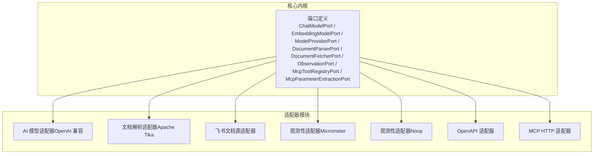
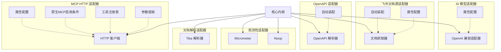
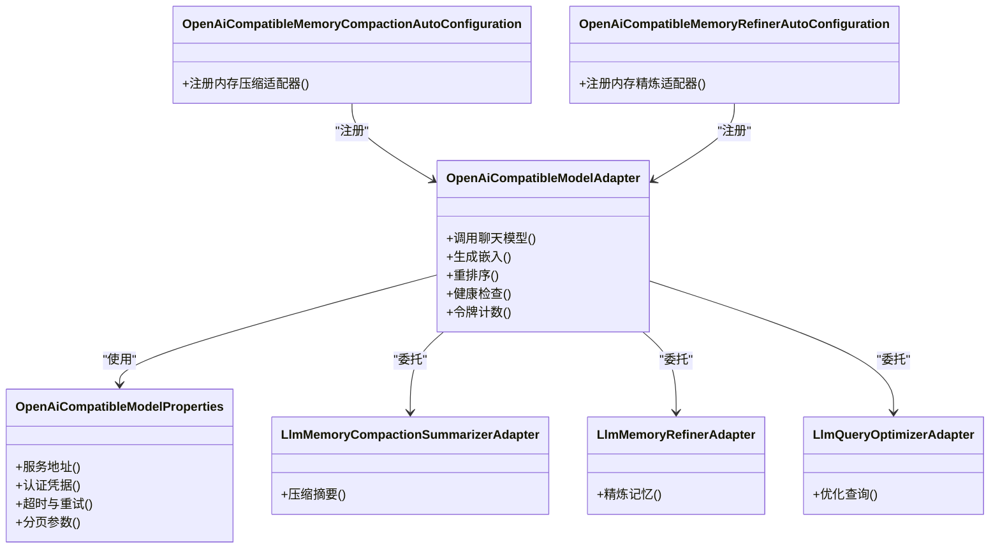
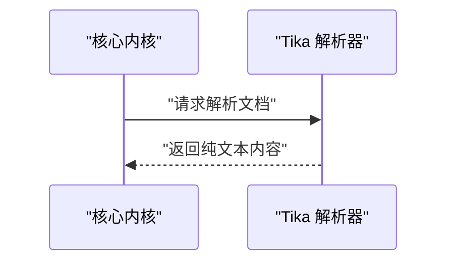
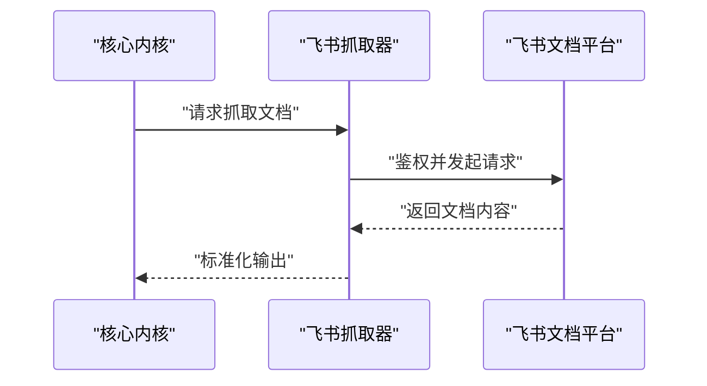
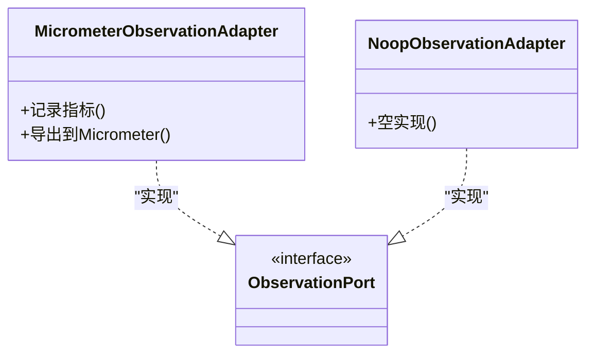
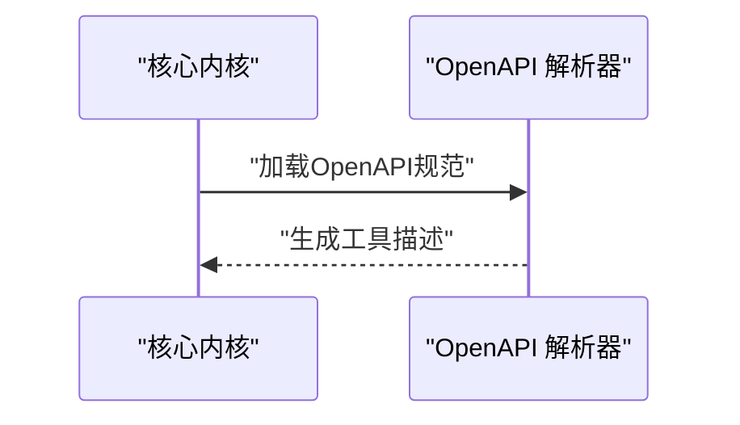
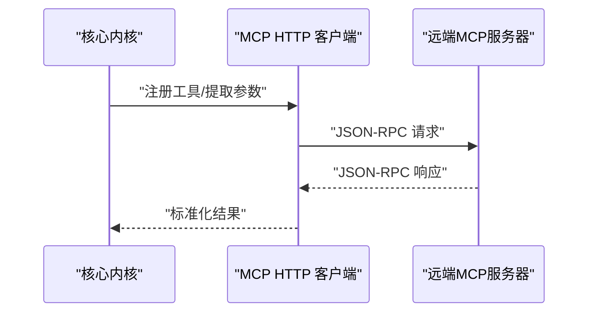
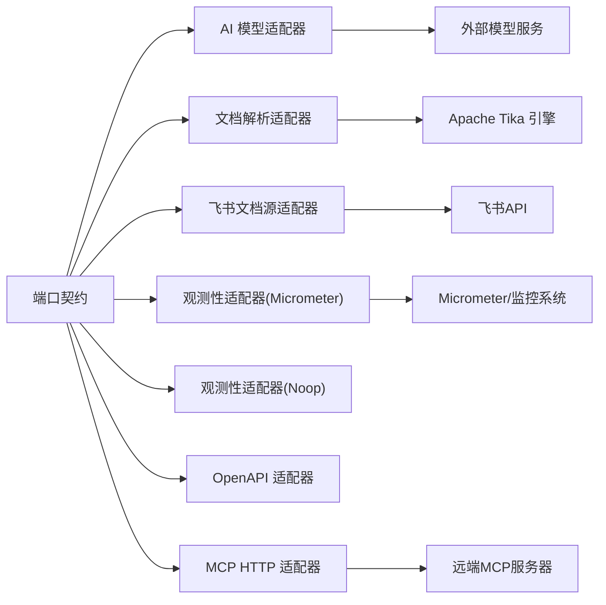

# 其他适配器

<cite>
**本文引用的文件**
- [OpenAiCompatibleModelAdapter.java](file://seahorse-agent-adapter-ai-openai-compatible/src/main/java/com/miracle/ai/seahorse/agent/adapters/ai/openai/OpenAiCompatibleModelAdapter.java)
- [OpenAiCompatibleMemoryCompactionAutoConfiguration.java](file://seahorse-agent-adapter-ai-openai-compatible/src/main/java/com/miracle/ai/seahorse/agent/adapters/ai/openai/OpenAiCompatibleMemoryCompactionAutoConfiguration.java)
- [OpenAiCompatibleMemoryRefinerAutoConfiguration.java](file://seahorse-agent-adapter-ai-openai-compatible/src/main/java/com/miracle/ai/seahorse/agent/adapters/ai/openai/OpenAiCompatibleMemoryRefinerAutoConfiguration.java)
- [OpenAiCompatibleModelProperties.java](file://seahorse-agent-adapter-ai-openai-compatible/src/main/java/com/miracle/ai/seahorse/agent/adapters/ai/openai/OpenAiCompatibleModelProperties.java)
- [LlmMemoryCompactionSummarizerAdapter.java](file://seahorse-agent-adapter-ai-openai-compatible/src/main/java/com/miracle/ai/seahorse/agent/adapters/ai/openai/LlmMemoryCompactionSummarizerAdapter.java)
- [LlmMemoryRefinerAdapter.java](file://seahorse-agent-adapter-ai-openai-compatible/src/main/java/com/miracle/ai/seahorse/agent/adapters/ai/openai/LlmMemoryRefinerAdapter.java)
- [LlmQueryOptimizerAdapter.java](file://seahorse-agent-adapter-ai-openai-compatible/src/main/java/com/miracle/ai/seahorse/agent/adapters/ai/openai/LlmQueryOptimizerAdapter.java)
- [TikaDocumentParserAdapter.java](file://seahorse-agent-adapter-parser-tika/src/main/java/com/miracle/ai/seahorse/agent/adapters/parser/tika/TikaDocumentParserAdapter.java)
- [FeishuDocumentFetcherAdapter.java](file://seahorse-agent-adapter-source-feishu/src/main/java/com/miracle/ai/seahorse/agent/adapters/source/feishu/FeishuDocumentFetcherAdapter.java)
- [FeishuDocumentSourceAutoConfiguration.java](file://seahorse-agent-adapter-source-feishu/src/main/java/com/miracle/ai/seahorse/agent/adapters/source/feishu/FeishuDocumentSourceAutoConfiguration.java)
- [FeishuDocumentSourceProperties.java](file://seahorse-agent-adapter-source-feishu/src/main/java/com/miracle/ai/seahorse/agent/adapters/source/feishu/FeishuDocumentSourceProperties.java)
- [MicrometerObservationAdapter.java](file://seahorse-agent-adapter-observation-micrometer/src/main/java/com/miracle/ai/seahorse/agent/adapters/observation/micrometer/MicrometerObservationAdapter.java)
- [NoopObservationAdapter.java](file://seahorse-agent-adapter-observation-noop/src/main/java/com/miracle/ai/seahorse/agent/adapters/observation/noop/NoopObservationAdapter.java)
- [OpenApiAdapterAutoConfiguration.java](file://seahorse-agent-adapter-openapi/src/main/java/com/miracle/ai/seahorse/agent/adapters/openapi/OpenApiAdapterAutoConfiguration.java)
- [OpenApiSpecParserAdapter.java](file://seahorse-agent-adapter-openapi/src/main/java/com/miracle/ai/seahorse/agent/adapters/openapi/OpenApiSpecParserAdapter.java)
- [McpHttpAutoConfiguration.java](file://seahorse-agent-adapter-mcp-http/src/main/java/com/miracle/ai/seahorse/agent/adapters/mcp/http/McpHttpAutoConfiguration.java)
- [McpHttpAdapterProperties.java](file://seahorse-agent-adapter-mcp-http/src/main/java/com/miracle/ai/seahorse/agent/adapters/mcp/http/McpHttpAdapterProperties.java)
- [NativeMcpEnabledCondition.java](file://seahorse-agent-adapter-mcp-http/src/main/java/com/miracle/ai/seahorse/agent/adapters/mcp/http/NativeMcpEnabledCondition.java)
- [NativeMcpToolRegistry.java](file://seahorse-agent-adapter-mcp-http/src/main/java/com/miracle/ai/seahorse/agent/adapters/mcp/http/NativeMcpToolRegistry.java)
- [RemoteMcpToolFeature.java](file://seahorse-agent-adapter-mcp-http/src/main/java/com/miracle/ai/seahorse/agent/adapters/mcp/http/RemoteMcpToolFeature.java)
- [StreamableHttpMcpClient.java](file://seahorse-agent-adapter-mcp-http/src/main/java/com/miracle/ai/seahorse/agent/adapters/mcp/http/StreamableHttpMcpClient.java)
- [LlmMcpParameterExtractionAdapter.java](file://seahorse-agent-adapter-mcp-http/src/main/java/com/miracle/ai/seahorse/agent/adapters/mcp/http/LlmMcpParameterExtractionAdapter.java)
- [McpJsonRpcResponse.java](file://seahorse-agent-adapter-mcp-http/src/main/java/com/miracle/ai/seahorse/agent/adapters/mcp/http/McpJsonRpcResponse.java)
</cite>

## 目录
1. [简介](#简介)
2. [项目结构](#项目结构)
3. [核心组件](#核心组件)
4. [架构总览](#架构总览)
5. [详细组件分析](#详细组件分析)
6. [依赖关系分析](#依赖关系分析)
7. [性能考量](#性能考量)
8. [故障排查指南](#故障排查指南)
9. [结论](#结论)
10. [附录](#附录)

## 简介
本文件面向“其他专用适配器”的技术文档，覆盖以下适配器的实现原理、功能特性、配置参数、集成方式、性能特点、适用场景、最佳实践与扩展开发方法：  
- AI模型适配器（OpenAI兼容）  
- 文档解析适配器（Apache Tika）  
- 飞书文档源适配器  
- 观测性适配器（Micrometer、Noop）  
- OpenAPI适配器  
- MCP HTTP适配器  

文档同时提供适配器与核心系统的协作机制、监控与调试技巧以及部署建议。

## 项目结构
这些适配器均以独立模块存在，采用Spring Boot自动装配机制进行加载，并通过META-INF下的SPI接口声明与核心内核进行对接。下图展示与核心内核交互的关键端口与适配器映射关系。

**图表来源**
- [OpenAiCompatibleModelAdapter.java](file://seahorse-agent-adapter-ai-openai-compatible/src/main/java/com/miracle/ai/seahorse/agent/adapters/ai/openai/OpenAiCompatibleModelAdapter.java)
- [TikaDocumentParserAdapter.java](file://seahorse-agent-adapter-parser-tika/src/main/java/com/miracle/ai/seahorse/agent/adapters/parser/tika/TikaDocumentParserAdapter.java)
- [FeishuDocumentFetcherAdapter.java](file://seahorse-agent-adapter-source-feishu/src/main/java/com/miracle/ai/seahorse/agent/adapters/source/feishu/FeishuDocumentFetcherAdapter.java)
- [MicrometerObservationAdapter.java](file://seahorse-agent-adapter-observation-micrometer/src/main/java/com/miracle/ai/seahorse/agent/adapters/observation/micrometer/MicrometerObservationAdapter.java)
- [NoopObservationAdapter.java](file://seahorse-agent-adapter-observation-noop/src/main/java/com/miracle/ai/seahorse/agent/adapters/observation/noop/NoopObservationAdapter.java)
- [OpenApiSpecParserAdapter.java](file://seahorse-agent-adapter-openapi/src/main/java/com/miracle/ai/seahorse/agent/adapters/openapi/OpenApiSpecParserAdapter.java)
- [StreamableHttpMcpClient.java](file://seahorse-agent-adapter-mcp-http/src/main/java/com/miracle/ai/seahorse/agent/adapters/mcp/http/StreamableHttpMcpClient.java)

**章节来源**
- [OpenAiCompatibleModelAdapter.java](file://seahorse-agent-adapter-ai-openai-compatible/src/main/java/com/miracle/ai/seahorse/agent/adapters/ai/openai/OpenAiCompatibleModelAdapter.java)
- [TikaDocumentParserAdapter.java](file://seahorse-agent-adapter-parser-tika/src/main/java/com/miracle/ai/seahorse/agent/adapters/parser/tika/TikaDocumentParserAdapter.java)
- [FeishuDocumentFetcherAdapter.java](file://seahorse-agent-adapter-source-feishu/src/main/java/com/miracle/ai/seahorse/agent/adapters/source/feishu/FeishuDocumentFetcherAdapter.java)
- [MicrometerObservationAdapter.java](file://seahorse-agent-adapter-observation-micrometer/src/main/java/com/miracle/ai/seahorse/agent/adapters/observation/micrometer/MicrometerObservationAdapter.java)
- [NoopObservationAdapter.java](file://seahorse-agent-adapter-observation-noop/src/main/java/com/miracle/ai/seahorse/agent/adapters/observation/noop/NoopObservationAdapter.java)
- [OpenApiSpecParserAdapter.java](file://seahorse-agent-adapter-openapi/src/main/java/com/miracle/ai/seahorse/agent/adapters/openapi/OpenApiSpecParserAdapter.java)
- [StreamableHttpMcpClient.java](file://seahorse-agent-adapter-mcp-http/src/main/java/com/miracle/ai/seahorse/agent/adapters/mcp/http/StreamableHttpMcpClient.java)

## 核心组件
本节概览各适配器在系统中的职责与能力边界，便于快速定位与选型。

- AI模型适配器（OpenAI兼容）
  - 负责将统一的模型调用接口映射到OpenAI兼容的模型服务，支持聊天、嵌入、重排序、健康检查、令牌计数等能力。
  - 提供内存整理、压缩摘要、查询优化等LLM增强能力的适配实现。
- 文档解析适配器（Apache Tika）
  - 将多种格式的文档内容解析为可检索文本，作为下游知识库或向量化索引的输入。
- 飞书文档源适配器
  - 从飞书文档平台抓取文档内容，提供统一的文档抓取接口，支撑RAG与知识入库流程。
- 观测性适配器（Micrometer、Noop）
  - Micrometer：将内部运行指标导出至Micrometer，便于Prometheus等监控系统采集。
  - Noop：在无需观测或测试环境时提供空实现，避免引入外部依赖。
- OpenAPI适配器
  - 解析OpenAPI规范，生成工具/操作描述，辅助工具注册与调用。
- MCP HTTP适配器
  - 通过HTTP JSON-RPC协议与远端MCP服务器交互，支持原生MCP启用条件、工具注册、参数提取与流式客户端。

**章节来源**
- [OpenAiCompatibleModelAdapter.java](file://seahorse-agent-adapter-ai-openai-compatible/src/main/java/com/miracle/ai/seahorse/agent/adapters/ai/openai/OpenAiCompatibleModelAdapter.java)
- [OpenAiCompatibleMemoryCompactionAutoConfiguration.java](file://seahorse-agent-adapter-ai-openai-compatible/src/main/java/com/miracle/ai/seahorse/agent/adapters/ai/openai/OpenAiCompatibleMemoryCompactionAutoConfiguration.java)
- [OpenAiCompatibleMemoryRefinerAutoConfiguration.java](file://seahorse-agent-adapter-ai-openai-compatible/src/main/java/com/miracle/ai/seahorse/agent/adapters/ai/openai/OpenAiCompatibleMemoryRefinerAutoConfiguration.java)
- [OpenAiCompatibleModelProperties.java](file://seahorse-agent-adapter-ai-openai-compatible/src/main/java/com/miracle/ai/seahorse/agent/adapters/ai/openai/OpenAiCompatibleModelProperties.java)
- [LlmMemoryCompactionSummarizerAdapter.java](file://seahorse-agent-adapter-ai-openai-compatible/src/main/java/com/miracle/ai/seahorse/agent/adapters/ai/openai/LlmMemoryCompactionSummarizerAdapter.java)
- [LlmMemoryRefinerAdapter.java](file://seahorse-agent-adapter-ai-openai-compatible/src/main/java/com/miracle/ai/seahorse/agent/adapters/ai/openai/LlmMemoryRefinerAdapter.java)
- [LlmQueryOptimizerAdapter.java](file://seahorse-agent-adapter-ai-openai-compatible/src/main/java/com/miracle/ai/seahorse/agent/adapters/ai/openai/LlmQueryOptimizerAdapter.java)
- [TikaDocumentParserAdapter.java](file://seahorse-agent-adapter-parser-tika/src/main/java/com/miracle/ai/seahorse/agent/adapters/parser/tika/TikaDocumentParserAdapter.java)
- [FeishuDocumentFetcherAdapter.java](file://seahorse-agent-adapter-source-feishu/src/main/java/com/miracle/ai/seahorse/agent/adapters/source/feishu/FeishuDocumentFetcherAdapter.java)
- [FeishuDocumentSourceAutoConfiguration.java](file://seahorse-agent-adapter-source-feishu/src/main/java/com/miracle/ai/seahorse/agent/adapters/source/feishu/FeishuDocumentSourceAutoConfiguration.java)
- [FeishuDocumentSourceProperties.java](file://seahorse-agent-adapter-source-feishu/src/main/java/com/miracle/ai/seahorse/agent/adapters/source/feishu/FeishuDocumentSourceProperties.java)
- [MicrometerObservationAdapter.java](file://seahorse-agent-adapter-observation-micrometer/src/main/java/com/miracle/ai/seahorse/agent/adapters/observation/micrometer/MicrometerObservationAdapter.java)
- [NoopObservationAdapter.java](file://seahorse-agent-adapter-observation-noop/src/main/java/com/miracle/ai/seahorse/agent/adapters/observation/noop/NoopObservationAdapter.java)
- [OpenApiAdapterAutoConfiguration.java](file://seahorse-agent-adapter-openapi/src/main/java/com/miracle/ai/seahorse/agent/adapters/openapi/OpenApiAdapterAutoConfiguration.java)
- [OpenApiSpecParserAdapter.java](file://seahorse-agent-adapter-openapi/src/main/java/com/miracle/ai/seahorse/agent/adapters/openapi/OpenApiSpecParserAdapter.java)
- [McpHttpAutoConfiguration.java](file://seahorse-agent-adapter-mcp-http/src/main/java/com/miracle/ai/seahorse/agent/adapters/mcp/http/McpHttpAutoConfiguration.java)
- [McpHttpAdapterProperties.java](file://seahorse-agent-adapter-mcp-http/src/main/java/com/miracle/ai/seahorse/agent/adapters/mcp/http/McpHttpAdapterProperties.java)
- [NativeMcpEnabledCondition.java](file://seahorse-agent-adapter-mcp-http/src/main/java/com/miracle/ai/seahorse/agent/adapters/mcp/http/NativeMcpEnabledCondition.java)
- [NativeMcpToolRegistry.java](file://seahorse-agent-adapter-mcp-http/src/main/java/com/miracle/ai/seahorse/agent/adapters/mcp/http/NativeMcpToolRegistry.java)
- [RemoteMcpToolFeature.java](file://seahorse-agent-adapter-mcp-http/src/main/java/com/miracle/ai/seahorse/agent/adapters/mcp/http/RemoteMcpToolFeature.java)
- [StreamableHttpMcpClient.java](file://seahorse-agent-adapter-mcp-http/src/main/java/com/miracle/ai/seahorse/agent/adapters/mcp/http/StreamableHttpMcpClient.java)
- [LlmMcpParameterExtractionAdapter.java](file://seahorse-agent-adapter-mcp-http/src/main/java/com/miracle/ai/seahorse/agent/adapters/mcp/http/LlmMcpParameterExtractionAdapter.java)
- [McpJsonRpcResponse.java](file://seahorse-agent-adapter-mcp-http/src/main/java/com/miracle/ai/seahorse/agent/adapters/mcp/http/McpJsonRpcResponse.java)

## 架构总览
下图展示适配器与核心内核的协作关系，包括端口绑定、自动装配与运行时交互。

**图表来源**
- [OpenAiCompatibleModelAdapter.java](file://seahorse-agent-adapter-ai-openai-compatible/src/main/java/com/miracle/ai/seahorse/agent/adapters/ai/openai/OpenAiCompatibleModelAdapter.java)
- [OpenAiCompatibleModelProperties.java](file://seahorse-agent-adapter-ai-openai-compatible/src/main/java/com/miracle/ai/seahorse/agent/adapters/ai/openai/OpenAiCompatibleModelProperties.java)
- [TikaDocumentParserAdapter.java](file://seahorse-agent-adapter-parser-tika/src/main/java/com/miracle/ai/seahorse/agent/adapters/parser/tika/TikaDocumentParserAdapter.java)
- [FeishuDocumentFetcherAdapter.java](file://seahorse-agent-adapter-source-feishu/src/main/java/com/miracle/ai/seahorse/agent/adapters/source/feishu/FeishuDocumentFetcherAdapter.java)
- [FeishuDocumentSourceAutoConfiguration.java](file://seahorse-agent-adapter-source-feishu/src/main/java/com/miracle/ai/seahorse/agent/adapters/source/feishu/FeishuDocumentSourceAutoConfiguration.java)
- [FeishuDocumentSourceProperties.java](file://seahorse-agent-adapter-source-feishu/src/main/java/com/miracle/ai/seahorse/agent/adapters/source/feishu/FeishuDocumentSourceProperties.java)
- [MicrometerObservationAdapter.java](file://seahorse-agent-adapter-observation-micrometer/src/main/java/com/miracle/ai/seahorse/agent/adapters/observation/micrometer/MicrometerObservationAdapter.java)
- [NoopObservationAdapter.java](file://seahorse-agent-adapter-observation-noop/src/main/java/com/miracle/ai/seahorse/agent/adapters/observation/noop/NoopObservationAdapter.java)
- [OpenApiAdapterAutoConfiguration.java](file://seahorse-agent-adapter-openapi/src/main/java/com/miracle/ai/seahorse/agent/adapters/openapi/OpenApiAdapterAutoConfiguration.java)
- [OpenApiSpecParserAdapter.java](file://seahorse-agent-adapter-openapi/src/main/java/com/miracle/ai/seahorse/agent/adapters/openapi/OpenApiSpecParserAdapter.java)
- [McpHttpAutoConfiguration.java](file://seahorse-agent-adapter-mcp-http/src/main/java/com/miracle/ai/seahorse/agent/adapters/mcp/http/McpHttpAutoConfiguration.java)
- [McpHttpAdapterProperties.java](file://seahorse-agent-adapter-mcp-http/src/main/java/com/miracle/ai/seahorse/agent/adapters/mcp/http/McpHttpAdapterProperties.java)
- [NativeMcpEnabledCondition.java](file://seahorse-agent-adapter-mcp-http/src/main/java/com/miracle/ai/seahorse/agent/adapters/mcp/http/NativeMcpEnabledCondition.java)
- [NativeMcpToolRegistry.java](file://seahorse-agent-adapter-mcp-http/src/main/java/com/miracle/ai/seahorse/agent/adapters/mcp/http/NativeMcpToolRegistry.java)
- [LlmMcpParameterExtractionAdapter.java](file://seahorse-agent-adapter-mcp-http/src/main/java/com/miracle/ai/seahorse/agent/adapters/mcp/http/LlmMcpParameterExtractionAdapter.java)
- [StreamableHttpMcpClient.java](file://seahorse-agent-adapter-mcp-http/src/main/java/com/miracle/ai/seahorse/agent/adapters/mcp/http/StreamableHttpMcpClient.java)

## 详细组件分析

### AI模型适配器（OpenAI兼容）
- 功能特性
  - 统一模型调用接口到OpenAI兼容后端的映射，覆盖聊天、嵌入、重排序、健康检查、令牌计数等。
  - 提供内存相关增强：压缩摘要、内存精炼、查询优化等LLM增强能力。
- 配置参数
  - 通过属性类集中管理模型服务地址、认证凭据、超时、重试、分页等参数。
- 集成方式
  - 自动装配类负责在Spring容器中注册适配器与相关端口实现。
- 性能特点
  - 支持流式响应与批量处理；具备连接池与并发控制；可结合缓存与限流提升吞吐。
- 适用场景
  - 企业级RAG与智能体对话、多模态检索增强、知识压缩与优化。
- 最佳实践
  - 明确区分同步与流式接口；合理设置超时与重试；对敏感字段进行脱敏记录；结合观测性指标进行SLA治理。

**图表来源**
- [OpenAiCompatibleModelAdapter.java](file://seahorse-agent-adapter-ai-openai-compatible/src/main/java/com/miracle/ai/seahorse/agent/adapters/ai/openai/OpenAiCompatibleModelAdapter.java)
- [OpenAiCompatibleMemoryCompactionAutoConfiguration.java](file://seahorse-agent-adapter-ai-openai-compatible/src/main/java/com/miracle/ai/seahorse/agent/adapters/ai/openai/OpenAiCompatibleMemoryCompactionAutoConfiguration.java)
- [OpenAiCompatibleMemoryRefinerAutoConfiguration.java](file://seahorse-agent-adapter-ai-openai-compatible/src/main/java/com/miracle/ai/seahorse/agent/adapters/ai/openai/OpenAiCompatibleMemoryRefinerAutoConfiguration.java)
- [OpenAiCompatibleModelProperties.java](file://seahorse-agent-adapter-ai-openai-compatible/src/main/java/com/miracle/ai/seahorse/agent/adapters/ai/openai/OpenAiCompatibleModelProperties.java)
- [LlmMemoryCompactionSummarizerAdapter.java](file://seahorse-agent-adapter-ai-openai-compatible/src/main/java/com/miracle/ai/seahorse/agent/adapters/ai/openai/LlmMemoryCompactionSummarizerAdapter.java)
- [LlmMemoryRefinerAdapter.java](file://seahorse-agent-adapter-ai-openai-compatible/src/main/java/com/miracle/ai/seahorse/agent/adapters/ai/openai/LlmMemoryRefinerAdapter.java)
- [LlmQueryOptimizerAdapter.java](file://seahorse-agent-adapter-ai-openai-compatible/src/main/java/com/miracle/ai/seahorse/agent/adapters/ai/openai/LlmQueryOptimizerAdapter.java)

**章节来源**
- [OpenAiCompatibleModelAdapter.java](file://seahorse-agent-adapter-ai-openai-compatible/src/main/java/com/miracle/ai/seahorse/agent/adapters/ai/openai/OpenAiCompatibleModelAdapter.java)
- [OpenAiCompatibleMemoryCompactionAutoConfiguration.java](file://seahorse-agent-adapter-ai-openai-compatible/src/main/java/com/miracle/ai/seahorse/agent/adapters/ai/openai/OpenAiCompatibleMemoryCompactionAutoConfiguration.java)
- [OpenAiCompatibleMemoryRefinerAutoConfiguration.java](file://seahorse-agent-adapter-ai-openai-compatible/src/main/java/com/miracle/ai/seahorse/agent/adapters/ai/openai/OpenAiCompatibleMemoryRefinerAutoConfiguration.java)
- [OpenAiCompatibleModelProperties.java](file://seahorse-agent-adapter-ai-openai-compatible/src/main/java/com/miracle/ai/seahorse/agent/adapters/ai/openai/OpenAiCompatibleModelProperties.java)
- [LlmMemoryCompactionSummarizerAdapter.java](file://seahorse-agent-adapter-ai-openai-compatible/src/main/java/com/miracle/ai/seahorse/agent/adapters/ai/openai/LlmMemoryCompactionSummarizerAdapter.java)
- [LlmMemoryRefinerAdapter.java](file://seahorse-agent-adapter-ai-openai-compatible/src/main/java/com/miracle/ai/seahorse/agent/adapters/ai/openai/LlmMemoryRefinerAdapter.java)
- [LlmQueryOptimizerAdapter.java](file://seahorse-agent-adapter-ai-openai-compatible/src/main/java/com/miracle/ai/seahorse/agent/adapters/ai/openai/LlmQueryOptimizerAdapter.java)

### 文档解析适配器（Apache Tika）
- 功能特性
  - 对PDF、Word、Excel、PowerPoint、HTML等多种格式进行内容抽取与纯文本化，输出标准化文本供后续处理。
- 配置参数
  - 通过端口SPI绑定到核心内核的文档解析端口，适配器负责具体实现。
- 集成方式
  - 通过META-INF声明与核心内核对接，无需额外手动注册。
- 性能特点
  - 处理大文档时注意内存占用与超时；可结合分块策略与并发限制。
- 适用场景
  - RAG知识入库、合规审计、文档检索前处理。
- 最佳实践
  - 预先识别高风险格式与编码；对图片OCR结果进行二次校验；记录解析失败的文档以便重试。

**图表来源**
- [TikaDocumentParserAdapter.java](file://seahorse-agent-adapter-parser-tika/src/main/java/com/miracle/ai/seahorse/agent/adapters/parser/tika/TikaDocumentParserAdapter.java)

**章节来源**
- [TikaDocumentParserAdapter.java](file://seahorse-agent-adapter-parser-tika/src/main/java/com/miracle/ai/seahorse/agent/adapters/parser/tika/TikaDocumentParserAdapter.java)

### 飞书文档源适配器
- 功能特性
  - 从飞书文档平台抓取文档内容，支持文档元数据与正文提取。
- 配置参数
  - 通过属性类管理访问令牌、租户ID、请求超时、重试策略等。
- 集成方式
  - 自动装配类在Spring容器中注册抓取器与端口实现。
- 性能特点
  - 并发抓取与限速控制；对飞书API速率限制进行适配。
- 适用场景
  - 企业内部知识库增量同步、文档订阅与推送。
- 最佳实践
  - 使用增量拉取与变更检测；对权限与可见性进行预校验；记录失败任务以便重试。

**图表来源**
- [FeishuDocumentFetcherAdapter.java](file://seahorse-agent-adapter-source-feishu/src/main/java/com/miracle/ai/seahorse/agent/adapters/source/feishu/FeishuDocumentFetcherAdapter.java)
- [FeishuDocumentSourceAutoConfiguration.java](file://seahorse-agent-adapter-source-feishu/src/main/java/com/miracle/ai/seahorse/agent/adapters/source/feishu/FeishuDocumentSourceAutoConfiguration.java)
- [FeishuDocumentSourceProperties.java](file://seahorse-agent-adapter-source-feishu/src/main/java/com/miracle/ai/seahorse/agent/adapters/source/feishu/FeishuDocumentSourceProperties.java)

**章节来源**
- [FeishuDocumentFetcherAdapter.java](file://seahorse-agent-adapter-source-feishu/src/main/java/com/miracle/ai/seahorse/agent/adapters/source/feishu/FeishuDocumentFetcherAdapter.java)
- [FeishuDocumentSourceAutoConfiguration.java](file://seahorse-agent-adapter-source-feishu/src/main/java/com/miracle/ai/seahorse/agent/adapters/source/feishu/FeishuDocumentSourceAutoConfiguration.java)
- [FeishuDocumentSourceProperties.java](file://seahorse-agent-adapter-source-feishu/src/main/java/com/miracle/ai/seahorse/agent/adapters/source/feishu/FeishuDocumentSourceProperties.java)

### 观测性适配器（Micrometer、Noop）
- 功能特性
  - Micrometer：将内部运行指标（如请求耗时、错误率、队列长度等）导出至Micrometer，便于Prometheus等系统采集。
  - Noop：在不需要观测或测试环境时提供空实现，避免引入外部依赖。
- 配置参数
  - 通过端口SPI绑定到核心内核的观测端口，适配器负责具体实现。
- 集成方式
  - 通过META-INF声明与核心内核对接，按需切换实现。
- 性能特点
  - Micrometer适配器应避免阻塞与过度采样；Noop适配器零开销。
- 适用场景
  - 生产环境监控、灰度与回归测试、离线分析。
- 最佳实践
  - 为关键路径打点；区分业务指标与基础设施指标；在高并发场景下降低采样频率。

**图表来源**
- [MicrometerObservationAdapter.java](file://seahorse-agent-adapter-observation-micrometer/src/main/java/com/miracle/ai/seahorse/agent/adapters/observation/micrometer/MicrometerObservationAdapter.java)
- [NoopObservationAdapter.java](file://seahorse-agent-adapter-observation-noop/src/main/java/com/miracle/ai/seahorse/agent/adapters/observation/noop/NoopObservationAdapter.java)

**章节来源**
- [MicrometerObservationAdapter.java](file://seahorse-agent-adapter-observation-micrometer/src/main/java/com/miracle/ai/seahorse/agent/adapters/observation/micrometer/MicrometerObservationAdapter.java)
- [NoopObservationAdapter.java](file://seahorse-agent-adapter-observation-noop/src/main/java/com/miracle/ai/seahorse/agent/adapters/observation/noop/NoopObservationAdapter.java)

### OpenAPI适配器
- 功能特性
  - 解析OpenAPI规范，生成工具/操作描述，辅助工具注册与调用。
- 配置参数
  - 通过自动装配类在Spring容器中注册解析器与端口实现。
- 集成方式
  - 通过META-INF声明与核心内核对接。
- 性能特点
  - 解析过程应避免阻塞主线程；对大型规范进行懒加载。
- 适用场景
  - 工具链自动化、API驱动的智能体行为编排。
- 最佳实践
  - 对规范进行缓存与版本管理；对不规范的字段进行容错处理。

**图表来源**
- [OpenApiSpecParserAdapter.java](file://seahorse-agent-adapter-openapi/src/main/java/com/miracle/ai/seahorse/agent/adapters/openapi/OpenApiSpecParserAdapter.java)
- [OpenApiAdapterAutoConfiguration.java](file://seahorse-agent-adapter-openapi/src/main/java/com/miracle/ai/seahorse/agent/adapters/openapi/OpenApiAdapterAutoConfiguration.java)

**章节来源**
- [OpenApiSpecParserAdapter.java](file://seahorse-agent-adapter-openapi/src/main/java/com/miracle/ai/seahorse/agent/adapters/openapi/OpenApiSpecParserAdapter.java)
- [OpenApiAdapterAutoConfiguration.java](file://seahorse-agent-adapter-openapi/src/main/java/com/miracle/ai/seahorse/agent/adapters/openapi/OpenApiAdapterAutoConfiguration.java)

### MCP HTTP适配器
- 功能特性
  - 通过HTTP JSON-RPC协议与远端MCP服务器交互；支持原生MCP启用条件、工具注册、参数提取与流式客户端。
- 配置参数
  - 通过属性类管理服务器地址、认证方式（Bearer/OAuth）、超时、分片大小等。
- 集成方式
  - 自动装配类负责注册客户端、启用条件、工具注册表与参数提取器。
- 性能特点
  - 流式传输减少延迟；支持断点续传与重试；对高并发进行限流。
- 适用场景
  - 远程工具调用、跨服务MCP集成、动态工具发现与注册。
- 最佳实践
  - 明确启用条件与降级策略；对JSON-RPC响应进行严格校验；记录关键事件以便追踪。

**图表来源**
- [StreamableHttpMcpClient.java](file://seahorse-agent-adapter-mcp-http/src/main/java/com/miracle/ai/seahorse/agent/adapters/mcp/http/StreamableHttpMcpClient.java)
- [McpHttpAutoConfiguration.java](file://seahorse-agent-adapter-mcp-http/src/main/java/com/miracle/ai/seahorse/agent/adapters/mcp/http/McpHttpAutoConfiguration.java)
- [McpHttpAdapterProperties.java](file://seahorse-agent-adapter-mcp-http/src/main/java/com/miracle/ai/seahorse/agent/adapters/mcp/http/McpHttpAdapterProperties.java)
- [NativeMcpEnabledCondition.java](file://seahorse-agent-adapter-mcp-http/src/main/java/com/miracle/ai/seahorse/agent/adapters/mcp/http/NativeMcpEnabledCondition.java)
- [NativeMcpToolRegistry.java](file://seahorse-agent-adapter-mcp-http/src/main/java/com/miracle/ai/seahorse/agent/adapters/mcp/http/NativeMcpToolRegistry.java)
- [LlmMcpParameterExtractionAdapter.java](file://seahorse-agent-adapter-mcp-http/src/main/java/com/miracle/ai/seahorse/agent/adapters/mcp/http/LlmMcpParameterExtractionAdapter.java)
- [McpJsonRpcResponse.java](file://seahorse-agent-adapter-mcp-http/src/main/java/com/miracle/ai/seahorse/agent/adapters/mcp/http/McpJsonRpcResponse.java)

**章节来源**
- [StreamableHttpMcpClient.java](file://seahorse-agent-adapter-mcp-http/src/main/java/com/miracle/ai/seahorse/agent/adapters/mcp/http/StreamableHttpMcpClient.java)
- [McpHttpAutoConfiguration.java](file://seahorse-agent-adapter-mcp-http/src/main/java/com/miracle/ai/seahorse/agent/adapters/mcp/http/McpHttpAutoConfiguration.java)
- [McpHttpAdapterProperties.java](file://seahorse-agent-adapter-mcp-http/src/main/java/com/miracle/ai/seahorse/agent/adapters/mcp/http/McpHttpAdapterProperties.java)
- [NativeMcpEnabledCondition.java](file://seahorse-agent-adapter-mcp-http/src/main/java/com/miracle/ai/seahorse/agent/adapters/mcp/http/NativeMcpEnabledCondition.java)
- [NativeMcpToolRegistry.java](file://seahorse-agent-adapter-mcp-http/src/main/java/com/miracle/ai/seahorse/agent/adapters/mcp/http/NativeMcpToolRegistry.java)
- [LlmMcpParameterExtractionAdapter.java](file://seahorse-agent-adapter-mcp-http/src/main/java/com/miracle/ai/seahorse/agent/adapters/mcp/http/LlmMcpParameterExtractionAdapter.java)
- [McpJsonRpcResponse.java](file://seahorse-agent-adapter-mcp-http/src/main/java/com/miracle/ai/seahorse/agent/adapters/mcp/http/McpJsonRpcResponse.java)

## 依赖关系分析
- 端口契约
  - 各适配器通过SPI端口与核心内核解耦，确保替换实现不影响上层逻辑。
- 自动装配
  - 通过Spring Boot自动装配机制加载适配器，简化集成成本。
- 外部依赖
  - Micrometer适配器依赖监控系统；MCP HTTP适配器依赖网络与认证服务；Tika适配器依赖解析引擎；飞书适配器依赖第三方API。

**图表来源**
- [OpenAiCompatibleModelAdapter.java](file://seahorse-agent-adapter-ai-openai-compatible/src/main/java/com/miracle/ai/seahorse/agent/adapters/ai/openai/OpenAiCompatibleModelAdapter.java)
- [TikaDocumentParserAdapter.java](file://seahorse-agent-adapter-parser-tika/src/main/java/com/miracle/ai/seahorse/agent/adapters/parser/tika/TikaDocumentParserAdapter.java)
- [FeishuDocumentFetcherAdapter.java](file://seahorse-agent-adapter-source-feishu/src/main/java/com/miracle/ai/seahorse/agent/adapters/source/feishu/FeishuDocumentFetcherAdapter.java)
- [MicrometerObservationAdapter.java](file://seahorse-agent-adapter-observation-micrometer/src/main/java/com/miracle/ai/seahorse/agent/adapters/observation/micrometer/MicrometerObservationAdapter.java)
- [NoopObservationAdapter.java](file://seahorse-agent-adapter-observation-noop/src/main/java/com/miracle/ai/seahorse/agent/adapters/observation/noop/NoopObservationAdapter.java)
- [OpenApiSpecParserAdapter.java](file://seahorse-agent-adapter-openapi/src/main/java/com/miracle/ai/seahorse/agent/adapters/openapi/OpenApiSpecParserAdapter.java)
- [StreamableHttpMcpClient.java](file://seahorse-agent-adapter-mcp-http/src/main/java/com/miracle/ai/seahorse/agent/adapters/mcp/http/StreamableHttpMcpClient.java)

**章节来源**
- [OpenAiCompatibleModelAdapter.java](file://seahorse-agent-adapter-ai-openai-compatible/src/main/java/com/miracle/ai/seahorse/agent/adapters/ai/openai/OpenAiCompatibleModelAdapter.java)
- [TikaDocumentParserAdapter.java](file://seahorse-agent-adapter-parser-tika/src/main/java/com/miracle/ai/seahorse/agent/adapters/parser/tika/TikaDocumentParserAdapter.java)
- [FeishuDocumentFetcherAdapter.java](file://seahorse-agent-adapter-source-feishu/src/main/java/com/miracle/ai/seahorse/agent/adapters/source/feishu/FeishuDocumentFetcherAdapter.java)
- [MicrometerObservationAdapter.java](file://seahorse-agent-adapter-observation-micrometer/src/main/java/com/miracle/ai/seahorse/agent/adapters/observation/micrometer/MicrometerObservationAdapter.java)
- [NoopObservationAdapter.java](file://seahorse-agent-adapter-observation-noop/src/main/java/com/miracle/ai/seahorse/agent/adapters/observation/noop/NoopObservationAdapter.java)
- [OpenApiSpecParserAdapter.java](file://seahorse-agent-adapter-openapi/src/main/java/com/miracle/ai/seahorse/agent/adapters/openapi/OpenApiSpecParserAdapter.java)
- [StreamableHttpMcpClient.java](file://seahorse-agent-adapter-mcp-http/src/main/java/com/miracle/ai/seahorse/agent/adapters/mcp/http/StreamableHttpMcpClient.java)

## 性能考量
- 并发与限流
  - 对外部服务调用实施连接池、超时与重试策略；对飞书与MCP服务器进行速率限制。
- 缓存与批处理
  - 对解析结果与工具描述进行缓存；对批量任务进行分片与合并。
- 监控与可观测性
  - Micrometer适配器用于生产监控；Noop适配器用于测试与离线分析。
- 资源占用
  - 文档解析与向量化过程注意内存峰值；MCP流式传输减少等待时间。

## 故障排查指南
- 常见问题
  - 认证失败：检查凭据与作用域；确认Bearer/OAuth配置正确。
  - 超时与重试：调整超时阈值与重试次数；对慢依赖进行熔断。
  - 解析异常：检查文件格式与编码；对损坏文件进行隔离与重试。
  - 观测缺失：确认Micrometer适配器已启用且监控系统可达。
- 调试技巧
  - 打印关键请求与响应摘要；记录时间戳与traceId；对流式响应进行分段日志。
- 排查步骤
  - 逐层验证端口绑定与自动装配；检查属性配置是否生效；验证外部服务连通性与权限。

**章节来源**
- [McpHttpAdapterProperties.java](file://seahorse-agent-adapter-mcp-http/src/main/java/com/miracle/ai/seahorse/agent/adapters/mcp/http/McpHttpAdapterProperties.java)
- [FeishuDocumentSourceProperties.java](file://seahorse-agent-adapter-source-feishu/src/main/java/com/miracle/ai/seahorse/agent/adapters/source/feishu/FeishuDocumentSourceProperties.java)
- [OpenAiCompatibleModelProperties.java](file://seahorse-agent-adapter-ai-openai-compatible/src/main/java/com/miracle/ai/seahorse/agent/adapters/ai/openai/OpenAiCompatibleModelProperties.java)

## 结论
上述适配器通过统一的端口契约与自动装配机制，实现了与核心内核的松耦合集成。在实际部署中，应根据业务场景选择合适的适配器组合，并结合观测性与性能优化策略，确保系统的稳定性与可维护性。

## 附录
- 适配器选择指南
  - 若需要与OpenAI兼容的模型服务：优先选择AI模型适配器。
  - 若需要解析多格式文档：选择文档解析适配器。
  - 若需要从飞书抓取文档：选择飞书文档源适配器。
  - 若需要生产监控：选择Micrometer观测性适配器；若仅测试或离线：选择Noop。
  - 若需要基于OpenAPI的工具编排：选择OpenAPI适配器。
  - 若需要远程MCP集成：选择MCP HTTP适配器。
- 部署建议
  - 在生产环境启用Micrometer并配置监控告警；对高并发场景进行资源扩容与限流。
  - 对外部依赖进行健康检查与熔断保护；对关键流程进行重试与幂等设计。
  - 对配置进行版本化管理与灰度发布；定期评估适配器性能与成本。