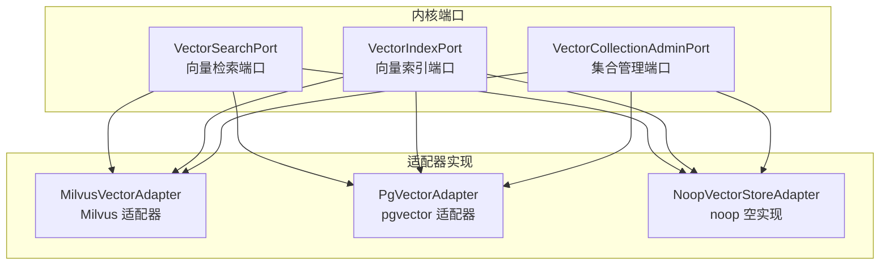
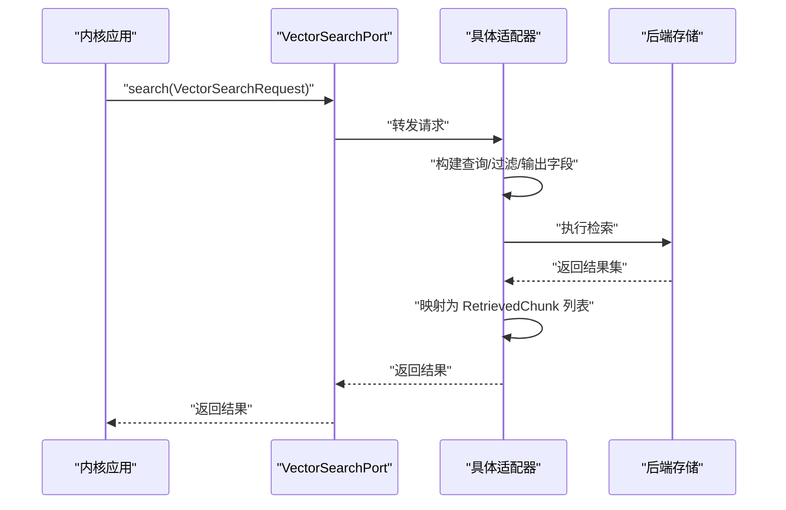
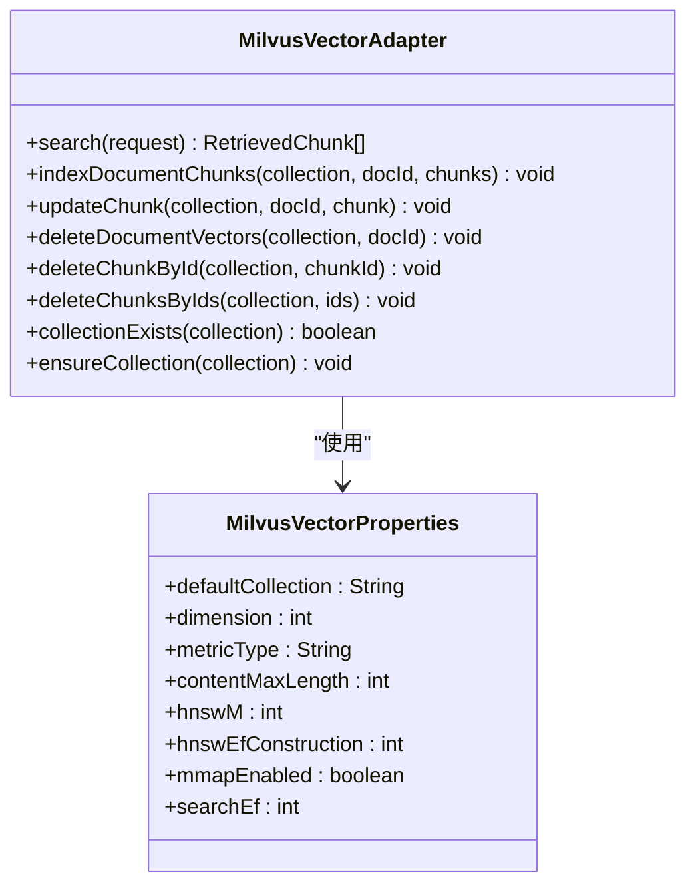
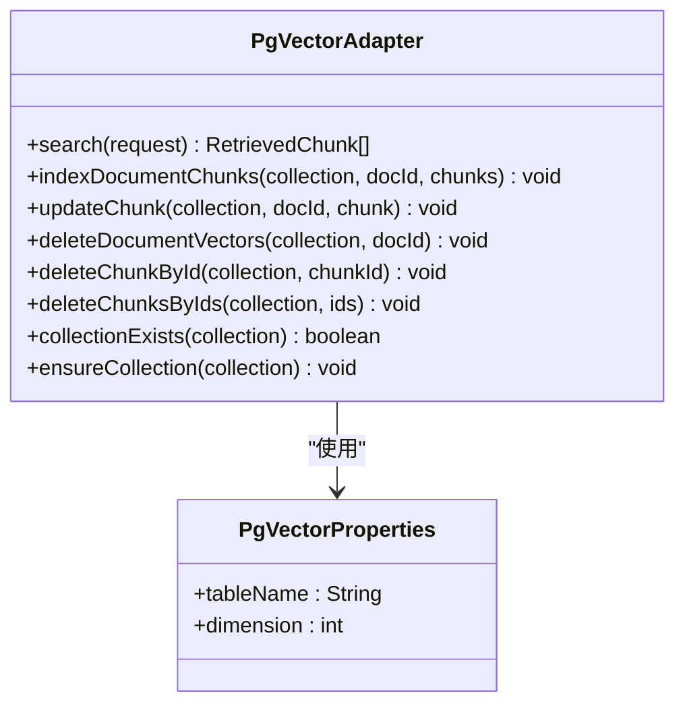
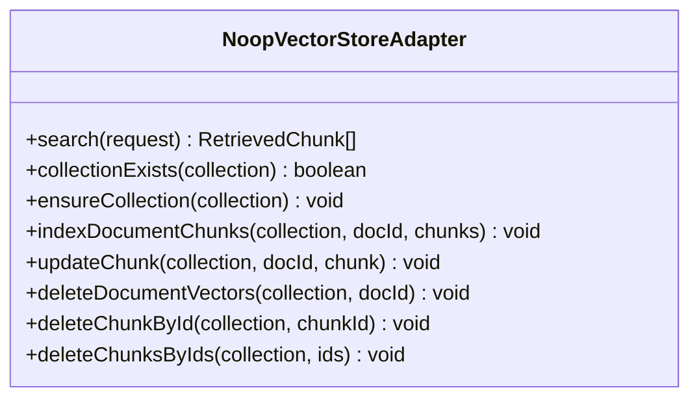
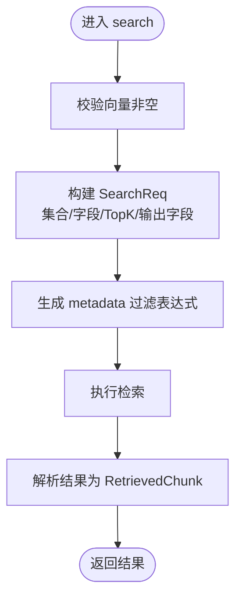
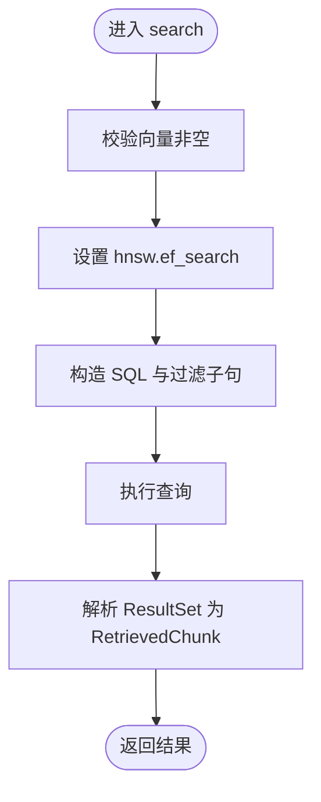
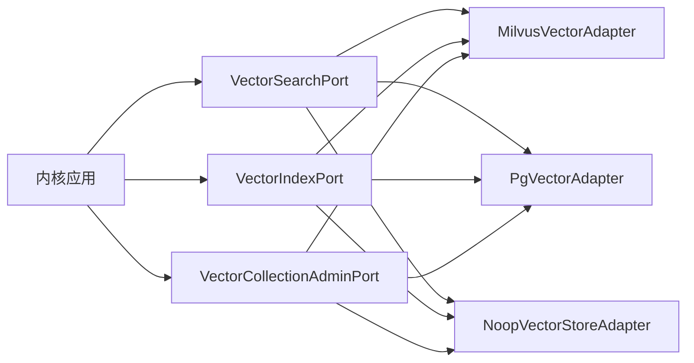

# 向量数据库适配器

<cite>
**本文引用的文件**
- [MilvusVectorAdapter.java](file://seahorse-agent-adapter-vector-milvus/src/main/java/com/miracle/ai/seahorse/agent/adapters/vector/milvus/MilvusVectorAdapter.java)
- [MilvusVectorProperties.java](file://seahorse-agent-adapter-vector-milvus/src/main/java/com/miracle/ai/seahorse/agent/adapters/vector/milvus/MilvusVectorProperties.java)
- [PgVectorAdapter.java](file://seahorse-agent-adapter-vector-pgvector/src/main/java/com/miracle/ai/seahorse/agent/adapters/vector/pgvector/PgVectorAdapter.java)
- [PgVectorProperties.java](file://seahorse-agent-adapter-vector-pgvector/src/main/java/com/miracle/ai/seahorse/agent/adapters/vector/pgvector/PgVectorProperties.java)
- [NoopVectorStoreAdapter.java](file://seahorse-agent-adapter-vector-noop/src/main/java/com/miracle/ai/seahorse/agent/adapters/vector/noop/NoopVectorStoreAdapter.java)
- [VectorSearchPort.java](file://seahorse-agent-kernel/src/main/java/com/miracle/ai/seahorse/agent/ports/outbound/vector/VectorSearchPort.java)
- [VectorIndexPort.java](file://seahorse-agent-kernel/src/main/java/com/miracle/ai/seahorse/agent/ports/outbound/vector/VectorIndexPort.java)
- [VectorCollectionAdminPort.java](file://seahorse-agent-kernel/src/main/java/com/miracle/ai/seahorse/agent/ports/outbound/vector/VectorCollectionAdminPort.java)
- [MilvusVectorAdapterTests.java](file://seahorse-agent-adapter-vector-milvus/src/test/java/com/miracle/ai/seahorse/agent/adapters/vector/milvus/MilvusVectorAdapterTests.java)
- [PgVectorAdapterTests.java](file://seahorse-agent-adapter-vector-pgvector/src/test/java/com/miracle/ai/seahorse/agent/adapters/vector/pgvector/PgVectorAdapterTests.java)
</cite>

## 目录
1. [简介](#简介)
2. [项目结构](#项目结构)
3. [核心组件](#核心组件)
4. [架构总览](#架构总览)
5. [组件详解](#组件详解)
6. [依赖关系分析](#依赖关系分析)
7. [性能考量](#性能考量)
8. [故障排查指南](#故障排查指南)
9. [结论](#结论)
10. [附录](#附录)

## 简介
本文件面向向量数据库适配器的技术文档，系统性阐述以下三类适配器的实现原理、配置方法与使用要点：
- Milvus 向量数据库适配器：基于 Milvus V2 客户端，采用 JSON 元数据字段与 HNSW 索引，支持检索过滤下推与批量写入。
- pgvector 适配器：基于 PostgreSQL 扩展 pgvector，使用 JSONB 元数据与 HNSW 索引，封装方言 SQL，提供高性能相似度检索。
- noop 空实现适配器：用于禁用向量检索的场景，写入仅记录集合存在性，检索返回空结果。

文档还涵盖向量集合管理、向量索引创建、向量搜索与相似度计算流程，以及索引策略、查询优化、监控与容量规划等专业建议，并给出适配器选择与部署建议。

## 项目结构
向量适配器位于独立模块中，分别对应不同后端：
- seahorse-agent-adapter-vector-milvus：Milvus 适配器与配置
- seahorse-agent-adapter-vector-pgvector：pgvector 适配器与配置
- seahorse-agent-adapter-vector-noop：noop 适配器
- seahorse-agent-kernel：向量相关端口定义（VectorSearchPort、VectorIndexPort、VectorCollectionAdminPort）

**图表来源**
- [VectorSearchPort.java:30-38](file://seahorse-agent-kernel/src/main/java/com/miracle/ai/seahorse/agent/ports/outbound/vector/VectorSearchPort.java#L30-L38)
- [VectorIndexPort.java:30-72](file://seahorse-agent-kernel/src/main/java/com/miracle/ai/seahorse/agent/ports/outbound/vector/VectorIndexPort.java#L30-L72)
- [VectorCollectionAdminPort.java:25-40](file://seahorse-agent-kernel/src/main/java/com/miracle/ai/seahorse/agent/ports/outbound/vector/VectorCollectionAdminPort.java#L25-L40)
- [MilvusVectorAdapter.java:72-111](file://seahorse-agent-adapter-vector-milvus/src/main/java/com/miracle/ai/seahorse/agent/adapters/vector/milvus/MilvusVectorAdapter.java#L72-L111)
- [PgVectorAdapter.java:60-96](file://seahorse-agent-adapter-vector-pgvector/src/main/java/com/miracle/ai/seahorse/agent/adapters/vector/pgvector/PgVectorAdapter.java#L60-L96)
- [NoopVectorStoreAdapter.java:36-80](file://seahorse-agent-adapter-vector-noop/src/main/java/com/miracle/ai/seahorse/agent/adapters/vector/noop/NoopVectorStoreAdapter.java#L36-L80)

**章节来源**
- [MilvusVectorAdapter.java:66-111](file://seahorse-agent-adapter-vector-milvus/src/main/java/com/miracle/ai/seahorse/agent/adapters/vector/milvus/MilvusVectorAdapter.java#L66-L111)
- [PgVectorAdapter.java:54-96](file://seahorse-agent-adapter-vector-pgvector/src/main/java/com/miracle/ai/seahorse/agent/adapters/vector/pgvector/PgVectorAdapter.java#L54-L96)
- [NoopVectorStoreAdapter.java:31-80](file://seahorse-agent-adapter-vector-noop/src/main/java/com/miracle/ai/seahorse/agent/adapters/vector/noop/NoopVectorStoreAdapter.java#L31-L80)

## 核心组件
- VectorSearchPort：统一的向量检索端口，屏蔽底层实现差异，便于配置驱动切换。
- VectorIndexPort：统一的向量索引写入端口，支持批量写入、单条更新、按文档/按 ID 删除。
- VectorCollectionAdminPort：统一的集合管理端口，支持集合存在性检查与确保创建。

上述端口被 Milvus、pgvector、noop 三种适配器共同实现，确保上层检索与索引逻辑无需感知具体后端。

**章节来源**
- [VectorSearchPort.java:24-38](file://seahorse-agent-kernel/src/main/java/com/miracle/ai/seahorse/agent/ports/outbound/vector/VectorSearchPort.java#L24-L38)
- [VectorIndexPort.java:24-72](file://seahorse-agent-kernel/src/main/java/com/miracle/ai/seahorse/agent/ports/outbound/vector/VectorIndexPort.java#L24-L72)
- [VectorCollectionAdminPort.java:20-40](file://seahorse-agent-kernel/src/main/java/com/miracle/ai/seahorse/agent/ports/outbound/vector/VectorCollectionAdminPort.java#L20-L40)

## 架构总览
适配器通过统一端口对接内核，内核不直接依赖具体 SDK；适配器内部负责：
- 集合管理：创建/检查集合，定义字段与索引参数
- 索引写入：批量插入/更新/删除向量与元数据
- 检索搜索：构造查询请求，下推过滤条件，解析返回结果

**图表来源**
- [VectorSearchPort.java:30-38](file://seahorse-agent-kernel/src/main/java/com/miracle/ai/seahorse/agent/ports/outbound/vector/VectorSearchPort.java#L30-L38)
- [MilvusVectorAdapter.java:97-111](file://seahorse-agent-adapter-vector-milvus/src/main/java/com/miracle/ai/seahorse/agent/adapters/vector/milvus/MilvusVectorAdapter.java#L97-L111)
- [PgVectorAdapter.java:83-96](file://seahorse-agent-adapter-vector-pgvector/src/main/java/com/miracle/ai/seahorse/agent/adapters/vector/pgvector/PgVectorAdapter.java#L83-L96)

## 组件详解

### Milvus 向量数据库适配器
- 实现要点
  - 固定集合字段：id、content、metadata(JSON)、embedding(FloatVector)，满足默认 RAG 行为一致性
  - 集合管理：ensureCollection 创建集合，设置主键、向量字段、度量类型、一致性级别与索引参数
  - 索引写入：支持批量 indexDocumentChunks、单条 updateChunk、按文档/按 ID 删除
  - 检索搜索：search 构造 ANN 查询，支持 Top-K、ef 参数、输出字段，过滤表达式下推至 metadata JSON 路径
  - 过滤下推：EQ/NE/IN/RANGE/CONTAINS/EXISTS 等表达式映射为 Milvus JSON 表达式，ACL 使用 json_contains_any 下推
  - 元数据：自动注入 collection_name、doc_id、chunk_index、tenant_id 等系统字段
- 关键配置
  - defaultCollection、dimension、metricType(COSINE/IP/HAMMING/JACCARD)、contentMaxLength、hnswM、hnswEfConstruction、mmapEnabled、searchEf
- 性能特性
  - HNSW 索引，支持 ef/searchEf 调参；可启用 mmap；支持内容截断降低存储与网络开销

**图表来源**
- [MilvusVectorAdapter.java:72-191](file://seahorse-agent-adapter-vector-milvus/src/main/java/com/miracle/ai/seahorse/agent/adapters/vector/milvus/MilvusVectorAdapter.java#L72-L191)
- [MilvusVectorProperties.java:34-63](file://seahorse-agent-adapter-vector-milvus/src/main/java/com/miracle/ai/seahorse/agent/adapters/vector/milvus/MilvusVectorProperties.java#L34-L63)

**章节来源**
- [MilvusVectorAdapter.java:66-511](file://seahorse-agent-adapter-vector-milvus/src/main/java/com/miracle/ai/seahorse/agent/adapters/vector/milvus/MilvusVectorAdapter.java#L66-L511)
- [MilvusVectorProperties.java:22-68](file://seahorse-agent-adapter-vector-milvus/src/main/java/com/miracle/ai/seahorse/agent/adapters/vector/milvus/MilvusVectorProperties.java#L22-L68)
- [MilvusVectorAdapterTests.java:55-149](file://seahorse-agent-adapter-vector-milvus/src/test/java/com/miracle/ai/seahorse/agent/adapters/vector/milvus/MilvusVectorAdapterTests.java#L55-L149)

### pgvector 适配器
- 实现要点
  - 表结构：id(varchar) 主键、content(text)、metadata(jsonb)、embedding(vector)
  - 集合管理：ensureCollection 创建表与 HNSW 索引；collectionExists 检查扩展与表存在
  - 索引写入：upsert 语句支持 ON CONFLICT 批量更新；支持按文档/按 ID 删除
  - 检索搜索：使用 1 - (embedding <=> ?::vector) 计算余弦相似度，LIMIT Top-K 返回
  - 过滤下推：EQ/NE/IN/RANGE/CONTAINS/EXISTS 映射为 JSONB 操作，ACL 使用 jsonb_exists_any 与标量子句组合
  - 元数据：自动注入系统字段，序列化为 JSONB
- 关键配置
  - tableName、dimension
- 性能特性
  - 使用 PostgreSQL HNSW 索引与向量扩展；通过设置 hnsw.ef_search 提升检索质量；JSONB 支持高效下推

**图表来源**
- [PgVectorAdapter.java:60-177](file://seahorse-agent-adapter-vector-pgvector/src/main/java/com/miracle/ai/seahorse/agent/adapters/vector/pgvector/PgVectorAdapter.java#L60-L177)
- [PgVectorProperties.java:27-38](file://seahorse-agent-adapter-vector-pgvector/src/main/java/com/miracle/ai/seahorse/agent/adapters/vector/pgvector/PgVectorProperties.java#L27-L38)

**章节来源**
- [PgVectorAdapter.java:54-498](file://seahorse-agent-adapter-vector-pgvector/src/main/java/com/miracle/ai/seahorse/agent/adapters/vector/pgvector/PgVectorAdapter.java#L54-L498)
- [PgVectorProperties.java:22-38](file://seahorse-agent-adapter-vector-pgvector/src/main/java/com/miracle/ai/seahorse/agent/adapters/vector/pgvector/PgVectorProperties.java#L22-L38)
- [PgVectorAdapterTests.java:53-106](file://seahorse-agent-adapter-vector-pgvector/src/test/java/com/miracle/ai/seahorse/agent/adapters/vector/pgvector/PgVectorAdapterTests.java#L53-L106)

### noop 空实现适配器
- 实现要点
  - 禁用向量检索：search 总是返回空列表
  - 集合管理：ensureCollection 仅记录集合名称；collectionExists 基于内存集合名集合判断
  - 索引写入：写入/删除操作仅触发 ensureCollection，不实际持久化
- 适用场景
  - 开发调试、降级回退、无向量需求的环境

**图表来源**
- [NoopVectorStoreAdapter.java:36-80](file://seahorse-agent-adapter-vector-noop/src/main/java/com/miracle/ai/seahorse/agent/adapters/vector/noop/NoopVectorStoreAdapter.java#L36-L80)

**章节来源**
- [NoopVectorStoreAdapter.java:31-81](file://seahorse-agent-adapter-vector-noop/src/main/java/com/miracle/ai/seahorse/agent/adapters/vector/noop/NoopVectorStoreAdapter.java#L31-L81)

### 检索过滤与相似度计算流程

#### Milvus 检索流程

**图表来源**
- [MilvusVectorAdapter.java:193-222](file://seahorse-agent-adapter-vector-milvus/src/main/java/com/miracle/ai/seahorse/agent/adapters/vector/milvus/MilvusVectorAdapter.java#L193-L222)

#### pgvector 检索流程

**图表来源**
- [PgVectorAdapter.java:83-199](file://seahorse-agent-adapter-vector-pgvector/src/main/java/com/miracle/ai/seahorse/agent/adapters/vector/pgvector/PgVectorAdapter.java#L83-L199)

## 依赖关系分析
- 适配器与内核端口：三类适配器均实现 VectorSearchPort、VectorIndexPort、VectorCollectionAdminPort，确保上层无需感知后端差异
- 外部依赖：
  - Milvus：io.milvus.v2.client.MilvusClientV2 及其服务请求/响应对象
  - pgvector：JDBC DataSource、PostgreSQL 与 pgvector 扩展
  - noop：无外部依赖，仅内存集合名集合

**图表来源**
- [VectorSearchPort.java:30-38](file://seahorse-agent-kernel/src/main/java/com/miracle/ai/seahorse/agent/ports/outbound/vector/VectorSearchPort.java#L30-L38)
- [VectorIndexPort.java:30-72](file://seahorse-agent-kernel/src/main/java/com/miracle/ai/seahorse/agent/ports/outbound/vector/VectorIndexPort.java#L30-L72)
- [VectorCollectionAdminPort.java:25-40](file://seahorse-agent-kernel/src/main/java/com/miracle/ai/seahorse/agent/ports/outbound/vector/VectorCollectionAdminPort.java#L25-L40)
- [MilvusVectorAdapter.java:72-111](file://seahorse-agent-adapter-vector-milvus/src/main/java/com/miracle/ai/seahorse/agent/adapters/vector/milvus/MilvusVectorAdapter.java#L72-L111)
- [PgVectorAdapter.java:60-96](file://seahorse-agent-adapter-vector-pgvector/src/main/java/com/miracle/ai/seahorse/agent/adapters/vector/pgvector/PgVectorAdapter.java#L60-L96)
- [NoopVectorStoreAdapter.java:36-80](file://seahorse-agent-adapter-vector-noop/src/main/java/com/miracle/ai/seahorse/agent/adapters/vector/noop/NoopVectorStoreAdapter.java#L36-L80)

**章节来源**
- [MilvusVectorAdapter.java:72-111](file://seahorse-agent-adapter-vector-milvus/src/main/java/com/miracle/ai/seahorse/agent/adapters/vector/milvus/MilvusVectorAdapter.java#L72-L111)
- [PgVectorAdapter.java:60-96](file://seahorse-agent-adapter-vector-pgvector/src/main/java/com/miracle/ai/seahorse/agent/adapters/vector/pgvector/PgVectorAdapter.java#L60-L96)
- [NoopVectorStoreAdapter.java:36-80](file://seahorse-agent-adapter-vector-noop/src/main/java/com/miracle/ai/seahorse/agent/adapters/vector/noop/NoopVectorStoreAdapter.java#L36-L80)

## 性能考量
- 索引策略
  - Milvus：HNSW 索引，支持 efConstruction、M、mmap 等参数；metricType 与 ef/searchEf 影响召回与延迟
  - pgvector：HNSW 索引，使用向量扩展的 cosine_ops；可通过 hnsw.ef_search 调整检索质量
- 查询优化
  - 过滤下推：尽量将 EQ/NE/IN/RANGE/CONTAINS/EXISTS 等表达式下推至后端，减少回传数据量
  - Top-K 控制：合理设置 topK，避免过度扫描
  - 输出字段：仅返回必要字段，减少网络与解析开销
- 存储与网络
  - 内容截断：Milvus 支持 contentMaxLength 截断，降低存储与传输成本
  - 向量维度：dimension 与索引参数需平衡精度与性能
- 监控与调优
  - 指标：检索延迟、吞吐、Top-K 命中率、过滤命中率、索引大小
  - 调参：ef/searchEf、hnsw.ef_search、M/efConstruction、mmap 启用
  - 观测：结合后端原生监控与应用埋点，定位瓶颈（网络、CPU、IO）

[本节为通用性能指导，不直接分析具体文件]

## 故障排查指南
- Milvus
  - 现象：检索返回空或异常
  - 排查：确认集合存在、字段与索引已创建；检查 metricType 与 ef 参数；验证过滤表达式是否合法
  - 参考测试：ACL 下推、NE/CONTAINS 下推、searchEf 配置、schema 与索引参数
- pgvector
  - 现象：连接失败或索引未生效
  - 排查：确认 PostgreSQL 连接、pgvector 扩展安装、表与索引创建；检查 hnsw.ef_search 设置
  - 参考测试：ACL 下推、NE 下推、SQL 过滤子句与参数绑定
- noop
  - 现象：检索始终为空
  - 说明：noop 设计即为空结果，用于禁用向量检索

**章节来源**
- [MilvusVectorAdapterTests.java:55-149](file://seahorse-agent-adapter-vector-milvus/src/test/java/com/miracle/ai/seahorse/agent/adapters/vector/milvus/MilvusVectorAdapterTests.java#L55-L149)
- [PgVectorAdapterTests.java:53-106](file://seahorse-agent-adapter-vector-pgvector/src/test/java/com/miracle/ai/seahorse/agent/adapters/vector/pgvector/PgVectorAdapterTests.java#L53-L106)

## 结论
- 适配器通过统一端口屏蔽后端差异，实现配置驱动的向量检索能力切换
- Milvus 适合云原生、高并发场景，具备成熟的过滤下推与索引策略
- pgvector 适合已有 PostgreSQL 基础设施的团队，利用 HNSW 与 JSONB 提供高效检索
- noop 适配器便于开发与降级，保障系统可用性
- 建议结合业务规模与现有基础设施选择适配器，并持续进行性能监控与参数调优

[本节为总结性内容，不直接分析具体文件]

## 附录

### 配置项总览
- Milvus
  - defaultCollection：默认集合名
  - dimension：向量维度
  - metricType：度量类型（COSINE/IP/HAMMING/JACCARD）
  - contentMaxLength：content 最大长度
  - hnswM、hnswEfConstruction：HNSW 索引参数
  - mmapEnabled：是否启用 mmap
  - searchEf：检索 ef 参数
- pgvector
  - tableName：表名
  - dimension：向量维度

**章节来源**
- [MilvusVectorProperties.java:22-63](file://seahorse-agent-adapter-vector-milvus/src/main/java/com/miracle/ai/seahorse/agent/adapters/vector/milvus/MilvusVectorProperties.java#L22-L63)
- [PgVectorProperties.java:22-38](file://seahorse-agent-adapter-vector-pgvector/src/main/java/com/miracle/ai/seahorse/agent/adapters/vector/pgvector/PgVectorProperties.java#L22-L38)

### 适配器选择与部署建议
- 选择建议
  - 有云原生向量平台与弹性资源：优先 Milvus
  - 已有 PostgreSQL 生态与运维能力：优先 pgvector
  - 开发/测试/降级场景：使用 noop
- 部署建议
  - Milvus：合理规划副本与分区，开启 mmap（若硬件支持），按业务峰值预留 CPU/内存
  - pgvector：启用 HNSW 索引与向量扩展，设置合理的 hnsw.ef_search，定期维护统计信息
  - 通用：统一通过配置文件或环境变量管理适配器参数，避免硬编码

[本节为通用建议，不直接分析具体文件]