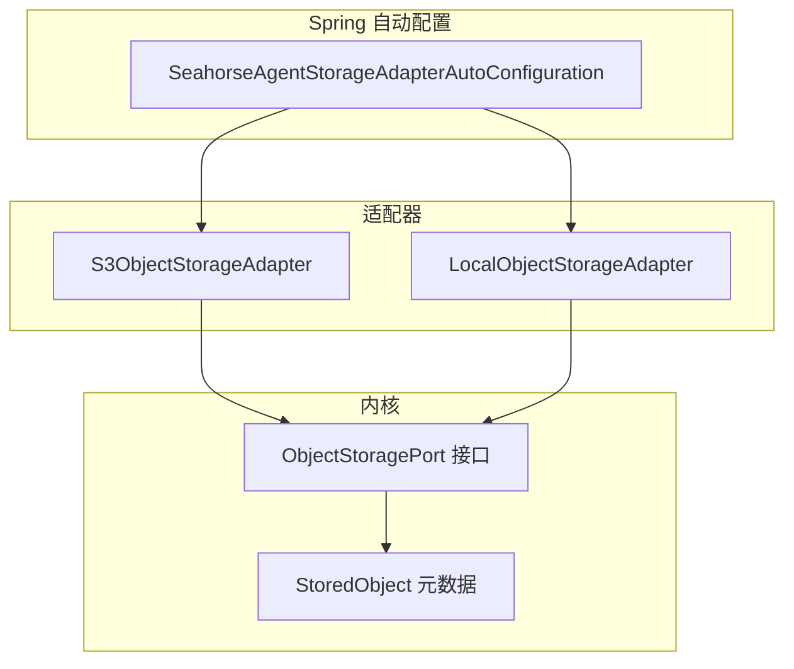
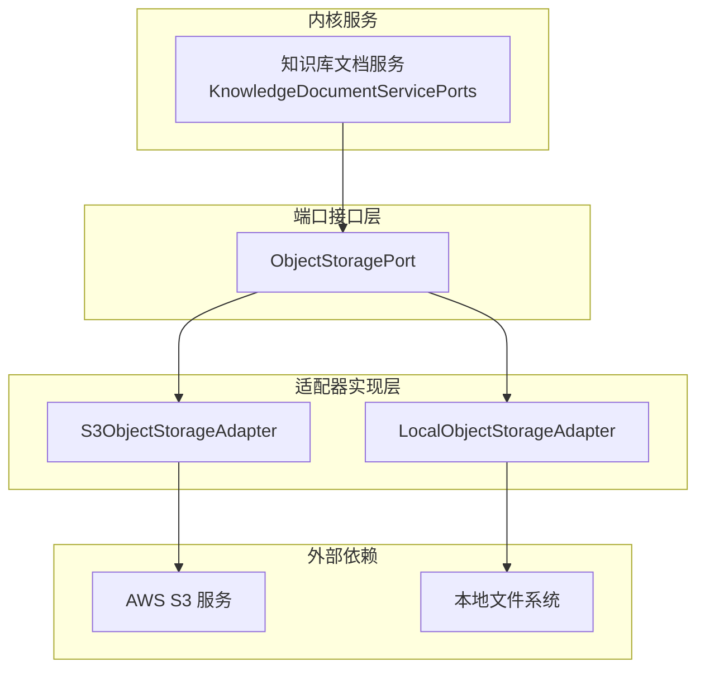
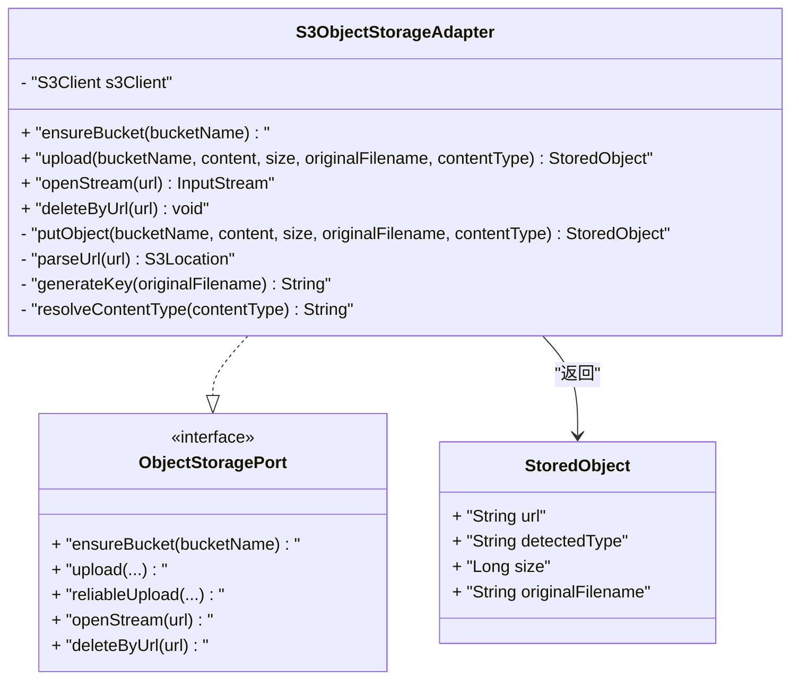
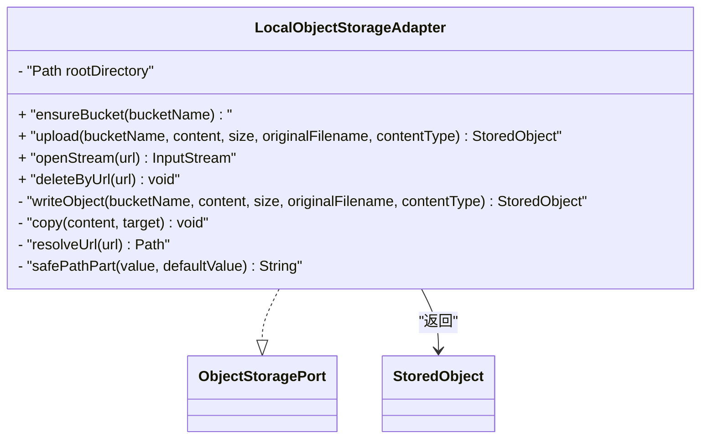
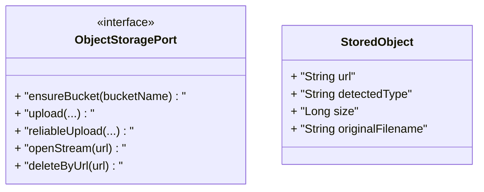
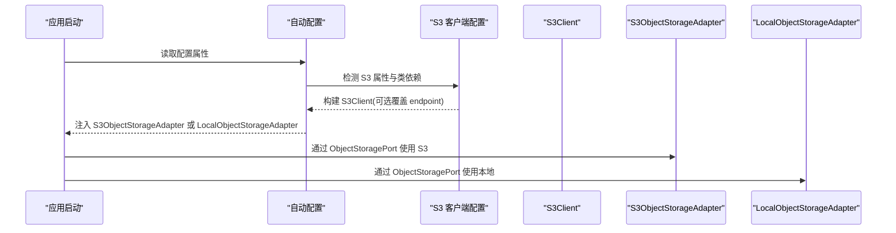
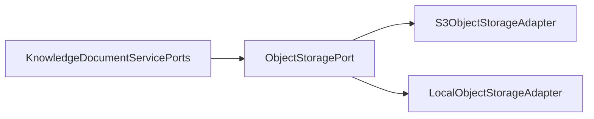
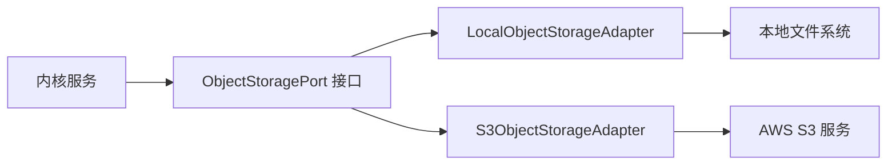

# 存储适配器

<cite>
**本文引用的文件**
- [S3ObjectStorageAdapter.java](file://seahorse-agent-adapter-storage-s3/src/main/java/com/miracle/ai/seahorse/agent/adapters/storage/s3/S3ObjectStorageAdapter.java)
- [LocalObjectStorageAdapter.java](file://seahorse-agent-adapter-storage-local/src/main/java/com/miracle/ai/seahorse/agent/adapters/storage/local/LocalObjectStorageAdapter.java)
- [ObjectStoragePort.java](file://seahorse-agent-kernel/src/main/java/com/miracle/ai/seahorse/agent/ports/outbound/storage/ObjectStoragePort.java)
- [StoredObject.java](file://seahorse-agent-kernel/src/main/java/com/miracle/ai/seahorse/agent/ports/outbound/storage/StoredObject.java)
- [SeahorseAgentStorageAdapterAutoConfiguration.java](file://seahorse-agent-spring-boot-starter/src/main/java/com/miracle/ai/seahorse/agent/adapters/spring/SeahorseAgentStorageAdapterAutoConfiguration.java)
- [application.properties](file://seahorse-agent-spring-boot-starter/src/main/resources/application.properties)
- [存储适配器.md](file://docs/zh/content/后端系统/适配器模块/存储适配器.md)
- [存储出站端口.md](file://docs/zh/content/后端系统/核心内核/端口接口/出站端口/存储出站端口.md)
- [KnowledgeDocumentServicePorts.java](file://seahorse-agent-kernel/src/main/java/com/miracle/ai/seahorse/agent/kernel/application/knowledge/KnowledgeDocumentServicePorts.java)
</cite>

## 目录
1. [简介](#简介)
2. [项目结构](#项目结构)
3. [核心组件](#核心组件)
4. [架构总览](#架构总览)
5. [详细组件分析](#详细组件分析)
6. [依赖分析](#依赖分析)
7. [性能考虑](#性能考虑)
8. [故障排查指南](#故障排查指南)
9. [结论](#结论)
10. [附录](#附录)

## 简介
本技术文档系统性阐述“存储适配器”的设计与实现，聚焦对象存储统一接口与两种具体适配器：Amazon S3 对象存储适配器与本地文件系统对象存储适配器。文档覆盖以下主题：
- 统一接口设计与职责边界
- 文件上传、下载、删除与元数据封装
- 配置参数、访问权限与安全机制
- 性能优化、断点续传与批量操作能力现状与建议
- 成本优化、生命周期管理与灾难恢复策略
- 在不同环境中的选型建议

## 项目结构
存储适配器位于独立的适配器模块中，并通过 Spring Boot 自动配置注入到内核服务中：
- 接口与模型定义位于内核模块，确保领域无关的抽象
- S3 适配器与本地适配器分别实现统一接口
- Spring 自动配置根据属性选择启用对应适配器

**图表来源**
- [ObjectStoragePort.java:25-55](file://seahorse-agent-kernel/src/main/java/com/miracle/ai/seahorse/agent/ports/outbound/storage/ObjectStoragePort.java#L25-L55)
- [StoredObject.java:28](file://seahorse-agent-kernel/src/main/java/com/miracle/ai/seahorse/agent/ports/outbound/storage/StoredObject.java#L28)
- [S3ObjectStorageAdapter.java:37-145](file://seahorse-agent-adapter-storage-s3/src/main/java/com/miracle/ai/seahorse/agent/adapters/storage/s3/S3ObjectStorageAdapter.java#L37-L145)
- [LocalObjectStorageAdapter.java:34-122](file://seahorse-agent-adapter-storage-local/src/main/java/com/miracle/ai/seahorse/agent/adapters/storage/local/LocalObjectStorageAdapter.java#L34-L122)
- [SeahorseAgentStorageAdapterAutoConfiguration.java:49-99](file://seahorse-agent-spring-boot-starter/src/main/java/com/miracle/ai/seahorse/agent/adapters/spring/SeahorseAgentStorageAdapterAutoConfiguration.java#L49-L99)

**章节来源**
- [存储适配器.md:37-63](file://docs/zh/content/后端系统/适配器模块/存储适配器.md#L37-L63)

## 核心组件
- ObjectStoragePort 接口：定义统一的存储能力，包括确保存储空间存在、上传、可靠上传、打开流与按 URL 删除。
- StoredObject 元数据：封装对象访问 URL、检测到的内容类型、大小与原始文件名。
- S3ObjectStorageAdapter：基于 AWS SDK 的 S3 实现，支持桶创建、对象上传、按 URL 下载与删除。
- LocalObjectStorageAdapter：基于本地文件系统的实现，支持目录创建、对象写入、按 URL 打开与删除。

**章节来源**
- [ObjectStoragePort.java:25-55](file://seahorse-agent-kernel/src/main/java/com/miracle/ai/seahorse/agent/ports/outbound/storage/ObjectStoragePort.java#L25-L55)
- [StoredObject.java:28](file://seahorse-agent-kernel/src/main/java/com/miracle/ai/seahorse/agent/ports/outbound/storage/StoredObject.java#L28)
- [S3ObjectStorageAdapter.java:37-145](file://seahorse-agent-adapter-storage-s3/src/main/java/com/miracle/ai/seahorse/agent/adapters/storage/s3/S3ObjectStorageAdapter.java#L37-L145)
- [LocalObjectStorageAdapter.java:34-122](file://seahorse-agent-adapter-storage-local/src/main/java/com/miracle/ai/seahorse/agent/adapters/storage/local/LocalObjectStorageAdapter.java#L34-L122)

## 架构总览
存储适配器采用“端口接口 + 多实现 + 自动配置”的分层架构：
- 内核仅依赖 ObjectStoragePort 接口，屏蔽具体存储实现差异
- 适配器仅依赖必要的外部 SDK 或文件系统 API，职责单一
- Spring 自动配置根据属性动态注入合适的实现

**图表来源**
- [KnowledgeDocumentServicePorts.java:31-48](file://seahorse-agent-kernel/src/main/java/com/miracle/ai/seahorse/agent/kernel/application/knowledge/KnowledgeDocumentServicePorts.java#L31-L48)
- [ObjectStoragePort.java:25-55](file://seahorse-agent-kernel/src/main/java/com/miracle/ai/seahorse/agent/ports/outbound/storage/ObjectStoragePort.java#L25-L55)
- [S3ObjectStorageAdapter.java:37-145](file://seahorse-agent-adapter-storage-s3/src/main/java/com/miracle/ai/seahorse/agent/adapters/storage/s3/S3ObjectStorageAdapter.java#L37-L145)
- [LocalObjectStorageAdapter.java:34-122](file://seahorse-agent-adapter-storage-local/src/main/java/com/miracle/ai/seahorse/agent/adapters/storage/local/LocalObjectStorageAdapter.java#L34-L122)

## 详细组件分析

### S3 对象存储适配器
- 功能特性
  - 确保存储桶存在：支持幂等创建，处理“已由当前账户持有”与“其他账户已占用”的异常分支
  - 上传：生成唯一键，设置内容类型，返回 StoredObject 元数据
  - 下载：解析 s3:// URL，按桶与键获取对象流
  - 删除：解析 s3:// URL 并删除对象
- 安全与合规
  - 支持通过 endpoint、region、静态凭证配置 S3Client
  - 建议使用 IAM 角色与最小权限策略，启用服务端/客户端加密
- URL 与键生成
  - URL 前缀为 s3://，键由 UUID 与可选后缀组成
  - 当原始文件名无后缀时，键仅包含 UUID

**图表来源**
- [S3ObjectStorageAdapter.java:37-145](file://seahorse-agent-adapter-storage-s3/src/main/java/com/miracle/ai/seahorse/agent/adapters/storage/s3/S3ObjectStorageAdapter.java#L37-L145)
- [ObjectStoragePort.java:25-55](file://seahorse-agent-kernel/src/main/java/com/miracle/ai/seahorse/agent/ports/outbound/storage/ObjectStoragePort.java#L25-L55)
- [StoredObject.java:28](file://seahorse-agent-kernel/src/main/java/com/miracle/ai/seahorse/agent/ports/outbound/storage/StoredObject.java#L28)

**章节来源**
- [S3ObjectStorageAdapter.java:47-96](file://seahorse-agent-adapter-storage-s3/src/main/java/com/miracle/ai/seahorse/agent/adapters/storage/s3/S3ObjectStorageAdapter.java#L47-L96)
- [S3ObjectStorageAdapter.java:98-145](file://seahorse-agent-adapter-storage-s3/src/main/java/com/miracle/ai/seahorse/agent/adapters/storage/s3/S3ObjectStorageAdapter.java#L98-L145)

### 本地对象存储适配器
- 功能特性
  - 确保存储目录存在：在根目录下按桶名创建子目录
  - 上传：生成 UUID-前缀文件名，复制输入流到目标路径
  - 下载：解析 local:// URL，校验路径不逃逸根目录
  - 删除：删除指定路径文件
- 安全与路径保护
  - 路径规范化与逃逸检测，防止目录穿越
  - 建议运行用户具备根目录读写权限
- URL 与命名
  - URL 前缀为 local://，键为 UUID-原始文件名

**图表来源**
- [LocalObjectStorageAdapter.java:34-122](file://seahorse-agent-adapter-storage-local/src/main/java/com/miracle/ai/seahorse/agent/adapters/storage/local/LocalObjectStorageAdapter.java#L34-L122)
- [ObjectStoragePort.java:25-55](file://seahorse-agent-kernel/src/main/java/com/miracle/ai/seahorse/agent/ports/outbound/storage/ObjectStoragePort.java#L25-L55)
- [StoredObject.java:28](file://seahorse-agent-kernel/src/main/java/com/miracle/ai/seahorse/agent/ports/outbound/storage/StoredObject.java#L28)

**章节来源**
- [LocalObjectStorageAdapter.java:49-112](file://seahorse-agent-adapter-storage-local/src/main/java/com/miracle/ai/seahorse/agent/adapters/storage/local/LocalObjectStorageAdapter.java#L49-L112)

### 接口与元数据模型
- ObjectStoragePort
  - ensureBucket：默认空实现，适配器可覆盖以兼容“创建知识库即创建存储空间”
  - upload/reliableUpload：上传接口；reliableUpload 默认委托 upload
  - openStream/deleteByUrl：按 URL 进行读取与删除
- StoredObject
  - 封装对象 URL、检测到的内容类型、大小与原始文件名

**图表来源**
- [ObjectStoragePort.java:25-55](file://seahorse-agent-kernel/src/main/java/com/miracle/ai/seahorse/agent/ports/outbound/storage/ObjectStoragePort.java#L25-L55)
- [StoredObject.java:28](file://seahorse-agent-kernel/src/main/java/com/miracle/ai/seahorse/agent/ports/outbound/storage/StoredObject.java#L28)

**章节来源**
- [ObjectStoragePort.java:25-55](file://seahorse-agent-kernel/src/main/java/com/miracle/ai/seahorse/agent/ports/outbound/storage/ObjectStoragePort.java#L25-L55)
- [StoredObject.java:28](file://seahorse-agent-kernel/src/main/java/com/miracle/ai/seahorse/agent/ports/outbound/storage/StoredObject.java#L28)

### Spring 自动配置与集成
- 自动配置条件
  - 本地适配器：属性 seahorse-agent.adapters.storage.type=local
  - S3 适配器：属性 seahorse-agent.adapters.storage.type=s3，且存在 S3Client 类
- S3 客户端配置
  - 支持 endpoint、access-key、secret-key、region 参数
  - 默认启用路径风格访问，可选覆盖 endpoint
- 注入与使用
  - 当 ObjectStoragePort Bean 不存在时，自动装配对应适配器
  - 内核服务通过依赖注入使用 ObjectStoragePort

**图表来源**
- [SeahorseAgentStorageAdapterAutoConfiguration.java:49-99](file://seahorse-agent-spring-boot-starter/src/main/java/com/miracle/ai/seahorse/agent/adapters/spring/SeahorseAgentStorageAdapterAutoConfiguration.java#L49-L99)

**章节来源**
- [SeahorseAgentStorageAdapterAutoConfiguration.java:51-97](file://seahorse-agent-spring-boot-starter/src/main/java/com/miracle/ai/seahorse/agent/adapters/spring/SeahorseAgentStorageAdapterAutoConfiguration.java#L51-L97)
- [application.properties:1-8](file://seahorse-agent-spring-boot-starter/src/main/resources/application.properties#L1-L8)

### 业务集成点
- 知识库文档服务通过组合 ObjectStoragePort，在文档入库流程中完成对象存储环节
- 该模式确保内核服务与具体存储实现解耦，便于替换与扩展

**图表来源**
- [KnowledgeDocumentServicePorts.java:31-48](file://seahorse-agent-kernel/src/main/java/com/miracle/ai/seahorse/agent/kernel/application/knowledge/KnowledgeDocumentServicePorts.java#L31-L48)

**章节来源**
- [KnowledgeDocumentServicePorts.java:31-48](file://seahorse-agent-kernel/src/main/java/com/miracle/ai/seahorse/agent/kernel/application/knowledge/KnowledgeDocumentServicePorts.java#L31-L48)

## 依赖分析
- 内聚与耦合
  - ObjectStoragePort 作为稳定接口，向上游屏蔽存储实现差异，降低耦合
  - 适配器仅依赖接口与必要的外部 SDK/文件系统 API，职责单一
- 外部依赖
  - S3 适配器依赖 AWS SDK；本地适配器依赖 Java NIO
- 循环依赖
  - 未发现循环依赖迹象，接口与实现分离清晰

**图表来源**
- [ObjectStoragePort.java:25-55](file://seahorse-agent-kernel/src/main/java/com/miracle/ai/seahorse/agent/ports/outbound/storage/ObjectStoragePort.java#L25-L55)
- [LocalObjectStorageAdapter.java:34-122](file://seahorse-agent-adapter-storage-local/src/main/java/com/miracle/ai/seahorse/agent/adapters/storage/local/LocalObjectStorageAdapter.java#L34-L122)
- [S3ObjectStorageAdapter.java:37-145](file://seahorse-agent-adapter-storage-s3/src/main/java/com/miracle/ai/seahorse/agent/adapters/storage/s3/S3ObjectStorageAdapter.java#L37-L145)

**章节来源**
- [ObjectStoragePort.java:25-55](file://seahorse-agent-kernel/src/main/java/com/miracle/ai/seahorse/agent/ports/outbound/storage/ObjectStoragePort.java#L25-L55)
- [LocalObjectStorageAdapter.java:34-122](file://seahorse-agent-adapter-storage-local/src/main/java/com/miracle/ai/seahorse/agent/adapters/storage/local/LocalObjectStorageAdapter.java#L34-L122)
- [S3ObjectStorageAdapter.java:37-145](file://seahorse-agent-adapter-storage-s3/src/main/java/com/miracle/ai/seahorse/agent/adapters/storage/s3/S3ObjectStorageAdapter.java#L37-L145)

## 性能考虑
- 上传策略
  - 本地：一次性复制写入，避免小块多次 IO；建议在上层控制并发与缓冲区大小
  - S3：SDK 默认分块策略，建议根据网络与对象大小调整传输参数（如分块大小、并发数）
- 流式读取
  - openStream 返回 InputStream，适合边读边处理，减少内存峰值
- 可靠性
  - 可靠上传接口预留扩展空间；当前与普通上传一致，建议在适配器层增加断点续传或校验机制
- 缓存与索引
  - 建议结合对象 URL 与元数据建立轻量缓存，减少重复解析与查询

**章节来源**
- [存储出站端口.md:282-292](file://docs/zh/content/后端系统/核心内核/端口接口/出站端口/存储出站端口.md#L282-L292)

## 故障排查指南
- 本地适配器常见问题
  - URL 不以 local:// 开头：抛出非法参数异常，检查 URL 构造是否正确
  - 路径逃逸：URL 解析时会校验是否逃逸根目录，避免目录穿越，检查 URL 是否包含父级路径
  - 创建目录失败：ensureBucket 抛出非法状态异常，检查权限与磁盘空间
- S3 适配器常见问题
  - 存储桶已存在但非当前账户持有：抛出非法状态异常，检查账户与区域配置
  - URL scheme 非 s3：抛出非法参数异常，确认 URL 格式
  - 上传内容类型为空：使用默认类型，建议上层明确设置
- 通用排查
  - 确认自动装配是否按预期选择了本地或 S3 适配器
  - 检查配置项是否正确（如本地根目录路径、S3 凭证与区域）

**章节来源**
- [存储出站端口.md:293-304](file://docs/zh/content/后端系统/核心内核/端口接口/出站端口/存储出站端口.md#L293-L304)

## 结论
存储适配器通过统一接口与清晰的自动配置机制，实现了对多种存储后端的无缝替换与扩展。S3 适配器面向生产环境与云原生部署，本地适配器面向开发与测试场景。结合合理的安全策略、性能优化与运维策略，可在不同环境中获得稳定、高效与可维护的对象存储能力。

## 附录
- 配置参数与启用方式
  - 启用 S3 适配器：条件为存在 S3Client Bean 且属性 seahorse-agent.adapters.storage.type=s3；行为为自动装配 S3ObjectStorageAdapter
  - 启用本地适配器：条件为属性 seahorse-agent.adapters.storage.type=local；行为为自动装配 LocalObjectStorageAdapter，并支持自定义根目录路径
  - 内核服务注入：内核自动配置在满足依赖时注入 ObjectStoragePort，供知识库与文档服务使用
- 访问权限与安全机制
  - S3：凭证与区域由 S3Client 配置决定；建议使用 IAM 角色或最小权限策略；可启用服务端加密与客户端加密；通过存储桶策略与 IAM 策略限制访问范围
  - 本地：文件系统权限需确保运行用户对根目录具有读写权限；已内置路径规范化与逃逸检测，避免目录穿越
- 生命周期管理与灾难恢复
  - 生命周期管理：S3 可配置生命周期规则（如过渡到低频/归档存储、过期删除）以降低成本；本地可通过外部工具定期清理过期文件或迁移至归档位置
  - 灾难恢复：S3 启用跨区复制与版本控制，定期备份关键数据；本地建议将存储根目录置于可备份的持久化卷，并制定快照与异地备份策略
- 断点续传与批量操作建议
  - 断点续传：S3 实现多段上传（Multipart Upload），记录已上传分片，失败后仅重传缺失分片；本地记录已写入偏移，重启后继续写入
  - 批量操作：扩展 ObjectStoragePort 提供批量上传/删除方法，或在上层聚合请求；注意幂等性与去重，避免重复写入

**章节来源**
- [存储适配器.md:281-330](file://docs/zh/content/后端系统/适配器模块/存储适配器.md#L281-L330)