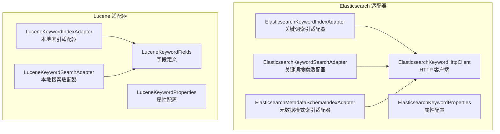
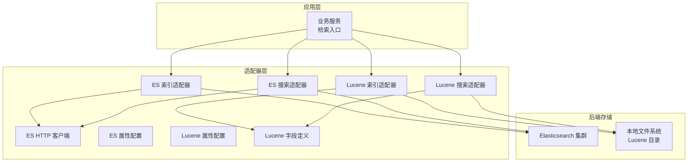
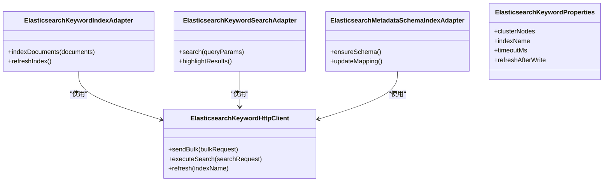
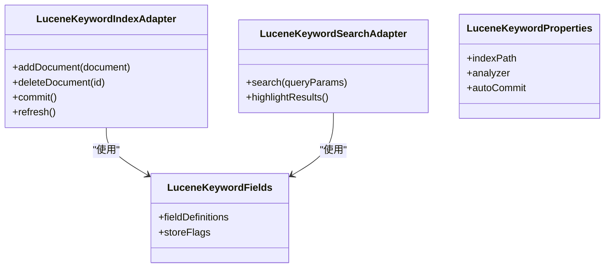
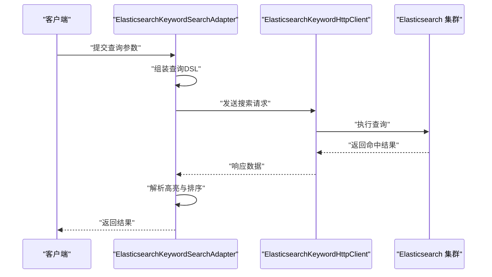
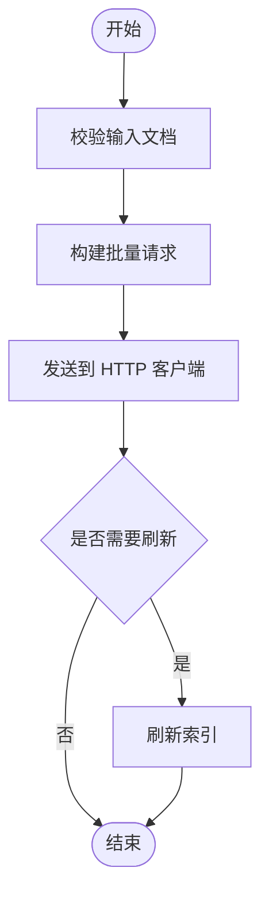
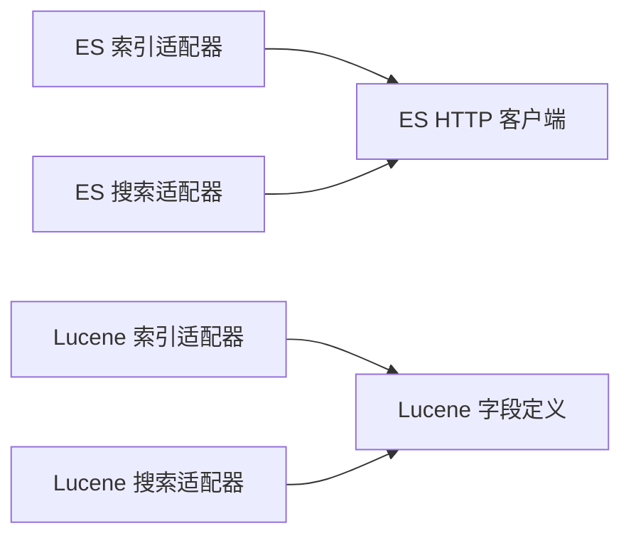

# 搜索适配器

<cite>
**本文引用的文件**
- [ElasticsearchKeywordIndexAdapter.java](file://seahorse-agent-adapter-search-elasticsearch/src/main/java/com/miracle/ai/seahorse/agent/adapters/search/elasticsearch/ElasticsearchKeywordIndexAdapter.java)
- [ElasticsearchKeywordSearchAdapter.java](file://seahorse-agent-adapter-search-elasticsearch/src/main/java/com/miracle/ai/seahorse/agent/adapters/search/elasticsearch/ElasticsearchKeywordSearchAdapter.java)
- [ElasticsearchKeywordHttpClient.java](file://seahorse-agent-adapter-search-elasticsearch/src/main/java/com/miracle/ai/seahorse/agent/adapters/search/elasticsearch/ElasticsearchKeywordHttpClient.java)
- [ElasticsearchKeywordProperties.java](file://seahorse-agent-adapter-search-elasticsearch/src/main/java/com/miracle/ai/seahorse/agent/adapters/search/elasticsearch/ElasticsearchKeywordProperties.java)
- [ElasticsearchMetadataSchemaIndexAdapter.java](file://seahorse-agent-adapter-search-elasticsearch/src/main/java/com/miracle/ai/seahorse/agent/adapters/search/elasticsearch/ElasticsearchMetadataSchemaIndexAdapter.java)
- [LuceneKeywordIndexAdapter.java](file://seahorse-agent-adapter-search-lucene/src/main/java/com/miracle/ai/seahorse/agent/adapters/search/lucene/LuceneKeywordIndexAdapter.java)
- [LuceneKeywordSearchAdapter.java](file://seahorse-agent-adapter-search-lucene/src/main/java/com/miracle/ai/seahorse/agent/adapters/search/lucene/LuceneKeywordSearchAdapter.java)
- [LuceneKeywordProperties.java](file://seahorse-agent-adapter-search-lucene/src/main/java/com/miracle/ai/seahorse/agent/adapters/search/lucene/LuceneKeywordProperties.java)
- [LuceneKeywordFields.java](file://seahorse-agent-adapter-search-lucene/src/main/java/com/miracle/ai/seahorse/agent/adapters/search/lucene/LuceneKeywordFields.java)
- [ElasticsearchKeywordIndexAdapterTests.java](file://seahorse-agent-adapter-search-elasticsearch/src/test/java/com/miracle/ai/seahorse/agent/adapters/search/elasticsearch/ElasticsearchKeywordIndexAdapterTests.java)
- [ElasticsearchKeywordSearchAdapterTests.java](file://seahorse-agent-adapter-search-elasticsearch/src/test/java/com/miracle/ai/seahorse/agent/adapters/search/elasticsearch/ElasticsearchKeywordSearchAdapterTests.java)
- [ElasticsearchMetadataSchemaIndexAdapterTests.java](file://seahorse-agent-adapter-search-elasticsearch/src/test/java/com/miracle/ai/seahorse/agent/adapters/search/elasticsearch/ElasticsearchMetadataSchemaIndexAdapterTests.java)
- [LuceneKeywordAdapterTests.java](file://seahorse-agent-adapter-search-lucene/src/test/java/com/miracle/ai/seahorse/agent/adapters/search/lucene/LuceneKeywordAdapterTests.java)
</cite>

## 目录
1. [简介](#简介)
2. [项目结构](#项目结构)
3. [核心组件](#核心组件)
4. [架构总览](#架构总览)
5. [详细组件分析](#详细组件分析)
6. [依赖关系分析](#依赖关系分析)
7. [性能考虑](#性能考虑)
8. [故障排查指南](#故障排查指南)
9. [结论](#结论)
10. [附录](#附录)

## 简介
本文件面向“搜索适配器”的技术文档，聚焦于两种搜索引擎实现：Elasticsearch 搜索适配器与 Lucene 搜索适配器。内容涵盖关键词索引、全文搜索、搜索结果排序与高亮显示等核心能力；阐述配置参数、索引策略与查询优化技术；提供集成示例与性能调优建议，并说明与核心检索系统的协作机制及数据同步方式。文档同时给出监控、索引维护与查询性能分析的专业建议。

## 项目结构
搜索适配器位于独立模块中，分别提供 Elasticsearch 与 Lucene 的实现，二者均遵循统一的适配器接口风格，便于在不同运行环境中灵活切换。

**图表来源**
- [ElasticsearchKeywordIndexAdapter.java:1-200](file://seahorse-agent-adapter-search-elasticsearch/src/main/java/com/miracle/ai/seahorse/agent/adapters/search/elasticsearch/ElasticsearchKeywordIndexAdapter.java#L1-L200)
- [ElasticsearchKeywordSearchAdapter.java:1-200](file://seahorse-agent-adapter-search-elasticsearch/src/main/java/com/miracle/ai/seahorse/agent/adapters/search/elasticsearch/ElasticsearchKeywordSearchAdapter.java#L1-L200)
- [ElasticsearchMetadataSchemaIndexAdapter.java:1-200](file://seahorse-agent-adapter-search-elasticsearch/src/main/java/com/miracle/ai/seahorse/agent/adapters/search/elasticsearch/ElasticsearchMetadataSchemaIndexAdapter.java#L1-L200)
- [ElasticsearchKeywordHttpClient.java:1-200](file://seahorse-agent-adapter-search-elasticsearch/src/main/java/com/miracle/ai/seahorse/agent/adapters/search/elasticsearch/ElasticsearchKeywordHttpClient.java#L1-L200)
- [ElasticsearchKeywordProperties.java:1-200](file://seahorse-agent-adapter-search-elasticsearch/src/main/java/com/miracle/ai/seahorse/agent/adapters/search/elasticsearch/ElasticsearchKeywordProperties.java#L1-L200)
- [LuceneKeywordIndexAdapter.java:1-200](file://seahorse-agent-adapter-search-lucene/src/main/java/com/miracle/ai/seahorse/agent/adapters/search/lucene/LuceneKeywordIndexAdapter.java#L1-L200)
- [LuceneKeywordSearchAdapter.java:1-200](file://seahorse-agent-adapter-search-lucene/src/main/java/com/miracle/ai/seahorse/agent/adapters/search/lucene/LuceneKeywordSearchAdapter.java#L1-L200)
- [LuceneKeywordProperties.java:1-200](file://seahorse-agent-adapter-search-lucene/src/main/java/com/miracle/ai/seahorse/agent/adapters/search/lucene/LuceneKeywordProperties.java#L1-L200)
- [LuceneKeywordFields.java:1-200](file://seahorse-agent-adapter-search-lucene/src/main/java/com/miracle/ai/seahorse/agent/adapters/search/lucene/LuceneKeywordFields.java#L1-L200)

**章节来源**
- [ElasticsearchKeywordIndexAdapter.java:1-200](file://seahorse-agent-adapter-search-elasticsearch/src/main/java/com/miracle/ai/seahorse/agent/adapters/search/elasticsearch/ElasticsearchKeywordIndexAdapter.java#L1-L200)
- [LuceneKeywordIndexAdapter.java:1-200](file://seahorse-agent-adapter-search-lucene/src/main/java/com/miracle/ai/seahorse/agent/adapters/search/lucene/LuceneKeywordIndexAdapter.java#L1-L200)

## 核心组件
- Elasticsearch 关键词索引适配器：负责将文档写入 Elasticsearch，支持批量写入、映射管理与刷新控制。
- Elasticsearch 关键词搜索适配器：负责关键词检索、全文匹配、排序与高亮返回。
- Elasticsearch 元数据模式索引适配器：负责元数据模式（schema）的索引与更新。
- Elasticsearch 关键词 HTTP 客户端：封装底层 HTTP 请求，处理连接、超时与重试策略。
- Elasticsearch 关键词属性配置：集中管理连接地址、索引名称、分片副本、请求超时等参数。
- Lucene 关键词索引适配器：基于本地文件系统构建与维护倒排索引，适合单机或轻量部署。
- Lucene 关键词搜索适配器：提供本地全文检索、排序与高亮。
- Lucene 属性配置与字段定义：定义字段类型、分词策略与存储选项。

**章节来源**
- [ElasticsearchKeywordIndexAdapter.java:1-200](file://seahorse-agent-adapter-search-elasticsearch/src/main/java/com/miracle/ai/seahorse/agent/adapters/search/elasticsearch/ElasticsearchKeywordIndexAdapter.java#L1-L200)
- [ElasticsearchKeywordSearchAdapter.java:1-200](file://seahorse-agent-adapter-search-elasticsearch/src/main/java/com/miracle/ai/seahorse/agent/adapters/search/elasticsearch/ElasticsearchKeywordSearchAdapter.java#L1-L200)
- [ElasticsearchMetadataSchemaIndexAdapter.java:1-200](file://seahorse-agent-adapter-search-elasticsearch/src/main/java/com/miracle/ai/seahorse/agent/adapters/search/elasticsearch/ElasticsearchMetadataSchemaIndexAdapter.java#L1-L200)
- [LuceneKeywordIndexAdapter.java:1-200](file://seahorse-agent-adapter-search-lucene/src/main/java/com/miracle/ai/seahorse/agent/adapters/search/lucene/LuceneKeywordIndexAdapter.java#L1-L200)
- [LuceneKeywordSearchAdapter.java:1-200](file://seahorse-agent-adapter-search-lucene/src/main/java/com/miracle/ai/seahorse/agent/adapters/search/lucene/LuceneKeywordSearchAdapter.java#L1-L200)

## 架构总览
两种适配器均遵循“索引-查询”双通道架构，通过统一的属性配置与客户端抽象，实现可插拔的搜索引擎替换。

**图表来源**
- [ElasticsearchKeywordIndexAdapter.java:1-200](file://seahorse-agent-adapter-search-elasticsearch/src/main/java/com/miracle/ai/seahorse/agent/adapters/search/elasticsearch/ElasticsearchKeywordIndexAdapter.java#L1-L200)
- [ElasticsearchKeywordSearchAdapter.java:1-200](file://seahorse-agent-adapter-search-elasticsearch/src/main/java/com/miracle/ai/seahorse/agent/adapters/search/elasticsearch/ElasticsearchKeywordSearchAdapter.java#L1-L200)
- [ElasticsearchKeywordHttpClient.java:1-200](file://seahorse-agent-adapter-search-elasticsearch/src/main/java/com/miracle/ai/seahorse/agent/adapters/search/elasticsearch/ElasticsearchKeywordHttpClient.java#L1-L200)
- [ElasticsearchKeywordProperties.java:1-200](file://seahorse-agent-adapter-search-elasticsearch/src/main/java/com/miracle/ai/seahorse/agent/adapters/search/elasticsearch/ElasticsearchKeywordProperties.java#L1-L200)
- [LuceneKeywordIndexAdapter.java:1-200](file://seahorse-agent-adapter-search-lucene/src/main/java/com/miracle/ai/seahorse/agent/adapters/search/lucene/LuceneKeywordIndexAdapter.java#L1-L200)
- [LuceneKeywordSearchAdapter.java:1-200](file://seahorse-agent-adapter-search-lucene/src/main/java/com/miracle/ai/seahorse/agent/adapters/search/lucene/LuceneKeywordSearchAdapter.java#L1-L200)
- [LuceneKeywordProperties.java:1-200](file://seahorse-agent-adapter-search-lucene/src/main/java/com/miracle/ai/seahorse/agent/adapters/search/lucene/LuceneKeywordProperties.java#L1-L200)
- [LuceneKeywordFields.java:1-200](file://seahorse-agent-adapter-search-lucene/src/main/java/com/miracle/ai/seahorse/agent/adapters/search/lucene/LuceneKeywordFields.java#L1-L200)

## 详细组件分析

### Elasticsearch 搜索适配器
- 关键词索引适配器
  - 职责：接收文档，构造批量请求，调用 HTTP 客户端写入 ES；支持映射初始化与刷新控制。
  - 处理流程：校验输入 -> 构建 Bulk 请求 -> 发送请求 -> 刷新索引 -> 返回结果。
  - 性能要点：批量大小、并发度、刷新策略。
- 关键词搜索适配器
  - 职责：构建查询 DSL，执行搜索，解析排序与高亮字段，返回结果集。
  - 处理流程：解析查询条件 -> 组装查询体 -> 执行查询 -> 解析高亮 -> 返回结果。
  - 性能要点：查询缓存、字段选择、分页与排序成本。
- 元数据模式索引适配器
  - 职责：维护 schema 映射，确保字段类型与分析器一致。
  - 处理流程：检查映射 -> 更新映射 -> 刷新。
- HTTP 客户端
  - 职责：封装连接、超时、重试与错误处理。
  - 性能要点：连接池、超时设置、重试退避。
- 属性配置
  - 职责：集中管理 ES 地址、索引名、分片副本、超时等参数。

**图表来源**
- [ElasticsearchKeywordIndexAdapter.java:1-200](file://seahorse-agent-adapter-search-elasticsearch/src/main/java/com/miracle/ai/seahorse/agent/adapters/search/elasticsearch/ElasticsearchKeywordIndexAdapter.java#L1-L200)
- [ElasticsearchKeywordSearchAdapter.java:1-200](file://seahorse-agent-adapter-search-elasticsearch/src/main/java/com/miracle/ai/seahorse/agent/adapters/search/elasticsearch/ElasticsearchKeywordSearchAdapter.java#L1-L200)
- [ElasticsearchMetadataSchemaIndexAdapter.java:1-200](file://seahorse-agent-adapter-search-elasticsearch/src/main/java/com/miracle/ai/seahorse/agent/adapters/search/elasticsearch/ElasticsearchMetadataSchemaIndexAdapter.java#L1-L200)
- [ElasticsearchKeywordHttpClient.java:1-200](file://seahorse-agent-adapter-search-elasticsearch/src/main/java/com/miracle/ai/seahorse/agent/adapters/search/elasticsearch/ElasticsearchKeywordHttpClient.java#L1-L200)
- [ElasticsearchKeywordProperties.java:1-200](file://seahorse-agent-adapter-search-elasticsearch/src/main/java/com/miracle/ai/seahorse/agent/adapters/search/elasticsearch/ElasticsearchKeywordProperties.java#L1-L200)

**章节来源**
- [ElasticsearchKeywordIndexAdapter.java:1-200](file://seahorse-agent-adapter-search-elasticsearch/src/main/java/com/miracle/ai/seahorse/agent/adapters/search/elasticsearch/ElasticsearchKeywordIndexAdapter.java#L1-L200)
- [ElasticsearchKeywordSearchAdapter.java:1-200](file://seahorse-agent-adapter-search-elasticsearch/src/main/java/com/miracle/ai/seahorse/agent/adapters/search/elasticsearch/ElasticsearchKeywordSearchAdapter.java#L1-L200)
- [ElasticsearchMetadataSchemaIndexAdapter.java:1-200](file://seahorse-agent-adapter-search-elasticsearch/src/main/java/com/miracle/ai/seahorse/agent/adapters/search/elasticsearch/ElasticsearchMetadataSchemaIndexAdapter.java#L1-L200)
- [ElasticsearchKeywordHttpClient.java:1-200](file://seahorse-agent-adapter-search-elasticsearch/src/main/java/com/miracle/ai/seahorse/agent/adapters/search/elasticsearch/ElasticsearchKeywordHttpClient.java#L1-L200)
- [ElasticsearchKeywordProperties.java:1-200](file://seahorse-agent-adapter-search-elasticsearch/src/main/java/com/miracle/ai/seahorse/agent/adapters/search/elasticsearch/ElasticsearchKeywordProperties.java#L1-L200)

### Lucene 搜索适配器
- 关键词索引适配器
  - 职责：将文档写入本地 Lucene 目录，支持添加、删除与更新。
  - 处理流程：打开目录 -> 写入文档 -> 提交 -> 刷新。
- 关键词搜索适配器
  - 职责：基于本地索引执行全文检索、排序与高亮。
  - 处理流程：创建 IndexReader -> 创建 IndexSearcher -> 执行查询 -> 解析高亮 -> 返回结果。
- 属性配置与字段定义
  - 职责：定义字段类型、分词器、存储与可搜索性；集中管理索引路径与分析器。

**图表来源**
- [LuceneKeywordIndexAdapter.java:1-200](file://seahorse-agent-adapter-search-lucene/src/main/java/com/miracle/ai/seahorse/agent/adapters/search/lucene/LuceneKeywordIndexAdapter.java#L1-L200)
- [LuceneKeywordSearchAdapter.java:1-200](file://seahorse-agent-adapter-search-lucene/src/main/java/com/miracle/ai/seahorse/agent/adapters/search/lucene/LuceneKeywordSearchAdapter.java#L1-L200)
- [LuceneKeywordProperties.java:1-200](file://seahorse-agent-adapter-search-lucene/src/main/java/com/miracle/ai/seahorse/agent/adapters/search/lucene/LuceneKeywordProperties.java#L1-L200)
- [LuceneKeywordFields.java:1-200](file://seahorse-agent-adapter-search-lucene/src/main/java/com/miracle/ai/seahorse/agent/adapters/search/lucene/LuceneKeywordFields.java#L1-L200)

**章节来源**
- [LuceneKeywordIndexAdapter.java:1-200](file://seahorse-agent-adapter-search-lucene/src/main/java/com/miracle/ai/seahorse/agent/adapters/search/lucene/LuceneKeywordIndexAdapter.java#L1-L200)
- [LuceneKeywordSearchAdapter.java:1-200](file://seahorse-agent-adapter-search-lucene/src/main/java/com/miracle/ai/seahorse/agent/adapters/search/lucene/LuceneKeywordSearchAdapter.java#L1-L200)
- [LuceneKeywordProperties.java:1-200](file://seahorse-agent-adapter-search-lucene/src/main/java/com/miracle/ai/seahorse/agent/adapters/search/lucene/LuceneKeywordProperties.java#L1-L200)
- [LuceneKeywordFields.java:1-200](file://seahorse-agent-adapter-search-lucene/src/main/java/com/miracle/ai/seahorse/agent/adapters/search/lucene/LuceneKeywordFields.java#L1-L200)

### 查询流程与高亮序列图（以 Elasticsearch 为例）

**图表来源**
- [ElasticsearchKeywordSearchAdapter.java:1-200](file://seahorse-agent-adapter-search-elasticsearch/src/main/java/com/miracle/ai/seahorse/agent/adapters/search/elasticsearch/ElasticsearchKeywordSearchAdapter.java#L1-L200)
- [ElasticsearchKeywordHttpClient.java:1-200](file://seahorse-agent-adapter-search-elasticsearch/src/main/java/com/miracle/ai/seahorse/agent/adapters/search/elasticsearch/ElasticsearchKeywordHttpClient.java#L1-L200)

### 索引流程（以 Elasticsearch 为例）

**图表来源**
- [ElasticsearchKeywordIndexAdapter.java:1-200](file://seahorse-agent-adapter-search-elasticsearch/src/main/java/com/miracle/ai/seahorse/agent/adapters/search/elasticsearch/ElasticsearchKeywordIndexAdapter.java#L1-L200)
- [ElasticsearchKeywordHttpClient.java:1-200](file://seahorse-agent-adapter-search-elasticsearch/src/main/java/com/miracle/ai/seahorse/agent/adapters/search/elasticsearch/ElasticsearchKeywordHttpClient.java#L1-L200)

## 依赖关系分析
- 低耦合：适配器通过统一接口与属性配置解耦具体搜索引擎实现。
- 可替换性：通过属性配置即可切换 ES 与 Lucene 实现。
- 外部依赖：ES 适配器依赖 HTTP 客户端与集群；Lucene 适配器依赖本地文件系统与分析器。

**图表来源**
- [ElasticsearchKeywordIndexAdapter.java:1-200](file://seahorse-agent-adapter-search-elasticsearch/src/main/java/com/miracle/ai/seahorse/agent/adapters/search/elasticsearch/ElasticsearchKeywordIndexAdapter.java#L1-L200)
- [ElasticsearchKeywordSearchAdapter.java:1-200](file://seahorse-agent-adapter-search-elasticsearch/src/main/java/com/miracle/ai/seahorse/agent/adapters/search/elasticsearch/ElasticsearchKeywordSearchAdapter.java#L1-L200)
- [LuceneKeywordIndexAdapter.java:1-200](file://seahorse-agent-adapter-search-lucene/src/main/java/com/miracle/ai/seahorse/agent/adapters/search/lucene/LuceneKeywordIndexAdapter.java#L1-L200)
- [LuceneKeywordSearchAdapter.java:1-200](file://seahorse-agent-adapter-search-lucene/src/main/java/com/miracle/ai/seahorse/agent/adapters/search/lucene/LuceneKeywordSearchAdapter.java#L1-L200)

**章节来源**
- [ElasticsearchKeywordProperties.java:1-200](file://seahorse-agent-adapter-search-elasticsearch/src/main/java/com/miracle/ai/seahorse/agent/adapters/search/elasticsearch/ElasticsearchKeywordProperties.java#L1-L200)
- [LuceneKeywordProperties.java:1-200](file://seahorse-agent-adapter-search-lucene/src/main/java/com/miracle/ai/seahorse/agent/adapters/search/lucene/LuceneKeywordProperties.java#L1-L200)

## 性能考虑
- 索引阶段
  - 批量写入：增大批量大小减少网络往返，但需平衡内存占用与失败重试成本。
  - 刷新策略：生产环境建议延迟刷新，结合定时任务或事件驱动刷新。
  - 映射预热：提前创建索引与映射，避免首次写入时的动态映射开销。
- 查询阶段
  - 查询缓存：合理利用字段值缓存与查询结果缓存（注意一致性）。
  - 字段投影：仅返回必要字段，减少传输与反序列化开销。
  - 分页与排序：避免深分页，优先使用游标或评分排序；对高基数字段排序进行限制。
- 客户端与网络
  - 连接池：复用连接，设置合理的最大连接数与空闲超时。
  - 超时与重试：区分读写超时，采用指数退避重试，避免雪崩。
- 本地 Lucene
  - 提交频率：根据写入吞吐调整提交间隔，兼顾恢复点与写入性能。
  - 分词器：选择合适的分词器与过滤器，减少无效 token。
  - 目录类型：在支持的情况下使用更快的本地磁盘或 SSD。

[本节为通用性能建议，不直接分析具体文件]

## 故障排查指南
- 常见问题
  - 索引映射冲突：检查字段类型变更与禁用字段的兼容性。
  - 查询超时：检查慢查询日志、网络抖动与集群负载。
  - 高亮缺失：确认字段开启高亮与分析器配置。
  - 写入失败：关注批量请求中的单条失败项与重试策略。
- 排查步骤
  - 日志定位：从适配器到 HTTP 客户端逐层核对异常栈。
  - 指标监控：索引写入速率、查询延迟分布、错误率。
  - 压测验证：构造相似负载，观察指标变化趋势。
- 单元测试参考
  - 通过适配器测试类验证索引与搜索行为，覆盖边界条件与异常分支。

**章节来源**
- [ElasticsearchKeywordIndexAdapterTests.java:1-200](file://seahorse-agent-adapter-search-elasticsearch/src/test/java/com/miracle/ai/seahorse/agent/adapters/search/elasticsearch/ElasticsearchKeywordIndexAdapterTests.java#L1-L200)
- [ElasticsearchKeywordSearchAdapterTests.java:1-200](file://seahorse-agent-adapter-search-elasticsearch/src/test/java/com/miracle/ai/seahorse/agent/adapters/search/elasticsearch/ElasticsearchKeywordSearchAdapterTests.java#L1-L200)
- [ElasticsearchMetadataSchemaIndexAdapterTests.java:1-200](file://seahorse-agent-adapter-search-elasticsearch/src/test/java/com/miracle/ai/seahorse/agent/adapters/search/elasticsearch/ElasticsearchMetadataSchemaIndexAdapterTests.java#L1-L200)
- [LuceneKeywordAdapterTests.java:1-200](file://seahorse-agent-adapter-search-lucene/src/test/java/com/miracle/ai/seahorse/agent/adapters/search/lucene/LuceneKeywordAdapterTests.java#L1-L200)

## 结论
搜索适配器通过标准化的接口与可插拔的实现，为上层业务提供了稳定且高性能的关键词索引与全文搜索能力。Elasticsearch 适配器适用于分布式、高可用场景；Lucene 适配器适用于单机或轻量部署。通过合理的索引策略、查询优化与监控告警，可在不同规模与复杂度的业务中获得优异的检索体验。

[本节为总结性内容，不直接分析具体文件]

## 附录
- 配置参数清单（示例）
  - Elasticsearch
    - 集群节点列表、索引名称、请求超时、刷新策略、分片与副本数。
  - Lucene
    - 索引路径、分析器类型、自动提交开关、字段定义集合。
- 集成示例（步骤）
  - 引入适配器模块与属性配置。
  - 注入索引与搜索适配器到业务服务。
  - 编写单元测试验证索引与搜索流程。
- 监控与维护
  - 指标：写入 QPS、查询 P95/P99、错误率、索引大小、段数量。
  - 维护：定期合并段、清理旧索引、健康检查与容量预警。
- 查询性能分析
  - 使用慢查询日志与追踪 ID 定位瓶颈；对比不同查询形态的性能差异；评估字段与分词策略对召回与速度的影响。

[本节为通用指导内容，不直接分析具体文件]