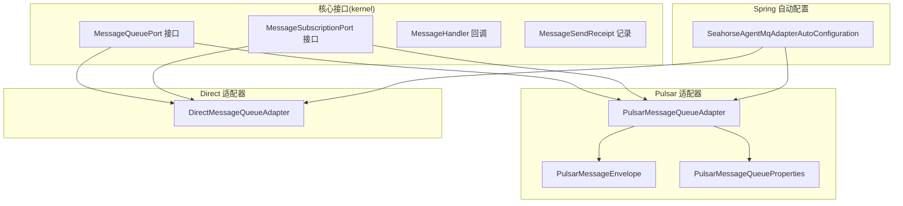
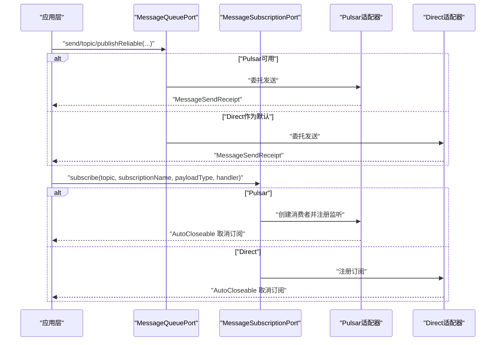
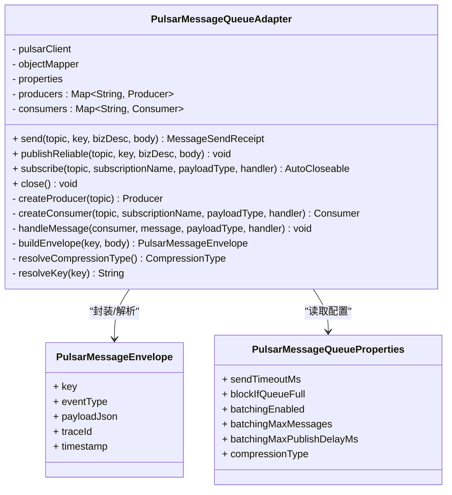
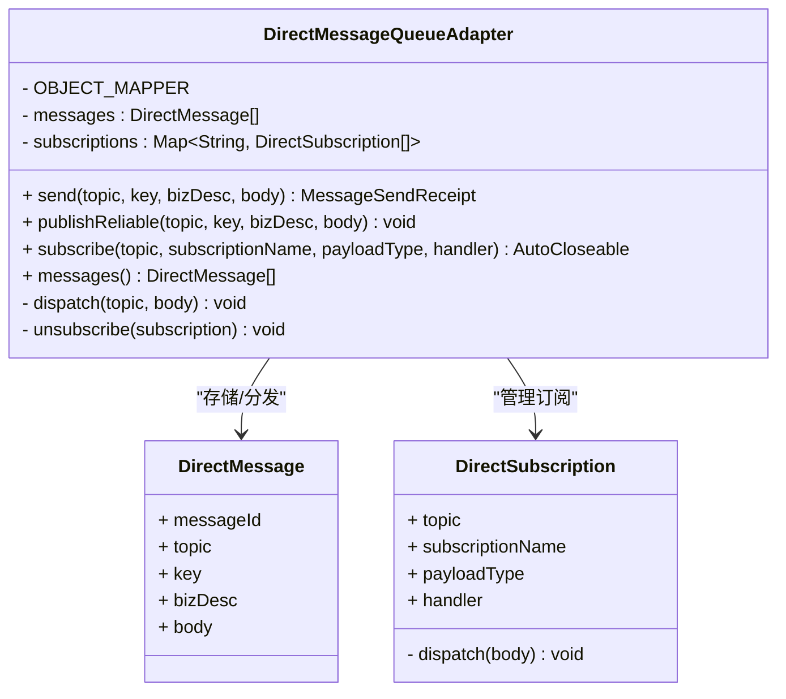
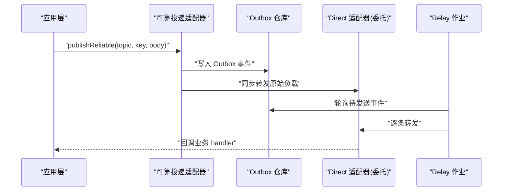
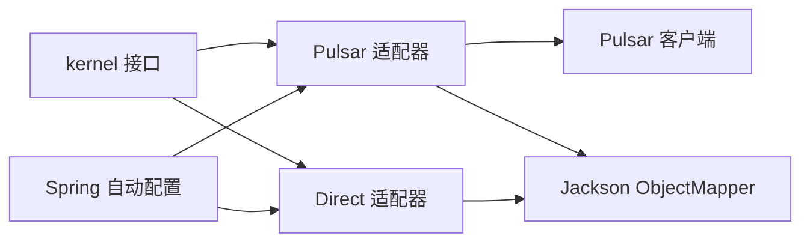

# 消息队列适配器

<cite>
**本文引用的文件**
- [PulsarMessageQueueAdapter.java](file://seahorse-agent-adapter-mq-pulsar/src/main/java/com/miracle/ai/seahorse/agent/adapters/mq/pulsar/PulsarMessageQueueAdapter.java)
- [PulsarMessageEnvelope.java](file://seahorse-agent-adapter-mq-pulsar/src/main/java/com/miracle/ai/seahorse/agent/adapters/mq/pulsar/PulsarMessageEnvelope.java)
- [PulsarMessageQueueProperties.java](file://seahorse-agent-adapter-mq-pulsar/src/main/java/com/miracle/ai/seahorse/agent/adapters/mq/pulsar/PulsarMessageQueueProperties.java)
- [DirectMessageQueueAdapter.java](file://seahorse-agent-adapter-mq-direct/src/main/java/com/miracle/ai/seahorse/agent/adapters/mq/direct/DirectMessageQueueAdapter.java)
- [MessageQueuePort.java](file://seahorse-agent-kernel/src/main/java/com/miracle/ai/seahorse/agent/ports/outbound/mq/MessageQueuePort.java)
- [MessageSubscriptionPort.java](file://seahorse-agent-kernel/src/main/java/com/miracle/ai/seahorse/agent/ports/outbound/mq/MessageSubscriptionPort.java)
- [MessageHandler.java](file://seahorse-agent-kernel/src/main/java/com/miracle/ai/seahorse/agent/ports/outbound/mq/MessageHandler.java)
- [MessageSendReceipt.java](file://seahorse-agent-kernel/src/main/java/com/miracle/ai/seahorse/agent/ports/outbound/mq/MessageSendReceipt.java)
- [SeahorseAgentMqAdapterAutoConfiguration.java](file://seahorse-agent-spring-boot-starter/src/main/java/com/miracle/ai/seahorse/agent/adapters/spring/SeahorseAgentMqAdapterAutoConfiguration.java)
- [ReliableMessageQueueAdapterTests.java](file://seahorse-agent-tests/src/test/java/com/miracle/ai/seahorse/agent/adapters/spring/mq/ReliableMessageQueueAdapterTests.java)
- [DirectMessageQueueAdapterTests.java](file://seahorse-agent-adapter-mq-direct/src/test/java/com/miracle/ai/seahorse/agent/adapters/mq/direct/DirectMessageQueueAdapterTests.java)
</cite>

## 目录
1. [简介](#简介)
2. [项目结构](#项目结构)
3. [核心组件](#核心组件)
4. [架构总览](#架构总览)
5. [详细组件分析](#详细组件分析)
6. [依赖关系分析](#依赖关系分析)
7. [性能考量](#性能考量)
8. [故障排查指南](#故障排查指南)
9. [结论](#结论)
10. [附录](#附录)

## 简介
本文件面向消息队列适配器的技术文档，重点覆盖两类适配器：Pulsar 消息队列适配器与 Direct（进程内）消息队列适配器。内容涵盖消息封装、消息发送、消息接收与可靠投递机制，以及性能特性、可靠性保证与故障恢复策略；并提供使用示例、集成指南、与核心系统的数据流与事件驱动架构说明，以及监控、性能调优与故障排查的实用技巧。

## 项目结构
消息队列适配器位于独立模块中，并通过 Spring Boot 自动配置在运行时注入到核心系统中。核心接口定义于 kernel 模块，适配器实现分别位于 pulsar 与 direct 两个适配器模块，Spring 自动配置位于 spring-boot-starter 模块。

**图表来源**
- [MessageQueuePort.java:23-28](file://seahorse-agent-kernel/src/main/java/com/miracle/ai/seahorse/agent/ports/outbound/mq/MessageQueuePort.java#L23-L28)
- [MessageSubscriptionPort.java:25-28](file://seahorse-agent-kernel/src/main/java/com/miracle/ai/seahorse/agent/ports/outbound/mq/MessageSubscriptionPort.java#L25-L28)
- [MessageHandler.java:26-29](file://seahorse-agent-kernel/src/main/java/com/miracle/ai/seahorse/agent/ports/outbound/mq/MessageHandler.java#L26-L29)
- [MessageSendReceipt.java](file://seahorse-agent-kernel/src/main/java/com/miracle/ai/seahorse/agent/ports/outbound/mq/MessageSendReceipt.java#L28)
- [PulsarMessageQueueAdapter.java](file://seahorse-agent-adapter-mq-pulsar/src/main/java/com/miracle/ai/seahorse/agent/adapters/mq/pulsar/PulsarMessageQueueAdapter.java#L45)
- [PulsarMessageEnvelope.java:23-74](file://seahorse-agent-adapter-mq-pulsar/src/main/java/com/miracle/ai/seahorse/agent/adapters/mq/pulsar/PulsarMessageEnvelope.java#L23-L74)
- [PulsarMessageQueueProperties.java:25-90](file://seahorse-agent-adapter-mq-pulsar/src/main/java/com/miracle/ai/seahorse/agent/adapters/mq/pulsar/PulsarMessageQueueProperties.java#L25-L90)
- [DirectMessageQueueAdapter.java](file://seahorse-agent-adapter-mq-direct/src/main/java/com/miracle/ai/seahorse/agent/adapters/mq/direct/DirectMessageQueueAdapter.java#L39)
- [SeahorseAgentMqAdapterAutoConfiguration.java:50-81](file://seahorse-agent-spring-boot-starter/src/main/java/com/miracle/ai/seahorse/agent/adapters/spring/SeahorseAgentMqAdapterAutoConfiguration.java#L50-L81)

**章节来源**
- [MessageQueuePort.java:23-28](file://seahorse-agent-kernel/src/main/java/com/miracle/ai/seahorse/agent/ports/outbound/mq/MessageQueuePort.java#L23-L28)
- [MessageSubscriptionPort.java:25-28](file://seahorse-agent-kernel/src/main/java/com/miracle/ai/seahorse/agent/ports/outbound/mq/MessageSubscriptionPort.java#L25-L28)
- [MessageHandler.java:26-29](file://seahorse-agent-kernel/src/main/java/com/miracle/ai/seahorse/agent/ports/outbound/mq/MessageHandler.java#L26-L29)
- [MessageSendReceipt.java](file://seahorse-agent-kernel/src/main/java/com/miracle/ai/seahorse/agent/ports/outbound/mq/MessageSendReceipt.java#L28)
- [PulsarMessageQueueAdapter.java](file://seahorse-agent-adapter-mq-pulsar/src/main/java/com/miracle/ai/seahorse/agent/adapters/mq/pulsar/PulsarMessageQueueAdapter.java#L45)
- [PulsarMessageEnvelope.java:23-74](file://seahorse-agent-adapter-mq-pulsar/src/main/java/com/miracle/ai/seahorse/agent/adapters/mq/pulsar/PulsarMessageEnvelope.java#L23-L74)
- [PulsarMessageQueueProperties.java:25-90](file://seahorse-agent-adapter-mq-pulsar/src/main/java/com/miracle/ai/seahorse/agent/adapters/mq/pulsar/PulsarMessageQueueProperties.java#L25-L90)
- [DirectMessageQueueAdapter.java](file://seahorse-agent-adapter-mq-direct/src/main/java/com/miracle/ai/seahorse/agent/adapters/mq/direct/DirectMessageQueueAdapter.java#L39)
- [SeahorseAgentMqAdapterAutoConfiguration.java:50-81](file://seahorse-agent-spring-boot-starter/src/main/java/com/miracle/ai/seahorse/agent/adapters/spring/SeahorseAgentMqAdapterAutoConfiguration.java#L50-L81)

## 核心组件
- 发送端口接口：定义统一的发送与可靠发布能力，屏蔽底层实现差异。
- 订阅端口接口：定义统一的订阅与回调处理能力。
- 消息处理器回调：应用层仅需关注业务处理逻辑。
- 发送回执记录：标准化返回消息 ID、主题、键与发布时间等元数据。

这些接口为适配器提供了清晰的契约，使得 Pulsar 与 Direct 两种实现可以无缝替换。

**章节来源**
- [MessageQueuePort.java:23-28](file://seahorse-agent-kernel/src/main/java/com/miracle/ai/seahorse/agent/ports/outbound/mq/MessageQueuePort.java#L23-L28)
- [MessageSubscriptionPort.java:25-28](file://seahorse-agent-kernel/src/main/java/com/miracle/ai/seahorse/agent/ports/outbound/mq/MessageSubscriptionPort.java#L25-L28)
- [MessageHandler.java:26-29](file://seahorse-agent-kernel/src/main/java/com/miracle/ai/seahorse/agent/ports/outbound/mq/MessageHandler.java#L26-L29)
- [MessageSendReceipt.java](file://seahorse-agent-kernel/src/main/java/com/miracle/ai/seahorse/agent/ports/outbound/mq/MessageSendReceipt.java#L28)

## 架构总览
消息队列适配器采用“接口 + 适配器 + 自动配置”的分层架构。应用层通过统一接口进行消息发送与订阅，Spring 自动配置根据运行时条件选择合适的适配器实现；Pulsar 适配器负责与外部消息中间件交互，Direct 适配器用于本地开发与测试场景。

**图表来源**
- [SeahorseAgentMqAdapterAutoConfiguration.java:50-81](file://seahorse-agent-spring-boot-starter/src/main/java/com/miracle/ai/seahorse/agent/adapters/spring/SeahorseAgentMqAdapterAutoConfiguration.java#L50-L81)
- [MessageQueuePort.java:23-28](file://seahorse-agent-kernel/src/main/java/com/miracle/ai/seahorse/agent/ports/outbound/mq/MessageQueuePort.java#L23-L28)
- [MessageSubscriptionPort.java:25-28](file://seahorse-agent-kernel/src/main/java/com/miracle/ai/seahorse/agent/ports/outbound/mq/MessageSubscriptionPort.java#L25-L28)
- [PulsarMessageQueueAdapter.java:66-85](file://seahorse-agent-adapter-mq-pulsar/src/main/java/com/miracle/ai/seahorse/agent/adapters/mq/pulsar/PulsarMessageQueueAdapter.java#L66-L85)
- [DirectMessageQueueAdapter.java:47-59](file://seahorse-agent-adapter-mq-direct/src/main/java/com/miracle/ai/seahorse/agent/adapters/mq/direct/DirectMessageQueueAdapter.java#L47-L59)

## 详细组件分析

### Pulsar 消息队列适配器
Pulsar 适配器实现了发送、可靠发布、订阅与关闭等能力，内部通过 JSON Schema 的消息信封承载消息键、事件类型、负载与时间戳等元数据，并支持压缩、批处理与超时控制等参数化配置。

**图表来源**
- [PulsarMessageQueueAdapter.java:45-229](file://seahorse-agent-adapter-mq-pulsar/src/main/java/com/miracle/ai/seahorse/agent/adapters/mq/pulsar/PulsarMessageQueueAdapter.java#L45-L229)
- [PulsarMessageEnvelope.java:23-74](file://seahorse-agent-adapter-mq-pulsar/src/main/java/com/miracle/ai/seahorse/agent/adapters/mq/pulsar/PulsarMessageEnvelope.java#L23-L74)
- [PulsarMessageQueueProperties.java:25-90](file://seahorse-agent-adapter-mq-pulsar/src/main/java/com/miracle/ai/seahorse/agent/adapters/mq/pulsar/PulsarMessageQueueProperties.java#L25-L90)

关键实现要点
- 消息封装：将业务对象序列化为 JSON，写入信封并设置事件类型、时间戳与键。
- 发送流程：按主题缓存 Producer，支持批处理、压缩与超时；返回标准化回执。
- 订阅流程：按主题+订阅名缓存 Consumer，使用 Shared 订阅模式，消息到达后反序列化并回调处理，成功则 ACK，异常则 Negative Ack。
- 关闭流程：释放所有 Producer 与 Consumer 资源。

可靠性与错误处理
- 失败即抛出非法状态异常，便于上层感知发送失败。
- 订阅回调中捕获异常并执行 Negative Ack，交由 Pulsar 重试策略处理。

配置项
- 发送超时、阻塞队列满策略、批处理开关与阈值、最大批延迟、压缩类型等。

**章节来源**
- [PulsarMessageQueueAdapter.java:66-154](file://seahorse-agent-adapter-mq-pulsar/src/main/java/com/miracle/ai/seahorse/agent/adapters/mq/pulsar/PulsarMessageQueueAdapter.java#L66-L154)
- [PulsarMessageEnvelope.java:23-74](file://seahorse-agent-adapter-mq-pulsar/src/main/java/com/miracle/ai/seahorse/agent/adapters/mq/pulsar/PulsarMessageEnvelope.java#L23-L74)
- [PulsarMessageQueueProperties.java:25-90](file://seahorse-agent-adapter-mq-pulsar/src/main/java/com/miracle/ai/seahorse/agent/adapters/mq/pulsar/PulsarMessageQueueProperties.java#L25-L90)

### Direct 消息队列适配器
Direct 适配器为进程内直连实现，不依赖外部 Broker，适合本地开发、单体部署或测试环境。它维护内存中的消息列表与订阅映射，消息到达后直接分发给匹配的订阅者。

**图表来源**
- [DirectMessageQueueAdapter.java:39-131](file://seahorse-agent-adapter-mq-direct/src/main/java/com/miracle/ai/seahorse/agent/adapters/mq/direct/DirectMessageQueueAdapter.java#L39-L131)

关键实现要点
- 发送：生成消息 ID 与发布时间，写入内存列表并立即分发。
- 订阅：按主题维护订阅列表，分发时尝试强类型匹配，否则进行 JSON 转换后回调。
- 取消订阅：从主题对应的订阅列表移除。

可靠性说明
- 由于无外部持久化与重试机制，Direct 适配器不提供跨进程/实例的可靠投递；生产环境建议使用 Pulsar 适配器。

**章节来源**
- [DirectMessageQueueAdapter.java:47-95](file://seahorse-agent-adapter-mq-direct/src/main/java/com/miracle/ai/seahorse/agent/adapters/mq/direct/DirectMessageQueueAdapter.java#L47-L95)

### 可靠投递适配器（与 Outbox 集成）
在测试用例中可见，可靠投递适配器通过 Outbox 仓库实现“先写库、再转发”的可靠投递模式：发送时写入 Outbox，后台作业轮询并最终转发至底层适配器，确保消息最终可达。

**图表来源**
- [ReliableMessageQueueAdapterTests.java:38-54](file://seahorse-agent-tests/src/test/java/com/miracle/ai/seahorse/agent/adapters/spring/mq/ReliableMessageQueueAdapterTests.java#L38-L54)

**章节来源**
- [ReliableMessageQueueAdapterTests.java:38-54](file://seahorse-agent-tests/src/test/java/com/miracle/ai/seahorse/agent/adapters/spring/mq/ReliableMessageQueueAdapterTests.java#L38-L54)

## 依赖关系分析
- 接口契约：kernel 模块定义了发送与订阅的统一接口，适配器模块实现这些接口。
- 自动配置：spring-boot-starter 模块在满足条件时注入 Pulsar 或 Direct 适配器；当 Pulsar 客户端存在且配置为 pulsar 时优先使用 Pulsar。
- 适配器内部：Pulsar 适配器依赖 Pulsar 客户端与 Jackson；Direct 适配器依赖 Jackson 与并发集合。

**图表来源**
- [SeahorseAgentMqAdapterAutoConfiguration.java:59-81](file://seahorse-agent-spring-boot-starter/src/main/java/com/miracle/ai/seahorse/agent/adapters/spring/SeahorseAgentMqAdapterAutoConfiguration.java#L59-L81)
- [PulsarMessageQueueAdapter.java:47-63](file://seahorse-agent-adapter-mq-pulsar/src/main/java/com/miracle/ai/seahorse/agent/adapters/mq/pulsar/PulsarMessageQueueAdapter.java#L47-L63)
- [DirectMessageQueueAdapter.java](file://seahorse-agent-adapter-mq-direct/src/main/java/com/miracle/ai/seahorse/agent/adapters/mq/direct/DirectMessageQueueAdapter.java#L41)

**章节来源**
- [SeahorseAgentMqAdapterAutoConfiguration.java:50-81](file://seahorse-agent-spring-boot-starter/src/main/java/com/miracle/ai/seahorse/agent/adapters/spring/SeahorseAgentMqAdapterAutoConfiguration.java#L50-L81)
- [PulsarMessageQueueAdapter.java:47-63](file://seahorse-agent-adapter-mq-pulsar/src/main/java/com/miracle/ai/seahorse/agent/adapters/mq/pulsar/PulsarMessageQueueAdapter.java#L47-L63)
- [DirectMessageQueueAdapter.java](file://seahorse-agent-adapter-mq-direct/src/main/java/com/miracle/ai/seahorse/agent/adapters/mq/direct/DirectMessageQueueAdapter.java#L41)

## 性能考量
- Pulsar 适配器
  - 批处理：通过批量大小与最大延迟提升吞吐，降低网络开销。
  - 压缩：可选 LZ4 等压缩算法，平衡 CPU 与带宽。
  - 超时与阻塞：合理设置发送超时与队列满阻塞策略，避免背压导致丢弃。
  - 订阅模型：Shared 订阅支持多消费者水平扩展。
- Direct 适配器
  - 内存存储与同步分发，延迟低但不具备持久化与跨实例容错能力。
  - 适合小规模本地开发与单元测试。

优化建议
- 对高频短消息启用批处理与适度延迟聚合。
- 对大对象消息考虑开启压缩以减少带宽占用。
- 在高并发场景下，结合 Shared 订阅与多实例部署提升消费能力。
- 生产环境务必使用 Pulsar 适配器以获得持久化与可靠投递保障。

[本节为通用性能指导，无需特定文件来源]

## 故障排查指南
常见问题与定位思路
- 发送失败
  - 检查 Pulsar 客户端连接与主题权限。
  - 查看发送超时与队列阻塞配置是否合理。
  - 关注适配器抛出的非法状态异常信息。
- 订阅无回调
  - 确认订阅名称与主题正确，且订阅未被提前取消。
  - 检查回调异常是否触发 Negative Ack 导致重复投递。
- 消息丢失
  - Direct 适配器不提供持久化，消息随进程退出而丢失。
  - 生产环境必须使用 Pulsar 适配器并配合 Outbox 与 Relay 作业。
- 性能退化
  - 批处理阈值过小或延迟过大都会影响吞吐。
  - 压缩类型与级别需权衡 CPU 与带宽。

验证与回归
- 使用 Direct 适配器的单元测试验证订阅与分发行为。
- 使用可靠投递测试验证 Outbox 写入与 Relay 转发链路。

**章节来源**
- [PulsarMessageQueueAdapter.java:142-159](file://seahorse-agent-adapter-mq-pulsar/src/main/java/com/miracle/ai/seahorse/agent/adapters/mq/pulsar/PulsarMessageQueueAdapter.java#L142-L159)
- [DirectMessageQueueAdapterTests.java:29-39](file://seahorse-agent-adapter-mq-direct/src/test/java/com/miracle/ai/seahorse/agent/adapters/mq/direct/DirectMessageQueueAdapterTests.java#L29-L39)
- [ReliableMessageQueueAdapterTests.java:38-54](file://seahorse-agent-tests/src/test/java/com/miracle/ai/seahorse/agent/adapters/spring/mq/ReliableMessageQueueAdapterTests.java#L38-L54)

## 结论
- Pulsar 适配器提供生产级的可靠投递、批处理与压缩能力，适合分布式与高吞吐场景。
- Direct 适配器简洁高效，适合本地开发与测试，但不具备跨实例持久化与重试能力。
- 通过统一接口与自动配置，系统可在不同环境间平滑切换适配器实现。
- 生产环境推荐结合 Outbox 与 Relay 作业，确保消息最终可达。

[本节为总结性内容，无需特定文件来源]

## 附录

### 使用示例与集成指南
- Spring 自动配置
  - 当存在 Pulsar 客户端且配置为 pulsar 类型时，自动注入 Pulsar 可靠投递适配器。
  - 若不存在 Pulsar 客户端，则注入 Direct 可靠投递适配器作为默认实现。
- 应用层调用
  - 发送：调用发送端口的发送或可靠发布方法，传入主题、键、业务描述与业务对象。
  - 订阅：调用订阅端口，传入主题、订阅名称、期望负载类型与处理回调，返回可关闭句柄用于取消订阅。

参考路径
- [SeahorseAgentMqAdapterAutoConfiguration.java:59-81](file://seahorse-agent-spring-boot-starter/src/main/java/com/miracle/ai/seahorse/agent/adapters/spring/SeahorseAgentMqAdapterAutoConfiguration.java#L59-L81)
- [MessageQueuePort.java:23-28](file://seahorse-agent-kernel/src/main/java/com/miracle/ai/seahorse/agent/ports/outbound/mq/MessageQueuePort.java#L23-L28)
- [MessageSubscriptionPort.java:25-28](file://seahorse-agent-kernel/src/main/java/com/miracle/ai/seahorse/agent/ports/outbound/mq/MessageSubscriptionPort.java#L25-L28)

**章节来源**
- [SeahorseAgentMqAdapterAutoConfiguration.java:50-81](file://seahorse-agent-spring-boot-starter/src/main/java/com/miracle/ai/seahorse/agent/adapters/spring/SeahorseAgentMqAdapterAutoConfiguration.java#L50-L81)
- [MessageQueuePort.java:23-28](file://seahorse-agent-kernel/src/main/java/com/miracle/ai/seahorse/agent/ports/outbound/mq/MessageQueuePort.java#L23-L28)
- [MessageSubscriptionPort.java:25-28](file://seahorse-agent-kernel/src/main/java/com/miracle/ai/seahorse/agent/ports/outbound/mq/MessageSubscriptionPort.java#L25-L28)

### 配置参考
- Pulsar 适配器属性
  - 发送超时（毫秒）、队列满阻塞策略、批处理开关、最大批消息数、最大批延迟（毫秒）、压缩类型。
- Direct 适配器
  - 无外部依赖，主要通过内存存储与订阅映射实现分发。

参考路径
- [PulsarMessageQueueProperties.java:25-90](file://seahorse-agent-adapter-mq-pulsar/src/main/java/com/miracle/ai/seahorse/agent/adapters/mq/pulsar/PulsarMessageQueueProperties.java#L25-L90)

**章节来源**
- [PulsarMessageQueueProperties.java:25-90](file://seahorse-agent-adapter-mq-pulsar/src/main/java/com/miracle/ai/seahorse/agent/adapters/mq/pulsar/PulsarMessageQueueProperties.java#L25-L90)

### 事件驱动与数据流
- 应用层通过统一接口产生事件，适配器负责将事件持久化与转发至下游消费者。
- Pulsar 适配器提供持久化与重试，Direct 适配器提供即时分发。
- 可靠投递通过 Outbox 与 Relay 作业形成最终一致的事件流。

[本节为概念性说明，无需特定文件来源]