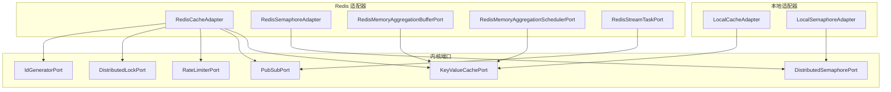
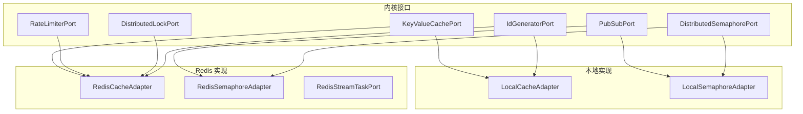
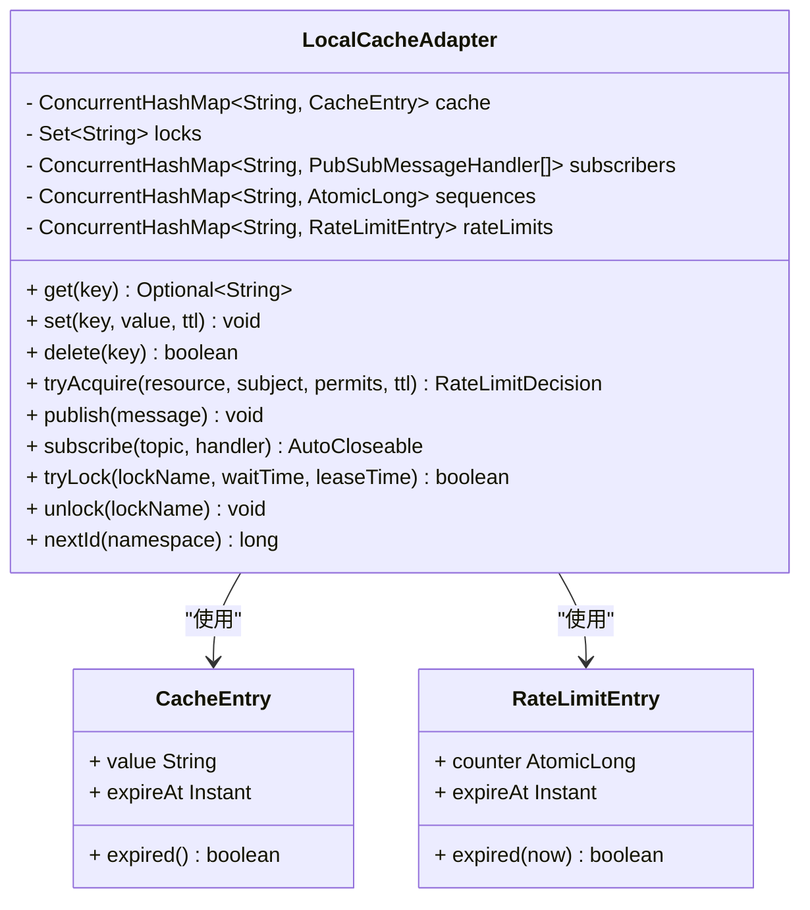
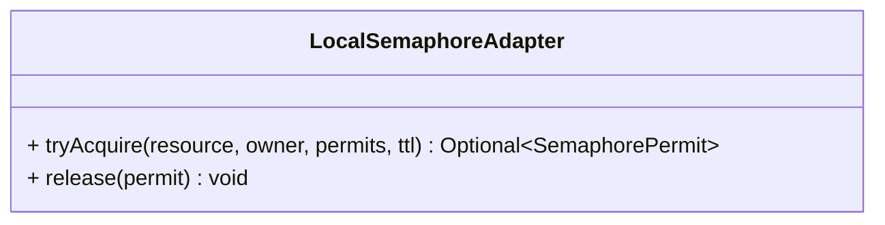
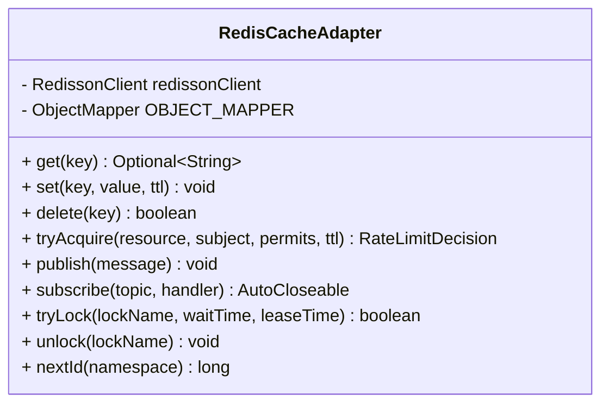
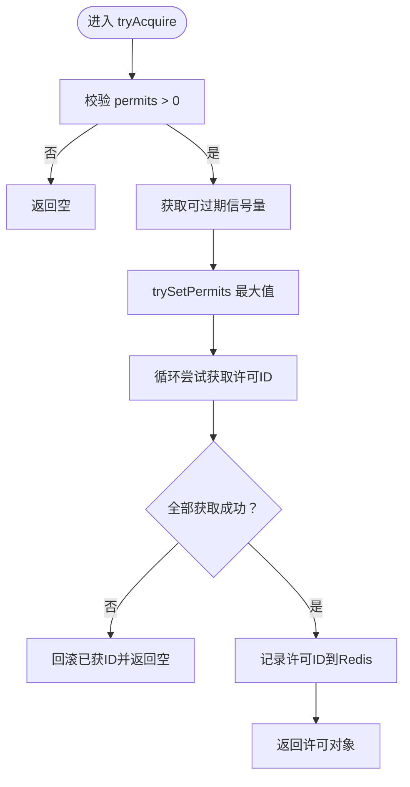
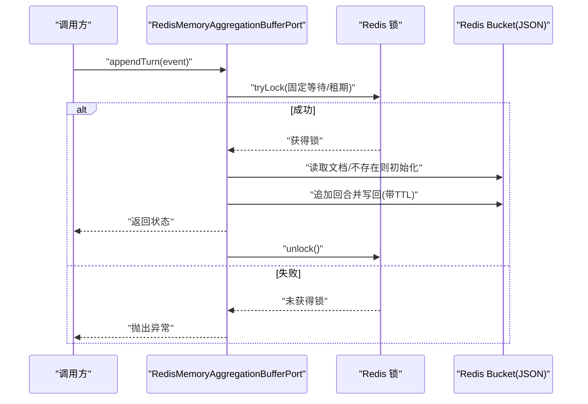
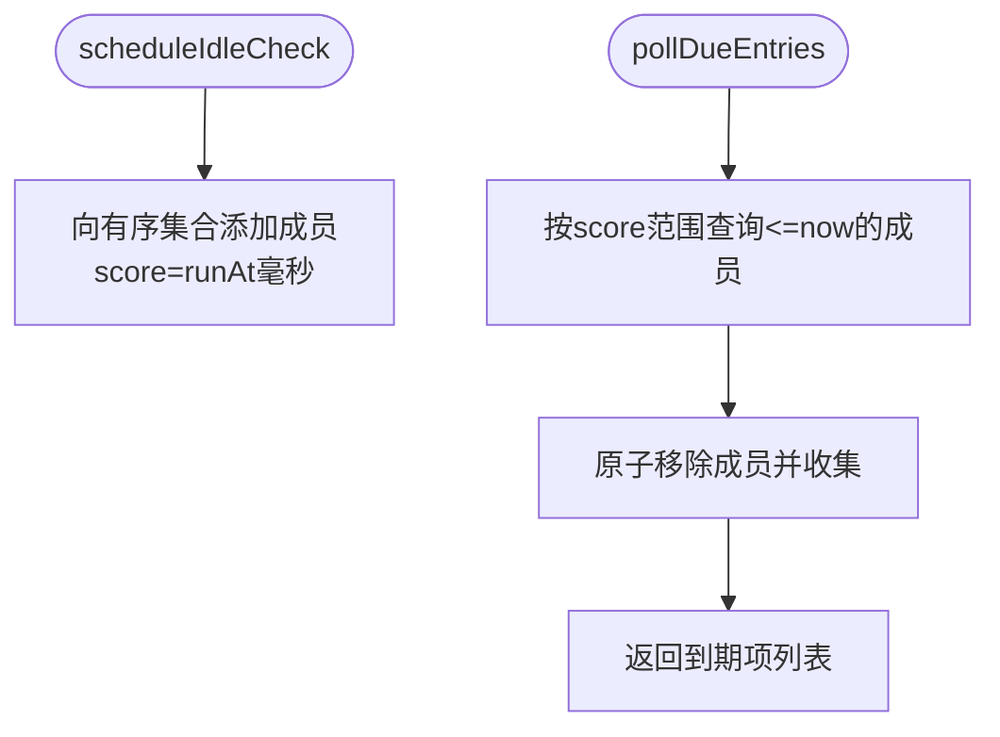
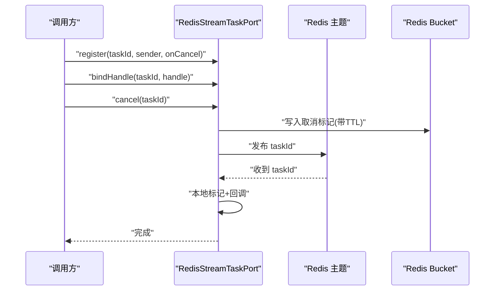
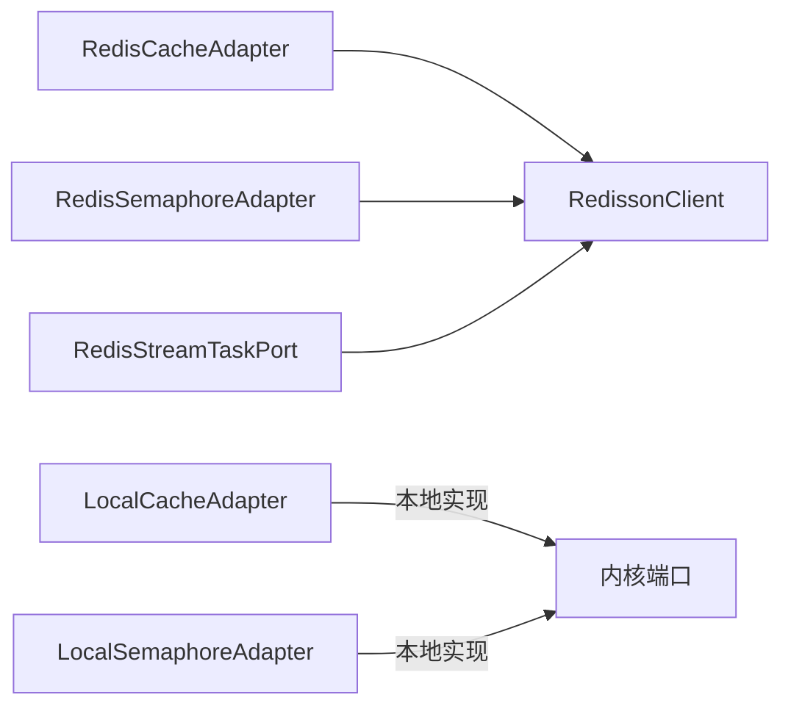

# 缓存适配器

<cite>
**本文引用的文件**
- [LocalCacheAdapter.java](file://seahorse-agent-adapter-cache-local/src/main/java/com/miracle/ai/seahorse/agent/adapters/cache/local/LocalCacheAdapter.java)
- [LocalSemaphoreAdapter.java](file://seahorse-agent-adapter-cache-local/src/main/java/com/miracle/ai/seahorse/agent/adapters/cache/local/LocalSemaphoreAdapter.java)
- [RedisCacheAdapter.java](file://seahorse-agent-adapter-cache-redis/src/main/java/com/miracle/ai/seahorse/agent/adapters/cache/redis/RedisCacheAdapter.java)
- [RedisSemaphoreAdapter.java](file://seahorse-agent-adapter-cache-redis/src/main/java/com/miracle/ai/seahorse/agent/adapters/cache/redis/RedisSemaphoreAdapter.java)
- [RedisMemoryAggregationBufferPort.java](file://seahorse-agent-adapter-cache-redis/src/main/java/com/miracle/ai/seahorse/agent/adapters/cache/redis/RedisMemoryAggregationBufferPort.java)
- [RedisMemoryAggregationSchedulerPort.java](file://seahorse-agent-adapter-cache-redis/src/main/java/com/miracle/ai/seahorse/agent/adapters/cache/redis/RedisMemoryAggregationSchedulerPort.java)
- [RedisStreamTaskPort.java](file://seahorse-agent-adapter-cache-redis/src/main/java/com/miracle/ai/seahorse/agent/adapters/cache/redis/RedisStreamTaskPort.java)
- [KeyValueCachePort.java](file://seahorse-agent-kernel/src/main/java/com/miracle/ai/seahorse/agent/ports/outbound/cache/KeyValueCachePort.java)
- [PubSubPort.java](file://seahorse-agent-kernel/src/main/java/com/miracle/ai/seahorse/agent/ports/outbound/cache/PubSubPort.java)
- [RateLimiterPort.java](file://seahorse-agent-kernel/src/main/java/com/miracle/ai/seahorse/agent/ports/outbound/cache/RateLimiterPort.java)
- [DistributedLockPort.java](file://seahorse-agent-kernel/src/main/java/com/miracle/ai/seahorse/agent/ports/outbound/coordination/DistributedLockPort.java)
- [DistributedSemaphorePort.java](file://seahorse-agent-kernel/src/main/java/com/miracle/ai/seahorse/agent/ports/outbound/coordination/DistributedSemaphorePort.java)
- [IdGeneratorPort.java](file://seahorse-agent-kernel/src/main/java/com/miracle/ai/seahorse/agent/ports/outbound/id/IdGeneratorPort.java)
- [缓存适配器.md](file://docs/zh/content/后端系统/适配器模块/缓存适配器.md)
- [缓存出站端口.md](file://docs/zh/content/后端系统/核心内核/端口接口/出站端口/缓存出站端口.md)
</cite>

## 目录
1. [简介](#简介)
2. [项目结构](#项目结构)
3. [核心组件](#核心组件)
4. [架构总览](#架构总览)
5. [详细组件分析](#详细组件分析)
6. [依赖关系分析](#依赖关系分析)
7. [性能考量](#性能考量)
8. [故障排查指南](#故障排查指南)
9. [结论](#结论)
10. [附录](#附录)

## 简介
本文件系统性梳理缓存适配器体系，覆盖本地内存适配器与 Redis 适配器两大实现，重点阐述以下能力：
- 键值缓存：字符串键值的读取、写入（带 TTL）、删除
- 发布订阅：主题发布与订阅，支持自动关闭的订阅句柄
- 限流器：基于资源与主体的统一限流判定，返回允许/拒绝与重试建议
- 分布式锁：尝试获取锁与解锁，支持空实现
- 分布式信号量：按资源与持有者申请/释放许可，支持许可 TTL
- 流式任务协调：基于 Redis/PubSub 的流式任务取消与进度通知
- 记忆聚合缓冲与调度：分布式场景下的记忆回合缓冲与空闲刷新调度

同时给出配置参数、性能优化策略、故障处理机制、选择指南与最佳实践，并说明与核心业务逻辑的集成方式与数据一致性保障。

## 项目结构
缓存适配器位于两个模块中：
- 本地适配器模块：提供单 JVM 内可见的内存实现，适合本地开发与单节点部署
- Redis 适配器模块：基于 Redisson 的分布式实现，满足多节点高可用需求

**图表来源**
- [LocalCacheAdapter.java:44-167](file://seahorse-agent-adapter-cache-local/src/main/java/com/miracle/ai/seahorse/agent/adapters/cache/local/LocalCacheAdapter.java#L44-L167)
- [LocalSemaphoreAdapter.java:33-66](file://seahorse-agent-adapter-cache-local/src/main/java/com/miracle/ai/seahorse/agent/adapters/cache/local/LocalSemaphoreAdapter.java#L33-L66)
- [RedisCacheAdapter.java:48-195](file://seahorse-agent-adapter-cache-redis/src/main/java/com/miracle/ai/seahorse/agent/adapters/cache/redis/RedisCacheAdapter.java#L48-L195)
- [RedisSemaphoreAdapter.java:41-161](file://seahorse-agent-adapter-cache-redis/src/main/java/com/miracle/ai/seahorse/agent/adapters/cache/redis/RedisSemaphoreAdapter.java#L41-L161)
- [RedisMemoryAggregationBufferPort.java:51-345](file://seahorse-agent-adapter-cache-redis/src/main/java/com/miracle/ai/seahorse/agent/adapters/cache/redis/RedisMemoryAggregationBufferPort.java#L51-L345)
- [RedisMemoryAggregationSchedulerPort.java:44-124](file://seahorse-agent-adapter-cache-redis/src/main/java/com/miracle/ai/seahorse/agent/adapters/cache/redis/RedisMemoryAggregationSchedulerPort.java#L44-L124)
- [RedisStreamTaskPort.java:41-179](file://seahorse-agent-adapter-cache-redis/src/main/java/com/miracle/ai/seahorse/agent/adapters/cache/redis/RedisStreamTaskPort.java#L41-L179)
- [KeyValueCachePort.java:26-33](file://seahorse-agent-kernel/src/main/java/com/miracle/ai/seahorse/agent/ports/outbound/cache/KeyValueCachePort.java#L26-L33)
- [PubSubPort.java:25-43](file://seahorse-agent-kernel/src/main/java/com/miracle/ai/seahorse/agent/ports/outbound/cache/PubSubPort.java#L25-L43)
- [RateLimiterPort.java:27-44](file://seahorse-agent-kernel/src/main/java/com/miracle/ai/seahorse/agent/ports/outbound/cache/RateLimiterPort.java#L27-L44)
- [DistributedLockPort.java:25-43](file://seahorse-agent-kernel/src/main/java/com/miracle/ai/seahorse/agent/ports/outbound/coordination/DistributedLockPort.java#L25-L43)
- [DistributedSemaphorePort.java:28-48](file://seahorse-agent-kernel/src/main/java/com/miracle/ai/seahorse/agent/ports/outbound/coordination/DistributedSemaphorePort.java#L28-L48)
- [IdGeneratorPort.java:25-35](file://seahorse-agent-kernel/src/main/java/com/miracle/ai/seahorse/agent/ports/outbound/id/IdGeneratorPort.java#L25-L35)

**章节来源**
- [缓存适配器.md:78-89](file://docs/zh/content/后端系统/适配器模块/缓存适配器.md#L78-L89)

## 核心组件
- 键值缓存端口 KeyValueCachePort：提供 get、set、delete 三类基础操作，支持 TTL 过期
- 发布订阅端口 PubSubPort：支持发布消息与订阅主题，返回可自动关闭的订阅句柄
- 统一限流端口 RateLimiterPort：基于资源与主体的限流判定，返回允许/拒绝与重试建议
- 分布式锁端口 DistributedLockPort：提供 tryLock/unlock，支持空实现
- 分布式信号量端口 DistributedSemaphorePort：按资源与持有者申请/释放许可，支持许可 TTL
- ID 生成器端口 IdGeneratorPort：为命名空间生成单调递增 ID

上述端口在本地与 Redis 适配器中均有实现，形成“接口统一、实现可插拔”的架构。

**章节来源**
- [缓存出站端口.md:104-147](file://docs/zh/content/后端系统/核心内核/端口接口/出站端口/缓存出站端口.md#L104-L147)
- [KeyValueCachePort.java:26-33](file://seahorse-agent-kernel/src/main/java/com/miracle/ai/seahorse/agent/ports/outbound/cache/KeyValueCachePort.java#L26-L33)
- [PubSubPort.java:25-43](file://seahorse-agent-kernel/src/main/java/com/miracle/ai/seahorse/agent/ports/outbound/cache/PubSubPort.java#L25-L43)
- [RateLimiterPort.java:27-44](file://seahorse-agent-kernel/src/main/java/com/miracle/ai/seahorse/agent/ports/outbound/cache/RateLimiterPort.java#L27-L44)
- [DistributedLockPort.java:25-43](file://seahorse-agent-kernel/src/main/java/com/miracle/ai/seahorse/agent/ports/outbound/coordination/DistributedLockPort.java#L25-L43)
- [DistributedSemaphorePort.java:28-48](file://seahorse-agent-kernel/src/main/java/com/miracle/ai/seahorse/agent/ports/outbound/coordination/DistributedSemaphorePort.java#L28-L48)
- [IdGeneratorPort.java:25-35](file://seahorse-agent-kernel/src/main/java/com/miracle/ai/seahorse/agent/ports/outbound/id/IdGeneratorPort.java#L25-L35)

## 架构总览
下图展示内核端口与适配器的绑定关系及默认实现选择策略（通过 SPI 注册与 META-INF 配置）：

**图表来源**
- [缓存出站端口.md:149-181](file://docs/zh/content/后端系统/核心内核/端口接口/出站端口/缓存出站端口.md#L149-L181)

## 详细组件分析

### 本地缓存适配器 LocalCacheAdapter
- 功能特性
  - 键值缓存：ConcurrentHashMap 存储，支持 TTL 过期检查与清理
  - 发布订阅：内存级订阅列表，同步回调处理
  - 限流器：基于原子计数器的窗口限流，支持 TTL 清零
  - 分布式锁：JVM 内互斥集合，多节点不可见
  - ID 生成器：按命名空间的原子自增
- 复杂度与性能
  - get/set/delete/tryLock/unlock/nextId 均为 O(1) 平均复杂度
  - 订阅列表使用 CopyOnWrite 结构，读多写少场景友好
- 使用场景
  - 单机/本地开发/测试环境
  - 不需要跨节点一致性的场景
- 注意事项
  - 多节点部署需切换 Redis 实现

**图表来源**
- [LocalCacheAdapter.java:44-167](file://seahorse-agent-adapter-cache-local/src/main/java/com/miracle/ai/seahorse/agent/adapters/cache/local/LocalCacheAdapter.java#L44-L167)

**章节来源**
- [LocalCacheAdapter.java:44-167](file://seahorse-agent-adapter-cache-local/src/main/java/com/miracle/ai/seahorse/agent/adapters/cache/local/LocalCacheAdapter.java#L44-L167)

### 本地信号量适配器 LocalSemaphoreAdapter
- 功能特性
  - 本地信号量：按资源与持有者发放许可，支持 TTL
  - 无分布式约束，仅用于本地可运行
- 使用场景
  - 依赖信号量端口但不需要跨节点一致性的流程

**图表来源**
- [LocalSemaphoreAdapter.java:33-66](file://seahorse-agent-adapter-cache-local/src/main/java/com/miracle/ai/seahorse/agent/adapters/cache/local/LocalSemaphoreAdapter.java#L33-L66)

**章节来源**
- [LocalSemaphoreAdapter.java:33-66](file://seahorse-agent-adapter-cache-local/src/main/java/com/miracle/ai/seahorse/agent/adapters/cache/local/LocalSemaphoreAdapter.java#L33-L66)

### Redis 缓存适配器 RedisCacheAdapter
- 功能特性
  - 键值缓存：RBucket<StringCodec> 存储，支持 TTL 设置与删除
  - 发布订阅：RTopic + StringCodec，序列化/反序列化 PubSubMessage
  - 限流器：RAtomicLong 原子计数，首次使用时设置 TTL
  - 分布式锁：RLock 支持 tryLock/waitTime/leaseTime
  - ID 生成器：RAtomicLong 自增
- 命名规范
  - 统一前缀 seahorse:agent:，区分 cache/lock/topic/ratelimit/id
- 异常处理
  - 非法参数校验与中断安全（tryLock 中断处理）
  - PubSub 消息序列化异常包装

**图表来源**
- [RedisCacheAdapter.java:48-195](file://seahorse-agent-adapter-cache-redis/src/main/java/com/miracle/ai/seahorse/agent/adapters/cache/redis/RedisCacheAdapter.java#L48-L195)

**章节来源**
- [RedisCacheAdapter.java:48-195](file://seahorse-agent-adapter-cache-redis/src/main/java/com/miracle/ai/seahorse/agent/adapters/cache/redis/RedisCacheAdapter.java#L48-L195)

### Redis 信号量适配器 RedisSemaphoreAdapter
- 功能特性
  - 使用 RPermitExpirableSemaphore 提供可过期信号量
  - 通过 RBucket 记录许可 ID，确保 release 准确释放
  - trySetPermits(Integer.MAX_VALUE) 放宽许可上限，便于扩展
- 流程要点
  - 获取：循环尝试获取许可 ID，失败则回滚已获 ID
  - 释放：读取许可 ID 列表并逐一释放，最后清理记录
  - TTL：许可与记录均支持 TTL

**图表来源**
- [RedisSemaphoreAdapter.java:53-106](file://seahorse-agent-adapter-cache-redis/src/main/java/com/miracle/ai/seahorse/agent/adapters/cache/redis/RedisSemaphoreAdapter.java#L53-L106)

**章节来源**
- [RedisSemaphoreAdapter.java:41-161](file://seahorse-agent-adapter-cache-redis/src/main/java/com/miracle/ai/seahorse/agent/adapters/cache/redis/RedisSemaphoreAdapter.java#L41-L161)

### Redis 记忆聚合缓冲 RedisMemoryAggregationBufferPort
- 功能特性
  - 分布式缓冲：每个 (tenant, session) 对应一个 JSON 文档
  - 互斥保护：每键一把 Redis 锁，避免并发写入竞争
  - 触发策略：基于触发器（空闲超时、回合数、Token 数）与策略参数
  - TTL：缓冲文档带 TTL，过期自动清理
- 数据模型
  - BufferDocument：包含 tenantId、userId、sessionId、turns、tokens、时间戳等
  - TurnDocument：单轮对话快照
- 锁策略
  - 采用固定等待与租期，失败抛出异常，调用方需重试或降级

**图表来源**
- [RedisMemoryAggregationBufferPort.java:77-113](file://seahorse-agent-adapter-cache-redis/src/main/java/com/miracle/ai/seahorse/agent/adapters/cache/redis/RedisMemoryAggregationBufferPort.java#L77-L113)

**章节来源**
- [RedisMemoryAggregationBufferPort.java:51-345](file://seahorse-agent-adapter-cache-redis/src/main/java/com/miracle/ai/seahorse/agent/adapters/cache/redis/RedisMemoryAggregationBufferPort.java#L51-L345)

### Redis 记忆聚合调度器 RedisMemoryAggregationSchedulerPort
- 功能特性
  - 使用有序集合记录待检查项，score 为到期时间（毫秒）
  - 支持按时间窗口批量拉取到期项，原子移除避免重复
  - 成员格式：tenant::session，便于解析与过滤
- 典型用法
  - 后台轮询线程调用 pollDueEntries，取出到期项后驱动 flush 流程

**图表来源**
- [RedisMemoryAggregationSchedulerPort.java:56-88](file://seahorse-agent-adapter-cache-redis/src/main/java/com/miracle/ai/seahorse/agent/adapters/cache/redis/RedisMemoryAggregationSchedulerPort.java#L56-L88)

**章节来源**
- [RedisMemoryAggregationSchedulerPort.java:44-124](file://seahorse-agent-adapter-cache-redis/src/main/java/com/miracle/ai/seahorse/agent/adapters/cache/redis/RedisMemoryAggregationSchedulerPort.java#L44-L124)

### Redis 流式任务协调 RedisStreamTaskPort
- 功能特性
  - 本地注册：register/bindHandle 保存任务信息与取消处理器
  - 取消传播：cancel 写入取消标记并发布 PubSub 事件，远端监听器触发本地取消
  - 取消检测：isCancelled 优先检查本地状态，再查 Redis 标记
  - 生命周期：unregister 清理本地与 Redis 状态
- 关键键空间
  - 取消标记键：seahorse:agent:stream:cancelled:{taskId}
  - 取消主题：seahorse:agent:stream:cancel
- 时序

**图表来源**
- [RedisStreamTaskPort.java:103-110](file://seahorse-agent-adapter-cache-redis/src/main/java/com/miracle/ai/seahorse/agent/adapters/cache/redis/RedisStreamTaskPort.java#L103-L110)

**章节来源**
- [RedisStreamTaskPort.java:41-179](file://seahorse-agent-adapter-cache-redis/src/main/java/com/miracle/ai/seahorse/agent/adapters/cache/redis/RedisStreamTaskPort.java#L41-L179)

## 依赖关系分析
- 适配器与端口的耦合
  - 本地适配器：LocalCacheAdapter 实现 KeyValueCachePort、RateLimiterPort、PubSubPort、DistributedLockPort、IdGeneratorPort
  - Redis 适配器：RedisCacheAdapter 实现 KeyValueCachePort、RateLimiterPort、PubSubPort、DistributedLockPort、IdGeneratorPort
  - 信号量：LocalSemaphoreAdapter 与 RedisSemaphoreAdapter 分别实现 DistributedSemaphorePort
- 外部依赖
  - Redis 适配器依赖 RedissonClient，通过构造注入注册到端口注册表
  - 序列化：Redis 适配器使用 Jackson ObjectMapper 处理 PubSub 消息
- 循环依赖
  - 无直接循环依赖，各适配器仅依赖 RedissonClient 与内核端口

**图表来源**
- [RedisCacheAdapter.java:59](file://seahorse-agent-adapter-cache-redis/src/main/java/com/miracle/ai/seahorse/agent/adapters/cache/redis/RedisCacheAdapter.java#L59)
- [RedisSemaphoreAdapter.java:47](file://seahorse-agent-adapter-cache-redis/src/main/java/com/miracle/ai/seahorse/agent/adapters/cache/redis/RedisSemaphoreAdapter.java#L47)
- [RedisStreamTaskPort.java:54](file://seahorse-agent-adapter-cache-redis/src/main/java/com/miracle/ai/seahorse/agent/adapters/cache/redis/RedisStreamTaskPort.java#L54)
- [LocalCacheAdapter.java:44](file://seahorse-agent-adapter-cache-local/src/main/java/com/miracle/ai/seahorse/agent/adapters/cache/local/LocalCacheAdapter.java#L44)
- [LocalSemaphoreAdapter.java:33](file://seahorse-agent-adapter-cache-local/src/main/java/com/miracle/ai/seahorse/agent/adapters/cache/local/LocalSemaphoreAdapter.java#L33)

**章节来源**
- [RedisCacheAdapter.java:59](file://seahorse-agent-adapter-cache-redis/src/main/java/com/miracle/ai/seahorse/agent/adapters/cache/redis/RedisCacheAdapter.java#L59)
- [RedisSemaphoreAdapter.java:47](file://seahorse-agent-adapter-cache-redis/src/main/java/com/miracle/ai/seahorse/agent/adapters/cache/redis/RedisSemaphoreAdapter.java#L47)
- [RedisStreamTaskPort.java:54](file://seahorse-agent-adapter-cache-redis/src/main/java/com/miracle/ai/seahorse/agent/adapters/cache/redis/RedisStreamTaskPort.java#L54)
- [LocalCacheAdapter.java:44](file://seahorse-agent-adapter-cache-local/src/main/java/com/miracle/ai/seahorse/agent/adapters/cache/local/LocalCacheAdapter.java#L44)
- [LocalSemaphoreAdapter.java:33](file://seahorse-agent-adapter-cache-local/src/main/java/com/miracle/ai/seahorse/agent/adapters/cache/local/LocalSemaphoreAdapter.java#L33)

## 性能考量
- 本地适配器
  - 读多写少场景：CopyOnWrite 列表与 ConcurrentHashMap 提升并发读性能
  - 限流与锁：原子变量与 JVM 内互斥，延迟低但不跨节点
- Redis 适配器
  - 命令粒度：get/set/delete/tryAcquire/tryLock 均为单命令或少量命令，延迟取决于网络与集群拓扑
  - TTL 策略：合理设置 TTL，避免过期风暴；对热点键可考虑预热
  - PubSub：序列化开销可控，注意消息大小与频率
  - 信号量：许可 ID 记录与释放为多次命令，建议批量操作减少往返
- 记忆聚合
  - 锁等待与租期：固定窗口避免长时间阻塞，失败时快速重试或降级
  - 扫描与排序：listStates 使用模式匹配扫描，限制数量避免全量遍历
- 流式任务
  - 取消传播：本地状态与 Redis 标记双写，降低检测延迟
  - TTL：取消标记带 TTL，避免长期残留

[本节为通用性能讨论，无需列出具体文件来源]

## 故障排查指南
- 参数校验错误
  - 空键/空主题/空资源/空持有者：抛出非法参数异常，检查调用方输入
- 中断与锁失败
  - Redis 分布式锁 tryLock 抛出中断异常：捕获后恢复中断状态并返回失败
  - 本地锁：JVM 内互斥，多节点无效
- 序列化失败
  - PubSub 消息序列化/反序列化异常：检查消息结构与编码
- 缓存一致性
  - 本地缓存过期清理：get 时惰性清理，避免脏读
  - 记忆聚合：锁失败时抛出异常，调用方可重试或降级
- 信号量释放
  - 许可 ID 记录缺失：release 前需确保记录存在，否则忽略释放

**章节来源**
- [LocalCacheAdapter.java:146-151](file://seahorse-agent-adapter-cache-local/src/main/java/com/miracle/ai/seahorse/agent/adapters/cache/local/LocalCacheAdapter.java#L146-L151)
- [RedisCacheAdapter.java:122-130](file://seahorse-agent-adapter-cache-redis/src/main/java/com/miracle/ai/seahorse/agent/adapters/cache/redis/RedisCacheAdapter.java#L122-L130)
- [RedisCacheAdapter.java:145-159](file://seahorse-agent-adapter-cache-redis/src/main/java/com/miracle/ai/seahorse/agent/adapters/cache/redis/RedisCacheAdapter.java#L145-L159)
- [RedisMemoryAggregationBufferPort.java:180-197](file://seahorse-agent-adapter-cache-redis/src/main/java/com/miracle/ai/seahorse/agent/adapters/cache/redis/RedisMemoryAggregationBufferPort.java#L180-L197)
- [RedisSemaphoreAdapter.java:108-116](file://seahorse-agent-adapter-cache-redis/src/main/java/com/miracle/ai/seahorse/agent/adapters/cache/redis/RedisSemaphoreAdapter.java#L108-L116)

## 结论
- 本地适配器适合单节点与开发测试，实现简单、延迟低
- Redis 适配器提供分布式一致性与高可用，适合生产环境
- 通过统一端口抽象，可在不同部署环境间无缝切换
- 记忆聚合与流式任务协调进一步拓展了缓存在核心业务中的应用边界

[本节为总结性内容，无需列出具体文件来源]

## 附录

### 缓存配置参数与最佳实践
- TTL 设置
  - 短期缓存：分钟级，如会话状态
  - 长期缓存：小时/天级，如静态配置
- 键空间规划
  - 前缀统一，便于运维与清理
  - 避免键名冲突，建议包含业务域与版本
- 限流窗口
  - permits 与 ttl 需结合业务峰值与 SLA 设定
  - 重试策略：根据 retryAfter 自适应退避
- 信号量许可
  - 许可 TTL 与业务生命周期匹配，避免悬挂
  - 批量获取失败时立即回滚，确保一致性
- 记忆聚合
  - 合理设置 maxTurns/maxTokens/idleFlushMillis
  - 定期清理过期缓冲，避免内存膨胀
- 流式任务
  - 取消 TTL 与任务最长生命周期匹配
  - 本地状态与 Redis 标记双写，提高检测可靠性

[本节为通用配置建议，无需列出具体文件来源]

### 缓存与核心业务逻辑集成
- 读路径：先查缓存，未命中再查数据库或下游服务，命中后写回缓存
- 写路径：更新数据库后，删除相关缓存键或设置短 TTL
- 幂等性：分布式锁保护关键写路径，信号量限制并发度
- 一致性：强一致场景使用本地实现，跨节点一致性使用 Redis 实现

[本节为通用集成建议，无需列出具体文件来源]

### 监控、性能调优与容量规划
- 监控指标
  - 命中率、请求延迟、错误率、锁等待时间、PubSub 消息积压
- 调优方向
  - 合理设置 TTL 与批量操作
  - 控制消息大小与频率，避免阻塞
  - 信号量许可回收及时，避免悬挂
- 容量规划
  - 评估峰值 QPS 与缓存命中率，预留冗余
  - 记忆聚合缓冲按会话数与平均回合数估算

[本节为通用运维建议，无需列出具体文件来源]