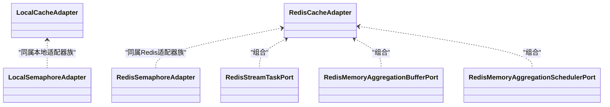
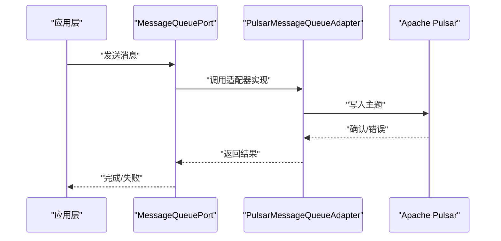
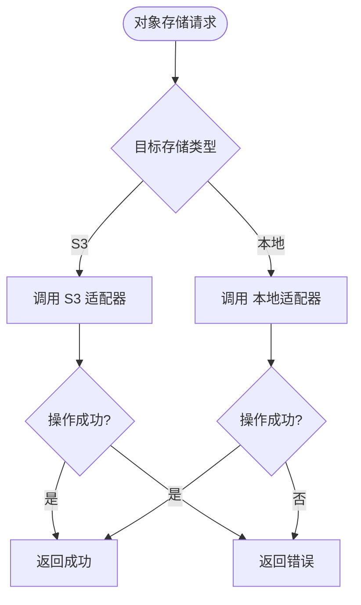
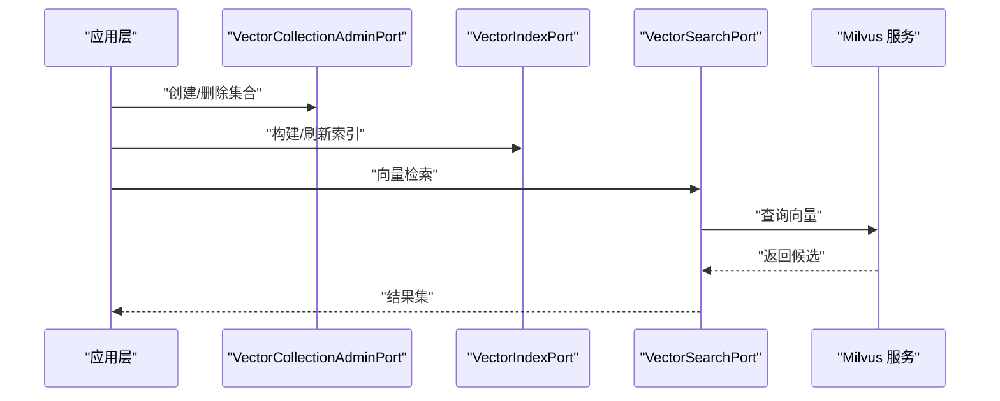
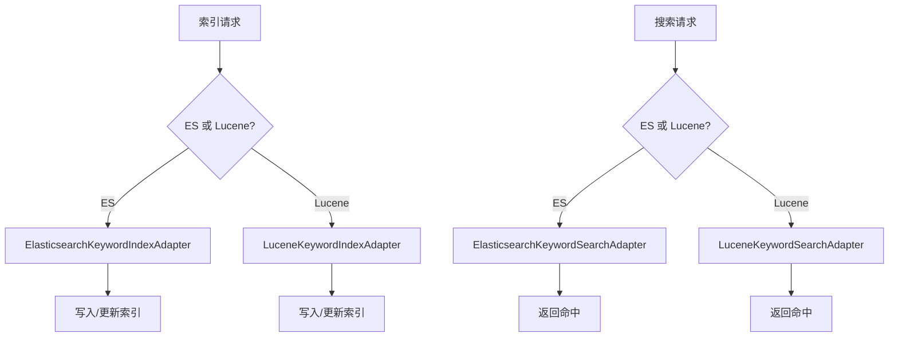

# 适配器系统

<cite>
**本文引用的文件**
- [pom.xml](file://pom.xml)
- [README.md](file://seahorse-agent-adapter-cache-local/README.md)
- [LocalCacheAdapter.java](file://seahorse-agent-adapter-cache-local/src/main/java/com/miracle/ai/seahorse/agent/adapters/cache/local/LocalCacheAdapter.java)
- [LocalSemaphoreAdapter.java](file://seahorse-agent-adapter-cache-local/src/main/java/com/miracle/ai/seahorse/agent/adapters/cache/local/LocalSemaphoreAdapter.java)
- [RedisCacheAdapter.java](file://seahorse-agent-adapter-cache-redis/src/main/java/com/miracle/ai/seahorse/agent/adapters/cache/redis/RedisCacheAdapter.java)
- [RedisSemaphoreAdapter.java](file://seahorse-agent-adapter-cache-redis/src/main/java/com/miracle/ai/seahorse/agent/adapters/cache/redis/RedisSemaphoreAdapter.java)
- [RedisStreamTaskPort.java](file://seahorse-agent-adapter-cache-redis/src/main/java/com/miracle/ai/seahorse/agent/adapters/cache/redis/RedisStreamTaskPort.java)
- [RedisMemoryAggregationBufferPort.java](file://seahorse-agent-adapter-cache-redis/src/main/java/com/miracle/ai/seahorse/agent/adapters/cache/redis/RedisMemoryAggregationBufferPort.java)
- [RedisMemoryAggregationSchedulerPort.java](file://seahorse-agent-adapter-cache-redis/src/main/java/com/miracle/ai/seahorse/agent/adapters/cache/redis/RedisMemoryAggregationSchedulerPort.java)
- [PulsarMessageQueueAdapter.java](file://seahorse-agent-adapter-mq-pulsar/src/main/java/com/miracle/ai/seahorse/agent/adapters/mq/pulsar/PulsarMessageQueueAdapter.java)
- [PulsarMessageEnvelope.java](file://seahorse-agent-adapter-mq-pulsar/src/main/java/com/miracle/ai/seahorse/agent/adapters/mq/pulsar/PulsarMessageEnvelope.java)
- [PulsarMessageQueueProperties.java](file://seahorse-agent-adapter-mq-pulsar/src/main/java/com/miracle/ai/seahorse/agent/adapters/mq/pulsar/PulsarMessageQueueProperties.java)
- [DirectMessageQueueAdapterTests.java](file://seahorse-agent-adapter-mq-direct/src/test/java/com/miracle/ai/seahorse/agent/adapters/mq/direct/DirectMessageQueueAdapterTests.java)
- [S3ObjectStorageAdapter.java](file://seahorse-agent-adapter-storage-s3/src/main/java/com/miracle/ai/seahorse/agent/adapters/storage/s3/S3ObjectStorageAdapter.java)
- [LocalObjectStorageAdapter.java](file://seahorse-agent-adapter-storage-local/src/main/java/com/miracle/ai/seahorse/agent/adapters/storage/local/LocalObjectStorageAdapter.java)
- [ElasticsearchKeywordIndexAdapter.java](file://seahorse-agent-adapter-search-elasticsearch/src/main/java/com/miracle/ai/seahorse/agent/adapters/search/elasticsearch/ElasticsearchKeywordIndexAdapter.java)
- [ElasticsearchKeywordSearchAdapter.java](file://seahorse-agent-adapter-search-elasticsearch/src/main/java/com/miracle/ai/seahorse/agent/adapters/search/elasticsearch/ElasticsearchKeywordSearchAdapter.java)
- [ElasticsearchMetadataSchemaIndexAdapter.java](file://seahorse-agent-adapter-search-elasticsearch/src/main/java/com/miracle/ai/seahorse/agent/adapters/search/elasticsearch/ElasticsearchMetadataSchemaIndexAdapter.java)
- [ElasticsearchKeywordHttpClient.java](file://seahorse-agent-adapter-search-elasticsearch/src/main/java/com/miracle/ai/seahorse/agent/adapters/search/elasticsearch/ElasticsearchKeywordHttpClient.java)
- [ElasticsearchKeywordProperties.java](file://seahorse-agent-adapter-search-elasticsearch/src/main/java/com/miracle/ai/seahorse/agent/adapters/search/elasticsearch/ElasticsearchKeywordProperties.java)
- [LuceneKeywordIndexAdapter.java](file://seahorse-agent-adapter-search-lucene/src/main/java/com/miracle/ai/seahorse/agent/adapters/search/lucene/LuceneKeywordIndexAdapter.java)
- [LuceneKeywordSearchAdapter.java](file://seahorse-agent-adapter-search-lucene/src/main/java/com/miracle/ai/seahorse/agent/adapters/search/lucene/LuceneKeywordSearchAdapter.java)
- [LuceneKeywordProperties.java](file://seahorse-agent-adapter-search-lucene/src/main/java/com/miracle/ai/seahorse/agent/adapters/search/lucene/LuceneKeywordProperties.java)
- [MilvusVectorAdapterTests.java](file://seahorse-agent-adapter-vector-milvus/src/test/java/com/miracle/ai/seahorse/agent/adapters/vector/milvus/MilvusVectorAdapterTests.java)
- [NoopVectorStoreAdapter.java](file://seahorse-agent-adapter-vector-noop/src/main/java/com/miracle/ai/seahorse/agent/adapters/vector/noop/NoopVectorStoreAdapter.java)
- [PgVectorAdapterTests.java](file://seahorse-agent-adapter-vector-pgvector/src/test/java/com/miracle/ai/seahorse/agent/adapters/vector/pgvector/PgVectorAdapterTests.java)
- [OpenAiCompatibleMemoryCompactionAutoConfigurationTests.java](file://seahorse-agent-adapter-ai-openai-compatible/src/test/java/com/miracle/ai/seahorse/agent/adapters/ai/openai/OpenAiCompatibleMemoryCompactionAutoConfigurationTests.java)
- [OpenAiCompatibleMemoryRefinerAdapterTests.java](file://seahorse-agent-adapter-ai-openai-compatible/src/test/java/com/miracle/ai/seahorse/agent/adapters/ai/openai/OpenAiCompatibleMemoryRefinerAdapterTests.java)
- [OpenAiCompatibleModelAdapterTests.java](file://seahorse-agent-adapter-ai-openai-compatible/src/test/java/com/miracle/ai/seahorse/agent/adapters/ai/openai/OpenAiCompatibleModelAdapterTests.java)
- [OpenAiCompatibleStreamingChatToolsTests.java](file://seahorse-agent-adapter-ai-openai-compatible/src/test/java/com/miracle/ai/seahorse/agent/adapters/ai/openai/OpenAiCompatibleStreamingChatToolsTests.java)
- [MicrometerObservationAdapterTests.java](file://seahorse-agent-adapter-observation-micrometer/src/test/java/com/miracle/ai/seahorse/agent/adapters/observation/micrometer/MicrometerObservationAdapterTests.java)
- [NoopObservationAdapter.java](file://seahorse-agent-adapter-observation-noop/src/main/java/com/miracle/ai/seahorse/agent/adapters/observation/noop/NoopObservationAdapter.java)
- [McpHttpAutoConfigurationCredentialTests.java](file://seahorse-agent-adapter-mcp-http/src/test/java/com/miracle/ai/seahorse/agent/adapters/mcp/http/McpHttpAutoConfigurationCredentialTests.java)
- [NativeMcpEnabledConditionTests.java](file://seahorse-agent-adapter-mcp-http/src/test/java/com/miracle/ai/seahorse/agent/adapters/mcp/http/NativeMcpEnabledConditionTests.java)
- [StreamableHttpMcpClientCredentialTests.java](file://seahorse-agent-adapter-mcp-http/src/test/java/com/miracle/ai/seahorse/agent/adapters/mcp/http/StreamableHttpMcpClientCredentialTests.java)
- [FeishuDocumentFetcherAdapterTests.java](file://seahorse-agent-adapter-source-feishu/src/test/java/com/miracle/ai/seahorse/agent/adapters/source/feishu/FeishuDocumentFetcherAdapterTests.java)
- [FeishuDocumentSourceAutoConfigurationTests.java](file://seahorse-agent-adapter-source-feishu/src/test/java/com/miracle/ai/seahorse/agent/adapters/source/feishu/FeishuDocumentSourceAutoConfigurationTests.java)
- [OpenApiSpecParserAdapterTests.java](file://seahorse-agent-adapter-openapi/src/test/java/com/miracle/ai/seahorse/agent/adapters/openapi/OpenApiSpecParserAdapterTests.java)
- [TikaDocumentParserAdapterTests.java](file://seahorse-agent-adapter-parser-tika/src/test/java/com/miracle/ai/seahorse/agent/adapters/parser/tika/TikaDocumentParserAdapterTests.java)
- [JdbcAccessDecisionRepositoryAdapterTests.java](file://seahorse-agent-adapter-repository-jdbc/src/test/java/com/miracle/ai/seahorse/agent/adapters/repository/jdbc/JdbcAccessDecisionRepositoryAdapterTests.java)
- [JdbcAgentRunRepositoryAdapterTests.java](file://seahorse-agent-adapter-repository-jdbc/src/test/java/com/miracle/ai/seahorse/agent/adapters/repository/jdbc/JdbcAgentRunRepositoryAdapterTests.java)
- [JdbcMemoryRepositoryAdapterTests.java](file://seahorse-agent-adapter-repository-jdbc/src/test/java/com/miracle/ai/seahorse/agent/adapters/repository/jdbc/JdbcMemoryRepositoryAdapterTests.java)
- [JdbcKnowledgeDocumentRepositoryAdapterTests.java](file://seahorse-agent-adapter-repository-jdbc/src/test/java/com/miracle/ai/seahorse/agent/adapters/repository/jdbc/JdbcKnowledgeDocumentRepositoryAdapterTests.java)
- [JdbcKnowledgeBaseRepositoryAdapterTests.java](file://seahorse-agent-adapter-repository-jdbc/src/test/java/com/miracle/ai/seahorse/agent/adapters/repository/jdbc/JdbcKnowledgeBaseRepositoryAdapterTests.java)
- [JdbcConversationRepositoryAdapterTests.java](file://seahorse-agent-adapter-repository-jdbc/src/test/java/com/miracle/ai/seahorse/agent/adapters/repository/jdbc/JdbcConversationRepositoryAdapterTests.java)
- [JdbcUserRepositoryAdapterTests.java](file://seahorse-agent-adapter-repository-jdbc/src/test/java/com/miracle/ai/seahorse/agent/adapters/repository/jdbc/JdbcUserRepositoryAdapterTests.java)
- [JdbcOutboxEventRepositoryAdapterTests.java](file://seahorse-agent-adapter-repository-jdbc/src/test/java/com/miracle/ai/seahorse/agent/adapters/repository/jdbc/JdbcOutboxEventRepositoryAdapterTests.java)
- [JdbcSecretStoreAdapterTests.java](file://seahorse-agent-adapter-repository-jdbc/src/test/java/com/miracle/ai/seahorse/agent/adapters/repository/jdbc/JdbcSecretStoreAdapterTests.java)
- [JdbcKnowledgeChunkRepositoryAdapterTests.java](file://seahorse-agent-adapter-repository-jdbc/src/test/java/com/miracle/ai/seahorse/agent/adapters/repository/jdbc/JdbcKnowledgeChunkRepositoryAdapterTests.java)
- [JdbcKnowledgeBaseQueryAdapterTests.java](file://seahorse-agent-adapter-repository-jdbc/src/test/java/com/miracle/ai/seahorse/agent/adapters/repository/jdbc/JdbcKnowledgeBaseQueryAdapterTests.java)
- [JdbcMemoryGraphRepositoryAdapterTests.java](file://seahorse-agent-adapter-repository-jdbc/src/test/java/com/miracle/ai/seahorse/agent/adapters/repository/jdbc/JdbcMemoryGraphRepositoryAdapterTests.java)
- [JdbcMemoryAliasRepositoryTests.java](file://seahorse-agent-adapter-repository-jdbc/src/test/java/com/miracle/ai/seahorse/agent/adapters/repository/jdbc/JdbcMemoryAliasRepositoryTests.java)
- [JdbcMemoryKeywordIndexRepositoryTests.java](file://seahorse-agent-adapter-repository-jdbc/src/test/java/com/miracle/ai/seahorse/agent/adapters/repository/jdbc/JdbcMemoryKeywordIndexRepositoryTests.java)
- [JdbcMemoryTraceRecorderAdapterTests.java](file://seahorse-agent-adapter-repository-jdbc/src/test/java/com/miracle/ai/seahorse/agent/adapters/repository/jdbc/JdbcMemoryTraceRecorderAdapterTests.java)
- [JdbcMemoryReviewFeedbackRepositoryTests.java](file://seahorse-agent-adapter-repository-jdbc/src/test/java/com/miracle/ai/seahorse/agent/adapters/repository/jdbc/JdbcMemoryReviewFeedbackRepositoryTests.java)
- [JdbcMemoryAggregationBufferAdapterTests.java](file://seahorse-agent-adapter-repository-jdbc/src/test/java/com/miracle/ai/seahorse/agent/adapters/repository/jdbc/JdbcMemoryAggregationBufferAdapterTests.java)
- [JdbcMemoryReviewFeedbackRepositoryAdapterTests.java](file://seahorse-agent-adapter-repository-jdbc/src/test/java/com/miracle/ai/seahorse/agent/adapters/repository/jdbc/JdbcMemoryReviewFeedbackRepositoryAdapterTests.java)
- [JdbcMemoryTraceRecorderAdapterTests.java](file://seahorse-agent-adapter-repository-jdbc/src/test/java/com/miracle/ai/seahorse/agent/adapters/repository/jdbc/JdbcMemoryTraceRecorderAdapterTests.java)
- [JdbcMemoryKeywordIndexRepositoryTests.java](file://seahorse-agent-adapter-repository-jdbc/src/test/java/com/miracle/ai/seahorse/agent/adapters/repository/jdbc/JdbcMemoryKeywordIndexRepositoryTests.java)
- [JdbcMemoryAliasRepositoryTests.java](file://seahorse-agent-adapter-repository-jdbc/src/test/java/com/miracle/ai/seahorse/agent/adapters/repository/jdbc/JdbcMemoryAliasRepositoryTests.java)
- [JdbcMemoryGraphRepositoryTests.java](file://seahorse-agent-adapter-repository-jdbc/src/test/java/com/miracle/ai/seahorse/agent/adapters/repository/jdbc/JdbcMemoryGraphRepositoryTests.java)
- [JdbcKnowledgeBaseQueryAdapterTests.java](file://seahorse-agent-adapter-repository-jdbc/src/test/java/com/miracle/ai/seahorse/agent/adapters/repository/jdbc/JdbcKnowledgeBaseQueryAdapterTests.java)
- [JdbcKnowledgeChunkRepositoryTests.java](file://seahorse-agent-adapter-repository-jdbc/src/test/java/com/miracle/ai/seahorse/agent/adapters/repository/jdbc/JdbcKnowledgeChunkRepositoryTests.java)
- [JdbcSecretStoreAdapterTests.java](file://seahorse-agent-adapter-repository-jdbc/src/test/java/com/miracle/ai/seahorse/agent/adapters/repository/jdbc/JdbcSecretStoreAdapterTests.java)
- [JdbcOutboxEventRepositoryTests.java](file://seahorse-agent-adapter-repository-jdbc/src/test/java/com/miracle/ai/seahorse/agent/adapters/repository/jdbc/JdbcOutboxEventRepositoryTests.java)
- [JdbcUserRepositoryTests.java](file://seahorse-agent-adapter-repository-jdbc/src/test/java/com/miracle/ai/seahorse/agent/adapters/repository/jdbc/JdbcUserRepositoryTests.java)
- [JdbcConversationRepositoryTests.java](file://seahorse-agent-adapter-repository-jdbc/src/test/java/com/miracle/ai/seahorse/agent/adapters/repository/jdbc/JdbcConversationRepositoryTests.java)
- [JdbcKnowledgeBaseRepositoryTests.java](file://seahorse-agent-adapter-repository-jdbc/src/test/java/com/miracle/ai/seahorse/agent/adapters/repository/jdbc/JdbcKnowledgeBaseRepositoryTests.java)
- [JdbcKnowledgeDocumentRepositoryTests.java](file://seahorse-agent-adapter-repository-jdbc/src/test/java/com/miracle/ai/seahorse/agent/adapters/repository/jdbc/JdbcKnowledgeDocumentRepositoryTests.java)
- [JdbcMemoryRepositoryTests.java](file://seahorse-agent-adapter-repository-jdbc/src/test/java/com/miracle/ai/seahorse/agent/adapters/repository/jdbc/JdbcMemoryRepositoryTests.java)
- [JdbcAgentRunRepositoryTests.java](file://seahorse-agent-adapter-repository-jdbc/src/test/java/com/miracle/ai/seahorse/agent/adapters/repository/jdbc/JdbcAgentRunRepositoryTests.java)
- [JdbcAccessDecisionRepositoryAdapterTests.java](file://seahorse-agent-adapter-repository-jdbc/src/test/java/com/miracle/ai/seahorse/agent/adapters/repository/jdbc/JdbcAccessDecisionRepositoryAdapterTests.java)
- [SeahorseAgentApplication.java](file://seahorse-agent-bootstrap/src/main/java/com/miracle/ai/seahorse/agent/SeahorseAgentApplication.java)
- [application.properties](file://seahorse-agent-bootstrap/src/main/resources/application.properties)
- [出站端口.md](file://docs/zh/content/后端系统/核心内核/端口接口/出站端口/出站端口.md)
</cite>

## 目录
1. [引言](#引言)
2. [项目结构](#项目结构)
3. [核心组件](#核心组件)
4. [架构总览](#架构总览)
5. [详细组件分析](#详细组件分析)
6. [依赖分析](#依赖分析)
7. [性能考虑](#性能考虑)
8. [故障排查指南](#故障排查指南)
9. [结论](#结论)
10. [附录](#附录)

## 引言
本文件系统化阐述 Seahorse Agent 的适配器体系，重点围绕端口适配器模式（Port-Adapter Pattern）展开：以 Kernel 中定义的“出站端口”为抽象契约，通过各 adapter-* 模块提供具体实现，从而实现与外部系统（缓存、消息队列、存储、向量库、搜索、观测、MCP 等）的解耦与可替换。文档覆盖适配器类型、配置参数、使用场景、性能特征、开发指南、协作关系与最佳实践，帮助开发者高效扩展与定制。

## 项目结构
项目采用多模块聚合结构，根 pom 统一管理版本与插件；核心内核 kernel 定义端口契约，各 adapter-* 模块提供具体实现并通过 SPI/META-INF 进行装配。

```mermaid
graph TB
ROOT["根工程<br/>pom.xml"] --> BOOT["seahorse-agent-bootstrap"]
ROOT --> KERNEL["seahorse-agent-kernel"]
ROOT --> ADAPTERS["适配器模块集合"]
ADAPTERS --> WEB["seahorse-agent-adapter-web"]
ADAPTERS --> CACHE_LOCAL["seahorse-agent-adapter-cache-local"]
ADAPTERS --> CACHE_REDIS["seahorse-agent-adapter-cache-redis"]
ADAPTERS --> MQ_PULSAR["seahorse-agent-adapter-mq-pulsar"]
ADAPTERS --> MQ_DIRECT["seahorse-agent-adapter-mq-direct"]
ADAPTERS --> STORAGE_S3["seahorse-agent-adapter-storage-s3"]
ADAPTERS --> STORAGE_LOCAL["seahorse-agent-adapter-storage-local"]
ADAPTERS --> SEARCH_ES["seahorse-agent-adapter-search-elasticsearch"]
ADAPTERS --> SEARCH_LUCENE["seahorse-agent-adapter-search-lucene"]
ADAPTERS --> VECTOR_MILVUS["seahorse-agent-adapter-vector-milvus"]
ADAPTERS --> VECTOR_PG["seahorse-agent-adapter-vector-pgvector"]
ADAPTERS --> VECTOR_NOOP["seahorse-agent-adapter-vector-noop"]
ADAPTERS --> OBS_MICROMETER["seahorse-agent-adapter-observation-micrometer"]
ADAPTERS --> OBS_NOOP["seahorse-agent-adapter-observation-noop"]
ADAPTERS --> MCP_HTTP["seahorse-agent-adapter-mcp-http"]
ADAPTERS --> MCP_SERVER["seahorse-agent-mcp-server"]
ADAPTERS --> JDBC["seahorse-agent-adapter-repository-jdbc"]
ADAPTERS --> OPENAI["seahorse-agent-adapter-ai-openai-compatible"]
ADAPTERS --> OPENAPI["seahorse-agent-adapter-openapi"]
ADAPTERS --> TIKA["seahorse-agent-adapter-parser-tika"]
ADAPTERS --> FEISHU["seahorse-agent-adapter-source-feishu"]
ADAPTERS --> SPRING_STARTER["seahorse-agent-spring-boot-starter"]
```

图表来源
- [pom.xml](file://pom.xml)

章节来源
- [pom.xml](file://pom.xml)

## 核心组件
- 出站端口（Outbound Ports）：由 kernel 模块定义，涵盖认证、缓存、聊天、知识库、内存、模型、向量、存储、消息队列、观测性、MCP 等领域接口，作为系统与外部依赖的契约边界。
- 适配器实现：各 adapter-* 模块实现对应端口，通过 SPI/META-INF 配置进行自动装配，支持本地与远端实现切换。
- 启动与装配：bootstrap 提供应用入口，starter 提供 Spring Boot 自动装配能力，确保端口与适配器在运行时正确绑定。

章节来源
- [出站端口.md](file://docs/zh/content/后端系统/核心内核/端口接口/出站端口/出站端口.md)

## 架构总览
端口适配器模式通过“契约（端口）+ 实现（适配器）”实现横切解耦。Kernel 不直接依赖外部系统，仅依赖抽象端口；具体实现由适配器模块提供，并通过 SPI 装配到运行时。

```mermaid
graph TB
subgraph "Kernel 核心"
KP["出站端口接口集"]
end
subgraph "适配器实现"
A_CACHE_LOCAL["缓存-本地"]
A_CACHE_REDIS["缓存-Redis"]
A_MQ_PULSAR["消息队列-Pulsar"]
A_MQ_DIRECT["消息队列-Direct"]
A_STORAGE_S3["存储-S3"]
A_STORAGE_LOCAL["存储-本地"]
A_SEARCH_ES["搜索-Elasticsearch"]
A_SEARCH_LUCENE["搜索-Lucene"]
A_VECTOR_MILVUS["向量库-Milvus"]
A_VECTOR_PG["向量库-pgvector"]
A_OBS_MICROMETER["观测-Micrometer"]
A_OBS_NOOP["观测-Noop"]
A_MCP_HTTP["MCP-HTTP"]
A_JDBC["仓库-JDBC"]
A_OPENAI["AI-OpenAI兼容"]
A_OPENAPI["OpenAPI 解析"]
A_TIKA["文档解析-Tika"]
A_FEISHU["飞书源"]
end
KP --> A_CACHE_LOCAL
KP --> A_CACHE_REDIS
KP --> A_MQ_PULSAR
KP --> A_MQ_DIRECT
KP --> A_STORAGE_S3
KP --> A_STORAGE_LOCAL
KP --> A_SEARCH_ES
KP --> A_SEARCH_LUCENE
KP --> A_VECTOR_MILVUS
KP --> A_VECTOR_PG
KP --> A_OBS_MICROMETER
KP --> A_OBS_NOOP
KP --> A_MCP_HTTP
KP --> A_JDBC
KP --> A_OPENAI
KP --> A_OPENAPI
KP --> A_TIKA
KP --> A_FEISHU
```

图表来源
- [出站端口.md](file://docs/zh/content/后端系统/核心内核/端口接口/出站端口/出站端口.md)

## 详细组件分析

### Web 适配器（RESTful API）
- 角色与职责：提供 HTTP 入口，承载对外 API、会话、认证、聊天、知识库、检索、内存、仪表盘等 REST 接口，作为前端与后端 Kernel 的桥梁。
- 关键实现：位于 seahorse-agent-adapter-web 模块，包含 web 包下的控制器与本地实现。
- 使用场景：需要标准 REST API 的前后端分离部署形态；与前端交互、统一鉴权与安全控制。
- 性能特点：基于 Spring MVC/Boot，具备良好的并发与响应特性；适合高并发请求与可观测性集成。
- 配置要点：端口、路径前缀、跨域、安全策略、日志级别等，通常在 application.properties 或环境变量中配置。

章节来源
- [SeahorseAgentApplication.java](file://seahorse-agent-bootstrap/src/main/java/com/miracle/ai/seahorse/agent/SeahorseAgentApplication.java)
- [application.properties](file://seahorse-agent-bootstrap/src/main/resources/application.properties)

### 缓存适配器（Redis、本地缓存）
- 本地缓存适配器
  - 功能：提供进程内缓存、分布式信号量、流式任务端口、内存聚合缓冲与调度端口等实现。
  - 适用场景：单机或轻量级部署，避免外部依赖，降低延迟。
  - 性能：低延迟、无网络开销；不跨节点共享状态。
- Redis 缓存适配器
  - 功能：提供分布式缓存、发布订阅、限流、分布式锁/信号量、流式任务、内存聚合缓冲与调度端口。
  - 适用场景：多实例部署、需要跨节点共享状态与一致性保障。
  - 性能：引入网络往返，但具备强一致性和横向扩展能力。
- 配置参数（示例维度）
  - 本地：内存大小、过期策略、并发度等。
  - Redis：连接地址、密码、数据库索引、超时、序列化方式、槽位映射等。
- 注册机制：通过 META-INF 配置声明实现类与端口的绑定，Spring Boot 启动时自动装配。

图表来源
- [LocalCacheAdapter.java](file://seahorse-agent-adapter-cache-local/src/main/java/com/miracle/ai/seahorse/agent/adapters/cache/local/LocalCacheAdapter.java)
- [LocalSemaphoreAdapter.java](file://seahorse-agent-adapter-cache-local/src/main/java/com/miracle/ai/seahorse/agent/adapters/cache/local/LocalSemaphoreAdapter.java)
- [RedisCacheAdapter.java](file://seahorse-agent-adapter-cache-redis/src/main/java/com/miracle/ai/seahorse/agent/adapters/cache/redis/RedisCacheAdapter.java)
- [RedisSemaphoreAdapter.java](file://seahorse-agent-adapter-cache-redis/src/main/java/com/miracle/ai/seahorse/agent/adapters/cache/redis/RedisSemaphoreAdapter.java)
- [RedisStreamTaskPort.java](file://seahorse-agent-adapter-cache-redis/src/main/java/com/miracle/ai/seahorse/agent/adapters/cache/redis/RedisStreamTaskPort.java)
- [RedisMemoryAggregationBufferPort.java](file://seahorse-agent-adapter-cache-redis/src/main/java/com/miracle/ai/seahorse/agent/adapters/cache/redis/RedisMemoryAggregationBufferPort.java)
- [RedisMemoryAggregationSchedulerPort.java](file://seahorse-agent-adapter-cache-redis/src/main/java/com/miracle/ai/seahorse/agent/adapters/cache/redis/RedisMemoryAggregationSchedulerPort.java)

章节来源
- [LocalCacheAdapter.java](file://seahorse-agent-adapter-cache-local/src/main/java/com/miracle/ai/seahorse/agent/adapters/cache/local/LocalCacheAdapter.java)
- [LocalSemaphoreAdapter.java](file://seahorse-agent-adapter-cache-local/src/main/java/com/miracle/ai/seahorse/agent/adapters/cache/local/LocalSemaphoreAdapter.java)
- [RedisCacheAdapter.java](file://seahorse-agent-adapter-cache-redis/src/main/java/com/miracle/ai/seahorse/agent/adapters/cache/redis/RedisCacheAdapter.java)
- [RedisSemaphoreAdapter.java](file://seahorse-agent-adapter-cache-redis/src/main/java/com/miracle/ai/seahorse/agent/adapters/cache/redis/RedisSemaphoreAdapter.java)
- [RedisStreamTaskPort.java](file://seahorse-agent-adapter-cache-redis/src/main/java/com/miracle/ai/seahorse/agent/adapters/cache/redis/RedisStreamTaskPort.java)
- [RedisMemoryAggregationBufferPort.java](file://seahorse-agent-adapter-cache-redis/src/main/java/com/miracle/ai/seahorse/agent/adapters/cache/redis/RedisMemoryAggregationBufferPort.java)
- [RedisMemoryAggregationSchedulerPort.java](file://seahorse-agent-adapter-cache-redis/src/main/java/com/miracle/ai/seahorse/agent/adapters/cache/redis/RedisMemoryAggregationSchedulerPort.java)
- [README.md](file://seahorse-agent-adapter-cache-local/README.md)

### 消息队列适配器（Pulsar、Direct）
- Pulsar 消息队列适配器
  - 功能：封装消息发送/接收、消息信封、属性配置等，实现 MessageQueuePort。
  - 适用场景：需要高吞吐、持久化、事务、分区与副本的生产级消息系统。
  - 性能：具备优秀的吞吐与可靠性，适合大规模异步任务与事件驱动架构。
  - 配置参数：服务 URL、命名空间、主题、认证、压缩、批处理、重试策略等。
- Direct 消息队列适配器
  - 功能：提供本地直连队列实现，便于测试与单机验证。
  - 适用场景：开发/测试环境、快速原型、无需外部中间件。
  - 性能：零网络开销，延迟极低；不具备持久化与跨进程能力。
- 协作关系：与 Kernel 的消息端口对接，支撑异步任务、事件分发、内存聚合等流程。

图表来源
- [PulsarMessageQueueAdapter.java](file://seahorse-agent-adapter-mq-pulsar/src/main/java/com/miracle/ai/seahorse/agent/adapters/mq/pulsar/PulsarMessageQueueAdapter.java)
- [PulsarMessageEnvelope.java](file://seahorse-agent-adapter-mq-pulsar/src/main/java/com/miracle/ai/seahorse/agent/adapters/mq/pulsar/PulsarMessageEnvelope.java)
- [PulsarMessageQueueProperties.java](file://seahorse-agent-adapter-mq-pulsar/src/main/java/com/miracle/ai/seahorse/agent/adapters/mq/pulsar/PulsarMessageQueueProperties.java)

章节来源
- [PulsarMessageQueueAdapter.java](file://seahorse-agent-adapter-mq-pulsar/src/main/java/com/miracle/ai/seahorse/agent/adapters/mq/pulsar/PulsarMessageQueueAdapter.java)
- [PulsarMessageEnvelope.java](file://seahorse-agent-adapter-mq-pulsar/src/main/java/com/miracle/ai/seahorse/agent/adapters/mq/pulsar/PulsarMessageEnvelope.java)
- [PulsarMessageQueueProperties.java](file://seahorse-agent-adapter-mq-pulsar/src/main/java/com/miracle/ai/seahorse/agent/adapters/mq/pulsar/PulsarMessageQueueProperties.java)
- [DirectMessageQueueAdapterTests.java](file://seahorse-agent-adapter-mq-direct/src/test/java/com/miracle/ai/seahorse/agent/adapters/mq/direct/DirectMessageQueueAdapterTests.java)

### 存储适配器（S3、本地存储）
- S3 对象存储适配器
  - 功能：实现 ObjectStoragePort，提供上传、下载、删除、列举等对象存储操作。
  - 适用场景：云端归档、大文件分发、备份与共享。
  - 性能：受网络带宽与延迟影响；支持断点续传与并发分片（视实现而定）。
  - 配置参数：Endpoint、Region、Bucket、AccessKey/Secret、SSL、超时、重试等。
- 本地存储适配器
  - 功能：实现 ObjectStoragePort，将对象存储在本地文件系统。
  - 适用场景：开发/测试、离线环境、小规模数据。
  - 性能：I/O 受磁盘影响；延迟低、吞吐高。
- 协作关系：与 Kernel 的存储端口对接，支撑文档、附件、模型权重等对象的持久化。

图表来源
- [S3ObjectStorageAdapter.java](file://seahorse-agent-adapter-storage-s3/src/main/java/com/miracle/ai/seahorse/agent/adapters/storage/s3/S3ObjectStorageAdapter.java)
- [LocalObjectStorageAdapter.java](file://seahorse-agent-adapter-storage-local/src/main/java/com/miracle/ai/seahorse/agent/adapters/storage/local/LocalObjectStorageAdapter.java)

章节来源
- [S3ObjectStorageAdapter.java](file://seahorse-agent-adapter-storage-s3/src/main/java/com/miracle/ai/seahorse/agent/adapters/storage/s3/S3ObjectStorageAdapter.java)
- [LocalObjectStorageAdapter.java](file://seahorse-agent-adapter-storage-local/src/main/java/com/miracle/ai/seahorse/agent/adapters/storage/local/LocalObjectStorageAdapter.java)

### 向量库适配器（Milvus、pgvector、Noop）
- Milvus 适配器
  - 功能：实现向量集合管理、索引构建与查询端口，对接 Milvus 分布式向量数据库。
  - 适用场景：海量向量检索、高维相似度计算、实时召回。
  - 性能：依赖 Milvus 集群规模与索引策略；支持分区与副本提升可用性。
  - 配置参数：服务地址、数据库/集合名、向量维度、索引类型与参数、查询超时等。
- pgvector 适配器
  - 功能：基于 PostgreSQL 的向量扩展实现向量检索与索引。
  - 适用场景：已有 PostgreSQL 基础设施、中小规模向量数据。
  - 性能：受数据库性能与索引影响；易于迁移与维护。
- Noop 适配器
  - 功能：空实现，用于占位或测试。
  - 适用场景：开发/测试、快速启动、禁用向量能力。
- 协作关系：与 Kernel 的向量端口对接，支撑 RAG 的向量检索与索引流程。

图表来源
- [MilvusVectorAdapterTests.java](file://seahorse-agent-adapter-vector-milvus/src/test/java/com/miracle/ai/seahorse/agent/adapters/vector/milvus/MilvusVectorAdapterTests.java)
- [PgVectorAdapterTests.java](file://seahorse-agent-adapter-vector-pgvector/src/test/java/com/miracle/ai/seahorse/agent/adapters/vector/pgvector/PgVectorAdapterTests.java)
- [NoopVectorStoreAdapter.java](file://seahorse-agent-adapter-vector-noop/src/main/java/com/miracle/ai/seahorse/agent/adapters/vector/noop/NoopVectorStoreAdapter.java)

章节来源
- [MilvusVectorAdapterTests.java](file://seahorse-agent-adapter-vector-milvus/src/test/java/com/miracle/ai/seahorse/agent/adapters/vector/milvus/MilvusVectorAdapterTests.java)
- [PgVectorAdapterTests.java](file://seahorse-agent-adapter-vector-pgvector/src/test/java/com/miracle/ai/seahorse/agent/adapters/vector/pgvector/PgVectorAdapterTests.java)
- [NoopVectorStoreAdapter.java](file://seahorse-agent-adapter-vector-noop/src/main/java/com/miracle/ai/seahorse/agent/adapters/vector/noop/NoopVectorStoreAdapter.java)

### 搜索适配器（Elasticsearch、Lucene）
- Elasticsearch 适配器
  - 功能：实现关键词索引、关键词检索、元数据模式索引等端口，对接 ES 集群。
  - 适用场景：全文检索、复杂过滤、聚合分析、高并发搜索。
  - 性能：依赖集群规模、分片与副本；支持近实时索引与批量导入。
  - 配置参数：集群地址、索引名称、映射、分片/副本、超时、认证等。
- Lucene 适配器
  - 功能：本地全文检索实现，适合小规模或离线场景。
  - 适用场景：开发/测试、单机检索、无需外部依赖。
  - 性能：纯内存/磁盘 IO，延迟低；不适合大规模数据。
- 协作关系：与 Kernel 的搜索端口对接，支撑关键词检索与元数据索引。

图表来源
- [ElasticsearchKeywordIndexAdapter.java](file://seahorse-agent-adapter-search-elasticsearch/src/main/java/com/miracle/ai/seahorse/agent/adapters/search/elasticsearch/ElasticsearchKeywordIndexAdapter.java)
- [ElasticsearchKeywordSearchAdapter.java](file://seahorse-agent-adapter-search-elasticsearch/src/main/java/com/miracle/ai/seahorse/agent/adapters/search/elasticsearch/ElasticsearchKeywordSearchAdapter.java)
- [ElasticsearchMetadataSchemaIndexAdapter.java](file://seahorse-agent-adapter-search-elasticsearch/src/main/java/com/miracle/ai/seahorse/agent/adapters/search/elasticsearch/ElasticsearchMetadataSchemaIndexAdapter.java)
- [LuceneKeywordIndexAdapter.java](file://seahorse-agent-adapter-search-lucene/src/main/java/com/miracle/ai/seahorse/agent/adapters/search/lucene/LuceneKeywordIndexAdapter.java)
- [LuceneKeywordSearchAdapter.java](file://seahorse-agent-adapter-search-lucene/src/main/java/com/miracle/ai/seahorse/agent/adapters/search/lucene/LuceneKeywordSearchAdapter.java)

章节来源
- [ElasticsearchKeywordIndexAdapter.java](file://seahorse-agent-adapter-search-elasticsearch/src/main/java/com/miracle/ai/seahorse/agent/adapters/search/elasticsearch/ElasticsearchKeywordIndexAdapter.java)
- [ElasticsearchKeywordSearchAdapter.java](file://seahorse-agent-adapter-search-elasticsearch/src/main/java/com/miracle/ai/seahorse/agent/adapters/search/elasticsearch/ElasticsearchKeywordSearchAdapter.java)
- [ElasticsearchMetadataSchemaIndexAdapter.java](file://seahorse-agent-adapter-search-elasticsearch/src/main/java/com/miracle/ai/seahorse/agent/adapters/search/elasticsearch/ElasticsearchMetadataSchemaIndexAdapter.java)
- [LuceneKeywordIndexAdapter.java](file://seahorse-agent-adapter-search-lucene/src/main/java/com/miracle/ai/seahorse/agent/adapters/search/lucene/LuceneKeywordIndexAdapter.java)
- [LuceneKeywordSearchAdapter.java](file://seahorse-agent-adapter-search-lucene/src/main/java/com/miracle/ai/seahorse/agent/adapters/search/lucene/LuceneKeywordSearchAdapter.java)
- [LuceneKeywordProperties.java](file://seahorse-agent-adapter-search-lucene/src/main/java/com/miracle/ai/seahorse/agent/adapters/search/lucene/LuceneKeywordProperties.java)

### 观测性适配器（Micrometer、Noop）
- Micrometer 适配器
  - 功能：实现 ObservationPort，接入 Micrometer 指标体系，输出计时、计数、分布等指标。
  - 适用场景：生产监控、SLA 告警、性能分析。
  - 性能：对性能影响较小；需注意指标数量与标签基数。
- Noop 适配器
  - 功能：空实现，用于禁用观测或测试。
- 协作关系：与 Kernel 的观测端口对接，统一采集与上报。

章节来源
- [MicrometerObservationAdapterTests.java](file://seahorse-agent-adapter-observation-micrometer/src/test/java/com/miracle/ai/seahorse/agent/adapters/observation/micrometer/MicrometerObservationAdapterTests.java)
- [NoopObservationAdapter.java](file://seahorse-agent-adapter-observation-noop/src/main/java/com/miracle/ai/seahorse/agent/adapters/observation/noop/NoopObservationAdapter.java)

### MCP 适配器（HTTP、Server）
- HTTP MCP 适配器
  - 功能：实现 MCP 工具调用的 HTTP 客户端，支持凭据注入与流式响应。
  - 适用场景：调用外部 MCP 服务器或工具服务。
  - 性能：受网络与服务端性能影响；支持超时与重试。
- MCP Server
  - 功能：提供本地 MCP 服务端能力，支持工具注册与调用。
  - 适用场景：本地工具编排与代理。
- 协作关系：与 Kernel 的 MCP 端口对接，支撑工具发现与调用。

章节来源
- [McpHttpAutoConfigurationCredentialTests.java](file://seahorse-agent-adapter-mcp-http/src/test/java/com/miracle/ai/seahorse/agent/adapters/mcp/http/McpHttpAutoConfigurationCredentialTests.java)
- [NativeMcpEnabledConditionTests.java](file://seahorse-agent-adapter-mcp-http/src/test/java/com/miracle/ai/seahorse/agent/adapters/mcp/http/NativeMcpEnabledConditionTests.java)
- [StreamableHttpMcpClientCredentialTests.java](file://seahorse-agent-adapter-mcp-http/src/test/java/com/miracle/ai/seahorse/agent/adapters/mcp/http/StreamableHttpMcpClientCredentialTests.java)

### AI 适配器（OpenAI 兼容）
- 功能：实现模型适配、流式聊天工具、记忆精炼与压缩等能力，兼容 OpenAI 风格 API。
- 适用场景：快速接入主流大模型服务，统一工具调用与流式输出。
- 性能：受网络与模型服务性能影响；支持流式传输降低首字延迟。
- 配置参数：API 地址、密钥、超时、模型名称、温度、流式开关等。

章节来源
- [OpenAiCompatibleMemoryCompactionAutoConfigurationTests.java](file://seahorse-agent-adapter-ai-openai-compatible/src/test/java/com/miracle/ai/seahorse/agent/adapters/ai/openai/OpenAiCompatibleMemoryCompactionAutoConfigurationTests.java)
- [OpenAiCompatibleMemoryRefinerAdapterTests.java](file://seahorse-agent-adapter-ai-openai-compatible/src/test/java/com/miracle/ai/seahorse/agent/adapters/ai/openai/OpenAiCompatibleMemoryRefinerAdapterTests.java)
- [OpenAiCompatibleModelAdapterTests.java](file://seahorse-agent-adapter-ai-openai-compatible/src/test/java/com/miracle/ai/seahorse/agent/adapters/ai/openai/OpenAiCompatibleModelAdapterTests.java)
- [OpenAiCompatibleStreamingChatToolsTests.java](file://seahorse-agent-adapter-ai-openai-compatible/src/test/java/com/miracle/ai/seahorse/agent/adapters/ai/openai/OpenAiCompatibleStreamingChatToolsTests.java)

### 其他适配器
- OpenAPI 解析适配器：解析 OpenAPI 规范，生成工具描述与参数校验规则。
- 文档解析适配器（Tika）：提取文档文本与元数据，支撑知识入库。
- 飞书源适配器：抓取飞书文档内容，作为知识源。
- JDBC 仓库适配器：实现各类领域仓储接口（用户、对话、知识、内存、审计等），支撑持久化与查询。

章节来源
- [OpenApiSpecParserAdapterTests.java](file://seahorse-agent-adapter-openapi/src/test/java/com/miracle/ai/seahorse/agent/adapters/openapi/OpenApiSpecParserAdapterTests.java)
- [TikaDocumentParserAdapterTests.java](file://seahorse-agent-adapter-parser-tika/src/test/java/com/miracle/ai/seahorse/agent/adapters/parser/tika/TikaDocumentParserAdapterTests.java)
- [FeishuDocumentFetcherAdapterTests.java](file://seahorse-agent-adapter-source-feishu/src/test/java/com/miracle/ai/seahorse/agent/adapters/source/feishu/FeishuDocumentFetcherAdapterTests.java)
- [FeishuDocumentSourceAutoConfigurationTests.java](file://seahorse-agent-adapter-source-feishu/src/test/java/com/miracle/ai/seahorse/agent/adapters/source/feishu/FeishuDocumentSourceAutoConfigurationTests.java)
- [JdbcAccessDecisionRepositoryAdapterTests.java](file://seahorse-agent-adapter-repository-jdbc/src/test/java/com/miracle/ai/seahorse/agent/adapters/repository/jdbc/JdbcAccessDecisionRepositoryAdapterTests.java)
- [JdbcAgentRunRepositoryAdapterTests.java](file://seahorse-agent-adapter-repository-jdbc/src/test/java/com/miracle/ai/seahorse/agent/adapters/repository/jdbc/JdbcAgentRunRepositoryAdapterTests.java)
- [JdbcMemoryRepositoryAdapterTests.java](file://seahorse-agent-adapter-repository-jdbc/src/test/java/com/miracle/ai/seahorse/agent/adapters/repository/jdbc/JdbcMemoryRepositoryAdapterTests.java)
- [JdbcKnowledgeDocumentRepositoryAdapterTests.java](file://seahorse-agent-adapter-repository-jdbc/src/test/java/com/miracle/ai/seahorse/agent/adapters/repository/jdbc/JdbcKnowledgeDocumentRepositoryAdapterTests.java)
- [JdbcKnowledgeBaseRepositoryAdapterTests.java](file://seahorse-agent-adapter-repository-jdbc/src/test/java/com/miracle/ai/seahorse/agent/adapters/repository/jdbc/JdbcKnowledgeBaseRepositoryAdapterTests.java)
- [JdbcConversationRepositoryAdapterTests.java](file://seahorse-agent-adapter-repository-jdbc/src/test/java/com/miracle/ai/seahorse/agent/adapters/repository/jdbc/JdbcConversationRepositoryAdapterTests.java)
- [JdbcUserRepositoryAdapterTests.java](file://seahorse-agent-adapter-repository-jdbc/src/test/java/com/miracle/ai/seahorse/agent/adapters/repository/jdbc/JdbcUserRepositoryAdapterTests.java)
- [JdbcOutboxEventRepositoryAdapterTests.java](file://seahorse-agent-adapter-repository-jdbc/src/test/java/com/miracle/ai/seahorse/agent/adapters/repository/jdbc/JdbcOutboxEventRepositoryAdapterTests.java)
- [JdbcSecretStoreAdapterTests.java](file://seahorse-agent-adapter-repository-jdbc/src/test/java/com/miracle/ai/seahorse/agent/adapters/repository/jdbc/JdbcSecretStoreAdapterTests.java)
- [JdbcKnowledgeChunkRepositoryAdapterTests.java](file://seahorse-agent-adapter-repository-jdbc/src/test/java/com/miracle/ai/seahorse/agent/adapters/repository/jdbc/JdbcKnowledgeChunkRepositoryAdapterTests.java)
- [JdbcKnowledgeBaseQueryAdapterTests.java](file://seahorse-agent-adapter-repository-jdbc/src/test/java/com/miracle/ai/seahorse/agent/adapters/repository/jdbc/JdbcKnowledgeBaseQueryAdapterTests.java)
- [JdbcMemoryGraphRepositoryAdapterTests.java](file://seahorse-agent-adapter-repository-jdbc/src/test/java/com/miracle/ai/seahorse/agent/adapters/repository/jdbc/JdbcMemoryGraphRepositoryAdapterTests.java)
- [JdbcMemoryAliasRepositoryTests.java](file://seahorse-agent-adapter-repository-jdbc/src/test/java/com/miracle/ai/seahorse/agent/adapters/repository/jdbc/JdbcMemoryAliasRepositoryTests.java)
- [JdbcMemoryKeywordIndexRepositoryTests.java](file://seahorse-agent-adapter-repository-jdbc/src/test/java/com/miracle/ai/seahorse/agent/adapters/repository/jdbc/JdbcMemoryKeywordIndexRepositoryTests.java)
- [JdbcMemoryTraceRecorderAdapterTests.java](file://seahorse-agent-adapter-repository-jdbc/src/test/java/com/miracle/ai/seahorse/agent/adapters/repository/jdbc/JdbcMemoryTraceRecorderAdapterTests.java)
- [JdbcMemoryReviewFeedbackRepositoryTests.java](file://seahorse-agent-adapter-repository-jdbc/src/test/java/com/miracle/ai/seahorse/agent/adapters/repository/jdbc/JdbcMemoryReviewFeedbackRepositoryTests.java)
- [JdbcMemoryAggregationBufferAdapterTests.java](file://seahorse-agent-adapter-repository-jdbc/src/test/java/com/miracle/ai/seahorse/agent/adapters/repository/jdbc/JdbcMemoryAggregationBufferAdapterTests.java)

## 依赖分析
- 模块间依赖：根 pom 统一管理版本与插件；各 adapter-* 模块独立构建，通过 SPI/META-INF 与 Kernel 解耦。
- 外部依赖：各适配器依赖对应外部系统 SDK 或客户端（如 Redis、Pulsar、ES、Milvus、S3 等），需在运行时提供配置。
- 装配机制：Spring Boot Starter 提供自动装配，根据条件注解与配置启用相应适配器。

```mermaid
graph TB
ROOT["根工程"] --> K["kernel"]
ROOT --> A_WEB["adapter-web"]
ROOT --> A_CACHE_R["adapter-cache-redis"]
ROOT --> A_CACHE_L["adapter-cache-local"]
ROOT --> A_MQ_P["adapter-mq-pulsar"]
ROOT --> A_MQ_D["adapter-mq-direct"]
ROOT --> A_STORE_S3["adapter-storage-s3"]
ROOT --> A_STORE_L["adapter-storage-local"]
ROOT --> A_SEARCH_ES["adapter-search-elasticsearch"]
ROOT --> A_SEARCH_L["adapter-search-lucene"]
ROOT --> A_VEC_M["adapter-vector-milvus"]
ROOT --> A_VEC_PG["adapter-vector-pgvector"]
ROOT --> A_OBS_M["adapter-observation-micrometer"]
ROOT --> A_OBS_N["adapter-observation-noop"]
ROOT --> A_MCP_H["adapter-mcp-http"]
ROOT --> A_MCP_S["mcp-server"]
ROOT --> A_JDBC["adapter-repository-jdbc"]
ROOT --> A_OPENAI["adapter-ai-openai-compatible"]
ROOT --> A_OPENAPI["adapter-openapi"]
ROOT --> A_TIKA["adapter-parser-tika"]
ROOT --> A_FEISHU["adapter-source-feishu"]
ROOT --> STARTER["spring-boot-starter"]
```

图表来源
- [pom.xml](file://pom.xml)

章节来源
- [pom.xml](file://pom.xml)

## 性能考虑
- 本地适配器（本地缓存、本地存储、Lucene）延迟低、无网络开销，适合开发/测试与小规模场景。
- 远程适配器（Redis、Pulsar、ES、Milvus、S3）具备更强扩展性与可靠性，但引入网络与外部系统依赖，需关注超时、重试与降级策略。
- 向量与搜索适配器的性能高度依赖索引策略、硬件资源与查询参数；建议在预生产环境进行压测与调优。
- 观测性适配器应合理设置指标粒度与采样率，避免对业务性能造成显著影响。

## 故障排查指南
- 端口未装配：检查 META-INF 配置是否正确声明实现类与端口绑定，确认 Spring Boot 启动日志中的装配信息。
- 连接失败：核对适配器配置（地址、凭证、超时、SSL 等），逐项验证网络连通性与权限。
- 性能问题：针对远程适配器，优先检查网络延迟、外部系统负载与索引/查询参数；对本地适配器，关注内存与磁盘 I/O。
- 日志与监控：启用 Micrometer 观测适配器，收集关键指标；结合应用日志定位异常。

## 结论
Seahorse Agent 的适配器系统通过端口适配器模式实现了与外部系统的高内聚、低耦合解耦。开发者可根据部署环境与性能需求灵活选择适配器实现，并通过统一的端口契约与自动装配机制快速集成与扩展。

## 附录

### 适配器选择指南与最佳实践
- 选择原则
  - 单机/开发：优先本地适配器（本地缓存、本地存储、Lucene、Direct MQ）。
  - 生产：优先远程适配器（Redis、Pulsar、ES、Milvus、S3），并配套完善的监控与告警。
  - 数据规模：小规模选本地/Lucene；大规模选分布式系统（Redis、Pulsar、ES、Milvus、S3）。
- 最佳实践
  - 明确端口职责边界，避免在一个适配器中实现多个端口的复杂逻辑。
  - 为每个适配器提供完善的单元测试与集成测试，覆盖成功/失败/超时等场景。
  - 在配置中区分环境（dev/stage/prod），并使用环境变量或配置中心管理敏感信息。
  - 对远程适配器设置合理的超时、重试与熔断策略，增强系统韧性。
  - 通过 Micrometer 观测适配器统一采集指标，建立 SLA 与容量规划。

### 适配器开发指南
- 端口接口定义
  - 在 kernel 的 ports/outbound 下定义清晰的接口契约，明确输入/输出与异常语义。
- 适配器实现
  - 在对应 adapter-* 模块中实现端口接口，遵循单一职责与最小暴露面原则。
  - 将外部依赖封装在适配器内部，避免上层感知具体实现细节。
- 注册机制
  - 在 META-INF 目录下声明实现类与端口的绑定关系，确保 Spring Boot 启动时自动装配。
- 验证与测试
  - 提供单元测试与集成测试，覆盖正常流程与异常分支；对远程适配器模拟外部系统行为。
- 文档与发布
  - 为适配器编写使用说明与配置参数清单；通过 Maven 发布至私有仓库或中央仓库。