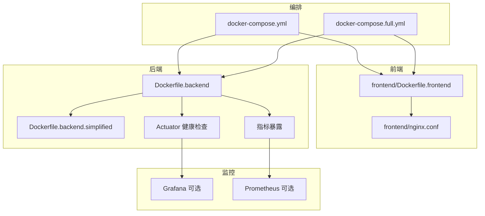
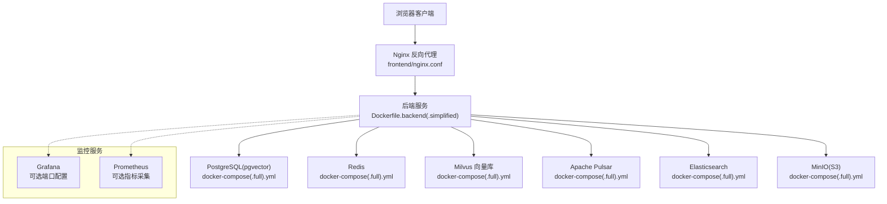
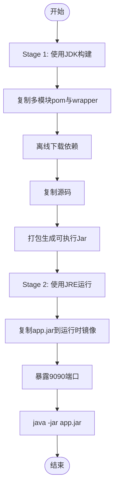
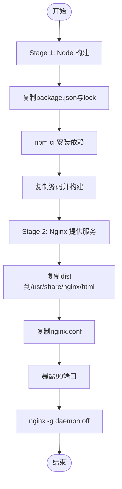
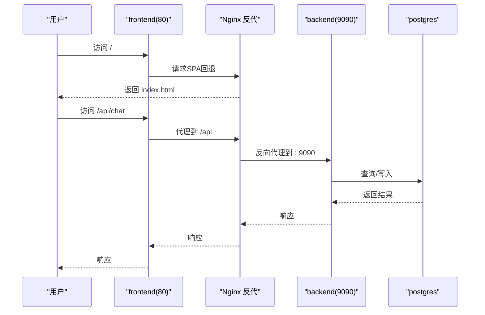
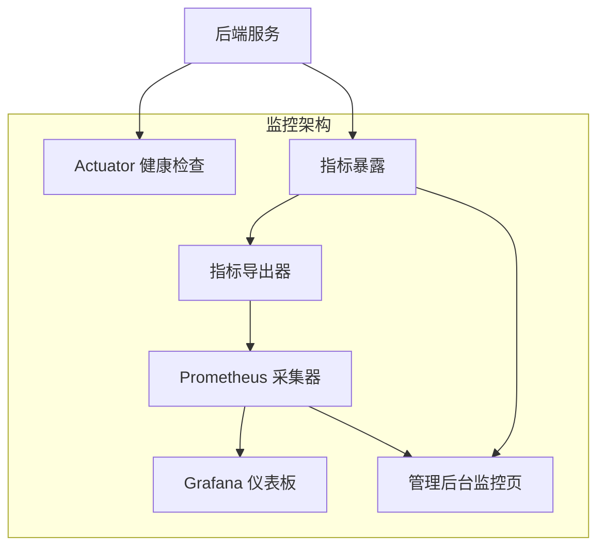
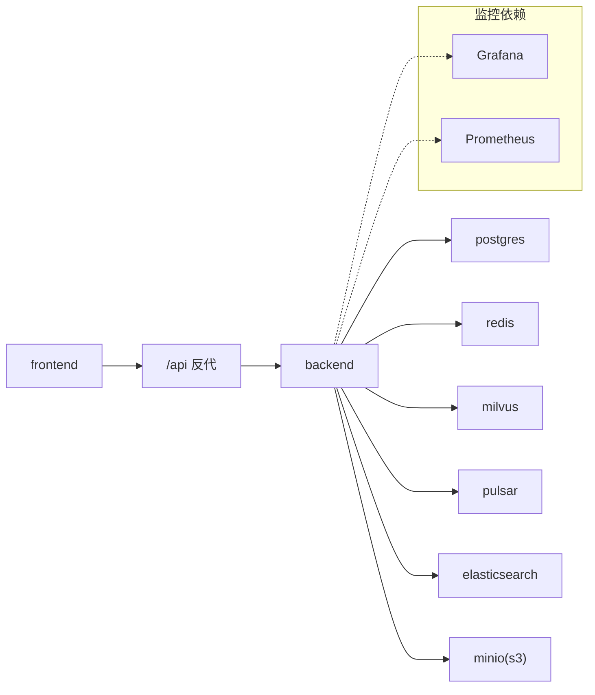

# 容器化配置

<cite>
**本文引用的文件**
- [Dockerfile.backend](file://Dockerfile.backend)
- [Dockerfile.backend.simplified](file://Dockerfile.backend.simplified)
- [Dockerfile.frontend](file://frontend/Dockerfile.frontend)
- [docker-compose.yml](file://docker-compose.yml)
- [docker-compose.full.yml](file://docker-compose.full.yml)
- [nginx.conf](file://frontend/nginx.conf)
- [.dockerignore](file://.dockerignore)
- [frontend/.dockerignore](file://frontend/.dockerignore)
- [frontend/package.json](file://frontend/package.json)
- [frontend/vite.config.js](file://frontend/vite.config.js)
- [redeploy.ps1](file://redeploy.ps1)
</cite>

## 目录
1. [简介](#简介)
2. [项目结构](#项目结构)
3. [核心组件](#核心组件)
4. [架构总览](#架构总览)
5. [详细组件分析](#详细组件分析)
6. [监控与可观测性增强](#监控与可观测性增强)
7. [依赖分析](#依赖分析)
8. [性能考虑](#性能考虑)
9. [故障排查指南](#故障排查指南)
10. [结论](#结论)
11. [附录](#附录)

## 简介
本文件面向Seahorse Agent的容器化部署，围绕后端与前端的Docker镜像构建、Compose服务编排、安全与性能优化、健康检查与重启策略、监控与可观测性增强、以及调试与日志收集等方面进行系统性说明。读者可据此完成本地开发与生产环境的稳定部署。

## 项目结构
- 后端镜像采用多阶段构建：第一阶段使用JDK构建Spring Boot可执行Jar；第二阶段使用JRE运行，减小体积与攻击面。
- 前端镜像采用多阶段构建：第一阶段使用Node打包静态资源；第二阶段使用Nginx提供反向代理与SPA回退。
- Compose通过服务编排定义后端、前端及数据库、消息队列、向量库、对象存储等依赖服务，并设置健康检查与重启策略。
- Nginx作为前端静态资源服务器，统一代理/api请求到后端服务，支持SSE与WebSocket。
- **新增**：监控服务网络隔离与Grafana端口配置，Actuator健康检查与后端服务指标暴露。

**图表来源**
- [Dockerfile.frontend:1-30](file://frontend/Dockerfile.frontend#L1-L30)
- [Dockerfile.backend:1-63](file://Dockerfile.backend#L1-L63)
- [Dockerfile.backend.simplified:1-10](file://Dockerfile.backend.simplified#L1-L10)
- [docker-compose.yml:1-99](file://docker-compose.yml#L1-L99)
- [docker-compose.full.yml:1-402](file://docker-compose.full.yml#L1-L402)

**章节来源**
- [Dockerfile.backend:1-63](file://Dockerfile.backend#L1-L63)
- [Dockerfile.backend.simplified:1-10](file://Dockerfile.backend.simplified#L1-L10)
- [Dockerfile.frontend:1-30](file://frontend/Dockerfile.frontend#L1-L30)
- [docker-compose.yml:1-99](file://docker-compose.yml#L1-L99)
- [docker-compose.full.yml:1-402](file://docker-compose.full.yml#L1-L402)

## 核心组件
- 后端镜像（多阶段构建）：使用Temurin JDK进行构建，再复制到Temurin JRE运行时，暴露9090端口，入口为Java Jar。
- 前端镜像（多阶段构建）：使用Node打包，Nginx提供静态服务与/api反向代理，暴露80端口。
- Compose服务编排：定义postgres、redis、elasticsearch、minio、milvus、pulsar等基础设施与应用服务，设置健康检查与重启策略。
- Nginx配置：统一代理/api到后端，开启SSE与WebSocket支持，SPA回退至index.html。
- **新增**：监控服务网络隔离，Grafana端口配置，Actuator健康检查，后端服务指标暴露。

**章节来源**
- [Dockerfile.backend:1-63](file://Dockerfile.backend#L1-L63)
- [Dockerfile.frontend:1-30](file://frontend/Dockerfile.frontend#L1-L30)
- [docker-compose.yml:1-99](file://docker-compose.yml#L1-L99)
- [docker-compose.full.yml:1-402](file://docker-compose.full.yml#L1-L402)
- [nginx.conf:1-32](file://frontend/nginx.conf#L1-L32)

## 架构总览
下图展示Seahorse Agent在Compose中的整体拓扑：前端通过Nginx反向代理访问后端，后端连接数据库、缓存、消息队列、向量库、对象存储等外部依赖。**新增**监控服务可选集成，支持网络隔离与独立端口配置。

**图表来源**
- [docker-compose.full.yml:5-402](file://docker-compose.full.yml#L5-L402)
- [nginx.conf:1-32](file://frontend/nginx.conf#L1-L32)
- [Dockerfile.backend.simplified:1-10](file://Dockerfile.backend.simplified#L1-L10)

**章节来源**
- [docker-compose.full.yml:1-402](file://docker-compose.full.yml#L1-L402)
- [nginx.conf:1-32](file://frontend/nginx.conf#L1-L32)
- [Dockerfile.backend.simplified:1-10](file://Dockerfile.backend.simplified#L1-L10)

## 详细组件分析

### 后端镜像构建（Dockerfile.backend）
- 多阶段构建
  - 第一阶段：使用Temurin JDK构建，复制多模块pom与源码，先下载依赖再执行打包，生成可执行Jar。
  - 第二阶段：使用Temurin JRE运行时，仅拷贝上一阶段构建产物，暴露9090端口，以java -jar启动。
- 代理参数传递：通过ARG注入HTTP/HTTPS/NO_PROXY，便于内网构建。
- 优化点
  - 分层缓存：优先复制pom与wrapper，提升依赖下载缓存命中率。
  - 最小运行时：使用JRE阶段替代JDK，减少镜像体积与漏洞面。
  - 单文件可执行Jar：简化运行与分发。

**图表来源**
- [Dockerfile.backend:1-63](file://Dockerfile.backend#L1-L63)

**章节来源**
- [Dockerfile.backend:1-63](file://Dockerfile.backend#L1-L63)

### 后端镜像简化版（Dockerfile.backend.simplified）
- 直接基于JRE，复制已构建好的可执行Jar，适合CI流水线中跳过构建阶段的场景。
- 保持与完整版相同的运行参数与端口暴露。

**章节来源**
- [Dockerfile.backend.simplified:1-10](file://Dockerfile.backend.simplified#L1-L10)

### 前端镜像构建（Dockerfile.frontend）
- 多阶段构建
  - 第一阶段：使用Node Alpine，安装依赖并构建静态资源。
  - 第二阶段：使用Nginx Alpine，复制dist与自定义nginx.conf，暴露80端口。
- 构建参数
  - 支持通过VITE_API_BASE_URL、VITE_SEAHORSE_PRODUCT_MODE、VITE_SEAHORSE_ENABLE_ADVANCED_ADMIN等参数定制构建。
- Nginx配置要点
  - /api前缀代理到后端9090端口。
  - 关闭代理缓冲与缓存以支持SSE与长连接。
  - 设置升级头以支持WebSocket。
  - SPA回退到index.html。

**图表来源**
- [Dockerfile.frontend:1-30](file://frontend/Dockerfile.frontend#L1-L30)
- [nginx.conf:1-32](file://frontend/nginx.conf#L1-L32)

**章节来源**
- [Dockerfile.frontend:1-30](file://frontend/Dockerfile.frontend#L1-L30)
- [nginx.conf:1-32](file://frontend/nginx.conf#L1-L32)

### Compose服务编排（docker-compose.yml 与 docker-compose.full.yml）
- 基础编排（docker-compose.yml）
  - postgres：初始化脚本挂载、健康检查、持久化数据卷。
  - backend：依赖postgres健康，暴露9090，挂载本地存储卷，设置大量产品模式与功能开关环境变量。
  - frontend：依赖backend，暴露80端口。
- 全量编排（docker-compose.full.yml）
  - 增加redis、elasticsearch、minio、milvus、pulsar等服务，均配置健康检查与重启策略。
  - backend在全量编排中启用更多适配器（向量库、缓存、存储、消息队列、观测、搜索）。
- 依赖关系
  - backend依赖postgres健康；frontend依赖backend。
  - 全量编排中backend还依赖redis、milvus、pulsar、elasticsearch、minio健康。

**图表来源**
- [docker-compose.yml:1-99](file://docker-compose.yml#L1-L99)
- [docker-compose.full.yml:1-402](file://docker-compose.full.yml#L1-L402)
- [nginx.conf:1-32](file://frontend/nginx.conf#L1-L32)

**章节来源**
- [docker-compose.yml:1-99](file://docker-compose.yml#L1-L99)
- [docker-compose.full.yml:1-402](file://docker-compose.full.yml#L1-L402)
- [nginx.conf:1-32](file://frontend/nginx.conf#L1-L32)

### 健康检查与重启策略
- postgres：使用pg_isready健康检查，间隔短、重试次数适中，重启策略为unless-stopped。
- redis：使用redis-cli ping，短周期检查。
- elasticsearch：使用HTTP健康接口，较长启动期。
- minio：使用mc ready检测。
- milvus：使用HTTP健康z，较长启动期。
- pulsar：zookeeper、bookie、broker分别健康检查，较长启动期。
- backend/frontend：未配置健康检查，使用unless-stopped重启策略。

**章节来源**
- [docker-compose.full.yml:1-402](file://docker-compose.full.yml#L1-L402)
- [docker-compose.yml:1-99](file://docker-compose.yml#L1-L99)

### 静态资源优化与缓存策略（前端）
- 构建阶段：使用Node Alpine，npm ci确保确定性依赖安装。
- 运行阶段：Nginx提供静态资源服务，关闭代理缓冲与缓存以支持SSE与长连接。
- SPA路由：所有未匹配路径回退到index.html，保证前端路由正常工作。
- API代理：/api前缀统一转发到后端，保留Host、X-Real-IP、X-Forwarded-*等头部。

**章节来源**
- [Dockerfile.frontend:1-30](file://frontend/Dockerfile.frontend#L1-L30)
- [nginx.conf:1-32](file://frontend/nginx.conf#L1-L32)

### 依赖管理与镜像优化（后端）
- Maven离线依赖：在Stage 1先执行离线下载，提升后续构建缓存命中率。
- 分层复制：先复制pom与wrapper，再复制源码，最大化利用Docker层缓存。
- 运行时精简：Stage 2使用JRE，避免JDK体积与潜在漏洞。
- 单文件Jar：便于复制与运行，减少中间层复杂度。

**章节来源**
- [Dockerfile.backend:1-63](file://Dockerfile.backend#L1-L63)

## 监控与可观测性增强

### Actuator健康检查集成
- **新增**：后端服务集成Spring Boot Actuator，提供标准化健康检查端点
- 配置要点：
  - `/actuator/health` 返回JSON格式健康状态
  - `/actuator/info` 提供应用基本信息
  - 支持自定义健康指示器
- 与监控系统的集成：
  - 自研管理后台直接读取Actuator端点
  - Prometheus可通过HTTP抓取指标
  - Grafana通过数据源连接Actuator或Prometheus

### 监控服务网络隔离
- **新增**：监控服务（Grafana/Prometheus）与业务服务网络隔离
- 配置策略：
  - 使用独立的Docker网络
  - 限制对外暴露端口
  - 通过反向代理访问监控界面
- 端口配置：
  - Grafana默认端口：3000（可配置）
  - Prometheus默认端口：9090（与后端区分）

### 指标暴露与采集
- **新增**：后端服务指标自动暴露
- 指标类型：
  - HTTP请求指标：`http.server.requests`
  - 数据库连接池指标：`hikaricp.connections.*`
  - 应用自定义指标：通过MeterRegistry注册
- 采集方式：
  - 自研管理后台轮询Actuator端点
  - Prometheus定时抓取指标
  - Grafana通过数据源展示仪表板

**图表来源**
- [docker-compose.full.yml:1-402](file://docker-compose.full.yml#L1-L402)

**章节来源**
- [docker-compose.full.yml:1-402](file://docker-compose.full.yml#L1-L402)

## 依赖分析
- 组件耦合
  - frontend依赖backend提供的/api接口。
  - backend依赖postgres、redis、milvus、pulsar、elasticsearch、minio等外部服务。
- 直接与间接依赖
  - Compose直接声明各服务及其健康检查与重启策略。
  - 后端通过环境变量与网络连接到各外部服务。
- 外部依赖集成
  - 向量库：milvus（全量编排启用）。
  - 缓存：redis（全量编排启用）。
  - 存储：minio（S3兼容）。
  - 消息队列：pulsar。
  - 搜索：elasticsearch。
  - 数据源：postgres。
- **新增**：监控依赖（可选）：Grafana、Prometheus。

**图表来源**
- [docker-compose.full.yml:1-402](file://docker-compose.full.yml#L1-L402)
- [nginx.conf:1-32](file://frontend/nginx.conf#L1-L32)

**章节来源**
- [docker-compose.full.yml:1-402](file://docker-compose.full.yml#L1-L402)
- [nginx.conf:1-32](file://frontend/nginx.conf#L1-L32)

## 性能考虑
- 镜像体积与启动时间
  - 后端使用JRE运行时，显著降低镜像体积与启动时间。
  - 前端使用Nginx静态服务，避免Node运行时开销。
- 构建缓存
  - 后端Stage 1优先复制pom与wrapper，提升依赖下载缓存命中率。
  - 前端使用npm ci，确保依赖安装一致性。
- 网络与I/O
  - 将静态资源与API分离，Nginx处理静态与反代，后端专注业务逻辑。
  - 对SSE与WebSocket进行专门配置，避免代理缓冲影响实时性。
- **新增**：监控性能优化
  - Actuator指标采集低开销
  - Prometheus抓取间隔可配置
  - Grafana仪表板按需加载

## 故障排查指南
- 健康检查失败
  - 查看postgres/redis/elasticsearch/minio/milvus/pulsar的健康检查输出与日志。
  - 调整健康检查间隔、超时与重试次数以适应不同环境。
- 代理问题
  - 确认Nginx是否正确代理/api到后端9090。
  - 检查SSE/WS相关头是否正确传递。
- 端口冲突
  - 确保宿主机80、9090、5432等端口未被占用。
  - **新增**：监控服务端口（3000、9090）需单独检查。
- 数据持久化
  - 检查postgres-data、seahorse-storage等数据卷是否正确挂载。
- 日志收集
  - 使用docker compose logs -f查看服务日志。
  - 在生产环境建议接入集中式日志系统（如ELK/Fluentd）。
- **新增**：监控相关问题
  - Actuator端点访问：`curl http://localhost:9090/actuator/health`
  - 指标采集验证：检查Prometheus抓取状态
  - Grafana连接：确认数据源配置与仪表板加载

**章节来源**
- [docker-compose.yml:1-99](file://docker-compose.yml#L1-L99)
- [docker-compose.full.yml:1-402](file://docker-compose.full.yml#L1-L402)
- [nginx.conf:1-32](file://frontend/nginx.conf#L1-L32)
- [redeploy.ps1:98-123](file://redeploy.ps1#L98-L123)

## 结论
通过多阶段构建与精简运行时，后端与前端镜像实现了较小体积与较快启动；Compose提供了清晰的服务编排与健康检查机制；Nginx作为反向代理统一处理静态资源与API转发。**新增的监控与可观测性增强**包括Actuator健康检查、指标暴露、监控服务网络隔离等，为生产环境提供了完整的监控解决方案。结合合理的重启策略与日志收集，可满足本地开发与生产部署的需求。

## 附录

### 安全最佳实践
- 非root用户运行
  - 当前镜像以root运行。建议在镜像中创建非root用户并切换运行，减少权限风险。
- 最小化基础镜像
  - 已使用Alpine与JRE，进一步可考虑多阶段构建中仅复制必要文件。
- 凭据与密钥
  - 使用Compose的环境变量或外部密钥管理服务注入敏感信息，避免硬编码。
- 网络隔离
  - **新增**：将监控服务（Grafana/Prometheus）与业务服务隔离在不同网络中。
  - 限制对外暴露端口，仅开放必需端口。
  - **新增**：监控服务端口（3000、9090）应与业务端口分离。

**章节来源**
- [Dockerfile.backend:1-63](file://Dockerfile.backend#L1-L63)
- [Dockerfile.frontend:1-30](file://frontend/Dockerfile.frontend#L1-L30)
- [docker-compose.yml:1-99](file://docker-compose.yml#L1-L99)
- [docker-compose.full.yml:1-402](file://docker-compose.full.yml#L1-L402)

### 容器资源限制配置
- CPU与内存限制
  - 在Compose中为每个服务添加deploy.resources.limits与reservations，控制CPU与内存上限与预留。
- I/O限制
  - 对数据卷较多的服务（如postgres、milvus、minio）可考虑限制磁盘I/O。
- **新增**：监控服务资源配置
  - Grafana：建议分配1-2GB内存，端口3000
  - Prometheus：建议分配2-4GB内存，端口9090

**章节来源**
- [docker-compose.yml:1-99](file://docker-compose.yml#L1-L99)
- [docker-compose.full.yml:1-402](file://docker-compose.full.yml#L1-L402)

### 健康检查与重启策略
- 建议为backend与frontend增加健康检查端点，结合unless-stopped或on-failure策略。
- 对于长时间启动的服务（如milvus、pulsar），适当延长start_period与重试次数。
- **新增**：监控服务健康检查
  - Grafana：检查3000端口可达性
  - Prometheus：检查9090端口与抓取状态

**章节来源**
- [docker-compose.full.yml:1-402](file://docker-compose.full.yml#L1-L402)
- [docker-compose.yml:1-99](file://docker-compose.yml#L1-L99)

### 调试与日志收集
- 调试
  - 使用docker compose exec进入容器查看进程与日志。
  - 前端开发可使用vite dev模式（前端目录下），后端可使用spring-boot devtools或远程调试。
  - **新增**：监控调试
    - 访问`http://localhost:9090/actuator/health`验证健康检查
    - 检查`http://localhost:9090/actuator/metrics`指标端点
- 日志
  - 使用docker compose logs -f跟踪服务日志。
  - 生产环境建议接入集中式日志系统。
  - **新增**：监控日志
    - Grafana日志：`docker compose logs grafana`
    - Prometheus日志：`docker compose logs prometheus`

**章节来源**
- [frontend/vite.config.js:1-23](file://frontend/vite.config.js#L1-L23)
- [frontend/package.json:1-86](file://frontend/package.json#L1-L86)
- [docker-compose.yml:1-99](file://docker-compose.yml#L1-L99)
- [redeploy.ps1:98-123](file://redeploy.ps1#L98-L123)

### .dockerignore 与构建优化
- 根目录与前端目录的.dockerignore排除了不必要的文件与目录，减少构建上下文大小，提升构建速度。
- 前端忽略node_modules、dist、.vite等临时目录；根目录忽略docs、测试产物等。
- **新增**：监控相关文件忽略
  - 监控配置文件备份
  - 临时监控数据文件

**章节来源**
- [.dockerignore:1-30](file://.dockerignore#L1-L30)
- [frontend/.dockerignore:1-6](file://frontend/.dockerignore#L1-L6)

### 监控服务部署与配置

#### Grafana端口配置
- 默认端口：3000
- 网络隔离：使用独立网络，不与业务服务共享端口
- 数据源配置：支持Actuator和Prometheus两种数据源

#### Prometheus配置（可选）
- 默认端口：9090
- 抓取间隔：15秒（可根据需求调整）
- 存储配置：本地存储，支持数据保留策略

#### Actuator配置
- 端点暴露：`management.endpoints.web.exposure.include=health,info,metrics`
- 健康检查：支持自定义健康指示器
- 指标格式：JSON格式，便于程序化消费

**章节来源**
- [docker-compose.full.yml:1-402](file://docker-compose.full.yml#L1-L402)
- [redeploy.ps1:98-123](file://redeploy.ps1#L98-L123)