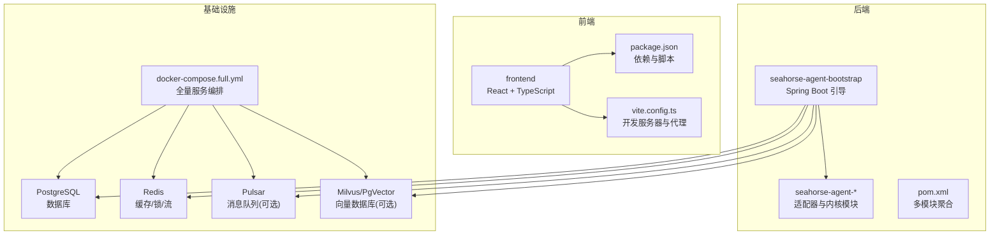
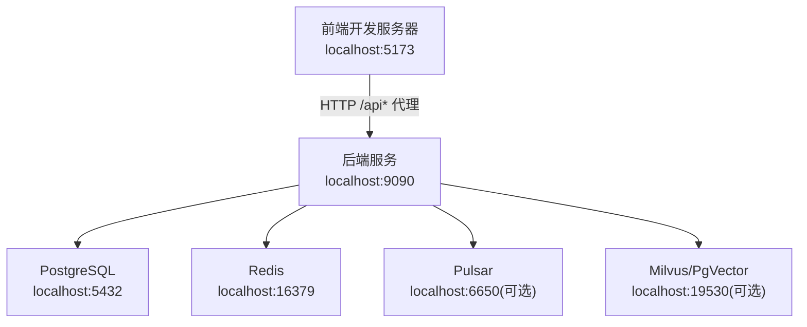
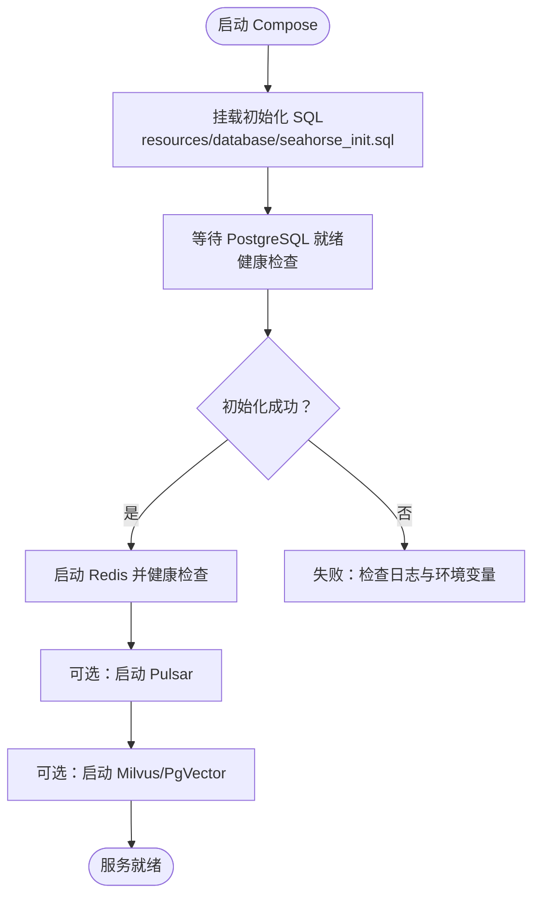
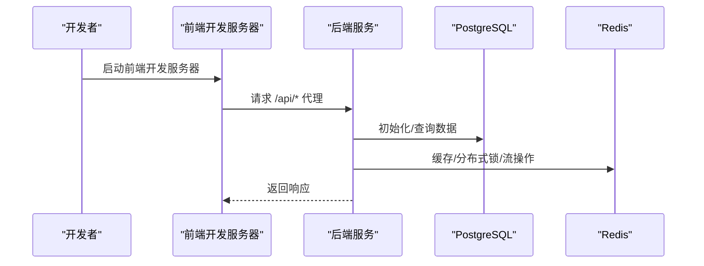
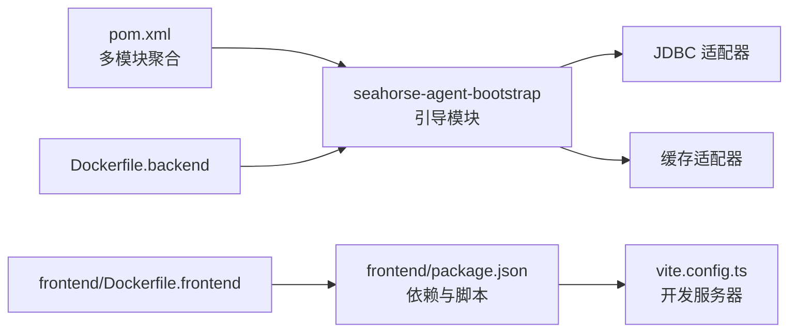

# 开发环境搭建

<cite>
**本文引用的文件**
- [docker-compose.full.yml](file://docker-compose.full.yml)
- [docker-compose.yml](file://docker-compose.yml)
- [seahorse_init.sql](file://resources/database/seahorse_init.sql)
- [pom.xml](file://pom.xml)
- [seahorse-agent-bootstrap/pom.xml](file://seahorse-agent-bootstrap/pom.xml)
- [frontend/package.json](file://frontend/package.json)
- [frontend/vite.config.ts](file://frontend/vite.config.ts)
- [frontend/Dockerfile.frontend](file://frontend/Dockerfile.frontend)
- [Dockerfile.backend](file://Dockerfile.backend)
- [docs/zh/content/前端系统/前端系统.md](file://docs/zh/content/前端系统/前端系统.md)
- [docs/zh/content/部署配置/生产环境部署.md](file://docs/zh/content/部署配置/生产环境部署.md)
- [redeploy.ps1](file://redeploy.ps1)
- [seahorse-agent-adapter-repository-jdbc/src/test/java/com/miracle/ai/seahorse/agent/adapters/repository/jdbc/JdbcDockerInitScriptMountTests.java](file://seahorse-agent-adapter-repository-jdbc/src/test/java/com/miracle/ai/seahorse/agent/adapters/repository/jdbc/JdbcDockerInitScriptMountTests.java)
</cite>

## 目录
1. [简介](#简介)
2. [项目结构](#项目结构)
3. [核心组件](#核心组件)
4. [架构总览](#架构总览)
5. [详细组件分析](#详细组件分析)
6. [依赖分析](#依赖分析)
7. [性能考虑](#性能考虑)
8. [故障排查指南](#故障排查指南)
9. [结论](#结论)
10. [附录](#附录)

## 简介
本指南面向希望在本地搭建 Seahorse Agent 开发环境的工程师，涵盖 JDK 17+、Node.js、PostgreSQL、Redis（作为缓存）、Docker 等必备软件的安装与配置；提供基于 docker-compose 的本地部署方案，包括数据库初始化、向量数据库（Milvus/PgVector 可选）、消息队列（Pulsar）等依赖服务的启动顺序与健康检查；给出环境变量配置要点（数据库连接、AI 模型、缓存等）；说明如何使用 docker-compose.full.yml 进行完整环境部署；最后提供后端 Spring Boot 与前端 React 的本地开发启动方式及常见问题排查。

## 项目结构
- 后端采用 Maven 多模块结构，主应用模块负责引导与装配。
- 前端采用 React + TypeScript + Vite，提供开发服务器与构建产物。
- 资源目录包含数据库初始化 SQL 与多套 Docker Compose 配置（基础版与全量版）。
- 文档目录包含前端系统与部署配置相关内容，便于理解架构与部署策略。

图表来源
- [docker-compose.full.yml:1-120](file://docker-compose.full.yml#L1-L120)
- [pom.xml:1-200](file://pom.xml#L1-L200)
- [frontend/package.json:1-70](file://frontend/package.json#L1-L70)
- [frontend/vite.config.ts:1-23](file://frontend/vite.config.ts#L1-L23)

章节来源
- [pom.xml:1-200](file://pom.xml#L1-L200)
- [frontend/package.json:1-70](file://frontend/package.json#L1-L70)
- [frontend/vite.config.ts:1-23](file://frontend/vite.config.ts#L1-L23)
- [docker-compose.full.yml:1-120](file://docker-compose.full.yml#L1-L120)

## 核心组件
- 数据库：PostgreSQL（pgvector 扩展），用于持久化业务数据与向量数据。
- 缓存：Redis，提供键值缓存、分布式锁、信号量与流式任务队列能力。
- 消息队列：Apache Pulsar（可选），用于异步任务与事件分发。
- 向量数据库：Milvus 或 PgVector（可选），用于向量检索。
- 后端：Spring Boot 应用，通过 Maven 多模块组织，包含适配器与内核。
- 前端：React 应用，使用 Vite 提供开发服务器与代理，支持 TypeScript 与 TailwindCSS。

章节来源
- [docker-compose.full.yml:1-120](file://docker-compose.full.yml#L1-L120)
- [seahorse-agent-bootstrap/pom.xml:32-68](file://seahorse-agent-bootstrap/pom.xml#L32-L68)
- [frontend/package.json:1-70](file://frontend/package.json#L1-L70)

## 架构总览
下图展示本地开发环境的典型交互：前端通过 /api 前缀代理到后端，后端连接 PostgreSQL 与 Redis，消息队列与向量数据库按需启用。

图表来源
- [frontend/vite.config.ts:1-23](file://frontend/vite.config.ts#L1-L23)
- [docker-compose.full.yml:1-120](file://docker-compose.full.yml#L1-L120)

## 详细组件分析

### 本地软件准备
- JDK 17+：用于编译与运行后端 Spring Boot 应用。
- Node.js：用于安装前端依赖与启动开发服务器。
- PostgreSQL：用于业务与向量数据存储。
- Redis：用于缓存、分布式协调与消息通道。
- Docker：用于一键拉起数据库、缓存、消息队列与向量数据库（可选）。

章节来源
- [pom.xml:1-200](file://pom.xml#L1-L200)
- [frontend/package.json:1-70](file://frontend/package.json#L1-L70)
- [docker-compose.full.yml:1-120](file://docker-compose.full.yml#L1-L120)

### Docker Compose 本地部署
- 基础版与全量版：仓库提供两套 Compose 配置，全量版包含更多依赖服务。
- 数据库初始化：PostgreSQL 容器挂载初始化 SQL 文件，确保表结构与种子数据就绪。
- 健康检查：数据库、Redis 等服务均配置健康检查，保障容器可用性。
- 端口映射：数据库与缓存等服务映射到宿主机端口，便于本地调试。

图表来源
- [docker-compose.full.yml:1-120](file://docker-compose.full.yml#L1-L120)
- [seahorse_init.sql](file://resources/database/seahorse_init.sql)

章节来源
- [docker-compose.full.yml:1-120](file://docker-compose.full.yml#L1-L120)
- [docker-compose.yml:1-200](file://docker-compose.yml#L1-L200)
- [seahorse_init.sql](file://resources/database/seahorse_init.sql)
- [seahorse-agent-adapter-repository-jdbc/src/test/java/com/miracle/ai/seahorse/agent/adapters/repository/jdbc/JdbcDockerInitScriptMountTests.java:28-33](file://seahorse-agent-adapter-repository-jdbc/src/test/java/com/miracle/ai/seahorse/agent/adapters/repository/jdbc/JdbcDockerInitScriptMountTests.java#L28-L33)

### 环境变量配置
- 数据库连接：通过 .env 文件或环境变量传入数据库名称、用户、密码等，Compose 中已示例化默认值。
- 缓存与分布式能力：Redis 地址与端口、连接池参数等。
- AI 模型与适配器：根据所选适配器（OpenAI 兼容、MCP 等）配置相应参数与密钥。
- 生产环境策略：文档建议按 dev/stage/prod 三套配置通过不同 ConfigMap/Secret 切换，分层配置基础、业务与依赖。

章节来源
- [docker-compose.full.yml:1-120](file://docker-compose.full.yml#L1-L120)
- [docs/zh/content/部署配置/生产环境部署.md:322-328](file://docs/zh/content/部署配置/生产环境部署.md#L322-L328)

### 使用 docker-compose.full.yml 进行完整环境部署
- 步骤：复制 .env.full.example 为 .env，然后执行 docker compose -f docker-compose.full.yml up -d --build。
- 依赖服务启动顺序：数据库 → 缓存 → 消息队列（可选）→ 向量数据库（可选）。
- 健康检查：各服务均配置健康检查，Compose 会等待健康状态再继续。
- 访问地址：前端 localhost，后端 localhost:9090（见重部署脚本输出）。

章节来源
- [docker-compose.full.yml:1-120](file://docker-compose.full.yml#L1-L120)
- [redeploy.ps1:98-123](file://redeploy.ps1#L98-L123)

### 开发服务器启动
- 后端 Spring Boot
  - 本地运行：使用 IDE 或命令行启动主应用模块（seahorse-agent-bootstrap）。
  - 依赖服务：确保数据库、缓存、消息队列（可选）已通过 Compose 启动。
- 前端 React
  - 本地运行：进入 frontend 目录，安装依赖后启动开发服务器。
  - 代理配置：Vite 配置了 /api 前缀代理到后端服务地址，确保前后端联调顺畅。
  - 构建与预览：支持打包构建与本地预览。

图表来源
- [frontend/vite.config.ts:1-23](file://frontend/vite.config.ts#L1-L23)
- [docker-compose.full.yml:1-120](file://docker-compose.full.yml#L1-L120)

章节来源
- [docs/zh/content/前端系统/前端系统.md:421-440](file://docs/zh/content/前端系统/前端系统.md#L421-L440)
- [frontend/package.json:1-70](file://frontend/package.json#L1-L70)
- [frontend/vite.config.ts:1-23](file://frontend/vite.config.ts#L1-L23)

## 依赖分析
- 后端依赖
  - PostgreSQL 驱动与 Redisson 启动器在运行时生效。
  - Maven 聚合管理多模块，包含适配器、内核与 Web 层。
- 前端依赖
  - 包管理器安装依赖，Vite 提供开发服务器与代理。
  - Dockerfile.frontend 与 Dockerfile.backend 支持容器化构建与运行。

图表来源
- [pom.xml:1-200](file://pom.xml#L1-L200)
- [seahorse-agent-bootstrap/pom.xml:32-68](file://seahorse-agent-bootstrap/pom.xml#L32-L68)
- [frontend/package.json:1-70](file://frontend/package.json#L1-L70)
- [frontend/vite.config.ts:1-23](file://frontend/vite.config.ts#L1-L23)
- [Dockerfile.backend](file://Dockerfile.backend)
- [frontend/Dockerfile.frontend](file://frontend/Dockerfile.frontend)

章节来源
- [pom.xml:1-200](file://pom.xml#L1-L200)
- [seahorse-agent-bootstrap/pom.xml:32-68](file://seahorse-agent-bootstrap/pom.xml#L32-L68)
- [frontend/package.json:1-70](file://frontend/package.json#L1-L70)
- [frontend/vite.config.ts:1-23](file://frontend/vite.config.ts#L1-L23)

## 性能考虑
- 数据库连接池与索引：合理配置连接池大小与查询索引，避免高并发下的连接争用。
- 缓存命中率：通过合理的键空间设计与过期策略提升缓存命中率。
- 向量检索：向量维度与索引参数需平衡精度与性能。
- 前端构建优化：开启压缩与按需加载，减少首屏时间。

## 故障排查指南
- 数据库无法连接
  - 检查 .env 中数据库连接参数是否正确。
  - 查看 PostgreSQL 容器健康状态与日志。
- 前端代理无效
  - 确认 Vite 代理配置指向后端服务地址。
  - 确保后端服务已启动且监听端口正确。
- 缓存异常
  - 检查 Redis 是否启动并可通过健康检查。
  - 核对连接地址与端口映射。
- 向量数据库不可用（可选）
  - 确认 Milvus/PgVector 已随 Compose 启动。
  - 检查网络连通与端口映射。
- 重部署与健康检查
  - 使用重部署脚本进行重建与状态查看。
  - 关注容器日志与健康检查结果。

章节来源
- [docker-compose.full.yml:1-120](file://docker-compose.full.yml#L1-L120)
- [frontend/vite.config.ts:1-23](file://frontend/vite.config.ts#L1-L23)
- [redeploy.ps1:98-123](file://redeploy.ps1#L98-L123)

## 结论
通过本指南，您可以在本地快速搭建 Seahorse Agent 的开发环境，完成数据库初始化、缓存与消息队列的本地部署，并分别启动后端 Spring Boot 与前端 React 开发服务器。建议在开发过程中结合 Compose 的健康检查与日志输出，及时定位问题；在生产部署时遵循文档建议的环境切换与配置分层策略。

## 附录
- 常用命令
  - 启动全量服务：docker compose -f docker-compose.full.yml up -d --build
  - 重部署：使用重部署脚本进行重建与状态查看
  - 前端开发：进入 frontend 目录，安装依赖后启动开发服务器
- 参考文档
  - 前端系统与开发指南
  - 部署配置与环境切换策略