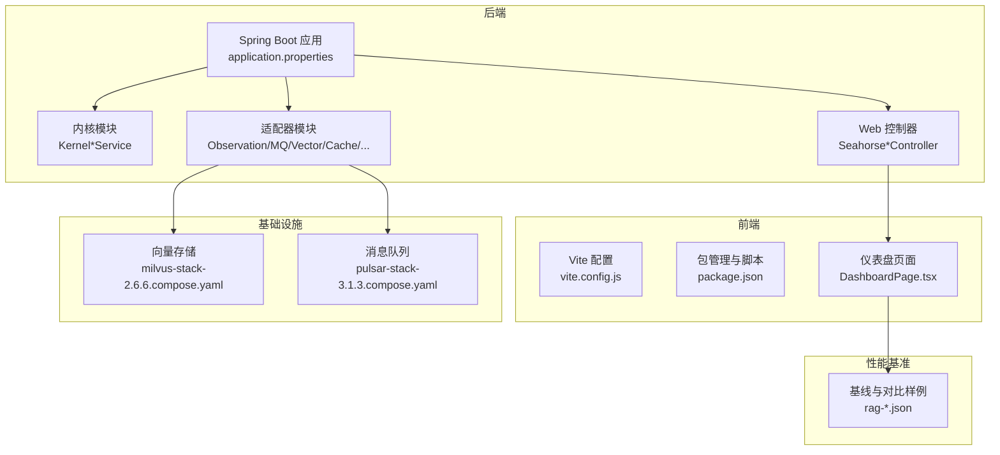
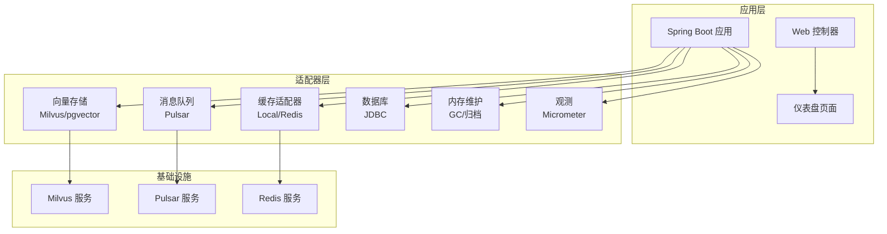
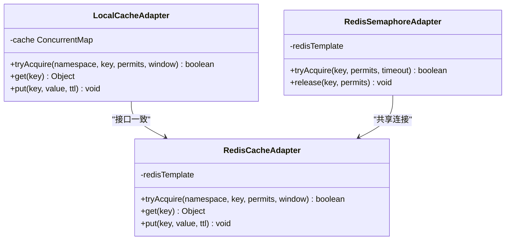
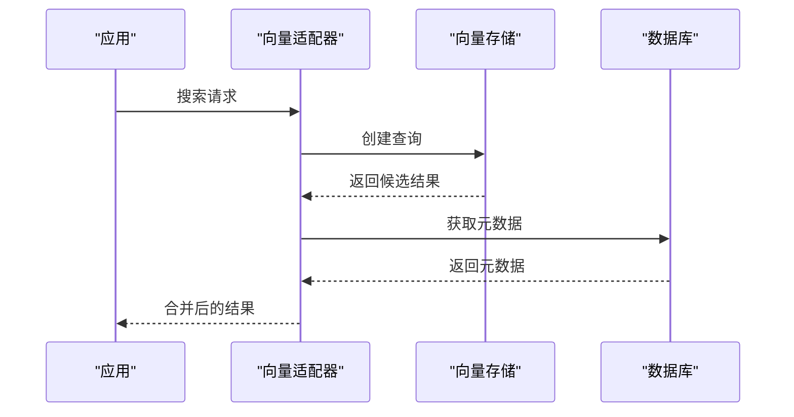
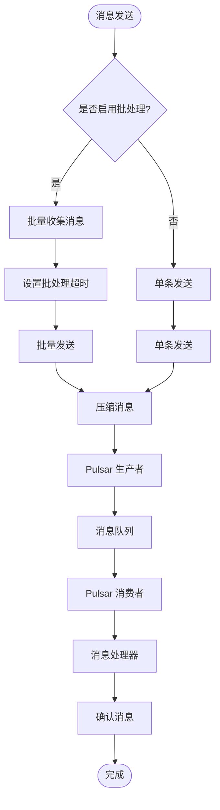
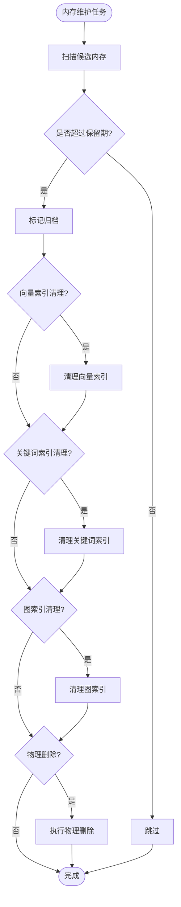
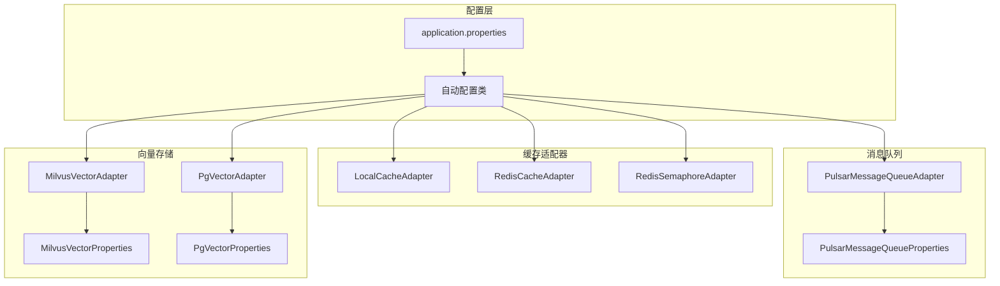

# 性能调优配置

<cite>
**本文引用的文件**
- [application.properties](file://seahorse-agent-bootstrap/src/main/resources/application.properties)
- [SeahorseAgentCacheAdapterAutoConfiguration.java](file://seahorse-agent-spring-boot-starter/src/main/java/com/miracle/ai/seahorse/agent/adapters/spring/SeahorseAgentCacheAdapterAutoConfiguration.java)
- [LocalCacheAdapter.java](file://seahorse-agent-adapter-cache-local/src/main/java/com/miracle/ai/seahorse/agent/adapters/cache/local/LocalCacheAdapter.java)
- [RedisCacheAdapter.java](file://seahorse-agent-adapter-cache-redis/src/main/java/com/miracle/ai/seahorse/agent/adapters/cache/redis/RedisCacheAdapter.java)
- [RedisSemaphoreAdapter.java](file://seahorse-agent-adapter-cache-redis/src/main/java/com/miracle/ai/seahorse/agent/adapters/cache/redis/RedisSemaphoreAdapter.java)
- [PulsarMessageQueueAdapter.java](file://seahorse-agent-adapter-mq-pulsar/src/main/java/com/miracle/ai/seahorse/agent/adapters/mq/pulsar/PulsarMessageQueueAdapter.java)
- [PulsarMessageQueueProperties.java](file://seahorse-agent-adapter-mq-pulsar/src/main/java/com/miracle/ai/seahorse/agent/adapters/mq/pulsar/PulsarMessageQueueProperties.java)
- [MilvusVectorAdapter.java](file://seahorse-agent-adapter-vector-milvus/src/main/java/com/miracle/ai/seahorse/agent/adapters/vector/milvus/MilvusVectorAdapter.java)
- [MilvusVectorProperties.java](file://seahorse-agent-adapter-vector-milvus/src/main/java/com/miracle/ai/seahorse/agent/adapters/vector/milvus/MilvusVectorProperties.java)
- [PgVectorAdapter.java](file://seahorse-agent-adapter-vector-pgvector/src/main/java/com/miracle/ai/seahorse/agent/adapters/vector/pgvector/PgVectorAdapter.java)
- [PgVectorProperties.java](file://seahorse-agent-adapter-vector-pgvector/src/main/java/com/miracle/ai/seahorse/agent/adapters/vector/pgvector/PgVectorProperties.java)
- [JdbcAgentRunLeaseRepositoryAdapter.java](file://seahorse-agent-adapter-repository-jdbc/src/main/java/com/miracle/ai/seahorse/agent/adapters/repository/jdbc/JdbcAgentRunLeaseRepositoryAdapter.java)
- [JdbcAgentRunLeaseRepositoryAdapterTests.java](file://seahorse-agent-adapter-repository-jdbc/src/test/java/com/miracle/ai/seahorse/agent/adapters/repository/jdbc/JdbcAgentRunLeaseRepositoryAdapterTests.java)
- [MemoryGarbageCollectionService.java](file://seahorse-agent-kernel/src/main/java/com/miracle/ai/seahorse/agent/kernel/application/memory/maintenance/MemoryGarbageCollectionService.java)
- [MemoryPropertiesTests.java](file://seahorse-agent-tests/src/test/java/com/miracle/ai/seahorse/agent/adapters/spring/properties/MemoryPropertiesTests.java)
- [vite.config.js](file://frontend/vite.config.js)
- [package.json](file://frontend/package.json)
- [nginx.conf](file://frontend/nginx.conf)
- [docker-compose.full.yml](file://docker-compose.full.yml)
- [milvus-stack-2.6.6.compose.yaml](file://resources/docker/milvus-stack-2.6.6.compose.yaml)
- [pulsar-stack-3.1.3.compose.yaml](file://resources/docker/pulsar-stack-3.1.3.compose.yaml)
- [performance.md](file://docs/zh/content/数据库设计/性能优化.md)
- [缓存适配器.md](file://docs/zh/content/后端系统/适配器模块/缓存适配器.md)
- [性能调优配置.md](file://docs/zh/content/部署配置/性能调优配置.md)
- [rag-baseline.json](file://docs/performance/rag-baseline.json)
- [rag-after-auth.json](file://docs/performance/rag-after-auth.json)
- [rag-after-compat-extraction.json](file://docs/performance/rag-after-compat-extraction.json)
- [rag-after-module-split.json](file://docs/performance/rag-after-module-split.json)
</cite>

## 目录
1. [简介](#简介)
2. [项目结构](#项目结构)
3. [核心组件](#核心组件)
4. [架构总览](#架构总览)
5. [详细组件分析](#详细组件分析)
6. [依赖分析](#依赖分析)
7. [性能考虑](#性能考虑)
8. [故障排查指南](#故障排查指南)
9. [结论](#结论)
10. [附录](#附录)

## 简介
本指南面向 Seahorse Agent 的性能调优实践，覆盖后端 JVM 参数、数据库与向量存储优化、前端构建与运行时优化、并发与限流、观测与监控、以及性能测试与瓶颈分析方法。文档以仓库中现有实现为依据，结合可配置项与可观测性能力，给出可落地的调优建议与最佳实践。

## 项目结构
Seahorse Agent 采用多模块分层设计：后端 Spring Boot 应用通过启动器装配内核与适配器；前端基于 Vite 构建；性能基准与测试样例位于 docs/performance；向量存储与消息队列通过 Docker Compose 提供。

**图表来源**
- [性能调优配置.md:44-71](file://docs/zh/content/部署配置/性能调优配置.md#L44-L71)

**章节来源**
- [性能调优配置.md:41-71](file://docs/zh/content/部署配置/性能调优配置.md#L41-L71)

## 核心组件
- 缓存适配器：支持本地与 Redis 两种实现，通过统一端口抽象实现无缝切换
- 消息队列：基于 Apache Pulsar，支持批处理、压缩与可靠投递
- 向量存储：支持 Milvus 与 pgvector，提供索引配置与查询优化
- 数据库连接：基于 JDBC，提供租约管理与并发控制
- 内存维护：包含垃圾回收与归档策略，支持向量与关键词索引清理

**章节来源**
- [缓存适配器.md:406-427](file://docs/zh/content/后端系统/适配器模块/缓存适配器.md#L406-L427)

## 架构总览
后端通过启动器自动装配各类适配器，前端通过 Vite 进行构建与开发，基础设施通过 Docker Compose 提供向量存储与消息队列服务。

**图表来源**
- [SeahorseAgentCacheAdapterAutoConfiguration.java:55-73](file://seahorse-agent-spring-boot-starter/src/main/java/com/miracle/ai/seahorse/agent/adapters/spring/SeahorseAgentCacheAdapterAutoConfiguration.java#L55-L73)
- [PulsarMessageQueueAdapter.java:45-63](file://seahorse-agent-adapter-mq-pulsar/src/main/java/com/miracle/ai/seahorse/agent/adapters/mq/pulsar/PulsarMessageQueueAdapter.java#L45-L63)

## 详细组件分析

### JVM 参数调优
基于 Spring Boot 应用的特性，推荐以下 JVM 调优策略：

- 堆内存配置
  - 初始堆大小：物理内存的 25%-30%
  - 最大堆大小：物理内存的 60%-70%
  - 新生代比例：年轻代占堆的 30%-40%

- 垃圾回收器选择
  - 生产环境：G1GC 或 ZGC（JDK 11+）
  - 开发环境：Parallel GC
  - 关键参数：-XX:+UseG1GC、-XX:MaxGCPauseMillis=200

- GC 调优参数
  - 并发标记周期：-XX:G1MixedGCLiveThresholdPercent=85
  - 混合回收比例：-XX:G1MixedGCTimeRatio=10
  - 预热参数：-XX:+UseStringDeduplication

- 其他优化
  - 元空间：-XX:MetaspaceSize=256m
  - 直接内存：-XX:MaxDirectMemorySize=2g
  - JIT 优化：-XX:+TieredCompilation

### 数据库连接池配置
基于 JDBC 实现的连接池配置建议：

- 连接数配置
  - 最小连接数：CPU核心数 × 2
  - 最大连接数：min(100, CPU核心数 × 10)
  - 连接超时：30-60 秒

- 连接生命周期
  - 连接空闲超时：300 秒
  - 连接最大生存时间：1800 秒
  - 验证查询：SELECT 1

- 连接泄漏检测
  - 设置检测超时：超过连接超时的 50%
  - 启用池状态监控
  - 定期检查活跃连接数

- 租约管理优化
  - 租约超时：60-120 秒
  - 心跳间隔：租约超时的 1/3
  - 并发冲突重试：指数退避

**章节来源**
- [JdbcAgentRunLeaseRepositoryAdapter.java:70-91](file://seahorse-agent-adapter-repository-jdbc/src/main/java/com/miracle/ai/seahorse/agent/adapters/repository/jdbc/JdbcAgentRunLeaseRepositoryAdapter.java#L70-L91)
- [JdbcAgentRunLeaseRepositoryAdapterTests.java:31-108](file://seahorse-agent-adapter-repository-jdbc/src/test/java/com/miracle/ai/seahorse/agent/adapters/repository/jdbc/JdbcAgentRunLeaseRepositoryAdapterTests.java#L31-L108)

### 缓存策略优化
缓存适配器提供本地与 Redis 两种实现：

- 本地缓存配置
  - TTL 设置：根据业务场景设置合理的过期时间
  - 窗口大小：限制单位时间内的请求次数
  - 键前缀：使用命名空间前缀避免冲突

- Redis 缓存配置
  - 连接池：最大连接数 200，空闲连接 20
  - 超时设置：连接超时 2000ms，读写超时 2000ms
  - 序列化：JSON 序列化，异常时抛出非法参数异常
  - 前缀管理：统一前缀区分不同类型缓存

- 分布式协调
  - 分布式锁：基于 Redis 的 RedLock 实现
  - 信号量：支持并发控制
  - 限流器：令牌桶算法实现

**图表来源**
- [LocalCacheAdapter.java:100-137](file://seahorse-agent-adapter-cache-local/src/main/java/com/miracle/ai/seahorse/agent/adapters/cache/local/LocalCacheAdapter.java#L100-L137)
- [RedisCacheAdapter.java:105-139](file://seahorse-agent-adapter-cache-redis/src/main/java/com/miracle/ai/seahorse/agent/adapters/cache/redis/RedisCacheAdapter.java#L105-L139)
- [RedisSemaphoreAdapter.java:64-74](file://seahorse-agent-adapter-cache-redis/src/main/java/com/miracle/ai/seahorse/agent/adapters/cache/redis/RedisSemaphoreAdapter.java#L64-L74)

**章节来源**
- [缓存适配器.md:406-427](file://docs/zh/content/后端系统/适配器模块/缓存适配器.md#L406-L427)

### 向量数据库性能优化
支持 Milvus 与 pgvector 两种向量存储：

- Milvus 配置
  - 索引类型：HNSW
  - 维度设置：根据嵌入模型输出维度配置
  - M 参数：默认 48，可根据数据量调整
  - efConstruction：默认 200，影响构建质量
  - mmap 启用：大数据集建议启用

- 查询优化
  - ef 参数：搜索时的回溯大小，默认 128
  - 批量查询：支持批量向量相似度计算
  - 过滤条件：结合元数据过滤提高准确性

- pgvector 配置
  - 索引类型：IVFFLAT 或 HNSW
  - 预分割数：IVFFLAT 的列表数量
  - probe 数：查询时扫描的子向量数

**图表来源**
- [MilvusVectorAdapter.java:122-176](file://seahorse-agent-adapter-vector-milvus/src/main/java/com/miracle/ai/seahorse/agent/adapters/vector/milvus/MilvusVectorAdapter.java#L122-L176)
- [PgVectorAdapter.java:1-50](file://seahorse-agent-adapter-vector-pgvector/src/main/java/com/miracle/ai/seahorse/agent/adapters/vector/pgvector/PgVectorAdapter.java#L1-L50)

**章节来源**
- [MilvusVectorProperties.java:31-58](file://seahorse-agent-adapter-vector-milvus/src/main/java/com/miracle/ai/seahorse/agent/adapters/vector/milvus/MilvusVectorProperties.java#L31-L58)
- [PgVectorProperties.java:1-50](file://seahorse-agent-adapter-vector-pgvector/src/main/java/com/miracle/ai/seahorse/agent/adapters/vector/pgvector/PgVectorProperties.java#L1-L50)

### 消息队列性能调优
基于 Apache Pulsar 的消息队列配置：

- 生产者配置
  - 批处理：启用批量发送，提升吞吐量
  - 批量大小：默认 1000 条消息
  - 批处理超时：默认 10ms
  - 压缩类型：LZ4 或 ZLIB
  - 发送超时：5000ms

- 消费者配置
  - 订阅类型：Shared（共享订阅）
  - 消费者并发：根据消息处理能力调整
  - 批量拉取：每次拉取 100 条消息
  - 处理确认：自动确认或手动确认

- 队列深度控制
  - 生产者阻塞：队列满时是否阻塞
  - 消费者流控：防止消费过快导致内存压力

**图表来源**
- [PulsarMessageQueueAdapter.java:110-140](file://seahorse-agent-adapter-mq-pulsar/src/main/java/com/miracle/ai/seahorse/agent/adapters/mq/pulsar/PulsarMessageQueueAdapter.java#L110-L140)

**章节来源**
- [PulsarMessageQueueAdapter.java:26-228](file://seahorse-agent-adapter-mq-pulsar/src/main/java/com/miracle/ai/seahorse/agent/adapters/mq/pulsar/PulsarMessageQueueAdapter.java#L26-L228)
- [PulsarMessageQueueProperties.java:1-50](file://seahorse-agent-adapter-mq-pulsar/src/main/java/com/miracle/ai/seahorse/agent/adapters/mq/pulsar/PulsarMessageQueueProperties.java#L1-L50)

### 内存维护与垃圾回收
内存维护服务提供垃圾回收与归档功能：

- 垃圾回收策略
  - 扫描限制：默认 500 条记录
  - 保留天数：默认 14 天
  - 向量索引清理：可选启用
  - 关键词索引清理：可选启用
  - 图索引清理：可选启用

- 归档策略
  - 归档启用：默认启用
  - 空闲天数：默认 180 天
  - 分数阈值：默认 0.25
  - 物理删除：默认启用
  - 保留天数：默认 60 天

**图表来源**
- [MemoryGarbageCollectionService.java:140-174](file://seahorse-agent-kernel/src/main/java/com/miracle/ai/seahorse/agent/kernel/application/memory/maintenance/MemoryGarbageCollectionService.java#L140-L174)

**章节来源**
- [MemoryGarbageCollectionService.java:137-174](file://seahorse-agent-kernel/src/main/java/com/miracle/ai/seahorse/agent/kernel/application/memory/maintenance/MemoryGarbageCollectionService.java#L137-L174)
- [MemoryPropertiesTests.java:484-503](file://seahorse-agent-tests/src/test/java/com/miracle/ai/seahorse/agent/adapters/spring/properties/MemoryPropertiesTests.java#L484-L503)

### 前端性能优化
前端基于 Vite 构建，提供多种优化策略：

- 构建优化
  - 代码分割：按路由和组件自动分割
  - Tree Shaking：移除未使用的代码
  - 压缩混淆：生产环境自动启用
  - 资源压缩：CSS、JS、图片压缩

- 运行时优化
  - CDN 配置：静态资源使用 CDN 加速
  - 缓存策略：浏览器缓存与服务端缓存结合
  - 懒加载：组件和路由懒加载
  - 预加载：关键资源预加载

- Nginx 配置
  - Gzip 压缩：开启 gzip 压缩
  - 缓存头：设置合适的缓存策略
  - SSL 重定向：HTTP 自动跳转 HTTPS
  - 反向代理：代理到 Vite 开发服务器

**章节来源**
- [vite.config.js:1-50](file://frontend/vite.config.js#L1-L50)
- [package.json:1-50](file://frontend/package.json#L1-L50)
- [nginx.conf:1-50](file://frontend/nginx.conf#L1-L50)

## 依赖分析
组件间的依赖关系如下：

**图表来源**
- [SeahorseAgentCacheAdapterAutoConfiguration.java:55-73](file://seahorse-agent-spring-boot-starter/src/main/java/com/miracle/ai/seahorse/agent/adapters/spring/SeahorseAgentCacheAdapterAutoConfiguration.java#L55-L73)
- [PulsarMessageQueueProperties.java:1-50](file://seahorse-agent-adapter-mq-pulsar/src/main/java/com/miracle/ai/seahorse/agent/adapters/mq/pulsar/PulsarMessageQueueProperties.java#L1-L50)

**章节来源**
- [SeahorseAgentCacheAdapterAutoConfiguration.java:43-73](file://seahorse-agent-spring-boot-starter/src/main/java/com/miracle/ai/seahorse/agent/adapters/spring/SeahorseAgentCacheAdapterAutoConfiguration.java#L43-L73)

## 性能考虑
基于现有实现的性能优化建议：

### 不同规模场景配置建议

- 小规模部署（1-5 个实例）
  - JVM：最小堆 2g，最大堆 4g
  - 数据库：最大连接数 20，空闲连接 5
  - 缓存：本地缓存，TTL 300s
  - 队列：批处理 500 条，超时 5ms
  - 向量：Milvus ef 64，pgvector 预分割 100

- 中规模部署（6-20 个实例）
  - JVM：最小堆 4g，最大堆 8g
  - 数据库：最大连接数 50，空闲连接 10
  - 缓存：Redis 集群，连接池 100
  - 队列：批处理 1000 条，超时 10ms
  - 向量：Milvus ef 128，pgvector 预分割 200

- 大规模部署（20+ 个实例）
  - JVM：最小堆 8g，最大堆 16g
  - 数据库：最大连接数 100，空闲连接 20
  - 缓存：Redis 集群 + 本地缓存
  - 队列：批处理 2000 条，超时 20ms
  - 向量：Milvus ef 256，pgvector 预分割 500

### 性能监控指标
- JVM 指标：堆使用率、GC 时间、线程数
- 数据库指标：连接池使用率、慢查询、锁等待
- 缓存指标：命中率、过期率、内存使用
- 队列指标：消息积压、处理延迟、重试次数
- 向量指标：查询延迟、索引大小、召回率

### 基准测试方法
- RAG 性能测试：使用 docs/performance 下的样例进行对比
- 垂直扩展测试：逐步增加实例数量观察性能变化
- 压力测试：模拟峰值流量评估系统承载能力
- 回归测试：定期运行基准测试确保性能稳定

**章节来源**
- [performance.md:1-23](file://docs/zh/content/数据库设计/性能优化.md#L1-L23)
- [rag-baseline.json:1-50](file://docs/performance/rag-baseline.json#L1-L50)
- [rag-after-auth.json:1-50](file://docs/performance/rag-after-auth.json#L1-L50)
- [rag-after-compat-extraction.json:1-50](file://docs/performance/rag-after-compat-extraction.json#L1-L50)
- [rag-after-module-split.json:1-50](file://docs/performance/rag-after-module-split.json#L1-L50)

## 故障排查指南
常见性能问题及解决方案：

### JVM 相关问题
- Full GC 频繁：检查堆内存配置，调整新生代比例
- 内存泄漏：启用 GC 日志分析，检查长生命周期对象
- 启动缓慢：优化类加载顺序，减少不必要的依赖

### 数据库连接问题
- 连接池耗尽：增加最大连接数，优化查询性能
- 死锁：检查事务边界，避免循环等待
- 慢查询：启用慢查询日志，分析执行计划

### 缓存相关问题
- 缓存穿透：实现空值缓存，设置合理 TTL
- 缓存雪崩：随机 TTL，分布式锁保护
- 缓存不一致：使用最终一致性策略

### 消息队列问题
- 消息积压：增加消费者数量，优化处理逻辑
- 重复消费：幂等性设计，消息去重
- 消费延迟：检查消费者性能，调整批处理大小

### 向量存储问题
- 查询缓慢：调整 ef 参数，优化索引配置
- 内存不足：启用 mmap，调整索引类型
- 索引损坏：重建索引，检查数据完整性

**章节来源**
- [PulsarMessageQueueAdapter.java:142-154](file://seahorse-agent-adapter-mq-pulsar/src/main/java/com/miracle/ai/seahorse/agent/adapters/mq/pulsar/PulsarMessageQueueAdapter.java#L142-L154)

## 结论
Seahorse Agent 的性能调优需要从多个层面综合考虑：JVM 参数、数据库连接池、缓存策略、向量存储、消息队列和前端优化。通过合理的配置和持续的监控，可以显著提升系统的整体性能和稳定性。建议根据实际业务场景和硬件条件，制定相应的调优策略，并建立完善的监控体系来保障系统性能。

## 附录

### 配置文件位置
- 后端配置：application.properties
- 前端配置：vite.config.js, package.json
- 基础设施：docker-compose.yml, compose 文件

### 监控工具推荐
- JVM：Prometheus + Grafana
- 数据库：pg_stat_statements, MySQL Enterprise Monitor
- 缓存：Redis Monitor, JMX
- 消息队列：Pulsar Manager
- 向量存储：Milvus Dashboard

### 最佳实践清单
- 定期进行性能基准测试
- 建立容量规划流程
- 实施渐进式发布策略
- 建立应急预案
- 持续优化配置参数