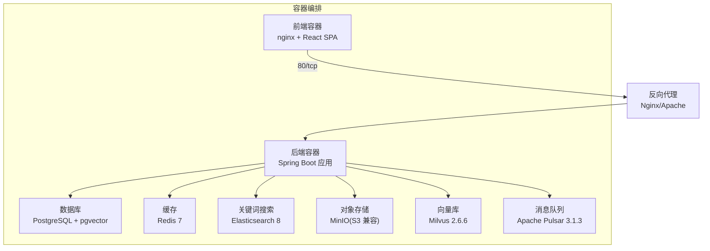
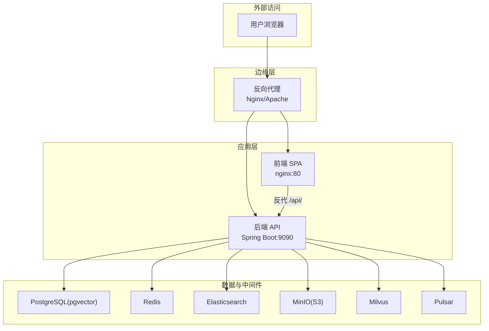
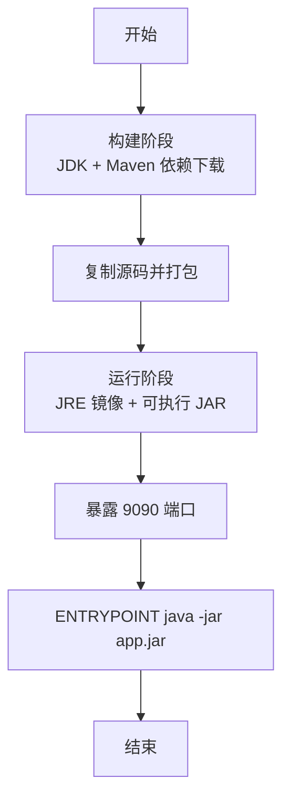
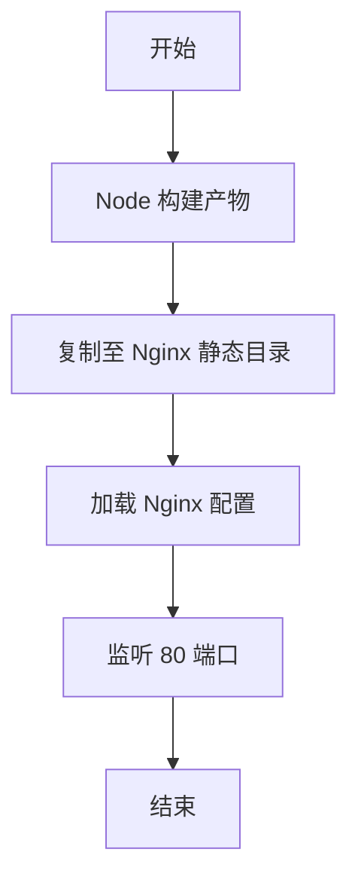
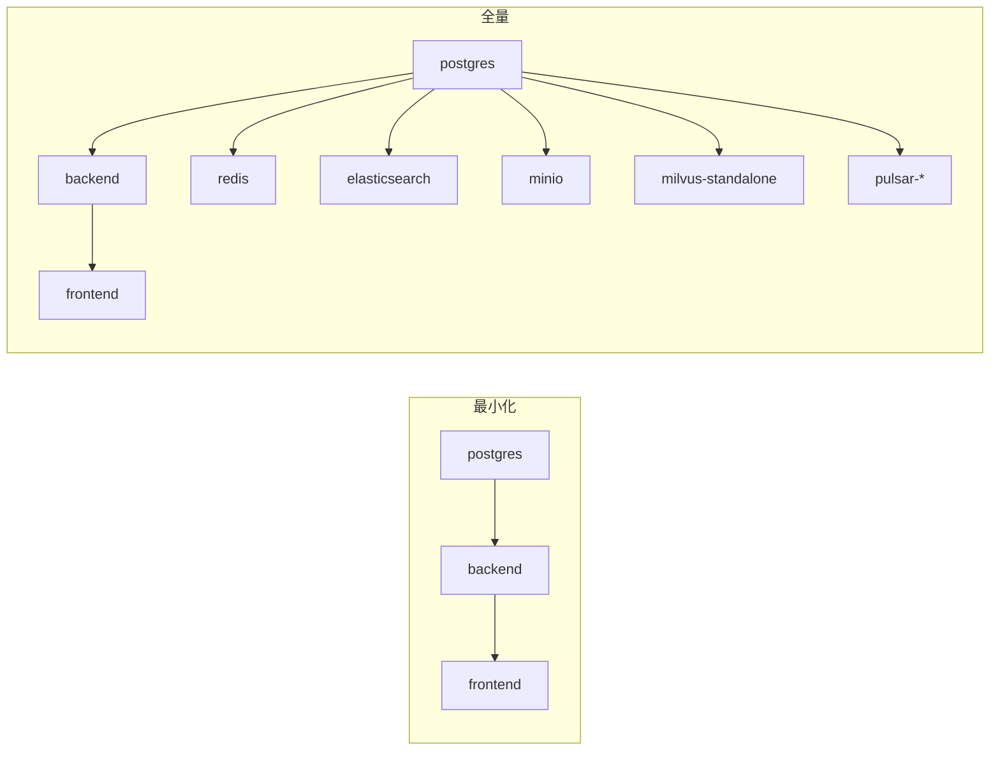
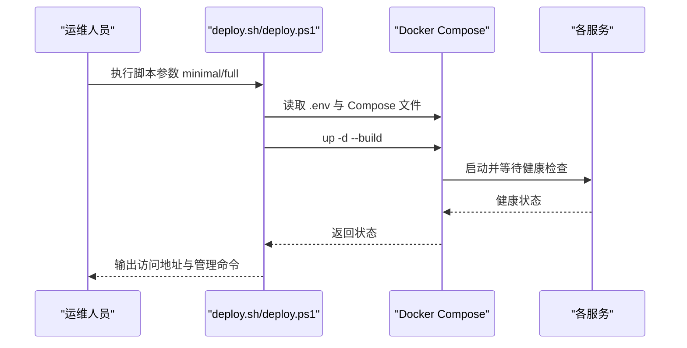
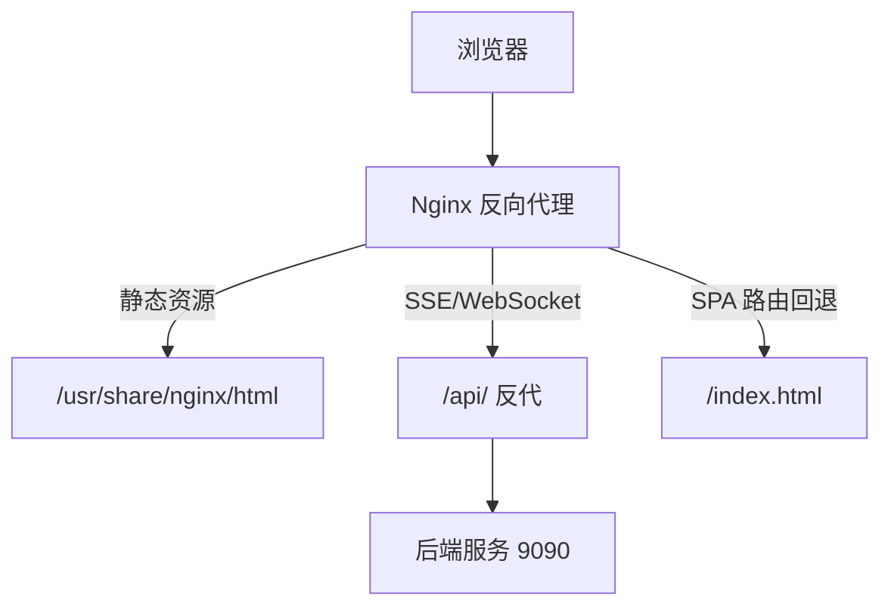
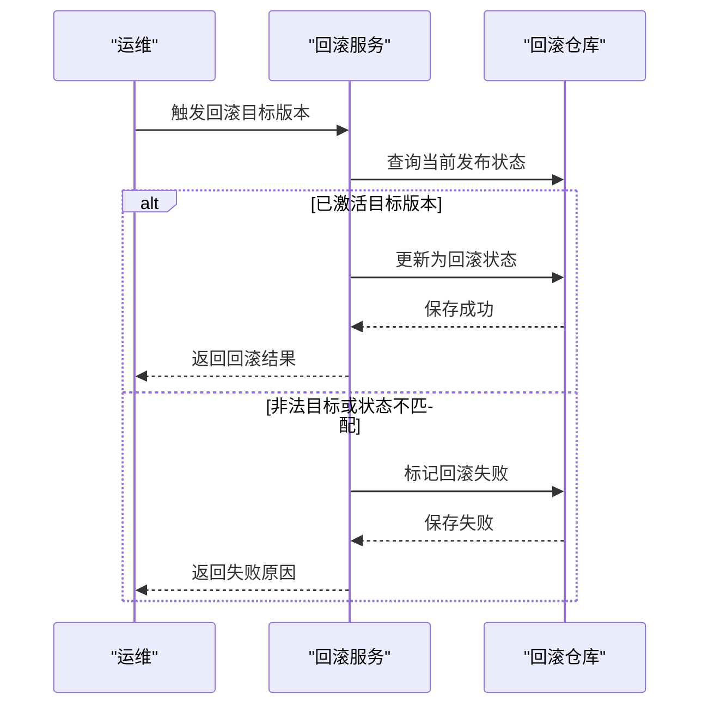
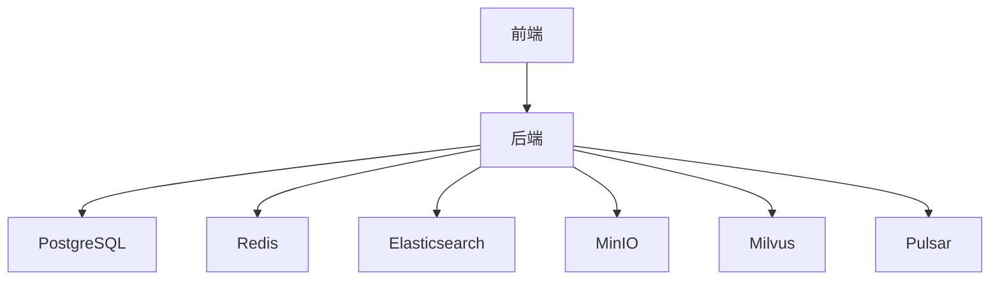

# 生产环境部署

<cite>
**本文引用的文件**
- [DEPLOY.md](file://DEPLOY.md)
- [Dockerfile.backend](file://Dockerfile.backend)
- [frontend/Dockerfile.frontend](file://frontend/Dockerfile.frontend)
- [docker-compose.yml](file://docker-compose.yml)
- [docker-compose.full.yml](file://docker-compose.full.yml)
- [deploy.sh](file://deploy.sh)
- [deploy.ps1](file://deploy.ps1)
- [frontend/nginx.conf](file://frontend/nginx.conf)
- [docs/zh/content/部署配置/生产环境部署.md](file://docs/zh/content/部署配置/生产环境部署.md)
- [redeploy.ps1](file://redeploy.ps1)
- [seahorse-agent-kernel/src/main/java/com/miracle/ai/seahorse/agent/kernel/application/agent/rollout/KernelAgentRolloutService.java](file://seahorse-agent-kernel/src/main/java/com/miracle/ai/seahorse/agent/kernel/application/agent/rollout/KernelAgentRolloutService.java)
- [seahorse-agent-kernel/src/main/java/com/miracle/ai/seahorse/agent/kernel/domain/agent/factory/AgentRollbackResult.java](file://seahorse-agent-kernel/src/main/java/com/miracle/ai/seahorse/agent/kernel/domain/agent/factory/AgentRollbackResult.java)
</cite>

## 目录
1. [简介](#简介)
2. [项目结构](#项目结构)
3. [核心组件](#核心组件)
4. [架构总览](#架构总览)
5. [详细组件分析](#详细组件分析)
6. [依赖分析](#依赖分析)
7. [性能考量](#性能考量)
8. [故障排查指南](#故障排查指南)
9. [结论](#结论)
10. [附录](#附录)

## 简介
本指南面向生产环境部署 Seahorse Agent，提供完整的容器化方案与运维实践，包括：
- 后端与前端镜像构建流程
- Docker Compose 编排与服务配置
- 生产环境关键环境变量与安全配置
- 部署脚本使用方法（deploy.sh、deploy.ps1）
- 负载均衡与反向代理（Nginx/Apache）配置思路
- SSL 证书与 HTTPS 设置建议
- 生产环境监控（健康检查、日志聚合、性能监控）
- 部署验证与回滚策略

## 项目结构
Seahorse Agent 采用前后端分离与多模块后端架构，配合 Docker 与 Compose 实现快速部署与扩展。

图表来源
- [docker-compose.full.yml:1-402](file://docker-compose.full.yml#L1-L402)
- [frontend/nginx.conf:1-32](file://frontend/nginx.conf#L1-L32)

章节来源
- [DEPLOY.md:1-207](file://DEPLOY.md#L1-L207)
- [docker-compose.yml:1-99](file://docker-compose.yml#L1-L99)
- [docker-compose.full.yml:1-402](file://docker-compose.full.yml#L1-L402)

## 核心组件
- 后端镜像构建
  - 多阶段构建：构建阶段使用 JDK 下载依赖并打包，运行阶段使用更轻量的 JRE 运行。
  - 支持代理参数注入，便于内网环境构建。
- 前端镜像构建
  - Node 构建产物 + Nginx 静态服务，支持 API 基础路径与产品模式参数注入。
- Compose 编排
  - 最小化部署：PostgreSQL + pgvector，适合开发/测试。
  - 全量部署：增加 Redis、Elasticsearch、MinIO、Milvus、Pulsar，适合生产。
- 部署脚本
  - deploy.sh：Linux/macOS 一键部署，支持 minimal/full 模式。
  - deploy.ps1：Windows 一键部署，同上。
- 反向代理
  - Nginx 提供静态资源服务与 /api 反代，支持 SSE 与 WebSocket。

章节来源
- [Dockerfile.backend:1-63](file://Dockerfile.backend#L1-L63)
- [frontend/Dockerfile.frontend:1-30](file://frontend/Dockerfile.frontend#L1-L30)
- [docker-compose.yml:1-99](file://docker-compose.yml#L1-L99)
- [docker-compose.full.yml:1-402](file://docker-compose.full.yml#L1-L402)
- [deploy.sh:1-145](file://deploy.sh#L1-L145)
- [deploy.ps1:1-153](file://deploy.ps1#L1-L153)
- [frontend/nginx.conf:1-32](file://frontend/nginx.conf#L1-L32)

## 架构总览
下图展示生产环境典型拓扑：前端通过反向代理统一入口，后端作为无状态服务，依赖共享的数据库、缓存、搜索、对象存储、向量库与消息队列。

图表来源
- [frontend/nginx.conf:1-32](file://frontend/nginx.conf#L1-L32)
- [docker-compose.full.yml:269-373](file://docker-compose.full.yml#L269-L373)

## 详细组件分析

### 后端镜像构建（Dockerfile.backend）
- 多阶段构建
  - 构建阶段：复制 Maven 工程与依赖，离线下载依赖，再构建可执行 JAR。
  - 运行阶段：基于 JRE 镜像，仅拷贝最终 JAR，暴露 9090 端口。
- 代理支持
  - 支持通过构建参数注入 HTTP/HTTPS/NO_PROXY，便于内网环境拉取依赖。
- 入口命令
  - 使用 java -jar 启动应用。

图表来源
- [Dockerfile.backend:1-63](file://Dockerfile.backend#L1-L63)

章节来源
- [Dockerfile.backend:1-63](file://Dockerfile.backend#L1-L63)

### 前端镜像构建（frontend/Dockerfile.frontend）
- 构建阶段
  - Node 安装依赖并构建产物。
- 运行阶段
  - 使用 Nginx 提供静态服务，挂载构建产物与 Nginx 配置。
- 参数注入
  - 支持通过构建参数注入 API 基础路径、产品模式与高级功能开关。

图表来源
- [frontend/Dockerfile.frontend:1-30](file://frontend/Dockerfile.frontend#L1-L30)

章节来源
- [frontend/Dockerfile.frontend:1-30](file://frontend/Dockerfile.frontend#L1-L30)

### Compose 编排（最小化与全量）
- 最小化部署（docker-compose.yml）
  - 服务：postgres、backend、frontend。
  - 适配器：向量库使用 noop、缓存 local、存储 local、MQ direct、观测 noop。
  - 端口：80（前端）、9090（后端）、5432（数据库）。
- 全量部署（docker-compose.full.yml）
  - 服务：postgres、redis、elasticsearch、minio、milvus-standalone、attu、pulsar-*、backend、frontend。
  - 适配器：向量库 Milvus、缓存 Redis、存储 S3、MQ Pulsar、观测 Micrometer、搜索 Elasticsearch。
  - 端口：16379（Redis）、9200（ES）、9000/9001（MinIO）、19530/9091（Milvus）、6650/8080（Pulsar）。

图表来源
- [docker-compose.yml:1-99](file://docker-compose.yml#L1-L99)
- [docker-compose.full.yml:1-402](file://docker-compose.full.yml#L1-L402)

章节来源
- [docker-compose.yml:1-99](file://docker-compose.yml#L1-L99)
- [docker-compose.full.yml:1-402](file://docker-compose.full.yml#L1-L402)

### 部署脚本（deploy.sh / deploy.ps1）
- 功能概览
  - 校验 Docker 与 Compose 版本。
  - 自动复制示例环境文件（.env 或 .env.full.example）。
  - 支持 minimal/full 两种模式，按需构建与启动。
  - 全量模式等待关键服务健康检查（postgres、redis、elasticsearch、milvus、pulsar、backend）。
- 输出提示
  - 提供访问地址、默认账号与常用管理命令（查看状态、日志、停止、清理数据）。

图表来源
- [deploy.sh:1-145](file://deploy.sh#L1-L145)
- [deploy.ps1:1-153](file://deploy.ps1#L1-L153)

章节来源
- [deploy.sh:1-145](file://deploy.sh#L1-L145)
- [deploy.ps1:1-153](file://deploy.ps1#L1-L153)

### 反向代理与前端（Nginx）
- Nginx 配置要点
  - 监听 80 端口，根目录指向前端构建产物。
  - /api 路径反代至后端服务（9090），保留 Host、X-Real-IP、X-Forwarded-* 头。
  - 支持 SSE（关闭缓冲、设置超时）与 WebSocket（升级头）。
  - SPA 回退到 index.html，保证路由正常。
- Apache 替代
  - 使用 ProxyPass /api/ http://backend:9090/ 并开启 ProxyPreserveHost。
  - 启用 proxy_http 和 proxy_wstunnel 模块以支持 WebSocket。

图表来源
- [frontend/nginx.conf:1-32](file://frontend/nginx.conf#L1-L32)

章节来源
- [frontend/nginx.conf:1-32](file://frontend/nginx.conf#L1-L32)

### 环境变量与安全配置（生产建议）
- 数据库连接池
  - 在 .env 中配置数据库连接串、用户名、密码；后端通过 JDBC 连接。
- 缓存配置
  - 全量部署使用 Redis，配置主机、端口与认证（如需）。
- AI 模型密钥管理
  - 在 .env 中配置 AI 基础地址、API Key、聊天模型、嵌入模型等。
- 对象存储与向量维度
  - MinIO Endpoint、AccessKey、SecretKey、Bucket；Milvus 维度与度量类型。
- 搜索与消息队列
  - Elasticsearch BaseURL、IndexName；Pulsar ServiceURL。
- 安全与合规
  - 将敏感信息放入 Secret（Kubernetes）或 .env（Compose），避免硬编码。
  - 通过只读卷挂载初始化 SQL，确保数据库结构一致性。

章节来源
- [docker-compose.yml:31-83](file://docker-compose.yml#L31-L83)
- [docker-compose.full.yml:295-373](file://docker-compose.full.yml#L295-L373)
- [DEPLOY.md:80-121](file://DEPLOY.md#L80-L121)

### 生产环境监控
- 健康检查
  - 后端：/actuator/health。
  - Elasticsearch：/_cluster/health。
  - Milvus：/healthz。
  - Pulsar：/admin/v2/brokers/healthcheck。
- 日志聚合
  - 使用 Docker 日志驱动或集中式日志（如 ELK/Fluentd）收集容器日志。
- 性能监控
  - 启用 Micrometer 观测适配器，导出指标至 Prometheus/Grafana。
- 前端健康面板
  - 前端仪表盘可展示后端与依赖服务健康状态，辅助运维快速定位。

章节来源
- [DEPLOY.md:122-142](file://DEPLOY.md#L122-L142)
- [frontend/src/pages/admin/dashboard/SreHealthPanel.tsx:39-72](file://frontend/src/pages/admin/dashboard/SreHealthPanel.tsx#L39-L72)

### 部署验证与回滚策略
- 部署验证
  - 访问前端与后端 API 健康端点，确认各依赖服务可用。
  - 执行一次典型对话或检索流程，验证端到端链路。
- 回滚策略
  - 代码库提供 Agent 回滚领域模型与服务接口，支持回滚结果记录与失败处理。
  - 建议在生产采用蓝绿/金丝雀发布，结合健康检查与指标门禁，实现平滑回滚。

图表来源
- [seahorse-agent-kernel/src/main/java/com/miracle/ai/seahorse/agent/kernel/application/agent/rollout/KernelAgentRolloutService.java:120-148](file://seahorse-agent-kernel/src/main/java/com/miracle/ai/seahorse/agent/kernel/application/agent/rollout/KernelAgentRolloutService.java#L120-L148)
- [seahorse-agent-kernel/src/main/java/com/miracle/ai/seahorse/agent/kernel/domain/agent/factory/AgentRollbackResult.java:29-46](file://seahorse-agent-kernel/src/main/java/com/miracle/ai/seahorse/agent/kernel/domain/agent/factory/AgentRollbackResult.java#L29-L46)

章节来源
- [redeploy.ps1:98-123](file://redeploy.ps1#L98-L123)
- [docs/zh/content/部署配置/生产环境部署.md:160-328](file://docs/zh/content/部署配置/生产环境部署.md#L160-L328)

## 依赖分析
- 组件耦合
  - 后端对数据库、缓存、搜索、对象存储、向量库、消息队列存在运行时依赖。
  - 前端通过反向代理访问后端 API，避免跨域与路径问题。
- 外部依赖
  - Docker 与 Compose 版本要求，网络代理配置（内网构建）。
- 潜在循环依赖
  - 无直接循环依赖；服务间通过容器网络与环境变量解耦。

图表来源
- [docker-compose.full.yml:269-373](file://docker-compose.full.yml#L269-L373)

章节来源
- [docker-compose.full.yml:1-402](file://docker-compose.full.yml#L1-L402)

## 性能考量
- 资源分配
  - 全量部署建议宿主机内存≥8GB，按需为各服务设置 JVM 与 ES 内存参数。
- 连接池与并发
  - 合理配置数据库连接池大小与超时；缓存与 MQ 的消费者并发应与 CPU/IO 匹配。
- 索引与查询
  - Elasticsearch 与 Milvus 的索引与查询参数需结合业务规模调优。
- 镜像与构建
  - 使用多阶段构建减少镜像体积；缓存 Maven/Node 依赖层提升构建效率。

## 故障排查指南
- 常见问题
  - 内存不足：调整 Docker Desktop 资源或降低服务内存上限。
  - Milvus 启动慢：首次初始化耗时较长，后端具备重试机制。
  - 端口冲突：修改 .env 中端口映射或释放占用端口。
  - 构建网络问题：配置 HTTP/HTTPS 代理参数。
- 管理命令
  - 查看服务状态、日志、停止与清理数据。
  - 全量部署健康检查：后端、Elasticsearch、Milvus、Pulsar。

章节来源
- [DEPLOY.md:160-192](file://DEPLOY.md#L160-L192)
- [deploy.sh:144-158](file://deploy.sh#L144-L158)
- [deploy.ps1:148-153](file://deploy.ps1#L148-L153)

## 结论
本文提供了 Seahorse Agent 生产环境部署的完整方案：从镜像构建、容器编排、环境变量与安全配置，到反向代理、监控与回滚策略。建议在生产中结合 Kubernetes 进行更精细的资源控制与弹性伸缩，并持续完善备份与灾难恢复流程。

## 附录
- 访问地址与端口
  - 前端：http://localhost
  - 后端 API：http://localhost:9090
  - 全量部署额外端口：MinIO 控制台、Milvus Attu、Pulsar 管理台、Elasticsearch。
- Kubernetes 部署要点
  - Pod 资源与探针、Service 服务发现、Ingress 外部访问、ConfigMap/Secret 注入。
- 回滚与发布
  - 蓝绿/金丝雀发布、健康检查与指标门禁、回滚结果记录。

章节来源
- [DEPLOY.md:108-121](file://DEPLOY.md#L108-L121)
- [docs/zh/content/部署配置/生产环境部署.md:160-328](file://docs/zh/content/部署配置/生产环境部署.md#L160-L328)