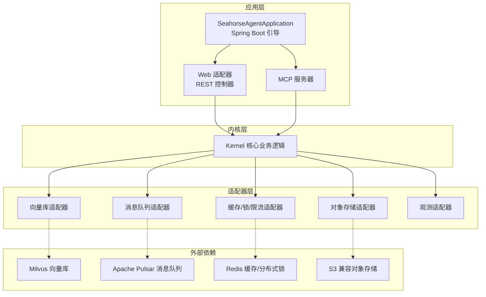
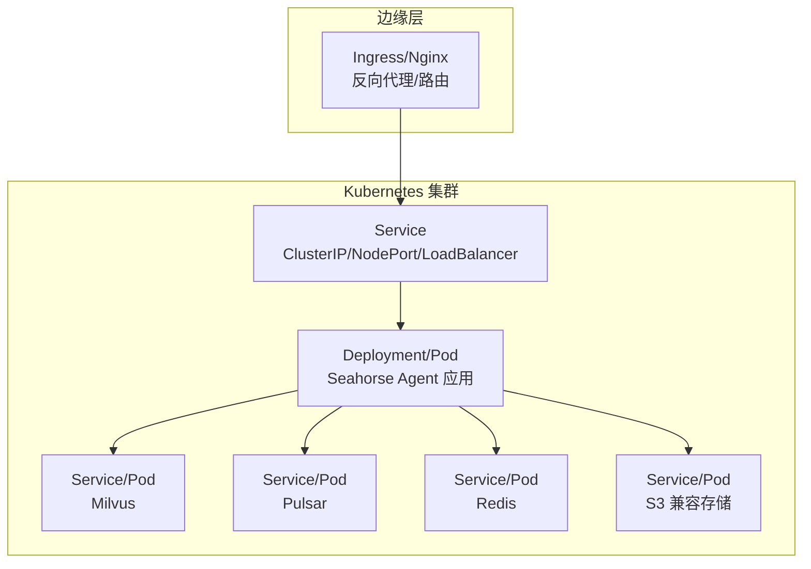
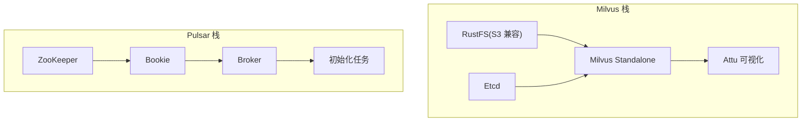
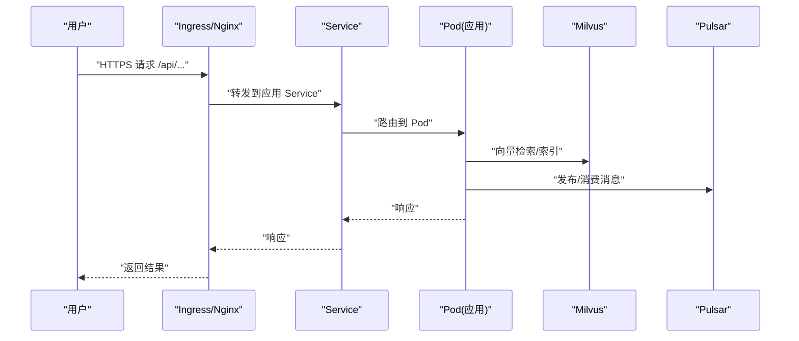
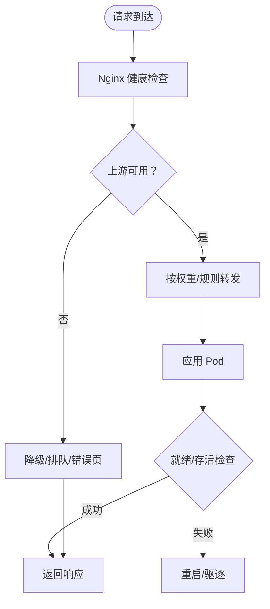
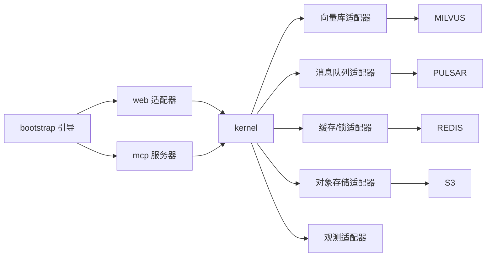

# 生产环境部署

<cite>
**本文引用的文件**
- [pom.xml](file://pom.xml)
- [application.properties](file://seahorse-agent-bootstrap/src/main/resources/application.properties)
- [SeahorseAgentApplication.java](file://seahorse-agent-bootstrap/src/main/java/com/miracle/ai/seahorse/agent/SeahorseAgentApplication.java)
- [quick-start.md](file://docs/quick-start.md)
- [milvus-stack-2.6.6.compose.yaml](file://resources/docker/milvus-stack-2.6.6.compose.yaml)
- [milvus-stack-2.6.6.compose.yaml（轻量版）](file://resources/docker/lightweight/milvus-stack-2.6.6.compose.yaml)
- [pulsar-stack-3.1.3.compose.yaml](file://resources/docker/pulsar-stack-3.1.3.compose.yaml)
</cite>

## 目录
1. [简介](#简介)
2. [项目结构](#项目结构)
3. [核心组件](#核心组件)
4. [架构总览](#架构总览)
5. [详细组件分析](#详细组件分析)
6. [依赖关系分析](#依赖关系分析)
7. [性能考虑](#性能考虑)
8. [故障排查指南](#故障排查指南)
9. [结论](#结论)
10. [附录](#附录)

## 简介
本指南面向生产环境，提供 Seahorse Agent 的容器化与云原生部署方案，覆盖以下主题：
- 容器化部署：Docker 镜像构建、Docker Compose 编排、多容器协调
- Kubernetes 集群部署：Pod 配置、Service 服务发现、Ingress 外部访问、ConfigMap 与 Secret 环境配置
- 负载均衡：Nginx 反向代理、应用集群配置、健康检查
- CI/CD 自动化：GitLab CI、GitHub Actions、Jenkins 的配置要点
- 应用启动参数：JVM 参数、内存设置、线程池配置
- 监控与日志：容器监控、应用日志聚合、性能指标采集
- 实用脚本与一键命令、环境切换策略

## 项目结构
Seahorse Agent 采用多模块 Maven 结构，核心模块包括内核、Web 适配器、消息队列、向量库、缓存、对象存储、观测等适配器，以及一个可执行引导模块。生产部署通常以 Spring Boot 可执行 jar 运行，结合外部依赖（如 Milvus、Pulsar）通过 Compose 或 K8s 管理。

图表来源
- [SeahorseAgentApplication.java:30-36](file://seahorse-agent-bootstrap/src/main/java/com/miracle/ai/seahorse/agent/SeahorseAgentApplication.java#L30-L36)
- [pom.xml:37-60](file://pom.xml#L37-L60)

章节来源
- [pom.xml:37-60](file://pom.xml#L37-L60)
- [quick-start.md:1-20](file://docs/quick-start.md#L1-L20)

## 核心组件
- 引导应用：Spring Boot 启动类，限定扫描命名空间，启用调度能力，作为生产可执行入口。
- 应用配置：应用名称、内核开关、迁移模式等基础配置项。
- 多模块结构：内核、Web、MCP、消息队列、向量库、缓存、存储、观测等适配器模块，便于按需裁剪与扩展。

章节来源
- [SeahorseAgentApplication.java:30-36](file://seahorse-agent-bootstrap/src/main/java/com/miracle/ai/seahorse/agent/SeahorseAgentApplication.java#L30-L36)
- [application.properties:1-4](file://seahorse-agent-bootstrap/src/main/resources/application.properties#L1-L4)
- [pom.xml:37-60](file://pom.xml#L37-L60)

## 架构总览
下图展示生产环境典型拓扑：应用 Pod 通过 Service 暴露 REST/MCP 接口；外部通过 Ingress/Nginx 提供统一入口；后端依赖 Milvus（向量）、Pulsar（消息）、Redis/S3 等通过独立服务或 Sidecar 提供。

图表来源
- [milvus-stack-2.6.6.compose.yaml:52-79](file://resources/docker/milvus-stack-2.6.6.compose.yaml#L52-L79)
- [pulsar-stack-3.1.3.compose.yaml:30-51](file://resources/docker/pulsar-stack-3.1.3.compose.yaml#L30-L51)

## 详细组件分析

### 容器化与 Compose 编排
- Milvus 栈：包含 etcd、standalone、S3 兼容对象存储（rustfs）、可视化管理界面 Attu。提供健康检查、持久化卷与网络隔离。
- Pulsar 栈：包含 ZooKeeper、Bookie、Broker 与初始化任务，自动创建租户、命名空间与分区主题。
- 轻量版 Milvus：降低资源限制，适合小规模或测试环境。

图表来源
- [milvus-stack-2.6.6.compose.yaml:31-89](file://resources/docker/milvus-stack-2.6.6.compose.yaml#L31-L89)
- [pulsar-stack-3.1.3.compose.yaml:4-64](file://resources/docker/pulsar-stack-3.1.3.compose.yaml#L4-L64)

章节来源
- [milvus-stack-2.6.6.compose.yaml:1-99](file://resources/docker/milvus-stack-2.6.6.compose.yaml#L1-L99)
- [milvus-stack-2.6.6.compose.yaml（轻量版）:1-90](file://resources/docker/lightweight/milvus-stack-2.6.6.compose.yaml#L1-L90)
- [pulsar-stack-3.1.3.compose.yaml:1-65](file://resources/docker/pulsar-stack-3.1.3.compose.yaml#L1-L65)

### Kubernetes 部署要点
- Pod 配置
  - 资源请求/限制：为应用、Milvus、Pulsar、Redis、S3 设置合理的 CPU/内存配额与启动探针/就绪探针。
  - 环境变量：通过 ConfigMap/Secret 注入数据库连接、模型服务地址、向量库参数、消息队列参数等。
- Service 服务发现
  - ClusterIP 暴露内部服务；NodePort/LoadBalancer 暴露给 Ingress。
- Ingress 外部访问
  - 配置 TLS、路径路由、超时与重试策略；将 /api/*、/mcp 等路径转发到对应 Service。
- ConfigMap 与 Secret
  - 将非敏感配置放入 ConfigMap，敏感信息放入 Secret；避免硬编码在镜像中。

图表来源
- [milvus-stack-2.6.6.compose.yaml:52-79](file://resources/docker/milvus-stack-2.6.6.compose.yaml#L52-L79)
- [pulsar-stack-3.1.3.compose.yaml:30-51](file://resources/docker/pulsar-stack-3.1.3.compose.yaml#L30-L51)

### 负载均衡与健康检查
- Nginx 反向代理
  - 配置上游服务器列表、权重、健康状态检测；开启 gzip/缓存优化静态资源。
- 应用集群
  - 多副本部署，配合水平 Pod 自动伸缩（HPA）根据 CPU/自定义指标扩缩容。
- 健康检查
  - 应用：HTTP 探针（/actuator/health），Milvus/Pulsar：各自健康端点。
  - 重启策略：失败重启、就绪探针延迟启动，避免雪崩。

图表来源
- [milvus-stack-2.6.6.compose.yaml:25-29](file://resources/docker/milvus-stack-2.6.6.compose.yaml#L25-L29)
- [pulsar-stack-3.1.3.compose.yaml:40-47](file://resources/docker/pulsar-stack-3.1.3.compose.yaml#L40-L47)

### CI/CD 自动化部署
- GitLab CI
  - 触发条件：分支保护、合并请求、tag 发布。
  - 步骤：构建镜像（多阶段 Dockerfile）、推送 Registry、K8s 部署（kubectl set image / helm upgrade）、集成测试。
- GitHub Actions
  - 工作流：构建、测试、打包、镜像构建与推送、蓝绿/金丝雀发布。
- Jenkins
  - 流水线：Stage 划分（构建/测试/打包/部署），结合 Kubernetes CD 插件或 Helm 执行部署。
- 最佳实践
  - 镜像签名与漏洞扫描、灰度发布、回滚策略、变更审批。

### 应用启动参数与 JVM 配置
- Java 版本与内存
  - 基于 Maven 属性设定 Java 17；容器内 JVM 堆大小建议占内存上限 60%-80%，预留 GC 与直接内存。
- 垃圾回收与参数
  - 推荐 G1GC；设置新生代比例、晋升阈值、停顿目标；开启指针压缩（>=32G堆）。
- 线程池与并发
  - I/O 密集：CPU*2；计算密集：CPU+1；线程池队列长度与拒绝策略按 SLA 设定。
- 连接池与超时
  - 数据库、HTTP、消息队列连接池大小与空闲超时；请求超时与重试退避策略。
- 观测与诊断
  - 启用 Micrometer 指标、OpenTelemetry 链路追踪、JFR/Heap Dump（按需）。

章节来源
- [pom.xml:15-35](file://pom.xml#L15-L35)
- [quick-start.md:57-82](file://docs/quick-start.md#L57-L82)

### 监控与日志
- 容器监控
  - Prometheus + Grafana：采集 CPU/内存/磁盘/网络、应用指标（HTTP 响应时间/速率/错误率）、外部依赖指标。
- 日志聚合
  - Fluent Bit/Fluentd 收集 stdout/stderr，写入 Elasticsearch/Opensearch 或 S3；支持结构化字段与上下文关联。
- 性能指标
  - Micrometer + Actuator 暴露指标；Prometheus 抓取；告警规则基于 P95/P99 与错误率。

## 依赖关系分析
- 内核与适配器解耦：内核仅依赖端口接口，通过适配器实现具体功能，便于替换与扩展。
- 外部依赖通过服务发现与配置注入：Milvus、Pulsar、Redis、S3 通过环境变量或配置文件接入。
- 构建与运行分离：Maven 多模块构建产物，运行时以可执行 jar 与外部依赖组合。

图表来源
- [pom.xml:37-60](file://pom.xml#L37-L60)
- [milvus-stack-2.6.6.compose.yaml:52-79](file://resources/docker/milvus-stack-2.6.6.compose.yaml#L52-L79)
- [pulsar-stack-3.1.3.compose.yaml:30-51](file://resources/docker/pulsar-stack-3.1.3.compose.yaml#L30-L51)

章节来源
- [pom.xml:37-60](file://pom.xml#L37-L60)

## 性能考虑
- 资源规划
  - 应用：CPU 2-4 核起步，内存 4-8G；Milvus：CPU 4-8 核，内存 16-32G；Pulsar Broker：CPU 2 核，内存 4G 起步。
- 存储与网络
  - Milvus 数据卷与快照策略；Pulsar 分区主题与副本；S3 使用就近区域与 CDN。
- 连接与缓存
  - 连接池大小与超时；热点数据本地缓存；分布式锁与信号量控制并发。
- 调优建议
  - JVM 参数按工作负载调优；GC 日志与指标监控；压测基线与回归门禁。

## 故障排查指南
- 启动失败
  - 检查应用日志与容器事件；确认依赖服务可达（Milvus/Pulsar/Redis/S3）。
- 健康检查失败
  - 查看探针返回码与超时；确认端口映射与防火墙；检查持久化卷权限。
- 性能异常
  - 关注 GC 停顿、线程池饱和、数据库慢查询、消息积压；对比指标基线。
- 配置问题
  - 核对 ConfigMap/Secret 是否正确挂载；区分 dev/stage/prod 环境变量；避免明文密码。

## 结论
通过 Compose/Kubernetes 的标准化编排，结合 Nginx 负载均衡与完善的监控日志体系，Seahorse Agent 可在生产环境中实现高可用、可观测与可扩展的部署。建议以模块化适配器为核心，按需裁剪外部依赖，配合 CI/CD 实现自动化与可追溯的发布流程。

## 附录

### 一键部署命令与脚本示例
- 本地 Compose 快启（Milvus + Pulsar）
  - 启动：docker compose -f resources/docker/milvus-stack-2.6.6.compose.yaml up -d
  - 启动：docker compose -f resources/docker/pulsar-stack-3.1.3.compose.yaml up -d
  - 停止：docker compose down
- 构建与运行（本地）
  - 构建：mvn clean package -DskipTests
  - 运行：java -jar seahorse-agent-bootstrap/target/seahorse-agent-bootstrap-*.jar
- Kubernetes 部署（示例步骤）
  - 创建 ConfigMap/Secret：kubectl apply -f k8s/configs/
  - 部署 Milvus/Pulsar/Redis/S3：kubectl apply -f k8s/external/
  - 部署应用：kubectl apply -f k8s/app/

### 环境切换策略
- 环境变量
  - dev/stage/prod 三套配置，通过不同 ConfigMap/Secret 切换。
- 配置分层
  - 基础配置（端口/日志级别）；业务配置（模型参数/向量维度）；依赖配置（连接串/凭证）。
- 发布策略
  - 蓝绿/金丝雀发布；回滚机制；发布前健康检查与指标门禁。