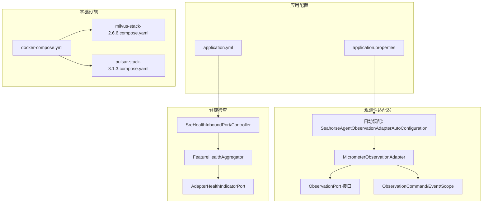
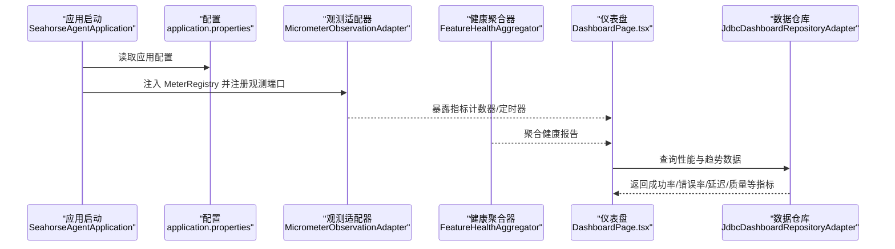
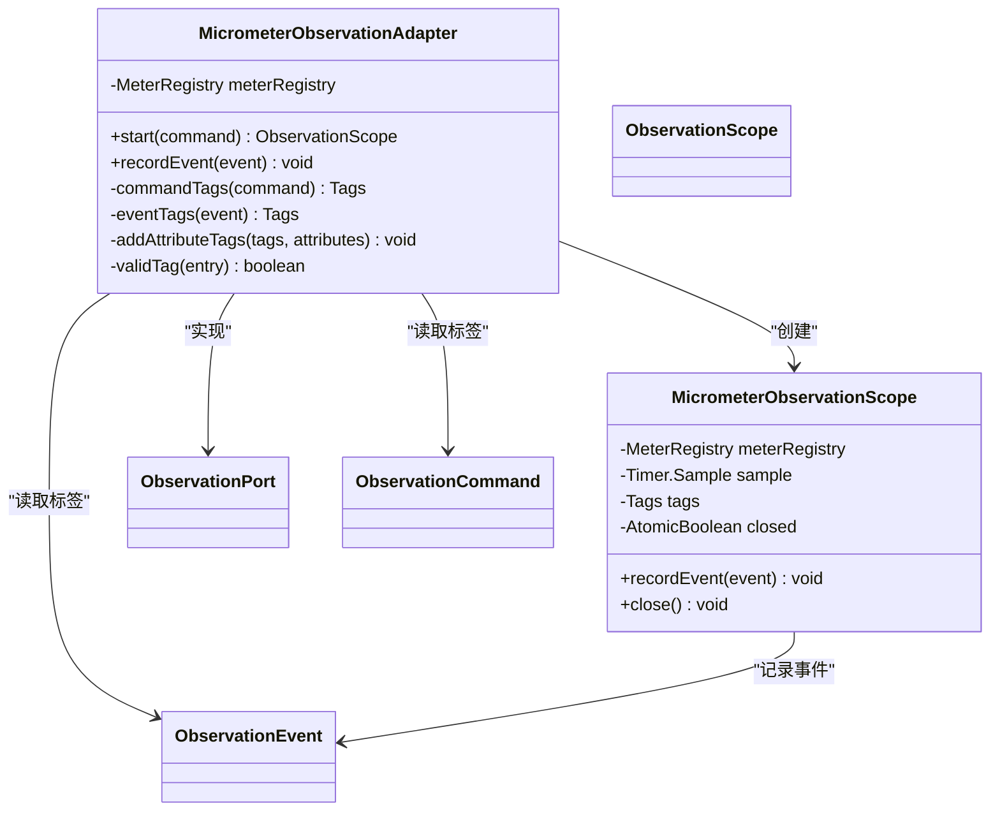
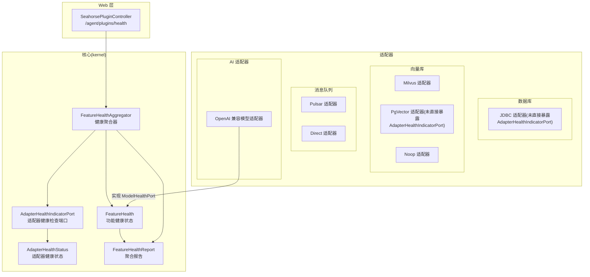
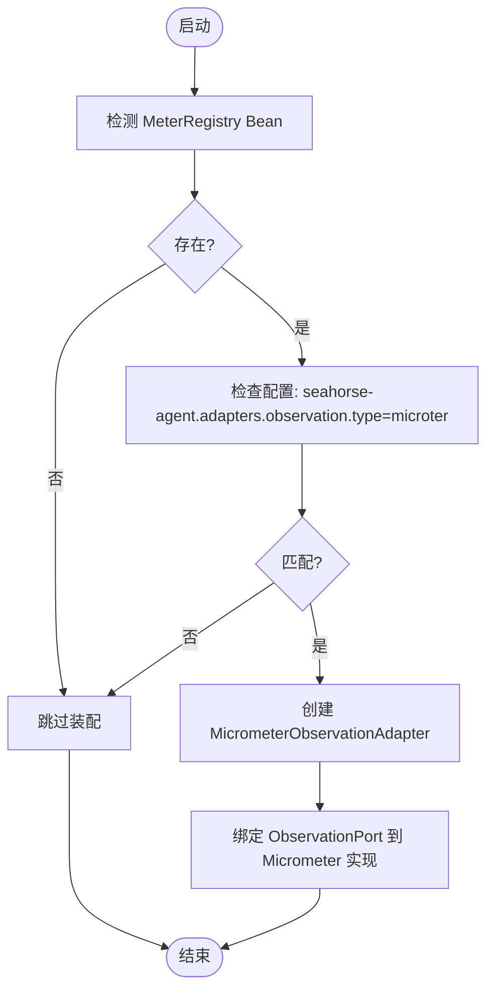
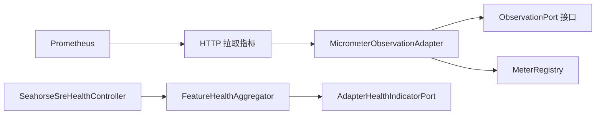

# 监控与日志配置

<cite>
**本文引用的文件**
- [application.properties](file://seahorse-agent-bootstrap/src/main/resources/application.properties)
- [application.yml](file://seahorse-agent-mcp-server/src/main/resources/application.yml)
- [MicrometerObservationAdapter.java](file://seahorse-agent-adapter-observation-micrometer/src/main/java/com/miracle/ai/seahorse/agent/adapters/observation/micrometer/MicrometerObservationAdapter.java)
- [SeahorseAgentObservationAdapterAutoConfiguration.java](file://seahorse-agent-spring-boot-starter/src/main/java/com/miracle/ai/seahorse/agent/adapters/spring/SeahorseAgentObservationAdapterAutoConfiguration.java)
- [ObservationPort 接口定义](file://seahorse-agent-kernel/src/main/java/com/miracle/ai/seahorse/agent/ports/outbound/observation/ObservationPort.java)
- [ObservationCommand 类型定义](file://seahorse-agent-kernel/src/main/java/com/miracle/ai/seahorse/agent/kernel/observation/ObservationCommand.java)
- [ObservationEvent 类型定义](file://seahorse-agent-kernel/src/main/java/com/miracle/ai/seahorse/agent/kernel/observation/ObservationEvent.java)
- [ObservationScope 接口定义](file://seahorse-agent-kernel/src/main/java/com/miracle/ai/seahorse/agent/ports/outbound/observation/ObservationScope.java)
- [FeatureHealthAggregator.java](file://seahorse-agent-kernel/src/main/java/com/miracle/ai/seahorse/agent/kernel/health/FeatureHealthAggregator.java)
- [AdapterHealthIndicatorPort.java](file://seahorse-agent-kernel/src/main/java/com/miracle/ai/seahorse/agent/ports/outbound/health/AdapterHealthIndicatorPort.java)
- [SreHealthInboundPort.java](file://seahorse-agent-adapter-web/src/main/java/com/miracle/ai/seahorse/agent/adapters/web/SreHealthInboundPort.java)
- [SeahorseSreHealthController.java](file://seahorse-agent-adapter-web/src/main/java/com/miracle/ai/seahorse/agent/adapters/web/SeahorseSreHealthController.java)
- [MicrometerObservationAdapterTests.java](file://seahorse-agent-adapter-observation-micrometer/src/test/java/com/miracle/ai/seahorse/agent/adapters/observation/micrometer/MicrometerObservationAdapterTests.java)
- [监控运维.md](file://docs/zh/content/监控运维/监控运维.md)
- [应用监控.md](file://docs/zh/content/监控运维/应用监控.md)
- [健康检查.md](file://docs/zh/content/监控运维/健康检查.md)
- [docker-compose.yml](file://docker-compose.yml)
- [milvus-stack-2.6.6.compose.yaml](file://resources/docker/milvus-stack-2.6.6.compose.yaml)
- [pulsar-stack-3.1.3.compose.yaml](file://resources/docker/pulsar-stack-3.1.3.compose.yaml)
</cite>

## 目录
1. [引言](#引言)
2. [项目结构](#项目结构)
3. [核心组件](#核心组件)
4. [架构总览](#架构总览)
5. [详细组件分析](#详细组件分析)
6. [依赖分析](#依赖分析)
7. [性能考量](#性能考量)
8. [故障排查指南](#故障排查指南)
9. [结论](#结论)
10. [附录](#附录)

## 引言
本指南面向 Seahorse Agent 的监控与日志配置，重点覆盖以下方面：
- Micrometer 观测性适配器的配置与使用，包括指标收集、自定义指标定义、Prometheus 集成等
- 日志配置选项，包括日志级别、日志格式、日志轮转策略等
- 健康检查端点的配置与使用，包括数据库连接检查、外部服务可用性检查等
- 分布式追踪配置，包括 Span 生成、Trace ID 传播、分布式追踪系统集成等
- 告警规则配置，包括阈值设置、告警通知渠道、告警收敛策略等
- 性能监控指标的收集与可视化，包括关键业务指标、系统资源指标、应用性能指标等
- 监控仪表板的搭建与维护指南

## 项目结构
与监控和日志相关的核心模块与文件分布如下：
- 观测性适配器：MicrometerObservationAdapter 及其自动装配配置
- 健康检查：FeatureHealthAggregator、AdapterHealthIndicatorPort 以及 Web 层健康端点
- 配置文件：application.properties、application.yml
- 文档：监控运维、应用监控、健康检查等文档
- 基础设施编排：docker-compose 与 Milvus/Pulsar 健康栈

**图表来源**
- [application.properties](file://seahorse-agent-bootstrap/src/main/resources/application.properties)
- [application.yml](file://seahorse-agent-mcp-server/src/main/resources/application.yml)
- [MicrometerObservationAdapter.java](file://seahorse-agent-adapter-observation-micrometer/src/main/java/com/miracle/ai/seahorse/agent/adapters/observation/micrometer/MicrometerObservationAdapter.java)
- [SeahorseAgentObservationAdapterAutoConfiguration.java](file://seahorse-agent-spring-boot-starter/src/main/java/com/miracle/ai/seahorse/agent/adapters/spring/SeahorseAgentObservationAdapterAutoConfiguration.java)
- [FeatureHealthAggregator.java](file://seahorse-agent-kernel/src/main/java/com/miracle/ai/seahorse/agent/kernel/health/FeatureHealthAggregator.java)
- [AdapterHealthIndicatorPort.java](file://seahorse-agent-kernel/src/main/java/com/miracle/ai/seahorse/agent/ports/outbound/health/AdapterHealthIndicatorPort.java)
- [SreHealthInboundPort.java](file://seahorse-agent-adapter-web/src/main/java/com/miracle/ai/seahorse/agent/adapters/web/SreHealthInboundPort.java)
- [SeahorseSreHealthController.java](file://seahorse-agent-adapter-web/src/main/java/com/miracle/ai/seahorse/agent/adapters/web/SeahorseSreHealthController.java)
- [docker-compose.yml](file://docker-compose.yml)
- [milvus-stack-2.6.6.compose.yaml](file://resources/docker/milvus-stack-2.6.6.compose.yaml)
- [pulsar-stack-3.1.3.compose.yaml](file://resources/docker/pulsar-stack-3.1.3.compose.yaml)

**章节来源**
- [application.properties](file://seahorse-agent-bootstrap/src/main/resources/application.properties)
- [application.yml](file://seahorse-agent-mcp-server/src/main/resources/application.yml)
- [监控运维.md](file://docs/zh/content/监控运维/监控运维.md)
- [应用监控.md](file://docs/zh/content/监控运维/应用监控.md)
- [健康检查.md](file://docs/zh/content/监控运维/健康检查.md)

## 核心组件
- Micrometer 观测性适配器：将内核观测命令与事件映射到 Micrometer 指标，支持计时器与计数器的自动采集与标签化
- 观测端口与命令：ObservationPort、ObservationCommand、ObservationEvent、ObservationScope 定义了观测的 SPI 接口与生命周期
- 健康聚合器：FeatureHealthAggregator 聚合 Adapter 与 Feature 的健康状态，提供统一的健康报告
- 健康端点控制器：SeahorseSreHealthController 对外暴露 /agent/plugins/health 健康检查端点
- 自动装配：SeahorseAgentObservationAdapterAutoConfiguration 在满足条件时注入 MicrometerObservationAdapter

**章节来源**
- [MicrometerObservationAdapter.java](file://seahorse-agent-adapter-observation-micrometer/src/main/java/com/miracle/ai/seahorse/agent/adapters/observation/micrometer/MicrometerObservationAdapter.java)
- [ObservationPort 接口定义](file://seahorse-agent-kernel/src/main/java/com/miracle/ai/seahorse/agent/ports/outbound/observation/ObservationPort.java)
- [ObservationCommand 类型定义](file://seahorse-agent-kernel/src/main/java/com/miracle/ai/seahorse/agent/kernel/observation/ObservationCommand.java)
- [ObservationEvent 类型定义](file://seahorse-agent-kernel/src/main/java/com/miracle/ai/seahorse/agent/kernel/observation/ObservationEvent.java)
- [ObservationScope 接口定义](file://seahorse-agent-kernel/src/main/java/com/miracle/ai/seahorse/agent/ports/outbound/observation/ObservationScope.java)
- [FeatureHealthAggregator.java](file://seahorse-agent-kernel/src/main/java/com/miracle/ai/seahorse/agent/kernel/health/FeatureHealthAggregator.java)
- [AdapterHealthIndicatorPort.java](file://seahorse-agent-kernel/src/main/java/com/miracle/ai/seahorse/agent/ports/outbound/health/AdapterHealthIndicatorPort.java)
- [SreHealthInboundPort.java](file://seahorse-agent-adapter-web/src/main/java/com/miracle/ai/seahorse/agent/adapters/web/SreHealthInboundPort.java)
- [SeahorseSreHealthController.java](file://seahorse-agent-adapter-web/src/main/java/com/miracle/ai/seahorse/agent/adapters/web/SeahorseSreHealthController.java)
- [SeahorseAgentObservationAdapterAutoConfiguration.java](file://seahorse-agent-spring-boot-starter/src/main/java/com/miracle/ai/seahorse/agent/adapters/spring/SeahorseAgentObservationAdapterAutoConfiguration.java)

## 架构总览
下图展示从应用启动到指标采集、健康检查与前端可视化的整体流程。

**图表来源**
- [监控运维.md](file://docs/zh/content/监控运维/监控运维.md)
- [application.properties](file://seahorse-agent-bootstrap/src/main/resources/application.properties)
- [MicrometerObservationAdapter.java](file://seahorse-agent-adapter-observation-micrometer/src/main/java/com/miracle/ai/seahorse/agent/adapters/observation/micrometer/MicrometerObservationAdapter.java)
- [FeatureHealthAggregator.java](file://seahorse-agent-kernel/src/main/java/com/miracle/ai/seahorse/agent/kernel/health/FeatureHealthAggregator.java)

## 详细组件分析

### Micrometer 观测性适配器
- 指标类型与命名
  - 持续时间指标：用于记录观测生命周期内的耗时，名称为固定常量
  - 事件计数指标：用于记录独立事件的发生次数，名称为固定常量
- 标签体系
  - 观测维度：observation（来自命令名称）、tenant（来自命令租户标识）
  - 事件维度：event（来自事件名称）
  - 属性维度：从命令与事件的 attributes 映射中提取有效键值对作为标签
- 生命周期管理
  - start：启动计时采样，合并标签后返回作用域实例
  - recordEvent：在作用域内或独立记录事件计数器
  - close：在作用域关闭时，基于标签构建定时器并停止采样，完成耗时统计

**图表来源**
- [MicrometerObservationAdapter.java](file://seahorse-agent-adapter-observation-micrometer/src/main/java/com/miracle/ai/seahorse/agent/adapters/observation/micrometer/MicrometerObservationAdapter.java)
- [ObservationPort 接口定义](file://seahorse-agent-kernel/src/main/java/com/miracle/ai/seahorse/agent/ports/outbound/observation/ObservationPort.java)
- [ObservationScope 接口定义](file://seahorse-agent-kernel/src/main/java/com/miracle/ai/seahorse/agent/ports/outbound/observation/ObservationScope.java)
- [ObservationCommand 类型定义](file://seahorse-agent-kernel/src/main/java/com/miracle/ai/seahorse/agent/kernel/observation/ObservationCommand.java)
- [ObservationEvent 类型定义](file://seahorse-agent-kernel/src/main/java/com/miracle/ai/seahorse/agent/kernel/observation/ObservationEvent.java)

**章节来源**
- [应用监控.md](file://docs/zh/content/监控运维/应用监控.md)
- [MicrometerObservationAdapter.java](file://seahorse-agent-adapter-observation-micrometer/src/main/java/com/miracle/ai/seahorse/agent/adapters/observation/micrometer/MicrometerObservationAdapter.java)
- [MicrometerObservationAdapterTests.java](file://seahorse-agent-adapter-observation-micrometer/src/test/java/com/miracle/ai/seahorse/agent/adapters/observation/micrometer/MicrometerObservationAdapterTests.java)

### 健康检查机制
- 健康状态模型
  - Feature 健康状态：包含名称、是否健康、消息与详情
  - Adapter 健康状态：包含名称、是否健康、状态字符串与详情
- 聚合逻辑
  - 聚合器对 Feature 与 Adapter 的健康状态进行汇总，任一不健康则整体不健康
  - Feature 健康方法抛出异常会被转换为 DOWN 状态，避免异常传播至主链路
- 报告输出
  - 输出整体健康布尔值与明细列表，便于前端与运维系统消费
- Web 端点
  - /agent/plugins/health 由 SeahorseSreHealthController 暴露，返回聚合报告

**图表来源**
- [健康检查.md](file://docs/zh/content/监控运维/健康检查.md)
- [FeatureHealthAggregator.java](file://seahorse-agent-kernel/src/main/java/com/miracle/ai/seahorse/agent/kernel/health/FeatureHealthAggregator.java)
- [AdapterHealthIndicatorPort.java](file://seahorse-agent-kernel/src/main/java/com/miracle/ai/seahorse/agent/ports/outbound/health/AdapterHealthIndicatorPort.java)
- [SreHealthInboundPort.java](file://seahorse-agent-adapter-web/src/main/java/com/miracle/ai/seahorse/agent/adapters/web/SreHealthInboundPort.java)
- [SeahorseSreHealthController.java](file://seahorse-agent-adapter-web/src/main/java/com/miracle/ai/seahorse/agent/adapters/web/SeahorseSreHealthController.java)

**章节来源**
- [健康检查.md](file://docs/zh/content/监控运维/健康检查.md)
- [FeatureHealthAggregator.java](file://seahorse-agent-kernel/src/main/java/com/miracle/ai/seahorse/agent/kernel/health/FeatureHealthAggregator.java)
- [AdapterHealthIndicatorPort.java](file://seahorse-agent-kernel/src/main/java/com/miracle/ai/seahorse/agent/ports/outbound/health/AdapterHealthIndicatorPort.java)
- [SreHealthInboundPort.java](file://seahorse-agent-adapter-web/src/main/java/com/miracle/ai/seahorse/agent/adapters/web/SreHealthInboundPort.java)
- [SeahorseSreHealthController.java](file://seahorse-agent-adapter-web/src/main/java/com/miracle/ai/seahorse/agent/adapters/web/SeahorseSreHealthController.java)

### 自动装配与配置
- 自动装配条件
  - 当存在 MeterRegistry Bean 且配置项 seahorse-agent.adapters.observation.type=microter 时，注入 MicrometerObservationAdapter
- 默认端口绑定
  - META-INF 配置文件将 ObservationPort 默认绑定到 Micrometer 实现

**图表来源**
- [SeahorseAgentObservationAdapterAutoConfiguration.java](file://seahorse-agent-spring-boot-starter/src/main/java/com/miracle/ai/seahorse/agent/adapters/spring/SeahorseAgentObservationAdapterAutoConfiguration.java)
- [ObservationPort 接口定义](file://seahorse-agent-kernel/src/main/java/com/miracle/ai/seahorse/agent/ports/outbound/observation/ObservationPort.java)

**章节来源**
- [SeahorseAgentObservationAdapterAutoConfiguration.java](file://seahorse-agent-spring-boot-starter/src/main/java/com/miracle/ai/seahorse/agent/adapters/spring/SeahorseAgentObservationAdapterAutoConfiguration.java)
- [seahorse-agent-adapter-observation-micrometer 配置](file://seahorse-agent-adapter-observation-micrometer/src/main/resources/META-INF/seahorse-agent/com.miracle.ai.seahorse.agent.ports.outbound.observation.ObservationPort)

## 依赖分析
- 组件耦合与内聚
  - MicrometerObservationAdapter 与 MeterRegistry 强耦合，但通过 ObservationPort 解耦观测命令与事件的处理
  - FeatureHealthAggregator 通过 AdapterHealthIndicatorPort 与具体适配器解耦，支持多种后端健康探测
- 直接与间接依赖
  - 观测适配器依赖内核接口（ObservationPort/Command/Event/Scope）
  - 健康端点依赖 SreHealthInboundPort 与 FeatureHealthAggregator
- 外部依赖与集成点
  - Micrometer 作为指标收集与暴露的基础设施
  - Prometheus 通过 HTTP 拉取指标端点进行采集（需在部署侧配置）
  - Grafana 通过 Prometheus 数据源进行可视化

**图表来源**
- [MicrometerObservationAdapter.java](file://seahorse-agent-adapter-observation-micrometer/src/main/java/com/miracle/ai/seahorse/agent/adapters/observation/micrometer/MicrometerObservationAdapter.java)
- [ObservationPort 接口定义](file://seahorse-agent-kernel/src/main/java/com/miracle/ai/seahorse/agent/ports/outbound/observation/ObservationPort.java)
- [FeatureHealthAggregator.java](file://seahorse-agent-kernel/src/main/java/com/miracle/ai/seahorse/agent/kernel/health/FeatureHealthAggregator.java)
- [AdapterHealthIndicatorPort.java](file://seahorse-agent-kernel/src/main/java/com/miracle/ai/seahorse/agent/ports/outbound/health/AdapterHealthIndicatorPort.java)
- [SeahorseSreHealthController.java](file://seahorse-agent-adapter-web/src/main/java/com/miracle/ai/seahorse/agent/adapters/web/SeahorseSreHealthController.java)

**章节来源**
- [监控运维.md](file://docs/zh/content/监控运维/监控运维.md)
- [应用监控.md](file://docs/zh/content/监控运维/应用监控.md)
- [健康检查.md](file://docs/zh/content/监控运维/健康检查.md)

## 性能考量
- 指标开销控制
  - 使用轻量级标签，避免高基数标签导致指标爆炸
  - 合理选择计时器与计数器，减少不必要的采样
- 健康检查频率
  - 建议每 30-60 秒一次，避免过于频繁造成资源浪费
- 资源隔离
  - 将观测与健康检查置于独立线程池或异步任务，避免阻塞业务主链路

[本节为通用指导，无需列出具体文件来源]

## 故障排查指南
- 观测指标缺失
  - 检查是否正确装配 MicrometerObservationAdapter（配置项与 MeterRegistry Bean）
  - 确认 ObservationPort 是否被正确绑定到 Micrometer 实现
- 健康检查异常
  - 通过 /agent/plugins/health 端点查看聚合报告，定位具体 Adapter/Feature 的异常
  - 检查 AdapterHealthIndicatorPort.health() 实现与异常处理
- 指标暴露问题
  - 确认 Micrometer 暴露端点已启用（如 Spring Boot Actuator 的 endpoints/web/exposure/include）
  - 检查 Prometheus 抓取配置与网络连通性

**章节来源**
- [SeahorseAgentObservationAdapterAutoConfiguration.java](file://seahorse-agent-spring-boot-starter/src/main/java/com/miracle/ai/seahorse/agent/adapters/spring/SeahorseAgentObservationAdapterAutoConfiguration.java)
- [MicrometerObservationAdapter.java](file://seahorse-agent-adapter-observation-micrometer/src/main/java/com/miracle/ai/seahorse/agent/adapters/observation/micrometer/MicrometerObservationAdapter.java)
- [SeahorseSreHealthController.java](file://seahorse-agent-adapter-web/src/main/java/com/miracle/ai/seahorse/agent/adapters/web/SeahorseSreHealthController.java)

## 结论
本指南系统梳理了 Seahorse Agent 的监控与日志配置要点，包括 Micrometer 观测性适配器的装配与使用、健康检查的聚合与暴露、以及与 Prometheus/Grafana 的集成路径。通过合理的指标设计、标签体系与健康检查策略，可有效支撑系统的可观测性与稳定性。

[本节为总结性内容，无需列出具体文件来源]

## 附录

### 配置参考与示例路径
- 应用配置文件
  - [application.properties](file://seahorse-agent-bootstrap/src/main/resources/application.properties)
  - [application.yml](file://seahorse-agent-mcp-server/src/main/resources/application.yml)
- 观测性适配器
  - [MicrometerObservationAdapter.java](file://seahorse-agent-adapter-observation-micrometer/src/main/java/com/miracle/ai/seahorse/agent/adapters/observation/micrometer/MicrometerObservationAdapter.java)
  - [SeahorseAgentObservationAdapterAutoConfiguration.java](file://seahorse-agent-spring-boot-starter/src/main/java/com/miracle/ai/seahorse/agent/adapters/spring/SeahorseAgentObservationAdapterAutoConfiguration.java)
- 健康检查
  - [FeatureHealthAggregator.java](file://seahorse-agent-kernel/src/main/java/com/miracle/ai/seahorse/agent/kernel/health/FeatureHealthAggregator.java)
  - [AdapterHealthIndicatorPort.java](file://seahorse-agent-kernel/src/main/java/com/miracle/ai/seahorse/agent/ports/outbound/health/AdapterHealthIndicatorPort.java)
  - [SeahorseSreHealthController.java](file://seahorse-agent-adapter-web/src/main/java/com/miracle/ai/seahorse/agent/adapters/web/SeahorseSreHealthController.java)
- 基础设施
  - [docker-compose.yml](file://docker-compose.yml)
  - [milvus-stack-2.6.6.compose.yaml](file://resources/docker/milvus-stack-2.6.6.compose.yaml)
  - [pulsar-stack-3.1.3.compose.yaml](file://resources/docker/pulsar-stack-3.1.3.compose.yaml)

[本节为参考清单，无需列出具体文件来源]