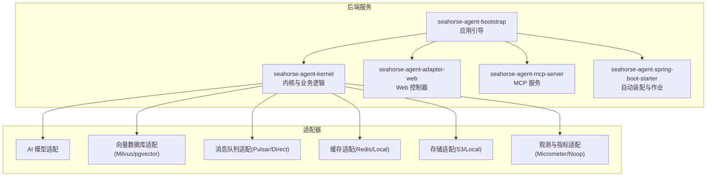
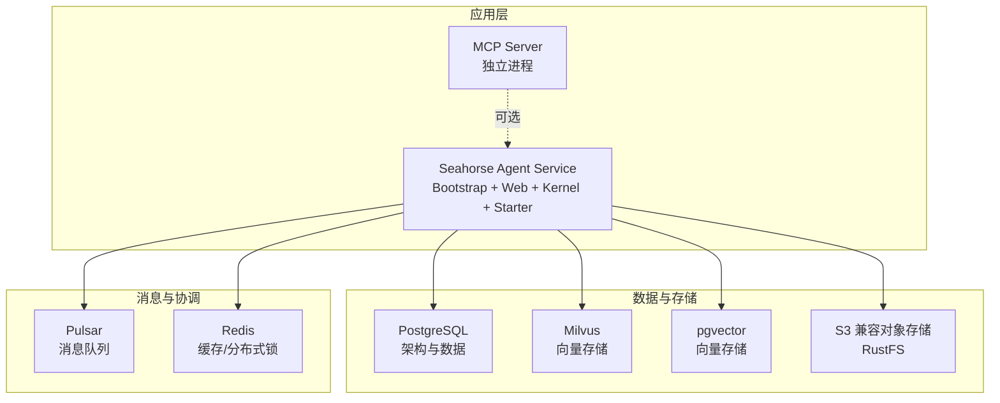
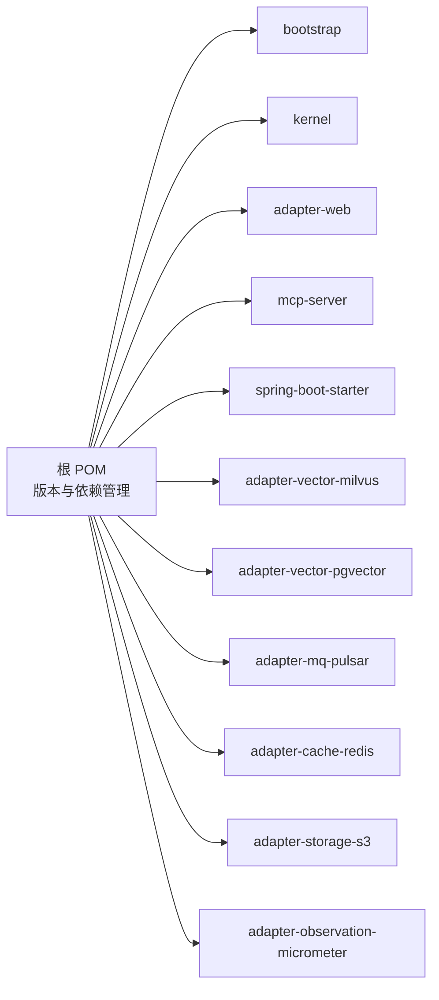
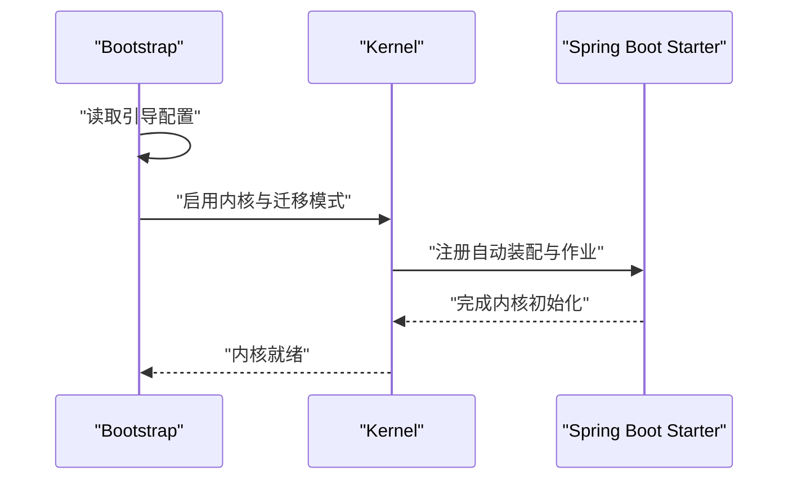
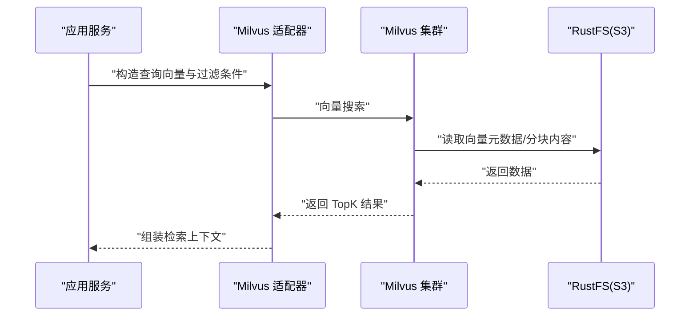
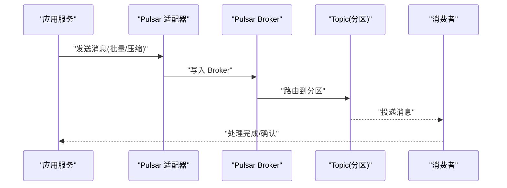

# 部署配置

<cite>
**本文引用的文件**
- [pom.xml](file://pom.xml)
- [application.properties](file://seahorse-agent-bootstrap/src/main/resources/application.properties)
- [application.properties（启动器）](file://seahorse-agent-spring-boot-starter/src/main/resources/application.properties)
- [Milvus 堆栈编排（2.6.6）](file://resources/docker/milvus-stack-2.6.6.compose.yaml)
- [Pulsar 堆栈编排（3.1.3）](file://resources/docker/pulsar-stack-3.1.3.compose.yaml)
- [PostgreSQL 架构定义（PG）](file://resources/database/schema_pg.sql)
- [PostgreSQL 初始化数据（PG）](file://resources/database/init_data_pg.sql)
- [Milvus 向量适配属性](file://seahorse-agent-adapter-vector-milvus/src/main/java/com/miracle/ai/seahorse/agent/adapters/vector/milvus/MilvusVectorProperties.java)
- [PgVector 向量适配属性](file://seahorse-agent-adapter-vector-pgvector/src/main/java/com/miracle/ai/seahorse/agent/adapters/vector/pgvector/PgVectorProperties.java)
- [Pulsar 消息队列适配属性](file://seahorse-agent-adapter-mq-pulsar/src/main/java/com/miracle/ai/seahorse/agent/adapters/mq/pulsar/PulsarMessageQueueProperties.java)
- [MCP 服务器应用配置](file://seahorse-agent-mcp-server/src/main/resources/application.yml)
</cite>

## 目录
1. [简介](#简介)
2. [项目结构](#项目结构)
3. [核心组件](#核心组件)
4. [架构总览](#架构总览)
5. [详细组件分析](#详细组件分析)
6. [依赖关系分析](#依赖关系分析)
7. [性能考虑](#性能考虑)
8. [故障排查指南](#故障排查指南)
9. [结论](#结论)
10. [附录](#附录)

## 简介
本指南面向 Seahorse Agent 项目的部署与运维，覆盖开发环境搭建、数据库初始化、容器化与集群部署、基础设施配置、环境变量与安全密钥管理、性能调优、监控与日志、以及自动化部署与回滚策略。内容基于仓库中的模块化结构、Docker 编排、数据库脚本与适配器配置进行整理，帮助读者快速完成从本地到生产的落地部署。

## 项目结构
Seahorse Agent 采用多模块 Maven 结构，核心模块包括：
- 内核与功能模块：kernel、mcp-server、spring-boot-starter
- 适配器模块：AI 模型、向量数据库、消息队列、缓存、存储、观察与指标等
- Web 控制器与前端：web 适配层、前端页面
- 数据库脚本与 Docker 编排：PostgreSQL 架构与初始化、Milvus 与 Pulsar 的本地编排

图表来源
- [pom.xml:37-60](file://pom.xml#L37-L60)

章节来源
- [pom.xml:37-60](file://pom.xml#L37-L60)

## 核心组件
- 应用引导与运行模式
  - 引导配置启用内核与迁移模式，确保服务启动时加载内核能力。
  - 启动器默认运行模式为 kernel，便于统一行为。
- MCP 服务
  - 单独的服务进程，独立端口对外提供 MCP 协议能力。
- 数据库与向量存储
  - PostgreSQL 架构与索引设计支持 RAG、知识库、会话与内存等场景。
  - 向量存储可选 Milvus 或 pgvector，分别通过适配器配置。
- 消息队列
  - 提供 Pulsar 与直连两种实现，满足不同部署形态的消息可靠性需求。
- 缓存与存储
  - 支持 Redis 与本地缓存；对象存储支持 S3 与本地文件系统。
- 观测与指标
  - 提供 Micrometer 与 Noop 两套适配，便于在不同环境选择合适的观测方案。

章节来源
- [application.properties:1-4](file://seahorse-agent-bootstrap/src/main/resources/application.properties#L1-L4)
- [application.properties（启动器）:1-2](file://seahorse-agent-spring-boot-starter/src/main/resources/application.properties#L1-L2)
- [MCP 服务器应用配置:1-7](file://seahorse-agent-mcp-server/src/main/resources/application.yml#L1-L7)
- [PostgreSQL 架构定义（PG）:1-800](file://resources/database/schema_pg.sql#L1-L800)
- [Milvus 向量适配属性:25-38](file://seahorse-agent-adapter-vector-milvus/src/main/java/com/miracle/ai/seahorse/agent/adapters/vector/milvus/MilvusVectorProperties.java#L25-L38)
- [PgVector 向量适配属性:25-38](file://seahorse-agent-adapter-vector-pgvector/src/main/java/com/miracle/ai/seahorse/agent/adapters/vector/pgvector/PgVectorProperties.java#L25-L38)
- [Pulsar 消息队列适配属性:25-90](file://seahorse-agent-adapter-mq-pulsar/src/main/java/com/miracle/ai/seahorse/agent/adapters/mq/pulsar/PulsarMessageQueueProperties.java#L25-L90)

## 架构总览
下图展示了服务、数据库与外部中间件之间的交互关系，以及 MCP 服务的独立部署位置。

图表来源
- [Milvus 堆栈编排（2.6.6）:1-99](file://resources/docker/milvus-stack-2.6.6.compose.yaml#L1-L99)
- [Pulsar 堆栈编排（3.1.3）:1-65](file://resources/docker/pulsar-stack-3.1.3.compose.yaml#L1-L65)
- [PostgreSQL 架构定义（PG）:1-800](file://resources/database/schema_pg.sql#L1-L800)

## 详细组件分析

### 开发环境搭建与本地运行
- JDK 与构建
  - 使用 Java 17，Spring Boot 3.5.7 版本，建议使用 Maven Wrapper 进行构建。
- 本地数据库初始化
  - 执行 PostgreSQL 架构脚本创建表与索引；如需演示数据，可执行初始化脚本插入管理员账户。
- 本地中间件
  - 使用 Docker Compose 启动 Milvus 与 RustFS（S3 兼容），以及 Pulsar 集群，确保服务间网络互通。
- 应用启动
  - Bootstrap 模块负责应用引导与内核启用；MCP 服务可独立启动以提供协议能力。

章节来源
- [pom.xml:15-35](file://pom.xml#L15-L35)
- [application.properties:1-4](file://seahorse-agent-bootstrap/src/main/resources/application.properties#L1-L4)
- [application.properties（启动器）:1-2](file://seahorse-agent-spring-boot-starter/src/main/resources/application.properties#L1-L2)
- [PostgreSQL 架构定义（PG）:1-800](file://resources/database/schema_pg.sql#L1-L800)
- [PostgreSQL 初始化数据（PG）:1-5](file://resources/database/init_data_pg.sql#L1-L5)
- [Milvus 堆栈编排（2.6.6）:1-99](file://resources/docker/milvus-stack-2.6.6.compose.yaml#L1-L99)
- [Pulsar 堆栈编排（3.1.3）:1-65](file://resources/docker/pulsar-stack-3.1.3.compose.yaml#L1-L65)

### 生产环境部署方案

#### Docker 容器化部署
- 服务镜像
  - 建议基于 Spring Boot Maven 插件生成的可执行 JAR 构建镜像，暴露应用端口。
- 外部依赖
  - 通过 Docker Compose 启动数据库、向量数据库与消息队列，或使用云托管服务。
- 网络与健康检查
  - 统一网络命名空间，利用健康检查保障服务可用性。

章节来源
- [Milvus 堆栈编排（2.6.6）:1-99](file://resources/docker/milvus-stack-2.6.6.compose.yaml#L1-L99)
- [Pulsar 堆栈编排（3.1.3）:1-65](file://resources/docker/pulsar-stack-3.1.3.compose.yaml#L1-L65)

#### Kubernetes 集群部署
- 部署策略
  - 使用 Deployment 管理副本，Service 暴露服务；ConfigMap/Secret 管理配置与密钥。
- 存储与持久化
  - 数据库与对象存储使用 PVC；Milvus 与 Pulsar 可使用 StatefulSet 或外部托管。
- 网络与安全
  - Ingress 对外暴露；TLS 与 RBAC 策略按需启用；Pod 亲和与反亲和优化资源分布。

（本小节为通用实践说明，不直接分析具体文件）

#### 负载均衡与高可用
- 负载均衡
  - Nginx/Ingress 控制器分发请求至多个应用实例。
- 会话与状态
  - 无状态应用适合水平扩展；有状态组件（数据库、向量库）需独立高可用方案。

（本小节为通用实践说明，不直接分析具体文件）

### 基础设施配置

#### 数据库配置（PostgreSQL）
- 架构要点
  - 包含用户、会话、消息、反馈、知识库、意图与查询映射、RAG Trace、摄取流水线、内存与消息事件等表。
  - 向量表使用 pgvector 扩展，建立 GIN 元数据索引与 HNSW 向量索引。
- 初始化
  - 创建扩展与表结构后，导入初始数据以获得管理员账号。

章节来源
- [PostgreSQL 架构定义（PG）:1-800](file://resources/database/schema_pg.sql#L1-L800)
- [PostgreSQL 初始化数据（PG）:1-5](file://resources/database/init_data_pg.sql#L1-L5)

#### 向量数据库配置
- Milvus
  - 通过编排文件启动 Standalone 与 Attu 可视化工具；S3 兼容对象存储指向 RustFS。
  - 适配器属性包含默认集合、向量维度与度量类型。
- pgvector
  - 适配器属性包含表名与向量维度；默认表名为知识向量表。

章节来源
- [Milvus 堆栈编排（2.6.6）:1-99](file://resources/docker/milvus-stack-2.6.6.compose.yaml#L1-L99)
- [Milvus 向量适配属性:25-38](file://seahorse-agent-adapter-vector-milvus/src/main/java/com/miracle/ai/seahorse/agent/adapters/vector/milvus/MilvusVectorProperties.java#L25-L38)
- [PgVector 向量适配属性:25-38](file://seahorse-agent-adapter-vector-pgvector/src/main/java/com/miracle/ai/seahorse/agent/adapters/vector/pgvector/PgVectorProperties.java#L25-L38)

#### 消息队列配置
- Pulsar
  - 编排文件包含 ZooKeeper、Bookie、Broker 与初始化任务；创建租户、命名空间与分区主题。
  - 适配器属性包含发送超时、批量发送、压缩类型等参数。

章节来源
- [Pulsar 堆栈编排（3.1.3）:1-65](file://resources/docker/pulsar-stack-3.1.3.compose.yaml#L1-L65)
- [Pulsar 消息队列适配属性:25-90](file://seahorse-agent-adapter-mq-pulsar/src/main/java/com/miracle/ai/seahorse/agent/adapters/mq/pulsar/PulsarMessageQueueProperties.java#L25-L90)

#### 缓存配置
- Redis
  - 支持 KeyValueCache、PubSub、RateLimiter、分布式锁与信号量等能力。
- 本地缓存
  - 适用于单机或测试场景。

（本小节为通用实践说明，不直接分析具体文件）

#### 对象存储配置
- S3 兼容
  - 可对接云厂商 S3 或本地 RustFS；Milvus 通过 MINIO_* 环境变量指向 S3 兼容存储。
- 本地存储
  - 适用于开发与轻量场景。

章节来源
- [Milvus 堆栈编排（2.6.6）:61-65](file://resources/docker/milvus-stack-2.6.6.compose.yaml#L61-L65)

### 环境变量与安全密钥管理
- 数据库连接
  - JDBC URL、用户名、密码等通过 Spring 配置注入；建议使用 Secret 管理敏感信息。
- 第三方服务
  - AI 模型兼容适配器、Feishu 文档源等可通过属性文件或环境变量配置。
- 安全密钥
  - 使用 Spring Cloud Vault/Kubernetes Secrets 等集中管理密钥，避免硬编码。

（本小节为通用实践说明，不直接分析具体文件）

### 性能调优配置
- JVM 参数
  - 根据实例规模设置堆大小、GC 参数与线程栈大小；结合容器资源限制进行调整。
- 数据库连接池
  - 选择 HikariCP 并根据并发与延迟要求调优最大连接数、空闲超时与连接生命周期。
- 线程池与异步
  - 合理设置业务线程池大小与队列容量；对 IO 密集型任务使用非阻塞模型。
- 向量检索
  - Milvus/pgvector 的索引参数、度量类型与 TopK 需结合数据规模与查询延迟权衡。

（本小节为通用实践说明，不直接分析具体文件）

### 监控与日志配置
- 应用监控
  - 启用 Micrometer 指标导出，结合 Prometheus/Grafana 实现可观测性。
- 日志收集
  - 使用 Structured Logging 输出 JSON，配合 Fluent Bit/Fluentd 收集到 ELK 或 Loki。
- 告警设置
  - 基于指标阈值与错误率配置告警规则，结合通知渠道（邮件/IM）及时处置。

（本小节为通用实践说明，不直接分析具体文件）

## 依赖关系分析
- 模块依赖
  - bootstrap 作为入口聚合其他模块；kernel 提供核心业务；web 提供 HTTP 接口；starter 注入自动装配与后台作业；各适配器模块按需启用。
- 外部依赖
  - Spring Boot、MyBatis Plus、Milvus SDK、Tika、Pulsar 客户端、OkHttp、Sa-Token、Redisson 等。

图表来源
- [pom.xml:37-60](file://pom.xml#L37-L60)

章节来源
- [pom.xml:62-165](file://pom.xml#L62-L165)

## 性能考虑
- 数据库层面
  - 利用索引与分区提升查询性能；定期维护统计信息与重建索引。
- 向量检索
  - 合理设置向量维度与索引参数；控制 TopK 与过滤条件范围。
- 消息队列
  - 批量发送与压缩降低网络开销；合理分区与重试策略提升吞吐。
- 应用层面
  - 连接池与线程池参数需结合压测结果迭代优化。

（本小节为通用实践说明，不直接分析具体文件）

## 故障排查指南
- 数据库不可用
  - 检查 PostgreSQL 服务状态、网络连通与权限；确认扩展已创建且表结构完整。
- 向量库异常
  - Milvus 健康检查失败时，查看 etcd、RustFS 与 Milvus 日志；确认 S3 兼容存储可达。
- 消息队列堆积
  - 查看 Pulsar Broker 与 Topic 分区状态；评估消费者并发与处理耗时。
- MCP 服务无法访问
  - 检查 MCP 服务端口与健康检查；确认与主服务网络互通。

章节来源
- [Milvus 堆栈编排（2.6.6）:25-79](file://resources/docker/milvus-stack-2.6.6.compose.yaml#L25-L79)
- [Pulsar 堆栈编排（3.1.3）:52-64](file://resources/docker/pulsar-stack-3.1.3.compose.yaml#L52-L64)
- [MCP 服务器应用配置:1-7](file://seahorse-agent-mcp-server/src/main/resources/application.yml#L1-L7)

## 结论
通过本指南，可在本地快速搭建开发环境并完成数据库初始化，随后依据容器化与 Kubernetes 部署方案完成生产落地。结合基础设施配置、环境变量与安全密钥管理、性能调优与监控日志策略，可形成稳定可靠的部署与运维体系。建议在上线前完成压测与演练，确保系统在高并发与异常场景下的稳定性。

## 附录

### 关键流程时序示意

#### 应用启动与内核加载

图表来源
- [application.properties:1-4](file://seahorse-agent-bootstrap/src/main/resources/application.properties#L1-L4)
- [application.properties（启动器）:1-2](file://seahorse-agent-spring-boot-starter/src/main/resources/application.properties#L1-L2)

#### 向量检索流程（Milvus）

图表来源
- [Milvus 堆栈编排（2.6.6）:61-65](file://resources/docker/milvus-stack-2.6.6.compose.yaml#L61-L65)
- [Milvus 向量适配属性:25-38](file://seahorse-agent-adapter-vector-milvus/src/main/java/com/miracle/ai/seahorse/agent/adapters/vector/milvus/MilvusVectorProperties.java#L25-L38)

#### 消息发布与消费（Pulsar）

图表来源
- [Pulsar 堆栈编排（3.1.3）:52-64](file://resources/docker/pulsar-stack-3.1.3.compose.yaml#L52-L64)
- [Pulsar 消息队列适配属性:25-90](file://seahorse-agent-adapter-mq-pulsar/src/main/java/com/miracle/ai/seahorse/agent/adapters/mq/pulsar/PulsarMessageQueueProperties.java#L25-L90)