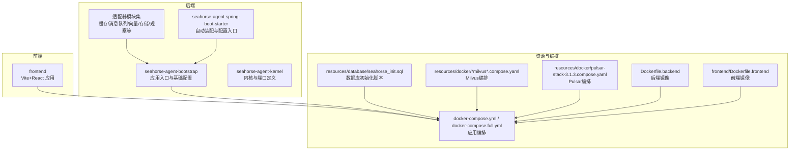
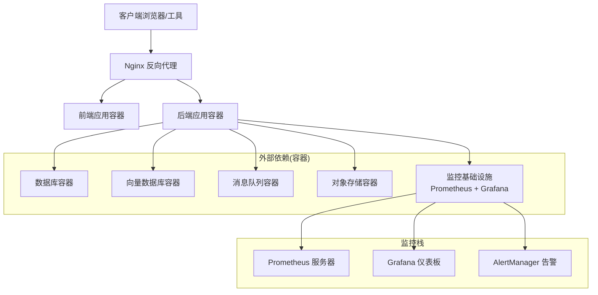
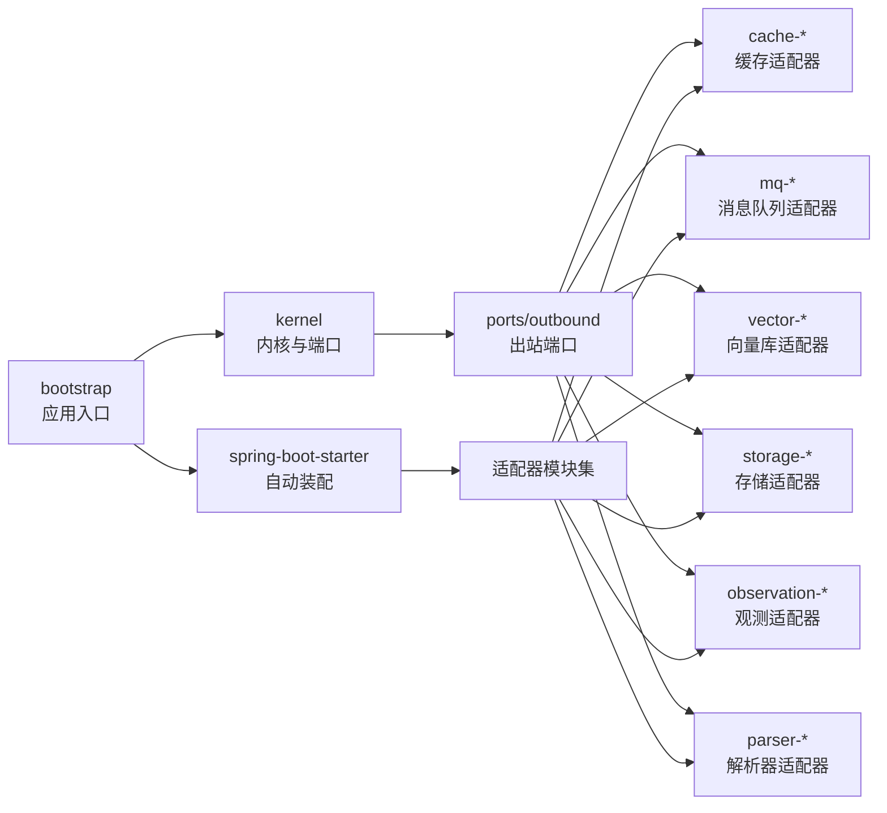

# 部署配置

<cite>
**本文引用的文件**
- [DEPLOY.md](file://DEPLOY.md)
- [Dockerfile.backend](file://Dockerfile.backend)
- [Dockerfile.frontend](file://frontend/Dockerfile.frontend)
- [docker-compose.yml](file://docker-compose.yml)
- [docker-compose.full.yml](file://docker-compose.full.yml)
- [deploy.sh](file://deploy.sh)
- [deploy.ps1](file://deploy.ps1)
- [application.properties](file://seahorse-agent-bootstrap/src/main/resources/application.properties)
- [application.properties](file://seahorse-agent-spring-boot-starter/src/main/resources/application.properties)
- [milvus-stack-2.6.6.compose.yaml](file://resources/docker/milvus-stack-2.6.6.compose.yaml)
- [pulsar-stack-3.1.3.compose.yaml](file://resources/docker/pulsar-stack-3.1.3.compose.yaml)
- [milvus-stack-2.5.8.compose.yaml](file://resources/docker/lightweight/milvus-stack-2.5.8.compose.yaml)
- [seahorse_init.sql](file://resources/database/seahorse_init.sql)
- [05-observability-v2-CHANGES.md](file://docs/aegis/plans/saas-mvp-impl/05-observability-v2-CHANGES.md)
- [健康检查.md](file://docs/zh/content/监控运维/健康检查.md)
- [SeahorseAgentMiddlewareHealthAutoConfiguration.java](file://seahorse-agent-spring-boot-starter/src/main/java/com/miracle/ai/seahorse/agent/adapters/spring/SeahorseAgentMiddlewareHealthAutoConfiguration.java)
</cite>

## 更新摘要
**所做更改**
- 新增监控基础设施现代化章节，重点介绍Prometheus和Grafana监控栈的可选部署方案
- 更新健康检查机制说明，包括Actuator健康检查端点和中间件健康指示器
- 新增独立网络配置和持久化存储的监控栈部署策略
- 更新环境变量配置，支持监控相关的配置项
- 新增监控指标采集和告警规则配置指南

## 目录
1. [简介](#简介)
2. [项目结构](#项目结构)
3. [核心组件](#核心组件)
4. [架构总览](#架构总览)
5. [详细组件分析](#详细组件分析)
6. [依赖关系分析](#依赖关系分析)
7. [性能考虑](#性能考虑)
8. [故障排查指南](#故障排查指南)
9. [结论](#结论)
10. [附录](#附录)

## 简介
本指南面向Seahorse Agent项目的部署与运维，覆盖从开发环境到生产环境的全生命周期：本地开发服务器配置、数据库与外部依赖（向量数据库、消息队列、对象存储）的本地化部署、Docker容器化与编排、Kubernetes集群部署要点、云平台部署建议、配置文件详解、性能调优、监控与日志、安全加固、部署自动化与CI/CD、以及故障排查与回滚策略。

**更新** 本次更新重点反映了部署基础设施现代化的变更，新增了完整的Prometheus和Grafana监控能力，包括独立网络配置、持久化存储、健康检查、环境变量配置等监控栈的详细说明。

## 项目结构
Seahorse Agent采用多模块Spring Boot工程，包含后端核心、适配器、前端、资源与部署脚本。关键部署相关目录与文件如下：
- 后端启动模块：seahorse-agent-bootstrap
- 多种适配器：缓存、消息队列、向量库、存储、观察、解析器等
- 前端：Vite + React，提供Docker镜像构建
- 资源：数据库初始化SQL、Docker Compose编排（Milvus、Pulsar）
- 部署：Dockerfile、docker-compose、Shell/PowerShell部署脚本、统一部署文档

**图表来源**
- [Dockerfile.backend](file://Dockerfile.backend)
- [docker-compose.yml](file://docker-compose.yml)
- [milvus-stack-2.6.6.compose.yaml](file://resources/docker/milvus-stack-2.6.6.compose.yaml)
- [pulsar-stack-3.1.3.compose.yaml](file://resources/docker/pulsar-stack-3.1.3.compose.yaml)

**章节来源**
- [DEPLOY.md](file://DEPLOY.md)
- [docker-compose.yml](file://docker-compose.yml)

## 核心组件
- 应用入口与配置
  - 后端启动模块提供Spring Boot入口与默认配置，便于在不同环境中加载相应属性。
  - 自动装配模块负责按需启用各适配器与功能模块。
- 外部依赖适配器
  - 缓存：本地缓存与Redis分布式缓存适配器。
  - 消息队列：Pulsar与直连消息队列适配器。
  - 向量库：Milvus与pgvector适配器；无实现适配器用于测试或占位。
  - 存储：本地与S3对象存储适配器。
  - 观察：Micrometer观测与空实现适配器。
  - 解析器：Apache Tika文档解析适配器。
- 前端
  - 提供独立Dockerfile与Nginx配置，支持容器化部署。
- 数据库
  - 提供初始化SQL脚本，用于首次部署时建立表结构与基础数据。
- **监控基础设施**
  - **新增** 健康检查机制：支持功能特性和中间件级别的健康检查，通过Actuator端点暴露。
  - **新增** Prometheus指标采集：通过Micrometer集成，支持多种指标类型和自定义指标。
  - **新增** Grafana可视化：可选的监控仪表板，提供丰富的图表和告警功能。

**章节来源**
- [application.properties](file://seahorse-agent-bootstrap/src/main/resources/application.properties)
- [application.properties](file://seahorse-agent-spring-boot-starter/src/main/resources/application.properties)
- [健康检查.md](file://docs/zh/content/监控运维/健康检查.md)
- [SeahorseAgentMiddlewareHealthAutoConfiguration.java](file://seahorse-agent-spring-boot-starter/src/main/java/com/miracle/ai/seahorse/agent/adapters/spring/SeahorseAgentMiddlewareHealthAutoConfiguration.java)

## 架构总览
下图展示Seahorse Agent在本地开发与容器化部署中的典型拓扑：前端通过反向代理对外提供服务，后端应用通过适配器连接数据库、向量库、消息队列与对象存储；外部依赖通过Docker Compose拉起。**更新** 新增监控基础设施的独立网络配置和健康检查机制。

**图表来源**
- [docker-compose.yml](file://docker-compose.yml)
- [milvus-stack-2.6.6.compose.yaml](file://resources/docker/milvus-stack-2.6.6.compose.yaml)
- [pulsar-stack-3.1.3.compose.yaml](file://resources/docker/pulsar-stack-3.1.3.compose.yaml)

## 详细组件分析

### 开发环境搭建
- 本地开发服务器
  - 使用Spring Boot启动模块，结合自动装配模块按需启用功能。
  - 通过环境变量或配置文件切换数据库、缓存、消息队列、向量库与存储的实现。
- 数据库连接设置
  - 初始化脚本提供表结构与基础数据，首次运行时由部署流程执行。
- 外部服务依赖本地化部署
  - 使用Docker Compose拉起数据库、向量库（Milvus）、消息队列（Pulsar）与对象存储（MinIO/S3兼容）。
  - 提供轻量版Milvus编排以满足开发场景。
- **监控基础设施本地化部署**
  - **新增** 使用独立的Docker Compose文件部署Prometheus和Grafana监控栈。
  - **新增** 配置独立的网络，确保监控组件与业务应用的隔离。
  - **新增** 持久化存储配置，保证监控数据的长期保存。

**章节来源**
- [seahorse_init.sql](file://resources/database/seahorse_init.sql)
- [milvus-stack-2.6.6.compose.yaml](file://resources/docker/milvus-stack-2.6.6.compose.yaml)
- [pulsar-stack-3.1.3.compose.yaml](file://resources/docker/pulsar-stack-3.1.3.compose.yaml)
- [milvus-stack-2.5.8.compose.yaml](file://resources/docker/lightweight/milvus-stack-2.5.8.compose.yaml)

### 生产环境部署策略
- Docker容器化部署
  - 后端镜像基于Dockerfile.backend构建，包含打包后的可执行JAR与JRE。
  - 前端镜像基于frontend/Dockerfile.frontend构建，使用Nginx提供静态资源服务。
  - docker-compose.yml与docker-compose.full.yml定义了应用与外部依赖的完整编排。
- Kubernetes集群部署
  - 建议拆分Deployment：后端应用、前端应用、数据库、向量库、消息队列、对象存储、**新增** 监控基础设施。
  - 使用ConfigMap/Secret管理配置与密钥；持久化卷用于数据库与对象存储。
  - 通过Service暴露服务，Ingress提供TLS终止与路由。
  - **新增** 监控组件独立部署，使用专用的命名空间和资源配额。
- 云平台部署方案
  - 数据库：使用云原生数据库服务（如RDS/Cloud SQL）。
  - 向量库：托管向量服务（如Cloud Vector Search）或自管Milvus。
  - 消息队列：托管Pulsar或其他云消息服务。
  - 对象存储：S3兼容存储（如OSS/COS/MinIO）。
  - 前端静态资源：CDN加速与边缘缓存。
  - **新增** 监控服务：可选择云原生监控服务或自建Prometheus + Grafana。

**章节来源**
- [Dockerfile.backend](file://Dockerfile.backend)
- [Dockerfile.frontend](file://frontend/Dockerfile.frontend)
- [docker-compose.yml](file://docker-compose.yml)
- [docker-compose.full.yml](file://docker-compose.full.yml)

### 配置文件说明
- 应用配置
  - application.properties位于启动模块与自动装配模块中，用于定义数据库连接、缓存、消息队列、向量库、存储、观测与解析器等适配器的启用与参数。
- 外部依赖配置
  - Milvus/Pulsar编排文件定义了容器间网络、端口映射、环境变量与持久化卷。
- 前端配置
  - 前端Dockerfile与Nginx配置用于容器化部署与静态资源服务。
- **监控配置**
  - **新增** Prometheus配置文件，定义抓取目标和规则。
  - **新增** Grafana配置文件，定义数据源和仪表板模板。
  - **新增** 健康检查配置，支持多层级的健康状态检测。

**章节来源**
- [application.properties](file://seahorse-agent-bootstrap/src/main/resources/application.properties)
- [application.properties](file://seahorse-agent-spring-boot-starter/src/main/resources/application.properties)
- [milvus-stack-2.6.6.compose.yaml](file://resources/docker/milvus-stack-2.6.6.compose.yaml)
- [pulsar-stack-3.1.3.compose.yaml](file://resources/docker/pulsar-stack-3.1.3.compose.yaml)
- [Dockerfile.frontend](file://frontend/Dockerfile.frontend)

### 性能调优配置
- JVM参数
  - 在容器启动命令或环境变量中设置堆大小、GC策略与线程参数，确保在Kubernetes中合理分配CPU与内存资源。
- 数据库连接池
  - 通过连接池参数（最大连接数、空闲超时、连接生命周期）优化吞吐与延迟。
- 缓存策略
  - 选择本地缓存或Redis，根据热点数据特征调整过期策略与淘汰算法。
- 向量检索
  - 调整索引类型、向量维度与查询并发度，结合批量插入与预聚合策略提升性能。
- 消息队列
  - 设置分区数量、批处理大小与重试策略，避免背压与重复消费。
- **监控性能优化**
  - **新增** Prometheus抓取间隔优化，平衡数据粒度与系统开销。
  - **新增** Grafana查询优化，使用缓存和索引提高图表渲染性能。
  - **新增** 指标采样策略，避免高基数指标导致的内存膨胀。

**章节来源**
- [application.properties](file://seahorse-agent-bootstrap/src/main/resources/application.properties)
- [application.properties](file://seahorse-agent-spring-boot-starter/src/main/resources/application.properties)

### 监控与日志配置
- 应用监控
  - 启用Micrometer观测适配器，采集指标并输出至Prometheus/Grafana。
  - **新增** 健康检查机制：支持功能特性和中间件级别的健康状态检测。
  - **新增** Actuator端点：提供/actuator/health和/actuator/prometheus等监控接口。
- 日志管理
  - 统一日志格式与级别，结合ELK/EFK进行集中采集与检索。
- 外部依赖可观测性
  - 为数据库、向量库、消息队列与对象存储配置健康检查与告警规则。
  - **新增** 监控栈健康检查：确保Prometheus、Grafana等监控组件的可用性。
- **监控栈部署**
  - **新增** 独立网络配置：监控组件与业务应用分离，提高安全性。
  - **新增** 持久化存储：配置数据卷确保监控数据的长期保存。
  - **新增** 健康检查：为所有监控组件配置健康检查和依赖关系。

**章节来源**
- [application.properties](file://seahorse-agent-spring-boot-starter/src/main/resources/application.properties)
- [健康检查.md](file://docs/zh/content/监控运维/健康检查.md)
- [SeahorseAgentMiddlewareHealthAutoConfiguration.java](file://seahorse-agent-spring-boot-starter/src/main/java/com/miracle/ai/seahorse/agent/adapters/spring/SeahorseAgentMiddlewareHealthAutoConfiguration.java)

### 安全配置指南
- SSL/TLS
  - 在反向代理层启用HTTPS，使用Let's Encrypt或企业CA签发证书。
- 防火墙与网络
  - 仅开放必要端口，内部服务通过命名空间/子网隔离。
  - **新增** 监控网络隔离：监控组件与业务应用使用独立的网络命名空间。
- 访问控制
  - 结合认证与授权机制，限制管理端口与敏感接口访问。
  - **新增** 监控访问控制：Grafana仪表板的用户权限管理和API访问限制。
- 密钥与机密
  - 使用Kubernetes Secret或云平台密钥管理服务存储数据库密码、第三方API密钥等。
  - **新增** 监控密钥管理：Prometheus抓取配置、Grafana数据源凭据的安全存储。

**章节来源**
- [DEPLOY.md](file://DEPLOY.md)

### 部署自动化与CI/CD
- 部署脚本
  - deploy.sh与deploy.ps1提供一键部署后端与前端镜像，并拉起编排服务。
  - **新增** 监控栈部署脚本，支持独立部署和集成部署两种模式。
- CI/CD流水线
  - 建议包含：代码检出、单元测试、构建镜像、推送仓库、编排部署、健康检查与回滚策略。
  - 在Kubernetes中使用Helm或Kustomize进行声明式部署。
  - **新增** 监控配置管理：CI/CD中自动注入监控配置和环境变量。

**章节来源**
- [deploy.sh](file://deploy.sh)
- [deploy.ps1](file://deploy.ps1)
- [docker-compose.yml](file://docker-compose.yml)

## 依赖关系分析
Seahorse Agent通过适配器模式解耦外部依赖，核心模块与适配器之间的关系如下：

**图表来源**
- [application.properties](file://seahorse-agent-spring-boot-starter/src/main/resources/application.properties)

**章节来源**
- [application.properties](file://seahorse-agent-spring-boot-starter/src/main/resources/application.properties)

## 性能考虑
- 连接池与并发
  - 数据库连接池参数直接影响事务吞吐；缓存命中率与过期策略影响响应时间。
- 向量检索优化
  - 索引类型与查询批大小需结合业务负载调优；批量写入与异步刷新降低写放大。
- 消息队列吞吐
  - 分区数与消费者并发度需平衡；幂等与去重策略减少重复处理。
- 前端性能
  - 静态资源压缩与缓存、CDN加速与边缘计算缩短首屏时间。
- **监控性能优化**
  - **新增** 指标采样和聚合策略，避免监控系统成为性能瓶颈。
  - **新增** 监控数据的生命周期管理，平衡存储成本和查询需求。

## 故障排查指南
- 健康检查失败
  - 检查数据库连接、向量库可达性、消息队列主题与权限、对象存储桶权限。
  - **新增** 检查监控组件的健康状态，包括Prometheus抓取状态和Grafana数据源连接。
- 启动异常
  - 查看应用日志与容器状态，确认JVM参数、配置文件路径与环境变量。
- 性能退化
  - 关注数据库慢查询、缓存未命中、向量库索引碎片与消息积压。
  - **新增** 监控系统自身的性能指标，如Prometheus内存使用和Grafana查询延迟。
- 回滚策略
  - 保留前一个版本镜像与配置；通过滚动更新回滚到上一个稳定版本；必要时恢复数据库快照。
  - **新增** 监控数据的备份和恢复策略，确保故障时能够快速恢复监控能力。

**章节来源**
- [DEPLOY.md](file://DEPLOY.md)

## 结论
本文提供了Seahorse Agent从开发到生产的完整部署配置指南，涵盖本地化依赖、容器化与编排、云平台部署、配置管理、性能调优、监控日志、安全加固、自动化与故障排查。**更新** 本次更新重点介绍了现代化的监控基础设施，包括可选的Prometheus和Grafana监控栈部署方案，以及独立网络配置、持久化存储、健康检查等完整的监控解决方案。建议在生产环境中结合自身基础设施选择合适的部署方式，并持续迭代优化。

## 附录
- 快速参考
  - 本地依赖：使用Docker Compose拉起数据库、Milvus、Pulsar与对象存储。
  - 容器化：后端与前端分别构建镜像并通过编排文件启动。
  - 生产部署：Kubernetes或云平台托管，配合CI/CD与监控告警体系。
  - 配置项：在application.properties中启用/禁用适配器并设置参数。
  - 脚本：使用deploy.sh/deploy.ps1完成一键部署。
  - **新增** 监控部署：支持独立部署监控栈或集成部署到现有环境。