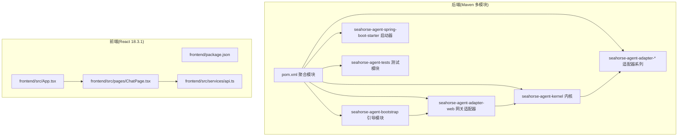
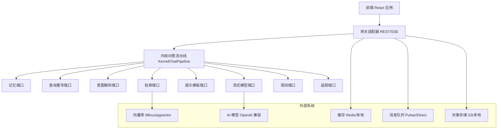
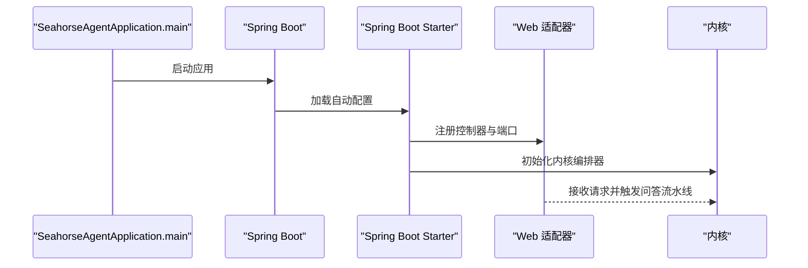
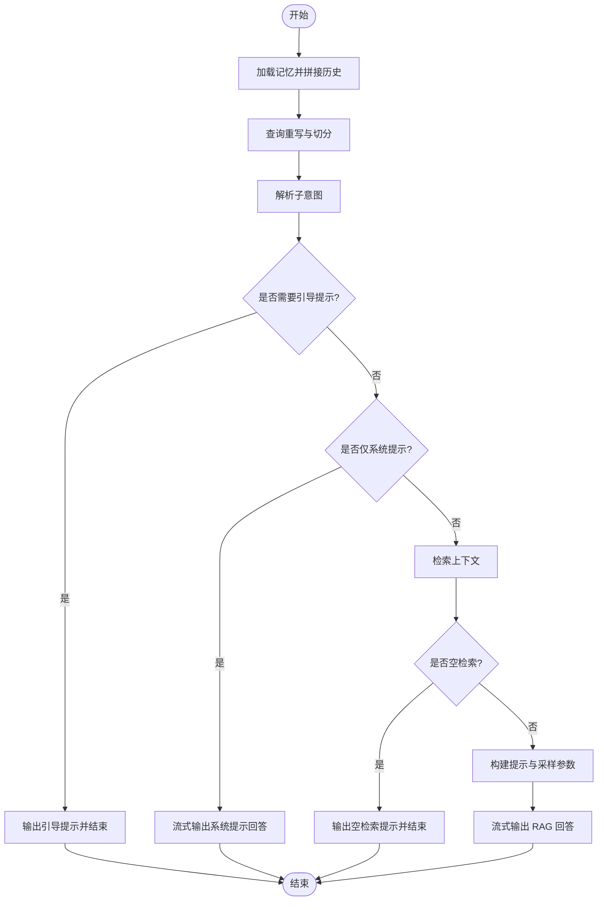
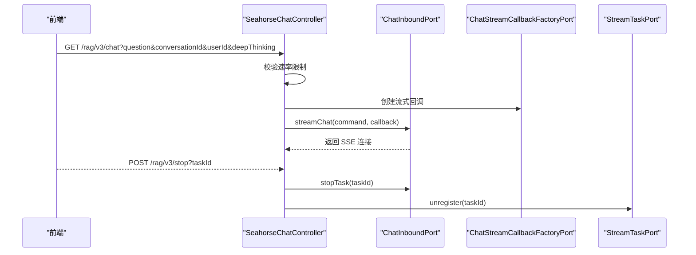
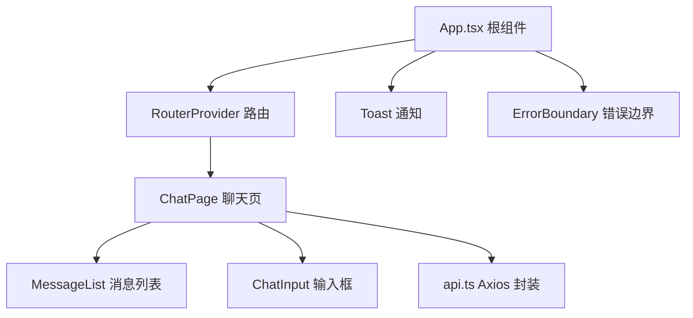
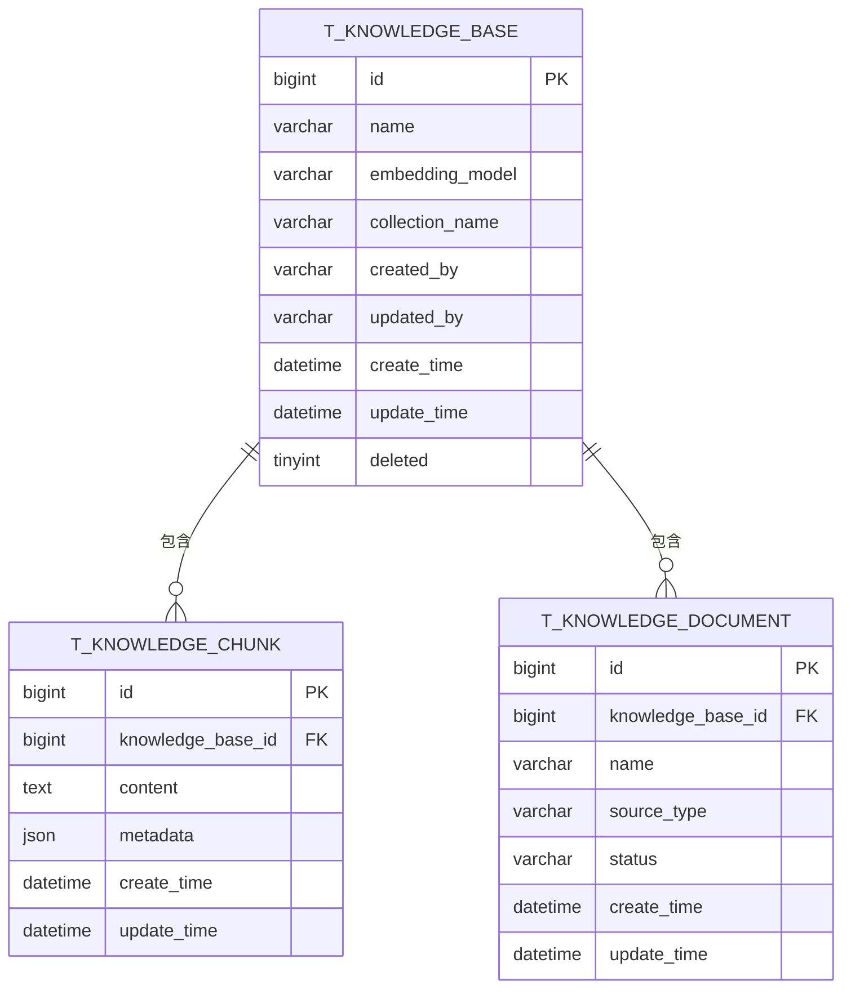
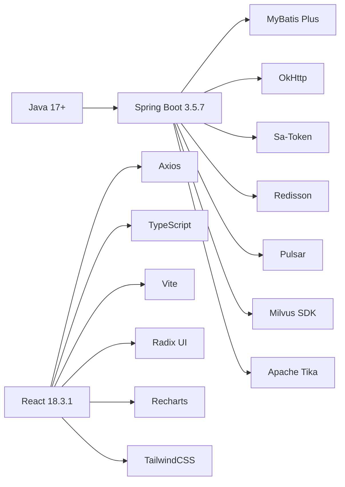

# 项目概述

<cite>
**本文档引用的文件**
- [pom.xml](file://pom.xml)
- [SeahorseAgentApplication.java](file://seahorse-agent-bootstrap/src/main/java/com/miracle/ai/seahorse/agent/SeahorseAgentApplication.java)
- [KernelChatPipeline.java](file://seahorse-agent-kernel/src/main/java/com/miracle/ai/seahorse/agent/kernel/application/chat/KernelChatPipeline.java)
- [ChatRequest.java](file://seahorse-agent-kernel/src/main/java/com/miracle/ai/seahorse/agent/kernel/domain/chat/ChatRequest.java)
- [SeahorseChatController.java](file://seahorse-agent-adapter-web/src/main/java/com/miracle/ai/seahorse/agent/adapters/web/SeahorseChatController.java)
- [App.tsx](file://frontend/src/App.tsx)
- [package.json](file://frontend/package.json)
- [milvus-stack-2.6.6.compose.yaml](file://resources/docker/milvus-stack-2.6.6.compose.yaml)
- [application.properties](file://seahorse-agent-spring-boot-starter/src/main/resources/application.properties)
- [rag-baseline.json](file://docs/performance/rag-baseline.json)
- [ChatPage.tsx](file://frontend/src/pages/ChatPage.tsx)
- [api.ts](file://frontend/src/services/api.ts)
- [schema_table.sql](file://resources/database/backups/schema_table.sql)
</cite>

## 目录
1. [引言](#引言)
2. [项目结构](#项目结构)
3. [核心组件](#核心组件)
4. [架构总览](#架构总览)
5. [详细组件分析](#详细组件分析)
6. [依赖关系分析](#依赖关系分析)
7. [性能考量](#性能考量)
8. [故障排查指南](#故障排查指南)
9. [结论](#结论)
10. [附录](#附录)

## 引言
Seahorse Agent 是一个基于 Spring Boot 的 RAG（检索增强生成）智能体系统，专注于构建企业级智能问答与知识管理平台。项目通过模块化设计与端口适配器架构，实现了从数据接入、知识入库、检索增强到流式对话的完整链路；同时集成了向量数据库，支持多知识库、多来源文档的统一检索与增强生成，提供智能问答、知识库管理、会话记忆、深度思考等核心能力。前端采用 React 18.3.1 与 Vite 构建，提供现代化的交互体验。

本项目旨在帮助初学者快速理解 RAG 与智能体系统的工程化落地方式，同时为有经验的开发者提供可扩展、可维护的参考架构与最佳实践。

## 项目结构
项目采用多模块 Maven 结构，后端以 seahorse-agent 为核心聚合模块，按功能拆分为内核(kernel)、适配器(adapter)、引导(bootstrap)、启动器(starter)、测试(tests)等子模块；前端位于独立的 frontend 目录，采用 React 18.3.1 + TypeScript + Vite 技术栈。

**图表来源**
- [pom.xml:37-60](file://pom.xml#L37-L60)
- [SeahorseAgentApplication.java:30-36](file://seahorse-agent-bootstrap/src/main/java/com/miracle/ai/seahorse/agent/SeahorseAgentApplication.java#L30-L36)
- [package.json:1-70](file://frontend/package.json#L1-L70)

**章节来源**
- [pom.xml:1-262](file://pom.xml#L1-L262)
- [SeahorseAgentApplication.java:24-37](file://seahorse-agent-bootstrap/src/main/java/com/miracle/ai/seahorse/agent/SeahorseAgentApplication.java#L24-L37)
- [package.json:1-70](file://frontend/package.json#L1-L70)

## 核心组件
- 后端内核(kernel): 定义 RAG 主流程编排、意图解析、检索上下文构建、流式响应等核心域模型与应用服务，确保业务逻辑的稳定性与可测试性。
- 网关适配器(adapter-web): 提供 REST 接口与 SSE 流式输出，负责速率限制、任务生命周期管理与用户鉴权。
- 适配器(adapter-*): 覆盖 AI 模型、向量库、缓存、消息队列、对象存储、文档解析、Feishu 文档源等外部系统对接，遵循端口适配器模式，便于替换与扩展。
- 引导模块(bootstrap): Spring Boot 启动入口，启用调度与命名空间扫描。
- 启动器(starter): 自动装配内核与适配器，简化集成。
- 前端(frontend): React 应用，提供聊天界面、会话管理、知识库管理、仪表盘等页面与服务封装。

**章节来源**
- [KernelChatPipeline.java:45-106](file://seahorse-agent-kernel/src/main/java/com/miracle/ai/seahorse/agent/kernel/application/chat/KernelChatPipeline.java#L45-L106)
- [SeahorseChatController.java:40-102](file://seahorse-agent-adapter-web/src/main/java/com/miracle/ai/seahorse/agent/adapters/web/SeahorseChatController.java#L40-L102)
- [SeahorseAgentApplication.java:24-36](file://seahorse-agent-bootstrap/src/main/java/com/miracle/ai/seahorse/agent/SeahorseAgentApplication.java#L24-L36)

## 架构总览
系统采用“前后端分离 + 端口适配器 + 模块化”的设计理念：
- 控制层通过 REST + SSE 将前端请求转化为内核的流式问答上下文；
- 内核负责加载记忆、重写查询、解析意图、检索上下文、构建提示并流式输出；
- 适配器层解耦外部系统（向量库、AI 模型、缓存、消息队列等），通过 SPI 注册与自动装配；
- 数据持久化采用 PostgreSQL，向量存储可选 Milvus 或 pgvector；
- 前端通过 Axios 统一封装 API 请求，内置鉴权与错误处理。

**图表来源**
- [KernelChatPipeline.java:62-106](file://seahorse-agent-kernel/src/main/java/com/miracle/ai/seahorse/agent/kernel/application/chat/KernelChatPipeline.java#L62-L106)
- [SeahorseChatController.java:48-81](file://seahorse-agent-adapter-web/src/main/java/com/miracle/ai/seahorse/agent/adapters/web/SeahorseChatController.java#L48-L81)
- [milvus-stack-2.6.6.compose.yaml:52-79](file://resources/docker/milvus-stack-2.6.6.compose.yaml#L52-L79)

## 详细组件分析

### 后端启动与运行时配置
- 启动类启用调度与命名空间扫描，确保内核与适配器在指定包下被正确发现与装配。
- 启动器默认内核模式，便于在不同部署形态下切换运行模式。

**图表来源**
- [SeahorseAgentApplication.java:30-36](file://seahorse-agent-bootstrap/src/main/java/com/miracle/ai/seahorse/agent/SeahorseAgentApplication.java#L30-L36)
- [application.properties:1-2](file://seahorse-agent-spring-boot-starter/src/main/resources/application.properties#L1-L2)

**章节来源**
- [SeahorseAgentApplication.java:24-37](file://seahorse-agent-bootstrap/src/main/java/com/miracle/ai/seahorse/agent/SeahorseAgentApplication.java#L24-L37)
- [application.properties:1-2](file://seahorse-agent-spring-boot-starter/src/main/resources/application.properties#L1-L2)

### 流式问答流水线（KernelChatPipeline）
- 严格遵循“加载记忆 → 查询重写 → 解析意图 → 引导提示 → 系统仅回答 → 检索 → 空检索处理 → 流式 RAG 响应”的执行顺序；
- 支持系统提示与工具/知识库混合回答，温度与采样参数根据检索来源动态调整；
- 通过追踪记录每个阶段耗时，便于性能分析与优化。

**图表来源**
- [KernelChatPipeline.java:83-106](file://seahorse-agent-kernel/src/main/java/com/miracle/ai/seahorse/agent/kernel/application/chat/KernelChatPipeline.java#L83-L106)
- [KernelChatPipeline.java:167-173](file://seahorse-agent-kernel/src/main/java/com/miracle/ai/seahorse/agent/kernel/application/chat/KernelChatPipeline.java#L167-L173)

**章节来源**
- [KernelChatPipeline.java:45-106](file://seahorse-agent-kernel/src/main/java/com/miracle/ai/seahorse/agent/kernel/application/chat/KernelChatPipeline.java#L45-L106)
- [KernelChatPipeline.java:167-236](file://seahorse-agent-kernel/src/main/java/com/miracle/ai/seahorse/agent/kernel/application/chat/KernelChatPipeline.java#L167-L236)

### 网关控制器（SeahorseChatController）
- 提供 GET /rag/v3/chat 的 SSE 流式问答接口，POST /rag/v3/stop 停止任务；
- 支持用户 ID、会话 ID、深度思考开关等参数；
- 集成速率限制与 SSE 超时配置，保障服务稳定性。

**图表来源**
- [SeahorseChatController.java:83-102](file://seahorse-agent-adapter-web/src/main/java/com/miracle/ai/seahorse/agent/adapters/web/SeahorseChatController.java#L83-L102)
- [SeahorseChatController.java:104-109](file://seahorse-agent-adapter-web/src/main/java/com/miracle/ai/seahorse/agent/adapters/web/SeahorseChatController.java#L104-L109)

**章节来源**
- [SeahorseChatController.java:40-133](file://seahorse-agent-adapter-web/src/main/java/com/miracle/ai/seahorse/agent/adapters/web/SeahorseChatController.java#L40-L133)

### 前端应用与页面
- 应用根组件通过路由提供器挂载，全局错误边界与通知组件贯穿；
- 聊天页负责会话拉取、选择与创建，消息列表与输入框组件化；
- API 服务封装基础 URL、鉴权头注入与统一错误处理。

**图表来源**
- [App.tsx:7-14](file://frontend/src/App.tsx#L7-L14)
- [ChatPage.tsx:81-101](file://frontend/src/pages/ChatPage.tsx#L81-L101)
- [api.ts:8-19](file://frontend/src/services/api.ts#L8-L19)

**章节来源**
- [App.tsx:1-15](file://frontend/src/App.tsx#L1-L15)
- [ChatPage.tsx:1-103](file://frontend/src/pages/ChatPage.tsx#L1-L103)
- [api.ts:1-66](file://frontend/src/services/api.ts#L1-L66)

### 数据模型与持久化
- PostgreSQL 表结构包含知识库、知识块、知识文档等核心实体，支持唯一约束与索引；
- 向量存储可选 Milvus 或 pgvector，结合对象存储与消息队列实现完整的 ingesting 与检索链路。

**图表来源**
- [schema_table.sql:141-159](file://resources/database/backups/schema_table.sql#L141-L159)

**章节来源**
- [schema_table.sql:141-159](file://resources/database/backups/schema_table.sql#L141-L159)

## 依赖关系分析
- 技术栈选择：
  - 后端：Java 17+、Spring Boot 3.5.7、MyBatis Plus、OkHttp、Sa-Token、Redisson、Pulsar、Milvus SDK、Apache Tika 等；
  - 前端：React 18.3.1、TypeScript、Vite、Axios、Radix UI、Recharts、TailwindCSS 等；
  - 数据与中间件：PostgreSQL、Milvus、Pulsar、Redis、S3 兼容对象存储。
- 模块间依赖：
  - bootstrap 依赖 adapter-web 与 kernel；
  - adapter-web 依赖 kernel 并暴露 REST 接口；
  - 各 adapter 通过 SPI 与 starter 自动装配。

**图表来源**
- [pom.xml:15-35](file://pom.xml#L15-L35)
- [package.json:13-47](file://frontend/package.json#L13-L47)

**章节来源**
- [pom.xml:15-35](file://pom.xml#L15-L35)
- [package.json:13-47](file://frontend/package.json#L13-L47)

## 性能考量
- 性能基线指标覆盖首次 Token 时间、总耗时、检索耗时、多通道检索、MCP 编排、内存加载、模型路由与文档 ingesting 等关键环节；
- 通过 p95/p99 分位数评估尾延迟，指导容量规划与资源优化；
- 建议在生产环境中结合追踪与观测端口进行持续监控与回归测试。

**章节来源**
- [rag-baseline.json:1-53](file://docs/performance/rag-baseline.json#L1-L53)

## 故障排查指南
- 前端错误处理：
  - 统一拦截响应中的业务错误码，对未登录场景自动清空鉴权并跳转登录；
  - 网络错误与通用异常通过通知组件提示用户。
- 后端速率限制：
  - 控制器内置速率限制与 SSE 超时配置，避免过载；
  - 可通过配置项调整许可数量与窗口大小。
- 向量库与对象存储：
  - Docker 编排示例提供 Milvus 单机版与 RustFS 对象存储组合，便于本地验证；
  - 建议在生产中使用高可用集群与 S3 兼容服务。

**章节来源**
- [api.ts:29-65](file://frontend/src/services/api.ts#L29-L65)
- [SeahorseChatController.java:125-131](file://seahorse-agent-adapter-web/src/main/java/com/miracle/ai/seahorse/agent/adapters/web/SeahorseChatController.java#L125-L131)
- [milvus-stack-2.6.6.compose.yaml:52-79](file://resources/docker/milvus-stack-2.6.6.compose.yaml#L52-L79)

## 结论
Seahorse Agent 以端口适配器与模块化设计为核心，构建了可插拔、可扩展的 RAG 智能体平台。后端通过内核编排保证问答链路的稳定性与可观测性，前端提供直观易用的交互界面。配合 PostgreSQL、Milvus/pgvector、Pulsar、Redis 等基础设施，项目既适合教学与原型开发，也具备工程化落地的坚实基础。

## 附录
- 版本信息：后端 Spring Boot 版本 3.5.7，前端 React 版本 18.3.1，向量库 Milvus 版本 2.6.6；
- 开源协议：Apache License 2.0；
- 发展路线图：建议后续完善插件生态、可观测性增强、多租户与权限体系、自动化性能回归与 A/B 实验能力。