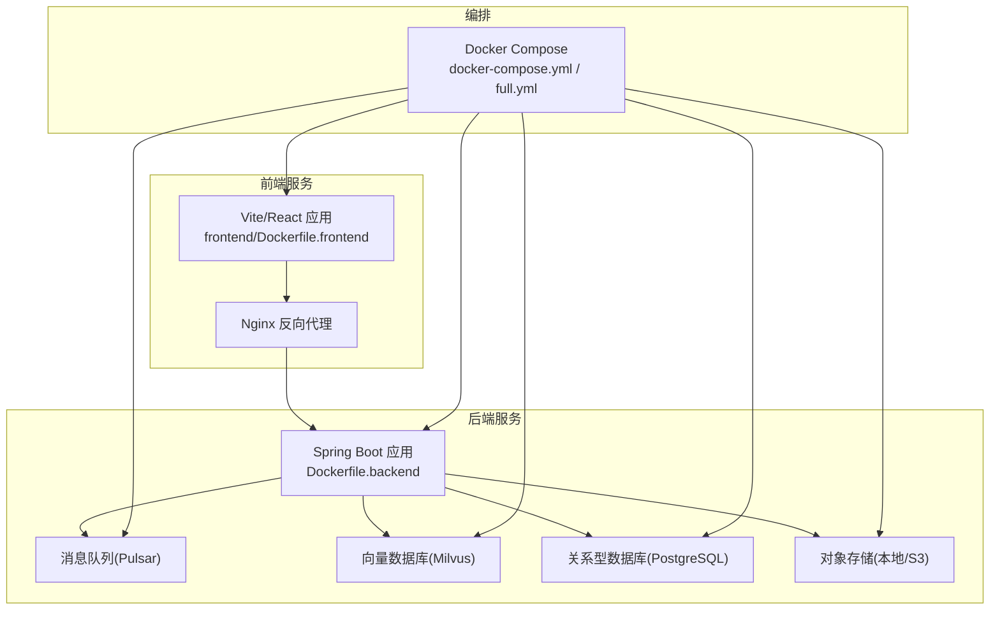
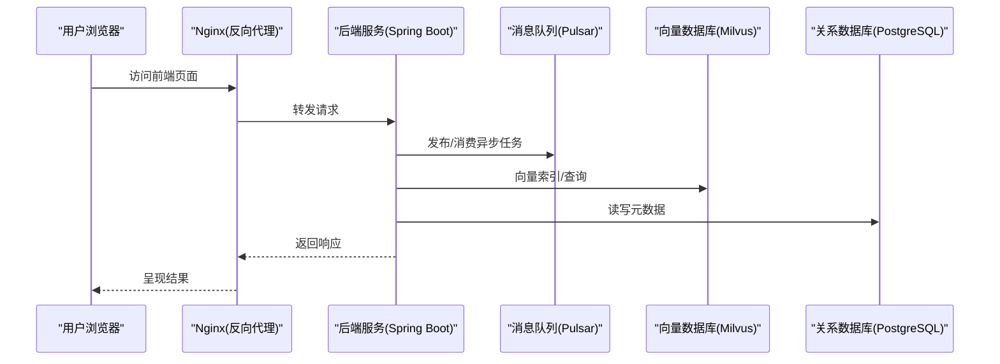
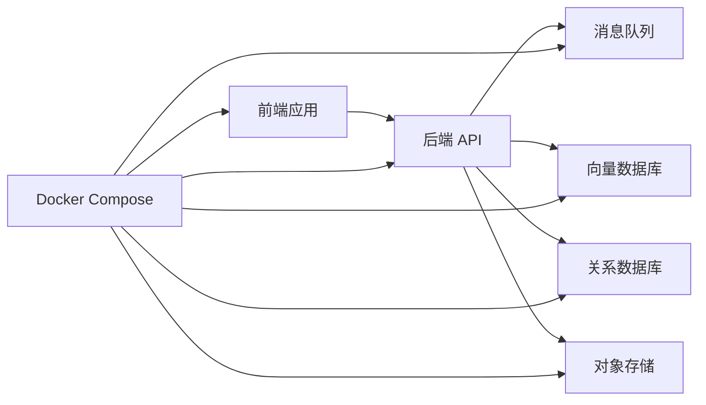

# 快速开始

<cite>
**本文引用的文件**   
- [README.md](file://README.md)
- [DEPLOY.md](file://DEPLOY.md)
- [docker-compose.yml](file://docker-compose.yml)
- [docker-compose.full.yml](file://docker-compose.full.yml)
- [Dockerfile.backend](file://Dockerfile.backend)
- [frontend/Dockerfile.frontend](file://frontend/Dockerfile.frontend)
- [resources/database/seahorse_init.sql](file://resources/database/seahorse_init.sql)
- [docs/zh/content/快速开始.md](file://docs/zh/content/快速开始.md)
- [docs/zh/content/部署配置/README.md](file://docs/zh/content/部署配置/README.md)
- [docs/zh/content/API 接口文档/README.md](file://docs/zh/content/API 接口文档/README.md)
- [frontend/package.json](file://frontend/package.json)
- [frontend/vite.config.js](file://frontend/vite.config.js)
- [frontend/src/services/knowledgeService.ts](file://frontend/src/services/knowledgeService.ts)
- [frontend/src/services/ingestionService.ts](file://frontend/src/services/ingestionService.ts)
- [frontend/src/services/chatService.ts](file://frontend/src/services/chatService.ts)
- [frontend/src/pages/ChatPage.tsx](file://frontend/src/pages/ChatPage.tsx)
- [frontend/src/pages/MemoryCenterPage.tsx](file://frontend/src/pages/MemoryCenterPage.tsx)
- [frontend/src/services/api.ts](file://frontend/src/services/api.ts)
</cite>

## 目录
1. [简介](#简介)
2. [项目结构](#项目结构)
3. [核心组件](#核心组件)
4. [架构总览](#架构总览)
5. [详细组件分析](#详细组件分析)
6. [依赖分析](#依赖分析)
7. [性能考虑](#性能考虑)
8. [故障排除指南](#故障排除指南)
9. [结论](#结论)
10. [附录](#附录)

## 简介
本指南面向首次接触 Seahorse Agent 的用户，帮助你在约 30 分钟内完成从环境准备到本地运行的全流程。内容涵盖 JDK 17、Node.js、Docker 等必备软件安装与配置；项目克隆、依赖安装与数据库初始化；以及通过 Docker Compose 一键部署的完整步骤（含配置修改与容器启动验证）。最后提供基础使用示例：创建知识库、上传文档、发起问答等核心功能演示，并给出常见问题与故障排除建议。

## 项目结构
Seahorse Agent 采用前后端分离架构，后端基于 Spring Boot，前端基于 Vite + React。项目提供多套 Docker Compose 配置以适配不同运行场景，同时包含数据库初始化脚本与部署相关文档。

**图表来源**
- [docker-compose.yml](file://docker-compose.yml)
- [docker-compose.full.yml](file://docker-compose.full.yml)
- [Dockerfile.backend](file://Dockerfile.backend)
- [frontend/Dockerfile.frontend](file://frontend/Dockerfile.frontend)

**章节来源**
- [docker-compose.yml](file://docker-compose.yml)
- [docker-compose.full.yml](file://docker-compose.full.yml)
- [Dockerfile.backend](file://Dockerfile.backend)
- [frontend/Dockerfile.frontend](file://frontend/Dockerfile.frontend)

## 核心组件
- 后端应用：Spring Boot 启动器，提供知识库管理、文档解析与入库、RAG 对话、任务调度等能力。
- 前端应用：聊天界面、知识中心、管理后台等页面，通过服务层调用后端 API。
- 消息中间件：Pulsar，用于异步任务与事件分发。
- 向量数据库：Milvus，用于语义检索与相似度搜索。
- 关系数据库：PostgreSQL，用于元数据与业务数据持久化。
- 对象存储：支持本地或 S3，用于文档与附件存储。
- 编排工具：Docker Compose，一键拉起所有服务。

**章节来源**
- [docker-compose.yml](file://docker-compose.yml)
- [docker-compose.full.yml](file://docker-compose.full.yml)
- [resources/database/seahorse_init.sql](file://resources/database/seahorse_init.sql)

## 架构总览
下图展示了从浏览器到后端服务、再到消息队列、向量库与数据库的数据流路径，以及 Docker Compose 的编排关系。

**图表来源**
- [docker-compose.yml](file://docker-compose.yml)
- [frontend/Dockerfile.frontend](file://frontend/Dockerfile.frontend)
- [Dockerfile.backend](file://Dockerfile.backend)

## 详细组件分析

### 环境准备与安装
- JDK 17：用于构建与运行后端服务。请确保 JAVA_HOME 正确指向 JDK 17 安装目录，并在 PATH 中可用。
- Node.js：用于前端构建与开发。推荐使用 LTS 版本，确保 npm/yarn 可用。
- Docker 与 Docker Compose：用于一键部署。请先安装 Docker Engine，再安装 Compose 插件或独立可执行文件。

提示：若需在 Windows 上使用 WSL2，请确保 Docker Desktop 已启用并正确挂载文件系统。

**章节来源**
- [README.md](file://README.md)
- [docs/zh/content/快速开始.md](file://docs/zh/content/快速开始.md)

### 克隆项目与基础依赖
- 使用 Git 克隆仓库到本地。
- 进入项目根目录，确认 Maven Wrapper 可用（Windows 使用 mvnw.cmd）。
- 如需本地编译后端，请先安装 JDK 17 并设置环境变量。
- 前端依赖安装：进入 frontend 目录，使用 npm/yarn 安装依赖。

注意：若网络受限，可配置 npm/yarn 的镜像源以提升安装速度。

**章节来源**
- [README.md](file://README.md)
- [frontend/package.json](file://frontend/package.json)

### 数据库初始化
- 项目提供初始化 SQL 脚本，位于 resources/database/seahorse_init.sql。
- 在启动后端服务前，确保 PostgreSQL 已启动且可连接。
- 执行初始化脚本以创建所需表结构与基础数据。

提示：如使用 Docker Compose，数据库容器会自动初始化，无需手动执行脚本。

**章节来源**
- [resources/database/seahorse_init.sql](file://resources/database/seahorse_init.sql)
- [docker-compose.yml](file://docker-compose.yml)

### Docker Compose 一键部署
- 选择合适的 Compose 文件：
  - docker-compose.yml：轻量版，适合开发与测试。
  - docker-compose.full.yml：完整版，包含更多组件与配置项。
- 修改环境变量与端口映射（如需），确保与宿主机不冲突。
- 在项目根目录执行 docker compose up -d，等待所有容器启动。
- 验证服务状态：查看各容器日志，确认无报错；访问前端页面与后端 API 文档接口。

提示：首次启动可能需要下载镜像，耗时较长；可在网络良好的环境下提前 pull 镜像。

**章节来源**
- [docker-compose.yml](file://docker-compose.yml)
- [docker-compose.full.yml](file://docker-compose.full.yml)
- [DEPLOY.md](file://DEPLOY.md)

### 基础使用示例
以下示例基于前端页面与服务层封装，展示从创建知识库到发起问答的完整流程。

#### 创建知识库
- 登录前端管理后台，进入“知识中心”页面。
- 点击“新建知识库”，填写名称与描述，提交后返回列表。
- 记录知识库 ID，后续上传文档与问答均需该 ID。

**章节来源**
- [frontend/src/pages/MemoryCenterPage.tsx](file://frontend/src/pages/MemoryCenterPage.tsx)
- [frontend/src/services/knowledgeService.ts](file://frontend/src/services/knowledgeService.ts)

#### 上传文档
- 在知识库详情页，点击“上传文档”按钮。
- 选择本地 PDF/Word 等支持格式文件，等待解析与入库完成。
- 查看解析进度与状态，确认成功后再进行检索。

**章节来源**
- [frontend/src/services/ingestionService.ts](file://frontend/src/services/ingestionService.ts)

#### 发起问答
- 切换至聊天页面，输入问题并提交。
- 后端将根据知识库内容进行检索与生成，返回答案。
- 若无满意答案，可调整问题或补充更多文档。

**章节来源**
- [frontend/src/pages/ChatPage.tsx](file://frontend/src/pages/ChatPage.tsx)
- [frontend/src/services/chatService.ts](file://frontend/src/services/chatService.ts)

### API 接口参考
- 前端通过统一的 API 封装调用后端接口，包括知识库、文档解析、对话等模块。
- 可在部署完成后访问后端 API 文档页面，查看具体接口定义与参数说明。

**章节来源**
- [docs/zh/content/API 接口文档/README.md](file://docs/zh/content/API 接口文档/README.md)
- [frontend/src/services/api.ts](file://frontend/src/services/api.ts)

## 依赖分析
- 后端依赖：Spring Boot、消息队列(Pulsar)、向量数据库(Milvus)、关系数据库(PostgreSQL)、对象存储(本地/S3)。
- 前端依赖：Vite、React、TailwindCSS、TypeScript 等。
- 编排依赖：Docker、Docker Compose。

**图表来源**
- [docker-compose.yml](file://docker-compose.yml)
- [frontend/Dockerfile.frontend](file://frontend/Dockerfile.frontend)
- [Dockerfile.backend](file://Dockerfile.backend)

**章节来源**
- [docker-compose.yml](file://docker-compose.yml)
- [frontend/package.json](file://frontend/package.json)

## 性能考虑
- 向量索引与检索：合理设置 Milvus 的分区与副本，避免单点瓶颈。
- 消息队列：根据吞吐量调整 Pulsar 的分区数与消费者并发。
- 数据库：为高频查询字段建立索引，定期维护统计信息。
- 前端缓存：利用浏览器缓存与服务端缓存减少重复请求。
- 容器资源：为各服务分配合理的 CPU/内存限制，避免资源争抢。

## 故障排除指南
- 无法访问前端页面
  - 检查 Nginx 是否正常启动，端口是否被占用。
  - 确认后端服务已就绪，跨域配置是否正确。
- 后端服务启动失败
  - 查看容器日志，定位数据库连接、消息队列连通性等问题。
  - 确认环境变量（如数据库地址、密钥）已正确配置。
- 文档上传失败
  - 检查对象存储权限与路径配置。
  - 确认解析服务可用，网络可达。
- Milvus 或 Pulsar 异常
  - 查看对应容器日志，确认版本兼容性与资源限制。
  - 适当增大堆内存或磁盘空间。
- 数据库初始化异常
  - 确认 PostgreSQL 已启动并接受连接。
  - 手动执行初始化脚本，检查权限与字符集设置。

**章节来源**
- [docker-compose.yml](file://docker-compose.yml)
- [resources/database/seahorse_init.sql](file://resources/database/seahorse_init.sql)

## 结论
通过本指南，你可以在 30 分钟内完成环境准备、项目部署与基础功能验证。建议在本地成功运行后，逐步调整配置与扩展组件，以满足更复杂的业务需求。遇到问题时，优先查看容器日志与初始化脚本输出，结合本指南的故障排除建议进行定位与修复。

## 附录
- 快速开始文档：docs/zh/content/快速开始.md
- 部署配置文档：docs/zh/content/部署配置/README.md
- API 接口文档：docs/zh/content/API 接口文档/README.md