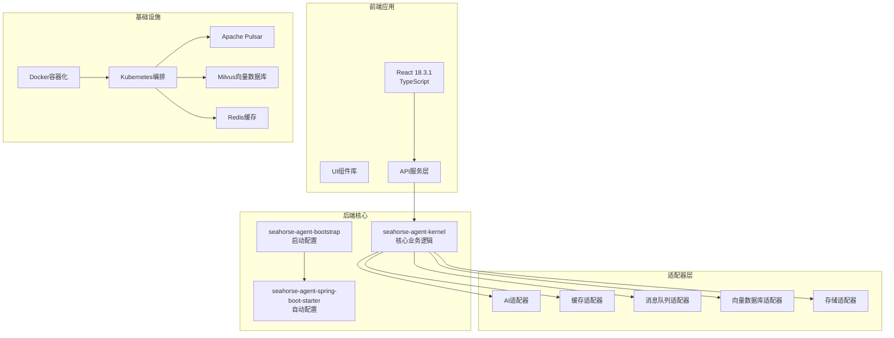
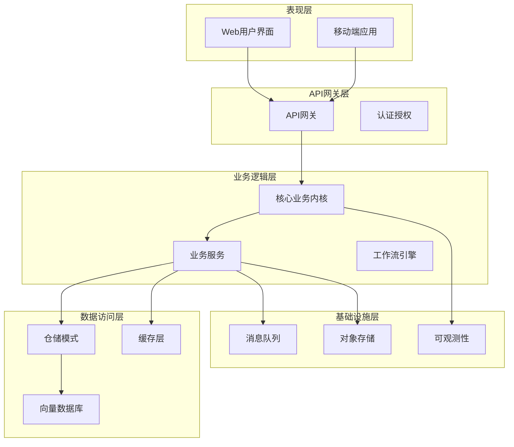
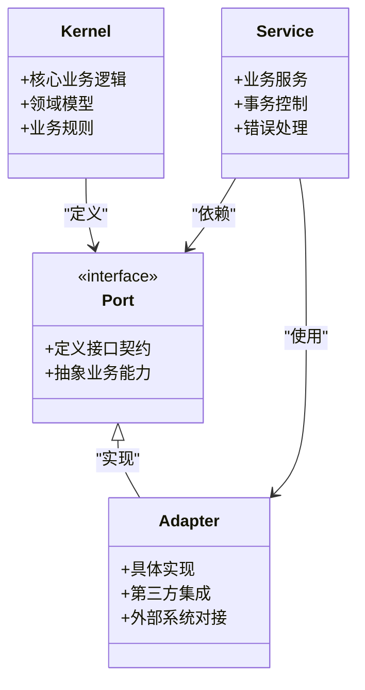
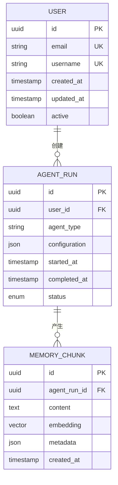
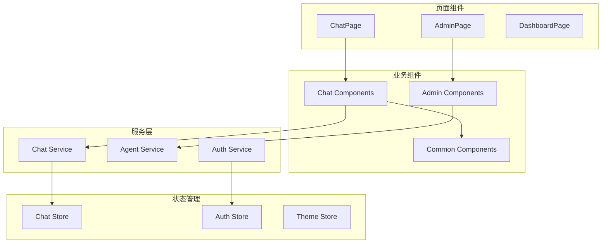
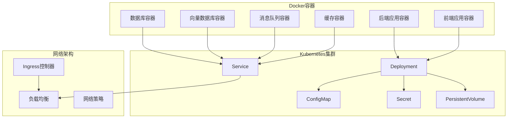
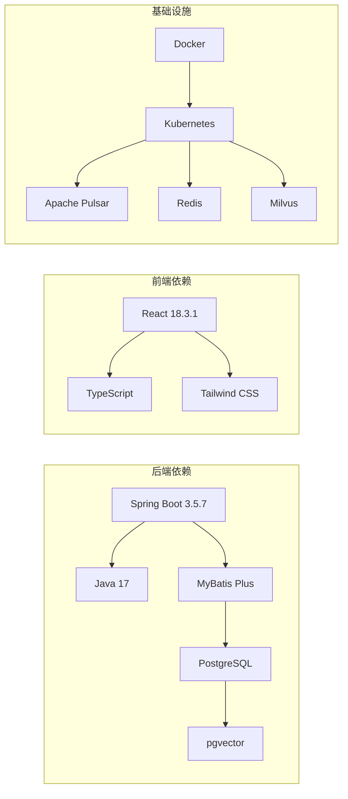

# 技术栈概览

<cite>
**本文档引用的文件**
- [pom.xml](file://pom.xml)
- [Dockerfile.backend](file://Dockerfile.backend)
- [Dockerfile.frontend](file://frontend/Dockerfile.frontend)
- [docker-compose.yml](file://docker-compose.yml)
- [docker-compose.full.yml](file://docker-compose.full.yml)
- [application.properties](file://seahorse-agent-bootstrap/src/main/resources/application.properties)
- [package.json](file://frontend/package.json)
- [tailwind.config.cjs](file://frontend/tailwind.config.cjs)
- [vite.config.js](file://frontend/vite.config.js)
- [milvus-stack-2.6.6.compose.yaml](file://resources/docker/milvus-stack-2.6.6.compose.yaml)
- [pulsar-stack-3.1.3.compose.yaml](file://resources/docker/pulsar-stack-3.1.3.compose.yaml)
- [seahorse_init.sql](file://resources/database/seahorse_init.sql)
</cite>

## 目录
1. [引言](#引言)
2. [项目结构](#项目结构)
3. [核心组件](#核心组件)
4. [架构概览](#架构概览)
5. [详细组件分析](#详细组件分析)
6. [依赖分析](#依赖分析)
7. [性能考虑](#性能考虑)
8. [故障排除指南](#故障排除指南)
9. [结论](#结论)
10. [附录](#附录)

## 引言

Seahorse Agent项目采用现代化全栈技术架构，构建企业级AI智能体平台。该项目展现了从后端微服务到前端交互界面的完整技术栈体系，包括Spring Boot 3.5.7 + Java 17的后端技术栈、React 18.3.1 + TypeScript的前端技术栈，以及基于Docker和Kubernetes的容器化部署架构。

该技术栈的选择体现了现代企业应用开发的最佳实践：后端采用高性能的Java生态，前端使用类型安全的TypeScript，数据库结合传统关系型数据和向量数据库，消息队列采用Apache Pulsar的高性能分布式消息系统，存储层支持本地和云存储等多种方案。

## 项目结构

项目采用多模块Maven架构，清晰分离了核心内核、适配器层和Web接口层：

**图表来源**
- [pom.xml](file://pom.xml)
- [Dockerfile.backend](file://Dockerfile.backend)
- [Dockerfile.frontend](file://frontend/Dockerfile.frontend)

**章节来源**
- [pom.xml](file://pom.xml)
- [docker-compose.yml](file://docker-compose.yml)

## 核心组件

### 后端技术栈

#### Spring Boot 3.5.7 + Java 17
后端采用最新的Spring Boot 3.5.7版本，充分利用Java 17的性能优化和新特性。项目采用模块化架构，通过多个适配器实现不同技术栈的解耦。

#### MyBatis Plus数据访问
使用MyBatis Plus简化数据库操作，提供强大的CRUD能力和灵活的查询条件构造。支持多种数据库适配器，包括JDBC和pgvector向量数据库。

#### PostgreSQL + pgvector向量存储
数据库层采用PostgreSQL作为主数据库，结合pgvector扩展实现向量相似度搜索功能。这种组合既满足了传统关系型数据存储需求，又提供了现代AI应用所需的向量检索能力。

**章节来源**
- [pom.xml](file://pom.xml)
- [seahorse_init.sql](file://resources/database/seahorse_init.sql)

### 前端技术栈

#### React 18.3.1 + TypeScript
前端采用React 18.3.1最新版本，配合TypeScript提供类型安全保障。组件化设计确保代码的可维护性和可复用性。

#### Tailwind CSS样式框架
使用Tailwind CSS实现快速原型开发和一致的UI设计。支持响应式设计和主题定制，满足企业级应用的视觉需求。

**章节来源**
- [package.json](file://frontend/package.json)
- [tailwind.config.cjs](file://frontend/tailwind.config.cjs)

### 基础设施技术栈

#### Docker + Kubernetes容器化
完整的容器化部署方案，支持本地开发和生产环境部署。通过Kubernetes实现服务编排、负载均衡和自动扩缩容。

#### Apache Pulsar分布式消息系统
采用Apache Pulsar作为消息中间件，提供高吞吐量、低延迟的消息传递能力。支持分区、复制和持久化存储。

#### Redis缓存层
集成Redis提供高性能缓存服务，支持分布式锁、限流和会话管理等功能。

#### Milvus向量数据库
独立部署的Milvus向量数据库，专门用于处理大规模向量数据的相似度搜索和机器学习应用。

**章节来源**
- [docker-compose.full.yml](file://docker-compose.full.yml)
- [milvus-stack-2.6.6.compose.yaml](file://resources/docker/milvus-stack-2.6.6.compose.yaml)
- [pulsar-stack-3.1.3.compose.yaml](file://resources/docker/pulsar-stack-3.1.3.compose.yaml)

## 架构概览

项目采用分层架构设计，实现了业务逻辑与基础设施的完全解耦：

**图表来源**
- [pom.xml](file://pom.xml)
- [application.properties](file://seahorse-agent-bootstrap/src/main/resources/application.properties)

## 详细组件分析

### 后端核心架构

#### 模块化设计模式
项目采用Clean Architecture设计原则，通过端口和适配器模式实现关注点分离：

**图表来源**
- [pom.xml](file://pom.xml)
- [seahorse-agent-kernel/pom.xml](file://seahorse-agent-kernel/pom.xml)

#### 数据库架构设计

**图表来源**
- [seahorse_init.sql](file://resources/database/seahorse_init.sql)

**章节来源**
- [pom.xml](file://pom.xml)
- [seahorse_init.sql](file://resources/database/seahorse_init.sql)

### 前端架构设计

#### 组件化UI架构

**图表来源**
- [frontend/src/App.tsx](file://frontend/src/App.tsx)
- [frontend/src/router.tsx](file://frontend/src/router.tsx)

**章节来源**
- [package.json](file://frontend/package.json)
- [frontend/src/App.tsx](file://frontend/src/App.tsx)

### 基础设施架构

#### 容器化部署架构

**图表来源**
- [Dockerfile.backend](file://Dockerfile.backend)
- [Dockerfile.frontend](file://frontend/Dockerfile.frontend)
- [docker-compose.yml](file://docker-compose.yml)

**章节来源**
- [Dockerfile.backend](file://Dockerfile.backend)
- [Dockerfile.frontend](file://frontend/Dockerfile.frontend)
- [docker-compose.yml](file://docker-compose.yml)

## 依赖分析

### 技术栈兼容性矩阵

| 组件 | 版本 | 兼容性 | 性能影响 |
|------|------|--------|----------|
| Spring Boot | 3.5.7 | Java 17+ | 高 |
| Java | 17 | LTS版本 | 高 |
| React | 18.3.1 | TypeScript | 中等 |
| TypeScript | 最新 | 兼容性好 | 无 |
| PostgreSQL | 最新 | 支持pgvector | 高 |
| pgvector | 扩展 | 向量搜索 | 高 |
| Apache Pulsar | 3.1.3 | 分布式消息 | 高 |
| Redis | 最新 | 内存缓存 | 高 |
| Milvus | 2.6.6 | 向量数据库 | 高 |

### 依赖关系图

**图表来源**
- [pom.xml](file://pom.xml)
- [package.json](file://frontend/package.json)

**章节来源**
- [pom.xml](file://pom.xml)
- [package.json](file://frontend/package.json)

## 性能考虑

### 后端性能优化

1. **并发处理能力**
   - Java 17的G1垃圾回收器优化
   - Spring Boot的异步处理机制
   - 连接池和缓存策略

2. **数据库性能**
   - pgvector的GPU加速向量搜索
   - 分区表和索引优化
   - 连接池配置

3. **内存管理**
   - 对象池化和重用
   - 缓存层的LRU策略
   - 垃圾回收调优

### 前端性能优化

1. **构建优化**
   - Vite的快速开发服务器
   - Tree-shaking和代码分割
   - 预构建依赖

2. **运行时优化**
   - React 18的并发特性
   - Tailwind CSS的原子化样式
   - 懒加载和虚拟滚动

### 基础设施性能

1. **容器化优化**
   - 多阶段构建减少镜像大小
   - 资源限制和请求配置
   - 健康检查和重启策略

2. **消息系统优化**
   - Pulsar的主题分区策略
   - 生产者和消费者的负载均衡
   - 消息批处理和压缩

## 故障排除指南

### 常见问题诊断

#### 后端启动问题
- 检查Java版本兼容性
- 验证数据库连接配置
- 确认端口占用情况

#### 前端构建问题
- 清理node_modules缓存
- 检查TypeScript编译配置
- 验证依赖版本兼容性

#### 基础设施问题
- Docker守护进程状态
- Kubernetes集群健康状况
- 网络连通性测试

**章节来源**
- [application.properties](file://seahorse-agent-bootstrap/src/main/resources/application.properties)
- [docker-compose.yml](file://docker-compose.yml)

## 结论

Seahorse Agent项目的技术栈选择体现了现代企业级应用开发的最佳实践。后端采用Spring Boot + Java 17的稳定技术栈，前端使用React + TypeScript的现代化开发体验，基础设施通过Docker + Kubernetes实现容器化部署。

该技术栈的优势在于：
- **稳定性**：所有组件均为长期支持版本
- **性能**：针对高并发场景进行了专门优化
- **可扩展性**：模块化设计支持功能扩展
- **可维护性**：清晰的架构层次和代码组织

通过合理的技术选型和架构设计，Seahorse Agent项目为AI智能体应用提供了坚实的技术基础。

## 附录

### 学习路径建议

#### 后端开发学习路径
1. **Java 17基础** → 2. **Spring Boot框架** → 3. **MyBatis Plus** → 4. **数据库设计**
5. **消息队列** → 6. **容器化部署** → 7. **微服务架构**

#### 前端开发学习路径
1. **JavaScript基础** → 2. **TypeScript** → 3. **React框架** → 4. **组件设计**
5. **状态管理** → 6. **构建工具** → 7. **UI框架**

#### 基础设施学习路径
1. **Docker基础** → 2. **Kubernetes** → 3. **CI/CD流程** → 4. **监控运维**

#### 前置知识要求
- **后端开发**：面向对象编程、数据库原理、网络协议
- **前端开发**：HTML/CSS、JavaScript、现代构建工具
- **基础设施**：Linux系统、容器技术、云平台