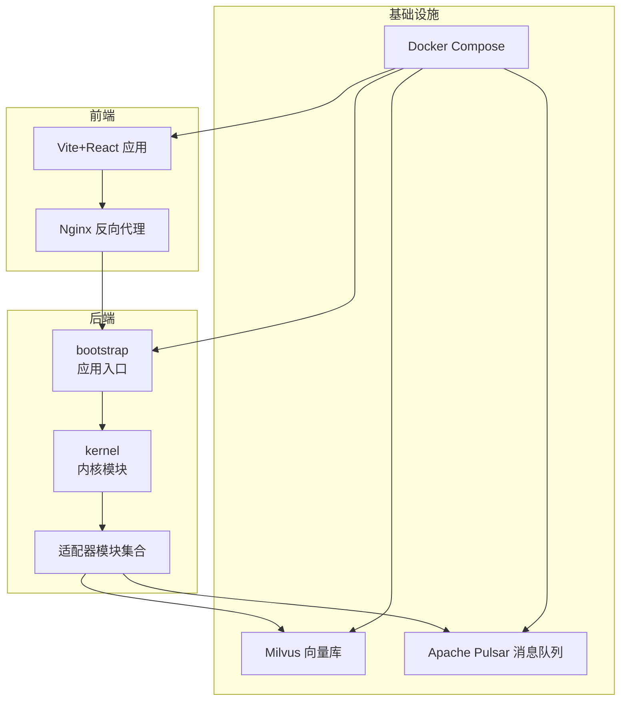
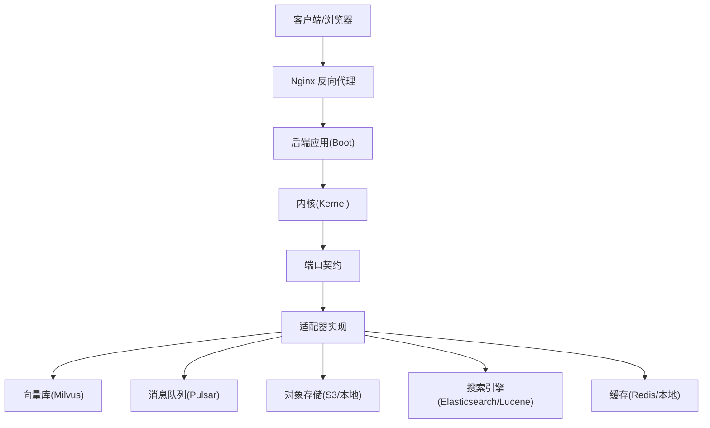
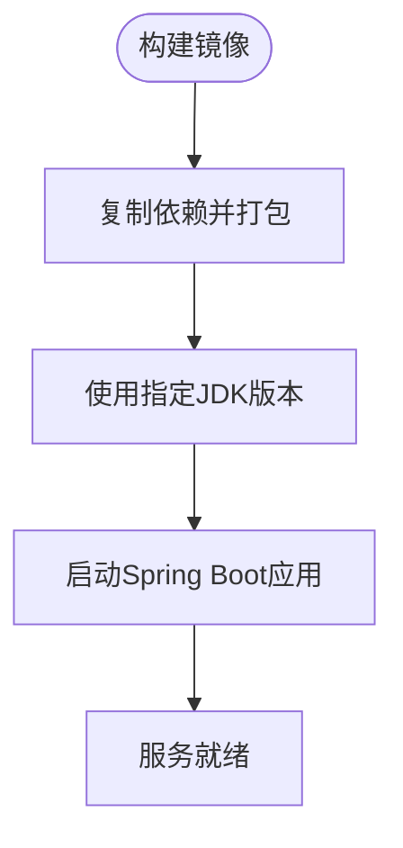
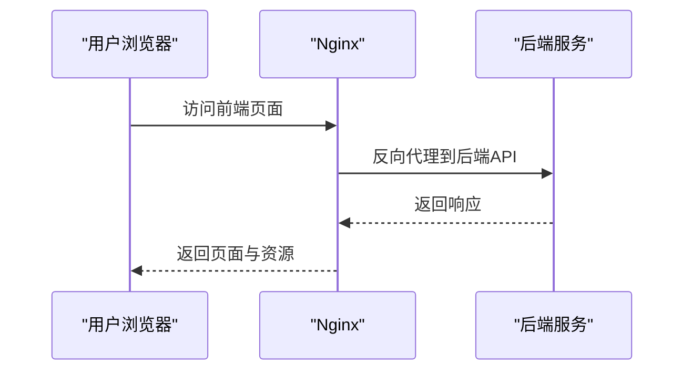
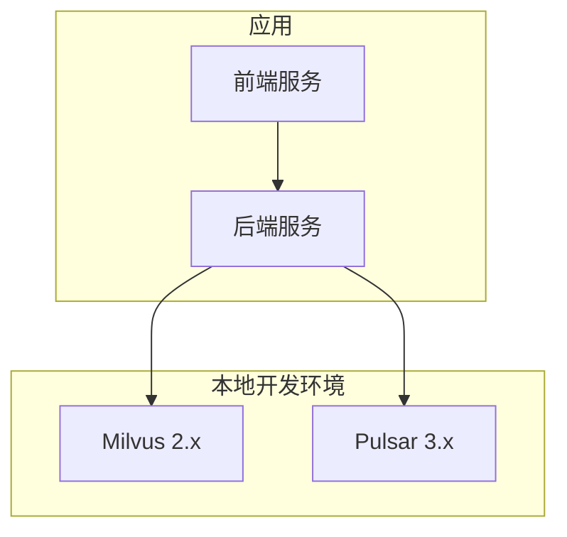
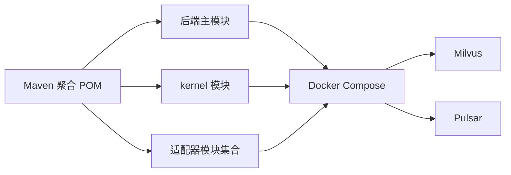
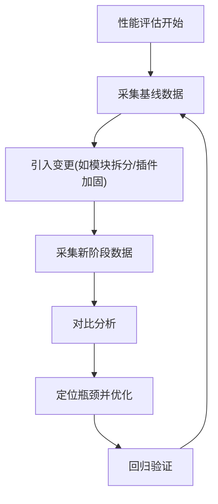

# 系统要求

<cite>
**本文引用的文件**
- [pom.xml](file://pom.xml)
- [Dockerfile.backend](file://Dockerfile.backend)
- [frontend/Dockerfile.frontend](file://frontend/Dockerfile.frontend)
- [docker-compose.yml](file://docker-compose.yml)
- [docker-compose.full.yml](file://docker-compose.full.yml)
- [resources/docker/milvus-stack-2.6.6.compose.yaml](file://resources/docker/milvus-stack-2.6.6.compose.yaml)
- [resources/docker/pulsar-stack-3.1.3.compose.yaml](file://resources/docker/pulsar-stack-3.1.3.compose.yaml)
- [seahorse-agent-bootstrap/src/main/resources/application.properties](file://seahorse-agent-bootstrap/src/main/resources/application.properties)
- [DEPLOY.md](file://DEPLOY.md)
- [frontend/package.json](file://frontend/package.json)
- [frontend/vite.config.js](file://frontend/vite.config.js)
- [frontend/nginx.conf](file://frontend/nginx.conf)
- [docs/zh/内容/部署配置/README.md](file://docs/zh/内容/部署配置/README.md)
- [docs/zh/内容/监控运维/README.md](file://docs/zh/内容/监控运维/README.md)
- [docs/performance/rag-baseline.json](file://docs/performance/rag-baseline.json)
- [docs/performance/rag-after-bootstrap-native.json](file://docs/performance/rag-after-bootstrap-native.json)
- [docs/performance/rag-after-compat-extraction.json](file://docs/performance/rag-after-compat-extraction.json)
- [docs/performance/rag-after-crosscutting-ports.json](file://docs/performance/rag-after-crosscutting-ports.json)
- [docs/performance/rag-after-document-source.json](file://docs/performance/rag-after-document-source.json)
- [docs/performance/rag-after-feishu-source.json](file://docs/performance/rag-after-feishu-source.json)
- [docs/performance/rag-after-legacy-runtime-boundary.json](file://docs/performance/rag-after-legacy-runtime-boundary.json)
- [docs/performance/rag-after-mcp-server.json](file://docs/performance/rag-after-mcp-server.json)
- [docs/performance/rag-after-memory-governance.json](file://docs/performance/rag-after-memory-governance.json)
- [docs/performance/rag-after-module-split.json](file://docs/performance/rag-after-module-split.json)
- [docs/performance/rag-after-plugin-hardening.json](file://docs/performance/rag-after-plugin-hardening.json)
- [docs/performance/rag-after-plugin-state-management.json](file://docs/performance/rag-after-plugin-state-management.json)
- [docs/performance/rag-after-trace.json](file://docs/performance/rag-after-trace.json)
- [docs/performance/rag-after-wrapper-chain.json](file://docs/performance/rag-after-wrapper-chain.json)
</cite>

## 目录
1. [简介](#简介)
2. [项目结构](#项目结构)
3. [核心组件](#核心组件)
4. [架构总览](#架构总览)
5. [详细组件分析](#详细组件分析)
6. [依赖关系分析](#依赖关系分析)
7. [性能考虑](#性能考虑)
8. [故障排查指南](#故障排查指南)
9. [结论](#结论)
10. [附录](#附录)

## 简介
本文件面向Seahorse Agent项目的系统要求与部署配置，覆盖硬件资源、软件依赖、部署模式、网络与防火墙、域名配置、兼容性矩阵以及监控与性能调优建议。内容基于仓库中的构建脚本、容器编排、配置文件与性能文档进行归纳总结，帮助读者在开发与生产环境中正确规划与实施。

## 项目结构
Seahorse Agent采用多模块Maven工程组织，后端以Spring Boot为核心，前端为Vite+React应用，配合Docker与Compose实现本地与生产级部署。关键目录与文件如下：
- 后端核心：seahorse-agent-bootstrap、seahorse-agent-kernel、各适配器模块（缓存、消息队列、向量库、存储、搜索、观察等）
- 前端：frontend目录，包含构建配置、Dockerfile与nginx.conf
- 容器与编排：根目录Dockerfile.backend、frontend/Dockerfile.frontend、docker-compose.yml、docker-compose.full.yml；resources/docker下包含Milvus与Pulsar的编排模板
- 配置与部署：application.properties、DEPLOY.md、docs/zh/内容/部署配置/README.md
- 性能基线：docs/performance下的多个阶段性能JSON文件

**图表来源**
- [Dockerfile.backend](file://Dockerfile.backend)
- [frontend/Dockerfile.frontend](file://frontend/Dockerfile.frontend)
- [docker-compose.yml](file://docker-compose.yml)
- [resources/docker/milvus-stack-2.6.6.compose.yaml](file://resources/docker/milvus-stack-2.6.6.compose.yaml)
- [resources/docker/pulsar-stack-3.1.3.compose.yaml](file://resources/docker/pulsar-stack-3.1.3.compose.yaml)

**章节来源**
- [pom.xml](file://pom.xml)
- [Dockerfile.backend](file://Dockerfile.backend)
- [frontend/Dockerfile.frontend](file://frontend/Dockerfile.frontend)
- [docker-compose.yml](file://docker-compose.yml)
- [docker-compose.full.yml](file://docker-compose.full.yml)

## 核心组件
- 后端应用入口与配置
  - 应用入口类位于seahorse-agent-bootstrap模块，提供Spring Boot启动能力
  - 默认配置文件位于application.properties，包含基础运行参数
- 内核与端口
  - kernel模块定义领域内核与端口契约，是业务逻辑的核心
- 适配器生态
  - 缓存：本地与Redis适配器
  - 消息队列：Direct与Pulsar适配器
  - 向量库：Milvus与pgvector适配器
  - 存储：本地与S3适配器
  - 搜索：Elasticsearch与Lucene适配器
  - 观察：Micrometer与Noop适配器
  - 其他：OpenAI兼容LLM、MCP HTTP/Server、OpenAPI解析、Feishu数据源等
- 前端
  - Vite+React应用，Dockerfile.frontend用于容器化
  - nginx.conf提供反向代理与静态资源服务
- 容器与编排
  - Dockerfile.backend用于后端镜像构建
  - docker-compose.yml与docker-compose.full.yml定义服务编排
  - resources/docker下提供Milvus与Pulsar的独立编排模板

**章节来源**
- [seahorse-agent-bootstrap/src/main/resources/application.properties](file://seahorse-agent-bootstrap/src/main/resources/application.properties)
- [pom.xml](file://pom.xml)
- [frontend/package.json](file://frontend/package.json)
- [frontend/vite.config.js](file://frontend/vite.config.js)
- [frontend/nginx.conf](file://frontend/nginx.conf)

## 架构总览
后端通过Spring Boot启动，加载kernel与适配器模块，对外提供Web接口与内部运行时能力。前端通过Nginx反向代理访问后端。向量库与消息队列作为外部依赖由Docker Compose统一管理。

**图表来源**
- [Dockerfile.backend](file://Dockerfile.backend)
- [frontend/nginx.conf](file://frontend/nginx.conf)
- [resources/docker/milvus-stack-2.6.6.compose.yaml](file://resources/docker/milvus-stack-2.6.6.compose.yaml)
- [resources/docker/pulsar-stack-3.1.3.compose.yaml](file://resources/docker/pulsar-stack-3.1.3.compose.yaml)

## 详细组件分析

### 后端应用与容器化
- Dockerfile.backend定义后端镜像构建流程，包含JDK版本、依赖打包与运行命令
- docker-compose.yml与docker-compose.full.yml描述服务拓扑，包含后端、前端、Milvus与Pulsar
- application.properties提供默认运行参数，如端口、日志级别等

**图表来源**
- [Dockerfile.backend](file://Dockerfile.backend)
- [seahorse-agent-bootstrap/src/main/resources/application.properties](file://seahorse-agent-bootstrap/src/main/resources/application.properties)

**章节来源**
- [Dockerfile.backend](file://Dockerfile.backend)
- [docker-compose.yml](file://docker-compose.yml)
- [docker-compose.full.yml](file://docker-compose.full.yml)
- [seahorse-agent-bootstrap/src/main/resources/application.properties](file://seahorse-agent-bootstrap/src/main/resources/application.properties)

### 前端应用与反向代理
- 前端使用Vite构建，Dockerfile.frontend负责容器化
- nginx.conf提供静态资源与后端反代配置
- vite.config.js定义构建与开发服务器参数

**图表来源**
- [frontend/Dockerfile.frontend](file://frontend/Dockerfile.frontend)
- [frontend/nginx.conf](file://frontend/nginx.conf)
- [frontend/vite.config.js](file://frontend/vite.config.js)

**章节来源**
- [frontend/Dockerfile.frontend](file://frontend/Dockerfile.frontend)
- [frontend/nginx.conf](file://frontend/nginx.conf)
- [frontend/vite.config.js](file://frontend/vite.config.js)

### 外部依赖与编排
- Milvus向量库：通过compose文件定义服务与卷，版本参考编排文件
- Apache Pulsar消息队列：通过compose文件定义服务与集群参数
- 这些依赖在本地开发与集成测试中尤为重要

**图表来源**
- [resources/docker/milvus-stack-2.6.6.compose.yaml](file://resources/docker/milvus-stack-2.6.6.compose.yaml)
- [resources/docker/pulsar-stack-3.1.3.compose.yaml](file://resources/docker/pulsar-stack-3.1.3.compose.yaml)

**章节来源**
- [resources/docker/milvus-stack-2.6.6.compose.yaml](file://resources/docker/milvus-stack-2.6.6.compose.yaml)
- [resources/docker/pulsar-stack-3.1.3.compose.yaml](file://resources/docker/pulsar-stack-3.1.3.compose.yaml)

## 依赖关系分析
- 构建与运行时
  - Maven多模块工程，后端主模块聚合所有适配器与内核模块
  - 前端package.json声明依赖与脚本
- 容器与编排
  - Dockerfile.backend与Dockerfile.frontend分别构建后端与前端镜像
  - docker-compose.yml与docker-compose.full.yml组合服务
- 外部依赖
  - 向量库与消息队列通过compose文件管理
  - 应用通过适配器模块对接外部系统

**图表来源**
- [pom.xml](file://pom.xml)
- [Dockerfile.backend](file://Dockerfile.backend)
- [docker-compose.yml](file://docker-compose.yml)

**章节来源**
- [pom.xml](file://pom.xml)
- [Dockerfile.backend](file://Dockerfile.backend)
- [docker-compose.yml](file://docker-compose.yml)

## 性能考虑
- 性能基线与阶段演进
  - 文档目录docs/performance包含从“基线”到“模块拆分”“插件加固”等多个阶段的性能JSON文件，可用于对比不同架构改动对性能的影响
  - 建议在相同硬件与负载条件下对比不同阶段的延迟、吞吐与资源占用
- 关键优化方向
  - 向量检索与索引：合理配置Milvus副本与分区，控制查询超时与批处理大小
  - 消息队列：根据并发与延迟目标调整Pulsar主题与分区数量
  - 缓存层：结合Redis与本地缓存，针对热点数据设置合理的TTL与淘汰策略
  - 前端：启用Gzip/HTTP/2、CDN与静态资源缓存，减少首屏时间
  - 后端：开启连接池、异步I/O与限流熔断，避免单点瓶颈

**图表来源**
- [docs/performance/rag-baseline.json](file://docs/performance/rag-baseline.json)
- [docs/performance/rag-after-module-split.json](file://docs/performance/rag-after-module-split.json)
- [docs/performance/rag-after-plugin-hardening.json](file://docs/performance/rag-after-plugin-hardening.json)

**章节来源**
- [docs/performance/rag-baseline.json](file://docs/performance/rag-baseline.json)
- [docs/performance/rag-after-bootstrap-native.json](file://docs/performance/rag-after-bootstrap-native.json)
- [docs/performance/rag-after-compat-extraction.json](file://docs/performance/rag-after-compat-extraction.json)
- [docs/performance/rag-after-crosscutting-ports.json](file://docs/performance/rag-after-crosscutting-ports.json)
- [docs/performance/rag-after-document-source.json](file://docs/performance/rag-after-document-source.json)
- [docs/performance/rag-after-feishu-source.json](file://docs/performance/rag-after-feishu-source.json)
- [docs/performance/rag-after-legacy-runtime-boundary.json](file://docs/performance/rag-after-legacy-runtime-boundary.json)
- [docs/performance/rag-after-mcp-server.json](file://docs/performance/rag-after-mcp-server.json)
- [docs/performance/rag-after-memory-governance.json](file://docs/performance/rag-after-memory-governance.json)
- [docs/performance/rag-after-module-split.json](file://docs/performance/rag-after-module-split.json)
- [docs/performance/rag-after-plugin-hardening.json](file://docs/performance/rag-after-plugin-hardening.json)
- [docs/performance/rag-after-plugin-state-management.json](file://docs/performance/rag-after-plugin-state-management.json)
- [docs/performance/rag-after-trace.json](file://docs/performance/rag-after-trace.json)
- [docs/performance/rag-after-wrapper-chain.json](file://docs/performance/rag-after-wrapper-chain.json)

## 故障排查指南
- 部署与编排
  - 使用DEPLOY.md与docs/zh/内容/部署配置/README.md指导部署步骤，确认compose文件中的服务端口映射与卷挂载
- 容器日志
  - 查看后端与前端容器日志，定位启动失败或运行期异常
- 外部依赖健康
  - 检查Milvus与Pulsar服务状态，确认网络连通与认证配置
- 性能问题
  - 对照性能基线文件，逐步回退变更以定位性能回归点
- 监控与可观测性
  - 参考docs/zh/内容/监控运维/README.md，建立指标采集与告警机制

**章节来源**
- [DEPLOY.md](file://DEPLOY.md)
- [docs/zh/内容/部署配置/README.md](file://docs/zh/内容/部署配置/README.md)
- [docs/zh/内容/监控运维/README.md](file://docs/zh/内容/监控运维/README.md)

## 结论
本系统要求文档基于仓库中的构建、容器与编排配置，以及性能基线文件，给出了开发与生产环境的资源估算与性能调优建议。实际部署时应结合业务规模与SLA目标，对硬件、网络与外部依赖进行容量规划，并持续通过性能基线与监控指标进行迭代优化。

## 附录

### 硬件资源要求（建议）
- 开发环境
  - CPU：4核以上
  - 内存：8GB以上
  - 存储：50GB可用空间（含容器镜像与日志）
- 生产环境（小规模）
  - CPU：8核起
  - 内存：16GB起
  - 存储：100GB可用空间（含日志与向量库数据）
- 生产环境（中等规模）
  - CPU：16核起
  - 内存：32GB起
  - 存储：500GB可用空间（按向量库与消息队列数据增长预留）
- 生产环境（大规模）
  - CPU：32核起
  - 内存：64GB起
  - 存储：TB级（按向量库与消息队列数据增长预留）

说明
- 上述为通用建议，具体需结合业务流量、并发度与数据规模进行容量评估
- 向量库与消息队列通常为IO密集型，建议使用SSD存储并预留充足IOPS

### 软件依赖要求
- 操作系统
  - Linux发行版（推荐Ubuntu 20.04/22.04或CentOS 8+）
  - Windows/macOS仅用于开发与本地调试
- JDK
  - 建议使用JDK 17或21（以Dockerfile.backend与Maven配置为准）
- 数据库
  - 关系型数据库：MySQL 8.0+ 或 PostgreSQL 13+
  - 向量库：Milvus 2.2+（仓库提供2.6.6编排示例）
  - 搜索引擎：Elasticsearch 7.x/8.x（如使用相关适配器）
- 消息队列
  - Apache Pulsar 3.x（仓库提供3.1.3编排示例）
- 缓存
  - Redis 6.x/7.x（可选，用于分布式锁、速率限制与会话缓存）
- 前端
  - Node.js 18.x/20.x（Vite构建）
  - 浏览器：Chrome/Firefox/Safari 最近两个版本

**章节来源**
- [Dockerfile.backend](file://Dockerfile.backend)
- [frontend/package.json](file://frontend/package.json)
- [resources/docker/milvus-stack-2.6.6.compose.yaml](file://resources/docker/milvus-stack-2.6.6.compose.yaml)
- [resources/docker/pulsar-stack-3.1.3.compose.yaml](file://resources/docker/pulsar-stack-3.1.3.compose.yaml)

### 部署模式与资源估算
- 单机开发模式
  - 使用docker-compose.yml启动后端、前端与本地依赖（Milvus/Pulsar可本地运行）
  - 资源：CPU 4核/内存8GB/存储50GB
- 容器化编排模式
  - 使用docker-compose.full.yml启动完整栈（包含外部依赖）
  - 资源：CPU 8核+/内存16GB+/存储100GB+
- 云原生模式
  - 在Kubernetes中部署，按Pod副本数与资源请求/限制进行弹性伸缩
  - 建议为Milvus与Pulsar单独分配持久卷与高IOPS存储

**章节来源**
- [docker-compose.yml](file://docker-compose.yml)
- [docker-compose.full.yml](file://docker-compose.full.yml)

### 网络配置、防火墙与域名
- 端口开放
  - 前端Nginx：80/443
  - 后端服务：8080（以application.properties为准）
  - Milvus：19530/9091（以编排文件为准）
  - Pulsar：6650/8080（以编排文件为准）
- 防火墙
  - 仅放行必要端口，建议使用安全组/iptables限制来源IP
- 域名
  - 建议为前端与后端配置独立域名，并启用HTTPS证书
  - Nginx反向代理需正确转发Host与路径

**章节来源**
- [frontend/nginx.conf](file://frontend/nginx.conf)
- [seahorse-agent-bootstrap/src/main/resources/application.properties](file://seahorse-agent-bootstrap/src/main/resources/application.properties)
- [resources/docker/milvus-stack-2.6.6.compose.yaml](file://resources/docker/milvus-stack-2.6.6.compose.yaml)
- [resources/docker/pulsar-stack-3.1.3.compose.yaml](file://resources/docker/pulsar-stack-3.1.3.compose.yaml)

### 兼容性矩阵
- 浏览器兼容性
  - Chrome/Firefox/Safari 最近两个版本
- 数据库兼容性
  - MySQL 8.0+、PostgreSQL 13+
- 第三方服务兼容性
  - Milvus 2.x（向量检索）
  - Pulsar 3.x（消息队列）
  - Elasticsearch 7.x/8.x（关键词索引/搜索）
  - Redis 6.x/7.x（缓存/分布式协调）
  - S3兼容对象存储（对象存储）

**章节来源**
- [frontend/package.json](file://frontend/package.json)
- [resources/docker/milvus-stack-2.6.6.compose.yaml](file://resources/docker/milvus-stack-2.6.6.compose.yaml)
- [resources/docker/pulsar-stack-3.1.3.compose.yaml](file://resources/docker/pulsar-stack-3.1.3.compose.yaml)

### 资源监控指标与性能调优
- 监控指标建议
  - 后端：CPU使用率、内存RSS、GC时间、请求数/错误率、响应时间分位值
  - 前端：页面首屏时间、资源加载时间、用户交互延迟
  - 外部依赖：Milvus查询QPS/延迟、Pulsar消息积压、存储使用率
- 调优建议
  - 后端：连接池大小、线程池参数、限流与熔断策略
  - 前端：静态资源压缩与缓存、CDN加速、路由懒加载
  - 外部依赖：向量库索引参数、消息队列分区与批大小

**章节来源**
- [docs/zh/内容/监控运维/README.md](file://docs/zh/内容/监控运维/README.md)