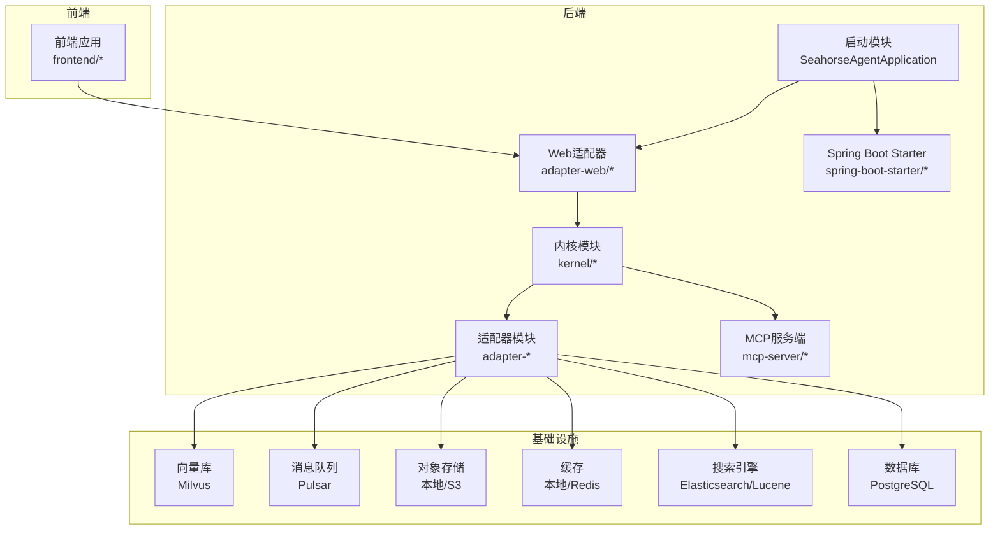
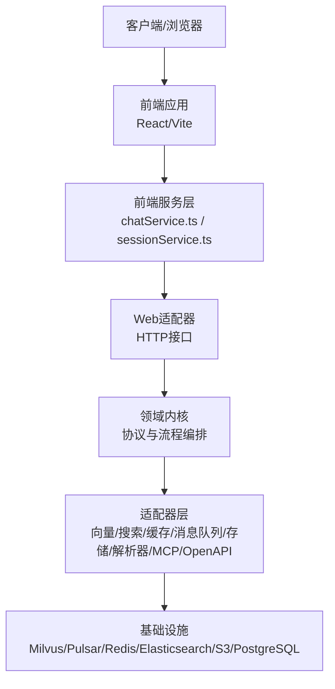
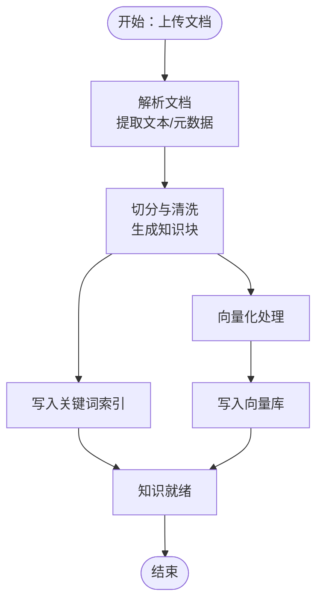
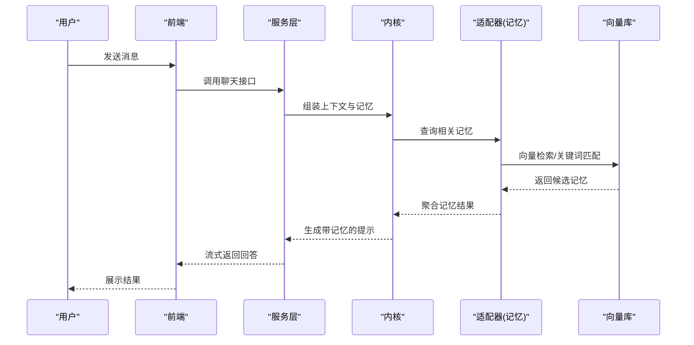
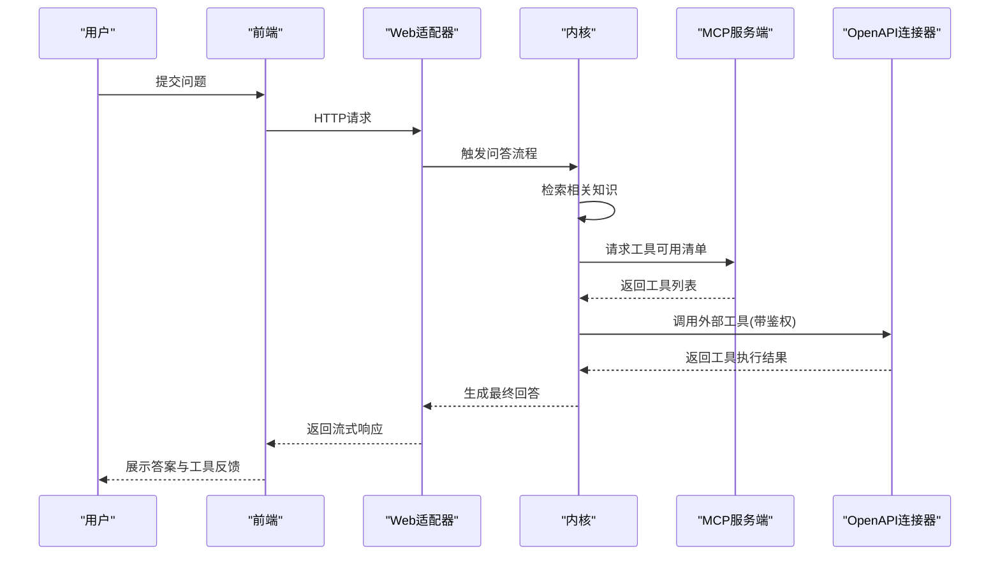
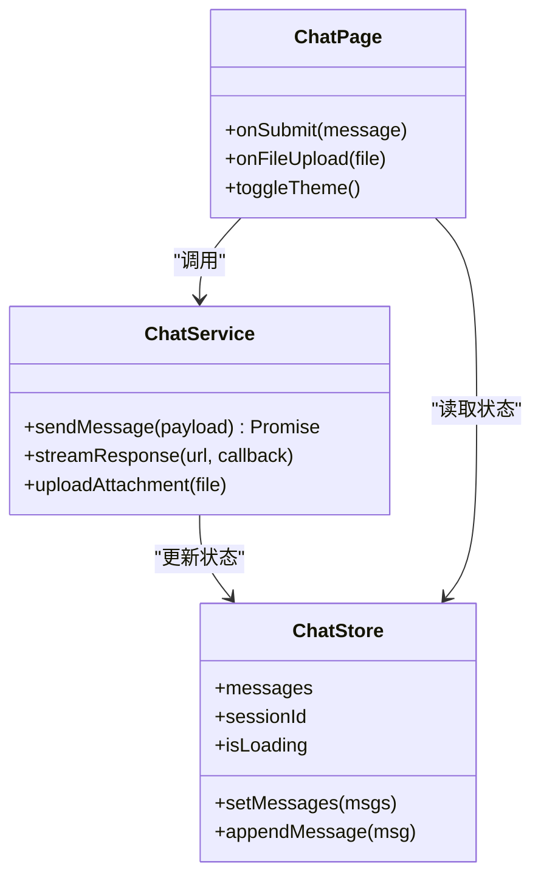
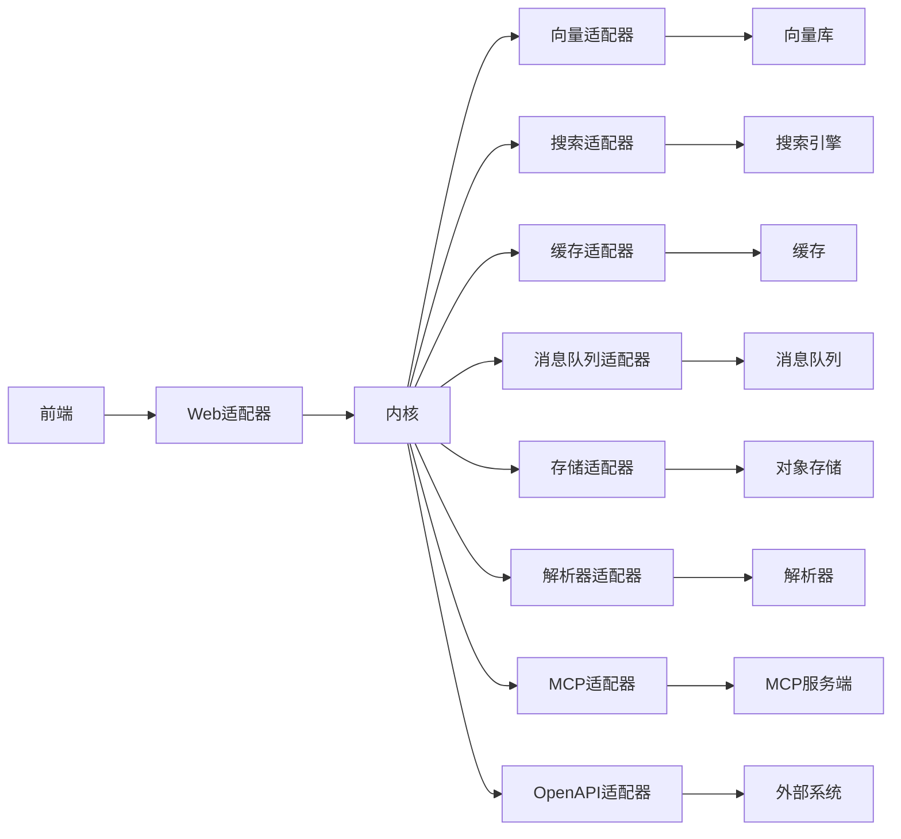

# 项目介绍

<cite>
**本文引用的文件**
- [README.md](file://README.md)
- [DEPLOY.md](file://DEPLOY.md)
- [docs/PRODUCT-ROADMAP.md](file://docs/PRODUCT-ROADMAP.md)
- [docs/zh/content/项目概述.md](file://docs/zh/content/项目概述.md)
- [docs/aegis/README.md](file://docs/aegis/README.md)
- [docs/company-agent/ai-infra-phases/README.md](file://docs/company-agent/ai-infra-phases/README.md)
- [docs/examples/pdf-ingestion-example.md](file://docs/examples/pdf-ingestion-example.md)
- [docs/deployment/enterprise-mode.md](file://docs/deployment/enterprise-mode.md)
- [seahorse-agent-bootstrap/src/main/java/com/miracle/ai/seahorse/agent/SeahorseAgentApplication.java](file://seahorse-agent-bootstrap/src/main/java/com/miracle/ai/seahorse/agent/SeahorseAgentApplication.java)
- [seahorse-agent-kernel/src/main/java/com/miracle/ai/seahorse/agent/kernel](file://seahorse-agent-kernel/src/main/java/com/miracle/ai/seahorse/agent/kernel)
- [seahorse-agent-adapter-web/src/main/java/com/miracle/ai/seahorse/agent/adapters/web](file://seahorse-agent-adapter-web/src/main/java/com/miracle/ai/seahorse/agent/adapters/web)
- [frontend/src/pages/ChatPage.tsx](file://frontend/src/pages/ChatPage.tsx)
- [frontend/src/services/chatService.ts](file://frontend/src/services/chatService.ts)
- [frontend/src/stores/chatStore.ts](file://frontend/src/stores/chatStore.ts)
- [resources/docker/milvus-stack-2.6.6.compose.yaml](file://resources/docker/milvus-stack-2.6.6.compose.yaml)
- [resources/docker/pulsar-stack-3.1.3.compose.yaml](file://resources/docker/pulsar-stack-3.1.3.compose.yaml)
- [resources/database/seahorse_init.sql](file://resources/database/seahorse_init.sql)
</cite>

## 目录
1. [引言](#引言)
2. [项目结构](#项目结构)
3. [核心组件](#核心组件)
4. [架构总览](#架构总览)
5. [详细组件分析](#详细组件分析)
6. [依赖关系分析](#依赖关系分析)
7. [性能考量](#性能考量)
8. [故障排查指南](#故障排查指南)
9. [结论](#结论)
10. [附录](#附录)

## 引言
Seahorse Agent 是一个面向企业级场景的 RAG 智能体平台，旨在通过“智能文档处理 + 知识库管理 + 会话记忆系统 + 智能问答 + 工具调用”的一体化能力，帮助组织高效构建可治理、可扩展、可审计的智能问答与决策辅助系统。项目以模块化内核为核心，配合多适配器体系实现向量检索、消息队列、缓存、存储、解析器、OpenAPI 连接器等能力的灵活替换；前端提供对话式交互界面，后端通过 Spring Boot Starter 提供开箱即用的装配能力。

本项目面向三类用户：
- 业务人员：关注“如何用更低成本获得高质量答案”“如何在现有流程中嵌入智能问答”
- 开发者：关注“如何快速集成知识入库、检索增强、工具调用”“如何扩展适配器与后端服务”
- 架构师：关注“整体架构分层、可插拔性、可观测性与企业级治理”

## 项目结构
项目采用多模块 Maven 结构，结合 Spring Boot 自动装配与领域内核(kernel)解耦，形成“内核 + 适配器 + 适配器Web + 前端”的完整栈。核心目录与职责概览：
- seahorse-agent-bootstrap：应用启动入口与基础配置
- seahorse-agent-kernel：领域内核与核心协议定义
- seahorse-agent-adapter-*：各类基础设施与第三方能力的适配器（向量、搜索、缓存、消息队列、存储、解析器、MCP、OpenAPI 等）
- seahorse-agent-adapter-web：Web 层适配器，提供 HTTP 接口与前端交互
- seahorse-agent-mcp-server：MCP（Model Context Protocol）服务端适配
- seahorse-agent-spring-boot-starter：Spring Boot 自动装配与运行时装配
- frontend：基于 React/Vite 的前端应用，提供聊天、会话、知识中心等页面
- resources：数据库初始化脚本、Docker 编排与示例数据
- docs：产品路线图、开发指南、架构设计、实施计划与测试基线等

图表来源
- [seahorse-agent-bootstrap/src/main/java/com/miracle/ai/seahorse/agent/SeahorseAgentApplication.java](file://seahorse-agent-bootstrap/src/main/java/com/miracle/ai/seahorse/agent/SeahorseAgentApplication.java)
- [seahorse-agent-kernel/src/main/java/com/miracle/ai/seahorse/agent/kernel](file://seahorse-agent-kernel/src/main/java/com/miracle/ai/seahorse/agent/kernel)
- [seahorse-agent-adapter-web/src/main/java/com/miracle/ai/seahorse/agent/adapters/web](file://seahorse-agent-adapter-web/src/main/java/com/miracle/ai/seahorse/agent/adapters/web)
- [seahorse-agent-mcp-server/src/main/java/com/miracle/ai/seahorse/agent/adapters/mcp/server](file://seahorse-agent-mcp-server/src/main/java/com/miracle/ai/seahorse/agent/adapters/mcp/server)
- [seahorse-agent-spring-boot-starter/src/main/java/com/miracle/ai/seahorse/agent/adapters/spring](file://seahorse-agent-spring-boot-starter/src/main/java/com/miracle/ai/seahorse/agent/adapters/spring)

章节来源
- [README.md](file://README.md)
- [docs/zh/content/项目概述.md](file://docs/zh/content/项目概述.md)

## 核心组件
- 智能文档处理：支持多种文档源接入与解析，内置 Tika 解析器适配器，结合向量化与关键词索引，完成结构化解析与语义编码。
- 知识库管理：提供知识文档的入库、更新、删除、刷新调度与质量治理能力，支持关键词索引与向量检索双引擎。
- 会话记忆系统：围绕对话上下文与历史消息进行记忆聚合、过滤与回放，支撑多轮问答与任务型交互。
- 智能问答：基于检索增强生成（RAG）与工具调用，实现“检索+推理+执行”的闭环回答。
- 工具调用：通过 MCP（Model Context Protocol）与 OpenAPI 连接器，安全地调用企业内部系统或外部服务，支持鉴权与访问控制。
- 企业级治理：提供访问决策审计、资源 ACL、版本模型路由、沙箱运行时、可观测性等能力，满足合规与运营要求。

章节来源
- [docs/aegis/README.md](file://docs/aegis/README.md)
- [docs/company-agent/ai-infra-phases/README.md](file://docs/company-agent/ai-infra-phases/README.md)
- [docs/examples/pdf-ingestion-example.md](file://docs/examples/pdf-ingestion-example.md)

## 架构总览
系统采用“内核驱动 + 多适配器 + Web 适配 + 前端”的分层架构。内核定义核心领域模型与协议，适配器负责对接具体基础设施与第三方能力；Web 适配器提供 HTTP 接口与前端交互；前端通过服务层与状态管理与后端通信。

图表来源
- [frontend/src/services/chatService.ts](file://frontend/src/services/chatService.ts)
- [frontend/src/stores/chatStore.ts](file://frontend/src/stores/chatStore.ts)
- [seahorse-agent-adapter-web/src/main/java/com/miracle/ai/seahorse/agent/adapters/web](file://seahorse-agent-adapter-web/src/main/java/com/miracle/ai/seahorse/agent/adapters/web)
- [seahorse-agent-kernel/src/main/java/com/miracle/ai/seahorse/agent/kernel](file://seahorse-agent-kernel/src/main/java/com/miracle/ai/seahorse/agent/kernel)

## 详细组件分析

### 组件A：智能文档处理与知识库管理
- 文档解析：通过 Tika 解析器适配器提取文本、表格、元数据，输出标准化的文档块。
- 索引与向量化：将文档块写入关键词索引与向量库，支持增量更新与批量导入。
- 知识治理：提供刷新调度、质量评估、映射与审核流程，确保知识库的准确性与时效性。

图表来源
- [seahorse-agent-adapter-parser-tika/src/main/java/com/miracle/ai/seahorse/agent/adapters/parser/tika](file://seahorse-agent-adapter-parser-tika/src/main/java/com/miracle/ai/seahorse/agent/adapters/parser/tika)
- [seahorse-agent-adapter-vector-milvus/src/main/java/com/miracle/ai/seahorse/agent/adapters/vector/milvus](file://seahorse-agent-adapter-vector-milvus/src/main/java/com/miracle/ai/seahorse/agent/adapters/vector/milvus)
- [seahorse-agent-adapter-search-elasticsearch/src/main/java/com/miracle/ai/seahorse/agent/adapters/search/elasticsearch](file://seahorse-agent-adapter-search-elasticsearch/src/main/java/com/miracle/ai/seahorse/agent/adapters/search/elasticsearch)

章节来源
- [docs/examples/pdf-ingestion-example.md](file://docs/examples/pdf-ingestion-example.md)

### 组件B：会话记忆系统
- 记忆聚合：按会话维度聚合消息与上下文，形成可检索的记忆片段。
- 过滤与回放：根据意图与上下文动态选择相关记忆，提升回答一致性与连贯性。
- 生命周期管理：支持记忆的创建、更新、归档与清理，保障系统性能与数据健康。

图表来源
- [frontend/src/pages/ChatPage.tsx](file://frontend/src/pages/ChatPage.tsx)
- [frontend/src/services/chatService.ts](file://frontend/src/services/chatService.ts)
- [seahorse-agent-kernel/src/main/java/com/miracle/ai/seahorse/agent/kernel](file://seahorse-agent-kernel/src/main/java/com/miracle/ai/seahorse/agent/kernel)

章节来源
- [docs/aegis/README.md](file://docs/aegis/README.md)

### 组件C：智能问答与工具调用
- 检索增强：结合关键词与向量检索，筛选最相关的知识片段，拼接到提示词中。
- 工具调用：通过 MCP 与 OpenAPI 连接器，安全地调用企业内部系统或外部服务，支持鉴权与访问控制。
- 输出治理：对生成内容进行合规校验与输出治理，确保回答质量与安全性。

图表来源
- [seahorse-agent-adapter-web/src/main/java/com/miracle/ai/seahorse/agent/adapters/web](file://seahorse-agent-adapter-web/src/main/java/com/miracle/ai/seahorse/agent/adapters/web)
- [seahorse-agent-mcp-server/src/main/java/com/miracle/ai/seahorse/agent/adapters/mcp/server](file://seahorse-agent-mcp-server/src/main/java/com/miracle/ai/seahorse/agent/adapters/mcp/server)
- [seahorse-agent-adapter-openapi/src/main/java/com/miracle/ai/seahorse/agent/adapters/openapi](file://seahorse-agent-adapter-openapi/src/main/java/com/miracle/ai/seahorse/agent/adapters/openapi)

章节来源
- [docs/aegis/README.md](file://docs/aegis/README.md)

### 组件D：前端交互与状态管理
- 对话页面：提供自然语言输入、消息展示、工具调用反馈等交互能力。
- 服务层：封装与后端的通信逻辑，统一错误处理与流式响应处理。
- 状态管理：集中管理会话、主题、认证等全局状态，保证用户体验一致性。

图表来源
- [frontend/src/pages/ChatPage.tsx](file://frontend/src/pages/ChatPage.tsx)
- [frontend/src/services/chatService.ts](file://frontend/src/services/chatService.ts)
- [frontend/src/stores/chatStore.ts](file://frontend/src/stores/chatStore.ts)

章节来源
- [frontend/src/pages/ChatPage.tsx](file://frontend/src/pages/ChatPage.tsx)
- [frontend/src/services/chatService.ts](file://frontend/src/services/chatService.ts)
- [frontend/src/stores/chatStore.ts](file://frontend/src/stores/chatStore.ts)

## 依赖关系分析
- 内核与适配器：内核不直接依赖具体实现，而是通过 SPI/Meta-INF 描述的端口接口与适配器解耦，便于替换与扩展。
- Web 适配器：提供 HTTP 接口，将前端请求转换为内核可理解的领域动作，并将内核结果序列化返回。
- 基础设施：向量库、消息队列、缓存、搜索引擎、对象存储、数据库等通过适配器对接，支持本地与云上部署。
- 前端与后端：前端通过服务层与后端通信，采用流式响应与错误处理机制，保证交互体验。

图表来源
- [seahorse-agent-adapter-web/src/main/java/com/miracle/ai/seahorse/agent/adapters/web](file://seahorse-agent-adapter-web/src/main/java/com/miracle/ai/seahorse/agent/adapters/web)
- [seahorse-agent-kernel/src/main/java/com/miracle/ai/seahorse/agent/kernel](file://seahorse-agent-kernel/src/main/java/com/miracle/ai/seahorse/agent/kernel)
- [seahorse-agent-adapter-vector-milvus/src/main/java/com/miracle/ai/seahorse/agent/adapters/vector/milvus](file://seahorse-agent-adapter-vector-milvus/src/main/java/com/miracle/ai/seahorse/agent/adapters/vector/milvus)
- [seahorse-agent-adapter-search-elasticsearch/src/main/java/com/miracle/ai/seahorse/agent/adapters/search/elasticsearch](file://seahorse-agent-adapter-search-elasticsearch/src/main/java/com/miracle/ai/seahorse/agent/adapters/search/elasticsearch)
- [seahorse-agent-adapter-cache-redis/src/main/java/com/miracle/ai/seahorse/agent/adapters/cache/redis](file://seahorse-agent-adapter-cache-redis/src/main/java/com/miracle/ai/seahorse/agent/adapters/cache/redis)
- [seahorse-agent-adapter-mq-pulsar/src/main/java/com/miracle/ai/seahorse/agent/adapters/mq/pulsar](file://seahorse-agent-adapter-mq-pulsar/src/main/java/com/miracle/ai/seahorse/agent/adapters/mq/pulsar)
- [seahorse-agent-adapter-storage-s3/src/main/java/com/miracle/ai/seahorse/agent/adapters/storage/s3](file://seahorse-agent-adapter-storage-s3/src/main/java/com/miracle/ai/seahorse/agent/adapters/storage/s3)
- [seahorse-agent-adapter-parser-tika/src/main/java/com/miracle/ai/seahorse/agent/adapters/parser/tika](file://seahorse-agent-adapter-parser-tika/src/main/java/com/miracle/ai/seahorse/agent/adapters/parser/tika)
- [seahorse-agent-mcp-server/src/main/java/com/miracle/ai/seahorse/agent/adapters/mcp/server](file://seahorse-agent-mcp-server/src/main/java/com/miracle/ai/seahorse/agent/adapters/mcp/server)
- [seahorse-agent-adapter-openapi/src/main/java/com/miracle/ai/seahorse/agent/adapters/openapi](file://seahorse-agent-adapter-openapi/src/main/java/com/miracle/ai/seahorse/agent/adapters/openapi)

## 性能考量
- 索引与检索优化：关键词索引与向量检索双引擎协同，减少检索延迟；支持分页与过滤，避免全量扫描。
- 流式响应：前端采用流式接收，降低首字节延迟，提升交互体验。
- 缓存与限流：通过本地/Redis 缓存与分布式信号量，缓解热点查询压力。
- 数据库优化：提供主键优化与性能测试计划，确保大规模数据下的稳定性。
- 容器化与编排：提供 Milvus、Pulsar 等组件的 Docker 编排文件，便于快速部署与弹性伸缩。

章节来源
- [resources/docker/milvus-stack-2.6.6.compose.yaml](file://resources/docker/milvus-stack-2.6.6.compose.yaml)
- [resources/docker/pulsar-stack-3.1.3.compose.yaml](file://resources/docker/pulsar-stack-3.1.3.compose.yaml)
- [resources/database/seahorse_init.sql](file://resources/database/seahorse_init.sql)
- [docs/performance/database-optimization-performance-test-plan.md](file://docs/performance/database-optimization-performance-test-plan.md)

## 故障排查指南
- 启动与装配：检查启动类是否正确加载自动装配，确认各适配器的条件装配与 SPI 注册是否生效。
- 网关与接口：验证 Web 适配器的路由与参数映射，确认请求体与响应格式符合预期。
- 检索与向量：核对向量库连接、集合与索引状态，检查关键词索引同步与一致性。
- 工具调用：确认 MCP 与 OpenAPI 连接器的鉴权配置与访问控制策略，查看调用日志与错误码。
- 前端交互：检查服务层的流式响应处理与错误回调，定位网络超时与跨域问题。
- 数据库与迁移：核对初始化脚本与迁移脚本，确认表结构与索引存在且一致。

章节来源
- [seahorse-agent-bootstrap/src/main/java/com/miracle/ai/seahorse/agent/SeahorseAgentApplication.java](file://seahorse-agent-bootstrap/src/main/java/com/miracle/ai/seahorse/agent/SeahorseAgentApplication.java)
- [seahorse-agent-adapter-web/src/main/java/com/miracle/ai/seahorse/agent/adapters/web](file://seahorse-agent-adapter-web/src/main/java/com/miracle/ai/seahorse/agent/adapters/web)
- [seahorse-agent-adapter-vector-milvus/src/main/java/com/miracle/ai/seahorse/agent/adapters/vector/milvus](file://seahorse-agent-adapter-vector-milvus/src/main/java/com/miracle/ai/seahorse/agent/adapters/vector/milvus)
- [seahorse-agent-adapter-openapi/src/main/java/com/miracle/ai/seahorse/agent/adapters/openapi](file://seahorse-agent-adapter-openapi/src/main/java/com/miracle/ai/seahorse/agent/adapters/openapi)
- [frontend/src/services/chatService.ts](file://frontend/src/services/chatService.ts)

## 结论
Seahorse Agent 以“内核 + 适配器 + Web + 前端”的架构，为企业提供了从文档处理到智能问答再到工具调用的一体化能力。其模块化设计与多适配器体系，既满足了快速落地的需求，也为长期演进与企业级治理奠定了基础。未来将持续完善记忆系统、前端对齐、可观测性与治理能力，逐步实现“可治理、可扩展、可审计”的企业级智能体平台目标。

## 附录
- 产品路线图与实施计划：参考产品路线图与各阶段计划文档，了解当前进展与后续规划。
- 部署模式：提供企业模式部署指南，涵盖单机、集群与云上部署建议。
- 示例与最佳实践：参考 PDF 文档处理示例与性能测试基线，快速上手并优化系统表现。

章节来源
- [docs/PRODUCT-ROADMAP.md](file://docs/PRODUCT-ROADMAP.md)
- [docs/deployment/enterprise-mode.md](file://docs/deployment/enterprise-mode.md)
- [docs/examples/pdf-ingestion-example.md](file://docs/examples/pdf-ingestion-example.md)