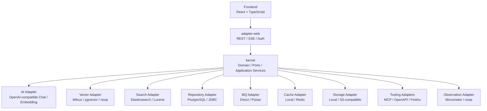
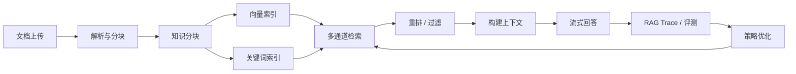
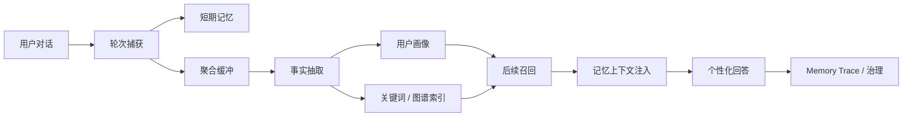
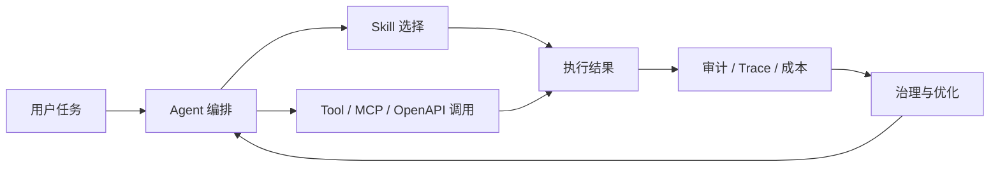

# Seahorse Agent

Seahorse Agent 是一个面向企业知识、长期记忆和可治理智能体的工程化平台。它不是单一聊天 Demo，而是一套用于构建企业级 AI 应用的参考实现：把 RAG、用户记忆、用户画像、Agent/Skill/Tool、租户治理、审计和可观测性放在同一条可部署、可验证、可扩展的系统链路里。

项目的核心目标是让智能体从“能回答一次问题”进化为“能在组织知识、用户偏好、工具能力和治理边界中长期工作”的平台。

## 愿景

企业 AI 应用的难点通常不在一次模型调用，而在长期运行中的四件事：

- **知识可信**：回答必须来自可追踪、可更新、可评测的知识链路。
- **记忆可控**：系统需要记住用户和任务上下文，也需要能解释、治理和遗忘。
- **能力可编排**：Agent 不只聊天，还要可靠调用工具、Skill、外部系统和流程。
- **治理可落地**：租户、权限、审计、成本、评测和观测必须成为默认能力。

Seahorse Agent 的定位是这四件事的工程底座。它强调可插拔适配器、稳定领域内核、真实闭环验证和面向生产的可观测性。

## 设计原则

- **内核稳定，外部可换**：业务编排集中在 kernel，数据库、模型、向量库、搜索、缓存、消息队列、存储和外部工具通过 adapter 接入。
- **闭环优先**：RAG、记忆、用户画像、Trace、评测和治理不是孤立功能，必须能在真实会话中形成数据回流。
- **本地可复现**：轻量部署用于快速启动，全量部署用于验证真实 RAG、记忆、画像和观测链路。
- **治理默认存在**：权限、审计、租户、成本、配额和安全边界作为平台能力，而不是后期补丁。
- **可观测即产品能力**：RAG Trace、Memory Trace、健康检查和指标用于定位质量问题，也是平台演进的依据。

## 架构总览

后端采用端口适配器架构。`seahorse-agent-kernel` 承载领域模型、端口和核心应用服务，外部依赖通过各类 adapter 接入，Spring Boot 自动装配负责运行期组合。



### 核心层次

| 层次 | 责任 |
|---|---|
| Frontend | 聊天、知识库、记忆中心、Agent 管理、治理后台和观测页面 |
| adapter-web | 认证、REST API、SSE 流式响应、后台管理入口 |
| kernel | RAG、记忆、用户画像、Agent、治理和 Trace 的核心编排 |
| adapter-* | 数据库、模型、向量库、搜索、缓存、消息队列、存储、工具和观测接入 |
| bootstrap / autoconfigure | Spring Boot 启动入口和自动装配 |

## 关键闭环

### RAG 闭环



全量部署使用 Milvus、Ollama Embedding、Elasticsearch、PostgreSQL 和 RAG Trace 形成完整检索链路。轻量部署可以快速启动，但默认不代表完整 RAG 检索质量。

### 记忆与用户画像闭环



用户画像不是独立表单，而是从对话事实中沉淀出来的可治理记忆。例如用户说“我的职业是平台可靠性后端工程师，我偏好极简中文回答”，系统应能抽取职业和回答风格，并在后续新会话中召回。

### Agent 能力闭环



Agent 能力围绕可管理的 Skill、Tool、运行记录、审批、审计和成本分析展开，目标是支持可控的企业级自动化，而不是不可追踪的黑盒调用。

## 当前 main 已落地能力

这版 main 已经把 APIX 借鉴方案中适合 Seahorse 当前阶段的能力合入到可运行链路里，重点是让 Agent 从“单次对话”走向“可复用配置、可分支验证、可审计执行”。

| 能力 | 当前作用 | 主要入口 |
|---|---|---|
| 消息树与分支对话 | 支持从历史消息派生分支、切换分支和对比上下文，便于验证不同 Agent 策略或回答路径 | `/chat` |
| 角色卡 | 管理可复用的助手角色、行为边界和系统预设，解决“这个 Agent 应该扮演谁、遵守什么约束”的问题 | `/admin/role-cards` |
| 运行方案 | 将角色卡、执行引擎、模型参数、记忆范围、安全策略和工具白名单组合成可复用运行配置；它不同于用户画像，主要描述 Agent 如何运行 | `/admin/run-profiles` |
| 运行实验 | 基于同一会话和基准消息，对多个运行方案发起 trial、评分并可派生分支，支撑方案对比和灰度验证 | `/admin/run-profiles/experiments` |
| AgentScope / Nacos A2A | 增加 AgentScope 执行器、Nacos 配置中心和 A2A 注册/调用链路，用于本地 Agent 与远端 Agent 的编排验证 | `seahorse-agent-adapter-agent-agentscope` |
| MCP stdio / HTTP 工具 | 在原 MCP HTTP 基础上补充本地 stdio MCP 工具运行路径，便于接入本地工具和调试型工具服务 | `/admin/plugins`、工具绑定 |
| 治理后台入口 | Skill 管理、Agent 控制台、审批中心、工具目录、OpenAPI 连接器、资源 ACL、访问决策、审计和成本页面已作为控制面入口接入，缺少后端数据时按空态或不可用态降级 | `/admin/*` |
| Docker 与本地验证 | 修复本地 Nacos、AgentScope、MCP stdio 示例和部署链路，便于在本机复现实验路径 | `docker-compose*`、`resources/docker` |

### 当前边界

- 部分管理后台页面已经具备入口、空态和基础交互，但完整生产能力仍依赖对应后端服务、数据源和策略配置继续补齐。
- “运行方案”管理的是 Agent 执行配置；“用户画像”仍属于记忆闭环，描述用户事实、偏好和长期上下文，两者不要混用。
- AgentScope 已接入到本地和 Nacos A2A 验证路径，但生产级高可用、租户隔离、密钥轮换、远端 Agent 健康治理和发布闸门仍需要继续增强。
- MCP stdio 适合本地工具和受控运行环境，进入企业生产前需要补强凭证、沙箱、审计脱敏、调用限额和审批策略。

## 模块地图

```text
.
|-- frontend/                                      React 前端
|-- resources/database/                            初始化 SQL 与迁移脚本
|-- seahorse-agent-bootstrap/                      Spring Boot 启动入口
|-- seahorse-agent-kernel/                         领域模型、端口与核心应用服务
|-- seahorse-agent-adapter-web/                    REST、SSE、认证和后台 API
|-- seahorse-agent-adapter-repository-jdbc/        PostgreSQL 仓储适配器
|-- seahorse-agent-adapter-ai-openai-compatible/   OpenAI 兼容模型适配器
|-- seahorse-agent-adapter-vector-*/               Milvus / pgvector / noop 向量适配器
|-- seahorse-agent-adapter-search-*/               Elasticsearch / Lucene 搜索适配器
|-- seahorse-agent-adapter-cache-*/                local / Redis 缓存适配器
|-- seahorse-agent-adapter-mq-*/                   direct / Pulsar 消息适配器
|-- seahorse-agent-adapter-storage-*/              local / S3 兼容存储适配器
|-- seahorse-agent-adapter-parser-tika/            文档解析适配器
|-- seahorse-agent-adapter-agent-agentscope/        AgentScope / Nacos A2A 执行适配器
|-- seahorse-agent-adapter-mcp-http/               MCP HTTP / stdio 工具适配器
|-- seahorse-agent-adapter-openapi/                OpenAPI 连接器适配器
|-- seahorse-agent-adapter-source-feishu/          飞书文档源适配器
|-- seahorse-agent-adapter-observation-*/          noop / Micrometer 观测适配器
|-- seahorse-agent-mcp-server/                     MCP Server
|-- seahorse-agent-spring-boot-autoconfigure/      自动装配
|-- seahorse-agent-spring-boot-starter*/           Starter 聚合
`-- seahorse-agent-tests/                          跨模块测试
```

## 快速部署

### 5 分钟首次体验（Demo 模式）

最短成功路径：登录 → 进入工作台 → 运行一个示例任务。

1. 配置 `seahorse-agent.product-mode=demo`（默认），Demo 模式不强制依赖 Milvus / Pulsar / Redis / MinIO。
2. 启动后端 + 前端，用默认账号登录，自动进入 `/workspace` 工作台首页。
3. 工作台顶部输入框直接发问，或点快捷任务卡片。
4. 选「生成 Mermaid 架构图」运行内置 GitHub 示例 Agent，在任务详情页看到运行 Timeline、阶段事件与 Mermaid 产物。
5. 若某项能力不可用，工作台顶部「系统能力」与 `/admin/readiness` 诊断面板会给出影响和修复建议。

三种产品模式（`seahorse-agent.product-mode`）：

| 模式 | 面向 | 默认能力 | 依赖要求 |
| --- | --- | --- | --- |
| `demo` | 首次试用 / 本地验证 | 聊天、示例任务、基础 Agent、Mermaid 产物 | 仅需 PostgreSQL + Chat 模型；其余可降级 |
| `rag` | RAG 场景验证 | 知识库、文档问答、检索、引用、Trace | PostgreSQL + pgvector/Milvus + Embedding 模型 |
| `enterprise` | 企业试点 / 生产 | 多租户、配额、审计、成本、全量 RAG、异步任务 | 全量中间件，缺失依赖时阻断并提示修复 |

诊断排查：调用 `GET /api/readiness/summary` 或访问 `/admin/readiness`，按当前模式给出 `app.boot / db.migration / auth.default-admin / model.chat / model.embedding / embedding.dimension / vector.store / search.keyword / cache / mq / storage / feature.flags` 的就绪状态、影响与修复建议。

### 环境要求

- Docker Desktop 和 Docker Compose v2
- JDK 21
- Maven 3.9+，或使用仓库内 `mvnw`
- Node.js 20+，仅前端本地开发需要
- 可用的 OpenAI 兼容 Chat 模型服务

全量部署建议给 Docker Desktop 分配至少 8 GB 内存。首次启动会拉取 Milvus、Ollama、Pulsar、Elasticsearch 等镜像，耗时较长。

### 轻量部署

适合页面开发、登录和基础 API 冒烟。

```bash
cp .env.example .env
./mvnw -pl seahorse-agent-bootstrap -am -DskipTests package
docker compose up -d --build
```

Windows PowerShell:

```powershell
copy .env.example .env
.\mvnw.cmd -pl seahorse-agent-bootstrap -am -DskipTests package
docker compose up -d --build
```

### 全量部署

适合验证真实 RAG、记忆、用户画像、索引、消息队列和观测链路。

```bash
cp .env.full.example .env
./mvnw -pl seahorse-agent-bootstrap -am -DskipTests package
docker compose -f docker-compose.full.yml up -d --build
```

Windows PowerShell:

```powershell
copy .env.full.example .env
.\mvnw.cmd -pl seahorse-agent-bootstrap -am -DskipTests package
docker compose -f docker-compose.full.yml up -d --build
```

默认访问：

| 服务 | 地址 |
|---|---|
| 前端 | `http://localhost` |
| 后端健康检查 | `http://localhost:9090/actuator/health` |
| Attu / Milvus 管理 | `http://localhost:8000` |
| Prometheus | `http://localhost:19090` |
| Grafana | `http://localhost:13001` |

默认管理员账号：

```text
admin / admin123
```

如果本地已有旧 PostgreSQL 数据卷，初始化脚本不会自动重放。遇到默认密码、表结构或模型配置不一致时，优先检查迁移脚本和数据卷状态，不要直接删除数据卷。

## 本地开发

后端：

```bash
./mvnw -pl seahorse-agent-bootstrap -am spring-boot:run
```

前端：

```bash
cd frontend
npm install
npm run dev
```

前端 Docker 和 Vite 开发服务默认通过 `/api` 代理访问后端。直接访问后端 `9090` 端口时使用后端真实路径。

## 验证重点

完整验证不应只看服务是否启动，还要看闭环是否成立：

1. 登录后发起 SSE 聊天，请求头必须携带 `Authorization: Bearer <token>`。
2. 上传或准备知识文档，确认分块、索引、检索和 RAG Trace 都有证据。
3. 在对话中输入明确个人事实，确认短期记忆、用户画像和派生索引写入。
4. 开新会话询问历史事实，确认记忆和画像能被召回并影响回答。
5. 查看 Trace、审计、成本和健康检查，确认故障可定位。

常用验证入口：

- `/chat`
- `/memories`
- `/admin/knowledge`
- `/admin/traces`
- `/admin/memory-governance`
- `/admin/model-config`

## 路线图

### 近期：闭环质量和本地可验证性

- 强化 RAG 空检索、坏集合、索引不一致等场景的容错能力。
- 完善记忆聚合、画像抽取、关键词索引和跨会话召回的 E2E 验证。
- 稳定角色卡、运行方案、消息树、分支切换和运行实验的本地 E2E 冒烟。
- 统一“运行方案”术语，清理旧“运行画像”注释和文档表述，避免与用户画像混淆。
- 补齐 AgentScope/Nacos A2A 本地调试路径、trace 证据和失败降级提示。
- 明确 MCP stdio 适用边界，补齐工具调用审计、空态提示和基础凭证说明。
- 保证管理后台入口可达，缺少后端能力时展示清楚的空态或不可用态。
- 补齐全量 Docker 部署的健康检查、初始化脚本和故障排查文档。
- 建立更稳定的示例知识库、示例用户画像和可重复测试数据。

### 中期：企业级知识与记忆治理

- 建设更完整的混合检索策略：向量、关键词、结构化过滤、重排和评测联动。
- 引入记忆生命周期治理：确认、冲突、过期、遗忘、来源追踪和用户可控。
- 加强多租户隔离、资源 ACL、配额、审计和成本统计。
- 将运行方案升级为模板化、可审批、可回滚的 Agent 执行配置资产。
- 将运行实验接入评分、成本、trace 和分支报告，支撑方案对比和灰度验证。
- 建设统一 Tool Gateway，覆盖 MCP、OpenAPI、A2A 和内置工具的凭证、审批、限额、审计脱敏和故障降级。
- 完善 AgentScope 远端 Agent 生命周期、Nacos 配置治理、A2A 健康检查和跨 Agent 成本归因。
- 提供面向管理员的 RAG 质量面板、记忆质量面板和策略调优入口。

### 长期：可治理 Agent 平台

- 将 Agent、Skill、Tool、MCP、OpenAPI 和审批流组合成可观测的执行网络。
- 支持团队级、组织级知识与记忆边界，区分个人记忆、项目记忆和企业知识。
- 建立 Agent 市场和版本治理，支持评测、灰度、回滚和运行时审计。
- 让角色卡、运行方案、上下文包和工具策略成为企业可复用资产。
- 演进 Multi-Agent / A2A 协作网络，支持跨 Agent handoff、上下文传递、人工接管和组织级审计。
- 形成统一人机协作控制面，把审批、异常接管、产物验收、通知、成本和访问决策合并到同一操作链路。
- 形成从知识接入、智能体编排、工具执行到治理评估的企业 AI 操作系统。

## 未来展望

Seahorse Agent 希望成为一个“可解释、可治理、可演进”的智能体平台样板：

- 对开发者，它提供清晰的端口适配器架构和可替换基础设施。
- 对平台团队，它提供本地可复现的 RAG、记忆、画像和 Agent 治理闭环。
- 对企业用户，它追求稳定、可信、长期可维护的 AI 工作流，而不是一次性的模型封装。

未来的演进重点会继续围绕真实业务闭环展开：知识如何进入系统，智能体如何使用知识，用户偏好如何被安全记住，工具调用如何被治理，质量问题如何被定位和改进。

## 参考文档

- [部署指南](DEPLOY.md)
- [用户指南](docs/USER_GUIDE.md)
- [架构路线图与未来展望](docs/roadmap/architecture-roadmap-and-vision.md)
- [故障排查指南](docs/TROUBLESHOOTING_GUIDE.md)
- [本地 Embedding 模型指南](docs/deployment/local-embedding-model-guide.md)
- [Ollama 快速开始](docs/deployment/ollama-quick-start.md)
- [企业模式说明](docs/deployment/enterprise-mode.md)
- [API 文档目录](docs/zh/content/API%20接口文档)
- [架构设计目录](docs/zh/content/架构设计)

## License

Apache License 2.0，详见 [LICENSE](LICENSE)。
