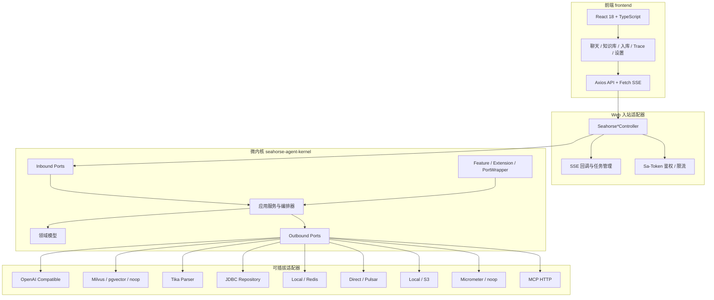
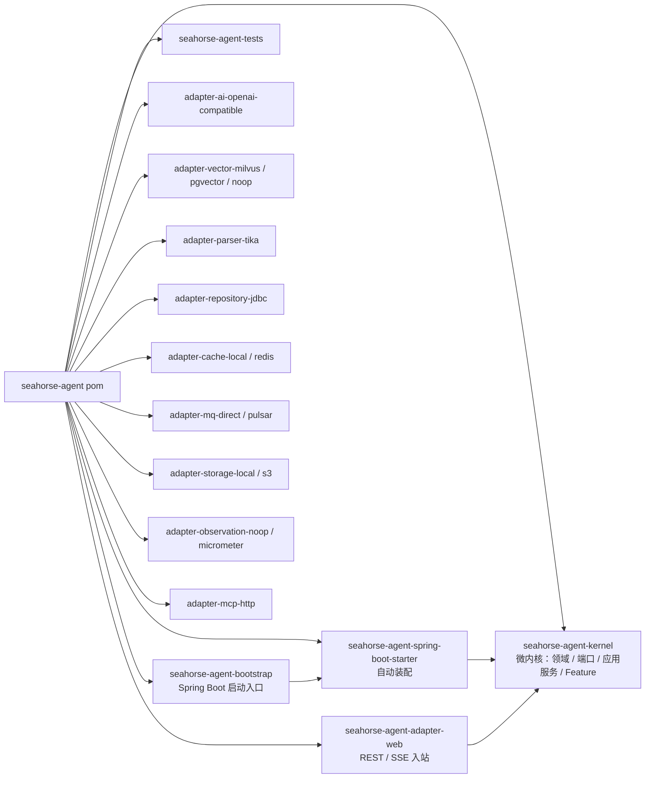
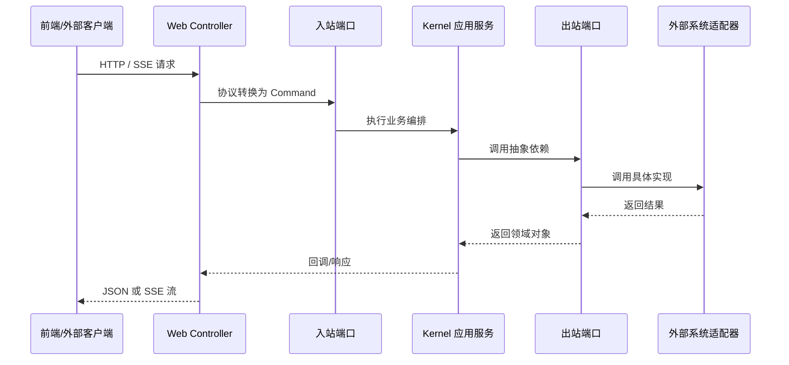
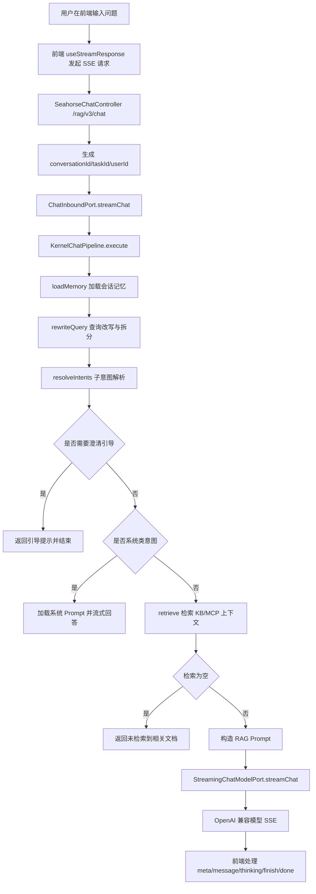
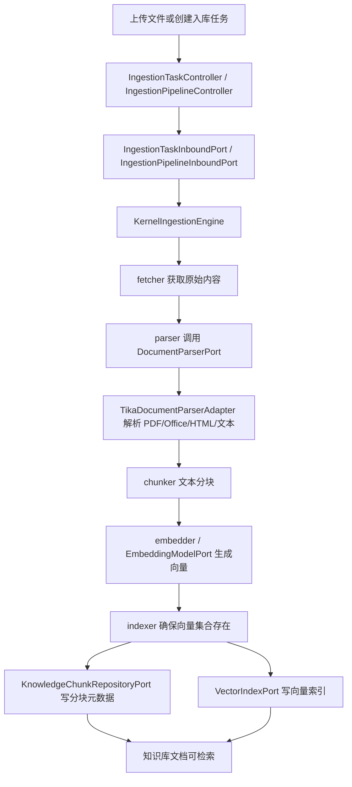
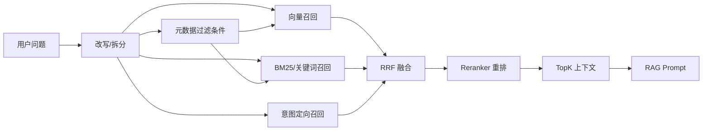
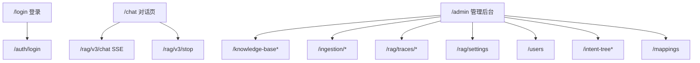

# Seahorse Agent

Seahorse Agent 是一个面向企业知识问答与智能体应用的 RAG（Retrieval-Augmented Generation，检索增强生成）系统。项目以后端微内核为核心，将领域模型、端口契约和核心编排收敛在 `seahorse-agent-kernel`，再通过可插拔适配器接入模型、向量库、缓存、消息队列、对象存储、文档解析、MCP 工具和可观测能力。整体采用 Spring Boot 3 + Java 17 的多模块架构，并配套 React + TypeScript 前端，围绕知识库管理、文档入库、向量检索、意图解析、会话记忆、流式对话和 RAG Trace 构建完整的 AI 应用工程化链路。

## 项目亮点

- **微内核架构**：`seahorse-agent-kernel` 只保留稳定的领域模型、端口接口、应用服务、Feature 扩展点和主链路编排，把外部依赖全部隔离到适配器模块。
- **可插拔适配器体系**：AI 模型、向量库、缓存、消息队列、对象存储、文档解析、可观测、MCP 等能力均通过端口契约接入，可在本地、noop、远程服务和生产级实现之间切换。
- **完整 RAG 闭环**：覆盖文档上传、解析、分块、Embedding、向量索引、意图检索、上下文组装、Prompt 构造和大模型流式回答。
- **OpenAI 兼容模型接入**：`OpenAiCompatibleModelAdapter` 支持 Chat、Streaming Chat、Embedding、Rerank、模型发现和健康检查，可接入 OpenAI 兼容协议的模型服务。
- **多向量后端**：提供 Milvus、pgvector 和 noop 向量适配器，`MilvusVectorAdapter` 实现基于 `id/content/metadata/embedding` 字段模型和 HNSW 索引。
- **可配置文档入库 Pipeline**：`KernelIngestionEngine` 按节点定义串联执行入库任务，原生节点包括 fetcher、parser、chunker、embedder、indexer、enhancer、enricher 等。
- **企业级治理能力**：内置 Sa-Token 鉴权、用户/会话管理、限流、任务取消、消息反馈、RAG Trace、插件健康检查、内存治理与定时刷新。
- **现代化管理前端**：前端提供聊天、知识库、文档分块、意图树、入库流水线、RAG 追踪、系统设置、样例问题、术语映射和用户管理页面。

## 技术栈分析

### 后端

| 分类 | 技术 |
| --- | --- |
| 基础框架 | Java 17+、Spring Boot 3.5.7、Spring Scheduling |
| 构建与模块 | Maven 多模块、微内核 + 可插拔适配器、Spring Boot Starter 自动装配 |
| 数据访问 | MyBatis Plus 3.5.14、JDBC Adapter、PostgreSQL 脚本 |
| 认证授权 | Sa-Token 1.43.0、Sa-Token Redis Template |
| 缓存与协调 | Redisson 4.0.0、Redis、本地缓存、分布式锁/信号量端口 |
| 消息队列 | Apache Pulsar 3.1.3、Direct MQ、Outbox Relay |
| AI 模型 | OpenAI Compatible HTTP Adapter、OkHttp 4.12.0 |
| 向量检索 | Milvus SDK 2.6.6、pgvector、noop vector |
| 文档解析 | Apache Tika 3.2.3，支持 PDF、Word、Excel、PPT、HTML、Markdown、TXT 等常见格式 |
| 对象存储 | 本地存储、AWS S3 SDK 2.40.2 / S3 兼容存储 |
| 可观测性 | Micrometer Adapter、noop observation、RAG Trace |
| 工具库 | Lombok、Jackson、Hutool、Transmittable Thread Local、Mockito、Surefire、Spotless |

### 前端

| 分类 | 技术 |
| --- | --- |
| 基础框架 | React 18.3.1、TypeScript 5.5.4、Vite 5.4.3 |
| UI 与样式 | TailwindCSS 3.4.10、Radix UI、lucide-react、class-variance-authority、tailwind-merge |
| 状态与路由 | Zustand、React Router DOM 6 |
| 数据访问 | Axios、Fetch SSE、自定义流式响应 Hook |
| 表单与校验 | React Hook Form、Zod、@hookform/resolvers |
| Markdown 与代码 | react-markdown、remark-gfm、react-syntax-highlighter |
| 表格与图表 | TanStack React Table、Recharts |
| 体验组件 | Sonner、React Dropzone、React Virtuoso |
| 工程化 | ESLint、Prettier、PostCSS、Autoprefixer |

## AI 能力

Seahorse Agent 的 AI 能力由内核编排和出站端口共同组成：

- **智能对话**：`ChatInboundPort` 接收外部请求，`KernelChatPipeline` 负责编排会话记忆、查询改写、意图解析、检索增强和流式响应。
- **OpenAI 兼容大模型适配**：模型适配器调用 `/chat/completions`、`/embeddings`、`/rerank`，支持普通对话、SSE 流式输出、Embedding、Rerank、模型列表和健康判断。
- **向量检索**：`VectorSearchPort` 抽象检索能力，`MilvusVectorAdapter` 使用 FloatVector 字段、HNSW 索引和可配置 metric；pgvector Adapter 适合 PostgreSQL 向量化部署。
- **知识库问答**：知识库、文档和分块通过仓储端口持久化，分块内容写入向量库后可被 RAG 检索链路召回。
- **意图解析与引导**：查询先经过 rewrite/split，再解析为子意图；当意图存在歧义时可返回引导提示，系统类意图可走系统提示回答。
- **会话记忆**：`ConversationMemoryPort` 加载历史消息并追加用户输入，配合短期、长期、语义、工作记忆等端口支持上下文延续。
- **深度思考开关**：聊天接口支持 `deepThinking` 参数，最终传入模型采样选项，前端可处理 thinking 类型流式事件。
- **MCP 工具扩展**：MCP HTTP 适配器、工具注册和参数抽取端口为工具调用与外部能力编排预留扩展点。

## 系统架构

项目后端以“微内核 + 端口适配器 + 插件扩展”组织。微内核位于 `seahorse-agent-kernel`，负责稳定的业务语义和主流程编排；外部系统对接位于 `seahorse-agent-adapter-*`，以独立模块实现端口；Web 入口位于 `seahorse-agent-adapter-web`，自动装配由 `seahorse-agent-spring-boot-starter` 提供，运行入口由 `seahorse-agent-bootstrap` 提供。

### 微内核与可插拔设计

Seahorse Agent 的微内核不是一个“大而全”的服务层，而是一组稳定边界：

- **领域与流程内核**：`KernelChatPipeline`、`KernelIngestionEngine`、知识库服务、记忆服务、模型路由服务等保留在内核中，负责业务规则和流程编排。
- **端口契约**：内核通过 `ChatModelPort`、`StreamingChatModelPort`、`EmbeddingModelPort`、`VectorSearchPort`、`DocumentParserPort`、`ObjectStoragePort`、`MessageQueuePort`、`ObservationPort` 等端口访问外部能力。
- **适配器插件**：具体实现放在独立适配器模块，例如 `OpenAiCompatibleModelAdapter`、`MilvusVectorAdapter`、`TikaDocumentParserAdapter`、Redis/Pulsar/S3/Micrometer/MCP 适配器。
- **Feature 扩展点**：检索通道、入库节点、MCP 工具等以 Feature 形式注册，支持在不侵入主链路的情况下扩展能力。
- **PortWrapper 横切增强**：`PortWrapper` / `PortWrapperChain` 可为端口调用叠加观测、限流、重试、熔断、审计等治理能力。

这种设计让开发环境可以使用 local/noop 适配器快速运行，生产环境再替换为 Redis、Pulsar、Milvus、S3、Micrometer 或 OpenAI 兼容模型服务，而内核编排逻辑保持不变。



### 后端模块关系



### 端口适配器模式



## 核心链路

### 1. 流式智能对话链路

`SeahorseChatController` 暴露 `GET /rag/v3/chat`，返回 `text/event-stream;charset=UTF-8`。接口支持 `question`、`conversationId`、`userId`、`deepThinking` 参数，并通过 `RateLimiterPort` 做聊天限流。用户可以通过 `POST /rag/v3/stop` 停止指定流式任务。



关键设计点：

- RAG 回答温度根据上下文来源调整：MCP 上下文使用更高温度，知识库上下文使用更稳定的低温配置。
- 每个主要阶段可由 `KernelRagTraceRecorder` 记录 trace node，便于定位慢阶段与回答质量问题。
- 前端 SSE 解析支持 `meta`、`message`、`finish`、`done`、`cancel`、`reject`、`title`、`error` 等事件。

### 2. 文档解析与知识入库链路

入库由 `KernelIngestionEngine` 根据 `PipelineDefinition` 执行。引擎查找起始节点，按 `nextNodeId` 串联节点；节点失败会将上下文标记为失败并停止后续执行。



入库节点能力：

- `parser`：识别 PDF、Markdown、Word、Excel、PPT、TXT 等类型，并委托 Tika 或纯文本解析。
- `chunker`：支持 `fixed_size` 和 `structure_aware` 策略，默认分块大小 512、重叠 128。
- `embedder`：通过 `EmbeddingModelPort` 调用模型服务生成向量。
- `indexer`：校验向量维度与 chunkId，确保 collection 存在，写入知识分块仓储与向量索引。
- `enhancer` / `enricher`：为文本增强、元数据补充和后续检索质量优化提供扩展节点。

### 3. 检索增强链路

```mermaid
flowchart LR
    Q["用户问题"] --> RW["查询改写/拆分"]
    RW --> Intent["意图解析"]
    Intent --> Engine["KernelMultiChannelRetrievalEngine"]
    Engine --> Search["SearchChannelFeature 多路检索通道"]
    Search --> V1["IntentDirectedSearchFeature"]
    Search --> V2["VectorGlobalSearchFeature"]
    V1 --> VP["VectorSearchPort"]
    V2 --> VP
    VP --> Milvus["Milvus / pgvector"]
    Milvus --> Chunks["RetrievedChunk"]
    Chunks --> Post["SearchResultPostProcessorFeature 后处理链"]
    Post --> Format["RetrievalContextFormatPort"]
    Format --> Prompt["RagPromptPort"]
    Prompt --> LLM["StreamingChatModelPort"]
```



检索层由 `KernelMultiChannelRetrievalEngine` 负责多路检索编排：它从扩展注册表中加载已激活的 `SearchChannelFeature`，并行执行多个检索通道，合并各通道召回结果，再按顺序执行 `SearchResultPostProcessorFeature` 后处理链。当前默认通道包括 `IntentDirectedSearchFeature`（意图定向检索）和 `VectorGlobalSearchFeature`（全局向量检索）；召回结果进入 `RetrievalContext` 后再由 Prompt 端口构造成结构化消息，最终交给模型端口流式生成回答。

### 4. 混合检索规划/扩展方向

当前代码已具备 `KernelMultiChannelRetrievalEngine` 多路检索编排、向量检索主链路、`SearchChannelFeature` 多通道扩展点、`SearchResultPostProcessorFeature` 后处理扩展点、`VectorSearchRequest.filters` 过滤字段和 `RerankModelPort` / OpenAI 兼容 rerank 模型端口；但 RRF、BM25、完整元数据过滤和 reranker 后处理器尚未作为完整链路落地。推荐后续按以下方向扩展：

| 能力 | 当前状态 | 扩展方向 |
| --- | --- | --- |
| 向量检索 | 已支持。`IntentDirectedSearchFeature` 与 `VectorGlobalSearchFeature` 通过 `VectorSearchPort` 调用 Milvus/pgvector/noop 适配器。 | 保持作为默认召回通道，并补齐 embedding 生成与检索请求之间的统一向量化策略。 |
| BM25 / 关键词检索 | 规划中。当前未发现独立 BM25 检索通道。 | 新增 `SearchChannelFeature` 实现，例如 `Bm25SearchFeature`，对接 PostgreSQL 全文索引、Lucene/OpenSearch/Elasticsearch 或轻量本地倒排索引。 |
| RRF 结果融合 | 规划中。当前多通道结果会合并，但未实现 Reciprocal Rank Fusion。 | 新增 `SearchResultPostProcessorFeature`，按通道排名执行 `score = sum(1 / (k + rank_i))`，融合向量、BM25、意图定向等多路召回。 |
| 元数据过滤 | 部分基础能力。`VectorSearchRequest` 已有 `filters` 字段，向量数据会写入 metadata；当前 Milvus/pgvector 搜索实现尚未消费通用 filters。 | 在 `MilvusVectorAdapter` 与 `PgVectorAdapter` 中把 `filters` 转换为 Milvus filter 表达式或 PostgreSQL JSONB 条件，支持部门、文档类型、权限、时间范围等过滤。 |
| Reranker | 模型端口已支持。`OpenAiCompatibleModelAdapter` 实现 `/rerank`，但检索后处理链路中未发现默认 reranker processor。 | 新增 `RerankPostProcessorFeature`，在 RRF 或初排后调用 `RerankModelPort`，按 relevance score 重排并截断 topK。 |

目标形态：



### 4. 前后端交互链路



前端通过 Axios 实例统一设置 `VITE_API_BASE_URL`、鉴权头和业务错误处理；SSE 对话使用 Fetch 流式读取，支持中断和指数退避重试。

## 目录结构

```text
.
├── frontend/                                      # React + TypeScript 前端
├── seahorse-agent-kernel/                         # 内核：领域模型、端口、应用服务、Feature、插件机制
├── seahorse-agent-adapter-web/                    # Web 入站适配器：REST、SSE、认证、管理接口
├── seahorse-agent-adapter-ai-openai-compatible/   # OpenAI 兼容模型适配器
├── seahorse-agent-adapter-vector-milvus/          # Milvus 向量库适配器
├── seahorse-agent-adapter-vector-pgvector/        # pgvector 向量库适配器
├── seahorse-agent-adapter-vector-noop/            # 空向量实现
├── seahorse-agent-adapter-parser-tika/            # Apache Tika 文档解析适配器
├── seahorse-agent-adapter-repository-jdbc/        # JDBC 仓储适配器
├── seahorse-agent-adapter-cache-local/            # 本地缓存适配器
├── seahorse-agent-adapter-cache-redis/            # Redis/Redisson 缓存与协调适配器
├── seahorse-agent-adapter-mq-direct/              # 进程内消息队列适配器
├── seahorse-agent-adapter-mq-pulsar/              # Pulsar 消息队列适配器
├── seahorse-agent-adapter-storage-local/          # 本地对象存储适配器
├── seahorse-agent-adapter-storage-s3/             # S3 兼容对象存储适配器
├── seahorse-agent-adapter-observation-*           # 可观测适配器
├── seahorse-agent-adapter-mcp-http/               # MCP HTTP 适配器
├── seahorse-agent-spring-boot-starter/            # 自动装配与运行时配置
├── seahorse-agent-bootstrap/                      # Spring Boot 应用启动入口
├── seahorse-agent-tests/                          # 测试模块
├── resources/                                     # 数据库脚本、Docker Compose、示例知识文档
└── docs/                                          # 中文架构、部署、接口、测试与开发文档
```

## 快速开始

### 后端

```bash
mvn clean test
mvn -pl seahorse-agent-bootstrap -am spring-boot:run
```

默认启动类为 `com.miracle.ai.seahorse.agent.SeahorseAgentApplication`，扫描 `com.miracle.ai.seahorse.agent` 命名空间并启用调度。基础配置位于：

- `seahorse-agent-bootstrap/src/main/resources/application.properties`
- `seahorse-agent-spring-boot-starter/src/main/resources/application.properties`
- `resources/database/`
- `resources/docker/`

### 前端

```bash
cd frontend
npm install
npm run dev
```

如需指定后端地址，可配置 `VITE_API_BASE_URL`。

## 参考文档

- `docs/zh/content/项目概述.md`
- `docs/zh/content/架构设计/端口适配器模式.md`
- `docs/zh/content/后端系统/核心内核/核心内核.md`
- `docs/zh/content/后端系统/适配器模块/适配器模块.md`
- `docs/zh/content/前端系统/前端系统.md`
- `docs/zh/content/API 接口文档/API 接口文档.md`
- `resources/docker/lightweight/README.md`

## License

本项目采用 Apache License 2.0，详见 `LICENSE`。
